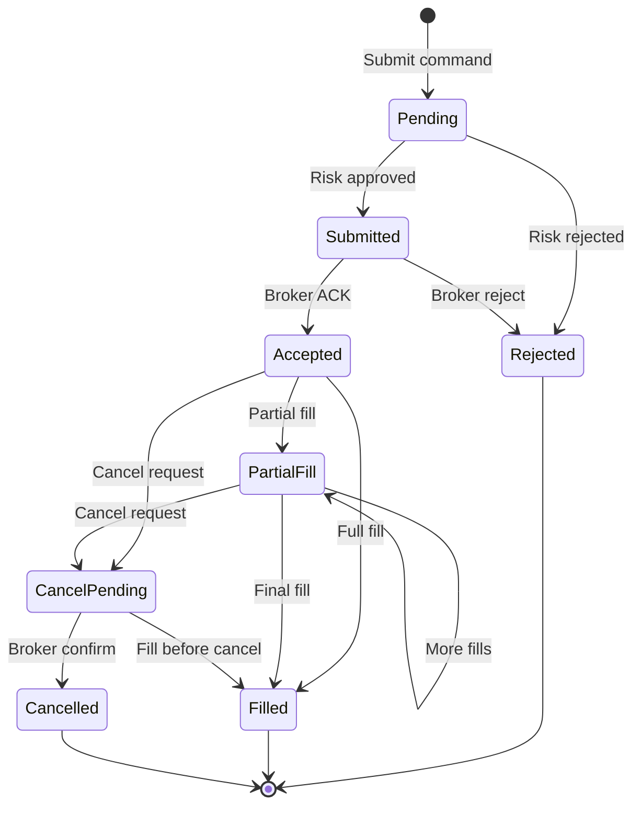
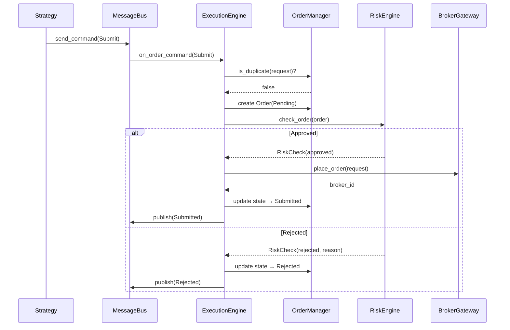
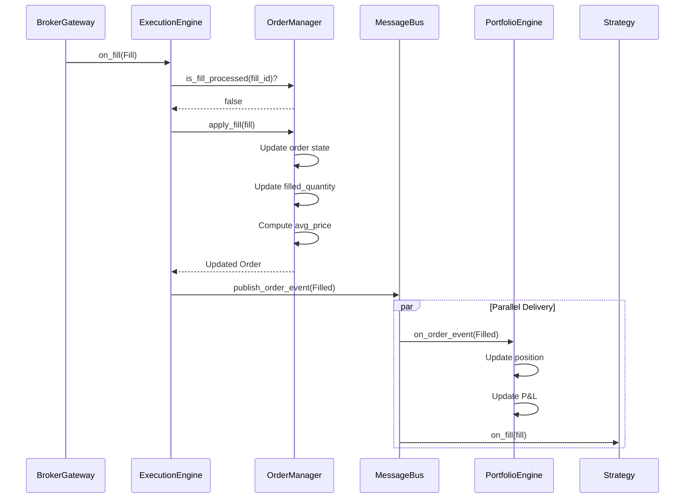

# 06 — Execution Engine

**Version:** 1.0  
**Status:** Draft  
**Last Updated:** 2026-07-22  
**Related:** [04-Message Bus](./04-message-driven-architecture.md), [07-Strategy System](./07-strategy-system.md), [08-Adapter System](./08-adapter-system.md), [09-Risk Management](./09-risk-management.md)

---

## 1. Overview

### Purpose

The Execution Engine is the **heart of the framework** — it owns the order lifecycle, position tracking, and risk enforcement. It runs identically in backtest and live modes (zero-parity).

### Responsibilities

| Responsibility | Description |
|----------------|-------------|
| **Order Lifecycle** | Submit → Accept → Fill/Cancel state machine |
| **Risk Enforcement** | Pre-trade checks before broker submission |
| **Idempotency** | Duplicate order detection and handling |
| **Fill Processing** | Apply fills to positions and portfolio |
| **Algorithm Execution** | TWAP, VWAP, Iceberg order slicing |
| **Reconciliation** | Sync local state with broker state |

### Key Principle

> The ExecutionEngine doesn't know if it's running against a simulator or a live broker. Zero-parity is structural, not aspirational.

---

## 2. Requirements

### Functional

| ID | Requirement |
|----|-------------|
| FR-01 | Accept order commands from strategies via message bus |
| FR-02 | Validate orders against risk limits before submission |
| FR-03 | Submit orders to broker gateway |
| FR-04 | Track order state through full lifecycle |
| FR-05 | Process fills and update positions |
| FR-06 | Support order cancellation and modification |
| FR-07 | Detect and reject duplicate orders (idempotency) |
| FR-08 | Execute algorithmic orders (TWAP, VWAP, Iceberg) |
| FR-09 | Reconcile local state with broker periodically |

### Non-Functional

| ID | Requirement | Target |
|----|-------------|--------|
| NFR-01 | Order submission latency | < 5ms (framework overhead) |
| NFR-02 | Fill processing latency | < 1ms |
| NFR-03 | Idempotency check | < 100μs |
| NFR-04 | Zero lost orders | Guaranteed (idempotency + reconciliation) |

---

## 3. Order State Machine

### State Diagram



### Order States

```rust
/// Order lifecycle states
#[derive(Clone, Copy, Debug, PartialEq, Eq)]
pub enum OrderState {
    /// Order created, pending risk check
    Pending,
    /// Submitted to broker (risk approved)
    Submitted,
    /// Accepted by broker
    Accepted,
    /// Partially filled
    PartialFill,
    /// Fully filled
    Filled,
    /// Cancel requested, pending broker confirmation
    CancelPending,
    /// Cancelled
    Cancelled,
    /// Rejected (by risk or broker)
    Rejected,
}

impl OrderState {
    /// Check if state is terminal
    pub fn is_terminal(&self) -> bool {
        matches!(self, OrderState::Filled | OrderState::Cancelled | OrderState::Rejected)
    }
    
    /// Check if state allows cancellation
    pub fn is_cancellable(&self) -> bool {
        matches!(self, OrderState::Submitted | OrderState::Accepted | OrderState::PartialFill)
    }
}
```

### Valid Transitions

| From | To | Trigger |
|------|-----|---------|
| Pending | Submitted | Risk approved |
| Pending | Rejected | Risk rejected |
| Submitted | Accepted | Broker ACK |
| Submitted | Rejected | Broker reject |
| Accepted | PartialFill | Partial fill received |
| Accepted | Filled | Full fill received |
| Accepted | CancelPending | Cancel requested |
| PartialFill | PartialFill | Additional fill |
| PartialFill | Filled | Final fill |
| PartialFill | CancelPending | Cancel requested |
| CancelPending | Cancelled | Broker confirm |
| CancelPending | Filled | Fill before cancel |

---

## 4. Core Types

### Order

```rust
/// Unique order identifier
#[derive(Clone, Debug, PartialEq, Eq, Hash)]
pub struct OrderId(pub String);

/// Complete order record
#[derive(Clone, Debug)]
pub struct Order {
    /// Unique identifier
    pub id: OrderId,
    /// Broker's order ID (after submission)
    pub broker_id: Option<String>,
    /// Instrument
    pub symbol: Symbol,
    /// Buy or Sell
    pub side: Side,
    /// Order type
    pub order_type: OrderType,
    /// Requested quantity
    pub quantity: Quantity,
    /// Filled quantity
    pub filled_quantity: Quantity,
    /// Limit price (for limit orders)
    pub price: Option<Price>,
    /// Trigger price (for stop orders)
    pub trigger: Option<Price>,
    /// Time in force
    pub validity: TimeInForce,
    /// Current state
    pub state: OrderState,
    /// Strategy that created this order
    pub strategy_id: StrategyId,
    /// Strategy tag for attribution
    pub tag: String,
    /// Creation timestamp
    pub created_at: Timestamp,
    /// Last update timestamp
    pub updated_at: Timestamp,
    /// Average fill price
    pub avg_fill_price: Option<Price>,
    /// Rejection reason (if rejected)
    pub reject_reason: Option<String>,
}

impl Order {
    /// Check if order is fully filled
    pub fn is_filled(&self) -> bool {
        self.filled_quantity >= self.quantity
    }
    
    /// Remaining quantity
    pub fn remaining(&self) -> Quantity {
        Quantity(self.quantity.0.saturating_sub(self.filled_quantity.0))
    }
}
```

### Fill

```rust
/// Fill (trade execution) record
#[derive(Clone, Debug)]
pub struct Fill {
    /// Unique fill identifier
    pub fill_id: String,
    /// Order this fill belongs to
    pub order_id: OrderId,
    /// Instrument
    pub symbol: Symbol,
    /// Buy or Sell
    pub side: Side,
    /// Filled quantity
    pub quantity: Quantity,
    /// Fill price
    pub price: Price,
    /// Timestamp
    pub at: Timestamp,
    /// Liquidity flag (maker/taker)
    pub liquidity: LiquidityFlag,
}

/// Liquidity flag
#[derive(Clone, Copy, Debug, PartialEq, Eq)]
pub enum LiquidityFlag {
    /// Added liquidity (maker)
    Maker,
    /// Removed liquidity (taker)
    Taker,
    /// Unknown
    Unknown,
}
```

---

## 5. ExecutionEngine Component

### Implementation

```rust
/// Execution Engine — processes order commands and manages order lifecycle.
///
/// This is a Component that:
/// - Subscribes to OrderCommand messages (via mpsc)
/// - Validates orders against RiskEngine
/// - Submits to BrokerGateway
/// - Publishes OrderEvent updates
pub struct ExecutionEngine {
    /// Component state
    state: ComponentState,
    /// Order manager (FSM + idempotency)
    order_manager: OrderManager,
    /// Risk engine reference
    risk_engine: Arc<RiskEngine>,
    /// Broker gateway
    gateway: Arc<dyn BrokerGateway>,
    /// Message bus
    bus: Arc<MessageBus>,
    /// Clock
    clock: Arc<dyn Clock>,
    /// Algorithm executor
    algo_executor: AlgorithmExecutor,
}

impl ExecutionEngine {
    pub fn new(
        risk_engine: Arc<RiskEngine>,
        gateway: Arc<dyn BrokerGateway>,
        bus: Arc<MessageBus>,
        clock: Arc<dyn Clock>,
    ) -> Self {
        ExecutionEngine {
            state: ComponentState::Created,
            order_manager: OrderManager::new(),
            risk_engine,
            gateway,
            bus,
            clock,
            algo_executor: AlgorithmExecutor::new(),
        }
    }
    
    /// Process an incoming order command
    pub async fn on_order_command(&mut self, cmd: OrderCommand) -> Result<(), ExecutionError> {
        match cmd {
            OrderCommand::Submit { at, request, strategy_id } => {
                self.handle_submit(at, request, strategy_id).await
            }
            OrderCommand::Cancel { at, order_id, reason } => {
                self.handle_cancel(at, order_id, reason).await
            }
            OrderCommand::Modify { at, order_id, new_price, new_quantity } => {
                self.handle_modify(at, order_id, new_price, new_quantity).await
            }
        }
    }
    
    /// Handle new order submission
    async fn handle_submit(
        &mut self,
        at: Timestamp,
        request: OrderRequest,
        strategy_id: StrategyId,
    ) -> Result<(), ExecutionError> {
        // 1. Idempotency check
        if self.order_manager.is_duplicate(&request) {
            tracing::warn!(?request, "duplicate order rejected");
            return Ok(()); // Silently ignore duplicates
        }
        
        // 2. Create order record
        let order_id = OrderId::generate();
        let mut order = Order::new(order_id.clone(), request, strategy_id, at);
        
        // 3. Pre-trade risk check
        let risk_check = self.risk_engine.check_order(&order);
        if !risk_check.approved {
            order.state = OrderState::Rejected;
            order.reject_reason = Some(risk_check.reason.clone());
            self.order_manager.register(order);
            
            self.bus.publish_order_event(OrderEvent::Rejected {
                at: self.clock.now(),
                order_id,
                reason: risk_check.reason,
            });
            return Ok(());
        }
        
        // 4. Submit to broker
        match self.gateway.place_order(&order.to_request()).await {
            Ok(broker_id) => {
                order.broker_id = Some(broker_id);
                order.state = OrderState::Submitted;
                self.order_manager.register(order);
                
                self.bus.publish_order_event(OrderEvent::Submitted {
                    at: self.clock.now(),
                    order_id,
                    symbol: request.symbol,
                    side: request.side,
                    quantity: request.quantity,
                });
            }
            Err(e) => {
                order.state = OrderState::Rejected;
                order.reject_reason = Some(e.to_string());
                self.order_manager.register(order);
                
                self.bus.publish_order_event(OrderEvent::Rejected {
                    at: self.clock.now(),
                    order_id,
                    reason: e.to_string(),
                });
            }
        }
        
        Ok(())
    }
    
    /// Handle fill from broker
    pub async fn on_fill(&mut self, fill: Fill) -> Result<(), ExecutionError> {
        // 1. Idempotency check (by fill_id)
        if self.order_manager.is_fill_processed(&fill.fill_id) {
            tracing::warn!(fill_id = %fill.fill_id, "duplicate fill ignored");
            return Ok(());
        }
        
        // 2. Apply fill to order
        let order = self.order_manager.apply_fill(&fill)?;
        
        // 3. Publish fill event
        self.bus.publish_order_event(OrderEvent::Filled {
            at: fill.at,
            order_id: fill.order_id,
            symbol: fill.symbol,
            side: fill.side,
            quantity: fill.quantity,
            price: fill.price,
            is_full: order.is_filled(),
        });
        
        Ok(())
    }
}
```

---

## 6. OrderManager

### Purpose

The OrderManager maintains order state and enforces the FSM:

```rust
/// Manages order lifecycle and state transitions
pub struct OrderManager {
    /// Active orders by ID
    orders: HashMap<OrderId, Order>,
    /// Orders by broker ID (for fill matching)
    by_broker_id: HashMap<String, OrderId>,
    /// Processed fill IDs (idempotency)
    processed_fills: HashSet<String>,
    /// Order fingerprints (duplicate detection)
    fingerprints: HashSet<u64>,
}

impl OrderManager {
    pub fn new() -> Self {
        OrderManager {
            orders: HashMap::new(),
            by_broker_id: HashMap::new(),
            processed_fills: HashSet::new(),
            fingerprints: HashSet::new(),
        }
    }
    
    /// Check if order is duplicate (same symbol, side, quantity, price within window)
    pub fn is_duplicate(&self, request: &OrderRequest) -> bool {
        let fingerprint = Self::compute_fingerprint(request);
        self.fingerprints.contains(&fingerprint)
    }
    
    /// Register a new order
    pub fn register(&mut self, order: Order) {
        let fingerprint = Self::compute_fingerprint(&order.to_request());
        self.fingerprints.insert(fingerprint);
        
        if let Some(ref broker_id) = order.broker_id {
            self.by_broker_id.insert(broker_id.clone(), order.id.clone());
        }
        
        self.orders.insert(order.id.clone(), order);
    }
    
    /// Apply a fill to an order
    pub fn apply_fill(&mut self, fill: &Fill) -> Result<Order, ExecutionError> {
        // Idempotency
        if self.processed_fills.contains(&fill.fill_id) {
            return Err(ExecutionError::DuplicateFill(fill.fill_id.clone()));
        }
        self.processed_fills.insert(fill.fill_id.clone());
        
        // Find order
        let order = self.orders.get_mut(&fill.order_id)
            .ok_or_else(|| ExecutionError::OrderNotFound(fill.order_id.clone()))?;
        
        // Validate state transition
        if order.state.is_terminal() {
            return Err(ExecutionError::InvalidStateTransition {
                order_id: fill.order_id.clone(),
                from: order.state,
                to: OrderState::Filled,
            });
        }
        
        // Apply fill
        order.filled_quantity = Quantity(order.filled_quantity.0 + fill.quantity.0);
        order.updated_at = fill.at;
        
        // Update average fill price
        order.avg_fill_price = Some(Self::compute_avg_price(order, fill));
        
        // Update state
        order.state = if order.is_filled() {
            OrderState::Filled
        } else {
            OrderState::PartialFill
        };
        
        Ok(order.clone())
    }
    
    /// Compute order fingerprint for duplicate detection
    fn compute_fingerprint(request: &OrderRequest) -> u64 {
        use std::collections::hash_map::DefaultHasher;
        use std::hash::{Hash, Hasher};
        
        let mut hasher = DefaultHasher::new();
        request.symbol.hash(&mut hasher);
        request.side.hash(&mut hasher);
        request.quantity.hash(&mut hasher);
        request.price.hash(&mut hasher);
        hasher.finish()
    }
}
```

---

## 7. Execution Algorithms

### Algorithm Types

```rust
/// Execution algorithm types
#[derive(Clone, Debug)]
pub enum AlgorithmType {
    /// Time-Weighted Average Price
    Twap(TwapConfig),
    /// Volume-Weighted Average Price
    Vwap(VwapConfig),
    /// Iceberg (hidden quantity)
    Iceberg(IcebergConfig),
}

/// TWAP configuration
#[derive(Clone, Debug)]
pub struct TwapConfig {
    /// Total duration
    pub duration: Duration,
    /// Number of slices
    pub slices: u32,
    /// Interval between slices
    pub interval: Duration,
}

/// VWAP configuration
#[derive(Clone, Debug)]
pub struct VwapConfig {
    /// Participation rate (0.0 - 1.0)
    pub participation_rate: f64,
    /// Maximum order size per slice
    pub max_slice_size: Quantity,
}

/// Iceberg configuration
#[derive(Clone, Debug)]
pub struct IcebergConfig {
    /// Visible quantity
    pub visible_quantity: Quantity,
    /// Total quantity (hidden)
    pub total_quantity: Quantity,
}
```

### Algorithm Executor

```rust
/// Executes algorithmic orders by slicing into child orders
pub struct AlgorithmExecutor {
    /// Active algorithms
    active: HashMap<OrderId, ActiveAlgorithm>,
}

struct ActiveAlgorithm {
    parent_order: Order,
    algorithm: AlgorithmType,
    slices_sent: u32,
    quantity_filled: Quantity,
    next_slice_at: Timestamp,
}

impl AlgorithmExecutor {
    /// Start an algorithmic order
    pub fn start(&mut self, order: Order, algorithm: AlgorithmType) {
        let next_slice_at = /* compute first slice time */;
        self.active.insert(order.id.clone(), ActiveAlgorithm {
            parent_order: order,
            algorithm,
            slices_sent: 0,
            quantity_filled: Quantity(0),
            next_slice_at,
        });
    }
    
    /// Check if slice is due and emit child order
    pub fn on_tick(&mut self, at: Timestamp) -> Option<OrderRequest> {
        for algo in self.active.values_mut() {
            if at >= algo.next_slice_at && !algo.is_complete() {
                let slice = algo.compute_next_slice();
                algo.slices_sent += 1;
                algo.next_slice_at = algo.compute_next_slice_time();
                return Some(slice);
            }
        }
        None
    }
}
```

---

## 8. Sequence Diagrams

### Order Submission Flow



### Fill Processing Flow



---

## 9. Configuration

```yaml
# config/execution.yaml
execution:
  # Order manager
  order_manager:
    # Duplicate detection window
    duplicate_window_secs: 5
    # Maximum active orders
    max_active_orders: 100
    
  # Reconciliation
  reconciliation:
    enabled: true
    interval_secs: 60
    
  # Algorithms
  algorithms:
    twap:
      default_slices: 10
      min_interval_secs: 30
    vwap:
      max_participation_rate: 0.1
    iceberg:
      min_visible_quantity: 100
```

---

## 10. Error Handling

```rust
/// Execution engine errors
#[derive(Debug, thiserror::Error)]
pub enum ExecutionError {
    /// Order not found
    #[error("order not found: {0}")]
    OrderNotFound(OrderId),
    
    /// Duplicate fill received
    #[error("duplicate fill: {0}")]
    DuplicateFill(String),
    
    /// Invalid state transition
    #[error("invalid state transition for order {order_id}: {from} → {to}")]
    InvalidStateTransition {
        order_id: OrderId,
        from: OrderState,
        to: OrderState,
    },
    
    /// Risk check failed
    #[error("risk check failed: {0}")]
    RiskRejected(String),
    
    /// Broker submission failed
    #[error("broker submission failed: {0}")]
    BrokerError(String),
    
    /// Gateway not available
    #[error("gateway not available")]
    GatewayUnavailable,
}
```

---

## 11. Testing Requirements

### Unit Tests

```rust
#[test]
fn order_state_machine_transitions() {
    let mut order = Order::new(/* ... */);
    assert_eq!(order.state, OrderState::Pending);
    
    // Pending → Submitted
    order.state = OrderState::Submitted;
    assert!(order.state.is_cancellable());
    
    // Submitted → Accepted
    order.state = OrderState::Accepted;
    
    // Accepted → PartialFill
    order.filled_quantity = Quantity(5);
    order.state = OrderState::PartialFill;
    assert!(!order.is_filled());
    
    // PartialFill → Filled
    order.filled_quantity = order.quantity;
    order.state = OrderState::Filled;
    assert!(order.is_filled());
    assert!(order.state.is_terminal());
}

#[test]
fn duplicate_order_detection() {
    let mut om = OrderManager::new();
    let request = OrderRequest::new(/* ... */);
    
    assert!(!om.is_duplicate(&request));
    
    om.register(Order::new(/* with same request */));
    
    assert!(om.is_duplicate(&request));
}

#[test]
fn fill_idempotency() {
    let mut om = OrderManager::new();
    om.register(test_order());
    
    let fill = test_fill();
    om.apply_fill(&fill).unwrap();
    
    // Second application should fail
    assert!(matches!(
        om.apply_fill(&fill),
        Err(ExecutionError::DuplicateFill(_))
    ));
}
```

### Integration Tests

```rust
#[tokio::test]
async fn full_order_lifecycle() {
    let gateway = Arc::new(MockGateway::new());
    let risk = Arc::new(RiskEngine::permissive());
    let bus = Arc::new(MessageBus::new(16));
    let clock = Arc::new(LiveClock);
    
    let mut ee = ExecutionEngine::new(risk, gateway, bus.clone(), clock);
    
    // Submit order
    let cmd = OrderCommand::Submit {
        at: ts(),
        request: test_request(),
        strategy_id: StrategyId("test".into()),
    };
    ee.on_order_command(cmd).await.unwrap();
    
    // Verify submitted event
    let mut rx = bus.subscribe_order_events();
    assert!(matches!(rx.recv().await, Ok(OrderEvent::Submitted { .. })));
    
    // Simulate fill
    ee.on_fill(test_fill()).await.unwrap();
    
    // Verify filled event
    assert!(matches!(rx.recv().await, Ok(OrderEvent::Filled { .. })));
}
```

---

## 12. Implementation Notes

### Performance

1. **Hot path**: `on_fill()` should be < 1ms — avoid allocations
2. **Idempotency**: Use `HashSet<u64>` for O(1) duplicate detection
3. **Order lookup**: Use `HashMap<OrderId, Order>` for O(1) access

### Gotchas

1. **Race conditions**: Fill may arrive before Submitted event — handle gracefully
2. **Partial fills**: Track `filled_quantity` separately from `quantity`
3. **Cancel vs Fill race**: Order may fill while cancel is pending
4. **Broker ID mapping**: Maintain `broker_id → order_id` index for fill matching

---

## 13. Cross-References

- [04-Message Bus](./04-message-driven-architecture.md) — Command/event channels
- [07-Strategy System](./07-strategy-system.md) — Signal → Order bridge
- [08-Adapter System](./08-adapter-system.md) — BrokerGateway interface
- [09-Risk Management](./09-risk-management.md) — Pre-trade checks
- [10-Portfolio Construction](./10-portfolio-construction.md) — Position updates
