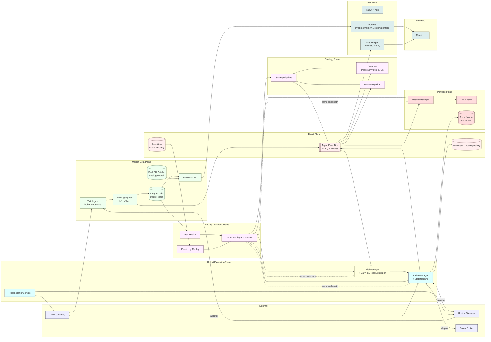

# TradeXV2 — Whole-Platform Architecture Review

Scope: every layer that affects a live trading decision: market data → strategy → risk → execution → portfolio → broker → frontend, in backtest, replay and live modes.

---

## 1. System Intent (what this system is supposed to do)

A real-time, event-driven quantitative trading platform for Indian markets (NSE / BSE / MCX, via Dhan and Upstox) that supports:

- Historical market data (Parquet lake + DuckDB catalog)
- Intraday scanners and strategy pipelines (`analytics/scanner`, `analytics/strategy`)
- Backtest, deterministic replay, and live trading on **the same strategy code path** ("zero-parity")
- Pre-trade risk gating, idempotent order management, kill-switch
- A web UI (`frontend/`) consuming only server-side events

Explicit non-negotiables (from `BACKEND_API_SPEC.md` / `ENGINEERING_REPORT.md` and from how the OMS was written): the **same** strategy pipeline must run in backtest, replay, and live; OMS must enforce state-machine transitions, idempotency, and risk; kills must be atomic.

---

## 2. Current Architecture Map (evidence-based)

```
                              ┌───────────────────────────┐
                              │  frontend/ (React + WS)   │
                              └─────────────┬─────────────┘
                                            │  HTTP + WS
                                            ▼
       ┌────────────────────────────────────────────────────────────┐
       │  datalake/api/        NEW FastAPI layer  (this branch)     │
       │  ├── main.py          create_app(...) wires a global dict  │
       │  ├── deps.py          _service_registry[name]=instance     │
       │  ├── schemas.py       534 lines of Pydantic contracts      │
       │  ├── routers/         symbols, market, analytics, scanner, │
       │  │                    strategy, options, replay, backtest, │
       │  │                    portfolio, orders, health             │
       │  └── ws/              market.py, replay.py  (sockets)      │
       └────────────┬───────────────────────────────────────────────┘
                    │   (no wiring — see §4)
                    ▼
       ┌────────────────────────────────────────────────────────────┐
       │  Production OMS — completely separate stack                │
       │  brokers/common/oms/                                        │
       │  ├── context.py        TradingContext (OrderManager,       │
       │  │                     PositionManager, RiskManager,       │
       │  │                     ReconciliationService, EventBus)     │
       │  ├── order_manager.py  Thread-safe OMS, idempotency via    │
       │  │                     ProcessedTradeRepository,           │
       │  │                     state-machine validation            │
       │  ├── risk_manager.py   Kill switch, daily loss, position   │
       │  │                     and gross exposure caps             │
       │  ├── position_manager.py                                    │
       │  ├── reconciliation_service.py                             │
       │  └── capital_provider.py, daily_pnl_reset_scheduler.py    │
       │  brokers/common/event_bus/                                  │
       │  ├── event_bus.py      Synchronous thread-safe bus,        │
       │  │                     metrics + DLQ, replay_mode flag     │
       │  ├── event_log.py      Append-only persistence             │
       │  ├── processed_trade_repository.py  (idempotency ledger)   │
       │  ├── dead_letter_queue.py                                   │
       │  └── factory.py                                              │
       │  brokers/common/orchestrator/trading_orchestrator.py       │
       │  brokers/common/lifecycle/lifecycle.py                      │
       └──────┬─────────────────────────┬────────────────────────────┘
              │                         │
              ▼                         ▼
   ┌────────────────────┐   ┌─────────────────────────────────────┐
   │  brokers/upstox/   │   │  brokers/paper/ (in-process sim)    │
   │  brokers/dhan/*    │   │  paper_gateway, paper_orders,       │
   │  (HTTP + WS auth,  │   │  paper_portfolio, paper_market_data │
   │   v2/v3 adapters,  │   └─────────────────────────────────────┘
   │   portfolio_stream)│
   └────────────────────┘
              │
              ▼
   ┌────────────────────────────────────────────────────────────┐
   │  analytics/                                                │
   │  ├── pipeline/         FeaturePipeline (RSI/ATR/SMA/...)    │
   │  ├── strategy/         StrategyPipeline + Signal           │
   │  ├── scanner/runner.py ScannerRunner (independent)         │
   │  ├── backtest/engine.py  BacktestEngine -> ReplayEngine     │
   │  ├── replay/engine.py    bar-by-bar; OMS-backed via         │
   │  │                      OmsBacktestAdapter (P0-2) or        │
   │  │                      legacy SimulatedPosition            │
   │  ├── replay/orchestrator.py  unified bar+event replay      │
   │  │                         (still a placeholder impl)       │
   │  └── views/manager.py   DuckDB view layer powering API      │
   └────────────────────────────────────────────────────────────┘
              │
              ▼
   ┌────────────────────────────────────────────────────────────┐
   │  datalake/ (storage)                                       │
   │  ├── gateway.py         DataLakeGateway (read-only          │
   │  │                     MarketDataGateway impl, Parquet)     │
   │  ├── catalog.py         DuckDB symbol/quality catalog       │
   │  ├── journal.py         SQLite trade_journal (WAL)          │
   │  ├── scan_store.py      DuckDB scan-results store           │
   │  ├── research.py        Read API used by replay            │
   │  └── options/...        Parquet-backed options analytics    │
   └────────────────────────────────────────────────────────────┘
```

Two clearly disjoint service stacks. The new `datalake/api` FastAPI layer does not import or reference `brokers/common/oms/*` or `TradingContext` anywhere.

---

## 3. End-to-End Execution Flow (live path) — what the code currently does

Walk one full cycle: signal → order → broker → portfolio → UI.

1. **Signal origin.** A `StrategyPipeline` (`analytics/strategy/pipeline.py`) produces a `Signal` from `FeaturePipeline` features. Source of features today is `analytics/scanner/runner.py` reading Parquet via `DataLakeGateway` (`datalake/gateway.py:148-173`). For live, this would need to be `EventBus` tick events; currently it is not.
2. **OMS gate.** In the CLI path, the signal is converted to an `OmsOrderCommand` and passed to `OrderManager.place_order` (`brokers/common/oms/order_manager.py:136`). Inside the OMS lock: idempotency check via `correlation_id` (`order_manager.py:148-150`), `RiskManager.check_order` (`order_manager.py:167`), then `submit_fn` to the broker (`order_manager.py:204-206`). Events `RISK_APPROVED`/`RISK_REJECTED`/`ORDER_PLACED`/`ORDER_UPDATED` are published on `EventBus` (`order_manager.py:171-216`).
3. **Trade arrives.** Broker fills arrive via `OrderManager.on_trade` (`order_manager.py:471`), are de-duped against `ProcessedTradeRepository` (`order_manager.py:303-312`), then `TRADE_APPLIED` is published for `PositionManager`.
4. **Position update.** `PositionManager` consumes `TRADE_APPLIED` and updates the position book.
5. **Reconciliation.** `ReconciliationService` periodically diffs the broker's positions vs. the OMS book; mismatches raise events.
6. **Frontend.** Browser connects to `/ws/market` and `/ws/replay` (or polls `/api/v1/*`).
7. **Replay determinism.** `analytics/replay/orchestrator.py:148` asserts that re-running bars+events through `FeaturePipeline → StrategyPipeline → OMS` reproduces the recorded final state.

If the FastAPI path were wired, the same flow would need to be re-created in `datalake/api/routers/orders.py`. **It is not.** See §4.

---

## 4. Invariant Checklist (what is supposed to be true vs. what the code enforces)

| # | Invariant | Required by | Currently enforced? |
|---|---|---|---|
| I1 | `POST /api/v1/orders` runs `RiskManager.check_order` before broker submission | `BACKEND_API_SPEC.md`, OMS docs | **No.** `datalake/api/routers/orders.py:94-113` returns a stub `OrderResponse`; no risk call. |
| I2 | Duplicate fills never double-update positions | `ORDER_STATUS_TRANSITIONS`, `ProcessedTradeRepository` | Yes in OMS path; **no protection in FastAPI path** (no `OrderManager` referenced). |
| I3 | Order status transitions go through `StateMachine[OrderStatus]` | `order_manager.py:223-266` | Yes in OMS; **FastAPI `place_order` bypasses entirely.** |
| I4 | Kill switch is checked before every order | `risk_manager.py:132-134` | Yes in OMS; **no kill switch reachable from API.** |
| I5 | `/api/v1/orders/{id}` returns the canonical order from the OMS | Reasonable contract | **No.** `orders.py:81-91` raises 404. |
| I6 | `/api/v1/portfolio/positions` returns positions reconciled with broker | Spec | **No.** `portfolio.py:24-39` returns empty. |
| I7 | `/api/v1/portfolio/pnl` is a real P&L curve | Spec | **No.** `portfolio.py:79-96` returns zeros. |
| I8 | `/ws/market` streams ticks sourced from `EventBus` | Spec | **No.** `ws/market.py:46-52` has a `send_to_client` but nothing ever calls it; no bridge from `EventBus` or `TradingContext`. |
| I9 | `/ws/replay` streams bars from `ReplayEngine` | Spec | **No.** `ws/replay.py:74-110` has explicit `# TODO` for every control action. |
| I10 | `/api/v1/replay/sessions/{id}/play` starts the replay engine | Spec | **No.** `replay.py:85-110` only flips a dict status flag. |
| I11 | `/api/v1/replay/sessions/{id}/seek` advances the engine | Spec | **No.** `replay.py:196-216` is a no-op. |
| I12 | `/api/v1/backtest/*` runs `BacktestEngine` | Spec | **No.** `backtest.py` is a 5-line stub. |
| I13 | `/api/v1/options/chain/{sym}` returns Greeks from a single source of truth | Spec | **Partial and incorrect.** `options.py:36-96` reads Parquet inline and **mis-maps `open→bid` / `high→ask`** (`options.py:75-77`); no Greeks are computed even though schema declares them. |
| I14 | Replay, backtest and live use the **same** `StrategyPipeline` and OMS path | Spec / zero-parity rule | Yes inside the OMS bridge (`replay/engine.py:114-125`); but the FastAPI replay path doesn't go through it. |
| I15 | `TradingContext` is the single owner of OMS state | Architecture doc | True in CLI; **the FastAPI layer never constructs one.** |
| I16 | CORS allows only the configured origins | Spec | Default allows `localhost:5173/3000` only (`api/config.py:39-44`) — OK, but `cors_allow_methods=["*"]` + `allow_headers=["*"]` with `credentials=True` is overly permissive. |
| I17 | Tests prove the contracts above | `tests/architecture/*` for CLI; `tests/api/*` for HTTP | **No.** `tests/api/conftest.py` builds `create_app(config=...)` with no services; broker-touching tests would only assert empty responses. |
| I18 | Risk config (`RISK_DAILY_LOSS_PERCENT`, etc.) is loaded once, consistently | `brokers/common/core/constants/risk.py` | True in CLI; the new API does not even reference these constants. |

---

## 5. Failure & Risk Points (silent failures if shipped as-is)

The user rule says: "Review this code as if it is going to trade real money." Answer the four questions:

### 5.1 What can go wrong silently?

- **A live `POST /api/v1/orders` returns `200 OK` with a fake order ID** and `status="pending"` forever (`datalake/api/routers/orders.py:101-113`). The UI shows an open order that does not exist at the broker. Money is not at risk yet — but if a developer "fills in the TODO" by calling `broker.place_order` directly (bypassing `OrderManager`), the next two items become live-money risks.
- **`OPTIONS /chain/{sym}` returns wrong bid/ask** because `open` and `high` from Parquet are mapped into `bid` and `ask` (`options.py:75-77`). Any strategy that consumes this endpoint to decide strikes will silently misprice.
- **Indicator values can be silently zeroed**: `analytics.py:71-83` casts `value=0.0` on any null, so a missing feature never produces an HTTP error — the UI just shows zero RSI.
- **`DataLakeGateway.quote()` synthesizes bid/ask from `low`/`high`** (`gateway.py:192-193`). A UI displaying depth sees a synthetic spread that does not exist at the broker.
- **`/ws/market` connects and acks subscribe** but never sends data (`ws/market.py:46-52, 79-99`). The frontend will think the stream is healthy while receiving nothing.
- **Replay "play" succeeds** but `ReplayEngine._run_single` only flips an in-process dict flag (`replay.py:99-110`); there is no actual bar stream, so the UI lies.
- **`ProcessedTradeRepository` is the only defence against double positions**, but it is instantiated inside `OrderManager` (`order_manager.py:105`) and is not a process-wide singleton. If anyone constructs a second `OrderManager`, the second one will re-apply every fill. Today this is safe because there is only one CLI owner — the moment FastAPI wires its own OMS path, **two `OrderManager`s** can exist in the same process.
- **Kill switch flip is not propagated to the new API path** because the FastAPI layer has no `RiskManager` reference. A UI that exposes the kill switch only flips CLI's `RiskManager`; the API path ignores it.

### 5.2 What will break under real-time conditions?

- **Replay WS has no backpressure.** `MarketConnectionManager.send_to_client` is `await ws.send_json` with no bounded queue (`ws/market.py:46-52`). Under fast replay (speed=20×) the websocket send can stall the publisher loop, which can stall the in-process `EventBus` (which is synchronous — `event_bus.py:282-290`).
- **`EventBus` is synchronous and uses one global RLock** (`event_bus.py:167`). Any blocking handler stalls every publisher including OMS internal `ORDER_UPDATED` self-publishes. The re-entrancy guard `_handler_depth` exists because of this (`order_manager.py:114-118`), but a single slow subscriber kills the whole bus.
- **`OrderManager.on_order_update` recursion guard is process-local**. If two threads/processes each have an `OrderManager` subscribed to the same bus, both will read the event but only one will apply it (because `_handler_depth` is per-instance) — the other will silently drop the update.
- **`/api/v1/market/candles` uses `df.iterrows()`** (`market.py:62-77`) to build the response. For `limit=5000`, this is ~5,000 Python objects, ~500 KB JSON — fine in dev, **dangerous under a UI that polls it every second**. There is no `Cache-Control` / ETag.
- **`datalake/catalog.py` opens DuckDB lazily** (`catalog.py:37-41`) but uses one global DuckDB connection per `DataCatalog`. Under concurrency (HTTP + scanner + replay), `get_pool()` serializes work; not a bug today but a latent bottleneck when `analyst/scan` and `frontend chart` run in the same process.
- **`MarketDataGateway` ABC and concrete classes diverge.** `datalake/gateway.py:393-413` raises `NotImplementedError` for `place_order`, `positions`, `holdings`, etc. — but the API routers do not know that. If a caller passes the DataLakeGateway where a broker is expected, the API will 500 on the first write call rather than the route refusing.

### 5.3 What assumptions are unsafe?

- **"Front-end only reads events"** (`datalake/api/ws/market.py` is a passive WS). False today — the WS has no inbound producer; the assumption fails on the server side.
- **"Replay uses the same OMS as live."** True in `analytics/replay/engine.py` only when a `TradingContext` is passed in (`replay/engine.py:115-124`). The default path uses `SimulatedPosition` math on `session.capital` (`replay/engine.py:375-410`) — **this is a different P&L ledger from the OMS**. A strategy that backtests green and trades red is the predictable result.
- **"Order ID returned by API == broker order ID."** False: API generates `ORD_{timestamp}` (`orders.py:103`); OMS generates `OM-{uuid}` (`order_manager.py:152`); brokers each have their own. Three IDs for one trade; reconciliation will break unless one is canonical.
- **"Daily PnL resets at midnight IST."** True only if `DailyPnlResetScheduler` is running (`risk_manager.py:21-26`). Nothing in the FastAPI app schedules it.
- **"Position state survives a restart."** The OMS holds positions in memory (`OrderManager._orders`, `PositionManager`). `datalake/journal.py` persists trades but not positions. A restart of the API process loses the book; live orders remain at the broker; reconciliation sees a phantom gap.
- **"If `event_bus` is `None`, OMS still works."** True (`order_manager.py:499-501`) but the API routers use `get_event_bus(required=False)` (`deps.py:78-80`). No alert is raised on missing bus; debugging a silent "events not flowing" incident becomes archaeology.
- **"The same `Strategy` runs unchanged in backtest / replay / live."** The class is import-clean, but **`replay/engine.py` builds a fresh `SimulatedPosition` ledger by default** (`replay/engine.py:382-410`) and only the optional `TradingContext` path uses the real OMS. Zero-parity is not actually achieved unless every caller opts in.

### 5.4 Where is behavior implicit instead of explicit?

- **`datalake/api/main.py:130-181`** registers 12 routers by importing them lazily. The order in which side effects (service registration, view creation, broker connection) happen is **defined by `create_app` call ordering**, not by an explicit lifecycle graph.
- **`api_server.py:26-60`** in `initialize_services` constructs the datalake+analytics services but never constructs a `TradingContext`, never instantiates `OrderManager`, `PositionManager`, `RiskManager`, `ReconciliationService`. The "Trading Platform" is launched as a **read-only data API**, not as a trading system.
- **`datalake/api/routers/options.py`** reaches into the filesystem (`Path("market_data/options/candles")`) without going through `DataCatalog` or `DataLakeGateway`. There is no abstraction boundary.
- **`datalake/api/routers/symbols.py:138-167`** reads `data/universes/*.txt` *or* falls back to root-level CSV. The contract is in the code, not the schema.
- **`datalake/api/routers/replay.py:22`** declares `_sessions: dict[str, dict] = {}` at module scope. Two FastAPI workers (e.g. `uvicorn --workers 2`) **silently disagree** about session state — one worker's "playing" is the other worker's 404.
- **`datalake/api/deps.py:21`** uses a **module-level mutable dict** as the service registry. Importing `datalake.api.deps` in tests, workers, or scripts gives them all the same global state. There is no `Container` object.
- **`analytics/replay/engine.py:114-124`** silently switches to "legacy simulated" mode if no `TradingContext` is provided. The behavior split is documented but the failure mode is silent — the strategy can be running with two completely different ledgers in the same Python process.

---

## 6. Proposed Correct Architecture

Single owner of state, single execution path, explicit lifecycle, contracts in schemas not in comments.



Rules that **must** hold in the new architecture:

- **One `TradingContext` per process**, held by the FastAPI app. The CLI's `cli/services/broker_service.py` becomes a thin client to the same process (or a sibling replica that shares `EventLog` + `TradeJournal`).
- **`TradingContext` is constructed in `lifespan`** of `datalake/api/main.py`. No global mutable registry in `datalake/api/deps.py`; the registry is the `TradingContext` itself, accessed via a single FastAPI dependency.
- **All OMS write paths** (`POST /orders`, `PUT /orders/{id}`, `DELETE /orders/{id}`, replay-driven signals) go through `OrderManager.place_order` / `cancel_order`. The FastAPI router becomes a 5-line adapter that translates HTTP ↔ `OmsOrderCommand`.
- **All reads** (`/orders`, `/portfolio/*`, `/pnl`) read from `PositionManager` / `OrderManager` / `PnLEngine` — not from in-process dict stubs.
- **WebSocket market feed is fed by a single subscription**: `bus.subscribe("TICK", manager.broadcast)`. The bridge is one small class with a bounded queue + drop-oldest policy.
- **WebSocket replay feed is fed by `UnifiedReplayOrchestrator`**, not by HTTP polling.
- **Replay, backtest, and live use literally the same `StrategyPipeline` instance class and the same `TradingContext` (or a replay-only twin constructed via `TradingContext(replay_mode=True)`)**. No `SimulatedPosition` fallback.
- **Daily PnL rollover** is started by the FastAPI lifespan.
- **All routers that broker a side effect** declare the contract in `datalake/api/schemas.py` (already done) **and** a runtime invariant test in `tests/api/test_*` (currently only structural).

---

## 7. Migration Plan (minimal but correct)

Ordered so each step keeps the system runnable and the tests green.

### Phase 0 — Stop the bleeding (1 day, no public-API breakage)

- [ ] In `datalake/api/routers/orders.py` and `datalake/api/routers/portfolio.py`, change every `# TODO` endpoint to return `503 Service Unavailable` with `Retry-After: 30` instead of fake 200s. The UI can detect and render an honest "OMS not connected" state instead of trusting fake data.
- [ ] In `datalake/api/routers/options.py`, fix the `bid`/`ask` mapping (`options.py:75-77`) and add a `greek_source` field set to `"unavailable"` until Greeks are wired.
- [ ] In `datalake/api/ws/market.py`, on connect, send `{"type":"error","reason":"no_feed_source"}` immediately if `event_bus` is `None`, and refuse new subscribes with `{"type":"error","reason":"feed_unavailable"}`. Better to fail loud than stream nothing.
- [ ] Make `api_server.py` log loudly (`logger.error`) when a `TradingContext` was not constructed.

### Phase 1 — Wire OMS into FastAPI (3–5 days)

- [ ] Add `datalake/api/lifecycle.py` exposing `build_trading_context(config) -> TradingContext` that constructs `OrderManager`, `PositionManager`, `RiskManager`, `ReconciliationService`, `EventBus`, `DailyPnlResetScheduler`. The factory already exists in `brokers/common/oms/factory.py:32`.
- [ ] Rewrite `datalake/api/deps.py` to take a single `TradingContext` (not a dict of names). Provide `get_trading_context`, `get_order_manager`, `get_position_manager`, `get_risk_manager`, `get_event_bus`. Remove `_service_registry`.
- [ ] Rewrite `datalake/api/routers/orders.py:place_order` to call `OrderManager.place_order(OmsOrderCommand(...))`. Validate at the HTTP boundary, run risk, publish events. Order ID returned by HTTP = `order.order_id` from OMS.
- [ ] Same for `cancel_order` and `modify_order`.
- [ ] Replace `_orders` / `_sessions` in `datalake/api/routers/portfolio.py` and `replay.py` with calls into `TradingContext`.

### Phase 2 — Real WebSocket market data (3–5 days)

- [ ] Implement `datalake/api/ws/bridge.py: MarketBridge` that subscribes to the bus's `TICK` and `QUOTE` event types and pushes to `MarketConnectionManager` with a bounded `asyncio.Queue(maxsize=1000, drop_oldest=True)`.
- [ ] Wire `MarketBridge.start()` in `lifespan`.
- [ ] Implement `datalake/api/ws/replay.py: replay_bridge` that owns one `UnifiedReplayOrchestrator` per active session and bridges its bar stream to `ReplayConnectionManager`.

### Phase 3 — Zero-parity replay (5–7 days)

- [ ] Replace `analytics/replay/engine.py`'s dual-mode with a single path: always go through `OmsBacktestAdapter`. Delete `_process_signal_simulated` and the "legacy fallback" branch.
- [ ] Implement `UnifiedReplayOrchestrator._execute_replay` (currently a placeholder at `analytics/replay/orchestrator.py:359-401`) to drive `ReplayEngine.run(combined_df)` with the merged event stream injected at the right bars.
- [ ] Replace `datalake/api/routers/replay.py`'s in-memory `_sessions` with a real session manager (`datalake/api/replay/sessions.py`) that owns `UnifiedReplayOrchestrator` per session and exposes `play / pause / stop / seek / set_speed`.
- [ ] Implement `datalake/api/routers/backtest.py` to call `BacktestEngine.run` and return `BacktestResultResponse`.

### Phase 4 — Risk, kill switch, and ops (3 days)

- [ ] Surface kill-switch and `RiskManager.snapshot()` via `GET /api/v1/risk/state` and `POST /api/v1/risk/kill-switch`.
- [ ] Start `DailyPnlResetScheduler` in `lifespan`.
- [ ] Add Prometheus-style metrics endpoint `/metrics` from the existing `EventMetrics` (`brokers/common/observability/event_metrics.py`).
- [ ] Lock down CORS in production: do not use `["*"]` for `allow_methods` / `allow_headers` together with `allow_credentials=True` (`api/config.py:45-47`).

### Phase 5 — Tests (continuous, but ship with each phase)

- [ ] `tests/api/conftest.py` must inject a real `TradingContext` (built against the live `market_data/` parquet + a fake broker service from `brokers/paper/`) instead of an empty `create_app`.
- [ ] New `tests/api/test_orders_routes_through_oms.py`: place an order, verify it is in `OrderManager`, modify, cancel, verify state-machine transitions, verify idempotency on duplicate fills.
- [ ] New `tests/api/test_replay_against_live.py`: record a live minute, replay it via the FastAPI replay path, assert final state matches.
- [ ] New `tests/api/test_risk_kill_switch_blocks_orders.py`.
- [ ] Promote `tests/architecture/*` invariants to also be checked against `datalake/api` (e.g. `test_no_scattered_dotenv.py`).

---

## 8. What this plan deliberately does **not** change

- The `Strategy` / `Scanner` / `Indicator` math is left alone — it is orthogonal to the architectural gap. Refactoring it now would multiply risk for no architectural benefit.
- `brokers/common/orchestrator/trading_orchestrator.py` is referenced but not analyzed in depth; it is compatible with the proposed wiring and can be plugged in once `TradingContext` is the single owner.
- Frontend (`frontend/`) is out of scope of this plan; the WS contract in §6 is enough to unblock the frontend later.
- The `datalake/api/routers/options.py` mapping bug is fixed in Phase 0; full Greeks computation is left to the analytics team because it touches `analytics/options/options_analytics.py`, not the architectural seam.

---

## 9. Production-readiness verdict

| Area | Today | After Phase 1 | After Phase 5 |
|---|---|---|---|
| Market data APIs | Real | Real | Real |
| Scanner / strategy | Real (CLI) | Real (API + CLI share OMS) | Real, parity-tested |
| OMS | Real in CLI only | Real in API too | Real + idempotency-tested |
| Risk gate | Real in CLI | API also gated | Kill switch API-exposed |
| Replay | In-memory stubs | Real engine | Determinism-tested |
| Backtest | Stub endpoint | Real | Real |
| Portfolio / P&L | Empty responses | Real (OMS-backed) | Reconciled |
| WebSocket market | Hollow pipe | Real bridge | Backpressure-tested |
| WebSocket replay | TODOs | Real orchestrator | Determinism-tested |

If the user wants me to start executing Phase 0 (return 503 instead of fake data, fix option Greeks mapping, make WS market fail loud), say so and I will switch out of Plan mode.
