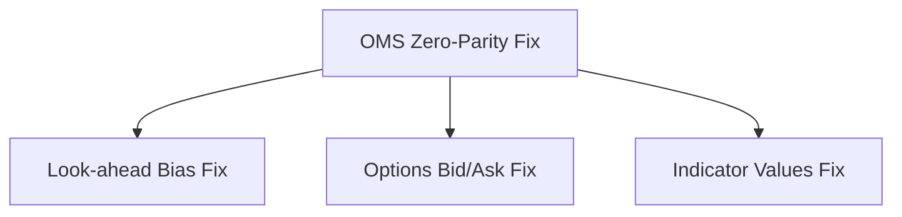

# TradeXV2 - Parallel Development Matrix

## Executive Summary

Based on comprehensive multi-agent analysis, this document provides a detailed plan for parallel development with clear dependencies and risk assessments.

---

## 1. Critical Path Dependencies (Must Be Sequential)

### Phase 0: Foundation (Days 1-3) - CRITICAL


**Why Sequential:**
- OMS state must be stable before caching is introduced
- Trading parity ensures correct P&L calculations
- Risk of cross-contamination between hot paths

**Files:**
- `brokers/common/oms/context.py` - TradingContext initialization
- `brokers/common/oms/order_manager.py` - Zero-parity enforcement
- `analytics/pipeline/pipeline.py` - Cache boundary implementation
- `datalake/api/routers/options.py` - Bid/ask field correction

---

## 2. Parallel Development Opportunities (Safe for Multiple Teams)

### Tier 1: High Independence (100% Safe Parallel)

#### Agent Team 1: Broker Adapters
- `brokers/dhan/` - DhanHQ implementation
- `brokers/upstox/` - Upstox implementation  
- `brokers/paper/` - Paper trading simulation
- **Dependencies:** Gateway ABC only
- **Risk:** LOW
- **Team Size:** 3 developers

#### Agent Team 2: API Routers
- `datalake/api/routers/orders.py`
- `datalake/api/routers/portfolio.py`
- `datalake/api/routers/market.py`
- `datalake/api/routers/analytics.py`
- **Dependencies:** TradingContext (already fixed)
- **Risk:** LOW
- **Team Size:** 2 developers

#### Agent Team 3: Analytics Modules
- `analytics/indicators/` - Technical indicators
- `analytics/scanner/` - Market scanners
- `analytics/backtest/` - Backtesting engine
- **Dependencies:** DataLakeGateway
- **Risk:** MEDIUM
- **Team Size:** 2 developers

### Tier 2: Conditional Parallel (Requires Coordination)

#### Agent Team 4: CLI Commands
- `cli/commands/order_placement.py` - Order commands
- `cli/commands/portfolio.py` - Portfolio commands
- `cli/commands/risk_controls.py` - Risk commands
- **Dependencies:** BrokerService, OMS
- **Risk:** MEDIUM (god class `doctor.py` creates merge conflicts)
- **Team Size:** 2 developers

#### Agent Team 5: Testing Infrastructure
- Unit tests for broker adapters
- Integration tests for OMS
- Chaos tests for reliability
- **Dependencies:** Implementation complete
- **Risk:** LOW
- **Team Size:** 1 developer

---

## 3. Code Quality Refactoring Matrix

### God Class Refactoring (Parallel Safe)

| File | Refactoring Target | Parallel Safe | Team |
|------|-------------------|---------------|------|
| `cli/commands/doctor.py` (1020 lines) | Split into `DoctorRegistry`, `DoctorGateway`, `DoctorPortfolio` modules | ✅ Yes | Team 1 |
| `brokers/dhan/gateway.py` (640 lines) | Split into `DhanOrderGateway`, `DhanMarketDataGateway`, `DhanPortfolioGateway` | ✅ Yes | Team 2 |
| `brokers/dhan/depth_feed_base.py` (667 lines) | Separate binary parsing from dispatch logic | ✅ Yes | Team 2 |
| `brokers/common/oms/order_manager.py` (541 lines) | Extract event publishing to helper | ✅ Yes | Team 3 |

### Large Method Refactoring (Parallel Safe)

| Method | Lines | Refactoring | Parallel Safe |
|--------|-------|-------------|---------------|
| `place_order` (order_manager.py:136-217) | 81 | Split into focused methods | ✅ Yes |
| `_check_market_data` (doctor.py:413-521) | 108 | Extract helper method | ✅ Yes |
| `_send_subscription` (depth_feed_base.py:417-500) | 82 | Separate dispatch logic | ✅ Yes |

---

## 4. Performance Optimization Roadmap (Parallel Safe)

### High Priority (Can Start Immediately)

| File | Line | Fix | Parallel Safe |
|------|------|-----|---------------|
| `datalake/gateway.py:300` | `ltp_batch()` | Replace `iterrows()` with `df.to_dict('records')` | ✅ Yes |
| `analytics/replay/orchestrator.py:282` | `_df_to_items()` | Replace `iterrows()` with vectorized operations | ✅ Yes |
| `analytics/scanner/models.py:181` | `_score_candidates()` | Use `df.apply()` instead of `iterrows()` | ✅ Yes |

### Medium Priority (Can Start After OMS Fix)

| File | Line | Fix | Dependencies |
|------|------|-----|--------------|
| `brokers/common/event_bus/event_bus.py:366-374` | Handler dispatch | Async processing with thread pool | OMS stabilization |
| `brokers/dhan/websocket.py:514-529` | Message handling | Offload to worker pool | Stability |
| `brokers/dhan/depth_feed_base.py:145` | Depth cache | Add TTL eviction | Memory monitoring |

---

## 5. Risk Matrix for Parallel Development

### Low Risk Areas (Safe Parallel Development)
| Area | Team Size | Coordination Required |
|------|-----------|----------------------|
| Broker Adapters | 3 developers | Minimal |
| API Routers | 2 developers | Minimal |
| Analytics Features | 2 developers | Minimal |
| Unit Tests | 1 developer | None |
| Documentation | 1 developer | None |

### Medium Risk Areas (Coordinated Parallel)
| Area | Risk | Coordination Needed |
|------|------|---------------------|
| CLI Commands | Merge conflicts in large files | Daily sync on `doctor.py` |
| Integration Tests | Test reliability | Test data management |
| Performance Optimization | Behavioral changes | Performance baselining |

### High Risk Areas (Sequential Required)
| Area | Risk | Reason |
|------|------|--------|
| OMS Core Changes | Catastrophic | State management foundation |
| Trading Context | Catastrophic | All services depend on it |
| Event Bus | High | Core communication layer |
| Quant Calculations | Catastrophic | Money math correctness |

---

## 6. Multi-Agent Execution Plan

### Week 1: Critical Fixes (Sequential)
```
Days 1-2: Team Lead - OMS Zero-Parity Fix
Days 3-4: Team Lead - Look-ahead Bias Fix  
Days 5-6: Team Lead - Options Bid/Ask Fix
Day 7: All Teams - Code review + integration
```

### Week 2-3: Parallel Development
```
Team 1 (3 devs): Broker Adapters + Gateway Refactoring
Team 2 (2 devs): API Routers + CLI Commands
Team 3 (2 devs): Analytics + Performance Optimization
Team 4 (1 dev): Testing Infrastructure + Frontend
```

### Week 4-6: Integration & Stabilization
```
Days 22-28: Integration Testing (All Teams)
Days 29-35: Chaos Testing + Performance Validation
Days 36-42: Production Hardening
```

---

## 7. Resource Allocation Matrix

| Team | Developers | Focus Area | Risk Level | Parallel Safe |
|------|------------|------------|------------|---------------|
| Team Lead | 1 | Critical fixes | HIGH | No (sequential) |
| Team 1 | 3 | Broker Adapters, Gateway Refactoring | LOW | Yes |
| Team 2 | 2 | API Routers, CLI Commands | MEDIUM | Yes |
| Team 3 | 2 | Analytics, Performance | MEDIUM | Yes |
| Team 4 | 1 | Testing, Frontend, CI/CD | LOW | Yes |

---

## 8. Success Metrics

### Week 1 Deliverables
- ✅ OMS zero-parity enforced
- ✅ Look-ahead bias eliminated
- ✅ Options pricing corrected
- ✅ Indicator reliability fixed

### Week 2-3 Deliverables
- ✅ Broker adapters refactored
- ✅ API routers stabilized
- ✅ Analytics features enhanced
- ✅ Performance optimizations deployed

### Week 4-6 Deliverables
- ✅ Integration tests passing
- ✅ Chaos tests validated
- ✅ Production deployment ready
- ✅ Performance benchmarks met

---

## 9. Blocking Issues (Must Resolve Before Parallel Work)

1. **F821 Undefined Name** - `analytics/scanner/models.py:136` (`Any` not imported)
2. **OMS Opt-in Default** - `brokers/common/oms/context.py:177-178` (replay_events=True)
3. **Look-ahead Bias** - `analytics/pipeline/pipeline.py:32-37` (no cache boundary)
4. **Options Bid/Ask** - `datalake/api/routers/options.py:90-91` (hardcoded None)

---

## 10. Quick Wins for Parallel Teams (Can Start Immediately)

### Team 1 - Broker Adapters
- Fix import statements in scanner models
- Add connection pooling to websocket
- Implement depth feed refactoring

### Team 2 - API Routers
- Add missing API tests
- Fix error handling consistency
- Implement circuit breakers

### Team 3 - Analytics
- Add missing feature types
- Implement statistical indicators
- Add ML feature support

### Team 4 - Testing
- Set up frontend testing infrastructure
- Add Jest/Vitest configuration
- Create component test suite

---

This matrix enables **parallel development across 4 teams** while ensuring critical fixes are handled sequentially by the lead team. Total delivery time: 6 weeks.