# TradeXV2 — Architecture Document

> **Version:** 0.2.0 · **Last Updated:** 2026-07-09  
> **Scope:** Full-stack architecture of the TradeXV2 quantitative trading platform for Indian markets (NSE/BSE/MCX).  
> **Operating model (SSOT):** [`docs/OPERATING_MODEL.md`](./OPERATING_MODEL.md)  
> **Delivery backlog:** [`reports/ENGINEERING_BACKLOG.md`](../reports/ENGINEERING_BACKLOG.md)  
> **SDK entry:** `tradex.connect` → domain `Session` / `Instrument` → ports; adapters under `brokers/{dhan,upstox,paper}`; platform kernel under `tradex.runtime` (not new code in `brokers.common` shims).

---

## Table of Contents

1. [Project Overview](#1-project-overview)
2. [Architecture Principles](#2-architecture-principles)
3. [Layered Architecture (DDD)](#3-layered-architecture-ddd)
4. [Source Code Topology](#4-source-code-topology)
5. [Domain Layer (`src/domain/`)](#5-domain-layer-srcdomain)
6. [Broker Integration Layer (`brokers/`)](#6-broker-integration-layer-brokers)
7. [Data Lake (`datalake/`)](#7-data-lake-datalake)
8. [Analytics Engine (`analytics/`)](#8-analytics-engine-analytics)
9. [Application Layer (`application/`)](#9-application-layer-application)
10. [Order Management System (OMS)](#10-order-management-system-oms)
11. [Infrastructure Layer (`infrastructure/`)](#11-infrastructure-layer-infrastructure)
12. [Presentation Layer — API & CLI](#12-presentation-layer--api--cli)
13. [Configuration (`config/`)](#13-configuration-config)
14. [Plugin System (`plugins/`)](#14-plugin-system-plugins)
15. [Data Flow & Integration](#15-data-flow--integration)
16. [Key Design Patterns](#16-key-design-patterns)
17. [Dependency Graph](#17-dependency-graph)
18. [Layer Boundary Enforcement](#18-layer-boundary-enforcement)
19. [Test Architecture](#19-test-architecture)
20. [Key Files Reference](#20-key-files-reference)
21. [Infrastructure Services](#21-infrastructure-services)
22. [Data Lake Storage Format](#22-data-lake-storage-format)
23. [ADR Summary](#23-adr-summary)

---

## 1. Project Overview

TradeXV2 is a Python-based, broker-agnostic quantitative trading platform built for Indian exchanges (NSE, BSE, MCX). It provides:

- **Multi-broker support** — Dhan, Upstox, and Paper (simulation) trading behind a unified interface
- **Real-time & historical market data** — WebSocket streaming, REST polling, and a DuckDB + Parquet datalake (3.7 GB, 230M+ rows)
- **Options analytics** — Greeks, IV surface, max pain, PCR, option chain composition
- **Scanner engine** — Stock screening with query compilation, scoring, and ranking
- **Backtesting engine** — With walk-forward optimization, golden dataset replay, and strategy comparison
- **Order Management System (OMS)** — Full order lifecycle with risk management, reconciliation, and position tracking
- **REST + WebSocket API** — FastAPI-based with OpenTelemetry observability
- **CLI/TUI interface** — Textual-based terminal UI with real-time dashboards
- **Plugin architecture** — Extensible broker and indicator plugins via entry points

### Tech Stack

| Component | Technology |
|-----------|-----------|
| Language | Python 3.10+ (targeting 3.13) |
| API Framework | FastAPI + uvicorn |
| CLI/TUI | Textual + Rich |
| Datalake | DuckDB + Parquet (Hive-partitioned) |
| Caching | Redis (optional) |
| Auth | TOTP (pyotp), JWT |
| HTTP | aiohttp, requests |
| WebSocket | websockets |
| Observability | OpenTelemetry (traces, metrics) |
| Testing | pytest + hypothesis + mutmut |
| Linting | ruff, mypy, import-linter |

---

## 2. Architecture Principles

1. **Domain-Driven Design** — Business logic lives in `src/domain/` with zero infrastructure dependencies
2. **Ports & Adapters (Hexagonal)** — Domain defines port protocols; infrastructure and broker layers provide adapters
3. **Dependency Inversion** — Higher layers depend on abstractions (Protocol/ABC), never on concrete implementations
4. **Interface Segregation** — Narrow ISP interfaces (`MarketDataProvider`, `TradingExecutor`, `PortfolioReader`) composed into larger gateways
5. **Broker Agnosticism** — Application and domain layers never import broker-specific code
6. **Event-Driven** — Domain events flow through an in-process EventBus for decoupled communication
7. **Layer Isolation** — Enforced by `import-linter` contracts with zero tolerance for upward imports
8. **Resilience First** — Circuit breakers, rate limiters, retry with backoff, and idempotency baked into the broker layer

---

## 3. Layered Architecture (DDD)

```mermaid
graph TB
    subgraph Presentation["Presentation Layer"]
        API["api/<br/>FastAPI REST + WebSocket"]
        CLI["cli/<br/>Textual TUI + Argparse CLI"]
    end

    subgraph Application["Application Layer"]
        OMS["application/oms/<br/>Order Management System"]
        EXEC["application/execution/<br/>Execution Service"]
        COMP["application/composer/<br/>Composition Root"]
        TRADE["application/trading/<br/>Multi-Strategy Runtime"]
    end

    subgraph Domain["Domain Layer (src/domain/)"]
        AGG["Aggregates<br/>account · instrument<br/>option_chain · order · position"]
        ENT["Entities<br/>order · trade · position<br/>market · options · alerts"]
        VO["Value Objects<br/>Money · Capability · State"]
        PORT["Ports (30+ protocols)<br/>broker_gateway · data_provider<br/>risk_manager · event_publisher"]
        EVT["Domain Events<br/>OrderUpdated · TradeFilled<br/>TradeApplied"]
    end

    subgraph Infrastructure["Infrastructure Layer"]
        DI["DI Container<br/>singleton · transient · scope"]
        EBUS["EventBus<br/>async · dead letter queue"]
        DUCK["DuckDB Pool"]
        MET["Metrics<br/>Prometheus"]
        OBS["Observability<br/>OpenTelemetry"]
        PERSIST["Persistence<br/>SQLite Order Store"]
        CACHE["Cache<br/>Redis + In-memory"]
    end

    subgraph Brokers["Broker Integration Layer (brokers/)"]
        COMMON["brokers/common/<br/>Shared Abstractions<br/>MarketDataGateway · CommonBrokerGateway"]
        DHAN["brokers/dhan/<br/>Dhan Integration<br/>gateway · connection · http_client"]
        UPSTOX["brokers/upstox/<br/>Upstox Integration<br/>gateway · auth · market_data"]
        PAPER["brokers/paper/<br/>Paper Trading<br/>mock_broker · paper_gateway"]
    end

    subgraph DataLake["Data Lake (datalake/)"]
        STORAGE["storage/<br/>ParquetStore · Catalog"]
        INGEST["ingestion/<br/>Converter · Loader · Updater"]
        DLANALYTICS["analytics/<br/>Options Greeks · VWAP · SR"]
        QUALITY["quality/<br/>Health Check · Monitor"]
    end

    subgraph Analytics["Analytics Engine (analytics/)"]
        BACKTEST["backtest/<br/>Engine · Optimizer"]
        SCANNER["scanner/<br/>Compiler · Runner · Scorer"]
        STRATEGY["strategy/<br/>Builtins · Pipeline · Registry"]
        FEATURES["features/<br/>Volume · Relative Strength"]
        OPTIONS["options/<br/>Analytics · Greeks"]
    end

    API --> Application
    CLI --> Application
    CLI --> Analytics
    Application --> Domain
    Application --> Brokers
    Application --> DataLake
    Domain -.->|"defines ports"| Infrastructure
    Domain -.->|"defines ports"| Brokers
    Brokers -->|"implements adapters"| Domain
    DataLake -->|"implements adapters"| Domain
    Analytics --> Domain
    Analytics --> DataLake
```

### Layer Dependency Rules

| Source Layer | May Import From | Must NOT Import From |
|-------------|----------------|---------------------|
| `domain` | (stdlib only) | infrastructure, brokers, analytics, datalake, cli, application, api |
| `infrastructure` | domain | brokers, analytics, cli, application, api |
| `analytics` | domain, datalake, infrastructure | brokers.dhan, brokers.upstox, brokers.paper |
| `brokers.common` | domain | brokers.dhan, brokers.upstox, brokers.paper |
| `application` | domain, brokers.common | brokers.dhan, brokers.upstox, brokers.paper, infrastructure |
| `cli` | domain, application, brokers.common, infrastructure | (broker implementations via registry only) |
| `api` | domain, application, infrastructure | brokers.dhan, brokers.upstox, brokers.paper |

---

## 4. Source Code Topology

The project contains **1,615 Python source files** organized across 13 top-level packages:

```
Trade_XV2/
├── src/                    # Domain layer (DDD core)
│   └── domain/             # 130+ files: entities, aggregates, ports, events, enums
├── brokers/                # Broker integrations (531 files)
│   ├── common/             # Shared abstractions, gateways, resilience
│   ├── dhan/               # Dhan broker (largest: 80+ files)
│   ├── upstox/             # Upstox broker (60+ files)
│   └── paper/              # Paper trading mock
├── datalake/               # Data lake (95 files): Parquet + DuckDB
├── analytics/              # Analytics engine (150+ files): backtest, scanner, strategy
├── application/            # Application layer (50+ files): OMS, execution, trading
├── infrastructure/         # Cross-cutting (60+ files): DI, events, metrics, persistence
├── api/                    # REST + WebSocket API (40+ files): FastAPI
├── cli/                    # CLI/TUI interface (80+ files): Textual + argparse
├── config/                 # Configuration (15 files): profiles, feature flags
├── plugins/                # Plugin system (10 files): broker + indicator plugins
├── providers/              # Provider implementations (5 files)
├── tests/                  # Test suite (206 files): unit → e2e pyramid
├── scripts/                # Utility scripts (40+ files)
├── docs/                   # Documentation + ADRs
├── market_data/            # Data files (3.7 GB parquet + DuckDB catalog)
├── pyproject.toml          # Project config, deps, linting, import contracts
└── .env.local              # Environment config (secrets)
```

---

## 5. Domain Layer (`src/domain/`)

The domain layer is the **innermost circle** — it has zero dependencies on any other layer. All business rules, entities, and port definitions live here.

```mermaid
graph TB
    subgraph "src/domain/"
        subgraph Aggregates
            AC["AccountAggregate"]
            IC["InstrumentAggregate"]
            OCA["OptionChainAggregate"]
            ODA["OrderAggregate"]
            PCA["PositionAggregate"]
        end

        subgraph Entities
            AE["Account · Alert · InstrumentRecord"]
            ME["Market (Exchange · Depth · Quote)"]
            OE["Options (Chain · Greeks · Strike)"]
            ORE["Order · OrderLifecycle"]
            PE["Position · Trade"]
        end

        subgraph "Value Objects"
            MV["Money"]
            CV["Capability · ConnectionStatus"]
            SV["State"]
        end

        subgraph "Ports (30+)"
            BG["BrokerGateway · BrokerTransport"]
            DP["DataProvider · MarketData"]
            EP["ExecutionProvider · ExecutionContext"]
            RM["RiskManager · MarginProvider"]
            EBP["EventPublisher · EventBus"]
            LC["Lifecycle · Bootstrap"]
            TM["TimeService · Observability"]
        end

        subgraph "Events"
            EB["EventBus · NullBus"]
            ET["DomainEvent · EventType"]
            TE["OrderUpdatedEvent · TradeFilledEvent"]
        end

        subgraph Constants
            C1["Auth · Defaults · Exchanges"]
            C2["Market · Risk · Timeouts"]
            C3["Observability · Resilience"]
        end
    end

    Aggregates --> Entities
    Entities --> "Value Objects"
    Ports -.->|"define contracts"| Aggregates
    Events --> Aggregates
```

### 5.1 Aggregates

| Aggregate | Directory | Purpose |
|-----------|-----------|---------|
| `AccountAggregate` | `aggregates/account/` | Broker account state, capabilities, connection lifecycle |
| `InstrumentAggregate` | `aggregates/instrument/` | Instrument metadata, exchange segments, subscription state |
| `OptionChainAggregate` | `aggregates/option_chain/` | Underlying + calls + puts composition, expiry management |
| `OrderAggregate` | `aggregates/order/` | Full order lifecycle: draft → submitted → filled/cancelled |
| `PositionAggregate` | `aggregates/position/` | Open positions, P&L, margin, square-off |

### 5.2 Entities

| Entity | Directory | Key Fields |
|--------|-----------|------------|
| Order | `entities/order/` | order_id, symbol, side, quantity, price, status, timestamps |
| Trade | `entities/trade/` | trade_id, order_id, price, quantity, timestamp |
| Position | `entities/position/` | symbol, net_qty, avg_price, realized_pnl |
| Quote | `entities/market/` | ltp, bid, ask, volume, change, timestamp |
| MarketDepth | `entities/market/` | bids[], asks[], depth_type (5/20/200) |
| OptionChain | `entities/options/` | underlying, expiry, strikes[], calls[], puts[] |
| Balance | `entities/account/` | available, used, margin, collateral |
| Alert | `entities/alerts/` | alert_id, condition, trigger_price, status |
| InstrumentRecord | `entities/instrument_record/` | symbol, exchange, lot_size, tick_size, expiry |

### 5.3 Ports (Dependency Inversion Boundaries)

The domain defines **30+ port protocols** that must be implemented by outer layers. These are the sole communication boundaries between domain and infrastructure.

| Port | File | Implemented By |
|------|------|---------------|
| `BrokerGateway` | `ports/broker_gateway.py` | brokers/dhan, brokers/upstox |
| `BrokerTransport` | `ports/broker_transport.py` | brokers/dhan/transport, brokers/upstox |
| `DataProvider` | `ports/data_provider.py` | datalake, brokers |
| `MarketData` | `ports/market_data.py` | brokers/common/gateway |
| `ExecutionProvider` | `ports/execution_provider.py` | application/execution |
| `ExecutionContext` | `ports/execution_context.py` | application/oms |
| `RiskManager` | `ports/risk_manager.py` | application/oms/_internal |
| `MarginProvider` | `ports/margin_provider.py` | brokers/common |
| `EventPublisher` | `ports/event_publisher.py` | infrastructure/event_bus |
| `StrategyEvaluator` | `ports/strategy_evaluator.py` | analytics/strategy |
| `ProviderRegistry` | `ports/provider_registry.py` | domain/providers |
| `Bootstrap` | `ports/bootstrap.py` | brokers/common/bootstrap |
| `Lifecycle` | `ports/lifecycle.py` | infrastructure/lifecycle |
| `Observability` | `ports/observability.py` | infrastructure/observability |
| `TimeService` | `ports/time_service.py` | infrastructure/time_service |
| `Metrics` | `ports/metrics.py` | infrastructure/metrics |
| `CorrelationId` | `ports/correlation.py` | infrastructure/correlation |
| `SubscriptionHandle` | `ports/subscription_handle.py` | brokers/common |
| `OMSBacktestAdapter` | `ports/oms_backtest_adapter.py` | analytics/backtest |
| `Protocols` | `ports/protocols.py` | misc. small protocols |

### 5.4 Domain Events

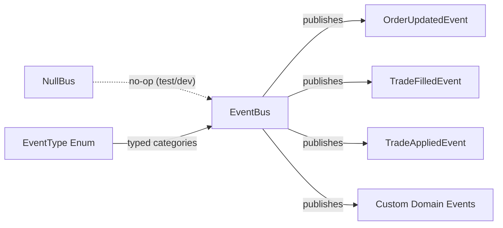

- **`EventBus`** (`events/bus.py`) — In-process async event dispatcher
- **`NullBus`** (`events/null_bus.py`) — No-op implementation for testing
- **`DomainEvent`** (`events/types.py`) — Base dataclass with event_id, timestamp, correlation_id
- **`EventType`** — Typed enum covering order, trade, position, market, and system events

### 5.5 Capability Model

The platform uses a comprehensive capability enum (`domain/capabilities.py`) with **60+ capabilities** that broker adapters declare at runtime:

```
MARKET_DATA, ORDER_COMMAND, ORDER_QUERY, PORTFOLIO, OPTIONS_CHAIN,
INSTRUMENTS, FUTURES, HISTORICAL_DATA, WEBSOCKET, COVER_ORDER,
GTT_ORDER, SLICE_ORDER, MARGIN, NEWS, SESSION_RISK, ALERTS,
MARKET_STATUS, DEPTH, ORDER_STREAM, IDEMPOTENCY, MULTI_ORDER,
KILL_SWITCH, STATIC_IP, SMARTLIST, FII_DII, OI_PCR_MAXPAIN,
MARKET_INTELLIGENCE, FUNDAMENTALS, IPO, MUTUAL_FUNDS, PAYMENTS,
INSTRUMENT_SEARCH, HISTORICAL_TRADES, TSL, MTF, WEBHOOKS,
AMO_ORDER, EXIT_ALL, PORTFOLIO_STREAM, ORDER_SLICING, DEPTH_30,
LEVEL2_MARKET_DATA, OPTION_GREEKS, GLOBAL_MARKETS, VOLATILITY_INDEX
```

Connection lifecycle is tracked via `ConnectionStatus`: `DISCONNECTED → CONNECTING → CONNECTED → RECONNECTING`.

---

## 6. Broker Integration Layer (`brokers/`)

The broker layer is the largest subsystem (531 files). It follows the **Adapter pattern** — each broker wraps its proprietary API behind common interfaces.

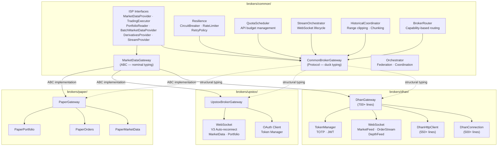

### 6.1 Two Gateway Abstractions

The platform intentionally maintains **two gateway protocols**:

| Gateway | Type | Used By | Key Methods |
|---------|------|---------|-------------|
| **`CommonBrokerGateway`** | `Protocol` (structural typing) | OMS, execution, trading orchestrator | `place_order`, `cancel_order`, `get_positions`, `get_margins`, `open_market_stream` |
| **`MarketDataGateway`** | `ABC` (nominal typing) | Data layer, analytics, CLI | `history`, `quote`, `ltp`, `depth`, `option_chain`, `stream`, `place_order` |

Both return **normalized domain models** — no broker-specific DTOs cross these boundaries.

### 6.2 `brokers/common/` — Shared Abstractions

| Component | File(s) | Purpose |
|-----------|---------|---------|
| CommonBrokerGateway | `broker_port.py` | Universal broker Protocol (365 lines) |
| MarketDataGateway | `gateway.py` | ABC gateway composed from 8 ISP interfaces (400+ lines) |
| ISP Interfaces | `gateway_interfaces.py` | `BatchMarketDataProvider`, `DerivativesProvider`, `InstrumentProvider`, `LifecycleAware`, `MarketDataProvider`, `PortfolioReader`, `StreamProvider`, `TradingExecutor` |
| Capabilities | `capabilities.py` | `BrokerCapabilities`, `CapabilityDescriptor` |
| Router | `router.py` | Capability-based broker selection |
| StreamOrchestrator | `stream_orchestrator.py` | WebSocket lifecycle management |
| HistoricalCoordinator | `historical_coordinator.py` | Federated historical data queries |
| QuotaScheduler | `quota_scheduler.py` | API rate limit budget management |
| Resilience | `resilience/` | Circuit breaker, rate limiter patterns |
| Bootstrap | `bootstrap.py` | Broker infrastructure initialization |
| Idempotency | `idempotency/` | Order deduplication |
| Reconciliation | `reconciliation/` | Position/order reconciliation |
| Connection Pool | `connection_pool.py` | HTTP connection pooling |
| SSL Hardening | `ssl_hardening.py` | TLS configuration |
| Policy | `policy.py`, `policy_defaults.py` | Source selection policy |

### 6.3 `brokers/dhan/` — Dhan Integration

The Dhan integration is the most comprehensive broker implementation:

| Component | File | Lines | Purpose |
|-----------|------|-------|---------|
| Gateway | `gateway.py` | 700+ | Facade implementing both gateway protocols |
| Connection | `connection.py` | 500+ | WebSocket + REST connection lifecycle |
| HTTP Client | `http_client.py` | 550+ | Resilient HTTP client with retry |
| Token Manager | `token_manager.py` | — | JWT + TOTP token lifecycle |
| Token Scheduler | `token_scheduler.py` | — | Automated token refresh |
| TOTP Client | `totp_client.py` | — | TOTP authentication |
| Market Data | `market_data.py` | — | LTP, Quote, Depth adapters |
| Orders | `orders.py` | — | Order lifecycle adapter |
| Portfolio | `portfolio.py` | — | Positions, holdings, balance |
| Historical | `historical.py` | — | Historical data adapter |
| Options | `options.py` | — | Options chain adapter |
| Subscription Engine | `subscription_engine.py` | — | WebSocket subscription management |
| Depth (20) | `depth_20.py` | — | 20-level market depth |
| Depth (200) | `depth_200.py` | — | 200-level market depth |
| Super Orders | `super_orders.py` | — | Advanced order types |
| Forever Orders | `forever_orders.py` | — | GTT/AMO orders |
| EDIS | `edis.py` | — | e-DIS (electronic delivery) |
| Exit All | `exit_all.py` | — | Position square-off |
| Connection Admission | `connection_admission.py` | — | Admission control |
| WebSocket | `websocket/` | — | `connection_manager`, `market_feed`, `order_stream`, `depth_feed` |
| Extensions | `extensions/` | — | Dhan-specific extension modules |
| Resilience | `resilience/` | — | Circuit breaker, rate limiter |

### 6.4 `brokers/upstox/` — Upstox Integration

| Component | Directory/File | Purpose |
|-----------|---------------|---------|
| Gateway | `gateway.py` | `UpstoxBrokerGateway` |
| Broker Facade | `broker.py` | `UpstoxBroker` |
| Auth | `auth/` | OAuth client, token manager, config |
| WebSocket | `websocket/` | V3 auto-reconnect, decoder, subscription manager |
| Market Data | `market_data/` | V2/V3 clients, options, futures, margin, historical |
| Orders | `orders/` | Alert, cover, GTT, idempotency, slicing |
| Instruments | `instruments/` | Loader, resolver, search |
| Capabilities | `capabilities/` | Per-feature capability declarations |
| Kill Switch | `kill_switch/` | Emergency trading halt |
| IPO | `ipo/` | IPO support |
| Mutual Funds | `mutual_funds/` | Mutual fund integration |
| News | `news/` | Market news feed |
| Fundamentals | `fundamentals/` | Balance sheet data |
| Static IP | `static_ip/` | Static IP management |
| Market Intelligence | `market_intelligence/` | Market intelligence signals |
| Reconciliation | `reconciliation/` | Position/order reconciliation |

### 6.5 `brokers/paper/` — Paper Trading

| File | Purpose |
|------|---------|
| `paper_gateway.py` | `PaperGateway` implementing both gateway protocols |
| `paper_market_data.py` | Simulated market data (from replay or random) |
| `paper_orders.py` | Simulated order execution |
| `paper_portfolio.py` | Simulated portfolio tracking |
| `mock_broker.py` | Mock broker for testing |

---

## 7. Data Lake (`datalake/`)

The datalake stores **3.7 GB** of market data in Hive-partitioned Parquet files with a DuckDB catalog for fast analytical queries.

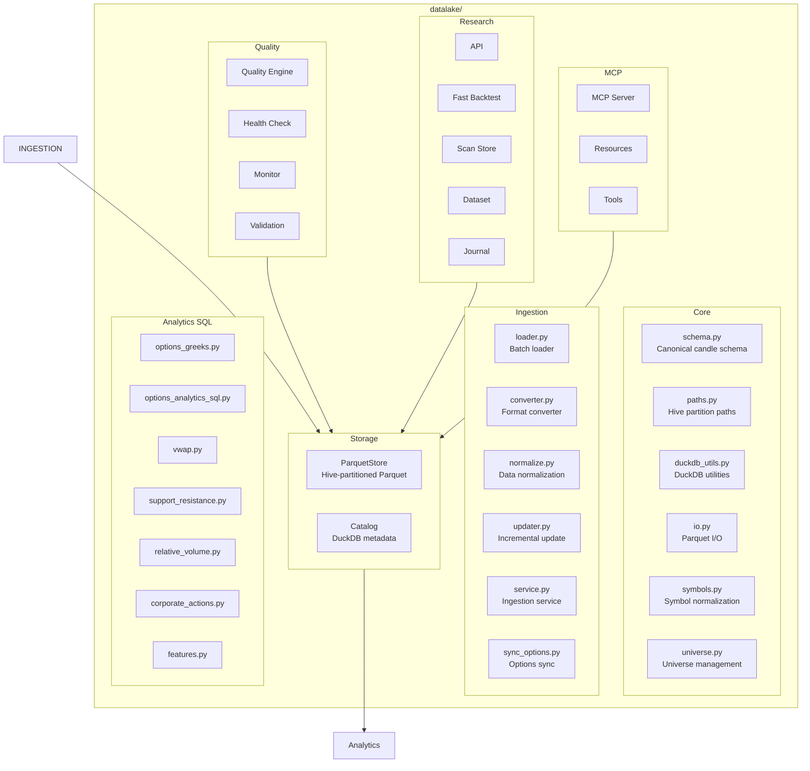

### 7.1 Storage Layout

```
market_data/
├── catalog.duckdb                    # DuckDB catalog (95 MB)
├── equities/candles/
│   └── timeframe=1m/symbol={SYMBOL}/data.parquet    # 501 files
├── options/candles/
│   └── underlying={NIFTY|BANKNIFTY}/expiry_kind={WEEK|MONTH}/expiry_code={1|2}/data.parquet
├── indices/candles/
│   └── timeframe=1m/symbol=NIFTY/data.parquet
├── materialized/                     # Pre-computed views (10 + 30 versioned)
├── fundamentals/                     # (empty — planned)
├── futures/                          # (empty — planned)
├── option_chain/                     # (empty — planned)
├── greeks/                           # (empty — planned)
└── events/                           # (empty — planned)
```

### 7.2 Canonical Candle Schema

| Column | Type | Description |
|--------|------|-------------|
| timestamp | datetime | Candle open time |
| open | float | Open price |
| high | float | High price |
| low | float | Low price |
| close | float | Close price |
| volume | int | Trading volume |
| oi | int | Open interest |
| symbol | string | Instrument symbol |
| exchange | string | Exchange identifier |
| timeframe | string | Candle interval (1m, 5m, 15m, 1h, 1D) |

---

## 8. Analytics Engine (`analytics/`)

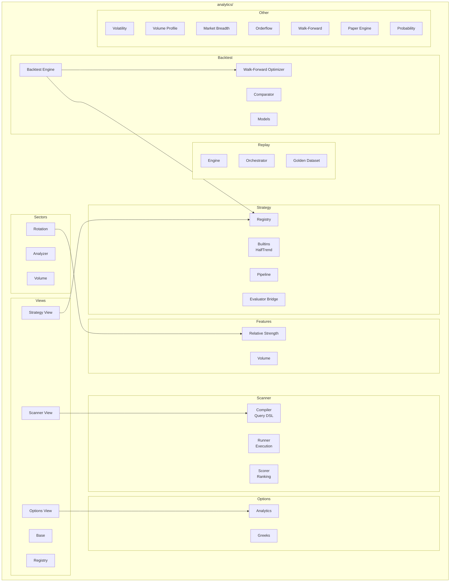

### 8.1 Key Subsystems

| Subsystem | Directory | Purpose |
|-----------|-----------|---------|
| Backtest | `backtest/` | Strategy backtesting with comparator and walk-forward optimization |
| Scanner | `scanner/` | Query DSL compiler, execution runner, scoring engine |
| Strategy | `strategy/` | Strategy registry, pipeline, built-in strategies (HalfTrend), evaluator bridge |
| Options | `options/` | Options analytics, Greeks computation |
| Features | `features/` | Feature engineering (relative strength, volume analysis) |
| Replay | `replay/` | Market replay engine with golden dataset comparison |
| Views | `views/` | Materialized view layer with cache management and query execution |
| Sectors | `sector/` | Sector rotation analysis, sector strength, volume analysis |
| Volatility | `volatility/` | Volatility analytics and surface computation |
| Volume Profile | `volume_profile/` | Volume profile analysis |
| Market Breadth | `market_breadth/` | Breadth indicators |
| Orderflow | `orderflow/` | Order flow analysis |
| Walk-Forward | `walk_forward/` | Walk-forward optimization engine |

---

## 9. Application Layer (`application/`)

The application layer orchestrates domain logic, coordinates broker interactions, and implements use cases.

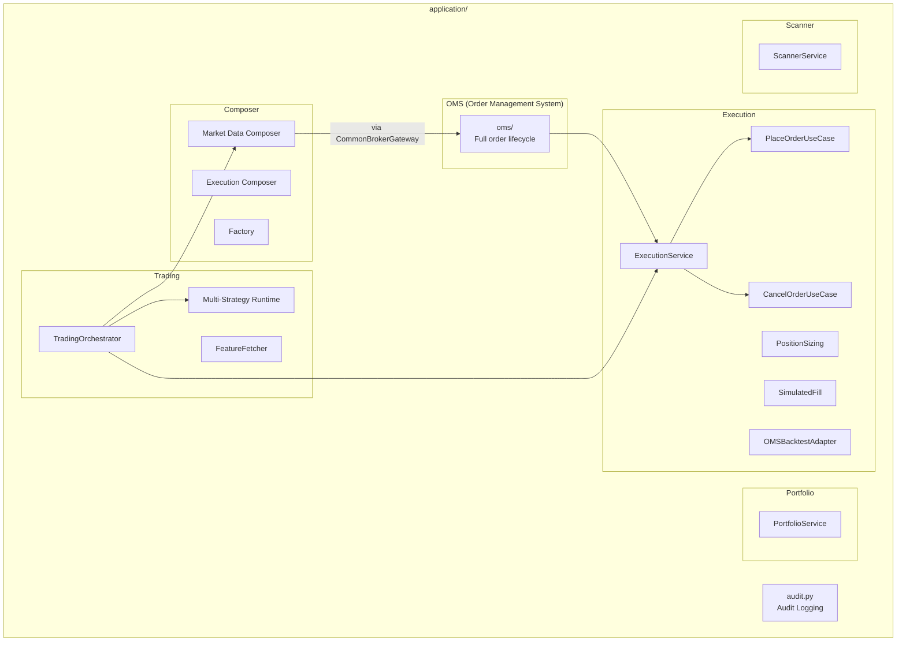

### 9.1 Execution Service

| Component | File | Purpose |
|-----------|------|---------|
| PlaceOrderUseCase | `execution/place_order_use_case.py` | Validates and places orders through the OMS |
| CancelOrderUseCase | `execution/cancel_order_use_case.py` | Cancels orders with state validation |
| ExecutionService | `execution/execution_service.py` | Coordinates order submission to broker gateway |
| PositionSizing | `execution/position_sizing.py` | Calculates optimal position sizes |
| SimulatedFill | `execution/simulated_fill.py` | Paper/backtest order simulation |
| OMSBacktestAdapter | `execution/oms_backtest_adapter.py` | Adapts OMS for backtest mode |
| ExecutionModeAdapter | `execution/execution_mode_adapter.py` | Switches between live/paper/backtest |

### 9.2 Trading Orchestrator

| Component | File | Purpose |
|-----------|------|---------|
| TradingOrchestrator | `trading/trading_orchestrator.py` | Coordinates multi-strategy trading sessions |
| MultiStrategyRuntime | `trading/multi_strategy_runtime.py` | Runs multiple strategies concurrently |
| FeatureFetcher | `trading/feature_fetcher.py` | Fetches computed features for strategy evaluation |

---

## 10. Order Management System (OMS)

The OMS is the most complex subsystem in the application layer, managing the full order lifecycle.

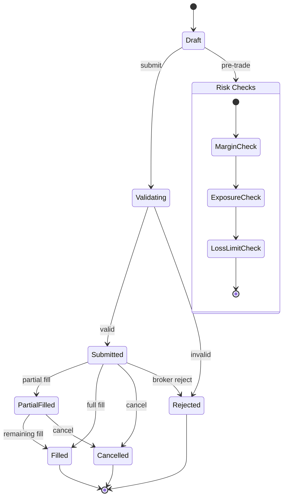

### 10.1 OMS Components

| Component | File | Purpose |
|-----------|------|---------|
| OrderManager | `oms/order_manager.py` | Core order lifecycle management |
| PositionManager | `oms/position_manager.py` | Position tracking and P&L |
| RiskManager | `oms/risk_manager.py` | Pre-trade and runtime risk checks |
| OrderStateValidator | `oms/_internal/order_state_validator.py` | State machine enforcement |
| LossCircuitBreaker | `oms/_internal/loss_circuit_breaker.py` | Stops trading on excessive losses |
| OrderAuditLogger | `oms/_internal/order_audit_logger.py` | Audit trail for all order events |
| OrderPositionUpdater | `oms/_internal/order_position_updater.py` | Updates positions on fills |
| ReentrancyGuard | `oms/_internal/reentrancy_guard.py` | Prevents concurrent mutations |
| ReconciliationService | `oms/reconciliation_service.py` | Reconciles internal state with broker |
| SquareOffService | `oms/square_off_service.py` | End-of-day position square-off |
| DailyPnLResetScheduler | `oms/daily_pnl_reset_scheduler.py` | Resets daily P&L counters |
| CapitalProvider | `oms/capital_provider.py` | Provides available capital for sizing |
| GatewayProxy | `oms/oms_gateway_proxy.py` | Proxies gateway calls with logging |
| Factory | `oms/factory.py` | OMS assembly with DI |
| Context | `oms/context.py` | OMS runtime context |

### 10.2 OMS Recovery

The OMS includes a recovery mechanism (documented in `oms/RECOVERY.md`) that can restore order state from persistence after crashes.

---

## 11. Infrastructure Layer (`infrastructure/`)

The infrastructure layer provides cross-cutting concerns without leaking into domain or application layers.

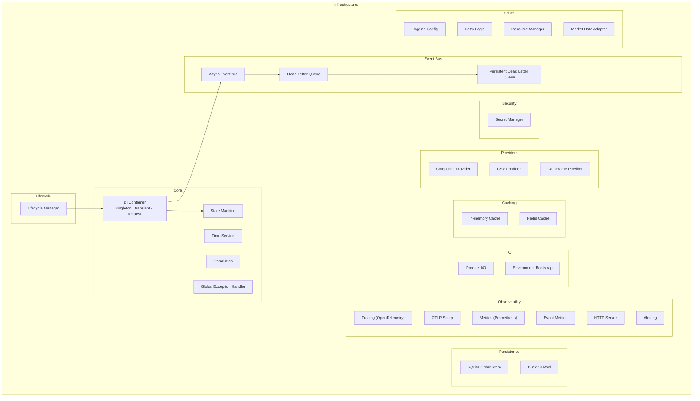

### 11.1 Dependency Injection

The DI container (`infrastructure/di.py`) supports three scopes:

| Scope | Behavior | Use Case |
|-------|----------|----------|
| `singleton` | Created once, shared everywhere | Database connections, event bus, config |
| `transient` | New instance per resolve() | Services with per-use state |
| `request` | One instance per request scope (via ContextVar) | Request-scoped resources |

```python
from infrastructure.di import container

container.register("event_bus", AsyncEventBus, scope="singleton")
container.register("order_repo", OrderRepository, scope="transient")

# Resolve
bus = container.resolve("event_bus")
```

Features circular dependency detection and thread-safe resolution.

### 11.2 Event Bus

| Component | File | Purpose |
|-----------|------|---------|
| AsyncEventBus | `event_bus/async_event_bus.py` | Async publish/subscribe dispatcher |
| DeadLetterQueue | `event_bus/dead_letter_queue.py` | Failed event capture |
| PersistentDeadLetterQueue | `event_bus/persistent_dead_letter_queue.py` | Disk-persisted DLQ |

### 11.3 Observability

| Component | File | Purpose |
|-----------|------|---------|
| Tracing | `observability/tracing.py` | OpenTelemetry span creation |
| OTLP Setup | `observability/opentelemetry_setup.py` | OTLP exporter configuration |
| Event Metrics | `observability/event_metrics.py` | Event-level Prometheus metrics |
| Alerting | `observability/alerting.py` | Threshold-based alerting |
| HTTP Server | `observability/http_server.py` | Metrics health endpoint |

### 11.4 Persistence

| Component | File | Purpose |
|-----------|------|---------|
| SQLite Order Store | `persistence/sqlite_order_store.py` | Order state persistence for crash recovery |
| DuckDB Pool | `db/duckdb_pool.py` | Connection pooling for analytical queries |
| Parquet I/O | `io/parquet.py` | Parquet read/write utilities |

---

## 12. Presentation Layer — API & CLI

### 12.1 REST + WebSocket API (`api/`)

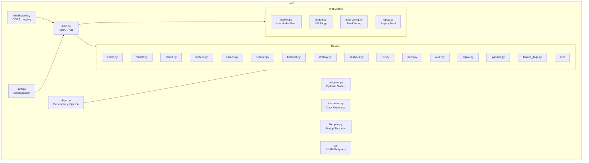

**Routers:**

| Router | File | Endpoints |
|--------|------|-----------|
| Health | `routers/health.py` | `/health`, `/ready` |
| Market | `routers/market.py` | `/market/quote`, `/market/history`, `/market/depth` |
| Orders | `routers/orders.py` | `/orders/place`, `/orders/cancel`, `/orders/modify` |
| Portfolio | `routers/portfolio.py` | `/portfolio/positions`, `/portfolio/holdings`, `/portfolio/funds` |
| Options | `routers/options.py` | `/options/chain`, `/options/greeks`, `/options/analytics` |
| Scanner | `routers/scanner.py` | `/scanner/run`, `/scanner/results` |
| Backtest | `routers/backtest.py` | `/backtest/run`, `/backtest/results` |
| Strategy | `routers/strategy.py` | `/strategy/list`, `/strategy/start`, `/strategy/stop` |
| Analytics | `routers/analytics.py` | `/analytics/breadth`, `/analytics/sectors` |
| Risk | `routers/risk.py` | `/risk/limits`, `/risk/exposure` |
| News | `routers/news.py` | `/news/latest` |
| Audit | `routers/audit.py` | `/audit/orders`, `/audit/trades` |
| Replay | `routers/replay.py` | `/replay/start`, `/replay/stop` |
| Symbols | `routers/symbols.py` | `/symbols/search`, `/symbols/resolve` |
| Feature Flags | `routers/feature_flags.py` | `/flags` |
| Live | `routers/live/` | Live trading: derivatives, orders, portfolio, market |

### 12.2 CLI/TUI (`cli/`)

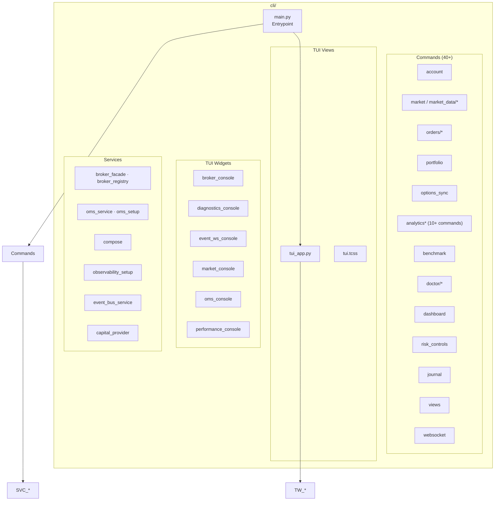

---

## 13. Configuration (`config/`)

| File | Purpose |
|------|---------|
| `defaults.py` | Default configuration values |
| `schema.py` | Pydantic configuration schema |
| `validator.py` | Configuration validation |
| `endpoints.py` | API endpoint definitions (Dhan, Upstox) |
| `feature_flags.py` | Feature flag definitions |
| `indices.py` | Index definitions (NIFTY, BANKNIFTY, etc.) |
| `secrets_manager.py` | Secure secrets handling |
| `profiles/base.py` | Base profile |
| `profiles/dev.py` | Development profile |
| `profiles/prod.py` | Production profile |
| `profiles/staging.py` | Staging profile |

---

## 14. Plugin System (`plugins/`)

The plugin system uses Python entry points for extensibility:

| Plugin | Directory | Purpose |
|--------|-----------|---------|
| Dhan | `plugins/dhan/` | Dhan broker plugin registration |
| Upstox | `plugins/upstox/` | Upstox broker plugin registration |
| Paper | `plugins/paper/` | Paper trading plugin registration |
| ATR | `plugins/indicators/atr.py` | ATR indicator |
| MACD | `plugins/indicators/macd.py` | MACD indicator |
| RSI | `plugins/indicators/rsi.py` | RSI indicator |
| VWAP | `plugins/indicators/vwap.py` | VWAP indicator |

Entry points are declared in `pyproject.toml`:

```toml
[project.entry-points."tradex.brokers"]
# Phase 2 will populate these
# dhan = "brokers.dhan:DhanBroker"
# upstox = "brokers.upstox:UpstoxBroker"
# paper = "brokers.paper:PaperBroker"
```

---

## 15. Data Flow & Integration

### 15.1 Market Data Ingestion Flow

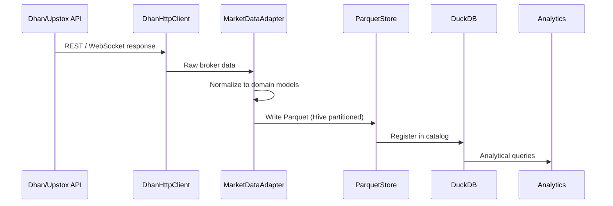

### 15.2 Order Execution Flow

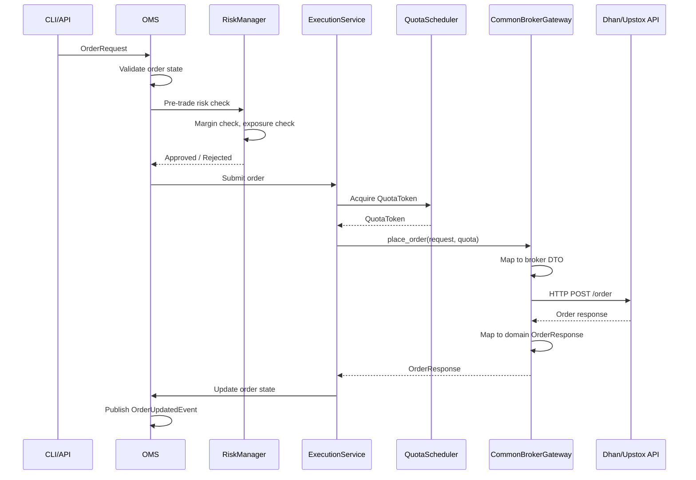

### 15.3 Historical Data Flow

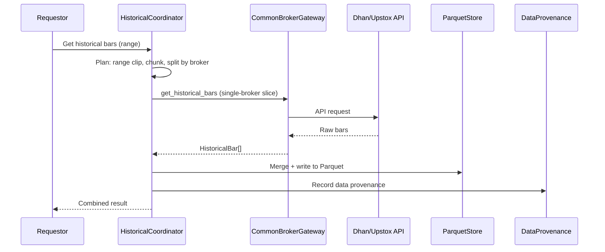

---

## 16. Key Design Patterns

### Pattern Catalog

| # | Pattern | Where Used | Purpose |
|---|---------|------------|---------|
| 1 | **Gateway Pattern** | `MarketDataGateway` (ABC) | Broker-agnostic data access |
| 2 | **Protocol Pattern** | `CommonBrokerGateway` (Protocol) | Structural typing for broker port |
| 3 | **Adapter Pattern** | `brokers/dhan/`, `brokers/upstox/` | Wrap proprietary APIs |
| 4 | **Factory Pattern** | `BrokerFactory`, `OMSFactory` | Create configured instances |
| 5 | **Decorator Pattern** | `quota_decorator.py`, capability layers | Add cross-cutting behavior |
| 6 | **Composition Pattern** | `OptionChainAggregate` | Compose underlying + options |
| 7 | **ISP Pattern** | 8 narrow interfaces in `gateway_interfaces.py` | Segregated consumer contracts |
| 8 | **Event-Driven** | `EventBus`, `DomainEvent` | Decoupled domain communication |
| 9 | **Hexagonal Architecture** | `ports/` define boundaries | Dependency inversion |
| 10 | **Resilience Patterns** | Circuit breaker, rate limiter, retry | Fault tolerance |
| 11 | **State Machine** | `state_machine.py`, order lifecycle | Enforce valid state transitions |
| 12 | **Repository Pattern** | `OrderRepository`, `PositionRepository` | Abstract data access |
| 13 | **Strategy Pattern** | `analytics/strategy/registry.py` | Pluggable trading strategies |
| 14 | **Pipeline Pattern** | `analytics/pipeline/` | Composable data transformations |
| 15 | **CQRS (lite)** | Read models (analytics views) vs write (OMS) | Separate read/write paths |

### Dependency Injection Diagram

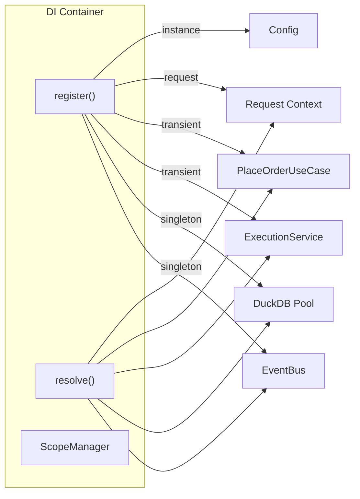

---

## 17. Dependency Graph

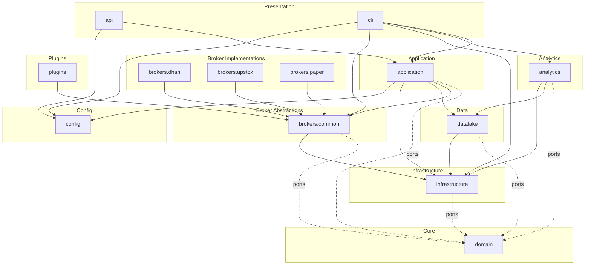

---

## 18. Layer Boundary Enforcement

Layer boundaries are **mechanically enforced** via `import-linter` contracts in `pyproject.toml`:

### Contracts

| Contract | Source | Forbidden Imports | Notes |
|----------|--------|-------------------|-------|
| Domain independence | `domain` | infrastructure, brokers, analytics, datalake, cli, application, api | Pure domain — no exceptions |
| Infrastructure independence | `infrastructure` | brokers, analytics, cli, application, api | Only imports from domain |
| Analytics broker isolation | `analytics` | brokers.dhan, brokers.upstox, brokers.paper | Uses only common abstractions |
| Broker common isolation | `brokers.common` | brokers.dhan, brokers.upstox, brokers.paper | Must not know specific brokers |
| Application broker isolation | `application` | brokers.dhan, brokers.upstox, brokers.paper | Uses only common abstractions |
| Application infrastructure separation | `application` | infrastructure | Limited exception list for OMS |
| CLI broker isolation | `cli` | brokers.dhan, brokers.upstox, brokers.paper | Via registry/facade only |
| API broker isolation | `api` | brokers.dhan, brokers.upstox, brokers.paper | Via registry/facade only |

### Lint Rules

Additional `ruff` rules enforce import hygiene:

- **Banned broker-specific domain types**: `brokers.dhan.domain.Quote` etc. must be imported from `brokers.common.core.domain`
- **CLI import ban**: Lower layers (datalake, analytics, brokers) cannot import from `cli`
- **Cross-broker import ban**: `brokers.dhan` cannot import from `brokers.upstox` and vice versa

### Enforcement Command

```bash
lint-imports --config pyproject.toml
```

---

## 19. Test Architecture

### 19.1 Test Pyramid

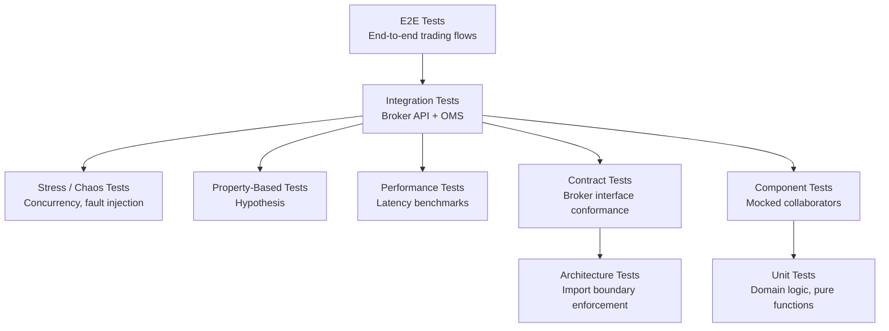

### 19.2 Test Distribution

| Directory | File Count | Focus |
|-----------|-----------|-------|
| `tests/` | 206 | Core test suite |
| `brokers/*/tests/` | 40+ | Broker-specific tests |
| `analytics/tests/` | 20+ | Analytics tests |
| `datalake/tests/` | 30+ | Data lake tests |
| `application/*/tests/` | 18+ | OMS, execution tests |
| `cli/tests/` | 25+ | CLI endpoint tests |
| `infrastructure/tests/` | 10+ | Infrastructure tests |
| `src/domain/tests/` | 30+ | Domain logic tests |

### 19.3 Test Markers

| Marker | Description | Gating |
|--------|-------------|--------|
| `unit` | Module-owned unit tests | Always run |
| `contract` | Broker/module contract tests | Always run |
| `dhan` | Dhan integration tests | Requires creds |
| `integration` | External broker API tests | Requires creds |
| `sandbox` | Order placement tests | `DHAN_INTEGRATION=1` |
| `live_readonly` | Read-only live tests | Safe off-market |
| `performance` | Latency benchmarks | CI gate |
| `upstox` | Upstox unit tests | Always run |
| `upstox_integration` | Upstox integration | `UPSTOX_INTEGRATION=1` |
| `stress` | Concurrency stress | Manual |
| `pre_prod` | Pre-production gate | `PRE_PROD_GATE=1` |
| `regression` | Regression suite | `-m regression` |
| `e2e` | End-to-end flows | Manual |
| `property` | Hypothesis-based | Always run |
| `mutation` | Mutation testing | `mutmut` |
| `memory` | Memory profiling | Manual |
| `oms_integration` | OMS + gateway | Always run |
| `paper_replay_parity` | Paper ↔ Replay parity | Always run |
| `cross_broker_parity` | Cross-broker parity | Always run |

### 19.4 Coverage & Mutation

- **Coverage target**: 80% (`fail_under = 80`)
- **Mutation kill rate**: 90% (`fail_under = 90` with mutmut)
- **Mutation operators**: uop, aod, aor, cos

---

## 20. Key Files Reference

### Critical Files

| File | Lines | Purpose |
|------|-------|---------|
| `brokers/dhan/gateway.py` | 700+ | Dhan gateway facade — largest single file |
| `brokers/dhan/connection.py` | 500+ | WebSocket + REST connection lifecycle |
| `brokers/dhan/http_client.py` | 550+ | Resilient HTTP client with retry |
| `brokers/common/gateway.py` | 400+ | MarketDataGateway ABC (8 ISP interfaces) |
| `brokers/common/broker_port.py` | 365 | CommonBrokerGateway Protocol |
| `application/oms/order_manager.py` | — | Core OMS order lifecycle |
| `application/oms/risk_manager.py` | — | Pre-trade and runtime risk |
| `datalake/core/schema.py` | — | Canonical candle schema |
| `datalake/core/paths.py` | — | Hive partition path logic |
| `infrastructure/di.py` | 257 | DI container |
| `infrastructure/event_bus/async_event_bus.py` | — | Async event dispatcher |
| `src/domain/ports/` | 30+ files | Domain port definitions |
| `src/domain/events/types.py` | 650+ | Domain event types |
| `src/domain/capabilities.py` | 71 | 60+ capability enums |
| `api/main.py` | — | FastAPI application entry |
| `cli/main.py` | — | CLI/TUI entry |

### Configuration Files

| File | Purpose |
|------|---------|
| `pyproject.toml` | Dependencies, tool config, import contracts |
| `.env.local` | Secrets and environment config |
| `config/defaults.py` | Default values |
| `config/schema.py` | Configuration schema |

---

## 21. Infrastructure Services

### 21.1 Health Checks

The platform exposes health endpoints and internal health monitoring:

- **`infrastructure/health.py`** — Health check aggregation
- **`brokers/common/observability/`** — Broker-level health (auth, latency, error rate)
- **`api/routers/health.py`** — HTTP health endpoints (`/health`, `/ready`)
- **`BrokerHealthSnapshot`** — Per-broker health with alive, auth_valid, error_rate, latency_p50

### 21.2 Metrics

- **`infrastructure/metrics/prometheus.py`** — Prometheus metrics registry
- **`infrastructure/observability/event_metrics.py`** — Event-level metrics
- **`brokers/common/observability/`** — Broker metrics

### 21.3 Resilience

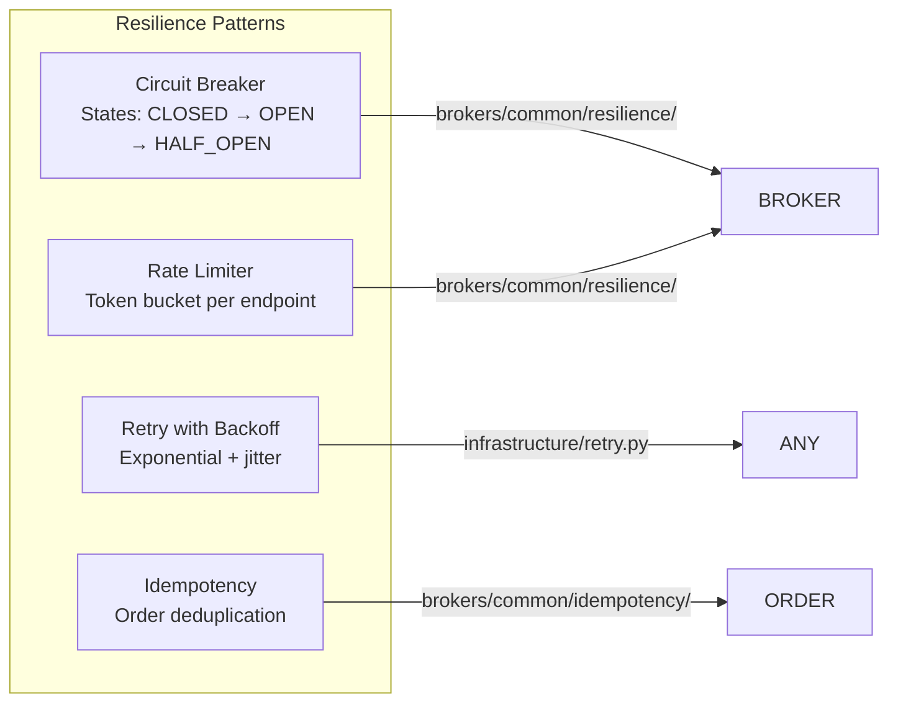

### 21.4 Lifecycle Management

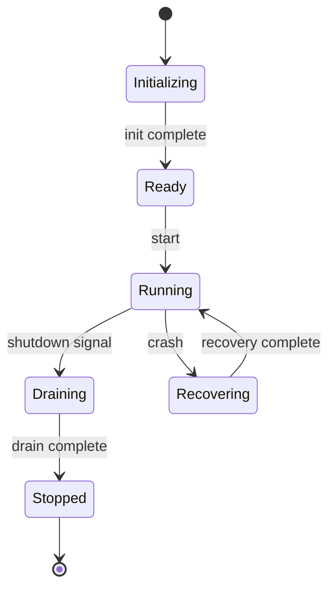

- **`infrastructure/lifecycle/`** — Application lifecycle management
- **`brokers/common/lifecycle/`** — Broker lifecycle
- **`brokers/dhan/connection_lifecycle.py`** — Dhan connection lifecycle

---

## 22. Data Lake Storage Format

### 22.1 Parquet Partitioning

All candle data uses Hive-style partitioning:

```
{asset_class}/candles/{partition_key}=value/.../data.parquet
```

Examples:
- Equities: `equities/candles/timeframe=1m/symbol=RELIANCE/data.parquet`
- Options: `options/candles/underlying=NIFTY/expiry_kind=WEEK/expiry_code=1/data.parquet`
- Indices: `indices/candles/timeframe=1m/symbol=NIFTY/data.parquet`

### 22.2 DuckDB Catalog

- **`catalog.duckdb`** (95 MB) — Registers all Parquet files as external tables
- Enables SQL queries across the entire datalake without loading into memory
- Supports point-in-time joins via `pit_joins.py`

### 22.3 Data Volumes

| Asset Class | Files | Description |
|-------------|-------|-------------|
| Equities | 501 | 1-minute candles per symbol |
| Options | 6 | NIFTY/BANKNIFTY × WEEK/MONTH × expiry codes |
| Indices | 1 | NIFTY 1-minute |
| Materialized | 40 | Pre-computed views (10 main + 30 versioned) |
| **Total** | **~3.7 GB** | **230M+ rows** |

---

## 23. ADR Summary

| ADR | Title | Status |
|-----|-------|--------|
| ADR-001 | `src/` layout for domain layer | Accepted |
| ADR-002 | Domain ports as Protocol boundaries | Accepted |
| ADR-003 | Capability model for broker features | Accepted |
| ADR-004 | Event-driven domain communication | Accepted |
| ADR-005 | Brokers as plugins | Accepted |
| ADR-006 | Deletion strategy for legacy code | Accepted |
| ADR-007 | Test pyramid with live-gating | Accepted |

---

## Appendix A: Directory Size Summary

| Directory | File Count | Purpose |
|-----------|-----------|---------|
| `src/domain/` | 130+ | Domain model (DDD core) |
| `brokers/` | 531 | Broker integrations |
| `analytics/` | 150+ | Analytics engine |
| `datalake/` | 95 | Data lake |
| `cli/` | 80+ | CLI/TUI |
| `infrastructure/` | 60+ | Cross-cutting concerns |
| `application/` | 50+ | Application layer |
| `api/` | 40+ | REST + WebSocket API |
| `tests/` | 206 | Test suite |
| `scripts/` | 40+ | Utility scripts |
| `config/` | 15 | Configuration |
| `plugins/` | 10 | Plugin system |
| `providers/` | 5 | Provider implementations |
| **Total** | **~1,615** | **Python source files** |

---

*This document is auto-generated from the codebase structure. For architectural decisions, see `docs/adr/`. For component-level review, see `docs/architecture/COMPONENT_REVIEW.md`.*
