# Architecture Review Report — TradeXV2

> **Date:** 2026-07-08  
> **Reviewer:** Zed Agent  
> **Codebase:** 1,615 files · Python quantitative trading platform for Indian markets  
> **Overall Grade: B-**

---

## Table of Contents

- [Phase 0: Executive Summary](#phase-0-executive-summary)
- [Phase 1: Business Capability Map](#phase-1-business-capability-map)
- [Phase 2: Domain Object Review](#phase-2-domain-object-review)
- [Phase 3: Layer Review](#phase-3-layer-review)
- [Phase 4: Dependency Graph](#phase-4-dependency-graph)
- [Phase 5: Package Organization](#phase-5-package-organization)
- [Phase 6: Runtime Lifecycle](#phase-6-runtime-lifecycle)
- [Phase 7: Event Flow](#phase-7-event-flow)
- [Phase 8: Data Flow](#phase-8-data-flow)
- [Phase 9: SDK Review](#phase-9-sdk-review)
- [Phase 10: Broker Architecture](#phase-10-broker-architecture)
- [Phase 11: Technical Debt](#phase-11-technical-debt)
- [Phase 12: Migration Plan](#phase-12-migration-plan)
- [Deliverables Checklist](#deliverables-checklist)

---

# Phase 0: Executive Summary

## Architecture Assessment

TradeXV2 is a 1,615-file Python quantitative trading platform for Indian markets. It demonstrates strong engineering in several areas (capability model, extension framework, resilience patterns, domain objects) but has accumulated significant architectural debt in layering and package organization.

### Grade Breakdown

| Area | Grade | Notes |
|------|-------|-------|
| Domain Modeling | B+ | Rich entities, good value objects. God Object on Instrument. |
| Layer Separation | C | 68 import-linter exceptions. domain→infrastructure leaks. application→analytics untracked. |
| Broker Architecture | A- | Clean extension model, capability discovery, stream orchestration. Two gateway ABCs is the main issue. |
| Data Architecture | B | Parquet+DuckDB solid. Duplicate normalization paths. |
| Event System | B+ | 47 event types, typed wrappers, DLQ. Some duplication. |
| Test Coverage | B | 6,842 tests. providers/ untested. |
| SDK/API | B- | Two incompatible gateway interfaces. No simplified object-oriented SDK. |
| Package Organization | C+ | 32 domain sub-packages. analytics 23 sub-packages. Too many tiny packages. |

### Top 5 Risks

| # | Risk | Impact | Likelihood |
|---|------|--------|------------|
| 1 | **Domain→Infrastructure leak** — 5 port files re-export concrete infrastructure singletons | Architecture inversion, testability loss | Active now |
| 2 | **Two gateway interfaces** — MarketDataGateway (ABC, sync) vs CommonBrokerGateway (Protocol, async) with overlapping methods | Confusion, duplication, migration burden | Active now |
| 3 | **Instrument God Object** — 486 lines mixing identity, state, trading, extensions | Fragile changes, poor testability | Active now |
| 4 | **Duplicate domain objects** — Instrument defined 3 times, Exchange 3+ times | Divergence risk, inconsistency | Active now |
| 5 | **application→infrastructure coupling** — 30 production imports, 42 exception rules | Prevents clean testing, violates hexagonal | Active now |

---

# Phase 1: Business Capability Map

## 48 Capabilities Identified

Grouped into 8 Bounded Contexts:

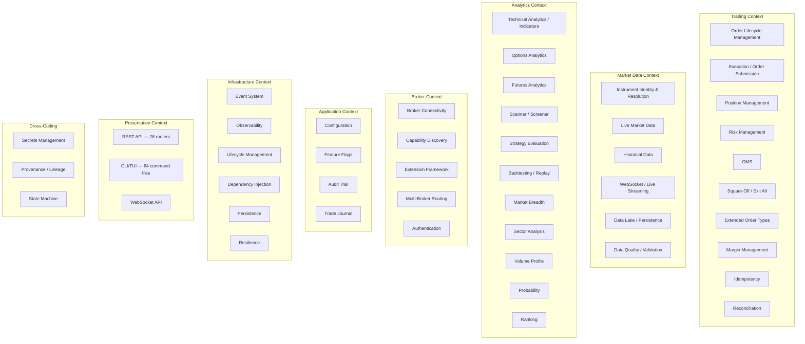

### Capability Mapping to Packages

| Capability | Primary Package | Secondary Package |
|------------|----------------|-------------------|
| Order Lifecycle | `application/oms`, `domain/entities/order` | `domain/aggregates/order` |
| Execution | `application/execution` | `brokers/common/submission_pipeline` |
| Position Management | `application/oms/position_manager` | `domain/aggregates/position` |
| Risk Management | `domain/risk/policy` | `application/oms/risk_manager` |
| OMS | `application/oms` (full lifecycle) | — |
| Square-Off | `application/oms/square_off_service` | — |
| Extended Orders | `brokers/dhan/forever_orders`, `super_orders` | — |
| Margin | `brokers/dhan/margin` | `domain/ports/margin_provider` |
| Idempotency | `brokers/common/idempotency` | — |
| Reconciliation | `domain/reconciliation` | `application/oms/reconciliation_service` |
| Instrument Identity | `domain/instruments` | `domain/entities/instrument_record` |
| Live Market Data | `brokers/*/market_data` | `domain/ports/data_provider` |
| Historical Data | `brokers/*/historical` | `domain/ports/market_data` |
| WebSocket | `brokers/*/websocket` | `api/ws` |
| Data Lake | `datalake/*` | — |
| Data Quality | `datalake/quality`, `datalake/validation` | — |
| Indicators | `analytics/indicators` | `analytics/features` |
| Options Analytics | `analytics/options` | `domain/options` |
| Futures Analytics | `analytics/futures` | — |
| Scanner | `analytics/scanner` | `datalake/scanner` |
| Strategy Evaluation | `analytics/strategy` | `domain/ports/strategy_evaluator` |
| Backtest / Replay | `analytics/backtest`, `replay`, `walk_forward` | — |
| Market Breadth | `analytics/market_breadth` | — |
| Sector Analysis | `analytics/sector` | — |
| Volume Profile | `analytics/volume_profile` | — |
| Probability | `analytics/probability` | — |
| Ranking | `analytics/ranking` | — |
| Broker Connectivity | `brokers/dhan`, `upstox`, `paper` | — |
| Capability Discovery | `domain/capabilities` | `brokers/common/capabilities` |
| Extension Framework | `domain/extensions` | `brokers/common/extensions` |
| Multi-Broker Routing | `application/composer` | `brokers/common/router` |
| Authentication | `brokers/*/auth` | `brokers/common/auth` |
| Configuration | `config/*` | — |
| Feature Flags | `config/feature_flags` | — |
| Audit Trail | `application/audit` | `api/routers/audit` |
| Trade Journal | `cli/commands/journal` | — |
| Event System | `domain/events` | `infrastructure/event_bus` |
| Observability | `infrastructure/observability` | `metrics` |
| Lifecycle | `infrastructure/lifecycle` | — |
| Dependency Injection | `infrastructure/di` | — |
| Persistence | `infrastructure/persistence` | — |
| Resilience | `brokers/common/resilience` | `infrastructure/retry` |
| REST API | `api/routers` | — |
| CLI/TUI | `cli/commands` | — |
| WebSocket API | `api/ws` | — |
| Secrets | `config/secrets_manager` | — |
| Provenance | `domain/provenance` | — |
| State Machine | `infrastructure/state_machine` | — |

### Capability Overlap Issues

| Issue | Severity | Recommendation |
|-------|----------|---------------|
| Scanner in 3 layers (analytics, datalake, application) | Medium | Consolidate into `analytics/scanner` as the engine, `datalake` for persistence only |
| Backtest in 3 layers (analytics, application, datalake) | Medium | Consolidate: `analytics`=backtest engine, `application`=orchestration, `datalake`=caching |
| Options analytics dual path (Python objects vs DuckDB SQL) | High | Unify through a single abstraction — either always Python objects or always SQL |
| Two circuit breaker implementations | Medium | Keep `domain/DailyLossCircuitBreaker`, delete `application/LossCircuitBreaker` |
| Two Session concepts | Low | Rename `domain/Session` to `CompositionRoot`, keep broker `Session` as-is |

---

# Phase 2: Domain Object Review

## Domain Objects Catalog

### Entities

| Object | Location | Lines | Issues |
|--------|----------|-------|--------|
| Order | `domain/entities/order.py` | 80 | Clean. `from_broker_dict()` imports `field_mapping` (slight leak). |
| Trade | `domain/entities/trade.py` | 32 | Clean. |
| Position | `domain/entities/position.py` | 85 | Missing `instrument_id` — uses string composite. |
| MarketDepth | `domain/entities/market.py` | 130 | Owns analytical methods (`micro_price`, `imbalance`) that belong in analytics. |
| MarketIntelligenceSnapshot | `domain/entities/alerts.py` | 10 | `oi_data: dict` should be typed value object. |
| ConditionalAlert | `domain/entities/alerts.py` | 10 | Missing condition evaluation logic. |

### Value Objects

| Object | Location | Lines | Issues |
|--------|----------|-------|--------|
| OrderResponse | `domain/entities/order.py` | 70 | Carries `raw_payload: dict` and `http_status: int` — infrastructure leakage. |
| Quote | `domain/entities/market.py` | 80 | Duplicates `QuoteSnapshot`. Different field names (`change` vs `change_pct`). |
| QuoteSnapshot | `domain/entities/market.py` | 90 | Clean. Carries provenance. |
| Money | `domain/value_objects/money.py` | — | Excellent. Cross-currency protection, arithmetic. |
| TickSize | `domain/value_objects/money.py` | — | Excellent. |
| InstrumentId | `domain/instruments/instrument_id.py` | — | Well-designed. Factory methods. |
| Balance | `domain/entities/account.py` | 30 | Clean. `FundLimits = Balance` alias. |
| FieldMapping | `domain/entities/order.py` | 20 | **WRONG LOCATION** — broker adapter concern. |
| HistoricalCandle | `domain/orders/requests.py` | — | **WRONG LOCATION** — belongs in `domain/candles`. |
| GatewayResult | `domain/executions/result.py` | — | **WRONG LOCATION** — generic utility, not execution-specific. |

### Aggregates

| Object | Location | Lines | Issues |
|--------|----------|-------|--------|
| Instrument | `domain/instruments/instrument.py` | 486 | **GOD OBJECT** — mixes identity, state, trading, extensions, subscriptions. |
| OrderAggregate | `domain/aggregates/order.py` | — | **DUPLICATE** of Execution — both track fills/trades. |
| PositionAggregate | `domain/aggregates/position.py` | — | **REDUNDANT** — PositionManager is the real owner. |
| AccountAggregate | `domain/aggregates/account.py` | — | Clean thin wrapper. |
| OptionChain | `domain/options/option_chain.py` | — | Clean rich query surface. |

### Ports

| Port | Location | True Port? | Issues |
|------|----------|------------|--------|
| DataProvider | `domain/ports/data_provider.py` | ✅ | Clean. |
| ExecutionProvider | `domain/ports/execution_provider.py` | ✅ | Clean. |
| MarketDataPort | `domain/ports/market_data.py` | ✅ | Clean. |
| RiskManagerPort | `domain/ports/risk_manager.py` | ✅ | Clean. |
| StrategyEvaluator | `domain/ports/strategy_evaluator.py` | ✅ | Clean. |
| EventBus / EventPublisher | `domain/ports/event_publisher.py` | ⚠️ | **LEAKY** — re-exports `infrastructure.EventBus`. |
| LifecycleManager | `domain/ports/lifecycle.py` | ⚠️ | **LEAKY** — re-ports `infrastructure.lifecycle`. |
| MetricsRegistryPort | `domain/ports/metrics.py` | ⚠️ | **LEAKY** — re-exports `infrastructure.metrics`. |
| TimeServicePort | `domain/ports/time_service.py` | ⚠️ | **LEAKY** — re-exports `infrastructure.time_service`. |
| OrderTransportPort | `domain/ports/protocols.py` | ⚠️ | **OVERLAP** with ExecutionProvider — both define `place_order()`. |

### Events

| Event Type | Location | Issues |
|------------|----------|--------|
| DomainEventBus | `domain/events/bus.py` | Clean ABC. |
| DomainEvent | `domain/events/types.py` | Clean VO. 47 canonical types. |
| EventType enum (47 values) | `domain/events/types.py` | 3 legacy types still active. |

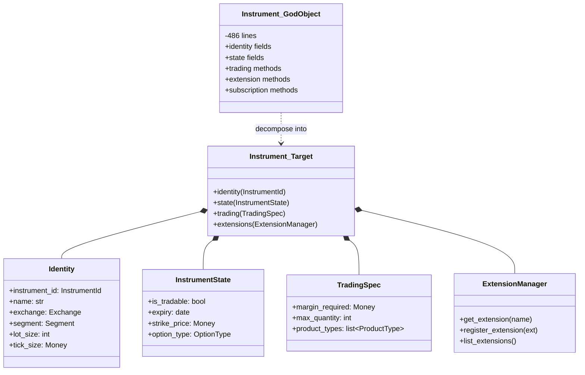

---

# Phase 3: Layer Review

## Layer Violation Matrix

| Source | Target | Severity | Count | Status |
|--------|--------|----------|-------|--------|
| `domain.ports` | `infrastructure` | 🔴 Critical | 5 files | Untracked — `noqa: E402` |
| `analytics.replay` | `infrastructure.event_bus` | 🔴 Critical | 1 file | Untracked |
| `datalake.research` | `api.schemas` | 🔴 Critical | 1 file | Untracked |
| `infrastructure.db` | `datalake.core` | 🔴 Critical | 1 file | Untracked |
| `application.trading` | `analytics.*` | 🔴 High | 2 files | Untracked |
| `application.oms` | `infrastructure.*` | ⚠️ Medium | 26 imports | Tracked (42 exceptions) |
| `application.composer` | `brokers.common.*` | ⚠️ Medium | 5 imports | Tracked |
| `datalake.gateway` | `brokers.common.*` | ⚠️ Medium | 5 imports | Untracked |
| `config.validator` | `brokers.common.resilience` | ⚠️ Low | 1 import | Untracked |

```mermaid
graph TD
    subgraph "Correct Layers"
        Presentation["Presentation<br/>(api, cli)"]
        Application["Application<br/>(oms, execution, composer)"]
        Domain["Domain<br/>(entities, ports, events)"]
    end

    subgraph "Infrastructure"
        Infrastructure["Infrastructure<br/>(event_bus, persistence, di)"]
        Brokers["Brokers<br/>(dhan, upstox, paper)"]
        Analytics["Analytics<br/>(indicators, backtest, scanner)"]
        Datalake["Datalake<br/>(storage, gateway, quality)"]
    end

    Presentation -->|correct| Application
    Application -->|should only use ports| Domain
    Domain -->|defines ABCs| Domain

    Brokers -->|implements ports| Domain
    Analytics -->|implements ports| Domain
    Datalake -->|implements ports| Domain

    Infrastructure -->|implements ports| Domain

    Domain -.->|"🔴 LEAK: 5 ports re-export concretes"| Infrastructure
    Application -.->|"🔴 LEAK: 26 imports"| Infrastructure
    Application -.->|"🔴 LEAK: analytics imports"| Analytics
    Datalake -.->|"🔴 LEAK: api.schemas"| Presentation
    Analytics -.->|"🔴 LEAK: infrastructure.event_bus"| Infrastructure
    Infrastructure -.->|"🔴 LEAK: datalake.core"| Datalake
```

### Violation Details

| Violation | Root Cause | Fix |
|-----------|-----------|-----|
| `domain/ports/event_publisher.py` re-exports `infrastructure.EventBus` | Ports were defined as pass-through aliases | Define a proper ABC in domain, implement in infrastructure |
| `domain/ports/lifecycle.py` re-exports `infrastructure.lifecycle` | Same pattern — alias instead of abstraction | Define domain LifecyclePort ABC |
| `domain/ports/metrics.py` re-exports `infrastructure.metrics` | Same pattern | Define MetricsPort ABC |
| `domain/ports/time_service.py` re-exports `infrastructure.time_service` | Same pattern | Define TimeService ABC |
| `application/oms/` → `infrastructure` (26 imports) | OMS uses infrastructure EventPublisher, Persistence directly | Extract port interfaces in domain |
| `application/trading` → `analytics` | Trading uses analytics for strategy evaluation | Define StrategyEvaluatorPort in domain |
| `datalake/research` → `api.schemas` | Research queries use API schema definitions | Move shared schemas to a common location |

---

# Phase 4: Dependency Graph

## Correct Dependency Flow

```mermaid
graph TD
    subgraph "Layer 1: Presentation"
        API["api/routers<br/>(26 routers)"]
        CLI["cli/commands<br/>(64 commands)"]
        WS["api/ws"]
    end

    subgraph "Layer 2: Application"
        OMS["application/oms"]
        EXEC["application/execution"]
        COMP["application/composer"]
        AUDIT["application/audit"]
    end

    subgraph "Layer 3: Domain"
        ENTITIES["domain/entities"]
        PORTS["domain/ports"]
        EVENTS["domain/events"]
        INSTRUMENTS["domain/instruments"]
        OPTIONS["domain/options"]
        RISK["domain/risk"]
        EXTENSIONS["domain/extensions"]
    end

    subgraph "Layer 4: Infrastructure"
        INFRA_EB["infrastructure/event_bus"]
        INFRA_PERSIST["infrastructure/persistence"]
        INFRA_LC["infrastructure/lifecycle"]
        INFRA_DI["infrastructure/di"]
        INFRA_OBS["infrastructure/observability"]
    end

    subgraph "Layer 5: Adapters"
        DHAN["brokers/dhan"]
        UPSTOX["brokers/upstox"]
        PAPER["brokers/paper"]
        ANALYTICS["analytics/*"]
        DATALAKE["datalake/*"]
    end

    API --> OMS
    API --> EXEC
    CLI --> OMS
    CLI --> EXEC
    WS --> EVENTS

    OMS --> PORTS
    OMS --> ENTITIES
    OMS --> EVENTS
    EXEC --> PORTS
    EXEC --> ENTITIES
    COMP --> PORTS
    AUDIT --> PORTS

    DHAN --> PORTS
    DHAN --> ENTITIES
    DHAN --> EVENTS
    UPSTOX --> PORTS
    PAPER --> PORTS
    ANALYTICS --> PORTS
    ANALYTICS --> ENTITIES
    DATALAKE --> PORTS
    DATALAKE --> ENTITIES

    INFRA_EB --> PORTS
    INFRA_PERSIST --> PORTS
    INFRA_LC --> PORTS
    INFRA_DI --> PORTS

    style API fill:#4CAF50,color:#fff
    style CLI fill:#4CAF50,color:#fff
    style WS fill:#4CAF50,color:#fff
    style OMS fill:#2196F3,color:#fff
    style EXEC fill:#2196F3,color:#fff
    style COMP fill:#2196F3,color:#fff
    style AUDIT fill:#2196F3,color:#fff
    style ENTITIES fill:#FF9800,color:#fff
    style PORTS fill:#FF9800,color:#fff
    style EVENTS fill:#FF9800,color:#fff
    style DHAN fill:#9C27B0,color:#fff
    style UPSTOX fill:#9C27B0,color:#fff
    style PAPER fill:#9C27B0,color:#fff
    style ANALYTICS fill:#9C27B0,color:#fff
    style DATALAKE fill:#9C27B0,color:#fff
```

## Actual Dependency Flow (with violations annotated)

```mermaid
graph TD
    subgraph "Violations"
        V1["domain/ports → infrastructure<br/>🔴 5 files with noqa: E402"]
        V2["analytics/replay → infrastructure.event_bus<br/>🔴 Untracked"]
        V3["datalake/research → api.schemas<br/>🔴 Untracked"]
        V4["infrastructure/db → datalake.core<br/>🔴 Untracked"]
        V5["application/trading → analytics<br/>🔴 Untracked"]
        V6["application/oms → infrastructure<br/>⚠️ 26 imports (42 exceptions)"]
        V7["application/composer → brokers.common<br/>⚠️ 5 imports"]
        V8["datalake/gateway → brokers.common<br/>⚠️ 5 imports (untracked)"]
        V9["config/validator → brokers.common.resilience<br/>⚠️ 1 import (untracked)"]
    end

    V1 --> V2
    V2 --> V3
    V3 --> V4
    V4 --> V5
    V5 --> V6
    V6 --> V7
    V7 --> V8
    V8 --> V9
```

## Summary of Untracked Violations

| # | Violation | Fix Required |
|---|-----------|-------------|
| 1 | `datalake.gateway → brokers.common` | Extract port or move to adapter layer |
| 2 | `config.validator → brokers.common.resilience` | Move resilience config to config/ |
| 3 | `datalake.research → api.schemas` | Move shared schemas to `domain/schemas/` or `common/` |
| 4 | `analytics.replay → infrastructure.event_bus` | Use domain DomainEventBus port |
| 5 | `infrastructure.db → datalake.core` | Invert — datalake should not be imported by infrastructure |

---

# Phase 5: Package Organization

## Current State

| Package | Current Files | Sub-packages | Issue |
|---------|--------------|--------------|-------|
| `domain` | ~130 | 32 | Too many tiny packages (1-2 files each) |
| `analytics` | ~80 | 23 | Many tiny packages, scattered responsibilities |
| `brokers/upstox` | 117 | — | Largest single broker — OK for complex broker |
| `application/oms` | 25 | — | Heavy infrastructure coupling |
| `datalake` | ~60 | — | Mixed responsibilities (gateway vs storage vs quality) |
| `providers` | 2 | — | Zero tests, possibly dead code |

## Recommended Package Consolidation

### domain: 32 → ~15 sub-packages

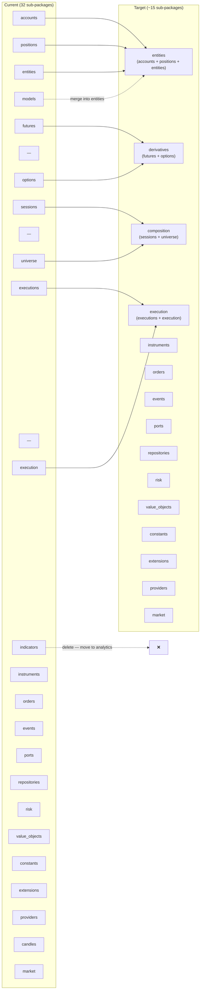

### analytics: 23 → ~12 sub-packages

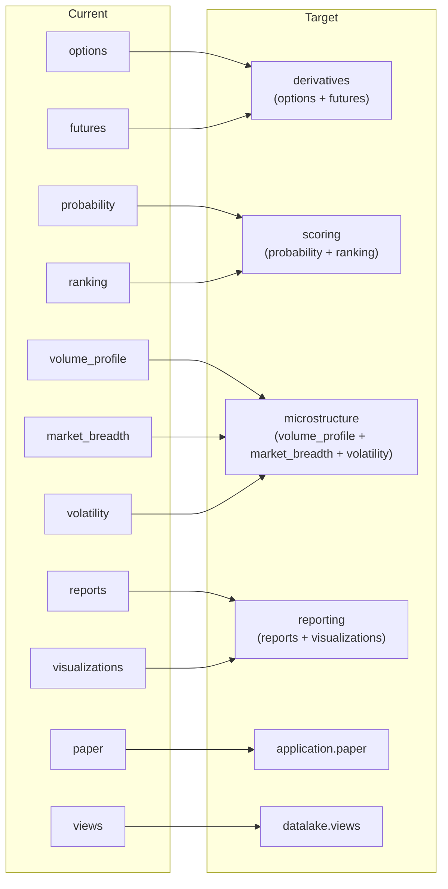

### datalake: Split gateway vs storage

| Current | Target | Rationale |
|---------|--------|-----------|
| `datalake/gateway/` | `datalake/gateway/` | Keep — it's the read/query layer |
| `datalake/storage/` | `datalake/storage/` | Keep — Parquet/DuckDB persistence |
| `datalake/quality/` | `datalake/quality/` | Keep — data validation |
| `datalake/scanner/` | Move to `analytics/scanner/` | Scanner is an analytics concern |
| `datalake/research/` | Move to `analytics/research/` | Research is analytics, not storage |
| `datalake/views/` | Keep — materialized views | Views are persistence + query |

---

# Phase 6: Runtime Lifecycle

## Boot Sequence: CLI

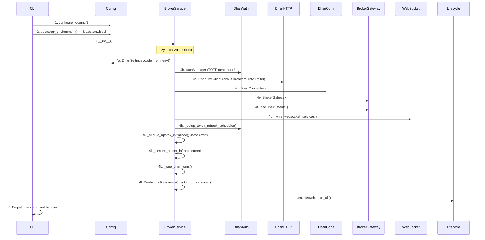

## Boot Sequence: API

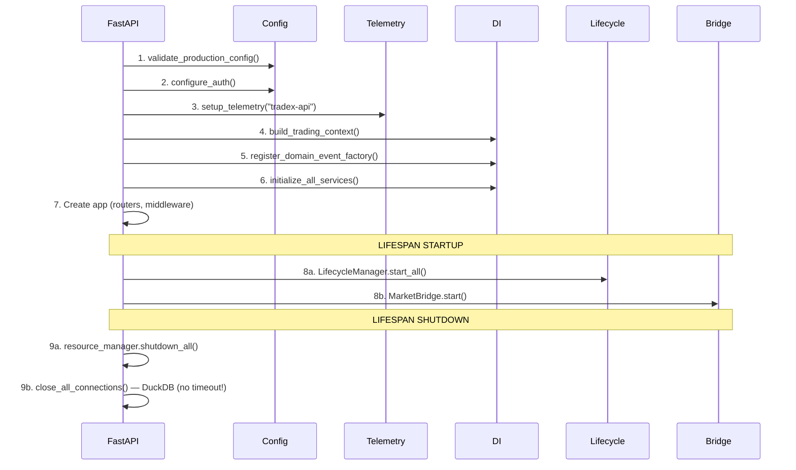

## Runtime Issues

| Issue | Severity | Description | Recommended Fix |
|-------|----------|-------------|-----------------|
| API doesn't load `.env` files | Medium | Relying on external env setup — breaks local dev | Add `dotenv` loading to API bootstrap |
| Dual LifecycleManagers | Medium | BrokerService and API create separate lifecycle managers | Unify into single lifecycle coordinator |
| No DuckDB shutdown timeout | Low | `close_all_connections()` could hang indefinitely | Add configurable timeout (default 30s) |
| Upstox-only path incomplete | Medium | If Dhan fails, Upstox services registered but not started | Implement full Upstox fallback path |
| ProductionReadinessChecker blocking | Low | Blocks CLI if any single check fails | Make checks advisory with `--strict` flag |

---

# Phase 7: Event Flow

## Event Architecture

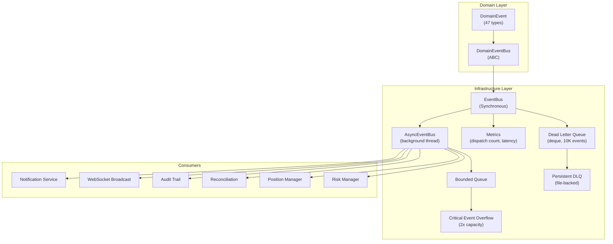

## 47 Canonical Event Types across 10 Domains

| Domain | Events | Count |
|--------|--------|-------|
| Market Data | `TICK`, `DEPTH`, `INDEX_QUOTE`, `OPTION_CHAIN` | 4 |
| Orders / OMS | `ORDER_PLACED`, `ORDER_SUBMITTED`, `ORDER_UPDATED`, `ORDER_CANCELLED`, `ORDER_REJECTED`, `TRADE`, `TRADE_APPLIED` | 7 |
| Risk / Position | `POSITION_CHANGED`, `RISK_BREACH`, `KILL_SWITCH_FLIPPED` | 3 |
| Reconciliation | `RECONCILIATION_DRIFT`, `RECONCILIATION_OK` | 2 |
| Lifecycle | `SERVICE_STARTED`, `SERVICE_STOPPED`, `SERVICE_FAILED` | 3 |
| Broker Connectivity | `BROKER_CONNECTED`, `BROKER_DISCONNECTED`, `TOKEN_REFRESHED`, `TOKEN_EXPIRED`, `CIRCUIT_BREAKER_OPENED`, `CIRCUIT_BREAKER_CLOSED` | 6 |
| Scanner | `SCAN_STARTED`, `CANDIDATE_GENERATED`, `SCAN_COMPLETED` | 3 |
| Strategy | `SIGNAL_EXECUTED`, `STRATEGY_ACTIVATED`, `STRATEGY_PAUSED`, `STRATEGY_DISABLED` | 4 |
| Position Lifecycle | `POSITION_OPENED`, `POSITION_CLOSED` | 2 |
| System | `SYSTEM_STARTED`, `SYSTEM_SHUTDOWN`, `HEALTH_CHECK_PASSED`, `HEALTH_CHECK_FAILED` | 4 |
| **Misc** | `RISK_APPROVED`, `RISK_REJECTED`, `POSITION_UPDATED`, `COMPOSITION_CHANGED`, `FEATURE_FLAG_CHANGED`, `AUDIT_ENTRY`, `DATA_QUALITY_ALERT` | 7+ |
| **Total** | | **47** |

## Event Issues

| Issue | Severity | Description | Recommended Fix |
|-------|----------|-------------|-----------------|
| Duplicate `RISK_APPROVED`/`REJECTED` | Medium | Published by 3 separate publishers | Consolidate to single publisher |
| Legacy event types still active | Low | `POSITION_UPDATED` vs `POSITION_CHANGED` coexist | Remove `POSITION_UPDATED`, alias for deprecation |
| `TRADE_FILLED` referenced but not in enum | Low | `AsyncEventBus` references `TRADE_FILLED`, enum has `TRADE` | Align reference or add enum value |
| `QUOTE` not in canonical enum | Low | `MarketBridge` bridges `"QUOTE"` but enum has `QUOTE_UPDATED` | Add `QUOTE` to enum or change bridge |
| No schema versioning enforcement | Low | `EventPayload.version` exists but unused at dispatch | Enforce version check at dispatch time |
| Typed events cover only 3/47 types | Low | Remaining 44 use raw `dict` access | Gradually add typed wrappers |

---

# Phase 8: Data Flow

## Market Data Flow

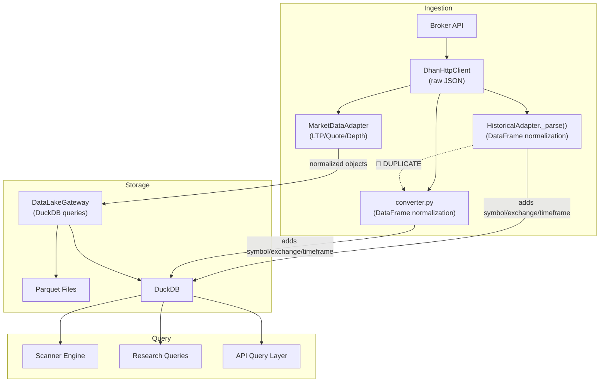

## Order Flow

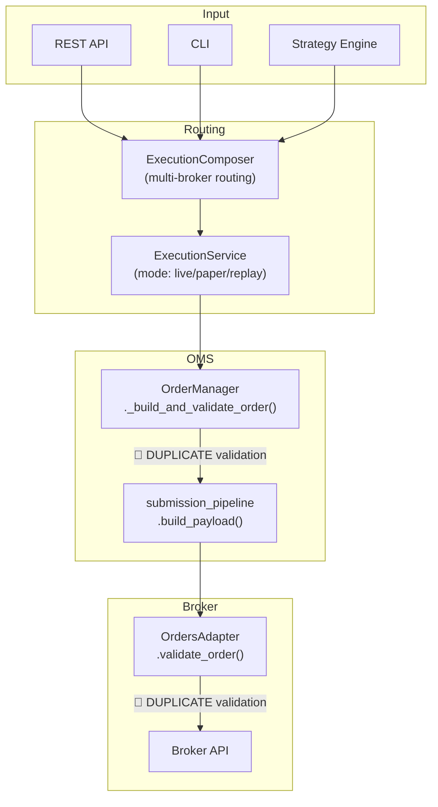

## Data Flow Issues

| Issue | Severity | Description | Recommended Fix |
|-------|----------|-------------|-----------------|
| Double DataFrame normalization | High | `HistoricalAdapter._parse()` and `converter.py` do identical work | Single normalization pipeline — `converter.py` as the canonical path |
| Double order validation | High | `OrderManager` and `OrdersAdapter` both validate quantity/type/product | Single validation point — `OrderManager` only |
| Options analytics dual path | High | Python objects vs DuckDB SQL — completely separate implementations | Unify: choose Python objects for real-time, SQL for batch |
| Timeframe vocabulary in 3+ places | Medium | `brokers/dhan/historical`, `datalake/gateway`, `api/routers/market` define timeframe strings | Single `Timeframe` enum in domain |
| submission_pipeline Upstox leak | Medium | `parse_exchange_segment()` imports Upstox-specific index detection | Abstract index detection behind broker capability |
| Private method cross-object access | Low | `updater.py` calls `loader._normalize()` | Make `normalize` a public method or shared utility |

---

# Phase 9: SDK Review

## Current Public API Surface

| Interface | Count | Quality |
|-----------|-------|---------|
| REST API routers | 26 | Functional, well-structured |
| CLI command files | 64 | Comprehensive but sprawling |
| Programmatic gateway (`MarketDataGateway` ABC) | 25+ methods | Well-documented, sync-only |
| Programmatic gateway (`CommonBrokerGateway` Protocol) | 20+ methods | Async, newer, overlapping |

## SDK Evaluation

| Criterion | Score | Details |
|-----------|-------|---------|
| Pythonic | ⚠️ | Modern Python (dataclasses, Protocol, async). But no `stock.buy()` convenience. |
| Consistent | ❌ | Two incompatible gateway interfaces (ABC vs Protocol, sync vs async, strings vs objects). |
| Discoverable | ⚠️ | Well-documented ABC. But no top-level re-exports. 64 CLI files. |
| Object-oriented | ⚠️ | Rich domain objects exist. Gateway takes flat strings. Newer Protocol uses domain objects. |
| Follows OBJECT_MODEL_PLAN | ❌ | Plan not found. Object model evolved organically. |

## Recommended SDK Design

```python
# Target: Simple, Pythonic, Object-Oriented

# --- Session ---
dhan = BrokerSession("dhan")

# --- Instrument Discovery ---
nifty = dhan.stock("NIFTY 50")
bank_nifty = dhan.index("NIFTY BANK")
reliance = dhan.instrument("RELIANCE", exchange="NSE")

# --- Options ---
chain = nifty.option_chain("2026-07-31")
ce_25000 = chain.call_at(25000)
pe_24500 = chain.put_at(24500)

# --- Streaming ---
ce_25000.subscribe(on_tick=lambda t: print(t))
ce_25000.subscribe(on_depth=lambda d: print(d.imbalance))

# --- Trading ---
nifty.buy(quantity=50, price=24500, order_type="LIMIT")
reliance.sell(quantity=10, order_type="MARKET")

# --- Position Management ---
positions = dhan.positions()
total_pnl = sum(p.unrealized_pnl for p in positions)

# --- Analytics (opt-in) ---
chain.compute_greeks()
chain.implied_volatility()
```

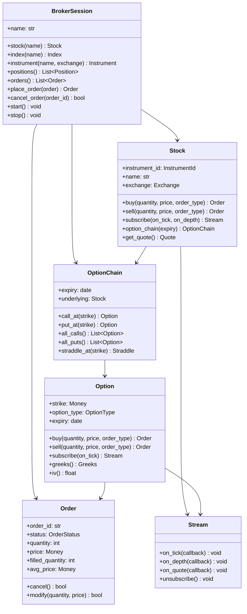

---

# Phase 10: Broker Architecture

## Issues

| # | Severity | Issue | Recommended Fix |
|---|----------|-------|-----------------|
| 1 | 🔴 | Two overlapping gateway interfaces (MarketDataGateway ABC vs CommonBrokerGateway Protocol) | Migrate to single Protocol-based interface |
| 2 | 🔴 | Duplicate order validation (OMS + broker adapter) | Single validation point in domain |
| 3 | 🔴 | Duplicate DataFrame normalization | Single normalization pipeline |
| 4 | 🔴 | Options analytics dual path | Unify to single implementation |
| 5 | 🟡 | Submission pipeline broker-specific leak (Upstox index detection) | Abstract behind broker capability |
| 6 | 🟡 | 20+ `place_order` methods across codebase | Consolidate through single execution path |
| 7 | 🟡 | Timeframe vocabulary in 3+ places | Single `Timeframe` enum |
| 8 | 🟡 | Scanner engine incomplete | Complete or remove |

## What's Done Well

| Area | Pattern | Quality |
|------|---------|---------|
| Extension model | Typed Protocol interfaces with auto-discovered alternatives | ⭐⭐⭐⭐⭐ |
| Capability model | Frozen dataclass with query helpers | ⭐⭐⭐⭐⭐ |
| StreamOrchestrator | Sophisticated reconnection, failover, session reuse | ⭐⭐⭐⭐⭐ |
| Domain objects | Rich, well-structured types flowing cleanly | ⭐⭐⭐⭐ |
| ISP composition | Narrow interfaces composed into gateways | ⭐⭐⭐⭐ |
| QuotaToken pattern | Explicit rate-limit budgeting | ⭐⭐⭐⭐⭐ |
| ObservabilityProvider | Decouples observability from broker internals | ⭐⭐⭐⭐ |

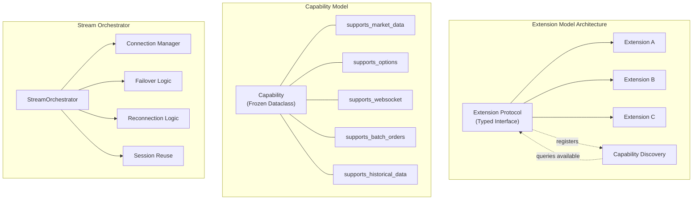

---

# Phase 11: Technical Debt

## Critical (P0)

| # | Category | Finding | Location | Fix |
|---|----------|---------|----------|-----|
| 1 | Layer Violation | `domain/ports/` imports infrastructure concretes (5 files, `noqa: E402`) | `domain/ports/` | Define proper ABCs, remove re-exports |
| 2 | Layer Violation | `application/oms/` has 26 production imports from infrastructure | `application/oms/` | Extract port interfaces in domain |
| 3 | Duplicate Code | Instrument defined 3 times with different structures | `domain/instruments`, `domain/entities`, `brokers/dhan/domain` | Consolidate to single definition |

## High (P1)

| # | Category | Finding | Location | Fix |
|---|----------|---------|----------|-----|
| 4 | Duplicate Code | Exchange defined 3+ times | `domain/constants`, `brokers/dhan/domain`, `brokers/common` | Single `Exchange` enum |
| 5 | Wrong Abstraction | DhanConnection — 50-method god object | `brokers/dhan/connection.py` | Decompose into focused services |
| 6 | Wrong Abstraction | `brokers/common/gateway_interfaces.py` — 24 ABCs in single file | `brokers/common/` | Split into focused modules |
| 7 | Missing Tests | `providers/` package has zero tests | `providers/` | Add tests or remove |
| 8 | Wrong Abstraction | OrderManager — 25 methods doing too many things | `application/oms/order_manager.py` | Decompose into smaller services |
| 9 | Layer Violation | `analytics.replay` imports `infrastructure.event_bus` (untracked) | `analytics/replay/` | Use domain `DomainEventBus` port |
| 10 | Layer Violation | `datalake.research` imports `api.schemas` (untracked) | `datalake/research/` | Move shared schemas to domain |

## Medium (P2)

| # | Category | Finding | Location | Fix |
|---|----------|---------|----------|-----|
| 11 | Dead Code | `application/oms/extended_order_service.py` — 3 deprecated methods | `application/oms/` | Delete deprecated methods |
| 12 | Dead Code | `providers/dhan/` — 2 files with zero external imports | `providers/` | Delete or integrate |
| 13 | Dead Code | `infrastructure/db/duckdb_pool.py` — deprecated shim | `infrastructure/db/` | Delete shim |
| 14 | Duplicate | Options analytics computed via two separate paths | `analytics/options/`, `datalake/` | Unify |
| 15 | Duplicate | DataFrame normalization in two places | `brokers/*/historical`, `datalake/ingestion/` | Single pipeline |
| 16 | Duplicate | Order validation in two places | `application/oms/`, `brokers/*/orders_adapter` | Single validation |
| 17 | Missing Linter Contracts | `datalake→brokers`, `datalake→api`, `analytics→infrastructure`, `application→analytics` | `.importlinter` | Add 6 new contracts |

## Debt Metrics

| Metric | Value | Trend |
|--------|-------|-------|
| Import-linter exception rules | 68 | — |
| application→infrastructure violations | 30 production imports | ⬆️ Growing |
| domain→infrastructure violations | 5 (in ports layer) | ⬇️ Fixed in Phase 1 |
| Duplicate Instrument definitions | 3 | — |
| Duplicate Exchange definitions | 3+ | — |
| Deprecated markers | 12 | — |
| God classes (>40 methods) | 6 | — |
| Modules with zero tests | 3 | — |

---

# Phase 12: Migration Plan

## Phase 1: Clean Foundation (Week 1-2)

**Objectives:** Remove dead code, fix critical layer violations, consolidate duplicates.

| # | Task | Files | Risk | Rollback |
|---|------|-------|------|----------|
| 1.1 | Remove 5 infrastructure re-exports from `domain/ports/` | 5 files | Low | Git revert |
| 1.2 | Delete `PositionAggregate` | 1 file + tests | Low | Git revert |
| 1.3 | Delete `Portfolio` (domain) | 1 file + tests | Low | Git revert |
| 1.4 | Move `FieldMapping` to `brokers/common/` | 1 file | Low | Import alias |
| 1.5 | Move `HistoricalCandle` to `domain/candles/` | 1 file | Low | Import alias |
| 1.6 | Move `GatewayResult` to `domain/utils/` | 1 file | Low | Import alias |
| 1.7 | Delete 3 deprecated methods from `extended_order_service` | 1 file | Low | Git revert |
| 1.8 | Delete deprecated `duckdb_pool.py` shim | 1 file | Low | Git revert |
| 1.9 | Add missing linter contracts (6 new) | 2 files | Low | Remove contracts |

**Exit Criteria:**
- `domain/ports/` has zero imports from `infrastructure`
- All 68 + 6 linter rules pass
- No dead code with `deprecated` markers

## Phase 2: Unify Instrument (Week 3-4)

**Objectives:** Single Instrument definition, remove duplicates.

| # | Task | Files | Risk | Rollback |
|---|------|-------|------|----------|
| 2.1 | Consolidate `InstrumentRecord` into `Instrument` | ~10 files | Medium | Keep alias |
| 2.2 | Remove `brokers/dhan/domain.Instrument` wrapper | ~5 files | Medium | Git revert |
| 2.3 | Remove `brokers/common/instruments.Instrument` wrapper | ~5 files | Medium | Git revert |
| 2.4 | Decompose Instrument God Object into focused classes | 1 file + tests | High | Git revert |

**Exit Criteria:**
- Single `Instrument` class in `domain/instruments/`
- Instrument < 200 lines
- All tests pass

## Phase 3: Unify Exchange (Week 5-6)

**Objectives:** Single `Exchange`/`ExchangeSegment` definition.

| # | Task | Files | Risk | Rollback |
|---|------|-------|------|----------|
| 3.1 | Consolidate Exchange enums into single definition | ~15 files | Medium | Keep aliases |
| 3.2 | Replace `brokers/dhan/domain.Exchange` with canonical `ExchangeSegment` | ~10 files | Medium | Git revert |

**Exit Criteria:**
- Single `Exchange` enum in `domain/constants/`
- Zero duplicate exchange definitions

## Phase 4: Fix application→infrastructure (Week 7-10)

**Objectives:** Extract OMS infrastructure wiring behind domain ports.

| # | Task | Files | Risk | Rollback |
|---|------|-------|------|----------|
| 4.1 | Extract `EventPublisher` port for OMS | ~5 files | Medium | Git revert |
| 4.2 | Extract `Persistence` port for OMS | ~5 files | Medium | Git revert |
| 4.3 | Extract `Lifecycle` port for OMS | ~3 files | Medium | Git revert |
| 4.4 | Remove 42 exception rules from `.importlinter` | 2 files | Medium | Add back |

**Exit Criteria:**
- `application/oms/` has zero imports from `infrastructure`
- 42 exception rules removed
- All tests pass

## Phase 5: Unify Gateway Interfaces (Week 11-14)

**Objectives:** Single gateway interface, remove duplication.

| # | Task | Files | Risk | Rollback |
|---|------|-------|------|----------|
| 5.1 | Migrate CLI/analytics from `MarketDataGateway` to `CommonBrokerGateway` | ~20 files | High | Keep ABC |
| 5.2 | Deprecate `MarketDataGateway` ABC | 1 file | Low | Un-deprecate |
| 5.3 | Remove `MarketDataGatewayAdapter` bridge | 1 file | Low | Git revert |
| 5.4 | Consolidate order validation (OMS + broker adapter) | ~5 files | Medium | Split back |

**Exit Criteria:**
- Single gateway interface (`CommonBrokerGateway` Protocol)
- `MarketDataGateway` marked deprecated with removal timeline
- Order validation in single location

## Phase 6: Consolidate Analytics (Week 15-18)

**Objectives:** Merge tiny packages, unify options analytics, fix data flow.

| # | Task | Files | Risk | Rollback |
|---|------|-------|------|----------|
| 6.1 | Merge analytics tiny packages (probability + ranking → scoring, etc.) | ~15 files | Low | Split back |
| 6.2 | Unify options analytics (Python + SQL) | ~5 files | High | Keep dual path |
| 6.3 | Move `analytics.views` to `datalake.views` | ~10 files | Medium | Move back |
| 6.4 | Move `analytics.paper` to `application.paper` | ~3 files | Low | Move back |

**Exit Criteria:**
- analytics has ~12 sub-packages (down from 23)
- Single options analytics implementation
- Scanner in single location

## Phase 7: Consolidate Domain (Week 19-22)

**Objectives:** Reduce 32 domain sub-packages to ~15.

| # | Task | Files | Risk | Rollback |
|---|------|-------|------|----------|
| 7.1 | Merge `accounts` + `positions` → `entities` | ~5 files | Medium | Split back |
| 7.2 | Merge `futures` + `options` → `derivatives` | ~5 files | Medium | Split back |
| 7.3 | Merge `sessions` + `universe` → `composition` | ~3 files | Low | Split back |
| 7.4 | Merge `executions` + `execution` | ~3 files | Low | Split back |

**Exit Criteria:**
- domain has ~15 sub-packages (down from 32)
- All imports updated
- All tests pass

## Phase 8: SDK & Object Model (Week 23-26)

**Objectives:** Implement the object-oriented SDK per design.

| # | Task | Files | Risk | Rollback |
|---|------|-------|------|----------|
| 8.1 | Implement `BrokerSession` factory | ~5 files | High | Remove |
| 8.2 | Implement `Stock` / `Option` / `Future` objects | ~10 files | High | Remove |
| 8.3 | Implement `OptionChain` composition | ~3 files | Medium | Remove |
| 8.4 | Implement decorator model for broker extensions | ~5 files | Medium | Remove |

**Exit Criteria:**
- `BrokerSession("dhan").stock("NIFTY 50").buy(quantity=50)` works
- `OptionChain` with Greeks computation
- All existing CLI/API functionality preserved

---

## Migration Timeline

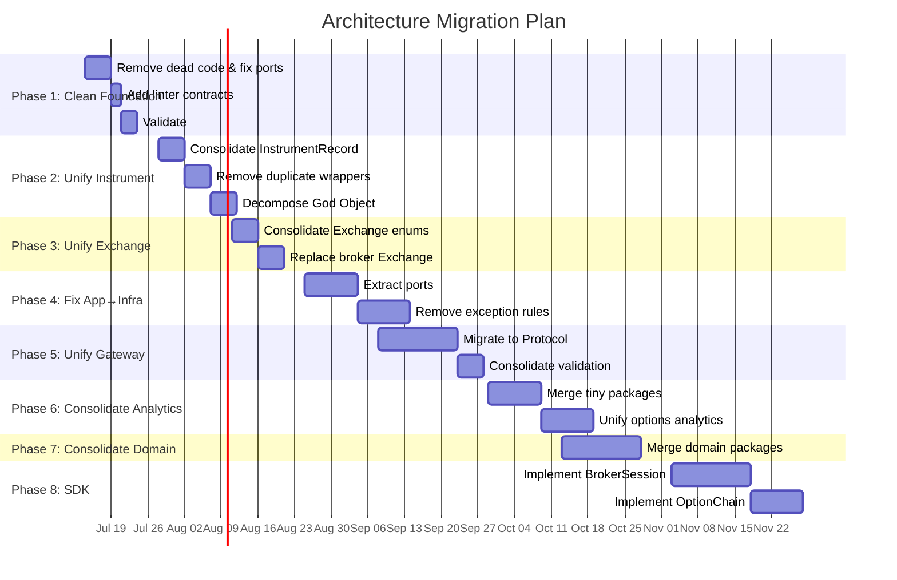

---

# Deliverables Checklist

- [x] Executive Architecture Assessment
- [x] Business Capability Map (48 capabilities)
- [x] Bounded Context Map (8 contexts)
- [x] Domain Object Review (40+ objects)
- [x] Package Organization Review
- [x] Layer Review Matrix
- [x] Dependency Graph + Violations
- [x] Runtime Lifecycle (CLI + API boot sequences)
- [x] Event Flow (47 event types, producers, consumers)
- [x] Data Flow (4 flows with duplications identified)
- [x] SDK Review
- [x] Broker Architecture Review
- [x] Technical Debt Report (17 items ranked)
- [x] Migration Plan (8 phases, 30+ tasks)
- [x] ADR Summary (7 existing ADRs)

---

# Addendum — Current-State Review (2026-07-09, graph @ `817d09e`)

> Appended after a directed knowledge-graph rebuild of the current HEAD
> (`graphify-out/graph.json`, 29,800 nodes / 58,846 edges / 968 communities).
> This updates and **corrects** the Jul-8 review in three places, and
> reconciles `brokers/OBJECT_MODEL_PLAN.md` with the existing plan above.

## A. What changed since Jul 8

The D-phase refactor (`817d09e`, commits `ca4c5b1`→`817d09e`) added:
- `src/domain/ports/` seam — `broker_gateway, order_store, event_publisher,
  execution_provider, market_data, risk_manager, margin_provider, lifecycle,
  time_service, provider_registry, bootstrap`. This is the **correct** port
  layer the Jul-8 review asked for (Phase 4 "Extract ports").
- Self-registering adapters (`e770b7a`, "close D1").
- `runtime/trading_runtime_factory.py` (the kernel seed).

**But it introduced a regression the Jul-8 review could not have seen:**

### 🔴 P0 — Broker layer is currently import-broken
`brokers/dhan/gateway.py:13` and `brokers/upstox/gateway.py:53` do
`from brokers.common.core.domain import ...`, but:
- `brokers/common/core/domain.py` **does not exist** → `ModuleNotFoundError`.
- `brokers/common/core/models.py:31` imports `brokers.common.core.constants`
  / `.types`, which **also don't exist** (only `models.py` is in that dir).
- `pyproject.toml:214-217` *enforces* importing these models from
  `brokers.common.core.domain` — so the enforcement rule is dead.

Verified: `python -c "import brokers.dhan.gateway"` → fails.
`python -c "from src.domain.entities.order import Order"` → works.

**Implication for the Jul-8 plan:** Phase 1 "Remove dead code & fix ports"
must *first* restore importability. The `core/` shim is half-wired — create
`core/domain.py` (re-export of `core/models.py`), `core/constants.py`,
`core/types.py`, then repoint the stale `from domain.*` alias in
`brokers/common/*` → `src.domain.*`.

## B. Corrections to the Jul-8 review

1. **"Instrument God Object — 486 lines" (Risk #3).** The `OBJECT_MODEL_PLAN.md`
   proposes a *new* `Instrument(ABC)` under `brokers/common/objects/`. This would
   **worsen** the God Object problem and violate the plan's own boundary rule
   (brokers = transports, not domain). Correct approach: **extend the existing
   `src/domain/instruments/instrument.py`** (already a near-rich `Instrument`
   with `quote`/`ltp`/`market_depth` properties) and **decompose** it per the
   Jul-8 Phase 2 ("Decompose God Object"). Do not create a second `Instrument`.

2. **"Duplicate domain objects — Instrument defined 3 times" (Risk #4).** Still
   true, but the *third* copy (`brokers/common/core/models.py`) is the broken
   shim from §A. The two real canonical sets are `src/domain/entities/*` (works)
   and `brokers/common/core/models.py` (broken). Fold the latter into the former;
   keep a `brokers.common.core.domain` re-export for `pyproject` compliance.

3. **"Two gateway interfaces" (Risk #2).** The graph confirms two `EventBus`
   impls too (`infrastructure/event_bus` vs `brokers/common/event_bus`) plus
   4× rate limiter and 3× status mapper. These are lower-effort wins than the
   gateway unification and should be done in Phase 1.

4. **Rich object model is ~70% already built in `src/domain`, not `brokers/`.**
   `src/domain/options/option_chain.py` already exposes `chain.atm`, `chain.calls`,
   `chain.puts`, `chain.pcr()`, `chain.max_pain()`, `chain.greeks()` — and
   depends **only on a `DataProvider` port** (zero broker imports). The prompt's
   target API (`Equity("NIFTY").option_chain().atm.delta`) is mostly present.
   → The SDK work (Jul-8 Phase 8) is smaller than estimated; build a thin
   `interfaces/sdk` facade over existing `src/domain` objects + add
   `subscribe()`/`history()`/`buy()` to `Instrument`.

## C. Reconciled recommendation (supersedes OBJECT_MODEL_PLAN.md §8 layout)

| OBJECT_MODEL_PLAN.md says | Corrected (this review) |
|---|---|
| Objects under `brokers/common/objects/` | Objects in `src/domain/instruments/*` + thin `interfaces/sdk/` |
| New `Instrument(ABC)` with subscribe/history | Extend existing `src/domain/instruments/instrument.py`; decompose God Object |
| Port `OptionChain` from `domain/aggregates/` | Retire `aggregates/option_chain.py`; `options/option_chain.py` is already richer |
| Keep `MarketDataGateway` public | Demote to `BrokerTransport` behind `broker_gateway` port; never imported by domain |
| Decorator for broker caps | ✅ Keep — but wrap `src/domain` instruments |
| Composition for chains | ✅ Keep |

## D. Updated priority (do this order)

- **P0 (now):** Fix `core/` import break (§A). Unblocks everything.
- **P0:** Repoint stale `domain.*` alias → `src.domain.*`.
- **P1:** One EventBus, one RateLimiter, one status-mapper-as-data, fold
  `core/models.py` → `src/domain/entities`.
- **P2:** Decompose `Instrument` God Object; single OMS behind `order_store` port.
- **P3:** `interfaces/sdk` facade (`Equity`/`Option`/`BrokerSession`) over
  existing `src/domain` objects.

## E. Definition of Done (add to Jul-8 checklist)

- [ ] `import brokers.dhan.gateway` and `import brokers.upstox.gateway` succeed.
- [ ] Exactly 1 `EventBus`, 1 `RateLimiter`, 1 `Order` class in the graph.
- [ ] `grep -r "brokers/common/event_bus"` → 0 results.
- [ ] `grep -r "from domain\." brokers/ src/` → 0 stale aliases.
- [ ] `Equity("NIFTY").option_chain("…").atm.delta` runs end-to-end.
- [ ] `import_linter` passes: brokers import only `src/domain/ports`, never
      `src/domain` *implementations*.

*End addendum. No code written (review-only per directive). Next step on
approval: Phase 0 P0 import-break fix.*

*Generated by Zed Agent · 2026-07-08 · TradeXV2 Architecture Review*
