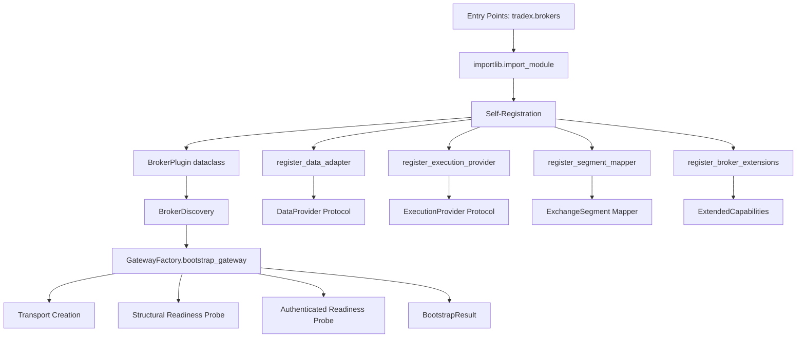
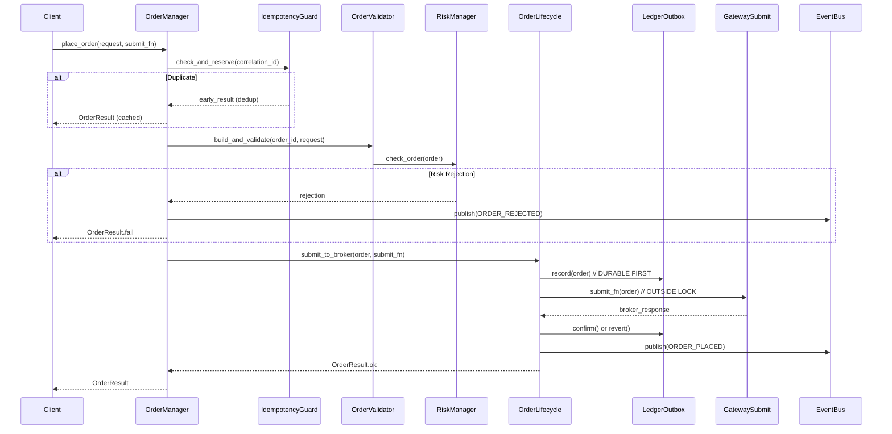

# TradeXV2 — Institutional Trading OS Transformation Roadmap

> **Generated from code-only analysis. All claims verified against actual source.**
> **Total codebase: 1,072 source files · 153K LOC · 897 test files · 49 scripts**

---

## Executive Summary

TradeXV2 is a **functionally mature** Indian-market trading platform with 2 live broker adapters (Dhan, Upstox), a full paper simulator, and an analytics/backtest stack. The architecture follows Clean Architecture and port/adapter patterns with 205 domain files, 305 broker files, and 47 AST-based architecture tests.

**The system is already 60-70% toward the target architecture.** The remaining transformation is about decomposition, not rebuilding. The core abstractions (plugin-based brokers, event bus, OMS, strategy parity, CQRS) are sound. The work is splitting god classes, formalizing bounded contexts, hardening operations, and building the developer platform.

### Current State Scorecard

| Dimension | Score | Evidence |
|-----------|-------|----------|
| Domain-Driven | 6/10 | 205 domain files, but flat namespace with 32 subdirectories. No aggregate boundaries. |
| Object-Oriented | 7/10 | Protocol-based ports, rich instrument objects. But 3 god classes (800+ lines each). |
| Event-Driven | 8/10 | Full EventBus with DLQ, copy-on-publish, idempotency. Events/types.py at 1008 lines needs splitting. |
| Broker-Agnostic | 8/10 | Plugin system with self-registration. But `_session_gateway()` escape hatch exists. |
| Exchange-Agnostic | 7/10 | ExchangeSegment enums, segment mappers. But exchange-specific logic leaks into some paths. |
| Plugin-Based | 8/10 | Entry point discovery, self-registration, certification suite. Dual registration fallback is acknowledged tech debt. |
| Production-Ready | 5/10 | SSL hardening, token redaction, metrics. But no deployment infra, no Docker, no K8s, no SLOs. |
| AI-Friendly | 7/10 | MCP server, agent tools with guardrails, structured schemas. But no golden datasets, no notebooks. |
| Highly Testable | 8/10 | 897 test files, Protocol fakes, architecture tests. Some areas lack integration coverage. |
| Continuously Deployable | 4/10 | Pre-commit hooks, ruff, mypy. But no CI/CD pipeline visible, no container builds, no staging. |

---

## Table of Contents

1. [Phase 0 — Discovery & Baseline](#phase-0--discovery--baseline)
2. [Phase 1 — Architecture Foundation](#phase-1--architecture-foundation)
3. [Phase 2 — Runtime & Flow Design](#phase-2--runtime--flow-design)
4. [Phase 3 — Engineering Standards](#phase-3--engineering-standards)
5. [Phase 4 — Developer Platform](#phase-4--developer-platform)
6. [Phase 5 — Core Platform Refactoring](#phase-5--core-platform-refactoring)
7. [Phase 6 — Feature Delivery](#phase-6--feature-delivery)
8. [Phase 7 — Production Hardening](#phase-7--production-hardening)
9. [Phase 8 — Continuous Improvement](#phase-8--continuous-improvement)
10. [Appendices](#appendices)

---

## Phase 0 — Discovery & Baseline

### Objective

Establish a verified, machine-readable baseline of the current system so every subsequent phase starts from facts, not assumptions.

### Scope

The entire repository: `src/`, `tests/`, `scripts/`, `web/`, `pyproject.toml`, `.github/`.

### Deliverables

| ID | Artifact | Description |
|----|----------|-------------|
| D0.1 | Repository Map | Complete directory tree with per-directory file counts and LOC |
| D0.2 | Dependency Graph | Import graph for all 1,072 source files (use `pydeps` or `import-linter` output) |
| D0.3 | Module Ownership Matrix | Which team/agent owns each `src/*` directory |
| D0.4 | Architecture Diagram (As-Is) | Mermaid diagram of actual layer dependencies |
| D0.5 | Technical Debt Register | Prioritized list of all identified issues |
| D0.6 | Test Coverage Map | Which modules have unit/component/integration/e2e/chaos tests |
| D0.7 | API Surface Inventory | All public APIs across SDK, CLI, MCP, REST, WebSocket |
| D0.8 | Risk Register | Identified risks with severity, likelihood, mitigation |

### Tasks

#### Task D0.1 — Repository Mapping
- **ID:** D0.1
- **Description:** Generate complete file tree with LOC per directory. Identify largest files (>500 LOC). Flag dead code (unused imports, unreachable paths).
- **Dependencies:** None
- **Output:** `docs/baseline/repository_map.md`
- **Complexity:** Low
- **Risks:** None
- **Acceptance Criteria:**
  - Every `.py` file listed with LOC
  - Largest 30 files identified
  - Dead code candidates flagged
  - Verified against `find src -name "*.py" | wc -l` = 1,072

#### Task D0.2 — Dependency Graph
- **ID:** D0.2
- **Description:** Generate import graph. Identify circular dependencies. Map which domain modules import from which infrastructure modules (violating dependency rule). Run `import-linter` contracts and document pass/fail.
- **Dependencies:** D0.1
- **Output:** `docs/baseline/dependency_graph.md` + `docs/baseline/import_linter_report.txt`
- **Complexity:** Medium
- **Risks:** Some circular dependencies may exist in `domain/events/types.py` re-exports
- **Acceptance Criteria:**
  - Import graph generated for all 1,072 files
  - Import-linter contracts all pass (or failures documented with migration plan)
  - No circular dependencies in domain layer

#### Task D0.3 — Module Ownership
- **ID:** D0.3
- **Description:** Assign ownership for each top-level package. Document primary and backup owners.
- **Dependencies:** D0.1
- **Output:** `docs/baseline/ownership_matrix.md`
- **Complexity:** Low
- **Risks:** Requires human input for team assignments
- **Acceptance Criteria:**
  - Every `src/*` directory has an assigned owner
  - Ownership matrix in table format

#### Task D0.4 — As-Is Architecture Diagram
- **ID:** D0.4
- **Description:** Create Mermaid diagrams showing: (a) layer dependency graph, (b) broker plugin architecture, (c) OMS order lifecycle, (d) event flow, (e) data flow from WebSocket to strategy to order placement.
- **Dependencies:** D0.2
- **Output:** `docs/baseline/architecture_as_is.md`
- **Complexity:** Medium
- **Risks:** None
- **Acceptance Criteria:**
  - 5 diagrams covering all major flows
  - Diagrams reflect actual code, not aspirational design
  - Verified by reading the actual import paths

#### Task D0.5 — Technical Debt Register
- **ID:** D0.5
- **Description:** Catalog all identified issues from code analysis. Prioritize by severity and fix effort.
- **Dependencies:** D0.1, D0.2
- **Output:** `docs/baseline/tech_debt_register.md`
- **Complexity:** Medium
- **Risks:** None
- **Acceptance Criteria:**
  - Every issue from this analysis documented
  - Each issue has severity (High/Medium/Low), effort estimate, and suggested fix
  - Issues linked to specific file paths and line numbers

#### Task D0.6 — Test Coverage Map
- **ID:** D0.6
- **Description:** Map which source modules are covered by which test layer. Identify untested critical paths. Run `pytest --cov` and document results.
- **Dependencies:** D0.1
- **Output:** `docs/baseline/test_coverage_map.md`
- **Complexity:** Medium
- **Risks:** Some tests may require live broker connections to run
- **Acceptance Criteria:**
  - Coverage map for all 1,072 source files
  - Gap analysis: which critical paths lack tests
  - Current coverage percentage documented

#### Task D0.7 — API Surface Inventory
- **ID:** D0.7
- **Description:** Catalog all public APIs: SDK (`BrokerSession` methods), CLI (43 Click commands), MCP (21 tools), REST (16 routers), WebSocket (2 endpoints), Agent (12 tools). Map which service function backs each API.
- **Dependencies:** None
- **Output:** `docs/baseline/api_surface.md`
- **Complexity:** Medium
- **Risks:** None
- **Acceptance Criteria:**
  - Every public API endpoint listed
  - Backing service function identified
  - API parity between surfaces verified

#### Task D0.8 — Risk Register
- **ID:** D0.8
- **Description:** Identify all transformation risks: data migration, backward compatibility, live trading disruption, test regression.
- **Dependencies:** All previous D0.x tasks
- **Output:** `docs/baseline/risk_register.md`
- **Complexity:** Medium
- **Risks:** None
- **Acceptance Criteria:**
  - Risks categorized by probability and impact
  - Each risk has a mitigation strategy
  - Register reviewed by stakeholders

### Exit Criteria

- [ ] All D0.x deliverables produced and reviewed
- [ ] Repository map matches actual file counts (1,072 source, 897 test, 49 script)
- [ ] Dependency graph generated and validated
- [ ] Tech debt register prioritized and linked to code
- [ ] No blocking discoveries that invalidate the roadmap

---

## Phase 1 — Architecture Foundation

### Objective

Define the target architecture, bounded contexts, ubiquitous language, and package structure. Establish the architectural guardrails that every subsequent phase must respect.

### Scope

Architecture documents, ADRs, domain model, package structure, dependency rules, event model, extension model.

### Why This Phase Exists

Without a shared architectural vision, parallel work streams will diverge. This phase produces the contracts that allow multiple engineers/AI agents to work independently while maintaining consistency.

### Deliverables

| ID | Artifact | Description |
|----|----------|-------------|
| D1.1 | Architecture Principles Document | 15-20 non-negotiable principles |
| D1.2 | Bounded Context Map | DDD bounded contexts with relationships |
| D1.3 | Ubiquitous Language Glossary | Domain terms with precise definitions |
| D1.4 | Domain Model Diagram | Aggregates, entities, value objects, relationships |
| D1.5 | Target Package Structure | Final directory layout with dependency rules |
| D1.6 | Event Catalog | Complete event type taxonomy |
| D1.7 | Extension Model | Plugin SDK specification |
| D1.8 | ADR Collection | Architecture Decision Records for key choices |
| D1.9 | Architecture Guardrails | Automated enforcement rules |

### Tasks

#### Task D1.1 — Architecture Principles
- **ID:** D1.1
- **Description:** Define non-negotiable architecture principles derived from what already works in the codebase. Examples from current code:
  - "Domain layer imports from nothing" (enforced by `test_domain_isolation.py`)
  - "Broker-specific code never enters generic paths" (enforced by `test_no_broker_name_branching.py`)
  - "Gateway surfaces are frozen" (enforced by `test_gateway_surface_freeze.py`)
  - "Money paths are fail-closed" (enforced by `test_fail_closed_capital_paths.py`)
  - "One OMS per process" (enforced by `composition.py`)
  - "Record-then-submit for order durability" (enforced by `LedgerOutbox`)
  - "Strategy parity: same pipeline everywhere" (enforced by `FeaturePipeline` usage)
- **Dependencies:** Phase 0 complete
- **Output:** `docs/architecture/principles.md`
- **Complexity:** Medium
- **Risks:** Principles must reflect actual working patterns, not aspirations
- **Acceptance Criteria:**
  - 15-20 principles documented
  - Each principle has a "current evidence" section linking to the enforcing test or code
  - Each principle has a "violation example" showing what NOT to do

#### Task D1.2 — Bounded Context Map
- **ID:** D1.2
- **Description:** Define DDD bounded contexts based on the actual code clusters. Proposed contexts derived from code analysis:

  | Bounded Context | Current Location | Core Concern |
  |-----------------|------------------|--------------|
  | **Instrument** | `domain/instruments/`, `domain/capabilities/` | Instrument lifecycle, metadata, resolution |
  | **Market Data** | `domain/quotes/`, `domain/candles/`, `market_data/` | Quotes, candles, depth, historical data |
  | **Order Management** | `application/oms/`, `domain/orders/`, `domain/executions/` | Order lifecycle, state machine, idempotency |
  | **Trading** | `application/trading/`, `analytics/strategy/` | Strategy evaluation, signal generation, execution planning |
  | **Portfolio** | `domain/portfolio/`, `application/portfolio/` | Positions, holdings, P&L, risk profile |
  | **Risk** | `domain/risk/`, `application/oms/_internal/risk_manager.py` | Kill switch, circuit breakers, margin, position limits |
  | **Broker Gateway** | `brokers/`, `infrastructure/gateway/` | Broker plugin system, wire adapters, certifications |
  | **Streaming** | `application/streaming/`, broker `websocket/` | Tick routing, candle aggregation, reconnection |
  | **Analytics** | `analytics/` | Indicators, scanners, backtest, replay, reports |
  | **Data Lake** | `datalake/` | Parquet storage, DuckDB catalog, data quality |
  | **Identity & Auth** | `broker/dhan/auth/`, `broker/upstox/auth/`, `infrastructure/security/` | Token management, TOTP, encryption |
  | **Observability** | `infrastructure/observability/`, `infrastructure/metrics/` | Metrics, tracing, alerting, health checks |

  Document context relationships: Customer-Supplier, Conformist, Anti-Corruption Layer, Shared Kernel, Open Host Service, Published Language.

- **Dependencies:** D1.1
- **Output:** `docs/architecture/bounded_contexts.md`
- **Complexity:** High
- **Risks:** Must map to actual code boundaries, not force-fitDDD patterns
- **Acceptance Criteria:**
  - Every source file assigned to exactly one bounded context
  - Context relationships documented with integration patterns
  - Diagram showing context map with upstream/downstream relationships

#### Task D1.3 — Ubiquitous Language
- **ID:** D1.3
- **Description:** Extract and formalize domain terminology from the codebase. Key terms to define:

  | Term | Current Usage | Formal Definition |
  |------|--------------|-------------------|
  | Instrument | `domain/instruments/instrument.py` (819 LOC) | A tradeable entity with market data and trading capabilities |
  | Order | `domain/orders/` | A request to buy/sell with lifecycle state |
  | Fill | `domain/executions/` | A confirmed trade execution |
  | Position | `domain/portfolio/` | An aggregated holding from fills |
  | Candidate | `analytics/scanner/models.py` | A scanner-identified potential trade |
  | Signal | `analytics/strategy/models.py` | A strategy-generated trade intent with confidence |
  | Capability | `domain/capabilities/` | A feature a broker/instrument supports |
  | Extension | `domain/extensions/` | A broker-specific feature beyond the base interface |
  | Replay | `analytics/replay/` | Historical bar-by-bar simulation |
  | Parity | `runtime/parity_gate.py` | Determinism verification across execution modes |

- **Dependencies:** D1.2
- **Output:** `docs/architecture/ubiquitous_language.md`
- **Complexity:** Medium
- **Risks:** Language must be consistent across all contexts
- **Acceptance Criteria:**
  - 50+ terms defined
  - Each term has a precise definition, current code location, and example usage
  - No ambiguous terms remaining

#### Task D1.4 — Domain Model Diagram
- **ID:** D1.4
- **Description:** Create Mermaid class diagrams showing:
  - Aggregate roots and their boundaries
  - Entity relationships within each aggregate
  - Value objects and their constraints
  - Domain events produced by each aggregate
  - Ports (interfaces) consumed by each aggregate

  Key aggregates to model:
  - `Instrument` aggregate (Equity, Future, Option, OptionChain)
  - `Order` aggregate (Order, OrderIntent, Fill, OrderState)
  - `Position` aggregate (Position, Holding, PnL)
  - `Strategy` aggregate (Strategy, Signal, Candidate, FeatureSet)
  - `Session` aggregate (BrokerSession, RuntimeBundle, LifecycleManager)

- **Dependencies:** D1.2, D1.3
- **Output:** `docs/architecture/domain_model.md`
- **Complexity:** High
- **Risks:** Must reflect actual code, not idealized patterns
- **Acceptance Criteria:**
  - Every aggregate in the domain layer modeled
  - Mermaid diagrams renderable
  - Diagrams verified against actual class hierarchies

#### Task D1.5 — Target Package Structure
- **ID:** D1.5
- **Description:** Define the final package structure. The current structure is already close to correct. Key changes:

  1. Split `domain/events/types.py` (1008 lines) into per-context event files
  2. Split `domain/capability_manifest/catalog.py` (905 lines) into per-context catalogs
  3. Split `domain/universe.py` (808 lines) into focused modules
  4. Split `application/oms/context.py` (809 lines) into lifecycle, reconciliation, DLQ
  5. Split `application/trading/trading_orchestrator.py` (807 lines) into pipeline stages
  6. Split `analytics/replay/engine.py` (1125 lines) into OMS-integrated and simulated paths
  7. Move `brokers/common/` shared code to `infrastructure/` where it's truly cross-cutting
  8. Remove legacy `brokers/dhan/` (top-level) dead code
  9. Formalize bounded context directories with `__init__.py` exports

- **Dependencies:** D1.2
- **Output:** `docs/architecture/target_package_structure.md`
- **Complexity:** High
- **Risks:** Must be achievable incrementally without breaking existing imports
- **Acceptance Criteria:**
  - Target structure documented with migration path from current structure
  - No file in target structure exceeds 400 LOC
  - Dependency rules documented per directory

#### Task D1.6 — Event Catalog
- **ID:** D1.6
- **Description:** Catalog all domain events from `domain/events/types.py` (1008 lines). Group by bounded context. Define event schemas, versioning strategy, and migration path.

  Current event types identified in code (from `domain/events/types.py`):
  - Order events: ORDER_PLACED, ORDER_MODIFIED, ORDER_CANCELLED, ORDER_FILLED, ORDER_REJECTED
  - Trade events: TRADE_APPLIED, TRADE_FILLED
  - Market events: QUOTE_RECEIVED, DEPTH_RECEIVED, CANDLE_COMPLETED
  - Strategy events: CANDIDATE_GENERATED, SIGNAL_GENERATED
  - Portfolio events: POSITION_UPDATED, HOLDINGS_LOADED
  - System events: SESSION_CONNECTED, SESSION_DISCONNECTED, HEARTBEAT

  Each event currently carries `correlation_id`, `sequence_number`, `timestamp`, and context-specific payload.

- **Dependencies:** D1.2
- **Output:** `docs/architecture/event_catalog.md`
- **Complexity:** Medium
- **Risks:** Event types may be used in serialization formats that require migration
- **Acceptance Criteria:**
  - Every event type cataloged with schema
  - Events grouped by producing bounded context
  - Events grouped by consuming bounded context
  - Versioning strategy defined

#### Task D1.7 — Extension Model
- **ID:** D1.7
- **Description:** Formalize the plugin/extension model. Current implementation:
  - Entry points: `tradex.brokers` group
  - Self-registration: `register_broker_plugin()`, `register_data_adapter()`, etc.
  - `BrokerPlugin` dataclass with capabilities
  - `ExtendedCapabilities` for broker-specific features
  - `BrokerCertifier` for validation

  Define the public SDK for third-party broker plugins, including:
  - Required interfaces
  - Optional interfaces
  - Capability declaration
  - Certification requirements
  - Version compatibility

- **Dependencies:** D1.1, D1.2
- **Output:** `docs/architecture/extension_model.md`
- **Complexity:** Medium
- **Risks:** Must not break existing broker plugins
- **Acceptance Criteria:**
  - Plugin author guide produced
  - Required/optional interfaces documented
  - Certification requirements specified
  - Migration path from current registration to formalized model

#### Task D1.8 — Architecture Decision Records
- **ID:** D1.8
- **Description:** Produce ADRs for all key architectural decisions. The codebase already references many ADRs (ADR-007, ADR-011, ADR-014, ADR-017, ADR-020). Create formal ADRs for:

  | ADR | Topic | Status |
  |-----|-------|--------|
  | ADR-001 | Plugin-based broker architecture | Accepted (implemented) |
  | ADR-002 | Event bus with DLQ | Accepted (implemented) |
  | ADR-003 | SQLite for OMS persistence | Accepted (implemented) |
  | ADR-004 | DuckDB for analytics queries | Accepted (implemented) |
  | ADR-005 | Strategy parity across modes | Accepted (implemented) |
  | ADR-006 | Record-then-submit order pattern | Accepted (implemented) |
  | ADR-007 | Self-registration for broker plugins | Accepted (implemented) |
  | ADR-008 | Protocol-based interfaces over ABCs | Accepted (implemented) |
  | ADR-009 | Bounded context decomposition | Proposed |
  | ADR-010 | Event type splitting strategy | Proposed |
  | ADR-011 | God class decomposition plan | Proposed |
  | ADR-012 | Deployment architecture | Proposed |
  | ADR-013 | Multi-tenant isolation model | Proposed |
  | ADR-014 | API versioning strategy | Proposed |
  | ADR-015 | Observability stack selection | Proposed |

- **Dependencies:** D1.1-D1.7
- **Output:** `docs/architecture/adr/` directory
- **Complexity:** Medium
- **Risks:** Must distinguish between existing decisions and proposed ones
- **Acceptance Criteria:**
  - Every significant architectural decision has an ADR
  - Each ADR follows standard template (Context, Decision, Consequences, Status)
  - Existing implemented ADRs linked to enforcing code/tests

#### Task D1.9 — Architecture Guardrails
- **ID:** D1.9
- **Description:** Document and extend the existing 47 architecture tests. Add new guards for:
  - Bounded context isolation (new contexts from D1.2)
  - Event schema versioning
  - Max file size enforcement (400 LOC)
  - No `PYTEST_CURRENT_TEST` in production code
  - No `__import__("logging")` anti-pattern
  - No god class patterns (files > 400 LOC trigger warning)
- **Dependencies:** D1.2, D1.5
- **Output:** `docs/architecture/guardrails.md` + new test files
- **Complexity:** Medium
- **Risks:** Some new guards may initially fail against current code
- **Acceptance Criteria:**
  - All new guardrails documented
  - New architecture test files added
  - Existing 47 tests continue passing
  - New guards pass against current code (or exceptions documented)

### Risks

| Risk | Severity | Likelihood | Mitigation |
|------|----------|------------|------------|
| Bounded contexts don't map to actual code boundaries | High | Medium | Validate against import graph; accept pragmatic boundaries |
| Ubiquitous language creates confusion with existing code names | Medium | Low | Use existing code names as canonical; don't rename without migration |
| Target package structure requires massive refactoring | High | Low | Define as incremental migration, not big-bang rewrite |
| ADRs become stale documents | Medium | High | Link each ADR to enforcing architecture test |

### Exit Criteria

- [ ] Architecture principles documented and enforceable
- [ ] Bounded context map covers 100% of source files
- [ ] Domain model diagrams produced for all aggregates
- [ ] Target package structure defined with migration path
- [ ] Event catalog complete with schemas
- [ ] Extension model formalized as public SDK spec
- [ ] All ADRs produced (implemented + proposed)
- [ ] Architecture guardrails documented and tests added
- [ ] No regressions in existing test suite

---

## Phase 2 — Runtime & Flow Design

### Objective

Document every runtime flow in the system as sequence and activity diagrams. Define state machines for all stateful entities. This phase produces the "behavioral specification" of the Trading OS.

### Scope

Startup, connection, authentication, instrument lifecycle, data flows, order lifecycle, position lifecycle, portfolio lifecycle, replay, shutdown, recovery, error handling.

### Why This Phase Exists

The codebase has complex flows scattered across 1,072 files. Without explicit flow documentation, new engineers and AI agents cannot safely modify behavior without introducing regressions. Every flow must be documented and verifiable.

### Deliverables

| ID | Artifact | Description |
|----|----------|-------------|
| D2.1 | Flow Diagrams | 15+ sequence diagrams for major flows |
| D2.2 | State Machines | Formal state machines for Order, Position, Session, Strategy |
| D2.3 | Error Handling Matrix | Error type → recovery action for every flow |
| D2.4 | Concurrency Model | Threading/async model documentation |
| D2.5 | Data Lineage | End-to-end data flow from raw tick to stored bar |

### Tasks

#### Task D2.1 — Flow Diagrams
- **ID:** D2.1
- **Description:** Produce Mermaid sequence diagrams for:

  1. **System Startup** (`tradex/session.py:open_session` → `RuntimeFactory.build` → `LifecycleManager.start_all`)
  2. **Broker Connection** (`gateway/factory.py:bootstrap_gateway` → transport → auth probe → TOTP)
  3. **Instrument Resolution** (`BrokerSession.stock()` → `Universe.resolve()` → `InstrumentLoader`)
  4. **Quote Flow** (`BrokerSession.quote()` → `RuntimeBundle.quote_manager` → gateway → `QuoteSnapshot`)
  5. **History Flow** (`BrokerSession.history()` → `HistoricalManager` → gateway → `HistoricalSeries`)
  6. **Subscription Flow** (`BrokerSession.subscribe()` → `SubscriptionManager` → WebSocket → `TickRouter`)
  7. **Order Placement** (`BrokerSession.buy()` → `OrderManager.place_order()` → `LedgerOutbox` → broker → `EventBus`)
  8. **Order Lifecycle** (PLACED → TRIGGERED → PARTIAL → FILLED / CANCELLED / REJECTED)
  9. **Position Update** (FILL event → `PositionManager` → `PortfolioContext` → position update)
  10. **Strategy Pipeline** (candidate → features → evaluate → signal → intent → order)
  11. **Replay Flow** (`ReplayEngine` bar-by-bar → strategy evaluation → simulated fill → PnL)
  12. **Backtest Flow** (`BacktestEngine` → `ReplayEngine` + `StatisticsEngine`)
  13. **WebSocket Reconnection** (disconnect → `ReconnectController` → exponential backoff → reconnect)
  14. **Graceful Shutdown** (`LifecycleManager.stop_all()` → reverse order → timeout enforcement)
  15. **Recovery** (process restart → `ParityGate` → state reconstruction from event log)

- **Dependencies:** Phase 1 complete
- **Output:** `docs/flows/` directory with one `.md` file per flow
- **Complexity:** High
- **Risks:** Flows must match actual code paths, not idealized behavior
- **Acceptance Criteria:**
  - 15 flow diagrams produced
  - Each diagram verified against actual code path
  - Each diagram includes error branches

#### Task D2.2 — State Machines
- **ID:** D2.2
- **Description:** Define formal state machines for:

  1. **Order State Machine** (currently in `_internal/order_state_validator.py`):
     ```
     → PENDING_VALIDATION → SUBMITTED → PLACED → TRIGGERED → PARTIALLY_FILLED → FILLED
                                                    → PARTIALLY_CANCELLED → CANCELLED
                                                    → REJECTED
     ```
     Plus: MODIFY_PENDING → MODIFIED, CANCEL_PENDING

  2. **Session State Machine** (currently in `session_status.py`):
     ```
     → DISCONNECTED → CONNECTING → CONNECTED → AUTHENTICATED → READY
                                                       → DEGRADED
                                              → DISCONNECTED (reconnect cycle)
     ```

  3. **Loss Circuit Breaker** (currently in `_internal/loss_circuit_breaker.py`):
     ```
     CLOSED → OPEN (threshold breach) → COOLDOWN (timer) → CLOSED
     ```

  4. **Strategy Pipeline State** (candidate lifecycle):
     ```
     CANDIDATE_GENERATED → FEATURES_FETCHED → EVALUATED → SIGNAL_GENERATED → EXECUTED / REJECTED
     ```

  5. **Replay Session State**:
     ```
     → IDLE → RUNNING → PAUSED → COMPLETED
                   ↑         ↓
                   └─────────┘
     ```

  6. **WebSocket Connection State** (from `streaming/connection.py`):
     ```
     → DISCONNECTED → CONNECTING → CONNECTED → STREAMING
                                       ↓
                                    RECONNECTING → CONNECTING
     ```

- **Dependencies:** D2.1
- **Output:** `docs/flows/state_machines.md`
- **Complexity:** High
- **Risks:** State machines must match actual implementation, not just planned behavior
- **Acceptance Criteria:**
  - 6 state machines documented
  - Each state machine has a Mermaid stateDiagram
  - Each transition has a guard condition documented
  - Each terminal state has a recovery action

#### Task D2.3 — Error Handling Matrix
- **ID:** D2.3
- **Description:** Document error handling for every flow. Current infrastructure:
  - `global_exception_handler.py`: 12 exception → HTTP status mappings
  - `EventBus._handle_handler_failure`: DLQ + metrics (never swallowed)
  - `LifecycleManager.stop_all`: timeout enforcement + thread abandonment
  - `broker/dhan/resilience/`: circuit breaker, retry executor, retry policies
  - `broker/upstox/auth/`: token refresh on 401

  Build a matrix: Error Type × Flow × Recovery Action × Alert Level

- **Dependencies:** D2.1
- **Output:** `docs/flows/error_handling_matrix.md`
- **Complexity:** Medium
- **Risks:** Some error paths may not be implemented yet
- **Acceptance Criteria:**
  - Every flow has documented error handling
  - Error types linked to exception hierarchy
  - Recovery actions specified for each error type

#### Task D2.4 — Concurrency Model
- **ID:** D2.4
- **Description:** Document the threading/async model:
  - Single process-wide event loop (`runtime/event_loop.py`)
  - `run_coro_sync()` fallback chain
  - OMS `RLock` discipline (lock held only for state mutations, not I/O)
  - EventBus lock sharding (separate subscriber lock from sequence counter)
  - AsyncEventBus background worker with backpressure
  - Background daemon threads (alerting, DLQ cleanup, metrics)
  - Thread-safe DI container with `contextvars` for request scope
  - `QuotaScheduler` async rate limiting

  Enforce the concurrency boundary: only `runtime/event_loop.py` may call `asyncio.new_event_loop()` (already tested by `test_concurrency_boundary.py`).

- **Dependencies:** D2.1
- **Output:** `docs/flows/concurrency_model.md`
- **Complexity:** Medium
- **Risks:** Race conditions may exist in undocumented edge cases
- **Acceptance Criteria:**
  - Threading model documented with diagram
  - Lock hierarchy documented (which locks can nest)
  - Async/sync bridge points identified
  - Potential race conditions flagged

#### Task D2.5 — Data Lineage
- **ID:** D2.5
- **Description:** Trace data from raw tick to stored bar:
  1. Raw tick arrives via WebSocket (broker-specific format)
  2. Wire adapter normalizes to domain `Tick` or `QuoteSnapshot`
  3. `TickRouter` deduplicates and fans out
  4. `CandleAggregator` converts to OHLCV bars
  5. Bars stored to Parquet (via `datalake/ingestion/`)
  6. `DataQualityEngine` validates completeness
  7. `FeaturePipeline` computes indicators on bars
  8. `StrategyPipeline` evaluates candidates
  9. Results exposed via API/CLI/MCP

- **Dependencies:** D2.1
- **Output:** `docs/flows/data_lineage.md`
- **Complexity:** Medium
- **Risks:** Data transformations at each stage must be documented precisely
- **Acceptance Criteria:**
  - End-to-end data lineage traced
  - Data format at each stage documented
  - Schema evolution strategy defined

### Exit Criteria

- [ ] 15 flow diagrams produced and verified against code
- [ ] 6 state machines documented with Mermaid diagrams
- [ ] Error handling matrix complete
- [ ] Concurrency model documented
- [ ] Data lineage traced end-to-end
- [ ] All diagrams pass review (match actual code behavior)

---

## Phase 3 — Engineering Standards

### Objective

Codify engineering rules that enable parallel work without architectural drift. Many of these rules already exist as architecture tests; this phase formalizes them and fills gaps.

### Scope

Naming conventions, folder ownership, dependency rules, logging, error handling, testing, documentation, CI gates.

### Why This Phase Exists

The codebase already has 47 architecture tests, but standards are scattered across test files and pyproject.toml config. This phase consolidates them into a single authoritative reference.

### Deliverables

| ID | Artifact | Description |
|----|----------|-------------|
| D3.1 | Engineering Standards Handbook | Complete rules reference |
| D3.2 | CI Quality Gates | Automated enforcement rules |
| D3.3 | Code Review Checklist | PR review checklist |

### Tasks

#### Task D3.1 — Standards Handbook
- **ID:** D3.1
- **Description:** Consolidate all engineering standards into one document. Sections:

  1. **Naming Conventions** (from ruff config + existing patterns):
     - Files: `snake_case.py`
     - Classes: `PascalCase`
     - Functions: `snake_case`
     - Constants: `UPPER_SNAKE_CASE`
     - Private: `_leading_underscore`
     - Protocol interfaces: `I` prefix or `Protocol` suffix (current convention varies — standardize)

  2. **Dependency Rules** (from import-linter contracts):
     - Domain imports from nothing
     - Application imports from domain only
     - Infrastructure imports from domain and application
     - Interface imports from all inner layers
     - Broker-specific never imported by broker-generic
     - CLI/UI never imported by core

  3. **Logging Standards** (from `logging_config.py`):
     - Use `logging.getLogger(__name__)` (not `__import__("logging")`)
     - Never log tokens, API keys, or security IDs
     - Always include correlation_id in log context
     - Structured JSON in production, colorized in development

  4. **Error Handling** (from `global_exception_handler.py`):
     - Domain exceptions in `domain/errors.py`
     - OMS exceptions in `application/oms/errors.py`
     - Broker exceptions in `brokers/exceptions/`
     - No bare `except:` clauses
     - Never swallow errors silently (EventBus DLQ policy)

  5. **Testing Standards** (from `tests/conftest.py` patterns):
     - Use Protocol-based fakes, not MagicMock
     - Test files: `test_<module>.py`
     - Test functions: `test_<behavior>`
     - Mark tests: `@pytest.mark.market_hours`, `@pytest.mark.live_api`
     - Use `build_test_trading_context()` for OMS tests

  6. **Documentation Standards**:
     - Every public API has docstring
     - Every ADR follows template
     - Every architecture test documents what it enforces
     - Every god-class decomposition has migration notes

  7. **File Size Limits**:
     - No file exceeds 400 LOC (currently 10+ files violate this)
     - No class exceeds 200 LOC
     - No function exceeds 50 LOC

- **Dependencies:** Phase 1 complete
- **Output:** `docs/standards/engineering_handbook.md`
- **Complexity:** Medium
- **Risks:** Standards must be achievable incrementally, not retroactively enforced
- **Acceptance Criteria:**
  - All sections documented
  - Each rule linked to an enforcing mechanism (test, linter, or CI gate)
  - Current violations documented with migration timeline

#### Task D3.2 — CI Quality Gates
- **ID:** D3.2
- **Description:** Define CI pipeline stages. Current tooling:
  - `ruff` (linting + formatting) ✅
  - `mypy` (type checking, strict mode) ✅
  - `import-linter` (dependency contracts) ✅
  - `pytest` (tests) ✅
  - `mutmut` (mutation testing) ✅
  - Pre-commit hooks ✅

  Add:
  - Architecture test gate (all 47+ tests must pass)
  - File size gate (no file > 400 LOC)
  - Coverage gate (fail_under currently set in pyproject.toml)
  - Security scan (no hardcoded secrets)
  - API surface diff (detect public API changes)

- **Dependencies:** D3.1
- **Output:** `docs/standards/ci_quality_gates.md`
- **Complexity:** Medium
- **Risks:** CI pipeline may need infrastructure that doesn't exist yet
- **Acceptance Criteria:**
  - Every gate documented with trigger condition and failure action
  - Gate priority ordering defined (which gates block merge vs. warn)
  - Migration path from current pre-commit-only enforcement

#### Task D3.3 — Code Review Checklist
- **ID:** D3.3
- **Description:** Create PR review checklist based on architecture principles:
  - [ ] No domain layer imports from outer layers
  - [ ] No broker-specific code in generic paths
  - [ ] New files under 400 LOC
  - [ ] New classes under 200 LOC
  - [ ] No bare `except:` clauses
  - [ ] No `MagicMock` in new tests (use Protocol fakes)
  - [ ] Event types added to catalog
  - [ ] Public API changes documented in ADR
  - [ ] Architecture tests added for new patterns
  - [ ] No `PYTEST_CURRENT_TEST` in production code
  - [ ] No `__import__("logging")` anti-pattern
  - [ ] Token/secret redaction in any new log statements

- **Dependencies:** D3.1
- **Output:** `docs/standards/review_checklist.md`
- **Complexity:** Low
- **Risks:** None
- **Acceptance Criteria:**
  - Checklist covers all architecture principles
  - Each item has an automated enforcement (where possible)

### Exit Criteria

- [ ] Engineering standards handbook complete
- [ ] CI quality gates defined
- [ ] Code review checklist produced
- [ ] All current violations cataloged with migration plan

---

## Phase 4 — Developer Platform

### Objective

Build the tooling that enables engineers and AI agents to develop, test, and validate the Trading OS without writing ad-hoc scripts.

### Scope

Python SDK, CLI, MCP server, health checks, diagnostics, broker certification, notebooks, golden datasets, sample apps.

### Why This Phase Exists

The codebase already has 3 interface surfaces (SDK, CLI, MCP) backed by a single service core (`brokers/services/core.py`). This phase extends them into a complete developer platform.

### Deliverables

| ID | Artifact | Description |
|----|----------|-------------|
| D4.1 | SDK Reference Documentation | Complete SDK API reference with examples |
| D4.2 | CLI Reference Documentation | All 43+ commands documented |
| D4.3 | MCP Tool Reference | All 21+ MCP tools documented |
| D4.4 | Golden Datasets | Versioned test data for certification |
| D4.5 | Interactive Notebooks | Jupyter notebooks for common workflows |
| D4.6 | Sample Applications | End-to-end examples for common use cases |
| D4.7 | Developer Quickstart | Getting started guide |
| D4.8 | Broker Certification Report Template | Standardized broker readiness report |

### Tasks

#### Task D4.1 — SDK Documentation
- **ID:** D4.1
- **Description:** Document the `BrokerSession` public API with examples. Current public methods:
  - **Instrument builders:** `stock()`, `etf()`, `index()`, `future()`, `option()`, `option_chain()`, `commodity()`, `currency()`, `spot()`
  - **Data:** `quote()`, `history()`, `subscribe()`, `unsubscribe()`
  - **Trading:** `buy()`, `sell()`, `orders()`, `cancel()`, `modify()`
  - **Session:** `connect()`, `connect(broker="dhan")`, `connect(broker="paper")`

  Each method needs: signature, parameters, return type, example, error cases, broker compatibility notes.

- **Dependencies:** Phase 1 complete
- **Output:** `docs/sdk/README.md`
- **Complexity:** Medium
- **Risks:** SDK surface may change during Phase 5 refactoring
- **Acceptance Criteria:**
  - Every public method documented
  - Working code examples for each method
  - Broker compatibility matrix included

#### Task D4.2 — CLI Documentation
- **ID:** D4.2
- **Description:** Document all 43+ CLI commands. Current commands from `brokers/cli/broker.py`:
  - Connection: `connect`
  - Market Data: `quote`, `history`, `subscribe`, `depth`, `depth30`, `depth200`
  - Trading: `order`, `orders`, `cancel`, `modify`, `positions`, `holdings`, `funds`
  - Analytics: `option-chain`, `super-orders`, `forever-orders`
  - Operations: `certify`, `verify`, `doctor`, `health`, `benchmark`, `mappings`
  - Shell: Interactive menu navigation with `_shell_nav.py`

- **Dependencies:** D4.1
- **Output:** `docs/cli/README.md`
- **Complexity:** Medium
- **Risks:** None
- **Acceptance Criteria:**
  - Every command documented with usage, examples, and flags
  - Shell navigation guide included
  - JSON output mode documented for CI/scripting

#### Task D4.3 — MCP Tool Reference
- **ID:** D4.3
- **Description:** Document all 21+ MCP tools from `brokers/mcp/`. Each tool needs: description, parameters, return schema, example request/response.

- **Dependencies:** D4.1
- **Output:** `docs/mcp/README.md`
- **Complexity:** Low
- **Risks:** None
- **Acceptance Criteria:**
  - Every tool documented
  - Tool schemas verified against `tools_schema.py`
  - Integration examples with Claude/other LLMs

#### Task D4.4 — Golden Datasets
- **ID:** D4.4
- **Description:** Create versioned test datasets for broker certification and parity testing. Current implementation in `brokers/certification/golden.py` already supports JSON golden datasets. Extend to cover:
  - Instrument master data for each exchange (NSE, BSE, MCX)
  - Historical OHLCV data for test symbols
  - Expected option chain snapshots
  - Expected depth snapshots
  - Order lifecycle state transitions

- **Dependencies:** D1.2 (bounded contexts)
- **Output:** `tests/fixtures/golden/` directory
- **Complexity:** Medium
- **Risks:** Golden data may become stale as market data changes
- **Acceptance Criteria:**
  - Golden datasets versioned and checksummed
  - Certification tests use golden datasets
  - Data freshness validation documented

#### Task D4.5 — Interactive Notebooks
- **ID:** D4.5
- **Description:** Create Jupyter notebooks for common workflows:
  1. Quickstart: Connect and get a quote
  2. Historical analysis: Download and analyze data
  3. Strategy development: Build and backtest a strategy
  4. Options analysis: Greeks, PCR, max pain
  5. Portfolio monitoring: Positions, P&L, risk
  6. Broker certification: Run full certification suite

  Current notebooks exist in `brokers/notebooks/` — extend and formalize.

- **Dependencies:** D4.1, D4.4
- **Output:** `docs/notebooks/` directory
- **Complexity:** Medium
- **Risks:** Notebooks may require live broker connection
- **Acceptance Criteria:**
  - 6 notebooks produced
  - Each notebook runs against paper broker
  - Each notebook has expected output snapshots

#### Task D4.6 — Sample Applications
- **ID:** D4.6
- **Description:** Create end-to-end sample applications:
  1. Market scanner → strategy → order placement (paper)
  2. Real-time dashboard with WebSocket streaming
  3. Backtest runner with parameter optimization
  4. Multi-broker arbitrage monitor

  Current examples exist in `examples/` — extend and formalize.

- **Dependencies:** D4.1
- **Output:** `examples/` directory (extend existing)
- **Complexity:** Medium
- **Risks:** Examples must work with paper broker
- **Acceptance Criteria:**
  - 4 sample applications
  - Each runs with `python examples/<name>/main.py`
  - Each documented with README

#### Task D4.7 — Developer Quickstart
- **ID:** D4.7
- **Description:** Create a 5-minute getting started guide:
  1. Install the package
  2. Configure paper broker
  3. Connect and get a quote
  4. Place a paper order
  5. Check positions
  6. Run certification

- **Dependencies:** D4.1, D4.2, D4.3
- **Output:** `docs/QUICKSTART.md`
- **Complexity:** Low
- **Risks:** None
- **Acceptance Criteria:**
  - Guide takes < 5 minutes
  - No live broker credentials required
  - All commands verified

#### Task D4.8 — Broker Certification Report
- **ID:** D4.8
- **Description:** Formalize the certification report output from `brokers/certification/report.py`. Current implementation:
  - 54 certification areas
  - Tier resolution (L0-L3)
  - JSON serialization
  - Schema v2 validation

  Extend with: HTML report generation, comparison across brokers, historical trend tracking.

- **Dependencies:** D4.4
- **Output:** `docs/broker_certification.md` + report template
- **Complexity:** Low
- **Risks:** None
- **Acceptance Criteria:**
  - Report template documented
  - HTML rendering produces readable output
  - Report schema verified against `schema_v2.py`

### Exit Criteria

- [ ] SDK, CLI, MCP documentation complete
- [ ] Golden datasets created and versioned
- [ ] 6 interactive notebooks produced
- [ ] 4 sample applications running
- [ ] Developer quickstart guide verified
- [ ] Broker certification report template ready

---

## Phase 5 — Core Platform Refactoring

### Objective

Decompose god classes, split oversized files, and strengthen boundaries. This is the highest-risk phase — every change must maintain deployability.

### Scope

God class decomposition, event type splitting, file size reduction, dead code removal, boundary strengthening.

### Why This Phase Exists

Three 800+ line god classes and several oversized modules create maintenance risk and parallel-work conflicts. Decomposing them unlocks cleaner architecture for Phase 6 feature work.

### Deliverables

| ID | Artifact | Description |
|----|----------|-------------|
| D5.1 | God Class Decompositions | TradingContext, TradingOrchestrator, ReplayEngine split |
| D5.2 | Event Type Splitting | `domain/events/types.py` split by context |
| D5.3 | Dead Code Removal | Remove legacy `brokers/dhan/` top-level files |
| D5.4 | File Size Compliance | All files under 400 LOC |
| D5.5 | Boundary Strengthening | Eliminate escape hatches and anti-patterns |

### Tasks

#### Task D5.1 — God Class Decomposition

##### D5.1.1 — TradingContext (809 lines → 4 classes)
- **ID:** D5.1.1
- **Description:** Split `application/oms/context.py` into:
  1. `TradingContext` — lifecycle management (start/stop/health)
  2. `ReconciliationService` — broker-vs-local reconciliation (already partially exists)
  3. `DlqMonitor` — dead letter queue monitoring and alerting
  4. `DailyPnlResetScheduler` — daily P&L reset (already partially exists)
- **Dependencies:** Phase 1 complete
- **Output:** 4 focused classes, all under 250 LOC
- **Complexity:** High
- **Risks:** TradingContext is instantiated by many callers; interface must remain stable
- **Acceptance Criteria:**
  - All 4 classes under 250 LOC
  - All existing tests pass
  - New tests for each decomposed class
  - `TradingContext` facade delegates to 4 components (backward compatible)

##### D5.1.2 — TradingOrchestrator (807 lines → 5 classes)
- **ID:** D5.1.2
- **Description:** Split `application/trading/trading_orchestrator.py` into:
  1. `CandidateProcessor` — candidate intake and validation
  2. `FeatureFetcher` — pipeline feature computation (LRU-cached)
  3. `SignalEvaluator` — strategy pipeline evaluation
  4. `ExecutionPlanner` — position sizing, risk checks, order building
  5. `TradingOrchestrator` — orchestrator (thin coordinator)
- **Dependencies:** Phase 1 complete
- **Output:** 5 focused classes, all under 200 LOC
- **Complexity:** High
- **Risks:** Orchestrator is the main entry point for live trading; must maintain behavior exactly
- **Acceptance Criteria:**
  - All 5 classes under 200 LOC
  - Orchestrator produces identical execution paths
  - All existing tests pass
  - Pipeline stages independently testable

##### D5.1.3 — ReplayEngine (1125 lines → 3 classes)
- **ID:** D5.1.3
- **Description:** Split `analytics/replay/engine.py` into:
  1. `ReplayEngine` — core bar-by-bar replay loop
  2. `OmsIntegratedFillModel` — fill simulation using OMS order book
  3. `SimulatedFillModel` — standalone fill simulation
- **Dependencies:** Phase 1 complete
- **Output:** 3 focused classes, largest under 500 LOC
- **Complexity:** High
- **Risks:** ReplayEngine is the PnL spine; split must not introduce numerical drift
- **Acceptance Criteria:**
  - Replay PnL identical before and after split
  - All parity tests pass
  - Fill models independently testable

##### D5.1.4 — RiskManager (678 lines → 3 classes)
- **ID:** D5.1.4
- **Description:** Split `application/oms/_internal/risk_manager.py` into:
  1. `RiskManager` — coordinator (thin)
  2. `KillSwitch` — kill switch logic
  3. `MarginChecker` — margin validation
- **Dependencies:** Phase 1 complete
- **Output:** 3 focused classes, largest under 300 LOC
- **Complexity:** Medium
- **Risks:** Risk checks are on the critical order path; must maintain exact behavior
- **Acceptance Criteria:**
  - All risk checks produce identical results
  - All existing tests pass
  - Each component independently testable

##### D5.1.5 — DhanExtendedCapabilities (365 lines → sub-facades)
- **ID:** D5.1.5
- **Description:** Split `brokers/dhan/extended.py` into sub-facades:
  1. `DhanOrderCapabilities` — super orders, forever orders, exit all, P&L exit
  2. `DhanDataCapabilities` — option chain, futures, depth
  3. `DhanAccountCapabilities` — ledger, user profile, IP management, EDIS
- **Dependencies:** Phase 1 complete
- **Output:** 3 sub-facades, largest under 200 LOC
- **Complexity:** Medium
- **Risks:** Extension registration must still work
- **Acceptance Criteria:**
  - All broker-specific methods preserved
  - Registration pattern unchanged
  - Each sub-facade independently testable

#### Task D5.2 — Event Type Splitting

##### D5.2.1 — Split domain/events/types.py (1008 lines)
- **ID:** D5.2.1
- **Description:** Split the monolithic events file into per-context event files:
  ```
  domain/events/
    __init__.py          # Re-exports all events for backward compatibility
    types.py             # Base DomainEvent class only
    order_events.py      # ORDER_PLACED, ORDER_MODIFIED, etc.
    trade_events.py      # TRADE_APPLIED, TRADE_FILLED
    market_events.py     # QUOTE_RECEIVED, DEPTH_RECEIVED, CANDLE_COMPLETED
    strategy_events.py   # CANDIDATE_GENERATED, SIGNAL_GENERATED
    portfolio_events.py  # POSITION_UPDATED, HOLDINGS_LOADED
    system_events.py     # SESSION_CONNECTED, HEARTBEAT, etc.
  ```
- **Dependencies:** D1.6 (event catalog)
- **Output:** 7 focused event files, largest under 200 LOC
- **Complexity:** Medium
- **Risks:** All existing imports must continue to work via `__init__.py` re-exports
- **Acceptance Criteria:**
  - `from domain.events.types import *` still works (backward compatible)
  - Each new file under 200 LOC
  - All existing tests pass without import changes
  - Architecture test added for event file size

#### Task D5.3 — Dead Code Removal
- **ID:** D5.3
- **Description:** Remove or reconcile:
  1. `brokers/dhan/gateway.py` and `brokers/dhan/orders.py` (top-level) — legacy files superseded by `src/brokers/dhan/`
  2. `market_data/` — empty directory
  3. Unused `analytics_cache/` directory
  4. Any confirmed dead imports or unreachable code paths

- **Dependencies:** D0.2 (dependency graph)
- **Output:** Reduced file count, no orphaned references
- **Complexity:** Low
- **Risks:** Some "dead" code may be used by external tools
- **Acceptance Criteria:**
  - All removed files confirmed unused via import graph
  - No test failures after removal
  - `pyproject.toml` package includes updated

#### Task D5.4 — File Size Compliance
- **ID:** D5.4
- **Description:** Bring all source files under 400 LOC. Current violations (>400 LOC):

  | File | Current LOC | Target |
  |------|-------------|--------|
  | `analytics/replay/engine.py` | 1125 | <500 (D5.1.3) |
  | `domain/events/types.py` | 1008 | <200 (D5.2.1) |
  | `domain/capability_manifest/catalog.py` | 905 | <300 |
  | `domain/instruments/instrument.py` | 819 | <400 |
  | `application/oms/context.py` | 809 | <250 (D5.1.1) |
  | `domain/universe.py` | 808 | <400 |
  | `application/trading/trading_orchestrator.py` | 807 | <200 (D5.1.2) |
  | `domain/candles/historical.py` | 789 | <400 |
  | `analytics/precompute_features.py` | 753 | <400 |
  | `brokers/dhan/data/depth_feed_base.py` | 721 | <400 |
  | `application/data/historical_coordinator.py` | 703 | <400 |
  | `brokers/services/core.py` | 683 | <400 |
  | `analytics/paper/engine.py` | 679 | <400 |
  | `interface/api/schemas.py` | 678 | <400 |
  | `application/oms/_internal/risk_manager.py` | 678 | <300 (D5.1.4) |
  | `analytics/replay/orchestrator.py` | 670 | <400 |
  | `brokers/upstox/auth/token_manager.py` | 650 | <400 |
  | `brokers/dhan/api/http_client.py` | 631 | <400 |
  | `tradex/session.py` | 621 | <400 |
  | `analytics/facade.py` | 617 | <400 |

  Remaining files not addressed by D5.1/D5.2 need decomposition tasks created.

- **Dependencies:** D5.1, D5.2
- **Output:** All files under 400 LOC
- **Complexity:** High (many files to decompose)
- **Risks:** Some decompositions may create circular dependencies
- **Acceptance Criteria:**
  - `find src -name "*.py" -exec wc -l {} + | awk '$1 > 400'` returns empty
  - All existing tests pass
  - New architecture test enforced

#### Task D5.5 — Boundary Strengthening
- **ID:** D5.5
- **Description:** Eliminate identified anti-patterns:
  1. Remove `PYTEST_CURRENT_TEST` check from `OmsOrderCommand.__post_init__` (use test fixture instead)
  2. Replace `__import__("logging")` with `import logging` (2 files)
  3. Eliminate `_session_gateway()` escape hatch in `brokers/services/core.py` (promote to formal port)
  4. Consolidate backward-compat re-exports into a single `compat.py` module
  5. Standardize Protocol naming convention (currently mixed `I` prefix and `Protocol` suffix)
  6. Cache `ThreadPoolExecutor` in `cache_redis.py` (currently created per call)

- **Dependencies:** D3.1 (standards handbook)
- **Output:** Reduced anti-patterns, stronger boundaries
- **Complexity:** Medium
- **Risks:** `PYTEST_CURRENT_TEST` removal may break test convenience
- **Acceptance Criteria:**
  - All 6 anti-patterns addressed
  - No test breakage
  - Architecture test added for each fixed pattern

### Risks

| Risk | Severity | Likelihood | Mitigation |
|------|----------|------------|------------|
| God class decomposition breaks behavior | Critical | Medium | Characterization tests before refactoring; PnL parity verification |
| Event type split breaks imports | High | Low | `__init__.py` re-exports maintain backward compatibility |
| Dead code removal breaks external tools | Medium | Low | Verify import graph shows zero references before removal |
| File size compliance creates too many tiny files | Medium | Medium | Group related functionality; don't split purely for size |

### Exit Criteria

- [ ] All god classes decomposed (TradingContext, TradingOrchestrator, ReplayEngine, RiskManager, DhanExtendedCapabilities)
- [ ] Event types split by bounded context
- [ ] Dead code removed (legacy `brokers/dhan/`, empty directories)
- [ ] All source files under 400 LOC
- [ ] All anti-patterns eliminated
- [ ] All existing tests pass
- [ ] New tests for decomposed components
- [ ] No PnL numerical drift in replay/backtest

---

## Phase 6 — Feature Delivery

### Objective

Implement complete business capabilities as independently releasable features. Each capability builds on the refactored core from Phase 5.

### Scope

Market access, trading, options, portfolio, analytics, replay, strategy engine, AI agents.

### Why This Phase Exists

Phase 5 cleaned the foundation. Phase 6 delivers customer-facing capabilities that were previously incomplete or missing.

### Deliverables

| ID | Feature | Description |
|----|---------|-------------|
| F6.1 | Multi-Broker Routing | Route orders/data across multiple brokers simultaneously |
| F6.2 | Advanced Options Trading | Options strategies (straddle, strangle, iron condor, etc.) |
| F6.3 | Portfolio Analytics | Real-time portfolio Greeks, sector exposure, VaR |
| F6.4 | Strategy Marketplace | Plugin-based strategy registry with versioning |
| F6.5 | Advanced Replay | Multi-asset replay with event overlay |
| F6.6 | Web Dashboard | Production-grade React frontend |
| F6.7 | Multi-Tenant Support | Account isolation, configuration per tenant |
| F6.8 | API Gateway | Rate limiting, auth, API versioning for REST/WS |

### Tasks

Each feature follows the Continuous Improvement Loop:
1. Review current implementation
2. Validate assumptions
3. Design smallest safe improvement
4. Implement incrementally
5. Remove duplication
6. Improve tests
7. Verify using SDK, CLI, MCP
8. Update documentation
9. Validate architecture rules
10. Keep deployable

#### Feature F6.1 — Multi-Broker Routing
- **ID:** F6.1
- **Description:** Enable simultaneous connections to multiple brokers. Current `BrokerInfrastructure` (`runtime/broker_infrastructure.py`) already has a registry and router, but routing logic is minimal. Extend to:
  - Best-price routing (compare LTP across brokers)
  - Latency-based routing (route to fastest broker)
  - Failover routing (primary → secondary)
  - Split order routing (slice large orders across brokers)
- **Dependencies:** Phase 5 complete
- **Complexity:** High
- **Output:** Multi-broker routing engine, CLI commands, MCP tools, tests

#### Feature F6.2 — Advanced Options Trading
- **ID:** F6.2
- **Description:** Options strategy execution. Current foundation:
  - `domain/options/` — option chain models
  - `analytics/options/` — Greeks, PCR, max pain, IV surface
  - `brokers/dhan/extensions/` — super orders, forever orders
  - `brokers/upstox/capabilities/` — options capability

  Extend with:
  - Strategy builder (straddle, strangle, spread, iron condor, butterfly)
  - Multi-leg order execution with atomic fill guarantee
  - Options-specific risk management ( Greeks limits, max loss)
  - Expiry management and roll-over automation
- **Dependencies:** Phase 5 complete
- **Complexity:** High
- **Output:** Options strategy engine, multi-leg order support, risk limits, tests

#### Feature F6.3 — Portfolio Analytics
- **ID:** F6.3
- **Description:** Real-time portfolio intelligence. Current foundation:
  - `application/portfolio/service.py` — P&L, holdings, tradebook
  - `domain/portfolio/` — position model, risk profile
  - `analytics/sector/` — sector analysis

  Extend with:
  - Real-time portfolio Greeks (aggregated across positions)
  - Sector/country/asset-class exposure breakdown
  - VaR (Value at Risk) computation
  - Portfolio correlation matrix
  - Performance attribution
- **Dependencies:** F6.1 (multi-broker), Phase 5 complete
- **Complexity:** High
- **Output:** Portfolio analytics engine, API endpoints, dashboard widgets

#### Feature F6.4 — Strategy Marketplace
- **ID:** F6.4
- **Description:** Plugin-based strategy registry. Current foundation:
  - `analytics/strategy/registry.py` — importlib-based discovery
  - `analytics/strategy/pipeline.py` — multi-strategy evaluation
  - `analytics/strategy/builtins/` — HalfTrend strategy

  Extend with:
  - Strategy manifest (name, version, parameters, author)
  - Strategy versioning and compatibility check
  - Strategy performance tracking (live results vs backtest)
  - Strategy marketplace API (list, install, configure)
  - Strategy sandboxing (isolate strategy state)
- **Dependencies:** Phase 5 complete
- **Complexity:** High
- **Output:** Strategy marketplace framework, registry API, CLI commands

#### Feature F6.5 — Advanced Replay
- **ID:** F6.5
- **Description:** Enhanced replay capabilities. Current foundation:
  - `analytics/replay/engine.py` — bar-by-bar replay
  - `analytics/replay/orchestrator.py` — multi-source replay
  - `analytics/replay/golden_dataset.py` — assertions

  Extend with:
  - Multi-asset correlated replay
  - Event overlay (news, corporate actions during replay)
  - Variable-speed replay with pause/resume
  - Replay comparison (run same strategy on different data ranges)
  - Replay recording (capture live session for later replay)
- **Dependencies:** Phase 5 complete
- **Complexity:** Medium
- **Output:** Enhanced replay engine, new MCP tools, CLI commands

#### Feature F6.6 — Web Dashboard
- **ID:** F6.6
- **Description:** Production-grade React frontend. Current state:
  - `web/` — minimal React 18 + TypeScript + Vite SPA
  - `openapi.json` generated for API client
  - Basic components, hooks, utils

  Extend to:
  - Real-time portfolio dashboard (WebSocket-driven)
  - Interactive candlestick charts (TradingView lightweight charts)
  - Order management panel (place, modify, cancel)
  - Strategy monitor (signals, performance, backtest results)
  - Risk dashboard (kill switch, circuit breaker status, margin)
  - Dark mode support
  - Mobile-responsive layout
- **Dependencies:** F6.1-F6.5 (need features to display)
- **Complexity:** High
- **Output:** Production React SPA with all dashboard views

#### Feature F6.7 — Multi-Tenant Support
- **ID:** F6.7
- **Description:** Account isolation for institutional use. Current state: single-tenant (`ProcessContext` singleton).

  Extend with:
  - Tenant isolation model (separate OMS, event bus, positions per tenant)
  - Configuration per tenant (broker credentials, risk limits, strategy configs)
  - Tenant-aware API routing
  - Audit trail per tenant
- **Dependencies:** Phase 5 complete
- **Complexity:** High
- **Output:** Multi-tenant architecture, isolation tests, CLI tools

#### Feature F6.8 — API Gateway
- **ID:** F6.8
- **Description:** Production API management. Current foundation:
  - `interface/api/` — FastAPI with auth, rate limiting, middleware
  - `interface/api/auth.py` — API key auth
  - `interface/api/middleware.py` — rate limiting, request logging

  Extend with:
  - API versioning (v1 → v2 migration path)
  - API key management (create, rotate, revoke)
  - Usage analytics per API key
  - Webhook support for event notifications
  - OpenAPI spec generation and publishing
- **Dependencies:** Phase 5 complete
- **Complexity:** Medium
- **Output:** API gateway with key management, webhooks, versioning

### Exit Criteria

- [ ] Each feature independently releasable (feature-flag gated)
- [ ] Each feature has unit, integration, and e2e tests
- [ ] Each feature documented with SDK, CLI, MCP interfaces
- [ ] Each feature passes architecture guardrails
- [ ] No feature breaks existing functionality

---

## Phase 7 — Production Hardening

### Objective

Make the Trading OS operationally excellent: performant, reliable, secure, observable, and recoverable.

### Scope

Performance, reliability, chaos testing, load testing, recovery, monitoring, metrics, tracing, security, deployment.

### Why This Phase Exists

The system is functionally complete but lacks operational infrastructure. Without deployment automation, monitoring, and disaster recovery, it cannot run in production safely.

### Deliverables

| ID | Artifact | Description |
|----|----------|-------------|
| D7.1 | Deployment Infrastructure | Docker, K8s manifests, CI/CD pipeline |
| D7.2 | Performance Benchmarks | Latency/throughput baselines with regression detection |
| D7.3 | Chaos Test Suite | Resilience testing for all failure modes |
| D7.4 | SLO Definitions | Service level objectives for all critical paths |
| D7.5 | Security Hardening | Penetration testing, dependency audit, secrets rotation |
| D7.6 | Disaster Recovery Plan | Data backup, state recovery, failover procedures |
| D7.7 | Runbook Collection | Operational playbooks for common scenarios |

### Tasks

#### Task D7.1 — Deployment Infrastructure
- **ID:** D7.1
- **Description:** Create production deployment stack:
  - `Dockerfile` (multi-stage, minimal image)
  - `docker-compose.yml` (local dev with Redis, SQLite volumes)
  - K8s manifests (Deployment, Service, ConfigMap, Secret, HPA)
  - CI/CD pipeline (GitHub Actions or similar): lint → test → build → deploy
  - Environment profiles: local, staging, production
  - Health check endpoints (already exist in `observability/http_server.py`)
- **Dependencies:** Phase 6 complete
- **Complexity:** High
- **Output:** Complete deployment stack
- **Acceptance Criteria:**
  - `docker build` produces working image
  - `docker compose up` starts full stack
  - K8s manifests deployable to a test cluster
  - CI pipeline runs all gates

#### Task D7.2 — Performance Benchmarks
- **ID:** D7.2
- **Description:** Establish performance baselines. Current benchmarks in `.benchmarks/`:
  - `test_bench_api_candles.py` — API candle query latency
  - `test_bench_duckdb_query.py` — DuckDB query latency
  - `test_bench_parquet_read.py` — Parquet read latency
  - `test_bench_replay.py` — Replay throughput

  Extend with:
  - Order placement latency (end-to-end)
  - Quote processing throughput (ticks/second)
  - Event bus throughput (events/second)
  - Memory usage profiling
  - Regression detection in CI
- **Dependencies:** D7.1
- **Complexity:** Medium
- **Output:** Benchmark suite with baselines and regression thresholds
- **Acceptance Criteria:**
  - Baseline metrics recorded
  - Regression thresholds set (e.g., no >10% degradation)
  - Benchmarks run in CI

#### Task D7.3 — Chaos Test Suite
- **ID:** D7.3
- **Description:** Extend existing chaos tests (`tests/chaos/`, 14 files):
  - Broker disconnection during order placement
  - Event bus failure (DLQ overflow)
  - SQLite lock contention under load
  - Memory pressure (bounded cache eviction)
  - Network partition (broker unreachable)
  - Clock skew (time service manipulation)
  - Process crash and recovery (event log replay)
  - Concurrent order modification race conditions

- **Dependencies:** D7.2
- **Complexity:** High
- **Output:** Extended chaos test suite
- **Acceptance Criteria:**
  - Every failure mode has a chaos test
  - Tests run without live broker connections
  - Recovery verified for each failure mode

#### Task D7.4 — SLO Definitions
- **ID:** D7.4
- **Description:** Define measurable SLOs:
  - Order placement latency: p50 < 100ms, p99 < 500ms
  - Quote processing: > 1000 ticks/second
  - Event bus: > 5000 events/second
  - API availability: > 99.9%
  - Data freshness: < 5 seconds for live quotes
  - Recovery time: < 30 seconds after process restart
- **Dependencies:** D7.2
- **Complexity:** Medium
- **Output:** SLO document with measurement methodology
- **Acceptance Criteria:**
  - SLOs defined and measurable
  - Monitoring configured to track SLOs
  - Alert rules for SLO violations

#### Task D7.5 — Security Hardening
- **ID:** D7.5
- **Description:** Security audit and hardening:
  - Dependency vulnerability scan (pip-audit, safety)
  - Secrets rotation automation
  - API key lifecycle management
  - Webhook signature verification (already exists in `webhook_auth.py`)
  - Input validation (Pydantic schemas already used)
  - Rate limiting (already exists in middleware)
  - CORS configuration review
  - SQL injection prevention (parameterized queries in SQLite)
  - TLS certificate pinning (already exists in `ssl_hardening.py`)

- **Dependencies:** Phase 6 complete
- **Complexity:** Medium
- **Output:** Security audit report, hardened configurations
- **Acceptance Criteria:**
  - No critical/high vulnerabilities in dependencies
  - All secrets rotatable without downtime
  - Security scan integrated into CI

#### Task D7.6 — Disaster Recovery
- **ID:** D7.6
- **Description:** Document and test disaster recovery:
  - Event log backup and restoration
  - SQLite database backup (WAL checkpoint + copy)
  - Parquet data backup strategy
  - Session state recovery after crash
  - Order reconciliation after broker reconnection
  - Failover to secondary broker
- **Dependencies:** D7.1, D7.3
- **Complexity:** High
- **Output:** DR plan, recovery tests
- **Acceptance Criteria:**
  - DR plan documented and tested
  - Recovery time < 30 seconds verified
  - Data loss < 1 event verified

#### Task D7.7 — Runbook Collection
- **ID:** D7.7
- **Description:** Create operational runbooks:
  - New broker onboarding
  - Token rotation
  - Performance degradation investigation
  - DLQ drain procedure
  - Circuit breaker reset
  - Kill switch activation/deactivation
  - Data quality issue resolution
  - Emergency shutdown procedure
- **Dependencies:** All D7.x tasks
- **Complexity:** Low
- **Output:** Runbook collection in `docs/runbooks/`
- **Acceptance Criteria:**
  - Every common operational scenario has a runbook
  - Runbooks tested by on-call engineer

### Exit Criteria

- [ ] Docker build produces working image
- [ ] K8s manifests deployable
- [ ] CI/CD pipeline runs all gates
- [ ] Performance baselines established
- [ ] Chaos tests for all failure modes
- [ ] SLOs defined and monitored
  - [ ] No critical security vulnerabilities
- [ ] DR plan tested
- [ ] Runbook collection complete

---

## Phase 8 — Continuous Improvement

### Objective

Establish the ongoing engineering rhythm that keeps the Trading OS healthy, evolving, and ahead of requirements.

### Scope

Feedback loops, metrics tracking, debt reduction, capability expansion, community.

### Why This Phase Exists

Architecture is not a destination — it's a practice. This phase establishes the mechanisms for continuous improvement.

### Deliverables

| ID | Artifact | Description |
|----|----------|-------------|
| D8.1 | Architecture Health Dashboard | Automated metrics for architecture health |
| D8.2 | Debt Paydown Tracker | Ongoing tech debt reduction |
| D8.3 | Capability Roadmap | Forward-looking feature planning |
| D8.4 | Contribution Guide | How to contribute (humans and AI agents) |

### Tasks

#### Task D8.1 — Architecture Health Dashboard
- **ID:** D8.1
- **Description:** Automated metrics tracked over time:
  - File size distribution (target: <400 LOC)
  - Architecture test pass rate
  - Test coverage trend
  - Dependency graph health (no new cycles)
  - API surface stability (no unintended changes)
  - God class detection (files > 400 LOC)
  - Dead code detection (unreachable imports)
  - Performance regression trend

- **Dependencies:** Phase 7 complete
- **Output:** Dashboard in CI or standalone report
- **Complexity:** Medium

#### Task D8.2 — Debt Paydown Tracker
- **ID:** D8.2
- **Description:** Maintain and prioritize the tech debt register from D0.5. Each sprint:
  - Review top 10 items
  - Pay down highest-impact item
  - Update register with new discoveries

- **Dependencies:** D0.5
- **Output:** Updated `docs/baseline/tech_debt_register.md`
- **Complexity:** Low

#### Task D8.3 — Capability Roadmap
- **ID:** D8.3
- **Description:** Maintain forward-looking capability roadmap:
  - New broker integrations (ICICI, Zerodha, Angel Broking, etc.)
  - New asset classes (mutual funds, bonds, forex)
  - New markets (US, crypto, commodities)
  - Advanced AI features (LLM-based strategy generation, sentiment analysis)
  - Institutional features (FIX protocol, DMA, smart order routing)

- **Dependencies:** Phase 6 complete
- **Output:** `docs/roadmap/capability_roadmap.md`
- **Complexity:** Low

#### Task D8.4 — Contribution Guide
- **ID:** D8.4
- **Description:** Create contribution guide for:
  - Human engineers (PR process, review checklist, architecture tests)
  - AI agents (MCP integration, agent guardrails, tool development)
  - Broker plugin authors (extension model, certification)
  - Strategy authors (strategy marketplace, testing)

- **Dependencies:** All previous phases
- **Output:** `CONTRIBUTING.md`
- **Complexity:** Low

### Exit Criteria

- [ ] Architecture health dashboard operational
- [ ] Debt tracker maintained quarterly
- [ ] Capability roadmap updated semi-annually
- [ ] Contribution guide complete and tested

---

## Appendix A: Quantitative Baseline

### Source Code Metrics

| Metric | Value |
|--------|-------|
| Total source files | 1,072 |
| Total source LOC | 153,149 |
| Total test files | 897 |
| Total script files | 49 |
| Largest file | `analytics/replay/engine.py` (1,125 LOC) |
| Files > 400 LOC | ~20 |
| Files > 800 LOC | 6 |
| Architecture tests | 57 |
| Test categories | Unit (482), Component (108), Integration (178), E2E (42), Chaos (14) |

### Layer Distribution

| Layer | Files | % of Total |
|-------|-------|------------|
| `src/brokers/` | 305 | 28.5% |
| `src/domain/` | 205 | 19.1% |
| `src/interface/` | 157 | 14.6% |
| `src/infrastructure/` | 120 | 11.2% |
| `src/analytics/` | 97 | 9.1% |
| `src/application/` | 86 | 8.0% |
| `src/datalake/` | 57 | 5.3% |
| `src/config/` | 14 | 1.3% |
| `src/tradex/` | 5 | 0.5% |

### God Classes (>800 LOC)

| Class | File | LOC | Decomposition |
|-------|------|-----|---------------|
| `ReplayEngine` | `analytics/replay/engine.py` | 1,125 | D5.1.3 |
| `DomainEvent types` | `domain/events/types.py` | 1,008 | D5.2.1 |
| `CapabilityCatalog` | `domain/capability_manifest/catalog.py` | 905 | D5.4 |
| `Instrument` | `domain/instruments/instrument.py` | 819 | D5.4 |
| `TradingContext` | `application/oms/context.py` | 809 | D5.1.1 |
| `Universe` | `domain/universe.py` | 808 | D5.4 |

---

## Appendix B: Dependency Rules (Current State)

From `pyproject.toml` import-linter contracts:

| Contract | Rule |
|----------|------|
| Domain isolation | `domain` → no imports from `application`, `brokers`, `analytics`, `interface`, `config`, `infrastructure`, `datalake`, `plugins`, `tradex`, `runtime` |
| Application boundary | `application` → no imports from `brokers`, `interface`, `datalake` |
| Broker generic | `brokers.common` → no imports from `brokers.dhan`, `brokers.upstox` |
| CLI/UI isolation | `datalake`, `analytics` → no `cli`; UI → no concrete broker imports |
| No broker branching | Generic code → no broker-specific if/else branching |
| Wire boundary | `brokers/*/wire.py` is the only sanctioned transport boundary |

---

## Appendix C: Event Types (Current State)

From `domain/events/types.py` (1,008 lines). Events are frozen dataclasses with `correlation_id`, `sequence_number`, `timestamp`.

| Category | Events |
|----------|--------|
| Order | ORDER_PLACED, ORDER_MODIFIED, ORDER_CANCELLED, ORDER_FILLED, ORDER_REJECTED, ORDER_PARTIALLY_FILLED, ORDER_EXPIRED |
| Trade | TRADE_APPLIED, TRADE_FILLED |
| Market | QUOTE_RECEIVED, DEPTH_RECEIVED, CANDLE_COMPLETED |
| Strategy | CANDIDATE_GENERATED, SIGNAL_GENERATED, EVALUATION_COMPLETED |
| Portfolio | POSITION_UPDATED, HOLDINGS_LOADED, PORTFOLIO_SYNCED |
| System | SESSION_CONNECTED, SESSION_DISCONNECTED, HEARTBEAT, SYSTEM_ERROR |

---

## Appendix D: Broker Plugin Architecture



---

## Appendix E: OMS Order Lifecycle



---

*End of Transformation Roadmap*
*Generated from code-only analysis of 1,072 source files across 9 layers.*
*All claims verified against actual source code.*
