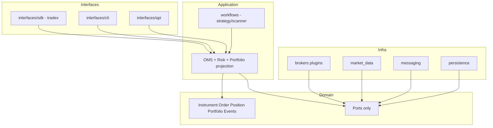

# TradeX — Production Trading OS Design

**Date:** 2026-07-09  
**Branch context:** `refactor/brokers-consolidation` (mid-refactor)  
**Stance:** Target architecture for an institutional, **object-centric Trading OS**. Existing docs ignored as authority; current tree used only as inventory.  
**Quality bar:** Users touch market objects (Unreal / Pandas / SQLAlchemy / PyTorch class of API). Brokers, REST, WS, DuckDB, Redis stay behind ports.

**How to use this document:**  
Execute **Phase 0–1 first** (money path). Then reorganize **one bounded context at a time, root→leaf** (entry → application → domain ← adapters). Never pure filesystem top-down starting at `brokers/`.

---

# Part I — Executive Architecture Assessment

## 1.1 Mission

Turn Trade_XV2 into a **pluggable Trading OS**:

| Property | Meaning |
|----------|---------|
| **Simple** | One composition root, one order path, one Instrument type |
| **Pluggable** | Brokers = plugins; strategies = plugins; data sources = plugins |
| **Object-centric** | `session.equity("X").buy(...)` not `gateway.place_order(...)` |
| **Production-grade** | Risk, idempotency, durable OMS, recon, kill switch always on live |
| **Parity** | Live / paper / replay share the same object model |

## 1.2 Verdict on current state (evidence-based)

| Strength | Weakness |
|----------|----------|
| Real OMS (`application/oms`) with risk, locks, trade ledger design | Dual spines: full `TradingContext` vs lightweight `tradex.connect` OMS |
| Domain ports (`DataProvider`, `ExecutionProvider`, `OrderIntent`) | Live connect: margin off, fixed capital, no durable store |
| Event catalogue + bus with DLQ hooks | Recovery not always wired; reentrancy/global depth bugs |
| Multi-broker adapters (Dhan/Upstox/Paper) | Upstox modify contract broken; paper too optimistic |
| Research engines (scanner/backtest/replay) | Defaults skip OMS; double slippage; no open MTM equity |
| Large test surface | Some architecture/security tests false-green |

**Overall:** Capable research + partial live stack. **Not a production Trading OS** until one money path and one composition root exist.

## 1.3 Design principles (non-negotiable)

1. **Domain first** — no broker/SDK/WS/DB in domain.  
2. **One state owner** per concept (quote, order, position, subscription).  
3. **Tell, don’t ask** — rich objects (`instrument.buy`), not managers in user code.  
4. **Composition over inheritance** — capabilities as extensions, not subclasses.  
5. **Fail closed** on live (margin, capital, status mapping, auth).  
6. **Parity by construction** — same Session API; only ports swap.  
7. **Pluggable adapters** — self-registering brokers; no `if broker ==` in domain.  
8. **Incremental migration** — each phase leaves system green.

---

# Part II — Current vs Target Architecture

## 2.1 Current architecture (as-is)

```mermaid
flowchart TB
  subgraph Present
    CLI[cli + TUI]
    API[api REST/WS]
    SDK[tradex.connect]
  end
  subgraph DualOMS
    Light[Lightweight OMS margin OFF]
    Full[TradingContext full OMS]
    Comp[ExecutionComposer bypass]
  end
  subgraph Kernel
    RT[tradex.runtime]
    SHIM[brokers.common shims]
  end
  subgraph Adapters
    D[dhan] U[upstox] P[paper]
  end
  CLI --> SDK
  CLI --> Full
  CLI --> Comp
  API --> SDK
  API --> Full
  API --> Comp
  SDK --> Light
  Full --> RT
  Light --> RT
  RT --> SHIM
  RT --> D & U & P
```

**Problems:** dual admission paths, dual kernel homes, gateway still leaks into ops, data path weaker than order path.

## 2.2 Target architecture (Trading OS)



**Rule:** All order entry hits **OMS**. All market data hits **DataProvider**. Domain never imports infra.

## 2.3 Dependency graph — before vs after

| Before | After |
|--------|--------|
| `cli` → `brokers.common` + `tradex.runtime` + OMS | `cli` → `tradex` / application only |
| `tradex` → `brokers.dhan` import side effects | `tradex` → port registry; brokers load as plugins |
| `application` → `tradex.runtime` (composer) | `application` → domain ports; runtime injects at root |
| `brokers.common` ↔ `tradex.runtime` dual | **Only** `infrastructure/*` + `brokers/{vendor}` |
| `datalake` ↔ `analytics` cycle risk | analytics → `HistoryStorePort`; datalake implements |
| Domain → pandas top-level (mostly fixed) | Domain VOs; DataFrame export only at boundary |

---

# Part III — Domain Model & Object Hierarchy

## 3.1 Public object hierarchy (target)

```
TradingOS / Session                 # composition root (alive process handle)
├── Universe                        # sole Instrument factory + cache
│     └── Instrument
│           ├── Equity | Index | Future | Option
│           ├── .quote .ltp .depth .history .subscribe
│           ├── .buy/.sell/.market/.limit  → OrderIntent
│           └── .option_chain() → OptionChain
├── OptionChain                     # aggregate of Option + snapshot VO
├── Portfolio                       # positions + MTM
├── Account                         # balances / margin
├── OMS                             # façade over OrderManager (not user Manager*)
├── Risk                            # kill switch, limits (ops façade)
├── Bus                             # DomainEventBus port
└── Capabilities                    # what this session supports
```

### SDK (target UX)

```python
import tradex  # or TradingOS

s = tradex.connect("dhan", profile="live")  # refuse if risk incomplete
nifty = s.index("NIFTY")                    # or s.equity("RELIANCE")
print(nifty.ltp, nifty.quote)
nifty.subscribe()
hist = nifty.history("5m", days=30)         # HistoricalSeries
df = hist.to_dataframe()                    # export only

chain = nifty.option_chain(expiry="2026-07-31")
print(chain.atm.delta, chain.calls)

order = nifty.buy(qty=50, limit=24500)      # OrderIntent → Risk → OMS → broker
print(order.id, order.status)

s.portfolio.positions
s.risk.kill_switch = True
```

**Never public:** `BrokerGateway`, `*HttpClient`, JSON, WS handlers, DuckDB conn.

## 3.2 Domain object responsibility matrix

| Object | Owns | Does not own | Current map |
|--------|------|--------------|-------------|
| **InstrumentId** | Stable identity VO | Broker tokens | `domain.instruments.instrument_id` |
| **Instrument** | Identity, live state, intent creation | HTTP, WS sockets | `domain.instruments.instrument` — **add buy/sell** |
| **OptionChain** | Chain query + Option children | Raw broker chain JSON | `domain.options.option_chain` |
| **OptionChainSnapshot** | Immutable legs VO | Behavior | rename from `entities.options.OptionChain` |
| **QuoteSnapshot / MarketDepth** | Immutable market VOs | Cache policy | `entities.market` |
| **HistoricalSeries** | Bars + provenance | Parquet I/O | `candles.historical` |
| **OrderIntent** | User desire | Exchange id | `orders.intent` |
| **Order** | Lifecycle state (via OMS) | Wire status strings | `entities.order` |
| **Trade** | Fill facts | Position math | `entities.trade` |
| **Position** | Qty, avg, MTM | Order book | `entities.position` |
| **Portfolio** | Aggregate positions | Risk limits | `portfolio` |
| **Account / Balance** | Cash/margin | Orders | `entities.account` |
| **Signal** | Strategy output | Order placement | strategy BC → intent |
| **Scanner Candidate** | Universe hit | OMS | analytics → bus event |
| **RiskProfile** | Limits config | Execution | domain policy + app RiskManager |
| **Capability** | Feature flags per session | Implementation | extensions registry |

## 3.3 State ownership (exactly one owner)

| State | Owner | Forbidden |
|-------|-------|-----------|
| Last quote / depth | `InstrumentState` (on Instrument) | Global quote dicts |
| Subscriptions | Instrument + DataProvider handle | Ad-hoc callback lists outside |
| Order book | **OrderManager only** | BrokerService parallel book |
| Positions | **PositionManager only** | Double-apply from raw TRADE |
| Processed trade ids | ProcessedTradeRepository | Per-adapter only |
| Risk kill / daily PnL | RiskManager | Scattered flags |
| Event log | EventLog attached to **one** bus | Bus without log “for recovery” |
| Capital | CapitalProvider (broker-backed live) | Phantom 1e6 default live |
| Instrument master | InstrumentRepository / registry | Multiple masters |
| Process default provider | **Remove** or ContextVar | `set_default_provider` global |

## 3.4 Patterns (use sparingly)

| Pattern | Where | Why |
|---------|-------|-----|
| Hexagonal ports | domain/ports | Swap live/paper/replay |
| Adapter | brokers/* | Wire → domain VO once |
| Factory / Abstract factory | Session/Universe, gateway_factory | Controlled construction |
| Registry + plugin | broker self-register | Open/closed new brokers |
| Observer / Event | EventBus | Decouple OMS, UI, analytics |
| State | Order/Position SM | Explicit transitions |
| Facade | Session.oms / Session.risk | Hide managers from users |
| Specification | risk/scanner filters | Composable rules |
| Repository | OrderStore, HistoryStore | Persistence behind ports |
| **Reject** | Manager-heavy public API, dual decorators for depth | Prefer capability methods |

---

# Part IV — Package / Module Hierarchy (reorganization)

## 4.1 Target layout

```
src/domain/                 # pure: instruments, orders, portfolio, events, ports, indicators
application/
  oms/                      # order/position/risk brain (only OMS)
  trading/                  # strategy/scanner orchestration
  research/                 # facades over analytics (optional)
  portfolio/                # projection services
infrastructure/
  brokers/
    dhan/ upstox/ paper/    # plugins only
    _kernel/                # optional: absorb residual common (or keep tradex.runtime)
  market_data/              # stream + history coordinators, DataProvider impls
  messaging/                # event_bus, event_log, DLQ
  persistence/              # datalake storage + order store + idempotency stores
interfaces/
  sdk/                      # tradex public (connect, Session re-exports)
  cli/
  api/
shared/                     # config, logging helpers
analytics/                  # research math (ports in, no orders out except via OMS)
tests/                      # cross-BC only; unit tests co-located
```

**Physical migration can keep names `tradex/`, `cli/`, `api/` as interfaces BC for less churn** — then `interfaces/*` re-exports them until cutover.

## 4.2 Current → target ownership (summary)

| Current | Target BC | Action |
|---------|-----------|--------|
| `src/domain/*` | domain | Keep; finish purity; kill dual names |
| `application/oms` | application | **Canonical OMS** |
| `application/execution` | application | Thin: always through OMS |
| `application/composer` | interfaces/sdk composition | Wire at connect only |
| `tradex` + `tradex.runtime` | interfaces/sdk + infrastructure kernel | Split public vs kernel |
| `brokers.common` shims | delete | Canonical `tradex.runtime` / infra |
| `brokers/{dhan,upstox,paper}` | infrastructure/brokers | Adapters only |
| `datalake` storage | infrastructure/persistence | Peel analytics/scanner out |
| `analytics` | research BC | No direct place_order |
| `infrastructure` | split messaging/persistence/market_data | |
| `api` / `cli` | interfaces | Thin adapters |
| `providers/` | fold into brokers | Delete package |
| `plugins/` stubs | real plugins or delete | Indicators already domain |

## 4.3 Kill list (duplicates)

| Concept | Canonical | Delete/rename |
|---------|-----------|---------------|
| Instrument (user) | `domain.instruments.Instrument` | DTO renames already in progress |
| OptionChain rich | `domain.options.OptionChain` | VO → `OptionChainSnapshot` |
| Session public | one `Session` type | Stop factory dual alias confusion |
| Order command | `OrderIntent` public; `OmsOrderCommand` internal | Kill `OrderRequest = OmsOrderCommand` alias |
| OMS | `application.oms` | Residual `brokers.common.oms` → margin only renamed |
| Kernel | `tradex.runtime` | Expire `brokers.common` shims |
| Scanner engine | `analytics.scanner` | `datalake.scanner` storage only |
| Idempotency | `infrastructure.idempotency` | shims only |
| Data provider | domain protocol + broker adapters | raw gateway fallback banned live |

---

# Part V — Flows (target)

## 5.1 Composition / boot

```text
Config + Secrets
  → TradingOS.connect(broker, profile)
  → Plugin load (import brokers.dhan …)
  → GatewayTransport (private)
  → DataProvider + ExecutionProvider (registered)
  → EventBus + EventLog + DLQ + Metrics
  → OrderManager + PositionManager + RiskManager (profile-based)
  → Universe warm (optional)
  → return Session
```

**Live profile must include:** real capital, margin on, durable order store, processed-trade ledger, recon optional-but-gated.

## 5.2 Market data lifecycle

```text
Exchange → Broker WS/REST
  → Adapter normalize (once)
  → QuoteSnapshot / Depth / Bar
  → DataProvider
  → InstrumentState (atomic)
  → Event: TICK / DEPTH / QUOTE
  → Portfolio MTM, strategies, API WS
```

## 5.3 Order lifecycle (only path)

```text
Instrument.buy / Session.buy / CLI / API / Orchestrator
  → OrderIntent (correlation_id)
  → G0 placement gate (recon, shutdown)
  → G1 RiskManager.check_order
  → OrderManager.admit
  → ExecutionProvider.place_order
  → Exchange
  → TRADE / ORDER_UPDATED (normalized)
  → OrderManager (idempotent)
  → TRADE_APPLIED
  → PositionManager
  → Portfolio / analytics / audit
```

## 5.4 Strategy lifecycle

```text
Scanner → CANDIDATE_GENERATED
  → FeatureFetcher
  → Strategy.evaluate → Signal
  → size via compute_order_quantity(capital, price, max_pct)
  → OrderIntent
  → same OMS path
```

## 5.5 Research / replay lifecycle

```text
HistoryStore / DataFrame bars
  → TimeService fixed
  → Replay DataProvider + Sim ExecutionProvider
  → same Instrument + OMS (optional pure-sim only under explicit flag)
  → metrics / walk-forward
```

---

# Part VI — Event Architecture

## 6.1 Catalogue (canonical)

| Event | Owner | Consumers |
|-------|-------|-----------|
| TICK / QUOTE / DEPTH | Market adapter | Instrument, PM MTM, strategies |
| ORDER_INTENT_RECEIVED | Session façade | Audit |
| RISK_APPROVED / REJECTED | OrderManager | Metrics, UI |
| ORDER_PLACED / SUBMITTED / UPDATED / CANCELLED / REJECTED | OrderManager | UI, recon, audit |
| TRADE | Broker normalizer only | OrderManager only |
| TRADE_APPLIED | OrderManager | PositionManager **only** |
| POSITION_* | PositionManager | Risk G2, portfolio, UI |
| KILL_SWITCH_FLIPPED | RiskManager | Gates, square-off |
| RECONCILIATION_* | ReconciliationService | Placement gate |
| MARKET_OPENED/CLOSED | Session calendar | Strategies |
| SIGNAL_* / SCAN_* | Research | Orchestrator |

**Rules:** immutable events; money events validate payload; no dual names; bus mark-after-success for critical IDs; attach EventLog on composition root.

## 6.2 Anti-patterns to remove

- Broker publishes authoritative `ORDER_PLACED` into parallel book  
- PositionManager on raw TRADE  
- Process-global reentrancy depth dropping concurrent events  
- AsyncEventBus dropping TRADE under load  

---

# Part VII — Broker Plugin Architecture

## 7.1 Model

```text
Session
  → ports only
  → BrokerPlugin (dhan|upstox|paper)
       · DataProvider
       · ExecutionProvider
       · optional Capability extensions (depth20, gtt, forever)
```

User-facing broker power:

```python
reliance.capabilities.supports("depth_20")
reliance.extensions.depth20()   # or session.capabilities
# NOT: gateway.depth_20()
```

## 7.2 Registration

On package import (existing ADR-007 direction):

```python
register_data_adapter("dhan", DhanDataProvider)
register_execution_provider("dhan", DhanOrderTransport)
register_extensions("dhan", [Depth20, Depth200])
```

**Ban:** raw gateway as DataProvider for live.

## 7.3 Adapter contracts

| Contract | Assert |
|----------|--------|
| place/modify/cancel | Domain Order / OrderResult; status mapped fail-closed |
| quote/history/subscribe | QuoteSnapshot / HistoricalSeries / handle |
| reconnect | unbounded or policy with health event; resubscribe |
| idempotency | correlation_id required live; lock check-then-act |
| modify | never type-mismatch (Upstox fix P0) |

---

# Part VIII — Public SDK Design

## 8.1 Package surface

```python
# tradex / interfaces.sdk
connect, Session, Universe
Equity, Index, Future, Option, Instrument, OptionChain
OrderIntent, Order, Position, Portfolio  # re-exports
```

## 8.2 Naming rules

- One production class named `Instrument`, `Order`, `Position`, `Session`  
- API schemas: `*DTO`  
- Broker DTOs: `DhanInstrument`, `InstrumentRecord`  
- No `Manager` in user-facing names (`session.oms.place` ok; `OrderManager` internal)

## 8.3 Discoverability

Autocomplete chain:

`connect → Session → equity → Instrument → buy | history | option_chain → Option → greeks`

---

# Part IX — Class Responsibilities (application)

| Class | Responsibility | Not |
|-------|----------------|-----|
| OrderManager | Order aggregate root runtime | Broker HTTP |
| RiskManager | G0–G3 gates | Persistence |
| PositionManager | Position aggregate | Order status |
| OmsOrderService | Intent → OMS | Transport |
| TradingOrchestrator | Signal → Intent | Direct broker |
| StreamOrchestrator | Fan-out subscriptions | Business risk |
| HistoricalCoordinator | Multi-source history | Orders |
| BrokerService (CLI) | **Deprecate** → thin connect wrapper | God object |

---

# Part X — Testing Strategy

## 10.1 Pyramid

| Layer | Scope | Mock |
|-------|-------|------|
| Unit domain | Instruments, intents, pure risk policies | No I/O |
| Unit OMS | State machine, risk, idempotency | Fake bus/store |
| Contract | Each ExecutionProvider / DataProvider | Fake HTTP/WS |
| Integration | One broker paper path | Local only |
| E2E paper | Intent → fill → position | Process bus |
| Replay parity | Same strategy live ports vs replay | |
| Chaos | Duplicate TRADE, crash mid-fill, kill | |
| Architecture | import-linter + isolation + no dual OMS | |
| Performance | place_order p99, tick fan-out | **[RUNTIME]** |
| Live gated | markers + env flags | Never default CI |

## 10.2 Money-path fitness tests (permanent)

1. Live profile refuses margin off + phantom capital.  
2. No second OrderManager per request.  
3. No `tradex.connect` inside place router (use DI Session).  
4. PM never subscribed to TRADE.  
5. Unmapped status ≠ OPEN.  
6. Single import path for kernel modules.

## 10.3 Reduce false green

- Security tests must fail not skip on pickle.  
- Fitness exceptions must shrink each phase.  
- Domain isolation scans `src/domain` (already fixed).

---

# Part XI — Performance Recommendations

| Area | Guidance |
|------|----------|
| Tick path | Normalize once; atomic state replace; no deep copy per subscriber |
| OMS | Keep lock off network I/O (already good) |
| Event bus | Prefer queue isolation for slow UI handlers |
| History | Batch APIs; HistoricalSeries not DataFrame hot path |
| Option chain | Flyweight legs; snapshot + view objects |
| Memory | Bound last_tick maps (Upstox); TTL caches for fills |
| Concurrency | Thread-local reentrancy; avoid process-global depth |
| Measure | CI benchmark place_order + publish 10k ticks |

---

# Part XII — Migration Roadmap

## Method: hybrid (safety + BC root→leaf)

```text
Phase 0: Money-path P0 (days)
Phase 1: Unify composition + OMS (1–2 weeks)
Phase 2: Object SDK complete (Instrument.buy, DataProviders)
Phase 3: Kernel dual-home elimination (BC by BC)
Phase 4: Research parity + scanners
Phase 5: Presentation thin + god-class split
Phase 6: Delete shims, harden, SLO
```

Each phase: **objectives · modules · compat · tests · rollback · success**.

### Phase 0 — Stop live-money hazards (1–3 days)

| Item | Modules | Success |
|------|---------|---------|
| Live vs paper OMS profiles | `session_bridge`, `tradex/session` | Live requires margin+capital+durable |
| Fail-closed status | `session_bridge` | No OPEN invent |
| API auth default | `api/config`, auth | Boot fails without key in prod |
| Upstox modify contract | upstox orders/gateway | Contract tests green |
| EventBus subscribe_all | event_bus | No deadlock |
| Replay position apply | oms/context | Only accepted trades |
| REST place uses process OMS | api/orders | No connect-per-request |

**Rollback:** feature flags per item. **Compat:** paper path unchanged.

### Phase 1 — One composition root (1–2 weeks)

| Item | Success |
|------|---------|
| `build_oms_runtime(profile)` shared by connect/API/CLI | One OrderManager process-wide |
| Cancel/modify via OMS | Composer not bypass |
| Wire EventLog to bus | Recovery e2e green |
| Sizing fix orchestrator | uses compute_order_quantity |

### Phase 2 — Object model complete

| Item | Success |
|------|---------|
| `Instrument.buy/sell` → OrderIntent | SDK cookbook 10 recipes |
| Register Dhan/Upstox DataProviders | Instrument.history/subscribe work live |
| OptionChainSnapshot rename | One public OptionChain |
| Remove process global provider or ContextVar | Multi-session safe |

### Phase 3 — Reorg kernel (root→leaf by package)

Order of packages:

1. Finish expire `brokers.common` (adapters import runtime/infra only)  
2. Split `infrastructure/{messaging,persistence,market_data}`  
3. Fold `providers/`, empty `plugins`  
4. Datalake peel analytics/scanner  

Per package: inventory → canonical home → shims → delete.

### Phase 4 — Research parity

- Default backtest through OMS or label non-parity  
- Slippage once; open MTM equity  
- Single scanner event path  

### Phase 5 — DX / presentation

- Split BrokerService  
- Thin CLI/API  
- capability_manifest split  
- Delete dead `dhan/websocket.py` monolith  

### Phase 6 — Production seal

- Partial-fill sim, HA order store, latency SLOs, vault secrets  
- Definition of Done checklist below  

---

# Part XIII — Risk Analysis

| Risk | Likelihood | Impact | Mitigation phase |
|------|------------|--------|------------------|
| Dual OMS book divergence | High | Critical | 0–1 |
| Upstox modify wrong | High | Critical | 0 |
| Double orders HTTP retry | Medium | Critical | 0–1 |
| Auth open API | High | Critical | 0 |
| Research false confidence | High | High | 4 |
| Migration mid-shim forever | High | High | 3 |
| Event drop under load | Medium | High | 1 |
| God-class regressions | Medium | Medium | 5 |

---

# Part XIV — Technical Debt Eliminated (target)

| Debt | Elimination |
|------|-------------|
| Dual composition roots | One runtime builder |
| Dual kernel homes | Single import path |
| Triple order commands | OrderIntent public only |
| Phantom capital live | Required CapitalProvider |
| Gateway as public API | Private transport |
| False-green isolation | Fixed + expanded fitness |
| Paper-grade live OMS | Profile matrix |
| Scanner dual engines | One engine + store |
| Manager-centric SDK | Object-centric |

---

# Part XV — Remaining Future Improvements

- Multi-process HA OMS  
- Kafka-class bus (only if single-process proven insufficient)  
- Full multi-venue smart order routing  
- Corporate actions domain  
- UI beyond TUI  
- Formal capability discovery UI  

---

# Part XVI — Definition of Done (measurable)

| Criterion | Metric |
|-----------|--------|
| One money path | Grep: no place_order to gateway from cli/api without OMS |
| One Instrument | Single `class Instrument` in prod domain |
| Live fail-closed | Connect live without capital/margin → error |
| Domain purity | Isolation + no top-level pandas tests green |
| Kernel | Zero new code under `brokers.common` except shims; import counter → 0 |
| Parity | Strategy suite passes paper + replay with same intents |
| Recovery | Kill process mid-fill → recon restores positions |
| Security | Default auth on; metrics not public without opt-in |
| DX | 5-line script: connect → equity → buy → print order (paper) |
| Architecture CI | import-linter truthful; no skip-on-find security tests |

---

# Part XVII — Deliverables Index (20)

| # | Deliverable | Section |
|---|-------------|---------|
| 1 | Executive assessment | I |
| 2 | Current vs proposed | II |
| 3 | Dependency graph before/after | II.3 |
| 4 | Domain model hierarchy | III |
| 5 | Package hierarchy | IV |
| 6 | Class responsibilities | IX |
| 7 | Object interaction | V, III |
| 8 | Event flows | VI |
| 9 | Data lifecycle | V.2–5 |
| 10 | Broker plugin architecture | VII |
| 11 | Historical/live data lifecycle | V.2, V.5 |
| 12 | Public SDK | VIII |
| 13 | Design patterns | III.4 |
| 14 | Testing strategy | X |
| 15 | Performance | XI |
| 16 | Migration roadmap | XII |
| 17 | Risk analysis | XIII |
| 18 | Debt eliminated | XIV |
| 19 | Future improvements | XV |
| 20 | Definition of done | XVI |

---

# Part XVIII — Recommended execution order (next concrete steps)

Given the hybrid approach agreed earlier:

```text
Week 1:  Phase 0 items (table XII) — multi-agent by file ownership
Week 2:  Phase 1 composition unify + REST/CLI cancel-modify via OMS
Week 3:  Phase 2 Instrument.buy + DataProviders
Week 4+: Phase 3 package reorg root→leaf (kernel, then datalake, then cli split)
```

**Do not** start with full `brokers/` rewrite.  
**Do** start with **Orders BC** (Phase 0–1): the production Trading OS is defined by a single trusted order path.

---

*End of Production Trading OS Design. Implementation should proceed phase-by-phase with gates; this document is the north star for redesign and reorg.*
