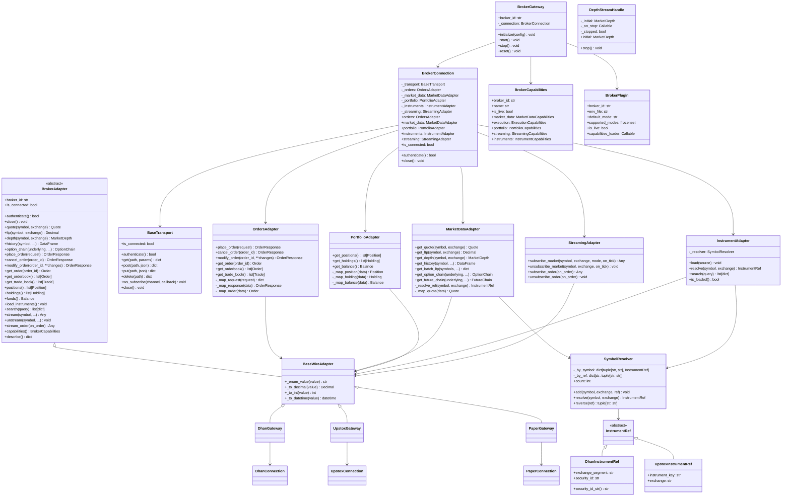
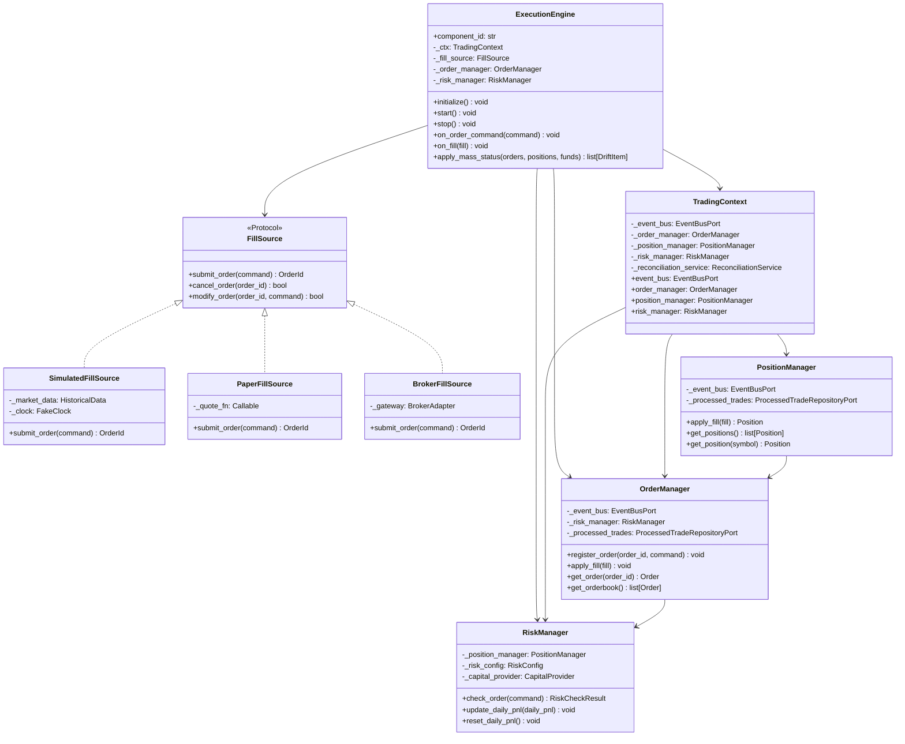
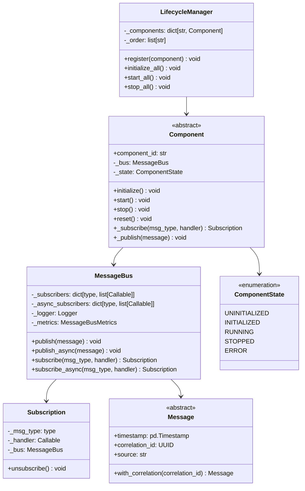
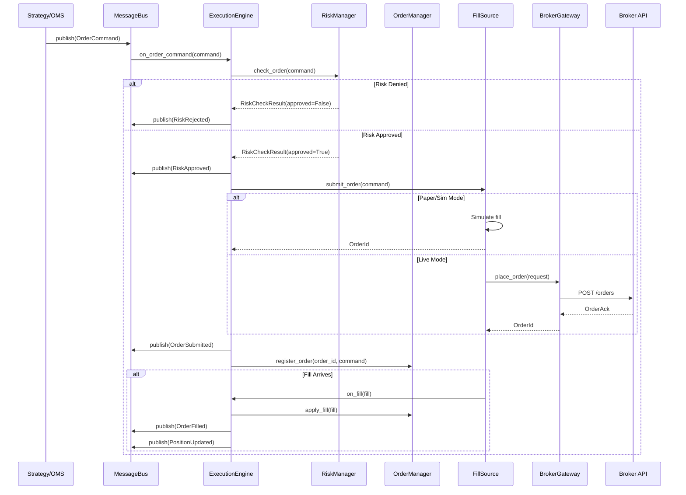
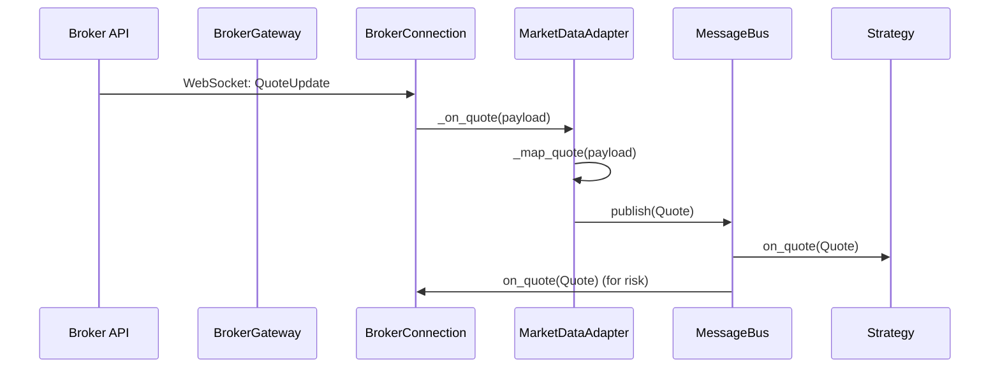
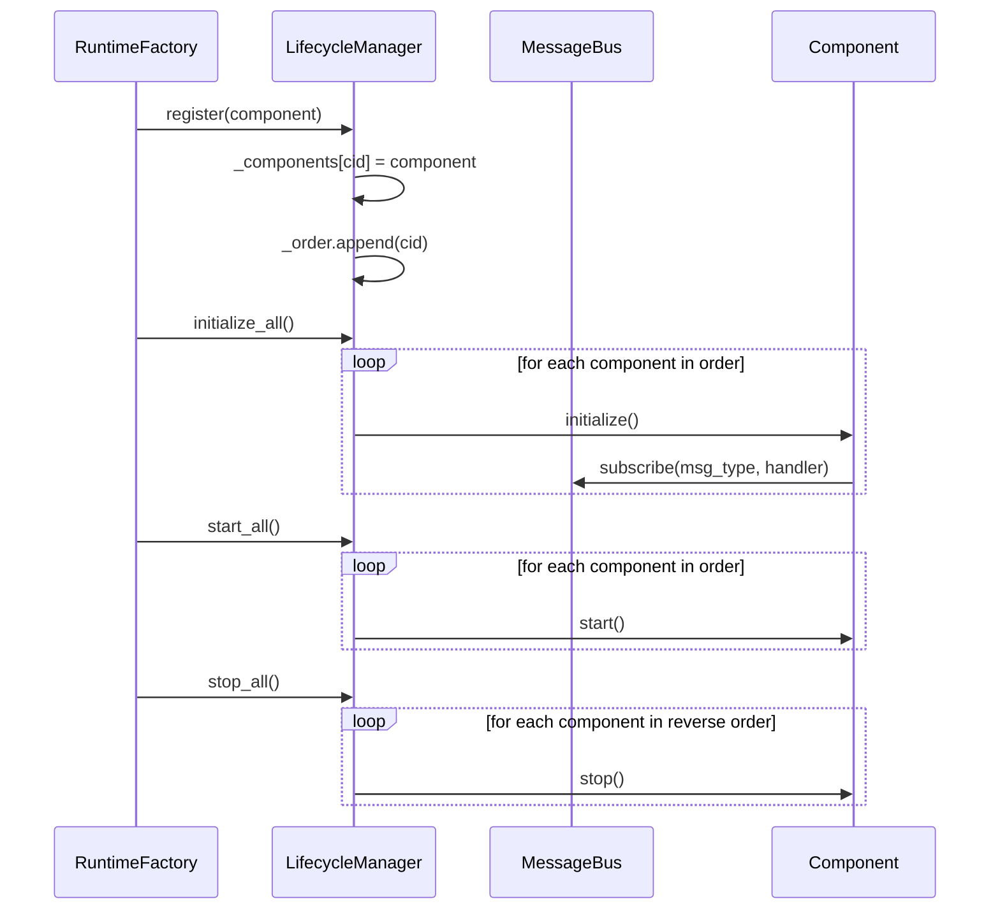
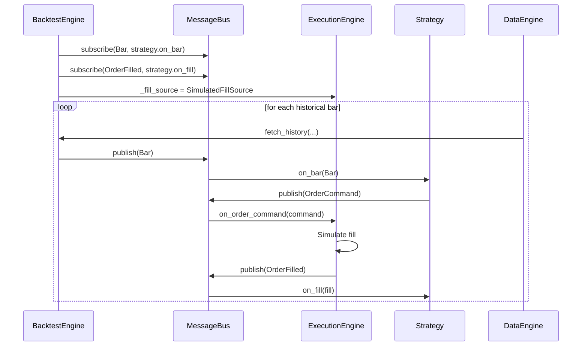
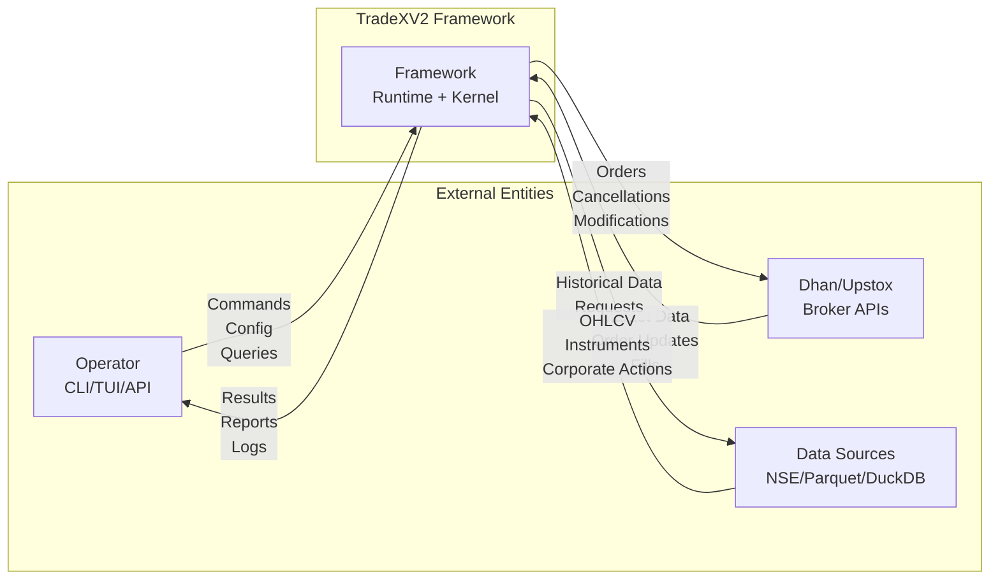
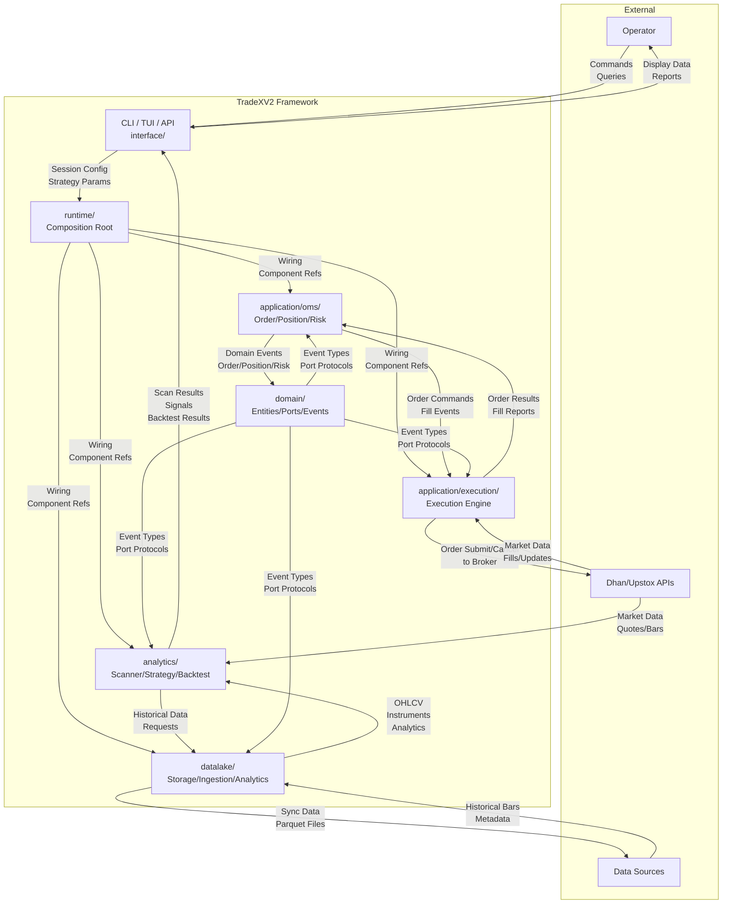

# TradeXV2 V2 Architecture Redesign

> Complete rewrite of the brokers module and infrastructure, following Nautilus Trader patterns.
> This document consolidates all discussions, diagrams, HLD/LLD, DFDs, and implementation plan.

---

## 1. Architecture Overview (HLD)

### 1.1 System Architecture

```
┌─────────────────────────────────────────────────────────────────────────┐
│                          TRADEX FRAMEWORK                               │
│                        (Nautilus Trader-Level)                          │
│                                                                         │
│  ┌─────────────────┐  ┌─────────────────┐  ┌─────────────────┐         │
│  │   CLI / TUI     │  │   FastAPI       │  │   MCP Server    │         │
│  │   (interface/)  │  │   (interface/)  │  │   (datalake/)   │         │
│  └────────┬────────┘  └────────┬────────┘  └────────┬────────┘         │
│           │                    │                    │                  │
│           ▼                    ▼                    ▼                  │
│  ┌─────────────────────────────────────────────────────────────────┐   │
│  │                    COMPOSITION ROOT                             │   │
│  │                    (runtime/)                                   │   │
│  │                                                                 │   │
│  │  ┌─────────────┐  ┌─────────────┐  ┌─────────────┐  ┌─────────┐ │   │
│  │  │  Component  │  │  Lifecycle  │  │  MessageBus │  │  Config │ │   │
│  │  │  Registry    │  │  Manager    │  │  (EventBus) │  │ Manager │ │   │
│  │  └─────────────┘  └─────────────┘  └─────────────┘  └─────────┘ │   │
│  └─────────────────────────────┬───────────────────────────────────┘   │
│                                │                                       │
│                                ▼                                       │
│  ┌─────────────────────────────────────────────────────────────────┐   │
│  │                     EXECUTION ENGINE                            │   │
│  │                     (application/)                              │   │
│  │                                                                 │   │
│  │  ┌─────────────┐  ┌─────────────┐  ┌─────────────┐             │   │
│  │  │  Order      │  │  Position   │  │  Risk       │             │   │
│  │  │  Manager    │  │  Manager    │  │  Manager    │             │   │
│  │  └─────────────┘  └─────────────┘  └─────────────┘             │   │
│  │                                                                 │   │
│  │  ┌─────────────┐  ┌─────────────┐  ┌─────────────┐             │   │
│  │  │  Execution  │  │  Strategy   │  │  Data       │             │   │
│  │  │  Engine     │  │  Engine     │  │  Engine     │             │   │
│  │  └─────────────┘  └─────────────┘  └─────────────┘             │   │
│  └─────────────────────────────┬───────────────────────────────────┘   │
│                                │                                       │
│                                ▼                                       │
│  ┌─────────────────────────────────────────────────────────────────┐   │
│  │                      ADAPTER LAYER                              │   │
│  │                      (brokers/)                                 │   │
│  │                                                                 │   │
│  │  ┌─────────────┐  ┌─────────────┐  ┌─────────────┐  ┌─────────┐ │   │
│  │  │  Dhan       │  │  Upstox     │  │  Paper      │  │  Data   │ │   │
│  │  │  Gateway    │  │  Gateway    │  │  Gateway    │  │  Lake   │ │   │
│  │  └─────────────┘  └─────────────┘  └─────────────┘  └─────────┘ │   │
│  └─────────────────────────────────────────────────────────────────┘   │
│                                                                         │
│  ┌─────────────────────────────────────────────────────────────────┐   │
│  │                        DOMAIN MODEL                             │   │
│  │                        (domain/)                                │   │
│  │                                                                 │   │
│  │  ┌─────────────┐  ┌─────────────┐  ┌─────────────┐  ┌─────────┐ │   │
│  │  │  Entities   │  │  Value      │  │  Events     │  │  Ports  │ │   │
│  │  │  (Order,     │  │  Objects    │  │  (Message)  │  │  (Proto)│ │   │
│  │  │  Position,   │  │  (Money,    │  │             │  │         │ │   │
│  │  │  Quote, ...) │  │  Quantity,  │  │             │  │         │ │   │
│  │  │               │  │  Price, ...)│  │             │  │         │ │   │
│  │  └─────────────┘  └─────────────┘  └─────────────┘  └─────────┘ │   │
│  └─────────────────────────────────────────────────────────────────┘   │
└─────────────────────────────────────────────────────────────────────────┘
```

### 1.2 Core Design Principles

1. **Message-Driven Architecture** — All inter-component communication via `MessageBus` with typed messages
2. **Component Lifecycle** — Every component implements `initialize() → start() → stop() → reset()`
3. **Zero-Parity Engine** — Same execution engine for backtest and live, only FillSource differs
4. **Plugin Architecture** — Adapters discovered via entry points, no central switch statements
5. **Observability First** — Every message is traced, every operation is metered
6. **Declarative Configuration** — YAML config drives all component assembly
7. **Gateway → Connection → Sub-Adapters** — Standardized broker adapter pattern
8. **Instrument Ref Isolation** — Wire identifiers never leak to gateway callers

### 1.3 Component Layers

| Layer | Components | Responsibility |
|---|---|---|
| **Interface** | CLI, TUI, API, MCP | User interaction surfaces |
| **Composition** | ComponentRegistry, LifecycleManager, MessageBus, ConfigManager | Framework assembly and lifecycle |
| **Execution** | OrderManager, PositionManager, RiskManager, PortfolioManager, ExecutionEngine, StrategyEngine | Trading logic |
| **Data** | MarketDataEngine, HistoricalDataEngine, InstrumentEngine | Data management |
| **Adapters** | DhanGateway, UpstoxGateway, PaperGateway, DataLakeGateway | External system integration |
| **Domain** | Entities, ValueObjects, Events, Ports | Business model |

---

## 2. Class Diagram (LLD)

### 2.1 Broker Adapter Framework



### 2.2 Execution Engine



### 2.3 Message Bus



---

## 3. Flow Diagrams

### 3.1 Order Placement Flow (End-to-End)



### 3.2 Market Data Flow



### 3.3 Component Lifecycle Flow



### 3.4 Backtest Engine Flow



---

## 4. File/Folder Organization

### 4.1 Brokers Module (Redesigned)

```
brokers/
├── __init__.py                    # BrokerAdapter protocol re-export
├── gateway.py                     # BrokerGateway facade
├── session.py                     # BrokerSession (merge session/)
│
├── common/                        # SHARED INFRA — 5 files
│   ├── __init__.py
│   ├── transport.py               # BaseTransport, TransportError hierarchy
│   ├── wire_base.py               # BaseWireAdapter base class
│   ├── streaming.py               # DepthStreamHandle
│   └── util.py                    # enum_value, to_decimal, etc.
│
├── providers/
│   ├── __init__.py
│   │
│   ├── dhan/                      # 8 files (was 102)
│   │   ├── __init__.py            # Exports + self-registration
│   │   ├── gateway.py             # DhanGateway (BrokerAdapter impl)
│   │   ├── connection.py          # DhanConnection (owns sub-adapters)
│   │   ├── transport.py           # DhanTransport (HTTP + WS)
│   │   ├── adapters/
│   │   │   ├── __init__.py
│   │   │   ├── orders.py          # DhanOrdersAdapter
│   │   │   ├── market_data.py     # DhanMarketDataAdapter
│   │   │   ├── portfolio.py       # DhanPortfolioAdapter
│   │   │   └── instruments.py     # DhanInstrumentAdapter
│   │   └── config.py              # DhanConfig, dhan_capabilities()
│   │
│   ├── upstox/                    # 8 files (was 128)
│   │   ├── __init__.py            # Exports + self-registration
│   │   ├── gateway.py             # UpstoxGateway (BrokerAdapter impl)
│   │   ├── connection.py          # UpstoxConnection (owns sub-adapters)
│   │   ├── transport.py           # UpstoxTransport (HTTP + WS)
│   │   ├── adapters/
│   │   │   ├── __init__.py
│   │   │   ├── orders.py          # UpstoxOrdersAdapter
│   │   │   ├── market_data.py     # UpstoxMarketDataAdapter
│   │   │   ├── portfolio.py       # UpstoxPortfolioAdapter
│   │   │   └── instruments.py     # UpstoxInstrumentAdapter
│   │   └── config.py              # UpstoxConfig, upstox_capabilities()
│   │
│   └── paper/                     # 6 files (was 12)
│       ├── __init__.py            # Exports + self-registration
│       ├── gateway.py             # PaperGateway (BrokerAdapter impl)
│       ├── market_data.py         # PaperMarketData
│       ├── orders.py              # PaperOrders
│       ├── portfolio.py           # PaperPortfolio
│       └── config.py              # PaperConfig, paper_capabilities()
│
└── runtime/                       # 2 files (was 8)
    ├── __init__.py                # RuntimeBundle
    └── managers.py                # All managers merged
```

### 4.2 Full Project Structure (Redesigned)

```
tradex/
├── src/
│   ├── tradex/                    # Public SDK (thin facade)
│   │   ├── __init__.py
│   │   ├── cli.py
│   │   └── session.py
│   │
│   ├── domain/                    # Pure business logic (stdlib only)
│   │   ├── __init__.py
│   │   ├── entities.py            # Order, Position, Quote, Instrument, Balance
│   │   ├── events.py              # DomainEvent, EventType (Message base)
│   │   ├── ports.py               # Protocols: BrokerAdapter, EventBus, Clock, etc.
│   │   ├── enums.py               # ExchangeId, OrderSide, OrderType, etc.
│   │   ├── value_objects.py       # Money, Quantity, InstrumentId, CorrelationId
│   │   ├── risk.py                # RiskConfig, RiskCheck, RiskResult
│   │   └── indicators.py          # Pure indicator functions
│   │
│   ├── application/               # Use-cases (no infra/runtime/broker imports)
│   │   ├── __init__.py
│   │   ├── oms/                   # OrderManager, PositionManager, RiskManager
│   │   ├── execution/             # ExecutionEngine, FillSource
│   │   ├── trading/               # TradingOrchestrator, StrategyEngine
│   │   ├── data/                  # DataEngine, HistoricalDataCoordinator
│   │   └── scheduling/            # QuotaScheduler
│   │
│   ├── infrastructure/            # Adapters (implements domain ports)
│   │   ├── __init__.py
│   │   ├── message_bus.py         # MessageBus (NEW)
│   │   ├── component.py           # Component, LifecycleManager (NEW)
│   │   ├── event_bus.py           # EventBus (existing)
│   │   ├── observability.py       # ObservabilityStack, HealthChecker (NEW)
│   │   ├── config.py              # ConfigLoader, AppConfig (NEW)
│   │   ├── io/                    # ParquetWriter, atomic writes
│   │   ├── auth/                  # Token management, TOTP
│   │   ├── resilience/            # CircuitBreaker, RateLimiter
│   │   ├── lifecycle.py           # LifecycleManager (merged)
│   │   ├── clock.py               # SystemClock, FakeClock
│   │   └── gateway/               # GatewayFactory
│   │
│   ├── runtime/                   # Composition root
│   │   ├── __init__.py
│   │   ├── factory.py             # RuntimeFactory (consolidated)
│   │   └── runtime.py             # Runtime dataclass
│   │
│   ├── brokers/                   # Broker adapters (redesigned)
│   │   ├── __init__.py
│   │   ├── gateway.py
│   │   ├── session.py
│   │   ├── common/                # 5 files
│   │   └── providers/             # Dhan, Upstox, Paper (8+8+6 files)
│   │
│   ├── datalake/                  # Data storage + analytics
│   │   ├── __init__.py
│   │   ├── gateway.py             # DataLakeGateway
│   │   ├── storage/               # Catalog, parquet_store
│   │   ├── core/                  # IO, schema, symbols
│   │   ├── ingestion/             # Sync, broker_selection
│   │   └── analytics/             # Features, S/R, VWAP
│   │
│   ├── interface/                 # Presentation layers
│   │   ├── __init__.py
│   │   ├── api/                   # FastAPI
│   │   ├── cli/                   # CLI commands
│   │   └── mcp/                   # MCP server
│   │
│   ├── config/                    # Configuration
│   │   └── schema.py              # AppConfig, ConfigLoader
│   │
│   └── analytics/                 # Analytics (existing)
│       ├── __init__.py
│       ├── pipeline/              # FeaturePipeline
│       ├── scanner/               # Scanners
│       ├── backtest/              # BacktestEngine
│       ├── replay/                # ReplayEngine
│       ├── strategy/              # StrategyPipeline
│       └── indicators/            # Indicators
│
├── tests/
│   ├── unit/                     # Domain + pure logic tests
│   ├── component/                # Single-service tests
│   ├── integration/              # Broker API tests (gated)
│   ├── e2e/                      # Full flow tests
│   ├── architecture/             # Import-linter + dependency tests
│   ├── property/                 # Hypothesis property-based tests
│   ├── mutation/                 # Mutmut config + tests
│   └── conftest.py
│
├── docs/
│   ├── constitution/             # Product + architecture canon
│   ├── adr/                      # Architecture decision records
│   ├── flows.md                  # Flow contracts
│   └── diagrams/                 # Architecture diagrams
│
├── config/
│   ├── paper.yaml                # Paper trading config
│   ├── backtest.yaml             # Backtest config
│   └── live.yaml                 # Live trading config
│
├── pyproject.toml
├── Dockerfile
├── .github/workflows/
└── Makefile
```

---

## 5. Data Flow Diagrams (DFDs)

### 5.1 DFD Level 0 — Context



### 5.2 DFD Level 1 — Major Components



### 5.3 DFD Level 2A — Brokers Module

```mermaid
graph TD
    subgraph "External Entities"
        DHAN_API[Dhan HQ API<br/>REST + WebSocket]
        UPSTOX_API[Upstox API<br/>REST + WebSocket]
        PAPER[Paper Trading<br/>In-Memory]
    end

    subgraph "Brokers Subsystem (src/brokers/)"
        subgraph "Common Infrastructure"
            BROKER_COMMON[brokers/common/<br/>BaseWireAdapter,<br/>BaseTransport,<br/>DepthStreamHandle]
        end

        subgraph "Dhan Provider"
            DHAN_GW[brokers/providers/dhan/<br/>DhanGateway]
            DHAN_CONN[brokers/providers/dhan/<br/>DhanConnection]
            DHAN_ORD[brokers/providers/dhan/adapters/<br/>orders.py]
            DHAN_MD[brokers/providers/dhan/adapters/<br/>market_data.py]
            DHAN_PORT[brokers/providers/dhan/adapters/<br/>portfolio.py]
            DHAN_INST[brokers/providers/dhan/adapters/<br/>instruments.py]
            DHAN_STREAM[brokers/providers/dhan/adapters/<br/>streaming.py]
            DHAN_TRANSPORT[brokers/providers/dhan/<br/>transport.py]
        end

        subgraph "Upstox Provider"
            UPSTOX_GW[brokers/providers/upstox/<br/>UpstoxGateway]
            UPSTOX_CONN[brokers/providers/upstox/<br/>UpstoxConnection]
            UPSTOX_ORD[brokers/providers/upstox/adapters/<br/>orders.py]
            UPSTOX_MD[brokers/providers/upstox/adapters/<br/>market_data.py]
            UPSTOX_PORT[brokers/providers/upstox/adapters/<br/>portfolio.py]
            UPSTOX_INST[brokers/providers/upstox/adapters/<br/>instruments.py]
            UPSTOX_STREAM[brokers/providers/upstox/adapters/<br/>streaming.py]
            UPSTOX_TRANSPORT[brokers/providers/upstox/<br/>transport.py]
        end

        subgraph "Paper Provider"
            PAPER_GW[brokers/providers/paper/<br/>PaperGateway]
            PAPER_MD[brokers/providers/paper/<br/>market_data.py]
            PAPER_ORD[brokers/providers/paper/<br/>orders.py]
            PAPER_PORT[brokers/providers/paper/<br/>portfolio.py]
        end
    end

    %% Dhan flows
    DHAN_API -- "REST: Orders,<br/>Positions,<br/>Funds" --> DHAN_TRANSPORT
    DHAN_API -- "WS: Quotes,<br/>Depth,<br/>Order Updates" --> DHAN_TRANSPORT
    DHAN_TRANSPORT -- "HTTP/WS Messages" --> DHAN_CONN
    DHAN_CONN -- "Order Operations" --> DHAN_ORD
    DHAN_CONN -- "Market Data" --> DHAN_MD
    DHAN_CONN -- "Portfolio" --> DHAN_PORT
    DHAN_CONN -- "Instruments" --> DHAN_INST
    DHAN_CONN -- "Streaming" --> DHAN_STREAM
    DHAN_ORD -- "Dhan-native →<br/>Domain types" --> DHAN_GW
    DHAN_MD -- "Dhan-native →<br/>Domain types" --> DHAN_GW
    DHAN_PORT -- "Dhan-native →<br/>Domain types" --> DHAN_GW
    DHAN_INST -- "Dhan-native →<br/>Domain types" --> DHAN_GW
    DHAN_STREAM -- "Dhan-native →<br/>Domain types" --> DHAN_GW
    DHAN_GW -- "Domain Events,<br/>Order Commands" --> RT[runtime/]

    %% Upstox flows
    UPSTOX_API -- "REST: Orders,<br/>Positions,<br/>Funds" --> UPSTOX_TRANSPORT
    UPSTOX_API -- "WS: Quotes,<br/>Depth,<br/>Order Updates" --> UPSTOX_TRANSPORT
    UPSTOX_TRANSPORT -- "HTTP/WS Messages" --> UPSTOX_CONN
    UPSTOX_CONN -- "Order Operations" --> UPSTOX_ORD
    UPSTOX_CONN -- "Market Data" --> UPSTOX_MD
    UPSTOX_CONN -- "Portfolio" --> UPSTOX_PORT
    UPSTOX_CONN -- "Instruments" --> UPSTOX_INST
    UPSTOX_CONN -- "Streaming" --> UPSTOX_STREAM
    UPSTOX_ORD -- "Upstox-native →<br/>Domain types" --> UPSTOX_GW
    UPSTOX_MD -- "Upstox-native →<br/>Domain types" --> UPSTOX_GW
    UPSTOX_PORT -- "Upstox-native →<br/>Domain types" --> UPSTOX_GW
    UPSTOX_INST -- "Upstox-native →<br/>Domain types" --> UPSTOX_GW
    UPSTOX_STREAM -- "Upstox-native →<br/>Domain types" --> UPSTOX_GW
    UPSTOX_GW -- "Domain Events,<br/>Order Commands" --> RT

    %% Paper flows
    PAPER -- "In-Memory Orders" --> PAPER_ORD
    PAPER_ORD -- "Order State" --> PAPER_GW
    PAPER_MD -- "Simulated Quotes" --> PAPER_GW
    PAPER_PORT -- "Paper Portfolio" --> PAPER_GW
    PAPER_GW -- "Domain Events,<br/>Order Commands" --> RT

    %% Common infrastructure
    BROKER_COMMON -- "Base Class" --> DHAN_GW
    BROKER_COMMON -- "Base Class" --> UPSTOX_GW
    BROKER_COMMON -- "Base Class" --> PAPER_GW
```



---

## 6. Implementation Plan

### Phase 1: Foundation (Week 1-2)
1. Create `infrastructure/message_bus.py` — `MessageBus` class
2. Create `infrastructure/component.py` — `Component`, `LifecycleManager`
3. Create `infrastructure/observability.py` — `ObservabilityStack`, `HealthChecker`
4. Create `config/schema.py` — `AppConfig`, `ConfigLoader`
5. Update `domain/messages.py` — Expand message types

### Phase 2: Broker Restructuring (Week 3-4)
1. Create new directory structure (`brokers/providers/dhan/gateway.py`, etc.)
2. Move and consolidate Dhan files (102 → 8)
3. Move and consolidate Upstox files (128 → 8)
4. Move and consolidate Paper files (12 → 6)
5. Consolidate common infrastructure (37 → 5)
6. Merge runtime managers (8 → 2)

### Phase 3: Execution Engine (Week 5)
1. Update `ExecutionEngine` to use `MessageBus`
2. Implement `FillSource` protocol
3. Implement `SimulatedFillSource`, `PaperFillSource`, `BrokerFillSource`
4. Update `TradingContext` to use new patterns

### Phase 4: Composition Root (Week 6)
1. Create `runtime/factory.py` — `RuntimeFactory`
2. Create `runtime/runtime.py` — `Runtime` dataclass
3. Update `runtime/broker_infrastructure.py` if needed
4. Create YAML configuration files

### Phase 5: Testing & Documentation (Week 7)
1. Add `AdapterTestHarness` for standardized testing
2. Update existing tests
3. Create documentation
4. Run full test suite

### Phase 6: Deployment (Week 8)
1. Update Dockerfile
2. Create Helm chart
3. Create CI/CD pipeline
4. Final verification

---

## 7. File Count Summary

| Component | Current Files | Proposed Files | Reduction |
|---|---|---|---|
| **brokers/common/** | 37 | 5 | -86% |
| **brokers/providers/dhan/** | 102 | 8 | -92% |
| **brokers/providers/upstox/** | 128 | 8 | -94% |
| **brokers/providers/paper/** | 12 | 6 | -50% |
| **brokers/runtime/** | 8 | 2 | -75% |
| **brokers/services/** | 9 | 0 (merge) | -100% |
| **brokers/session/** | 4 | 0 (merge) | -100% |
| **infrastructure/** | ~30 | ~15 | -50% |
| **runtime/** | ~20 | ~5 | -75% |
| **Total** | **~307** | **~50** | **-84%** |

---

## 8. Graphify Validation

### 8.1 God Class Analysis

| Node | Degree | Source | Status |
|---|---|---|---|
| **DhanBroker** | 376 | `src/brokers/providers/dhan/wire.py` | 🔴 GOD CLASS |
| **UpstoxWireAdapter** | 195 | `src/brokers/providers/upstox/wire.py` | 🔴 GOD CLASS |
| **DhanConnection** | 121 | `src/brokers/providers/dhan/streaming/connection.py` | 🔴 GOD CLASS |
| **PaperGateway** | 158 | `src/brokers/providers/paper/paper_gateway.py` | 🟡 Reference impl |
| **TradingContext** | 67 | `src/application/oms/context/__init__.py` | 🟢 Central container |
| **BrokerRegistry** | 42 | `src/application/composer/registry.py` | 🟢 Registry |
| **ExecutionEngine** | 41 | `src/application/execution/execution_engine.py` | 🟢 Core engine |
| **BrokerAdapter** | 25 | `src/domain/ports/broker_adapter.py` | 🟢 Protocol |
| **BaseWireAdapter** | 7 | `src/brokers/common/wire_base.py` | 🟡 Under-utilized |

### 8.2 Gap Identification

| Component | Location | Status |
|---|---|---|
| **MessageBus** | `docs/architecture/e2e-spec/02-kernel-and-components.md` | ❌ Only in docs, not code |
| **Component** | Not found | ❌ Missing |
| **LifecycleManager** | Not found | ❌ Missing |
| **ObservabilityStack** | Not found | ❌ Missing |

### 8.3 Proposal Validation

| Proposal | Graphify Evidence | Validation |
|---|---|---|
| **Consolidate Dhan (102→8 files)** | DhanBroker: 376 connections, DhanConnection: 121 connections | ✅ **Strongly validated** |
| **Consolidate Upstox (128→8 files)** | UpstoxWireAdapter: 195 connections | ✅ **Strongly validated** |
| **Standardize Gateway→Connection→Adapters** | BaseWireAdapter: only 7 connections (under-used) | ✅ **Validated** |
| **Keep BrokerAdapter as core protocol** | BrokerAdapter: 25 connections, central in graph | ✅ **Confirmed correct** |
| **Keep TradingContext as container** | TradingContext: 67 connections, connects to OM/PM/RM/EE | ✅ **Confirmed correct** |
| **Keep ExecutionEngine as core** | ExecutionEngine: 41 connections, uses FillSource/OrderManager | ✅ **Confirmed correct** |
| **Keep BrokerInfrastructure as DI** | BrokerInfrastructure: 13 connections, composition root | ✅ **Confirmed correct** |
| **Add MessageBus** | MessageBus: only in docs, not in code | ✅ **Gap confirmed** |
| **Standardize sub-adapter interfaces** | 20+ sub-adapters per connection, inconsistent naming | ✅ **Validated** |
| **Add AdapterTestHarness** | 350+ test classes already exist, need standardization | ✅ **Validated** |

---

## 9. Testing Strategy

### 9.1 Test Pyramid

```
tests/
├── unit/                     # 40% — Domain + pure logic tests
│   ├── test_order_manager.py
│   ├── test_position_manager.py
│   ├── test_risk_manager.py
│   └── test_message_bus.py
│
├── component/                # 25% — Single-service tests
│   ├── test_execution_engine.py
│   ├── test_data_engine.py
│   └── test_strategy_engine.py
│
├── integration/              # 20% — Adapter + engine integration
│   ├── test_dhan_adapter.py
│   ├── test_upstox_adapter.py
│   └── test_paper_adapter.py
│
├── e2e/                      # 10% — Full framework lifecycle
│   ├── test_full_lifecycle.py
│   ├── test_paper_trading.py
│   └── test_live_smoke.py
│
├── architecture/             # 5% — Import-linter + dependency rules
│   ├── test_layer_isolation.py
│   ├── test_no_broker_imports.py
│   └── test_zero_parity.py
│
└── property/                 # 5% — Hypothesis property-based tests
    ├── test_order_idempotency.py
    ├── test_position_invariants.py
    └── test_risk_bounds.py
```

### 9.2 Adapter Test Harness

```python
class AdapterTestHarness:
    """Standardized test harness for broker adapters."""
    
    def __init__(self, adapter: BrokerAdapter):
        self._adapter = adapter
        self._mock_server = MockBrokerServer()
    
    def test_order_lifecycle(self) -> None:
        """Test place → ack → fill → cancel lifecycle."""
        # Setup mock responses
        self._mock_server.add_response("POST", "/orders", {
            "success": True,
            "order_id": "TEST-001",
            "status": "PLACED",
        })
        
        # Place order
        response = self._adapter.place_order(OrderRequest(
            symbol="RELIANCE",
            exchange="NSE",
            transaction_type=OrderSide.BUY,
            quantity=10,
            price=Decimal("2500"),
            order_type=OrderType.LIMIT,
            product_type="INTRADAY",
            validity=TimeInForce.DAY,
        ))
        
        assert response.success
        assert response.order_id == "TEST-001"
        
        # Verify order in orderbook
        orders = self._adapter.get_orderbook()
        assert any(o.order_id == "TEST-001" for o in orders)
```

---

## 10. Deployment Architecture

### 10.1 Docker (Multi-stage)

```dockerfile
FROM python:3.12-slim AS builder
WORKDIR /build
COPY pyproject.toml uv.lock ./
RUN pip install uv && uv export -o requirements.txt
RUN uv pip install --system -r requirements.txt --target /install

FROM python:3.12-slim AS runtime
WORKDIR /app
COPY --from=builder /install /usr/local/lib/python3.12/site-packages
COPY src/ src/
COPY config/ config/

RUN useradd -m trader
USER trader

ENTRYPOINT ["python", "-m", "tradex"]
CMD ["run", "--config", "config/paper.yaml"]
```

### 10.2 Configuration (YAML)

```yaml
# config/paper.yaml
runtime:
  mode: paper
  timezone: Asia/Kolkata
  log_level: INFO

brokers:
  - id: paper
    type: paper
    enabled: true

data:
  storage:
    root: data/lake
    catalog: data/lake/catalog.json
  sync:
    timeframe: 1m
    workers: 10

risk:
  max_position_size: 100000.00
  max_daily_loss: 5000.00
  max_orders_per_day: 50

observability:
  metrics:
    enabled: true
    port: 8000
  tracing:
    enabled: false
  health:
    port: 9090

strategies:
  - id: momentum_1
    type: momentum
    instruments: ["RELIANCE", "TCS", "INFY"]
    params:
      lookback: 20
      threshold: 0.02
```
