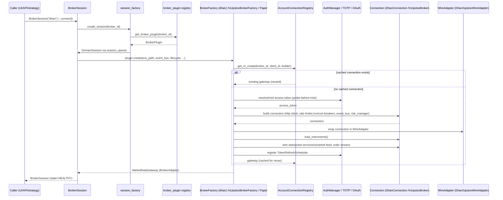
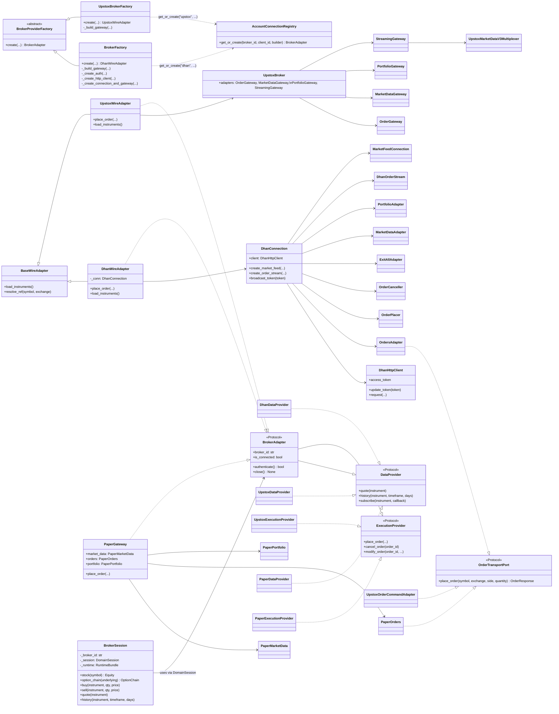

# `src/brokers/` — Broker Layer Reference

This document is the single reference for the broker layer: the full file tree
(down to leaf files), the architecture map, the runtime flow, and the class
relationships across `dhan`, `upstox`, `paper`, and the shared `common` /
`session` scaffolding.

Related docs: `docs/architecture/DEPENDENCY_GRAPH.md`,
`docs/architecture/FLOWS.md`, `context/architecture.md`.

---

## 1. Directory Tree (leaf-level)

```text
brokers/
├── certification
│   ├── __init__.py
│   ├── golden.py
│   ├── golden_dataset.json
│   ├── live_probes.py
│   ├── mapping.py
│   ├── market_hours.py
│   ├── report.py
│   ├── schema_v2.py
│   └── suite.py
├── cli
│   ├── __init__.py
│   ├── _errors.py
│   ├── _preferences.py
│   ├── _render.py
│   ├── _shell_nav.py
│   ├── _shell_types.py
│   ├── _shell_ui.py
│   └── broker.py
├── common
│   ├── api
│   │   ├── __init__.py
│   │   └── spi.py
│   ├── auth
│   │   ├── __init__.py
│   │   └── lifecycle.py
│   ├── contracts
│   │   ├── __init__.py
│   │   ├── broker_contract.py
│   │   ├── market_coverage_contract.py
│   │   └── module_test_suite.py
│   ├── http
│   │   └── resilient_transport.py
│   ├── identity
│   │   ├── __init__.py
│   │   └── account_registry.py
│   ├── instruments
│   │   ├── __init__.py
│   │   ├── carrier.py
│   │   ├── keys.py
│   │   └── service.py
│   ├── oms
│   │   ├── __init__.py
│   │   └── margin_provider.py
│   ├── __init__.py
│   ├── acl.py
│   ├── backoff.py
│   ├── broker_capabilities.py
│   ├── capabilities_validator.py
│   ├── historical_gap_check.py
│   ├── idempotency.py
│   ├── order_validation.py
│   ├── order_wire.py
│   ├── quote_normalize.py
│   ├── recon_local.py
│   ├── streaming.py
│   ├── tick_validation.py
│   ├── transport.py
│   ├── transport_errors.py
│   ├── transport_policy.py
│   └── wire_base.py
├── dhan
│   ├── adapters
│   │   └── order_gateway.py
│   ├── api
│   │   ├── __init__.py
│   │   ├── async_http_client.py
│   │   ├── http_client.py
│   │   ├── reconnecting_service.py
│   │   └── transport.py
│   ├── auth
│   │   ├── __init__.py
│   │   ├── connection_token_manager.py
│   │   ├── edis.py
│   │   ├── ip_management.py
│   │   ├── secret_utils.py
│   │   ├── token_manager.py
│   │   ├── token_scheduler.py
│   │   └── totp_client.py
│   ├── config
│   │   ├── __init__.py
│   │   ├── capabilities.py
│   │   ├── config.py
│   │   ├── constants.py
│   │   └── settings.py
│   ├── data
│   │   ├── depth_feed_base
│   │   │   ├── __init__.py
│   │   │   └── connection.py
│   │   ├── __init__.py
│   │   ├── alerts.py
│   │   ├── data_provider.py
│   │   ├── depth_20.py
│   │   ├── depth_200.py
│   │   ├── depth_parser.py
│   │   ├── futures.py
│   │   ├── historical.py
│   │   ├── instrument_adapter.py
│   │   ├── market_data.py
│   │   ├── options.py
│   │   └── subscription_engine.py
│   ├── execution
│   │   ├── __init__.py
│   │   ├── conditional_triggers.py
│   │   ├── exit_all.py
│   │   ├── field_mapping.py
│   │   ├── forever_orders.py
│   │   ├── order_cancellation.py
│   │   ├── order_placement.py
│   │   ├── order_validator.py
│   │   ├── orders.py
│   │   ├── pnl_exit.py
│   │   └── super_orders.py
│   ├── extensions
│   │   ├── __init__.py
│   │   ├── common_extensions.py
│   │   ├── depth20.py
│   │   ├── depth200.py
│   │   ├── forever_order.py
│   │   └── super_order.py
│   ├── identity
│   │   ├── __init__.py
│   │   ├── account_registry.py
│   │   ├── factory.py
│   │   ├── identity.py
│   │   └── user_profile.py
│   ├── instruments
│   │   ├── __init__.py
│   │   └── service.py
│   ├── portfolio
│   │   ├── __init__.py
│   │   ├── ledger.py
│   │   ├── margin.py
│   │   ├── portfolio.py
│   │   └── reconciliation.py
│   ├── resilience
│   │   ├── __init__.py
│   │   ├── circuit_breaker.py
│   │   ├── invariants.py
│   │   ├── metrics.py
│   │   └── retry_policies.py
│   ├── streaming
│   │   ├── __init__.py
│   │   ├── connection.py
│   │   ├── connection_admission.py
│   │   ├── connection_lifecycle.py
│   │   └── session_manager.py
│   ├── websocket
│   │   ├── __init__.py
│   │   ├── _helpers.py
│   │   ├── connection.py
│   │   ├── market_feed.py
│   │   ├── order_stream.py
│   │   ├── polling_feed.py
│   │   ├── publish.py
│   │   └── subscription.py
│   ├── __init__.py
│   ├── domain.py
│   ├── exceptions.py
│   ├── extended.py
│   ├── extended_account.py
│   ├── extended_data.py
│   ├── extended_orders.py
│   ├── extended_positions.py
│   ├── loader.py
│   ├── resolver.py
│   ├── resolver_refresher.py
│   ├── segments.py
│   ├── status_mapper.py
│   ├── symbol_validator.py
│   └── wire.py
├── diagnostics
│   ├── __init__.py
│   ├── benchmark.py
│   ├── core.py
│   ├── doctor.py
│   ├── health.py
│   └── schema.py
├── exceptions
│   └── __init__.py
├── extensions
│   ├── __init__.py
│   └── broker_extension.py
├── paper
│   ├── __init__.py
│   ├── data_provider.py
│   ├── execution_provider.py
│   ├── margin.py
│   ├── paper_gateway.py
│   ├── paper_market_data.py
│   ├── paper_orders.py
│   ├── paper_portfolio.py
│   ├── segment_mapper.py
│   └── sim_config.py
├── runtime
│   ├── __init__.py
│   ├── bundle.py
│   ├── capability_manager.py
│   ├── execution_manager.py
│   ├── historical_manager.py
│   ├── quote_manager.py
│   ├── subscription_manager.py
│   └── symbol_registry.py
├── services
│   ├── __init__.py
│   ├── _session.py
│   ├── capabilities.py
│   ├── core.py
│   ├── instrument_lookup.py
│   ├── market_data.py
│   ├── operations.py
│   ├── order_port.py
│   ├── orders.py
│   └── portfolio.py
├── session
│   ├── __init__.py
│   ├── broker_session.py
│   ├── registry.py
│   └── session_factory.py
├── upstox
│   ├── adapters
│   │   ├── __init__.py
│   │   ├── historical_adapter.py
│   │   ├── market_data_gateway.py
│   │   ├── order_gateway.py
│   │   ├── portfolio_adapter.py
│   │   ├── portfolio_gateway.py
│   │   ├── stream_manager.py
│   │   ├── streaming_gateway.py
│   │   └── tick_translator.py
│   ├── auth
│   │   ├── __init__.py
│   │   ├── config.py
│   │   ├── context.py
│   │   ├── exceptions.py
│   │   ├── holder_factory.py
│   │   ├── holders.py
│   │   ├── http.py
│   │   ├── json_token_state_store.py
│   │   ├── login.py
│   │   ├── oauth_client.py
│   │   ├── oauth_flow.py
│   │   ├── pkce.py
│   │   ├── redirect_server.py
│   │   ├── token_expiry.py
│   │   ├── token_manager.py
│   │   ├── token_persistence.py
│   │   ├── token_refresher.py
│   │   ├── totp_client.py
│   │   ├── totp_scheduler.py
│   │   └── urls.py
│   ├── bundles
│   ├── capabilities
│   │   ├── __init__.py
│   │   ├── instruments.py
│   │   ├── market_data.py
│   │   ├── orders.py
│   │   ├── portfolio.py
│   │   ├── snapshot.py
│   │   └── streaming.py
│   ├── config
│   │   ├── upstox-live.properties.example
│   │   └── upstox-sandbox.properties.example
│   ├── extensions
│   │   ├── __init__.py
│   │   ├── depth.py
│   │   └── news.py
│   ├── fundamentals
│   │   ├── __init__.py
│   │   └── client.py
│   ├── instruments
│   │   ├── __init__.py
│   │   ├── definition.py
│   │   ├── loader.py
│   │   ├── resolver.py
│   │   ├── search.py
│   │   ├── segment_mapper.py
│   │   └── service.py
│   ├── ipo
│   │   ├── __init__.py
│   │   ├── adapter.py
│   │   └── client.py
│   ├── kill_switch
│   │   ├── __init__.py
│   │   └── client.py
│   ├── mappers
│   │   ├── __init__.py
│   │   ├── _base.py
│   │   ├── derivatives_mapper.py
│   │   ├── domain_mapper.py
│   │   ├── equity_mapper.py
│   │   ├── options_mapper.py
│   │   └── price_parser.py
│   ├── market_data
│   │   ├── __init__.py
│   │   ├── client_v2.py
│   │   ├── client_v3.py
│   │   ├── expired_options.py
│   │   ├── futures.py
│   │   ├── futures_adapter.py
│   │   ├── historical_v2.py
│   │   ├── historical_v3.py
│   │   ├── margin.py
│   │   ├── margin_adapter.py
│   │   ├── market_data_adapter.py
│   │   ├── market_status.py
│   │   ├── market_status_adapter.py
│   │   ├── options_adapter.py
│   │   ├── options_client.py
│   │   ├── portfolio_adapter.py
│   │   ├── portfolio_client.py
│   │   └── trade_pnl.py
│   ├── market_intelligence
│   │   ├── __init__.py
│   │   ├── adapter.py
│   │   ├── client.py
│   │   └── snapshot.py
│   ├── mutual_funds
│   │   ├── __init__.py
│   │   └── client.py
│   ├── news
│   │   ├── __init__.py
│   │   ├── adapter.py
│   │   └── client.py
│   ├── orders
│   │   ├── __init__.py
│   │   ├── alert_adapter.py
│   │   ├── cover_order_adapter.py
│   │   ├── exit_all_adapter.py
│   │   ├── gtt_adapter.py
│   │   ├── gtt_client.py
│   │   ├── order_client.py
│   │   ├── order_command_adapter.py
│   │   ├── order_query_adapter.py
│   │   └── slice_adapter.py
│   ├── payments
│   │   ├── __init__.py
│   │   └── client.py
│   ├── reconciliation
│   │   ├── __init__.py
│   │   └── service.py
│   ├── static_ip
│   │   ├── __init__.py
│   │   └── client.py
│   ├── websocket
│   │   ├── proto
│   │   │   ├── MarketDataFeed.proto
│   │   │   ├── MarketDataFeed_pb2.py
│   │   │   ├── __init__.py
│   │   │   └── market_feed_pb2.py
│   │   ├── __init__.py
│   │   ├── feed_authorizer.py
│   │   ├── lifecycle_wrapper.py
│   │   ├── market_data_v3.py
│   │   ├── portfolio_stream.py
│   │   ├── v3_auto_reconnect.py
│   │   ├── v3_decoder.py
│   │   └── v3_subscription_manager.py
│   ├── .gitignore
│   ├── __init__.py
│   ├── auth_wire.py
│   ├── broker.py
│   ├── common_extensions.py
│   ├── data_provider.py
│   ├── extended.py
│   ├── extras.py
│   ├── factory.py
│   ├── instrument_adapter.py
│   ├── metrics.py
│   ├── status_mapper.py
│   └── wire.py
├── __init__.py
├── _bootstrap.py
└── platform_ops.py
```

> `runtime/*.lock` and `runtime/*.json` are process-generated state files
> (WebSocket lock + token cache), not source — listed by directory in this
> tree only for completeness; they are not part of the module's public
> surface.

---

## 2. Architecture Diagram

`BrokerSession` is the only object product code touches. It hides three
interchangeable broker plugins behind one factory/registry seam, each of
which must implement the same domain ports (`DataProvider`,
`ExecutionProvider`, `BrokerAdapter`). `common/` holds broker-agnostic
transport, contracts, and cross-cutting policy shared by all three.

```mermaid
graph TB
    subgraph Consumers["Consumers"]
        UI["interface/ui, interface/api"]
        OMS["application/oms"]
        STRAT["strategies / runtime"]
    end

    subgraph SessionLayer["brokers/session — public seam"]
        BS["BrokerSession\n(broker-agnostic facade)"]
        SF["session_factory.create_session()"]
        REG["registry.py\n(plugin lookup)"]
    end

    subgraph Plugin["infrastructure/broker_plugin — registration"]
        BP["BrokerPlugin registry\n(entry-point discovery)"]
    end

    subgraph Ports["domain/ports — contracts (no broker imports)"]
        DP["DataProvider"]
        EP["ExecutionProvider"]
        BA["BrokerAdapter\n(DataProvider & ExecutionProvider)"]
        OTP["OrderTransportPort"]
    end

    subgraph Common["brokers/common — shared, broker-agnostic"]
        WIRE["wire_base.BaseWireAdapter"]
        TRANS["transport.py / transport_policy.py / backoff.py"]
        CONTRACTS["contracts/broker_contract.py\n(BrokerContractSuite)"]
        CAPS["broker_capabilities.py / capabilities_validator.py"]
        IDREG["identity/account_registry.py\n(AccountConnectionRegistry)"]
        INSTR["instruments/service.py"]
        IDEMP["idempotency.py"]
    end

    subgraph Dhan["brokers/dhan"]
        DFAC["identity/factory.py\nBrokerFactory"]
        DWIRE["wire.py\nDhanWireAdapter"]
        DCONN["streaming/connection.py\nDhanConnection"]
        DHTTP["api/http_client.py\nDhanHttpClient"]
        DEXEC["execution/*\nOrdersAdapter, OrderPlacer,\nOrderCanceller, ExitAllAdapter"]
        DDATA["data/*\nMarketDataAdapter, DataProvider"]
        DPORT["portfolio/portfolio.py\nPortfolioAdapter"]
        DAUTH["auth/*\nTotpClient, TokenManager,\nTokenScheduler"]
        DWS["websocket/*, streaming/*\nMarketFeedConnection, OrderStream"]
    end

    subgraph Upstox["brokers/upstox"]
        UFAC["factory.py\nUpstoxBrokerFactory"]
        UWIRE["wire.py\nUpstoxWireAdapter"]
        UBROK["broker.py\nUpstoxBroker"]
        UADAPT["adapters/*\nOrderGateway, MarketDataGateway,\nPortfolioGateway, StreamingGateway"]
        UAUTH["auth/*\nOAuth, TOTP, TokenManager"]
        UWS["websocket/*\nMarketDataV3Multiplexer, Decoder"]
        UINSTR["instruments/*\nLoader, Resolver, Service"]
    end

    subgraph Paper["brokers/paper — simulated broker"]
        PGW["paper_gateway.py\nPaperGateway"]
        PORD["paper_orders.py\nPaperOrders"]
        PMD["paper_market_data.py\nPaperMarketData"]
        PPF["paper_portfolio.py\nPaperPortfolio"]
        PSIM["sim_config.py"]
    end

    UI --> BS
    OMS --> BS
    STRAT --> BS
    BS --> SF
    SF --> REG
    REG --> BP
    BP -.builds.-> DFAC
    BP -.builds.-> UFAC
    BP -.builds.-> PGW

    DFAC --> IDREG
    UFAC --> IDREG
    DFAC --> DCONN --> DHTTP
    DCONN --> DEXEC
    DCONN --> DDATA
    DCONN --> DPORT
    DCONN --> DWS
    DFAC --> DAUTH
    DFAC --> DWIRE
    DWIRE -->|implements| BA

    UFAC --> UBROK
    UBROK --> UADAPT
    UBROK --> UAUTH
    UBROK --> UWS
    UBROK --> UINSTR
    UFAC --> UWIRE
    UWIRE -->|implements| BA

    PGW --> PORD
    PGW --> PMD
    PGW --> PPF
    PGW -.reads.-> PSIM
    PGW -->|implements| BA

    DWIRE --> WIRE
    UWIRE --> WIRE
    DEXEC --> OTP
    UADAPT --> OTP
    PORD --> OTP

    Dhan --> TRANS
    Upstox --> TRANS
    Dhan --> CONTRACTS
    Upstox --> CONTRACTS
    Paper --> CONTRACTS
    Dhan --> CAPS
    Upstox --> CAPS
    Dhan --> INSTR
    Upstox --> INSTR
    DEXEC --> IDEMP
    UADAPT --> IDEMP

    BA -.satisfies.-> DP
    BA -.satisfies.-> EP
```



**Key architectural rules (enforced by `context/architecture.md` /
`docs/architecture/DEPENDENCY_RULES.md`):**

- `domain/ports/*` defines the contracts (`DataProvider`, `ExecutionProvider`,
  `BrokerAdapter`, `OrderTransportPort`) and imports **nothing** from
  `brokers.*`.
- Every broker (`dhan`, `upstox`, `paper`) implements the same ports
  structurally (via `Protocol` + `runtime_checkable`) — no explicit
  inheritance required, no central `if broker == "dhan"` switch anywhere
  above the plugin/factory layer.
- `brokers/common/*` is the only code shared across broker packages; broker
  packages must not import each other directly.
- `brokers/session/BrokerSession` is the **only** class product/strategy code
  should depend on; gateway/adapter/wire classes are transport facades used
  by ops tooling, the CLI, and tests.

---

## 3. Flow Diagram (end-to-end request path)

Two flows matter: **connect** (session bootstrap) and **order placement**
(the money path). Both are broker-agnostic above the factory boundary.

### 3.1 Connect / bootstrap flow



### 3.2 Order placement flow (`session.buy(...)`)

```mermaid
sequenceDiagram
    participant Caller
    participant BS as BrokerSession
    participant RT as RuntimeBundle.execution
    participant OMS as application/oms (OrderLifecycle)
    participant Risk as RiskGate
    participant Wire as WireAdapter\n(DhanWireAdapter / UpstoxWireAdapter / PaperGateway)
    participant Exec as Execution adapter\n(OrdersAdapter/OrderPlacer — dhan;\nOrderCommandAdapter — upstox;\nPaperOrders — paper)
    participant HTTP as Broker HTTP/API client
    participant Broker as Broker (real or simulated)

    Caller->>BS: session.buy(instrument, qty, price, ...)
    BS->>RT: execution.buy(...)
    RT->>OMS: submit OrderIntent
    OMS->>Risk: validate (limits, exposure, kill-switch)
    Risk-->>OMS: allow / reject
    OMS->>Wire: place_order(symbol, exchange, side, qty, ...)\n(OrderTransportPort)
    Wire->>Exec: delegate to broker-specific adapter
    Exec->>Exec: order_validation.py / idempotency.py\n(idempotency key, wire mapping)
    Exec->>HTTP: signed REST call (or in-memory sim for paper)
    HTTP->>Broker: POST /orders
    Broker-->>HTTP: order_id / rejection
    HTTP-->>Exec: raw response
    Exec-->>Wire: OrderResponse (normalized domain type)
    Wire-->>OMS: OrderResponse
    OMS->>OMS: OrderLifecycle state transition\n(NEW → ACKED/REJECTED)
    OMS-->>RT: OrderResponse
    RT-->>Caller: OrderResponse

    Note over Wire,Broker: Live order status arrives async via\nDhanOrderStream / UpstoxPortfolioStream\nand feeds status_mapper.py → OMS reconciliation
```

---

## 4. Class Diagram

Focused on the composition-root shapes that recur across the three brokers:
factory → gateway/wire adapter → data/execution/portfolio sub-adapters, all
structurally satisfying the same `domain.ports` protocols.



---

## 5. How the pieces fit together (one paragraph)

`BrokerSession` (`brokers/session/broker_session.py`) is constructed with a
broker id (`"dhan"` / `"upstox"` / `"paper"`); `session_factory.create_session`
resolves that id against the plugin registry (`infrastructure/broker_plugin`),
which calls the matching `BrokerProviderFactory.create(...)` — `BrokerFactory`
for Dhan, `UpstoxBrokerFactory` for Upstox. Each factory builds (or reuses, via
`AccountConnectionRegistry`) a broker-specific `WireAdapter`
(`DhanWireAdapter` / `UpstoxWireAdapter`) that wraps a connection/broker object
composed from smaller single-responsibility adapters — HTTP client, auth
manager, order execution adapters, market-data adapters, portfolio adapters,
and websocket streams. `PaperGateway` plays the same role for the simulated
broker, minus network I/O. All three wire adapters structurally satisfy
`domain.ports.broker_adapter.BrokerAdapter` (`DataProvider` +
`ExecutionProvider`), so `BrokerSession`, the OMS, and strategy code never
branch on broker identity — they call `session.buy(...)`, `session.quote(...)`,
etc., and the plugin underneath does the broker-specific translation to and
from wire formats (`brokers/common/wire_base.py`, `order_wire.py`,
`quote_normalize.py`).
