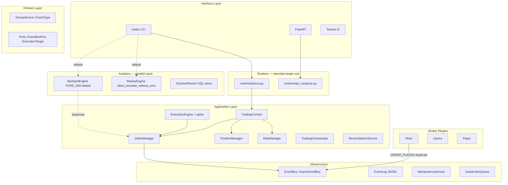

# TradeXV2 — Comprehensive Platform Review

**Date:** 2026-07-20  
**Method:** Independent 13-persona virtual review board via 9 parallel domain subagents (graphify-first, six-file context pre-flight, no prior audit priming)  
**Scope:** Full platform — architecture, quant readiness, event-driven design, code quality, frontend/API contract, broker integration, market data, testing, reliability, security, performance, repository organization, production readiness  
**Corpus:** `src/` ~151k LOC, ~8,568 tests, FastAPI backend, no React SPA on disk  
**Posture:** Brutally honest — real money at stake

> **Annotation convention:** Findings marked `[IN-FLIGHT]` have partial remediation tracked in `context/progress-tracker.md`. Severity and scores reflect **current as-built state**, not planned fixes.

---

## Table of Contents

1. [Executive Summary](#1-executive-summary)
2. [Architecture Review Report](#2-architecture-review-report)
3. [Quant Platform Review Report](#3-quant-platform-review-report)
4. [Code Smell Report](#4-code-smell-report)
5. [Testing Gap Analysis](#5-testing-gap-analysis)
6. [Reliability Assessment](#6-reliability-assessment)
7. [Security Assessment](#7-security-assessment)
8. [Performance Assessment](#8-performance-assessment)
9. [Refactoring Roadmap](#9-refactoring-roadmap)
10. [Production Readiness Scorecard](#10-production-readiness-scorecard)
11. [Prioritized Action Plan](#11-prioritized-action-plan)

---

## 1. Executive Summary

### Virtual Review Board

This review was conducted as a virtual board of 13 senior specialists:

| Persona | Primary focus | Headline verdict |
|---------|---------------|------------------|
| Principal Software Engineer | OMS spine, composition roots | Kernel exists; operator paths bypass it |
| Staff Architect | Bounded contexts, layering | Strong constitution; as-built drift is systemic |
| Quantitative Trading Architect | Zero-parity, multi-strategy | Research-capable; not live-money-ready |
| Low-Latency Systems Engineer | Event dispatch, WS fan-out | Single-thread dispatch + 50ms poll caps throughput |
| Event-Driven Architecture Expert | Event ownership, replay | Dual publishers + partial recovery = narrative corruption |
| Distributed Systems Expert | HA, idempotency, SPOFs | Single-node by design; in-memory idempotency on restart |
| Platform Reliability Engineer | DLQ, alerting, failover | AlertingEngine not wired; capital events can drop |
| QA/Test Automation Architect | Test pyramid, CI gates | ~8.5k tests; chaos/failover excluded from PR CI |
| Security Architect | AuthZ, secrets, audit | Cancel/modify bypass live authority; metrics exposed |
| Data Platform Architect | Datalake vs live divergence | Batch path mature; live never feeds lake |
| Frontend Architect | SPA + API contract | No SPA; API contract immature for browser clients |
| DevOps/Cloud Architect | Single-process, health probes | No HA; split health surfaces confuse probes |
| Performance Engineering Specialist | Hot paths, capacity | 5/10 — dev/single-operator adequate only |

### Overall Verdict

**TradeXV2 is a well-architected trading kernel trapped inside a fragmented runtime.** The codebase shows deliberate recent remediation (Ponytail Waves 1–3, Phase A money-safety, `place_order_spine`, `OrderMutationGuard`, constitution program). The **OMS spine is real and tested in component tests**. However, **every operator-facing default path bypasses that spine**, live and research diverge silently, and production operational controls (alerting, durable idempotency, browser-safe auth) are incomplete.

**Production Readiness Score: 4.2 / 10** (weighted average across 10 dimensions — see Section 10).

### Top 10 Systemic Risks (Cross-Domain)

| # | Risk | Domains | Severity |
|---|------|---------|----------|
| 1 | Default CLI/API analytics run `PURE_SIM` — no OMS, no risk, no idempotency | Quant, Architecture | Critical |
| 2 | Dhan publishes `ORDER_PLACED` on OMS-managed submit (dual publisher) | Architecture, Event-Driven | Critical |
| 3 | Upstox idempotency race — no reserve/commit protocol | Broker, Reliability | Critical |
| 4 | API cancel/modify bypasses `authorize_live_order` | Security, Quant | Critical |
| 5 | Kill-switch fail-open when `risk_manager is None` | Security, OMS | Critical |
| 6 | AsyncEventBus drops capital events at 2× queue depth | Reliability, Event-Driven | Critical |
| 7 | Live market data never reaches datalake — research/live divergence | Market Data, Quant | Critical |
| 8 | Dhan quotes stamped with wall-clock, not exchange time | Market Data, Quant | Critical |
| 9 | Triple composition roots (runtime / BrokerService / tradex session) | Architecture, Code Quality | High |
| 10 | In-memory idempotency lost on process restart | Reliability, Broker | High |

### What Works (Preserve These)

- OMS spine architecture (`ExecutionEngine` → `place_order_spine` → `OrderManager` + `RiskManager`)
- Broker contract test suites and capability SSOT
- Batch datalake validation (`validate_candles`, merge-write, IST normalization)
- Architecture ratchet tests (import-linter, mock-free safety, spine inventory)
- Explicit backpressure primitives (AsyncEventBus drop policy, WS per-connection queues)
- Phase A `OrderMutationGuard` on place/modify/cancel in `OrderLifecycle` `[IN-FLIGHT]`
- Dhan reserve/commit idempotency protocol (Upstox should adopt)

---

## 2. Architecture Review Report

### 2.1 System Intent

TradeXV2 is intended to be a **zero-parity quantitative trading OS**: one OMS kernel, one risk gate, one event bus, with mode-specific execution targets (live/paper/replay) resolved only at the composition root. It must support scanners, backtesting, paper trading, live trading, and future multi-broker/multi-strategy expansion on Indian exchanges (NSE/BSE via Dhan/Upstox).

### 2.2 Current Architecture Map



### 2.3 Bounded Context Assessment

| Context | Intended ownership | Actual state | Grade |
|---------|-------------------|--------------|-------|
| Execution Kernel (OMS) | Orders, fills, positions, risk | Strong kernel; bypassed by analytics defaults | B+ |
| Broker Integration | Wire protocol only; no capital publish | Dhan publishes ORDER_PLACED; WS synthesizes TRADE | C |
| Market Data | Quotes, bars, subscriptions | Two parallel stacks (API vs orchestrator) | D+ |
| Analytics/Research | Features, signals, backtests | Owns capital simulation outside OMS | C- |
| Reconciliation | Drift detection/healing | Implemented but fragile (broken unsubscribe) | B- |
| Runtime | Sole composition root | Three roots still active | D |

### 2.4 Event-Driven Design Assessment

| Dimension | Expected | Actual | Gap |
|-----------|----------|--------|-----|
| Event ownership | OMS sole capital publisher | Dhan + OMS both publish ORDER_PLACED | Critical |
| Event contracts | Schema-enforced at publish | Documentation-only `EVENT_PAYLOADS` | Medium |
| Idempotency | Business-key durable dedup | UUID event_id + bounded LRU caches | High |
| Ordering | Monotonic per order/trade | No sequence enforcement at bus | Medium |
| Replay | Deterministic projection rebuild | Partial handler replay + special cases | High |
| Recovery | Outbox + fold projections | JSONL partial replay | High |
| CQRS suitability | Light CQRS recommended | Not implemented | Planned |
| Full Event Sourcing | Not warranted | N/A | Correct deferral |

**Key findings (ARCH-001 through ARCH-019):** See cross-reference in Section 11. Critical items: dual publisher (ARCH-001), partial recovery (ARCH-002), bounded idempotency (ARCH-003), multiple bus instances (ARCH-004), AsyncEventBus drops (ARCH-006), broken reconciliation unsubscribe (ARCH-007), stream-local fill delta maps (ARCH-008).

### 2.5 Repository Organization

**Strengths:** Clear `src/` layering (domain → application → infrastructure → interface); broker plugins self-register; constitution docs exist.

**Weaknesses:**
- `BrokerService` (543 LOC, 215 graph edges) in interface layer owns OMS bootstrap
- `tradex/session.py` `open_session` CC 66 — second composition root
- `application/research/` shim re-exports analytics (dual ownership)
- 40+ modules duplicate `normalize_symbol`
- 38 files exceed 500 LOC ADR cap

**Recommended target structure:**
```
runtime/session_composer.py     ← sole wiring
domain/ports/                   ← typed contracts (BrokerOrderAck, MassStatusSnapshot)
application/oms/                ← capital kernel only
brokers/*/adapters/             ← ingress only, no capital publish
analytics/                        ← read-only projections; PARITY mode mandatory for PnL
interface/                        ← thin; no bootstrap logic
```

### 2.6 Architectural Invariant Violations

| Invariant | Status | Evidence |
|-----------|--------|----------|
| Zero-parity | **Violated** | Default PURE_SIM; mock parity gate |
| Single composition root | **Violated** | runtime + BrokerService + tradex session |
| Single OMS spine | **Partial** | Spine exists; OrderPlacer/analytics bypass |
| Risk gate mandatory | **Partial** | Fail-open when risk_manager None |
| Broker-agnostic core | **Violated** | WS fill delta semantics in broker layer |
| Domain purity | **OK** | Ports clean; runtime hooks in domain are smell |
| Reconciliation on hot path | **Partial** | Wired; unsubscribe broken |

---

## 3. Quant Platform Review Report

### 3.1 Readiness Summary

| Capability | Status | Blocker |
|------------|--------|---------|
| Multi-strategy execution | Partial | No portfolio signal arbiter; stacks 3× BUY |
| Multi-broker execution | Partial | Data federation only; orders use first broker |
| Scanner development | Yes | 4 scanner paths; determinism not enforced |
| Signal generation | Yes | StrategyPipeline works |
| Portfolio management | Partial | Three parallel books (OMS, session, domain Portfolio) |
| Risk management | Kernel yes; paths no | PURE_SIM bypasses entirely |
| Position sizing | Divergent | `compute_order_quantity` vs `compute_remaining_quantity` |
| Order routing | Single broker in orchestrator | No failover on order path |
| Event replay | Partial | Handler replay, not projection fold |
| Backtesting | Research only by default | PURE_SIM skips OMS |
| Walk-forward testing | Broken | Train window unused |
| Paper trading | Broken CLI path | Invalid kwargs / missing TradingContext |
| Live trading | Dry-run default | ORCHESTRATOR_DRY_RUN=1 |
| Performance analytics | Misleading | FastBacktest lookahead bias |

### 3.2 End-to-End Execution Flow (Actual vs Expected)

**Expected contract:** Signal → RiskGate → OMS → ExecutionTarget → Fill → Position → PnL — identical across live/paper/replay.

**Actual default backtest flow:**
```
CSV → BacktestEngine(PURE_SIM) → ReplayEngine(allow_simulate_without_oms=True)
  → SignalProcessor._process_simulated → session.capital debited directly
  → NO OrderManager, NO RiskManager, NO idempotency
```

**Actual live orchestrator flow (when enabled):**
```
CANDIDATE_GENERATED → StrategyPipeline.evaluate_single → for EACH signal: _execute_signal
  → ExecutionPlanner (kill_switch_check=lambda: False, existing_notional=0)
  → OrderPlacer → ExecutionEngine → BrokerFillSource
  → Default: ORCHESTRATOR_DRY_RUN=1 → no orders placed
```

### 3.3 Quant Findings (QUANT-001 through QUANT-018)

| ID | Severity | Issue | Fix direction |
|----|----------|-------|---------------|
| QUANT-001 | Critical | Default PURE_SIM skips OMS | PARITY default; `--research` flag for sim |
| QUANT-002 | Critical | Parity gate uses `_MockOmsAdapter` | Real `OmsBacktestAdapter` in gate |
| QUANT-003 | Critical | Paper CLI broken / unwired | Wire through composition root |
| QUANT-004 | Critical | ORCHESTRATOR_DRY_RUN=1 default | Fail-closed live enablement |
| QUANT-005 | High | Multi-strategy stacks signals | Portfolio signal coordinator |
| QUANT-006 | High | existing_notional=0 always | Inject position snapshot |
| QUANT-007 | High | Kill switch not wired to planner | Wire from RiskManager |
| QUANT-008 | High | Walk-forward train unused | Implement in-sample fit |
| QUANT-009 | High | FastBacktest lookahead bias | Hard-disable PnL or route through OMS |
| QUANT-010 | High | Sizing math diverges replay vs live | Single sizing function |

### 3.4 PnL / Execution Risks

- **False confidence:** Default backtest PnL ≠ live OMS book
- **Dual bookkeeping:** Session capital + OMS positions can drift in PARITY mode
- **Mock parity baseline:** Production boot passes without OMS fill semantics
- **Instant sim fills vs async live partial fills:** Timing/state machine differs materially
- **Walk-forward compounded PnL:** Overstates performance (re-init capital each window)

### 3.5 Corrected Quant Architecture (High Level)

1. **Single ResearchMode enum at composition root** — PARITY mandatory for any PnL output
2. **Portfolio signal coordinator** — one intent per symbol per bar
3. **Unified PnL projection** — all reporting from OMS PositionManager + TradeRecorder
4. **Real parity gate** — golden baselines on `OmsBacktestAdapter`
5. **Sim fill driver** — same event shapes/timing model as live websocket captures

---

## 4. Code Smell Report

### 4.1 Summary Counts

| Severity | Count |
|----------|------:|
| Critical | 8 |
| High | 12 |
| Medium | 13 |
| Low | 5 |
| **Total** | **38** |

### 4.2 Graph Hub Analysis

| Node | Edges | Role |
|------|------:|------|
| FeaturePipeline | 291 | Analytics computation hub |
| OmsOrderCommand | 252 | Order command fan-in |
| EventBus | 234 | Infrastructure god-hub |
| BrokerService | 215 | Interface god-hub |
| OrderManager | 213 | Application god-hub |

**Lowest cohesion community:** OrderManager (0.01) — OMS mixed with broker DataProviders.

### 4.3 Top 15 Fix-First (Real-Money Risk)

| Rank | ID | Location | Smell |
|------|-----|----------|-------|
| 1 | CODE-001 | `risk_manager.py:212` | God method CC 37 |
| 2 | CODE-002 | `tradex/session.py:62` | God function CC 66 |
| 3 | CODE-003 | `session_bridge.py:25` | Duck typing order normalization |
| 4 | CODE-004 | `execution_engine.py:52` | getattr mass-status heal |
| 5 | CODE-005 | `position_manager.py:76` | God method CC 28 |
| 6 | CODE-006 | `broker_service.py` | God class 543 LOC |
| 7 | CODE-007 | `order_manager.py` | Hub community 0.01 |
| 8 | CODE-008 | `dhan/http_client.py:411` | God method CC 35 |
| 9 | CODE-009 | `event_bus.py` | God class 517 LOC |
| 10 | CODE-010 | `oms_bootstrap.py` | Wrong-layer composition |
| 11 | CODE-011 | `production_readiness.py` | getattr container checks |
| 12 | CODE-012 | `commands/websocket.py` | Private attr access |
| 13 | CODE-013 | 40+ `normalize_symbol` | Shotgun surgery |
| 14 | CODE-014 | `trading_orchestrator.py:151` | Hidden risk_manager coupling |
| 15 | CODE-015 | `upstox/equity_mapper.py:30` | God function CC 34 |

### 4.4 Cross-Cutting Themes

- **God classes remain** despite partial decomposition (OrderManager → lifecycle split)
- **Triple composition roots** — runtime / BrokerService / tradex session
- **Primitive obsession** — dict payloads, getattr instrument fields, untyped mass-status
- **Duplicate simulation code** — paper/replay models + position_closer (~900 LOC combined)
- **Over-engineering** — production_readiness 532 LOC; research shim
- **Under-engineering** — duck-typed order bridge; no typed broker ack contract

### 4.5 Cyclomatic Complexity Hotspots

| CC | Function | File |
|----|----------|------|
| 66 | `open_session` | `tradex/session.py:62` |
| 47 | `_validate_fo` | `brokers/dhan/symbol_validator.py:233` |
| 37 | `check_order` | `application/oms/_internal/risk_manager.py:212` |
| 35 | `_request` | `brokers/dhan/api/http_client.py:411` |
| 34 | `_quote_from_instrument_dict` | `brokers/upstox/mappers/equity_mapper.py:30` |

---

## 5. Testing Gap Analysis

### 5.1 Test Inventory

| Category | Files | Est. tests | PR CI |
|----------|------:|-----------:|-------|
| Unit | 451 | ~4,200 | Yes |
| Component | 99 | ~900 | Yes |
| Integration | 160 | ~1,400 | Partial |
| Architecture | 67 | ~400 | Yes |
| E2E | 33 | ~300 | Yes |
| Chaos | 14 | ~80 | **No** (release only) |
| **Total** | **826** | **~8,568** | |

### 5.2 Test Pyramid Assessment

```
                    ▲
                   /|\  Architecture (67) — appropriate for real-money
                  / | \
                 / E2E (33) + Stress
                /--------\
               / Integration (160) — live paths gated
              /------------\
             / Component (99) — OMS strong (40 files)
            /----------------\
           /    Unit (451)    \ — broker-heavy (183 files)
          /____________________\
```

**Strengths:** OMS money-path depth; broker contract tests; architecture ratchets; mock-free safety enforcement.

**Distortions:** Chaos inverted (14 files, 9 not in blocking CI); 5 collection errors; documented-but-missing `test_multi_broker_failover.py`; live Upstox/WS excluded from PR CI.

### 5.3 Critical Test Gaps

| ID | Severity | Gap | Risk |
|----|----------|-----|------|
| TEST-001 | Critical | 5 collection errors | CI health regression |
| TEST-002 | Critical | Multi-broker failover E2E missing | Silent routing to dead broker |
| TEST-003 | Critical | 9/14 chaos tests not in PR CI | Fault modes ship undetected |
| TEST-004 | Critical | No dedicated mutation/reentrancy guard tests | Concurrent state corruption |
| TEST-005 | Critical | `shutdown_coordinator` untested | Open orders on process exit |
| TEST-006 | High | Execution spine use-cases untested directly | Parity break undetected |
| TEST-007 | High | Domain indicators lack dedicated tests | Scanner/replay math drift |
| TEST-008 | High | No stack-level tick fault injection | Duplicate tick double-count |
| TEST-010 | High | `scanner_determinism` marker unused | SQL vs Python scanner diverge |

### 5.4 Critical Paths Without Adequate Tests

| Path | Coverage |
|------|----------|
| Order placement spine runtime | Architecture AST only |
| Order mutation guard concurrency | Indirect only |
| Shutdown coordinator | **None** |
| Multi-broker order failover | **None** |
| Live == backtest output parity | Mode-wiring only |
| WebSocket tick → OMS under fault | E2E happy path only |

---

## 6. Reliability Assessment

### 6.1 SPOF Inventory

| Component | Blast radius | Mitigation |
|-----------|-------------|------------|
| Single Python process | Total halt | None |
| AsyncEventBus worker thread | Event processing stops | Daemon, no supervisor |
| In-memory idempotency | Duplicate orders on restart | **Not mitigated** |
| SQLite order store | Corrupt book | Single-writer documented |
| DuckDB datalake file | Analytics down | Retry helper only |
| External broker API | No quotes/orders | Circuit breakers present |

### 6.2 Reliability Findings

| ID | Severity | Issue | Incident risk |
|----|----------|-------|---------------|
| REL-001 | High | AlertingEngine not wired at bootstrap | No automated paging |
| REL-002 | High | AsyncEventBus drops non-critical events | Stale book, missed hedges |
| REL-003 | **Critical** | Capital events dropped at 2× queue | Silent PnL/position desync |
| REL-004 | High | DLQ monitor logs only; no replay worker | Manual recovery required |
| REL-007 | High | Shutdown continues after cancel failures | Overnight exposure |
| REL-008 | High | In-memory idempotency only | Duplicate orders on restart |
| REL-010 | High | Single-process composition | No failover |
| REL-012 | Medium | OMS build failure nulled; API partial start | Inconsistent 503 vs live paths |

### 6.3 Operational Readiness Gaps

- Alerting not connected to production bus
- No DLQ replay runbook/tooling
- Split health surfaces (`/healthz` vs `/api/v1/health/*`)
- Metrics exposed without auth
- No centralized log shipping contract
- Single-node SQLite — RPO/RTO undefined
- AsyncEventBus drop counters not alerted

### 6.4 Retry / Circuit Breaker Assessment

**Present:** Dhan/Upstox split circuit breakers (read/write/admin); MultiBucketRateLimiter; `connect_with_retry` for DuckDB; reconciliation coalescing.

**Missing:** Broker order-path failover; DLQ auto-retry; durable idempotency; event spool on overflow; supervisor for daemon threads.

---

## 7. Security Assessment

### 7.1 Critical Vulnerabilities

| ID | Severity | Issue | Abuse scenario |
|----|----------|-------|----------------|
| SEC-001 | **Critical** | PUT/DELETE `/orders` bypass `authorize_live_order` | Authenticated user cancels/modifies live orders without live gate |
| SEC-002 | **Critical** | `OrderMutationGuard`: risk_manager None → allowed | Kill switch inactive; orders proceed in incident |
| SEC-003 | **Critical** | `authorize_live_order` skips risk when None | Live orders without pre-trade risk |
| SEC-004 | High | `/health/metrics` unauthenticated | Trading activity fingerprinting |
| SEC-009 | High | Auto-generated ephemeral API key | Unknown credential on deploy |
| SEC-014 | High | Plaintext tokens without encryption key | Credential theft from filesystem |

### 7.2 Security Posture Summary

| Area | Grade | Notes |
|------|-------|-------|
| API authentication | B- | API key + admin mode; ephemeral key risk |
| Authorization | D | Live gate inconsistent across routes |
| Secret management | C | Encryption optional; `.env.local` mirror |
| Audit trails | D | In-memory default; evicted on restart |
| Input validation | B | Pydantic on core routes; live routes use dict |
| Order validation | C+ | OMS risk exists; bypass paths remain |
| WebSocket auth | F | Header-only; browsers cannot authenticate |
| Rate limiting | C | XFF spoofing without trusted proxy config |

### 7.3 Trading Abuse Risks

- Order spam if rate limit disabled (`rate_limit_per_minute: 0`)
- Cancel/modify live orders via `/orders` while `/live/*` blocked
- Audit trail readable by any API key holder
- Webhook accepts unsigned callbacks when secret unset (non-prod)

---

## 8. Performance Assessment

### 8.1 Performance Score: **5 / 10**

Adequate for development and single-operator use. Not capacity-planned for multi-client live market data or bursty order flow.

### 8.2 Hot Path Analysis

**Market data:** Dhan WS thread → AsyncEventBus (single worker, 50ms poll) → EventBus (sync persist+dispatch) → MarketBridge (sequential await per client) → WS queues (drop-oldest at 256).

**Order placement:** FastAPI async → sync `tradex.connect()` blocks event loop OR `asyncio.run()` nested inside thread pool (PERF-001 critical).

**Candles API:** Full parquet read per request despite DuckDB pushdown being benchmarked but not wired.

### 8.3 Top Performance Findings

| ID | Severity | Bottleneck | Impact |
|----|----------|------------|--------|
| PERF-001 | Critical | `asyncio.run()` in ExecutionComposer | Nested loop / deadlock risk |
| PERF-002 | High | Sync tradex in async order route | 1 order per worker RTT |
| PERF-003 | High | Single-thread event dispatch + 50ms poll | Tick latency jitter |
| PERF-005 | High | Full parquet read for `/candles` | Memory + latency scale with history |
| PERF-007 | High | Sequential WS fan-out | O(N×M) under load |

### 8.4 Capacity Estimates (Single Process)

| Dimension | Conservative limit | Bottleneck |
|-----------|-------------------|------------|
| Concurrent API users | 10–20 | Sync I/O on event loop |
| WebSocket clients | 50–100 subscribed | Sequential bridge dispatch |
| Tick ingest | 2k–5k/s before drops | Single dispatch worker |
| Orders/min | 30–60 (4 workers) | Blocking place + broker quota |
| DuckDB concurrent reads | 32 RO connections | New conn per acquire |

---

## 9. Refactoring Roadmap

### Phase 0 — Stop the Bleeding (P0, 1–2 days each)

| Item | Finding IDs | Action |
|------|-------------|--------|
| Dhan OMS-managed publish guard | ARCH-001 | Add `is_oms_managed_submit()` check like Upstox |
| Fix reconciliation unsubscribe | ARCH-007 | Store subscribe tokens; unsubscribe by token |
| Unify order mutation auth | SEC-001, SEC-003 | All mutations through `authorize_live_order` |
| Fail-closed kill switch | SEC-002 | Reject when risk_manager None in production |
| Upstox reserve/commit idempotency | BROKER-008 | Adopt Dhan protocol |
| Fix 5 test collection errors | TEST-001 | Restore CI health |

### Phase 1 — Spine Integrity (1–4 weeks)

| Item | Finding IDs | Action |
|------|-------------|--------|
| PARITY default for PnL paths | QUANT-001, QUANT-003 | Composition root ResearchMode gate |
| Real parity gate | QUANT-002 | Replace `_MockOmsAdapter` |
| Single composition root | CODE-006, CODE-010 | `runtime/session_composer.py` |
| Typed money-path contracts | CODE-003, CODE-004 | BrokerOrderAck, MassStatusSnapshot |
| Wire AlertingEngine | REL-001 | Bootstrap integration |
| Never drop capital events | REL-003 | Spool or sync publish |
| Durable idempotency | REL-008 | Redis/file backend |
| Browser WS auth | FE-003 | Cookie or first-frame auth |
| OpenAPI + codegen | FE-004 | CI-verified contract |

### Phase 2 — Zero-Parity & Data (1–4 weeks)

| Item | Finding IDs | Action |
|------|-------------|--------|
| Live→lake bar sink | MD-001 | Minute aggregator → merge-write |
| Exchange timestamp on Dhan quotes | MD-002 | Parse SDK timestamp |
| Unify API/orchestrator subscribe | MD-003, MD-004 | Shared SubscriptionEngine |
| Wire CandleAggregator | MD-005 | Or remove WS candle promise |
| Portfolio signal coordinator | QUANT-005 | One intent/symbol/bar |
| Policy-chain RiskManager | CODE-001 | Split check_order |
| DuckDB pushdown for candles | PERF-005 | Wire benchmarked path |

### Phase 3 — Production Hardening (1–6 months)

| Item | Finding IDs | Action |
|------|-------------|--------|
| Transactional outbox | ARCH-002 | OMS mutations + event append in one TX |
| Split capital vs market bus | ARCH-006 | No drop on capital path |
| Multi-broker order failover | TEST-002, REL-014 | E2E + routing policy |
| Chaos in PR CI | TEST-003 | Fast subset <2 min |
| HA documentation or implementation | REL-010 | Explicit single-node contract or active/passive |
| SPA scaffold + ui-context.md | FE-001, FE-002 | Frontend foundation |
| EventBus decomposition | CODE-009 | Channels: capital / analytics / market |
| Simulation DRY | CODE-022–024 | Merge paper/replay models |

---

## 10. Production Readiness Scorecard

Scores reflect **current as-built state**. `[IN-FLIGHT]` notes partial remediation underway.

| Area | Score | Rationale | In-flight |
|------|------:|-----------|-----------|
| **Architecture** | 5/10 | Strong constitution; triple roots, dual publishers, analytics bypass | Constitution Phase H |
| **Quant Design** | 4/10 | OMS kernel real; defaults bypass it; multi-strategy gaps | place_order_spine |
| **Code Quality** | 5/10 | 38 smells; god hubs; recent Ponytail cleanup helped | Waves 1–3 done |
| **Testing** | 6/10 | 8.5k tests; OMS strong; chaos/failover gaps | Phase A tests (13) |
| **Reliability** | 3/10 | Single-node; drops capital events; no alerting wired | AsyncEventBus wired API |
| **Scalability** | 4/10 | Single-thread dispatch; full parquet reads; 5/10 perf | DuckDB pool P0 ratchet |
| **Security** | 3/10 | Auth exists; authZ inconsistent; metrics exposed | OrderMutationGuard |
| **Performance** | 5/10 | Backpressure primitives good; async boundary bugs | — |
| **Maintainability** | 5/10 | Constitution + graphify; 38 files >500 LOC; shotgun surgery | Ponytail ongoing |
| **Operational Readiness** | 3/10 | No alerting; DLQ manual; split health; no HA runbook | production_readiness merge |

### Weighted Production Readiness Score

**4.2 / 10** — Not production-ready for live money. Research and paper trading with explicit guardrails only.

---

## 11. Prioritized Action Plan

### Top 20 Risks

| # | Risk | Severity | IDs |
|---|------|----------|-----|
| 1 | Default analytics bypass OMS/risk | Critical | QUANT-001 |
| 2 | Dhan dual ORDER_PLACED publisher | Critical | ARCH-001 |
| 3 | Upstox idempotency race | Critical | BROKER-008 |
| 4 | API cancel/modify bypass live authority | Critical | SEC-001 |
| 5 | Kill-switch fail-open | Critical | SEC-002, SEC-003 |
| 6 | Capital events dropped on AsyncEventBus | Critical | REL-003 |
| 7 | Live data never reaches datalake | Critical | MD-001 |
| 8 | Dhan wall-clock timestamps | Critical | MD-002 |
| 9 | Mock parity gate | Critical | QUANT-002 |
| 10 | Paper CLI broken | Critical | QUANT-003 |
| 11 | ORCHESTRATOR_DRY_RUN default | Critical | QUANT-004 |
| 12 | In-memory idempotency on restart | High | REL-008 |
| 13 | Triple composition roots | High | CODE-006, ARCH-004 |
| 14 | Upstox WS gives up after 3 retries | High | BROKER-009 |
| 15 | asyncio.run in ExecutionComposer | Critical | PERF-001 |
| 16 | Reconciliation handler accumulation | High | ARCH-007 |
| 17 | Stream-local fill delta on reconnect | High | ARCH-008 |
| 18 | Multi-strategy signal stacking | High | QUANT-005 |
| 19 | 5 test collection errors | Critical | TEST-001 |
| 20 | Unauthenticated metrics leak | High | SEC-004 |

### Top 20 Improvements

| # | Improvement | Impact | Effort |
|---|-------------|--------|--------|
| 1 | PARITY default for all PnL-bearing commands | Zero-parity foundation | Medium |
| 2 | Single publisher rule for capital events | Event integrity | Low |
| 3 | Upstox reserve/commit idempotency | Duplicate order prevention | Medium |
| 4 | Unified `authorize_live_order` on all mutations | Security | Low |
| 5 | Fail-closed kill switch | Safety | Low |
| 6 | Never drop capital events | Reliability | Medium |
| 7 | Wire AlertingEngine at bootstrap | Ops visibility | Low |
| 8 | Durable idempotency backend | Restart safety | Medium |
| 9 | Single composition root (`session_composer`) | Maintainability | High |
| 10 | Typed BrokerOrderAck / MassStatusSnapshot | Silent failure elimination | Medium |
| 11 | Live→lake minute bar sink | Research/live parity | High |
| 12 | Exchange timestamp on all quotes | Data quality | Low |
| 13 | Portfolio signal coordinator | Multi-strategy safety | Medium |
| 14 | Real OmsBacktestAdapter parity gate | Validation trust | Medium |
| 15 | Fix PERF-001 asyncio.run | Order path stability | Low |
| 16 | DuckDB pushdown for `/candles` | API performance | Medium |
| 17 | Chaos subset in PR CI | Fault regression detection | Low |
| 18 | Browser-compatible WS auth | Frontend unblock | Medium |
| 19 | OpenAPI committed + codegen CI | Contract stability | Low |
| 20 | Ref-count WS subscriptions | Multi-tab reliability | Low |

### Quick Wins (1–2 Days Each)

1. Add `is_oms_managed_submit()` guard to Dhan `OrderPlacer` (ARCH-001)
2. Fix reconciliation `unsubscribe` to use tokens (ARCH-007)
3. Route PUT/DELETE `/orders` through `authorize_live_order` (SEC-001)
4. Fail-closed when `risk_manager is None` in production (SEC-002)
5. Fix 5 test collection errors (TEST-001)
6. Require explicit `API_KEY` in production/staging (SEC-009)
7. Authenticate `/health/metrics` or network-restrict (SEC-004)
8. Remove `ORCHESTRATOR_DRY_RUN=1` as silent default — require explicit opt-in (QUANT-004)
9. Parse Dhan SDK exchange timestamp in `_transform_quote` (MD-002)
10. Mark chaos tests and add 5-file fast subset to `ci.yml` (TEST-003)

### Medium-Term (1–4 Weeks)

1. PARITY mode default for backtest/replay/paper CLI and API
2. Replace mock parity gate with real `OmsBacktestAdapter`
3. Upstox adapter-layer live guards + reserve/commit idempotency
4. Upstox unbounded WS reconnect + real `disconnect()`
5. Consolidate composition into `runtime/session_composer.py`
6. Wire AlertingEngine; halt-on-DLQ-depth policy
7. Durable idempotency (Redis or file backend)
8. Portfolio signal coordinator in TradingOrchestrator
9. Policy-chain RiskManager refactor
10. OpenAPI spec + `web/openapi.json` CI gate
11. Browser WS auth design + implementation
12. DuckDB predicate pushdown for candle queries
13. Wire CandleAggregator or remove WS candle protocol promise
14. Component tests for mutation guard, shutdown coordinator, execution spine
15. Implement missing multi-broker failover E2E test

### Long-Term Strategic (1–6 Months)

1. Transactional outbox + projection fold recovery (replace partial JSONL replay)
2. Split capital vs market event buses with explicit backpressure
3. Live tick→minute bar→lake pipeline for zero-parity research
4. SPA scaffold with ui-context.md, generated client, state machines
5. Multi-broker order routing with capital reconciliation before switch
6. HA strategy: explicit single-node contract OR active/passive with shared durable state
7. EventBus channel decomposition (capital / analytics / market)
8. Simulation code merge (paper/replay models, position_closer)
9. Walk-forward optimization with in-sample fit
10. Sim fill driver matching live websocket event captures
11. Full scanner determinism enforcement (`scanner_determinism` marker + golden tests)
12. Domain indicator canonical test suite
13. Incremental materialized view refresh (replace drop_all/create_all)
14. Capacity-tested deployment profiles with SLO targets
15. External durable DLQ (SQS/Kafka) for production

---

## Appendix A: Domain Finding Index

| Prefix | Count | Domain |
|--------|------:|--------|
| ARCH | 19 | Architecture & Event-Driven |
| QUANT | 18 | Quant Trading Readiness |
| CODE | 38 | Code Quality |
| FE | 25 | Frontend / API Contract |
| BROKER | 20 | Broker Integration |
| MD | 22 | Market Data |
| TEST | 20 | Testing |
| REL | 18 | Reliability |
| SEC | 17 | Security |
| PERF | 20 | Performance |

---

## Appendix B: Expected Behavior Contract (Capital Path)

| Term | Expected | Actual (2026-07-20) |
|------|----------|---------------------|
| **Inputs** | Idempotent `PlaceOrder(correlation_id)` | Met via OMS; Dhan also publishes |
| **Outputs** | Exactly one ORDER_PLACED per placement | **Violated** on Dhan OMS path |
| **Timing** | Fills eventually consistent with broker | Stream-local delta; reconnect risk |
| **State transitions** | Legal machine paths only | Upsert admits arbitrary first state |
| **Failure modes** | Fail closed, alert, DLQ | Fallback bus without DLQ; handler fail → orphan events |
| **Recovery** | Deterministic rebuild from durable log | Partial replay + handler special cases |
| **Zero-parity** | live == paper == replay == backtest | **Violated** by default operator paths |

---

## Appendix C: Review Methodology

- **Independent analysis:** Prior audit documents (`docs/constitution/07-gap-analysis.md`, `CODE-QUALITY-REVIEW-2026-07-20.md`) were not used during subagent exploration
- **Graphify-first:** All subagents ran graphify query/explain/path before grep/read
- **Six-file context:** project-overview, architecture, code-standards, ai-workflow-rules (+ ui-context where applicable)
- **In-flight cross-check:** Applied only in synthesis pass against `context/progress-tracker.md`
- **No code changes:** Review + report only; redesign directions, not patch-level fixes

---

*This document is the single source of truth for the 2026-07-20 comprehensive platform review.*
