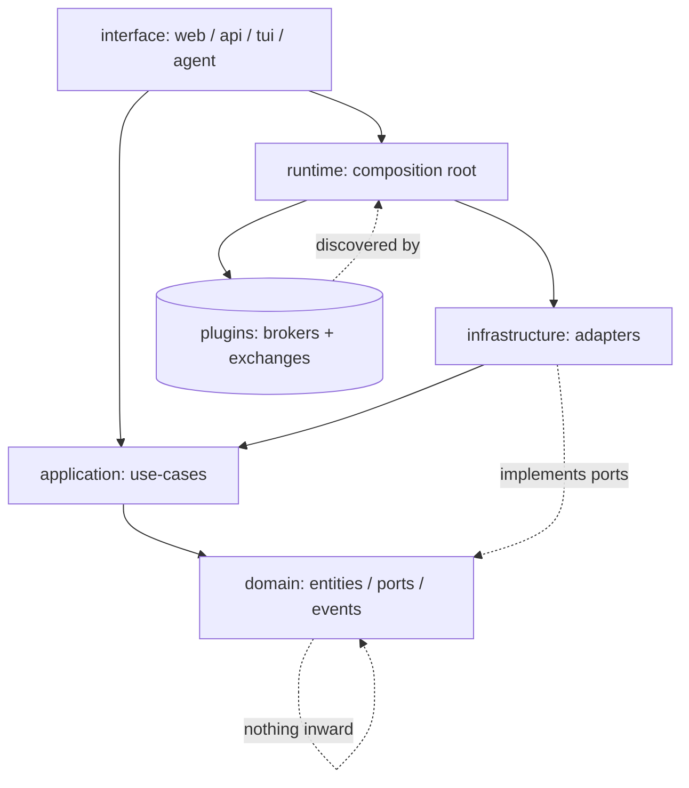

# DEPENDENCY_GRAPH.md

> Machine-checked companion to `DEPENDENCY_RULES.md`. `tests/architecture/test_dependency_graph_sync.py`
> keeps this file's approved-debt table in sync with `pyproject.toml`'s import-linter
> `ignore_imports` for the "Application infrastructure separation" contract, and with
> `tests/architecture/test_application_no_infra_imports.py`'s `_APPROVED_EDGES` — all three
> must list the same edges or that test fails. If you add a new
> `application -> infrastructure` debt edge, update all three together.

## 1. Target layer dependency graph

Source: `docs/architecture/diagrams/architecture.md` §1 (full mermaid diagrams for every
flow live there — this is the reference copy the sync test checks for).

## 2. Approved `application → infrastructure` debt edges

These are the only production `application.*` modules permitted to import `infrastructure.*`
directly (everything else must go through a domain port). Defined in `pyproject.toml`
(`[[tool.importlinter.contracts]]`, contract `"Application infrastructure separation"`,
`ignore_imports`) and mirrored in `_APPROVED_EDGES` in
`tests/architecture/test_application_no_infra_imports.py`.

| `application` module | `infrastructure` target | Why |
|---|---|---|
| `application.composer.router` | `infrastructure.observability.audit` | Composer emits audit events directly |
| `application.composer.router` | `infrastructure.time.clock` | Composer wires the Clock |
| `application.composer.gap_reconciler` | `infrastructure.time.clock` | Same reason |
| `application.services.download_engine` | `infrastructure.io.parquet` | Downloads write straight to parquet storage |
| `application.services.historical_data` | `infrastructure.historical_data` | Thin re-export (`HistoricalDataService` lives in infrastructure — wave 3) |
| `application.services.production_readiness` | `infrastructure.security.ssl_hardening` | Inspects hardened TLS sessions |
| `application.data.provenance` | `infrastructure.time.clock` | Provenance records need Clock |
| `application.data.historical_coordinator` | `infrastructure.observability.audit` | Emits `emit_historical_chunk` audit events |
| `application.data.chunk_merger` | `infrastructure.observability.audit` | Split out of `historical_coordinator` (circular-import fix) — the audit call moved with it |
| `application.streaming.orchestrator` | `infrastructure.observability.audit` | Emits stream-lifecycle audit events |
| `application.scheduling.quota_scheduler` | `infrastructure.observability.audit` | Emits quota-event audit records |

Test-only edges (`application.oms.tests.* -> infrastructure.**` / `brokers.providers.dhan.**` /
`brokers.common.**`) are integration-harness imports, not production debt — listed in
`pyproject.toml` but not tracked in the table above.

## 3. Parallel execution waves

Independent workstreams the layer graph in §1 permits running in parallel, because none of
them shares a write-boundary with another (based on the current import-linter contract list —
14 contracts as of this doc, see `pyproject.toml` `[tool.importlinter]`):

| Wave | Scope | Why it's parallel-safe |
|---|---|---|
| **Wave A — Domain** | `src/domain/` entities/ports/events | Nothing imports inward into domain; domain changes only ripple outward, never sideways into another wave's files (protected — requires an ADR per `context/ai-workflow-rules.md` §6) |
| **Wave B — Broker plugins** | `src/brokers/providers/dhan/`, `src/brokers/providers/upstox/`, `src/brokers/providers/paper/` | Isolated from each other by the "Broker common isolation" / "Analytics broker-adapter isolation" contracts; one broker's wire/gateway work cannot break another's |
| **Wave C — Application use-cases** | `src/application/oms/`, `execution/`, `trading/`, `portfolio/`, `strategy_engine/` | Guarded by "Application broker isolation" + "Application infrastructure separation" (§2 above) — use-case work cannot silently reach into a broker or infra concrete |
| **Wave D — Infrastructure adapters** | `src/infrastructure/` (event_bus, idempotency, config, resilience, observability) | "Infrastructure independence" contract keeps these from reaching into runtime/interface; safe to refactor without touching application call sites as long as the port contract holds |
| **Wave E — Interface surfaces** | `src/interface/api/`, `ui/`, CLI, MCP | "CLI broker-implementation isolation", "API broker-implementation isolation", "Runtime does not import interface" keep presentation work from leaking into runtime/brokers |

Runtime (`src/runtime/`) is deliberately **not** a parallel wave — it is the single
composition root (invariant #2, `context/architecture.md` §7) and changes there touch every
wave's wiring, so they're sequenced, not parallelized.

See `DEPENDENCY_RULES.md` for the rule these waves are derived from, and `pyproject.toml` for
the enforced contract list this table must stay consistent with.
