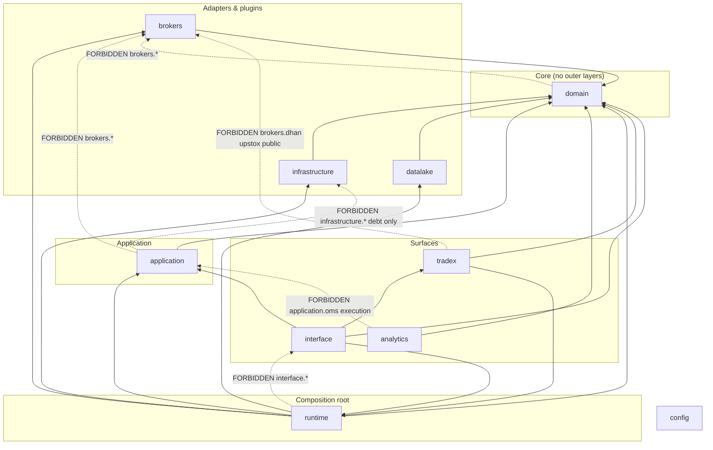

# Dependency Graph

**Version:** 1.0 (TRANS-P1-007 extension)  
**Related:** [DEPENDENCY_RULES.md](./DEPENDENCY_RULES.md) · `pyproject.toml` `[tool.importlinter]` · [ENGINEERING-BACKLOG.md](../reviews/2026-07-11-trading-os-transformation-program/ENGINEERING-BACKLOG.md)

This document links **transformation program task dependencies** (Phases 0–7) with **package import layers** enforced in CI.

---

## 1. Transformation program task DAG (Phases 0–7)

Phases are sequential at the macro level; tasks within and across phases run in **parallel lanes** when dependencies are satisfied (see §4).

```mermaid
flowchart TD
  subgraph P0["Phase 0 — Discovery ✅"]
    P0001[TRANS-P0-001 Census]
    P0002[TRANS-P0-002 import-linter baseline]
    P0003[TRANS-P0-003 CI path drift]
    P0004[TRANS-P0-004 E2E flows]
    P0005[TRANS-P0-005 Risk register]
  end

  subgraph P1["Phase 1 — Architecture Foundation ✅"]
    P1001[TRANS-P1-001 Handbook]
    P1002[TRANS-P1-002 Glossary]
    P1003[TRANS-P1-003 Bounded contexts]
    P1004[TRANS-P1-004 Event catalog]
    P1005[TRANS-P1-005 Object model]
    P1006[TRANS-P1-006 Package structure]
    P1007[TRANS-P1-007 DEPENDENCY_RULES]
    P1008[TRANS-P1-008 Plugin contract]
    P1009[TRANS-P1-009 SDK contract]
    P1010[TRANS-P1-010 ADR-015–018]
    P1011[TRANS-P1-011 Context diagrams]
    P1012[TRANS-P1-012 Review checklist]
  end

  subgraph P2["Phase 2 — Runtime & Flow Design"]
    P2001[TRANS-P2-001 Startup flow]
    P2002[TRANS-P2-002 Shutdown]
    P2014[TRANS-P2-014 Error taxonomy]
    P2015[TRANS-P2-015 Flow contract tests]
    P2008[TRANS-P2-008 Order SM]
    P2011[TRANS-P2-011 Reconciliation]
    P2013[TRANS-P2-013 Mode routing]
  end

  subgraph P3["Phase 3 — Engineering Standards ✅"]
    P3001[TRANS-P3-001 CI paths]
    P3002[TRANS-P3-002 Replay verifier]
    P3003[TRANS-P3-003 workflow paths test]
    P3004[TRANS-P3-004 ADR-019 gates]
    P3008[TRANS-P3-008 import-linter 15/15]
    P3009[TRANS-P3-009 STANDARDS.md]
    P3010[TRANS-P3-010 domain no brokers]
    P3011[TRANS-P3-011 app no infra]
  end

  subgraph P4["Phase 4 — Developer Platform"]
    P4001[TRANS-P4-001 DEVELOPER-PLATFORM]
    P4002[TRANS-P4-002 Unified doctor]
    P4003[TRANS-P4-003 verify + cert schema]
    P4005[TRANS-P4-005 API /ready]
    P4010[TRANS-P4-010 cert path unity test]
  end

  subgraph P5["Phase 5 — Core Platform Refactor"]
    P5010[TRANS-P5-010 Upstox bus]
    P5011[TRANS-P5-011 Segment registry]
    P5020[TRANS-P5-020 TracingPort]
    P5021[TRANS-P5-021 runtime.factory]
    P5022[TRANS-P5-022 Migrate roots]
    P5030[TRANS-P5-030 Ledger outbox]
    P5031[TRANS-P5-031 Shadow portfolio]
    P5040[TRANS-P5-040 Shim removal]
  end

  subgraph P6["Phase 6 — Feature Delivery"]
    P6001[TRANS-P6-001 Market Access v1]
    P6002[TRANS-P6-002 Trading v1]
    P6004[TRANS-P6-004 Portfolio v1]
    P6007[TRANS-P6-007 Strategy engine]
  end

  subgraph P7["Phase 7 — Production Hardening"]
    P7001[TRANS-P7-001 SLOs]
    P7002[TRANS-P7-002 OTel E2E]
    P7003[TRANS-P7-003 Chaos suite]
    P7007[TRANS-P7-007 Production gate v2]
  end

  P0 --> P1
  P1 --> P2
  P1 --> P3
  P2 --> P4
  P3 --> P4
  P3 --> P5
  P2 --> P5
  P4 --> P5
  P5 --> P6
  P6 --> P7

  P0001 --> P1001
  P1003 --> P1006 --> P1007
  P1004 --> P1005
  P1007 --> P3008

  P1001 --> P2001
  P2001 --> P2002
  P2001 --> P2008
  P2001 --> P2011
  P2001 --> P2013
  P2001 --> P2014 --> P2015

  P0001 --> P3001
  P3001 --> P3002
  P3001 --> P3003
  P3001 --> P3004
  P3001 --> P3008
  P1007 --> P3008
  P3008 --> P3010
  P3008 --> P3011
  P3004 --> P3008

  P1001 --> P4001
  P2001 --> P4005
  P3001 --> P4002
  P3001 --> P4003
  P4002 --> P4003 --> P4010

  P3008 --> P5011
  P3008 --> P5020
  P3001 --> P5021
  P5021 --> P5022
  P5010 --> P5013[TRANS-P5-013 fail-closed MD]
  P2011 --> P5012[TRANS-P5-012 Upstox recon]
  P5030 --> P5031
  P5022 --> P5040
  P5031 --> P5040

  P5022 --> P6002
  P5031 --> P6004
  P6002 --> P6007
  P5 --> P6001

  P5020 --> P7002
  P5010 --> P7004[TRANS-P7-004 Load test]
  P5 --> P7001
  P4 --> P7007
  P6 --> P7007
  P7001 --> P7007
```



### Parallel lanes (within the DAG)

| Lane | Typical owners | Runs when |
|------|----------------|-----------|
| **A — Integration / CI** | Integration/Release | P0 complete; does not touch `src/domain` contracts |
| **B — Domain / Docs** | Domain & Contracts, Chief Architect | P0 complete; docs-only or `docs/architecture/*` |
| **C — Broker / Market Data** | Broker Platform, Market Data | After TRANS-P3-008 (import-linter green) |
| **D — OMS / Runtime** | OMS/Execution, Runtime/Platform | After P2 flows + P3-008 |
| **E — Quant / Analytics** | Quant/Research | After P5 mode parity; never touches `application.oms` |

---

## 2. Package import layer flowchart

Root packages from `pyproject.toml` `[tool.importlinter].root_packages`. Arrows show **allowed import direction** (importer → importee). Dashed lines are **forbidden** (enforced by contracts).



### Layer summary

| Layer | Package(s) | May import | Must not import |
|-------|------------|------------|-----------------|
| Domain | `domain` | `domain` | All outer root packages |
| Application | `application` | `domain`, `application` | `infrastructure`, `brokers.*`, `interface`, `runtime` |
| Infrastructure | `infrastructure` | `domain`, `infrastructure`, `brokers` (factory only), `datalake` | `application`, `interface`, `analytics` |
| Brokers | `brokers` | `domain`, `brokers` | `application`, `analytics`, cross-broker |
| Runtime | `runtime` | `domain`, `application`, `infrastructure`, `brokers`, `datalake`, `runtime` | `interface` |
| Interface | `interface` | `domain`, `application`, `runtime`, `tradex`, `interface` | Raw `brokers.*` (facades/registry only) |
| Analytics | `analytics` | `domain`, `analytics` | `application.oms`, `application.execution`, `brokers.*`, `interface.ui/api` |
| Tradex | `tradex` | `runtime`, `domain`, `tradex`, `brokers.paper` (session) | `brokers.dhan`, `brokers.upstox` (contract ignores for session factory) |

Full matrix and 15 contracts: [DEPENDENCY_RULES.md](./DEPENDENCY_RULES.md).

**Enforcement:**

```bash
PYTHONPATH=src lint-imports --config pyproject.toml
PYTHONPATH=src pytest tests/architecture/ -q -m architecture
```

**Drift guard:** `tests/architecture/test_dependency_graph_sync.py` keeps the application→infrastructure debt allowlist aligned between `test_application_no_infra_imports.py` and pyproject contract **#10 Application infrastructure separation**.

---

## 3. TRANS-* task → files / artifacts

| Task ID | Primary artifact(s) | Path(s) |
|---------|---------------------|---------|
| **Phase 0** | | |
| TRANS-P0-001 | Repository inventory | `docs/reviews/2026-07-11-trading-os-architecture-audit/01-repository-inventory.md` |
| TRANS-P0-002 | import-linter baseline | `pyproject.toml`, audit `09-evidence-appendix.md` |
| TRANS-P0-003 | CI path drift catalog | `docs/reviews/2026-07-11-trading-os-architecture-audit/04-validation-audit.md` |
| TRANS-P0-004 | Runtime flow traces | `docs/reviews/2026-07-11-trading-os-architecture-audit/02-runtime-flows.md` |
| TRANS-P0-005 | Findings + risk register | `05-findings-and-contract.md`, `RISK-REGISTER.md` |
| **Phase 1** | | |
| TRANS-P1-001 | Architecture Handbook | `docs/architecture/HANDBOOK.md` |
| TRANS-P1-002 | Glossary | `docs/architecture/GLOSSARY.md` |
| TRANS-P1-003 | Bounded contexts | `HANDBOOK.md` §3 |
| TRANS-P1-004 | Event catalog | `docs/architecture/EVENT_CATALOG.md` |
| TRANS-P1-005 | Object model | `docs/architecture/OBJECT_MODEL.md` |
| TRANS-P1-006 | Package structure | `HANDBOOK.md` §5, `ARCHITECTURE-ARTIFACTS.md` §2 |
| TRANS-P1-007 | Dependency rules | `docs/architecture/DEPENDENCY_RULES.md`, **this file** |
| TRANS-P1-008 | Plugin contract | `docs/architecture/PLUGIN_CONTRACT.md` |
| TRANS-P1-009 | SDK contract | `docs/architecture/SDK_CONTRACT.md` |
| TRANS-P1-010 | ADR-015–018 | `docs/architecture/adrs/adr-015` … `adr-018` |
| TRANS-P1-011 | Context diagrams | `ARCHITECTURE-ARTIFACTS.md` §1, §3 |
| TRANS-P1-012 | Review checklist | `HANDBOOK.md` §9 |
| **Phase 2** | | |
| TRANS-P2-001 | Startup flow | `docs/architecture/FLOWS.md` §1 (target) |
| TRANS-P2-002 | Shutdown flow | `FLOWS.md` §2 |
| TRANS-P2-003 | Recovery flow | `FLOWS.md` §3 |
| TRANS-P2-004 | Broker auth flows | `FLOWS.md` + broker sequence diagrams |
| TRANS-P2-005 | Instrument mapping | `FLOWS.md` §4 |
| TRANS-P2-006 | Historical data flow | `FLOWS.md` §5 |
| TRANS-P2-007 | Quote/subscription flow | `FLOWS.md` §6 |
| TRANS-P2-008 | Order state machine | `docs/architecture/STATE_MACHINES.md` |
| TRANS-P2-009 | Fill ingress flow | `FLOWS.md` §7 |
| TRANS-P2-010 | Portfolio/PnL flow | `FLOWS.md` §8 |
| TRANS-P2-011 | Reconciliation flow | `FLOWS.md` §9 |
| TRANS-P2-012 | Replay flow | `FLOWS.md` §10 |
| TRANS-P2-013 | Mode routing | `FLOWS.md` §11 |
| TRANS-P2-014 | Error taxonomy | `docs/architecture/ERROR_TAXONOMY.md` |
| TRANS-P2-015 | Flow contract tests | `tests/architecture/test_flow_contracts.py` |
| **Phase 3** | | |
| TRANS-P3-001 | CI workflows repaired | `.github/workflows/*.yml` |
| TRANS-P3-002 | Replay verifier | `src/runtime/parity_gate.py`, verify scripts |
| TRANS-P3-003 | Workflow path test | `tests/architecture/test_workflow_paths.py` |
| TRANS-P3-004 | CI gate semantics | `docs/architecture/adrs/adr-019-ci-gates.md` |
| TRANS-P3-005 | pre-commit paths | `.pre-commit-config.yaml` |
| TRANS-P3-006 | Production certification | `scripts/audit/production_certification.py` |
| TRANS-P3-007 | Dhan regression workflow | `.github/workflows/` (dhan regression) |
| TRANS-P3-008 | import-linter 15/15 | `pyproject.toml`, segment registry, tracing port |
| TRANS-P3-009 | Engineering standards | `docs/engineering/STANDARDS.md` |
| TRANS-P3-010 | Domain no broker imports | `tests/architecture/test_domain_no_broker_imports.py` |
| TRANS-P3-011 | App no infra imports | `tests/architecture/test_application_no_infra_imports.py` |
| TRANS-P3-012 | Gate semantics in YAML | `.github/workflows/*.yml` |
| **Phase 4** | | |
| TRANS-P4-001 | Developer platform spec | `DEVELOPER-PLATFORM.md` |
| TRANS-P4-002 | Unified doctor | `src/brokers/diagnostics/` |
| TRANS-P4-003 | verify + cert schema | `src/brokers/certification/` |
| TRANS-P4-004 | Certification tiers | `DEVELOPER-PLATFORM.md`, ADR-018 |
| TRANS-P4-005 | API health/ready | `src/interface/api/` |
| TRANS-P4-006 | MCP parity | `src/brokers/mcp/` |
| TRANS-P4-007 | Golden datasets | `tests/fixtures/golden/` |
| TRANS-P4-008 | Sample app | `examples/minimal_session/` |
| TRANS-P4-009 | Script deprecation | `DEVELOPER-PLATFORM.md` |
| TRANS-P4-010 | Cert path unity test | `tests/architecture/test_cert_path_unity.py` |
| **Phase 5** | | |
| TRANS-P5-010 | Upstox EventBus publish | `src/brokers/upstox/` |
| TRANS-P5-011 | Segment registry | `src/domain/market/segment_registry.py` |
| TRANS-P5-012 | Unified Upstox recon | `src/brokers/upstox/reconciliation.py` |
| TRANS-P5-013 | Fail-closed MD | subscription state machine modules |
| TRANS-P5-020 | TracingPort DI | `src/domain/ports/`, `application.observability` |
| TRANS-P5-021 | Single factory | `src/runtime/factory.py` |
| TRANS-P5-022 | Migrate composition roots | `tradex/`, `interface/`, `runtime/` |
| TRANS-P5-030 | Ledger outbox | `src/application/ledger/` |
| TRANS-P5-031 | Shadow portfolio | projection modules under `application/` |
| TRANS-P5-032 | Recon economics | `domain/reconciliation_engine.py` |
| TRANS-P5-033 | Dynamic gateway | `infrastructure/gateway/factory.py` |
| TRANS-P5-034 | Event envelope | `domain/events/` |
| TRANS-P5-035 | Backtest mode parity | runtime mode routing |
| TRANS-P5-040 | Shim removal | grep + arch tests |
| **Phase 6** | | |
| TRANS-P6-001 | Market Access v1 | capability ADR + handlers |
| TRANS-P6-002 | Trading v1 | `runtime/commands/`, OMS handlers |
| TRANS-P6-003 | Options v1 | `analytics/options/`, domain instruments |
| TRANS-P6-004 | Portfolio v1 | projection read API |
| TRANS-P6-005 | Analytics determinism | `analytics/`, `@scanner_determinism` CI |
| TRANS-P6-006 | Replay v1 | `analytics/replay/`, CLI/API |
| TRANS-P6-007 | Strategy engine v1 | `application/trading/` |
| TRANS-P6-008 | AI agents v1 | `interface/agent/` |
| **Phase 7** | | |
| TRANS-P7-001 | SLOs | `docs/operations/SLO.md` |
| TRANS-P7-002 | OTel E2E | observability wiring |
| TRANS-P7-003 | Chaos suite | `tests/chaos/` |
| TRANS-P7-004 | Load test | `.github/workflows/load-test.yml` |
| TRANS-P7-005 | Runbooks | `docs/operations/runbooks/` |
| TRANS-P7-006 | Security audit | bandit/safety CI |
| TRANS-P7-007 | Production gate v2 | `production_gate.yml` |
| TRANS-P7-008 | Deployment topology ADR | new ADR under `docs/architecture/adrs/` |
| TRANS-P7-009 | Live cert gate | ADR-018 release/** policy |

---

## 4. Parallel execution waves

Waves group work that can proceed **without merge conflicts** when lane rules are respected. Source: [PHASE-STATUS.md](../reviews/2026-07-11-trading-os-transformation-program/PHASE-STATUS.md), [README.md](../reviews/2026-07-11-trading-os-transformation-program/README.md) § parallel workstreams.

### Wave 1 — Validation truth (Iteration 1) ✅ DONE

| Track | Tasks | Touch surfaces |
|-------|-------|----------------|
| Code | TRANS-P3-008 (a/b/c), P3-010, P3-011 | `src/domain/market/`, `application.observability`, `pyproject.toml`, arch tests |
| Docs | TRANS-P1-001–012, P3-009 | `docs/architecture/*`, ADRs |
| CI | TRANS-P3-001–007, P3-003, P3-012 | `.github/workflows/`, `scripts/audit/` |

**Exit evidence:** `lint-imports` 15/15; arch tests green; Handbook + DEPENDENCY_RULES published.

### Wave 2 — Flow specs + Iteration 2 code (current)

| Track | Tasks | Touch surfaces |
|-------|-------|----------------|
| Docs (Lane B) | TRANS-P2-001–015, P4-001 | `FLOWS.md`, `STATE_MACHINES.md`, `ERROR_TAXONOMY.md`, `DEVELOPER-PLATFORM.md` |
| Platform (Lane A) | TRANS-P4-002–010, P3-004 (residual) | `src/brokers/diagnostics/`, `interface/api/`, cert modules |
| Prep (Lane D) | P5 planning only | ADRs, feature flags — **no** ledger authority flip |

**No-conflict rules (Wave 2):**

1. **Docs lane** does not edit `pyproject.toml` `[tool.importlinter]` or `_APPROVED_EDGES` without L6 review.
2. **P4 doctor/verify** does not refactor `runtime.factory` (reserved for TRANS-P5-021).
3. **P2 flow docs** cite file:line only; no production moves that fail import-linter.
4. **One TRANS-* task per PR** (~500 LOC max).

### Wave 3 — Phase 4–5 platform refactor

| Track | Tasks | Touch surfaces |
|-------|-------|----------------|
| Developer platform | TRANS-P4-002–010 (completion) | CLI, MCP, API readiness |
| Core refactor | TRANS-P5-010–040 | `runtime/`, `application/ledger/`, brokers bus/recon |
| Historical debt | `application.services.historical_data` → infra port | Wave 3 move per DEPENDENCY_RULES debt table |

**No-conflict rules (Wave 3):**

1. **Phase 5 merges blocked** until Phase 3 exit criteria met (import-linter + `test_workflow_paths`).
2. **P5-021 single factory** lands before P5-022 SDK/CLI/API migration (same lane, sequential).
3. **P5-030 ledger** before P5-031 shadow portfolio (same OMS lane).
4. **Broker lane (C)** may work P5-010/011/012/033 in parallel with **OMS lane (D)** P5-020/030 only if PRs do not touch the same composition root files.
5. **Analytics/Quant** stays in Lane E — no `application.oms` imports (D2 contracts).
6. **Approved infra debt** changes require simultaneous update of: `pyproject.toml`, `_APPROVED_EDGES`, and `test_dependency_graph_sync.py` pass.

### Wave 4+ (Phase 6–7)

Phase 6 capabilities depend on P5 exit; Phase 7 chaos/load/security runs parallel to late P6 epics per ENGINEERING-BACKLOG week 17–24 table.

---

## 5. Cross-references

| Document / config | Role |
|-------------------|------|
| [DEPENDENCY_RULES.md](./DEPENDENCY_RULES.md) | Layer matrix, 15 contracts, approved debt edges |
| `pyproject.toml` `[tool.importlinter]` | Machine-enforced import contracts (root packages + `ignore_imports`) |
| `tests/architecture/test_application_no_infra_imports.py` | AST scan; `_APPROVED_EDGES` allowlist |
| `tests/architecture/test_dependency_graph_sync.py` | Prevents allowlist drift vs pyproject |
| `tests/architecture/test_domain_no_broker_imports.py` | Domain independence (contract #1) |
| [adr-019-ci-gates.md](./adrs/adr-019-ci-gates.md) | Blocking vs advisory CI semantics |
| [ENGINEERING-BACKLOG.md](../reviews/2026-07-11-trading-os-transformation-program/ENGINEERING-BACKLOG.md) | Canonical TRANS-* IDs and acceptance |

When adding an approved `application → infrastructure` debt edge, update **all three**: pyproject ignore, `_APPROVED_EDGES`, and the debt table in DEPENDENCY_RULES.md § Approved application → infrastructure debt.