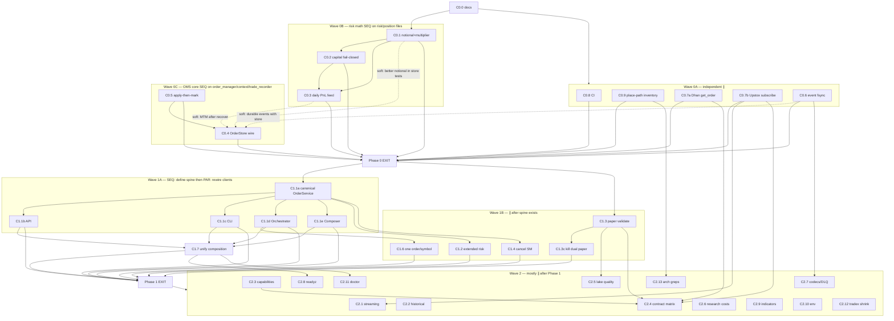

# Dependency Graph & Multi-Agent Parallelism

**Source of work items:** [`CODE_REALITY_AND_PLAN.md`](./CODE_REALITY_AND_PLAN.md)  
**Date:** 2026-07-10  
**Purpose:** What must run **sequentially**, what a **multi-agent team** can run **in parallel**, and how to avoid merge conflicts on the same files.

---

## 1. Legend

| Symbol | Meaning |
|--------|---------|
| **→** | Hard dependency (B cannot start until A is done *and green*) |
| **⇢** | Soft dependency (B easier after A; can start with stubs/mocks) |
| **∥** | Parallelizable (disjoint files + contracts) |
| **SEQ** | Must be one agent / one line of commits |
| **PAR** | Multi-agent safe if ownership respected |
| **a/b** | Red test commit then green implement (same agent preferred) |

### Conflict rule (multi-agent)

Agents may run in parallel **only if** their **owned file sets do not intersect**.  
Shared hubs (`order_manager.py`, `context.py`, `risk_manager.py`, `trade_recorder.py`) are **serialization points** — one agent at a time.

---

## 2. Work-item nodes

### Phase 0 — OMS honesty

| ID | Work | Primary files (ownership) | Defects |
|----|------|---------------------------|---------|
| **C0.0** | Plan docs on branch | `docs/architecture/*` | — |
| **C0.1** | Notional + F&O multiplier PnL | `src/domain/entities/position.py`, `src/domain/risk/*` or helper, `application/oms/_internal/risk_manager.py`, new tests | R3, R5 |
| **C0.2** | Fail-closed capital (no phantom live) | `application/oms/context.py`, `application/oms/factory.py`, `application/oms/capital_provider.py`, composition callers, tests | R4 |
| **C0.3** | Wire daily PnL / MTM → RiskEngine | `position_manager.py` or portfolio hook, `context.py` subscribe, `risk_manager.py` (call only), tests | R2 |
| **C0.4** | Wire OrderStore upsert + hydrate | `order_manager.py`, `context.py`, `sqlite_order_store.py` (if API), cold-start tests | R1 |
| **C0.5** | Apply-then-mark trade ledger | `trade_recorder.py`, crash tests | R6 |
| **C0.6** | Capital event fsync | `event_bus.py`, `event_log.py` (BufferedEventLog) | R18 |
| **C0.7a** | Dhan `get_order` on gateway | `brokers/dhan/gateway.py`, tests | R9 |
| **C0.7b** | Upstox subscribe kwargs | `brokers/upstox/data_provider.py`, tests | R8 |
| **C0.8** | CI ghosts | `.github/workflows/ci.yml` | R20 |
| **C0.9** | Place-path allowlist baseline test | `tests/architecture/*` | R11–R15 |

### Phase 1 — Single money path

| ID | Work | Primary files |
|----|------|---------------|
| **C1.1a** | Canonical OrderService / PlaceOrderUseCase impl | `application/execution/*`, `application/oms/session_bridge.py` |
| **C1.1b** | API → canonical path | `api/routers/orders.py`, `api/v2/*` |
| **C1.1c** | CLI → canonical path | `cli/services/cli_broker_facade.py` |
| **C1.1d** | Orchestrator → canonical path | `application/trading/trading_orchestrator.py` |
| **C1.1e** | Composer align/delete bypass | `application/composer/execution.py` |
| **C1.2** | Extended orders full risk | `application/oms/extended_order_service.py` |
| **C1.3** | Paper validate vs toy | `brokers/paper/*` |
| **C1.3c** | Kill analytics dual paper book | `analytics/paper/*` |
| **C1.4** | Cancel/fill state machine | `order_manager.py`, validators |
| **C1.6** | One order/symbol/cycle | `trading_orchestrator.py` |
| **C1.7** | Unify composition root | `runtime/*`, `api/lifecycle.py`, `cli/services/oms_bootstrap.py`, `tradex/session.py`, factory |

### Phase 2 — Platform depth

| ID | Work | Primary files |
|----|------|---------------|
| **C2.1** | Streaming loud failures | `application/streaming/*` |
| **C2.2** | Historical fail taxonomy | `application/data/historical_coordinator.py` |
| **C2.3** | Capability validator truth | `brokers/common/*` |
| **C2.4** | Broker contract matrix | `brokers/*/tests` or `tests/contract` |
| **C2.5** | Lake quality gates | `datalake/quality/*` + paper/backtest callers |
| **C2.6** | Research costs forced | `analytics/replay/*`, `domain/trading_costs.py` |
| **C2.7** | Event codecs + DLQ redrive | `infrastructure/event_bus/*`, `event_log.py` |
| **C2.8** | Readyz = recon gate | `api` health, lifecycle |
| **C2.9** | Indicator SSOT | `src/domain/indicators/*`, `analytics/indicators/*` |
| **C2.10** | TRADEX_ENV unify | `config/*`, `runtime/production_config.py`, `api/auth.py` |
| **C2.11** | CLI doctor money-path | `cli/**/doctor*` |
| **C2.12** | tradex.runtime non-shim shrink | `tradex/runtime/*` (non-shim files) |
| **C2.13** | Architecture greps in CI | `tests/architecture`, workflows |

---

## 3. Hard dependency graph (DAG)



---

## 4. Critical path (sequential — longest chain)

Money-path correctness is the critical path. **Do not parallelize these against each other on the same files.**

```text
C0.0
  → C0.1 (notional + multiplier)          [domain + risk_manager]
  → C0.2 (capital fail-closed)            [context / capital]
  → C0.3 (daily PnL wire)                 [position → risk]
  → C0.5 (apply-then-mark)                [trade_recorder]  ※ can swap order with C0.4 if careful
  → C0.4 (OrderStore + cold-start)        [order_manager + context]
  → Phase 0 EXIT
  → C1.1a (canonical place service)       [execution + session_bridge]
  → C1.1b|c|d|e (rewire clients) ∥        [disjoint files]
  → C1.7 (unify composition)              [after clients]
  → Phase 1 EXIT
```

**Recommended SEQ order inside OMS hub (single agent “OMS Core”):**

1. C0.1 → C0.2 → C0.3  
2. C0.5 (ledger) then C0.4 (store) — ledger semantics must be right before trusting recovery tests that apply trades  
3. Integration cold-start test covering both  

**Why C0.5 before C0.4:** cold-start tests that replay trades will encode wrong mark/apply order if C0.5 is later, causing flaky or wrong goldens.

---

## 5. Parallel waves for multi-agent team

### Wave 0A — start immediately after C0.0 (4–5 agents ∥)

| Agent | Task | Owns (exclusive) | Blocks on |
|-------|------|------------------|-----------|
| **A-CI** | C0.8 | `.github/workflows/*` only | C0.0 |
| **A-ARCH** | C0.9 | `tests/architecture/*` only | C0.0 |
| **A-DHAN** | C0.7a | `brokers/dhan/gateway.py` + dhan unit test | C0.0 |
| **A-UPX** | C0.7b | `brokers/upstox/data_provider.py` + upstox unit test | C0.0 |
| **A-EVT** | C0.6 | `infrastructure/event_bus/event_bus.py`, `infrastructure/event_log.py` | C0.0 |

**Safe:** no shared files with OMS Core.

---

### Wave 0B — single agent (or strict SEQ) — OMS Risk

| Agent | Task | Owns |
|-------|------|------|
| **A-OMS-RISK** | C0.1 → C0.2 → C0.3 | `position.py`, `risk_manager.py`, `context.py` (capital + subscribe hooks), capital_provider, related tests |

**Not parallelizable among themselves** — all touch `risk_manager` / `context` / position PnL.

---

### Wave 0C — single agent — OMS Recovery

| Agent | Task | Owns |
|-------|------|------|
| **A-OMS-REC** | C0.5 → C0.4 | `trade_recorder.py`, `order_manager.py`, `context.py` hydrate, store tests |

**Conflict:** `context.py` also used by A-OMS-RISK.  
**Rule:** finish Wave 0B before Wave 0C **or** merge `context.py` changes only through one agent with ordered commits.

**Practical multi-agent schedule:**

```text
Time ──────────────────────────────────────────────►
A-CI, A-ARCH, A-DHAN, A-UPX, A-EVT     ████████  (Wave 0A)
A-OMS-RISK                             ██████████████  (0.1→0.2→0.3)
A-OMS-REC                                        ████████  (0.5→0.4 after risk done
                                                            OR after risk releases context.py)
```

---

### Wave 1A — SEQ then PAR

| Step | Agent | Task | Notes |
|------|-------|------|-------|
| 1 | **A-SPINE** | C1.1a | Builds canonical `OrderService` / use case; **blocks all 1.1x** |
| 2 ∥ | **A-API** | C1.1b | Only `api/` |
| 2 ∥ | **A-CLI** | C1.1c | Only `cli/services/` |
| 2 ∥ | **A-ORCH** | C1.1d + C1.6 | `application/trading/` only (C1.6 after or with 1.1d) |
| 2 ∥ | **A-COMP** | C1.1e | `application/composer/` only |

---

### Wave 1B — parallel after C1.1a (and Phase 0)

| Agent | Task | Owns | Depends |
|-------|------|------|---------|
| **A-EXT** | C1.2 | `extended_order_service.py` | C1.1a + C0.1–0.3 (risk must work) |
| **A-PAPER** | C1.3 | `brokers/paper/*` | Phase 0 exit preferred |
| **A-APAPER** | C1.3c | `analytics/paper/*` | After C1.3 profile exists ⇢ |
| **A-SM** | C1.4 | `order_manager` cancel/fill SM | **Conflicts OMS** — after Wave 0C; preferably after C1.1a |

**C1.4 caution:** touches `order_manager.py` again → **SEQ with A-OMS-REC**, not parallel with other OMS editors.

---

### Wave 1C — composition (SEQ, late Phase 1)

| Agent | Task | Depends |
|-------|------|---------|
| **A-BOOT** | C1.7 unify composition | All C1.1b–e landed |

---

### Wave 2 — high parallelism (after Phase 1 EXIT)

| Agent | Task | Owns | Soft deps |
|-------|------|------|-----------|
| **A-MD** | C2.1 streaming | `application/streaming/` | C0.7b done |
| **A-HIST** | C2.2 historical | `application/data/` | — |
| **A-CAP** | C2.3 capabilities | `brokers/common/` | — |
| **A-CT** | C2.4 contract matrix | `tests/contract/`, fakes | C0.7a/b, C1.3, C2.3 ⇢ |
| **A-LAKE** | C2.5 quality gates | `datalake/quality/` | C1.3 for paper_validate |
| **A-RES** | C2.6 research costs | `analytics/replay/` | — |
| **A-EVT2** | C2.7 codecs/DLQ | `infrastructure/event_bus/`, event_log | C0.6 |
| **A-HLTH** | C2.8 readyz | `api` health | C1.7 |
| **A-IND** | C2.9 indicators | domain + analytics indicators | — |
| **A-CFG** | C2.10 env unify | config, production_config, auth env | — |
| **A-DOC** | C2.11 doctor | cli doctor | C1.7, C0.4 |
| **A-TX** | C2.12 tradex shrink | tradex/runtime non-shims | careful with session |
| **A-GATE** | C2.13 arch greps | tests + CI | C0.9, C1.1 complete |

**Typical parallel team size Phase 2:** 6–10 agents if file ownership is strict.

---

## 6. Parallelism summary matrix

| Work | Parallel? | Why |
|------|-----------|-----|
| C0.7a ∥ C0.7b ∥ C0.6 ∥ C0.8 ∥ C0.9 | **YES** | Disjoint packages |
| C0.1 → C0.2 → C0.3 | **NO (SEQ)** | Shared risk/context/position |
| C0.5 → C0.4 | **NO (SEQ)** | Shared OMS recovery semantics; prefer ledger then store |
| C0.3 ∥ C0.5 | **Risky** | Both may touch context/event wiring — prefer SEQ or split files first |
| C0.4 ∥ C0.7* | **YES** | OMS vs brokers |
| C1.1a | **SEQ gate** | Defines API all clients need |
| C1.1b ∥ c ∥ d ∥ e | **YES** after 1.1a | Disjoint presentation/app clients |
| C1.2 ∥ C1.3 ∥ C1.6 | **YES** after 1.1a | Different files |
| C1.4 vs C1.1a | **SEQ** | Both OMS/execution spine |
| C1.7 | **SEQ late** | Integrates all entrypoints |
| Phase 2 items | **Mostly YES** | Package boundaries |
| C2.4 after C2.3 | **Soft SEQ** | Validator then matrix |
| C2.12 vs C1.7 | **Soft SEQ** | Both touch bootstrap/session |

---

## 7. Multi-agent team roster (recommended)

### Phase 0 team (max ~6 concurrent)

| Role | Agent ID | Responsibility |
|------|----------|----------------|
| Coordinator | human / lead | Merge order, Phase EXIT gate |
| OMS Risk | A-OMS-RISK | C0.1–0.3 only |
| OMS Recovery | A-OMS-REC | C0.5–0.4 only (after risk) |
| Broker Dhan | A-DHAN | C0.7a |
| Broker Upstox | A-UPX | C0.7b |
| Infra Events | A-EVT | C0.6 |
| Platform CI/Arch | A-CI+ARCH | C0.8 + C0.9 (can be one agent) |

### Phase 1 team (max ~5 concurrent after spine)

| Role | Agent ID | Responsibility |
|------|----------|----------------|
| Spine | A-SPINE | C1.1a only first |
| API | A-API | C1.1b |
| CLI | A-CLI | C1.1c |
| Strategy/Orch | A-ORCH | C1.1d, C1.6 |
| Composer | A-COMP | C1.1e |
| Risk ext / SM | A-OMS2 | C1.2, C1.4 (SEQ between them) |
| Paper | A-PAPER | C1.3, C1.3c |
| Boot | A-BOOT | C1.7 last |

### Phase 2 team (max ~8–10)

Package-specialist agents as in Wave 2 table; **no one else edits their tree**.

---

## 8. File ownership lock map (avoid thrash)

| Hot file | Allowed agents / waves only |
|----------|----------------------------|
| `order_manager.py` | A-OMS-REC (C0.4), A-OMS2 (C1.4) — never parallel |
| `trade_recorder.py` | A-OMS-REC (C0.5) only |
| `context.py` | A-OMS-RISK then A-OMS-REC then A-BOOT — never parallel |
| `risk_manager.py` | A-OMS-RISK (C0.1–0.3), A-EXT (C1.2 call only) |
| `position.py` | A-OMS-RISK (C0.1) |
| `event_bus.py` / `event_log.py` | A-EVT (C0.6), A-EVT2 (C2.7) — sequential phases |
| `brokers/dhan/gateway.py` | A-DHAN |
| `brokers/upstox/data_provider.py` | A-UPX |
| `cli_broker_facade.py` | A-CLI |
| `api/routers/orders.py` | A-API |
| `trading_orchestrator.py` | A-ORCH |
| `extended_order_service.py` | A-EXT |
| `paper_gateway.py` | A-PAPER |
| `.github/workflows/ci.yml` | A-CI only |

---

## 9. Integration gates (no parallel bypass)

| Gate | Required before |
|------|-----------------|
| **G0** C0.0 landed | Any code agent |
| **G0-EXIT** all P0 green + cold-start | Any C1.1* except inventory |
| **G1-SPINE** C1.1a green | C1.1b–e |
| **G1-EXIT** all place paths on spine + composition | Phase 2 money-adjacent (doctor, readyz) |
| **G2** contract matrix | Claiming broker parity |

Agents must not mark “done” without their gate’s tests passing on the integrated branch.

---

## 10. Suggested calendar (illustrative)

Assuming 1 agent-day ≈ 1 solid commit pair:

| Day | Parallel work | Sequential work |
|-----|---------------|-----------------|
| 1 | C0.0; start 0A (CI, arch, dhan, upstox, events) | Start C0.1 |
| 2 | Finish 0A | C0.2, C0.3 |
| 3 | — | C0.5, C0.4 + cold-start |
| 4 | Fix any 0A failures | Phase 0 EXIT suite |
| 5 | — | C1.1a spine |
| 6 | C1.1b∥c∥d∥e | — |
| 7 | C1.2∥C1.3∥C1.6 | C1.4 if free |
| 8 | C1.3c | C1.7 composition |
| 9+ | Phase 2 swarm | Gates only |

---

## 11. One-page answer

### Must be sequential
1. **Risk stack:** C0.1 → C0.2 → C0.3  
2. **Recovery stack:** C0.5 → C0.4 (ledger then store)  
3. **Phase 0 complete → Phase 1 spine**  
4. **C1.1a → then client rewires**  
5. **Client rewires → C1.7 composition**  
6. **OMS hub file edits** never two agents at once  

### Can run in parallel (multi-agent)
1. **Wave 0A:** CI ∥ place-path inventory ∥ Dhan get_order ∥ Upstox subscribe ∥ event fsync  
2. **Wave 0A ∥ Wave 0B:** brokers/CI/events while OMS risk works (disjoint files)  
3. **After C1.1a:** API ∥ CLI ∥ Orchestrator ∥ Composer  
4. **Phase 1 side quests:** extended risk ∥ paper ∥ (cancel SM if OMS free)  
5. **Phase 2:** nearly all package specialists in parallel  

### Soft-only (parallel with mocks, integrate later)
- Contract matrix drafts before all brokers fixed  
- Doctor/readyz UI checks before composition unify (but EXIT after C1.7)  
- Indicator SSOT anytime after Phase 0 (no money dependency)

---

## 12. Machine-readable edge list

```text
# hard edges: from -> to (to depends on from)
C0.0 -> C0.1
C0.0 -> C0.6
C0.0 -> C0.7a
C0.0 -> C0.7b
C0.0 -> C0.8
C0.0 -> C0.9
C0.1 -> C0.2
C0.1 -> C0.3
C0.2 -> C0.3
C0.5 -> C0.4
C0.1 -> C0.4   # soft preferred, treat hard for EXIT quality
C0.3 -> C0.4   # soft preferred
C0.4 -> P0_EXIT
C0.5 -> P0_EXIT
C0.1 -> P0_EXIT
C0.2 -> P0_EXIT
C0.3 -> P0_EXIT
C0.6 -> P0_EXIT
C0.7a -> P0_EXIT
C0.7b -> P0_EXIT
C0.8 -> P0_EXIT
C0.9 -> P0_EXIT
P0_EXIT -> C1.1a
C1.1a -> C1.1b
C1.1a -> C1.1c
C1.1a -> C1.1d
C1.1a -> C1.1e
C1.1a -> C1.2
C1.1a -> C1.4
C1.1d -> C1.6
P0_EXIT -> C1.3
C1.3 -> C1.3c
C1.1b -> C1.7
C1.1c -> C1.7
C1.1d -> C1.7
C1.1e -> C1.7
C1.2 -> P1_EXIT
C1.3c -> P1_EXIT
C1.4 -> P1_EXIT
C1.6 -> P1_EXIT
C1.7 -> P1_EXIT
C1.1b -> P1_EXIT
C1.1c -> P1_EXIT
C1.1d -> P1_EXIT
C1.1e -> P1_EXIT
P1_EXIT -> C2.1
P1_EXIT -> C2.2
P1_EXIT -> C2.3
P1_EXIT -> C2.5
P1_EXIT -> C2.6
P1_EXIT -> C2.7
P1_EXIT -> C2.8
P1_EXIT -> C2.9
P1_EXIT -> C2.10
P1_EXIT -> C2.11
P1_EXIT -> C2.12
P1_EXIT -> C2.13
C0.7b -> C2.1
C2.3 -> C2.4
C0.7a -> C2.4
C0.7b -> C2.4
C1.3 -> C2.4
C1.3 -> C2.5
C0.6 -> C2.7
C1.7 -> C2.8
C1.7 -> C2.11
C0.9 -> C2.13
```

---

*Use this file to schedule agents. Implementation order of truth remains [`CODE_REALITY_AND_PLAN.md`](./CODE_REALITY_AND_PLAN.md).*
