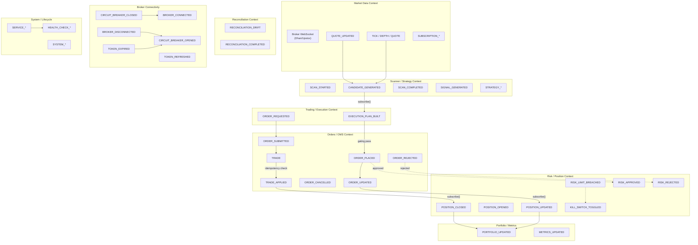

# D1.6 — Event Catalog

> Canonical reference for every event type in the Trade_XV2 event bus.
> Source of truth: `src/domain/events/types.py` (1008 LOC).
> Last updated: 2026-07-12

---

## Table of Contents

1. [Event Bus Architecture](#1-event-bus-architecture)
2. [Event Catalog by Bounded Context](#2-event-catalog-by-bounded-context)
3. [Capital Events](#3-capital-events)
4. [Idempotency Strategy](#4-idempotency-strategy)
5. [Dead Letter Queue Behavior](#5-dead-letter-queue-behavior)
6. [Replay Mode](#6-replay-mode)
7. [Event Versioning Strategy](#7-event-versioning-strategy)
8. [Event Flow Diagram](#8-event-flow-diagram)

---

## 1. Event Bus Architecture

The event bus follows a **sync core + async wrapper** pattern:

### Sync Core: `infrastructure.event_bus.event_bus.EventBus`

- **Thread-safe**, in-memory pub/sub using `threading.Lock`
- Synchronous handler dispatch (one event, all subscribers, in order)
- `itertools.count(1)` for lock-free sequence numbering (CPython GIL atomic)
- Optional `EventLog` persistence before dispatch (crash recovery)
- Optional `DeadLetterQueue` for handler failures
- Optional `EventMetrics` for observability
- Optional `AlertingEngine` for threshold-based alerts (background thread)

### Domain Port: `domain.events.bus.DomainEventBus`

- Abstract ABC that domain code depends on (not infrastructure)
- Three methods: `publish`, `subscribe`, `unsubscribe`
- Infrastructure implements this port

### Async Wrapper: `infrastructure.event_bus.async_event_bus`

- Wraps the sync bus for async/await contexts
- Delegates to the sync bus for actual dispatch

### Domain Adapter: `infrastructure.event_bus.domain_bus_adapter`

- Bridges `DomainEventBus` port to the concrete `EventBus`
- Enables domain code to publish/subscribe without importing infrastructure

---

## 2. Event Catalog by Bounded Context

### 2.1 Market Data Context

| Event Name | Payload Fields | Version | Capital? | Notes |
|---|---|---|---|---|
| **TICK** | `ltp*`, `open*`, `high*`, `low*`, `close*`, `volume*` | v1 | No | Latest quote snapshot; subscribers MUST tolerate partial ticks during warmup |
| **DEPTH** | `bids` (req), `asks` (req), `ltp*`, `timestamp*` | v1 | No | Order-book snapshot; bids/asks are `[price, qty, orders]` triples |
| **QUOTE** | `symbol` (req), `exchange` (req), `ltp` (req), `bid*`, `ask*`, `volume*`, `open*`, `high*`, `low*`, `close*` | v1 | No | Real-time quote for one instrument |
| **DEPTH_20** | *(same as DEPTH)* | v1 | No | Dhan 20-level depth extension |
| **DEPTH_200** | *(same as DEPTH)* | v1 | No | Dhan 200-level depth extension |
| **INDEX_QUOTE** | `index` (req), `ltp*`, `change*`, `change_pct*` | v1 | No | Index quote snapshot |
| **OPTION_CHAIN** | `underlying` (req), `expiry` (req), `calls*`, `puts*`, `timestamp*` | v1 | No | Option chain snapshot |
| **QUOTE_UPDATED** | `symbol` (req), `exchange` (req), `ltp` (req), `bid*`, `ask*`, `volume*` | v1 | No | Published when instrument quote is refreshed |
| **DEPTH_UPDATED** | `symbol` (req), `exchange` (req), `bids*`, `asks*` | v1 | No | Published when market depth is fetched |
| **SUBSCRIPTION_STARTED** | `symbol` (req), `exchange` (req), `depth*` | v1 | No | Published when live subscription begins |
| **SUBSCRIPTION_ENDED** | `symbol` (req), `exchange` (req) | v1 | No | Published when live subscription ends |

**Producing context:** `application/composer/`, `brokers/*/data_provider.py`, `brokers/*/websocket/`
**Consuming context:** `analytics/scanner/`, `analytics/strategy/`, `application/streaming/`, UI dashboards

---

### 2.2 Orders / OMS Context

| Event Name | Payload Fields | Version | Capital? | Notes |
|---|---|---|---|---|
| **ORDER_PLACED** | `order` (req) | v1 | ✅ Yes | Published after successful `place_order()` |
| **ORDER_SUBMITTED** | `order` (req) | v1 | ✅ Yes | Published when order submitted to broker |
| **ORDER_UPDATED** | `order` (req) | v1 | ✅ Yes | Published on every order status transition |
| **ORDER_CANCELLED** | `order_id` (req), `order*` | v1 | ✅ Yes | Published when order is cancelled |
| **ORDER_REJECTED** | `order_id` (req), `reason` (req), `error_code*` | v1 | ✅ Yes | Published when order is rejected |
| **TRADE** | `trade` (req) | v1 | ✅ Yes | Published when a fill is received (external consumers subscribe here) |
| **TRADE_FILLED** | `trade` (req) | v1 | ✅ Yes | Typed event for trade fill |
| **TRADE_APPLIED** | `trade` (req) | v1 | ✅ Yes | OMS-private downstream of TRADE — published only after idempotency check passes. PositionManager subscribes here to avoid double-counting |

**Producing context:** `application/oms/`, `application/oms/_internal/`
**Consuming context:**
- `ORDER_UPDATED` → `OrderManager.on_order_update`
- `TRADE` → `OrderManager.on_trade`
- `TRADE_APPLIED` → `PositionManager.on_trade_applied`

**Typed event wrappers** (dataclasses wrapping `DomainEvent`):
- `OrderUpdatedEvent` — `order: Order`
- `TradeFilledEvent` — `trade: Trade`
- `TradeAppliedEvent` — `trade: Trade`
- `OrderRequestedEvent` — `symbol: str`, `request: dict`
- `OrderFilledEvent` — `order_id: str`, `filled_price: Decimal`, `filled_qty: int`

---

### 2.3 Execution Planning Context

| Event Name | Payload Fields | Version | Capital? | Notes |
|---|---|---|---|---|
| **EXECUTION_PLAN_BUILT** | `symbol` (req), `strategy` (req), `signal_type` (req), `legs_count` (req), `confidence*`, `total_qty*`, `sizing_method*`, `slicing_algo*` | v1 | No | Published after signal → ExecutionPlan aggregate (post-gating) |
| **ORDER_REQUESTED** | `symbol` (req), `request` (req), `order_id*`, `slicing_*` | v1 | ✅ Yes | Published when concrete order request is issued for a plan leg |

**Producing context:** `application/trading/trading_orchestrator.py`
**Consuming context:** OMS, logging, metrics

---

### 2.4 Risk / Position Context

| Event Name | Payload Fields | Version | Capital? | Notes |
|---|---|---|---|---|
| **RISK_LIMIT_BREACHED** | `rule` (req), `value` (req), `limit` (req), `symbol*` | v1 | No | Published by RiskManager when continuous daily-loss MTM crosses threshold |
| **RISK_APPROVED** | `order_id` (req) | v1 | No | Published when risk check passes (P1-Phase 1) |
| **RISK_REJECTED** | `order_id` (req), `rule` (req), `value` (req), `limit` (req) | v1 | No | Published when risk check fails (P1-Phase 1) |
| **POSITION_UPDATED** | `symbol` (req), `quantity` (req), `avg_price*` | v1 | No | Legacy — still published by existing callers |
| **POSITION_OPENED** | `symbol` (req), `quantity` (req), `avg_price` (req) | v1 | No | Published when a position is opened |
| **POSITION_CLOSED** | `symbol` (req), `realized_pnl` (req) | v1 | No | Published when a position is closed |
| **KILL_SWITCH_TOGGLED** | `active` (req), `actor*`, `reason*` | v1 | No | Published when kill switch state changes |
| **DAILY_PNL_RESET** | `reset_at*` | v1 | No | Published at daily PNL reset |
| **DRAWDOWN_LIMIT_HIT** | `drawdown` (req), `limit` (req) | v1 | No | Published when drawdown limit is breached |

**Producing context:** `application/oms/_internal/risk_manager.py`, `application/oms/_internal/position_manager.py`
**Consuming context:**
- `POSITION_UPDATED` → `_feed_daily_pnl`
- `POSITION_CLOSED` → `_feed_daily_pnl`

---

### 2.5 Scanner / Strategy Context

| Event Name | Payload Fields | Version | Capital? | Notes |
|---|---|---|---|---|
| **SCAN_STARTED** | `profile` (req), `universe*` | v1 | No | Published when scan begins |
| **CANDIDATE_GENERATED** | `symbol` (req), `score` (req), `reason*` | v1 | No | Published per candidate; **TradingOrchestrator subscribes** |
| **SCAN_COMPLETED** | `candidate_count` (req), `duration*`, `universe*` | v1 | No | Published when scan finishes |
| **SIGNAL_GENERATED** | `signal` (req) | v1 | No | Legacy — published by analytics |
| **SIGNAL_EXECUTED** | `signal` (req), `order_id` (req) | v1 | No | Published when signal is executed |
| **SCANNER_STATE_CHANGED** | `scanner_name` (req), `state` (req), `reason*` | v1 | No | Published when scanner state changes (P1-Phase 1) |
| **STRATEGY_ACTIVATED** | `strategy_name` (req), `activated_by*` | v1 | No | Published when strategy is activated (P1-Phase 1) |
| **STRATEGY_PAUSED** | `strategy_name` (req), `reason*` | v1 | No | Published when strategy is paused (P1-Phase 1) |
| **STRATEGY_DISABLED** | `strategy_name` (req), `reason` (req) | v1 | No | Published when strategy is disabled (P1-Phase 1) |

**Producing context:** `analytics/scanner/`, `analytics/strategy/`, `application/strategy_engine/`
**Consuming context:**
- `CANDIDATE_GENERATED` → `TradingOrchestrator.on_candidate`

---

### 2.6 Reconciliation Context

| Event Name | Payload Fields | Version | Capital? | Notes |
|---|---|---|---|---|
| **RECONCILIATION_DRIFT** | `symbol` (req), `internal` (req), `broker` (req), `side*`, `quantity_diff*` | v1 | No | Published when drift is detected |
| **RECONCILIATION_COMPLETED** | `checked_at*`, `symbols*`, `drift_count*` | v1 | No | Published when reconciliation cycle completes |

**Producing context:** `application/oms/reconciliation/`, `brokers/*/reconciliation/`
**Consuming context:** Logging, metrics, alerting

---

### 2.7 Broker Connectivity Context

| Event Name | Payload Fields | Version | Capital? | Notes |
|---|---|---|---|---|
| **BROKER_CONNECTED** | `broker_name` (req), `environment*` | v1 | No | Published on successful broker connection |
| **BROKER_DISCONNECTED** | `broker_name` (req), `reason` (req) | v1 | No | Published on broker disconnection |
| **TOKEN_REFRESHED** | `broker_name` (req), `expires_at*` | v1 | No | Published after token refresh |
| **TOKEN_EXPIRED** | `broker_name` (req) | v1 | No | Published when token expires |
| **CIRCUIT_BREAKER_OPENED** | `reason` (req), `duration*` | v1 | No | Published when circuit breaker trips |
| **CIRCUIT_BREAKER_CLOSED** | `down_time*` | v1 | No | Published when circuit breaker resets |

**Producing context:** `brokers/*/streaming/`, `brokers/*/auth/`, `infrastructure/resilience/`
**Consuming context:** Alerting, logging, UI status indicators

---

### 2.8 Lifecycle / System Context

| Event Name | Payload Fields | Version | Capital? | Notes |
|---|---|---|---|---|
| **SERVICE_STARTED** | `service_name` (req), `detail*` | v1 | No | Published when a service starts |
| **SERVICE_STOPPED** | `service_name` (req), `detail*` | v1 | No | Published when a service stops |
| **SERVICE_FAILED** | `service_name` (req), `error` (req), `traceback*` | v1 | No | Published when a service fails |
| **SYSTEM_STARTED** | `service_name` (req), `version*` | v1 | No | Published at system boot (P1-Phase 1) |
| **SYSTEM_SHUTDOWN** | `service_name` (req), `reason*` | v1 | No | Published at system shutdown (P1-Phase 1) |
| **HEALTH_CHECK_PASSED** | `component*` | v1 | No | Published on successful health check (P1-Phase 1) |
| **HEALTH_CHECK_FAILED** | `component` (req), `error` (req) | v1 | No | Published on failed health check (P1-Phase 1) |

**Producing context:** `infrastructure/lifecycle/`, `application/oms/context.py`
**Consuming context:** UI dashboard, alerting, monitoring

---

### 2.9 Portfolio & Metrics Context

| Event Name | Payload Fields | Version | Capital? | Notes |
|---|---|---|---|---|
| **PORTFOLIO_UPDATED** | `total_pnl` (req), `capital` (req), `positions_count` (req), `drawdown*`, `sharpe*` | v1 | No | Published when portfolio state changes (P1-Phase 1) |
| **METRICS_UPDATED** | `metric_name` (req), `value` (req), `symbol*`, `strategy*` | v1 | No | Published when a metric value changes (P1-Phase 1) |

**Producing context:** `application/portfolio/`, `application/oms/_internal/`
**Consuming context:** UI dashboard, analytics

---

### 2.10 Bar / Analytics Context

| Event Name | Payload Fields | Version | Capital? | Notes |
|---|---|---|---|---|
| **BAR_CLOSED** | *(no EventPayload defined)* | — | No | Legacy — published by candle/aggregation services |

**Producing context:** `analytics/`, `domain/candles/`
**Consuming context:** `analytics/strategy/`, indicator calculations

---

## 3. Capital Events

Capital events trigger **synchronous fsync** on `BufferedEventLog` to ensure crash-safe persistence. They are identified by `EventBus._is_capital_event()`:

```
TRADE, TRADE_APPLIED, TRADE_FILLED,
ORDER_PLACED, ORDER_UPDATED, ORDER_CANCELLED,
ORDER_REJECTED, ORDER_SUBMITTED, ORDER_REQUESTED
```

Plus any event type starting with:
- `ORDER_*`
- `TRADE_*`
- `POSITION_*`

**Rationale:** These events affect money. A crash between publishing and persistence must not lose fills or order state. Capital events use `sync_mode=True` on `BufferedEventLog.append()`, which forces an `fsync()` to disk.

---

## 4. Idempotency Strategy

The bus implements **at-least-once delivery** with duplicate suppression:

### Two-tier dedup

1. **Primary: `IdempotencyService` (injected)**
   - TTL-based (default 86,400 seconds = 24 hours)
   - Backend-fallback capable (Redis, database, etc.)
   - Single authority — no double-write to two stores
   - `contains(event_id)` → skip if True
   - `put(event_id, event_id, ttl)` → record after check

2. **Fallback: In-memory bounded set**
   - `deque(maxlen=10_000)` + `set[str]` for O(1) lookup
   - Per-bus-lifetime only (no persistence)
   - Used when no `IdempotencyService` is injected

### Dedup key

`event.event_id` — UUID4 hex, 16 characters, assigned at `DomainEvent` construction.

### Behavior

- Duplicate detected → event is **silently skipped**
- Metric `duplicate_skipped` is incremented
- Debug log emitted with event_id, type, and symbol

---

## 5. Dead Letter Queue Behavior

When a handler fails during dispatch:

1. **Metrics:** `handler_error:{ErrorType}` and `dead_letter` counters incremented
2. **Logging:** `WARNING` level with handler_id, event_type, event_id, symbol
3. **DLQ push:** `DeadLetterQueue.push_failure(event, handler_id, exc, traceback)`
4. **No re-raise** (unless `fail_fast=True`, used in tests only)

When no DLQ is attached:
- `ERROR` level log: "no DeadLetterQueue is attached — failure visible only in logs"
- This is a **configuration error** in production

When event log persistence fails:
- Same DLQ path, but with `handler_id="<event_log>"`
- Failure is surfaced, never swallowed

---

## 6. Replay Mode

`EventBus.set_replay_mode(enabled: bool)` controls deterministic replay:

| Aspect | Normal Mode | Replay Mode |
|---|---|---|
| Event persistence | ✅ Enabled | ❌ Disabled (no recursive writes) |
| Handler dispatch | ✅ Enabled | ❌ Disabled (prevents TRADE_APPLIED re-publish / double-counting) |
| Sequence numbers | Auto-assigned (`itertools.count`) | **Preserved** from original events |
| Timestamps | `DomainEvent.now()` (current wall clock) | **Preserved** from original events |
| Correlation IDs | Injected from thread-local if missing | **Preserved** from original events |

**Usage:** `TradingContext._replay_log_into_oms()` sets replay mode before re-feeding persisted events into the OMS, then restores normal mode.

**Recovery sequence:**
1. `bus.set_replay_mode(True)`
2. `bus.set_logging_enabled(False)` — suppress recursive persistence
3. Replay events from `EventLog`
4. `bus.set_logging_enabled(True)`
5. `bus.set_replay_mode(False)`

---

## 7. Event Versioning Strategy

### Current State

- All events are `version: 1` in `EventPayload`
- No version negotiation between producers and consumers
- `EventType` is a `str`-backed enum — adding new types is append-only (wire-format stable)
- `EventPayload.required_keys` / `optional_keys` document the schema contract

### Proposed Evolution

| Phase | Change | Migration |
|---|---|---|
| **Phase 1 (now)** | Document schemas in `EventPayload`; version field exists but unused | None needed |
| **Phase 2** | Add `schema_version` to `DomainEvent` header; consumers check before processing | Backward-compatible — v1 events pass through |
| **Phase 3** | Introduce envelope `{version, event_type, payload}` for wire transport | New consumers handle both formats; old consumers get unwrapped payload |
| **Phase 4** | Schema registry (JSON Schema / Avro); compile-time validation | Major version bump; deprecated fields produce warnings |

### Key Principles

1. **Append-only enum:** New `EventType` members are always appended, never inserted
2. **Optional keys grow forward:** Consumers MUST tolerate missing optional keys
3. **Required keys are permanent:** Once a key becomes required, it cannot be removed without a major version
4. **Typed event classes:** `TypedDomainEvent` subclasses provide compile-time safety for critical OMS events

---

## 8. Event Flow Diagram



### Key Subscription Links

| Subscriber | Subscribes To | Method |
|---|---|---|
| `OrderManager` | `ORDER_UPDATED` | `on_order_update` |
| `OrderManager` | `TRADE` | `on_trade` |
| `PositionManager` | `TRADE_APPLIED` | `on_trade_applied` |
| `TradingContext._feed_daily_pnl` | `POSITION_UPDATED`, `POSITION_CLOSED` | `_feed_daily_pnl` |
| `TradingOrchestrator` | `CANDIDATE_GENERATED` | `on_candidate` |
| `DomainBusAdapter` | *(forwards all)* | delegates to `EventBus` |

---

## Appendix A: Event Type Enum Members (48 total)

```
# Market Data (7)
TICK, DEPTH, QUOTE, DEPTH_20, DEPTH_200, INDEX_QUOTE, OPTION_CHAIN

# Orders / OMS (7)
ORDER_PLACED, ORDER_SUBMITTED, ORDER_UPDATED, ORDER_CANCELLED,
ORDER_REJECTED, TRADE, TRADE_FILLED, TRADE_APPLIED

# Risk / Position (7)
RISK_LIMIT_BREACHED, POSITION_UPDATED, POSITION_OPENED, POSITION_CLOSED,
KILL_SWITCH_TOGGLED, DAILY_PNL_RESET, DRAWDOWN_LIMIT_HIT

# Risk Decisions (2)
RISK_APPROVED, RISK_REJECTED

# Reconciliation (2)
RECONCILIATION_DRIFT, RECONCILIATION_COMPLETED

# Lifecycle / System (7)
SERVICE_STARTED, SERVICE_STOPPED, SERVICE_FAILED,
SYSTEM_STARTED, SYSTEM_SHUTDOWN, HEALTH_CHECK_PASSED, HEALTH_CHECK_FAILED

# Broker Connectivity (6)
BROKER_CONNECTED, BROKER_DISCONNECTED, TOKEN_REFRESHED,
TOKEN_EXPIRED, CIRCUIT_BREAKER_OPENED, CIRCUIT_BREAKER_CLOSED

# Scanner (3)
SCAN_STARTED, CANDIDATE_GENERATED, SCAN_COMPLETED

# Strategy (4)
SIGNAL_GENERATED, SIGNAL_EXECUTED, STRATEGY_ACTIVATED,
STRATEGY_PAUSED, STRATEGY_DISABLED

# Markets Layer (4)
QUOTE_UPDATED, DEPTH_UPDATED, SUBSCRIPTION_STARTED, SUBSCRIPTION_ENDED

# Portfolio / Metrics (2)
PORTFOLIO_UPDATED, METRICS_UPDATED

# Execution Planning (2)
EXECUTION_PLAN_BUILT, ORDER_REQUESTED

# Scanner Lifecycle (1)
SCANNER_STATE_CHANGED

# Legacy (1)
BAR_CLOSED
```
