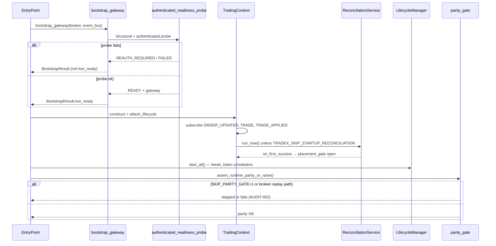
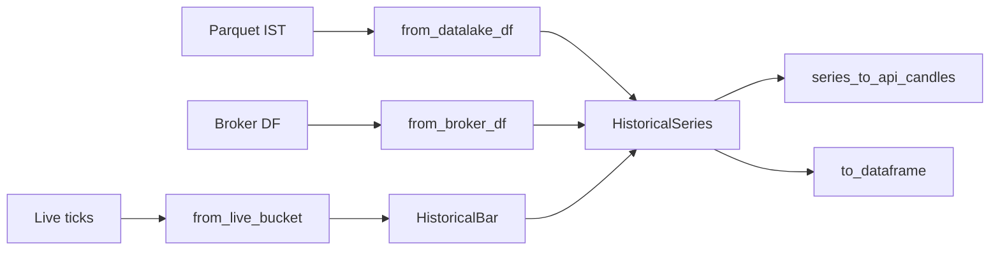
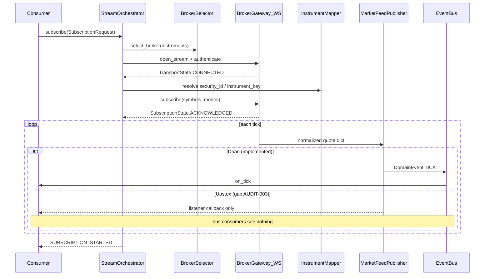
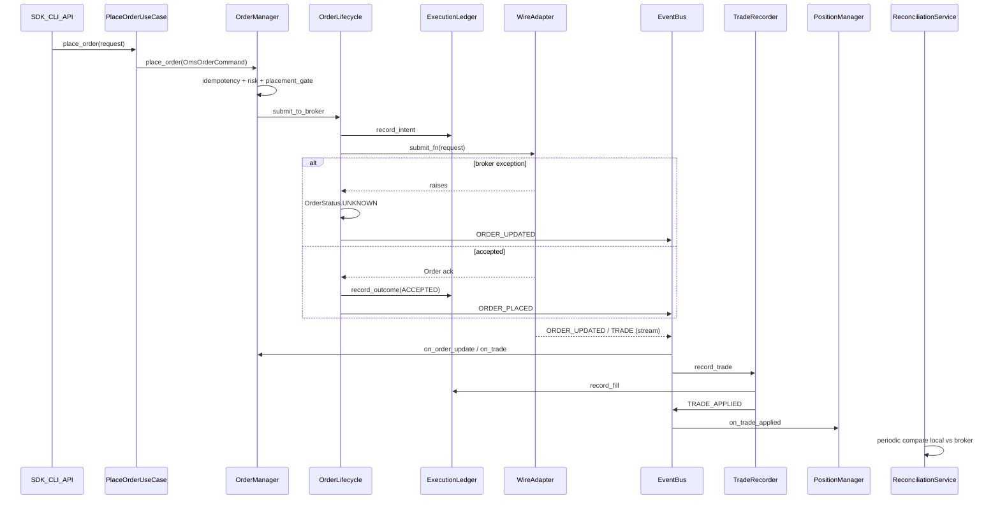
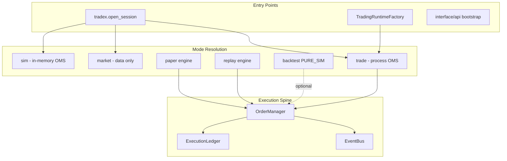

# Runtime Flows

**Version:** 1.0 (TRANS-P2-001 … TRANS-P2-013)  
**Status:** Phase 2 — End-to-End Flow Documentation  
**Evidence:** `verified_by_static_analysis` per [architecture audit §2](../reviews/2026-07-11-trading-os-architecture-audit/02-runtime-flows.md)  
**Owner:** Domain & Contracts / Chief Architect

---

## Purpose

This document is the **authoritative flow specification** for Trade_XV2 runtime behavior. Each section maps to a TRANS-P2 backlog item and cites real implementation paths. Use with [STATE_MACHINES.md](./STATE_MACHINES.md), [ERROR_TAXONOMY.md](./ERROR_TAXONOMY.md), [EVENT_CATALOG.md](./EVENT_CATALOG.md), and [OBJECT_MODEL.md](./OBJECT_MODEL.md).

**Failure semantics legend:**

| Tag | Meaning |
|-----|---------|
| **LOUD** | Operator-visible error, metric, event, or raised exception |
| **SILENT** | Failure absorbed without surfacing to consumers (technical debt) |
| **BLOCKED** | Operation refused; system fail-closed |
| **DEGRADED** | Partial function continues with explicit degraded state |

---

## §1 — Startup and readiness

**Backlog:** TRANS-P2-001  
**Contract:** OP-4 (readiness proves bus, ledger, broker session, recon, clock)

### Entry points

| Surface | Entry | File |
|---------|-------|------|
| SDK | `tradex.open_session()` / `tradex.connect()` | `src/tradex/session.py` |
| Broker facade | `BrokerSession.connect()` | `src/brokers/session/broker_session.py` |
| Gateway bootstrap | `bootstrap_gateway()` | `src/infrastructure/gateway/factory.py` |
| Service runtime | `TradingRuntimeFactory.build_from_broker_service()` | `src/runtime/trading_runtime_factory.py` |
| API | `lifecycle.start_all()` | `src/interface/api/main.py` |

### Owner modules

| Stage | Owner |
|-------|-------|
| Plugin discovery | `infrastructure/broker_plugin.py` |
| Auth + structural probe | `infrastructure/gateway/factory.py`, `infrastructure/connection/authenticated_readiness.py` |
| OMS wiring | `application/oms/context.py` (`TradingContext`) |
| Production gate | `application/services/production_readiness.py` |
| Parity gate | `runtime/parity_gate.py` |
| Lifecycle | `infrastructure/lifecycle/` (`LifecycleManager`) |

### Inputs

- Broker id (`paper`, `dhan`, `upstox`, `datalake`)
- Mode (`sim`, `market`, `trade`) — `src/tradex/session.py`
- Injected `EventBus` (required for OMS paths)
- Env credentials (`.env` / `env_path`)
- Optional flags: `TRADEX_SKIP_STARTUP_RECONCILIATION`, `SKIP_PARITY_GATE`

### Outputs

- `BootstrapResult` with `BootstrapStatus` (`READY`, `DEGRADED`, `REAUTH_REQUIRED`, `FAILED`) — `src/domain/ports/bootstrap.py`
- Wired `TradingContext` with bus handlers for `ORDER_UPDATED`, `TRADE`, `TRADE_APPLIED`
- `ReadinessReport` from `ProductionReadinessChecker`
- `SYSTEM_STARTED` / `SERVICE_STARTED` events (when lifecycle publishes)
- Placement gate **blocked** until first clean reconciliation (when recon wired)

### Startup sequence

```
bootstrap_gateway / BrokerService
  → TradingContext (requires injected EventBus)
  → wire ORDER_UPDATED, TRADE, TRADE_APPLIED handlers
  → ReconciliationService.start + run_now (unless TRADEX_SKIP_STARTUP_RECONCILIATION)
  → lifecycle.start_all() — WS feeds, token schedulers
  → assert_runtime_parity_or_raise() (production)
```

### Sequence diagram — Startup



### Failure semantics

| Failure | Behavior | Semantics |
|---------|----------|-----------|
| Missing credentials | `ConnectError` / `REAUTH_REQUIRED` | **LOUD** |
| Structural readiness fail | `BootstrapResult.FAILED` | **BLOCKED** |
| Production readiness fail | `ProductionReadinessError` | **BLOCKED** |
| Reconciliation thread not ready | Placement gate blocks orders | **BLOCKED** (good) |
| `event_bus=None` at OMS construct | Publish no-op later | **SILENT** (AUDIT-010 debt) |
| Parity gate broken path | Skippable via `SKIP_PARITY_GATE=1` | **SILENT** (AUDIT-002) |
| Session kernel wire failure | Swallowed in `session.py:314-319` | **SILENT** (partial) |
| Duplicate `TradingContext` | Warn in `process_context.py` | **LOUD** (warning only) |

### Evidence paths

- Auth probes: `src/infrastructure/gateway/factory.py` L226-261
- Handler wiring: `src/application/oms/context.py` L261-274
- Placement gate: `src/application/oms/context.py` L416-419
- Token refresh: `src/brokers/dhan/identity/factory.py` (`TokenRefreshScheduler`)

---

## §2 — Shutdown and kill-switch

**Backlog:** TRANS-P2-002  
**Contract:** OP-3

### Entry points

| Surface | Entry | File |
|---------|-------|------|
| Graceful shutdown | `TradingContext.shutdown()` | `src/application/oms/context.py` |
| Lifecycle stop | `LifecycleManager.stop_all()` | `src/infrastructure/lifecycle/` |
| Signal handler | `TradingContext.register_signal_handlers()` | `src/application/oms/context.py` |
| Broker kill-switch API | `ExtendedOrderService.set_kill_switch()` | `src/application/oms/extended_order_service.py` |

### Owner modules

| Concern | Owner |
|---------|-------|
| Kill-switch state | `application/oms/_internal/risk_manager.py` |
| Shutdown orchestration | `application/oms/context.py` |
| Reconciliation drain | `application/oms/reconciliation_service.py` |
| DLQ drain | `TradingContext` DLQ monitor |
| Event log flush | `TradingContext._execute_shutdown_sequence` |

### Inputs

- `cancel_orders: bool` (optional open-order cancellation)
- Injectable `IBrokerGateway` for cancel path
- `DEFAULT_STOP_TIMEOUT_SECONDS` for thread join

### Outputs

- `kill_switch` activated on `RiskManager`
- Optional `cancel_all_open_orders` results
- `EventLog` flush
- `SYSTEM_SHUTDOWN` event
- Reconciliation thread joined (or timeout warning)

### Shutdown sequence

```
LifecycleManager.stop_all() — reverse order
TradingContext.shutdown:
  1. kill_switch ON
  2. cancel_all_open_orders (optional)
  3. flush EventLog
  4. SYSTEM_SHUTDOWN event
```

### Failure semantics

| Failure | Behavior | Semantics |
|---------|----------|-----------|
| Kill-switch set fails | Logged warning; shutdown continues | **LOUD** |
| Reconciliation join timeout | Warning; daemon reaped at exit | **DEGRADED** (`reconciliation_service.py:99-104`) |
| New order during shutdown | `is_kill_switch_active()` blocks placement | **BLOCKED** |
| Concurrent shutdown | `_shutdown_lock` deduplicates | **LOUD** (debug) |

---

## §3 — Recovery, restart, and UNKNOWN

**Backlog:** TRANS-P2-003  
**Contract:** OM-2, RC-3

### Entry points

| Trigger | Entry | File |
|---------|-------|------|
| Broker exception on submit | `OrderLifecycle.submit_to_broker` | `src/application/oms/_internal/order_lifecycle.py` |
| Ledger failure after accept | Same | L159-182 |
| Process restart | `TradingContext(replay_events=True)` | `src/application/oms/context.py` |
| Periodic reconcile | `ReconciliationService._run_once` | `src/application/oms/reconciliation_service.py` |
| Manual recon | `ReconciliationService.run_now()` | Same |

### Owner modules

| Concern | Owner |
|---------|-------|
| UNKNOWN assignment | `application/oms/_internal/order_lifecycle.py` |
| Retry blocking | `application/oms/idempotency_guard.py` |
| Drift detection | `domain/reconciliation_engine.py`, broker adapters |
| Auto-repair (optional) | Dhan adapter (`auto_repair=False` default) |
| Event replay into OMS | `TradingContext._replay_log_into_oms` |

### Inputs

- `correlation_id` (idempotency key)
- Local order book + position snapshots
- Broker truth via `IReconciliationService.reconcile()`
- Optional `EventLog` for cold-start replay

### Outputs

- `OrderStatus.UNKNOWN` + `ORDER_UPDATED` event
- `SubmissionState.UNKNOWN` on `OrderResult`
- `RECONCILIATION_DRIFT` / `RECONCILIATION_COMPLETED` events
- Placement gate re-enabled after drift-free reconcile
- Resolved transitions: `UNKNOWN → OPEN | REJECTED | CANCELLED` (see [STATE_MACHINES.md](./STATE_MACHINES.md))

### UNKNOWN contract (observed)

```135:157:src/application/oms/_internal/order_lifecycle.py
        except Exception as exc:
            unknown = order.with_status(OrderStatus.UNKNOWN)
            ...
            return None, OrderResult(
                success=False,
                order=unknown,
                error=str(exc),
                state=SubmissionState.UNKNOWN,
            )
```

- Retry with same `correlation_id` while UNKNOWN: **blocked** (`idempotency_guard.py:51-57`)
- Recovery path: reconciliation + optional `auto_repair` on Dhan adapter
- Default `auto_repair=False`: detect-only (drift logged, not healed)

### Failure semantics

| Failure | Behavior | Semantics |
|---------|----------|-----------|
| Ambiguous broker timeout | UNKNOWN + block retry | **LOUD** + **BLOCKED** |
| SQLite single-writer multi-process | Undefined corruption risk | **SILENT** (A-07) |
| Reconciliation loop error | Loop continues `DEGRADED` | **DEGRADED** (`reconciliation_service.py:156-158`) |
| Shallow recon (status/qty only) | PnL drift undetected | **SILENT** (AUDIT-005, AUDIT-009) |

---

## §4 — Instrument and security mapping

**Backlog:** TRANS-P2-005  
**Contract:** MD-5 (target: loud mapping failure)

### Entry points

| Path | Entry | File |
|------|-------|------|
| Domain segment lookup | `segment_mapper_for(broker_id)` | `src/domain/market/segment_mapper.py` |
| Dhan WS symbol resolve | `_resolve_security_symbol` | `src/brokers/dhan/websocket/_helpers.py` |
| Upstox stream | `instrument_resolver` → `instrument_key` | `src/brokers/upstox/websocket/stream_manager.py` |
| Certification | `verify_mapping()` | `src/brokers/certification/mapping.py` |
| Instrument builders | `BrokerSession.stock()` etc. | `src/brokers/session/broker_session.py` |

### Owner modules

| Layer | Owner |
|-------|-------|
| Protocol | `domain/market/segment_mapper.py` (`SegmentMapper`) |
| Registry | `domain/market/segment_registry.py` |
| Broker wire | `brokers/dhan/segments.py`, `brokers/upstox/...` |
| Plugin registration | Broker `__init__.py` at import |

### Inputs

- Canonical `InstrumentId` / `ExchangeSegment` (`domain/types.py`)
- Broker wire identifiers: Dhan `security_id`, Upstox `instrument_key`
- Symbol master / instrument cache from gateway bootstrap

### Outputs

- Resolved canonical symbol for `TICK`/`DEPTH` payloads
- `Instrument` domain objects (`domain/instruments/instrument.py`)
- `LookupError` if segment mapper plugin not loaded (fail-closed registry)

### Failure semantics

| Failure | Behavior | Semantics |
|---------|----------|-----------|
| Segment mapper plugin missing | `LookupError` | **BLOCKED** (fail-closed) |
| Dhan symbol resolution fail | Falls back to `security_id` as symbol | **SILENT** / partial mismatch (MD-5 violated) |
| Domain hardcoded broker imports | CI lint failure when enforced | **LOUD** (AUDIT-004) |

### Evidence

- Normalize: `src/brokers/dhan/websocket/_helpers.py` L137-166 (`_transform_quote`, `_transform_depth`)
- Upstox map: `src/brokers/upstox/websocket/stream_manager.py` L88-89

---

## §5 — Historical data

**Backlog:** TRANS-P2-006  
**Contract:** ADR-020, [MARKET_DATA_OBJECTS.md](./MARKET_DATA_OBJECTS.md)

### Canonical flow (target)

```
source (lake | broker | live agg)
  → HistoricalSeries (HistoricalBar[])
  → api: series_to_api_candles
  → analytics: series.to_dataframe()  [export only]
```



### Entry points

| Path | Entry | File |
|------|-------|------|
| Federated coordinator | `HistoricalDataCoordinator.fetch()` | `src/application/data/historical_coordinator.py` |
| Market data composer | `MarketDataComposer.fetch_historical()` | `src/application/composer/market_data.py` |
| Datalake read | `DataLakeGateway.history()` / `query_candles()` | `src/datalake/gateway.py` |
| Live aggregation | `CandleAggregator` → `from_live_bucket` | `src/application/streaming/candle_aggregator.py` |
| Session history | `Instrument.history()` → `HistoricalSeries` | `src/domain/candles/instrument_history.py` |

### HTTP egress (must share mapper)

| Route | Ingress | Egress |
|-------|---------|--------|
| `GET /market/candles` | `from_datalake_df` | `series_to_api_candles` |
| `GET /market/live/candles` | composer `HistoricalSeries` | `series_to_api_candles` |
| `GET /live/candles` | `Instrument.history()` | `series_to_api_candles` |

### Owner modules

| Concern | Owner |
|---------|-------|
| Domain bar/series | `domain/candles/historical.py` |
| API wire mapping | `interface/api/candle_mapper.py` |
| Request planning + merge | `application/data/historical_coordinator.py` |
| Provenance ledger | `application/data/provenance.py` |
| Lake storage schema | `datalake/core/schema.py` (IST naive) |

### Inputs

- `HistoricalQuery` / `HistoricalBarRequest` (instrument, timeframe, date range)
- `InstrumentRef` with explicit exchange (not hardcoded NSE)
- Normalized timeframe via `normalize_timeframe`

### Outputs

- `HistoricalSeries` with `HistoricalBar` sequence
- `ProvenanceLedger` (chunks, gaps, conflicts)
- API: `CandlesResponse` via single mapper
- Analytics: `HistoricalSeries.to_dataframe()` only at pipeline boundary

### Failure semantics

| Failure | Behavior | Semantics |
|---------|----------|-----------|
| All chunks fail | Empty degraded series | **DEGRADED** |
| NaN OHLC at ingress | `ValueError` | **LOUD** (ADR-020) |
| Missing lake/broker data | HTTP 404 on API routes | **LOUD** |
| IST lake timestamp | Convert via `from_datalake_df` | **Explicit** (not UTC assume) |
| Merge conflict | Strategy-dependent | **LOUD** or **BLOCKED** |

---

## §6 — Quote and subscription (canonical bus)

**Backlog:** TRANS-P2-007  
**Contract:** MD-1 … MD-4, ADR-016  
**Related findings:** AUDIT-003, AUDIT-010

### Entry points

| Path | Entry | File |
|------|-------|------|
| Orchestrator subscribe | `StreamOrchestrator.subscribe()` | `src/application/streaming/orchestrator.py` |
| Composer delegate | `MarketDataCoordinator.subscribe()` | `src/application/composer/market_data.py` |
| Dhan legacy feed | `DhanMarketFeed.start()` | `src/brokers/dhan/websocket/market_feed.py` |
| Dhan publish | `MarketFeedPublisher.publish_tick()` | `src/brokers/dhan/websocket/publish.py` |
| Upstox V3 | `UpstoxMarketDataV3Multiplexer` | `src/brokers/upstox/websocket/market_data_v3.py` |

### Owner modules

| Broker / layer | Owner |
|----------------|-------|
| Central orchestration | `application/streaming/orchestrator.py` |
| Dhan normalize + publish | `brokers/dhan/websocket/_helpers.py`, `publish.py` |
| Upstox decode | `UpstoxV3Decoder`, `TickTranslatorAdapter` | `market_data_v3.py` |
| Health model | `domain/stream_health.py` |
| Consumers | `TradingOrchestrator`, API WS | `application/trading/trading_orchestrator.py` |

### Inputs

- `SubscriptionRequest` (instruments, modes, `freshness_sla_s`, consumer)
- Authenticated WS session + token (`TokenRefreshScheduler`, `TotpRefreshScheduler`)
- Instrument map (§4)

### Outputs

- **Target:** `EventBus.publish("TICK" | "DEPTH")` for all brokers
- **Dhan (today):** `TICK`/`DEPTH` via `MarketFeedPublisher` (`publish.py:68-76`)
- **Upstox (today):** Listener callbacks only — `event_bus` stored L89-97, **never used** (AUDIT-003)
- `SUBSCRIPTION_STARTED` / `SUBSCRIPTION_ENDED` from `StreamOrchestrator`
- `StreamHealth` snapshots (transport, subscription, freshness)

### Sequence diagram — Subscribe (canonical target)



### State transitions (market feed)

- Connection: `STOPPED` → connected thread (`market_feed.py` health check)
- Freshness: `HEALTHY` vs `DEGRADED` (stale → reconnect watchdog)
- Reconnect: `ReconnectingServiceMixin` + gap backfill via REST (Dhan)

### Failure semantics

| Failure | Behavior | Semantics |
|---------|----------|-----------|
| Zero/missing LTP | Tick dropped, `dropped_ticks++` | **SILENT** to consumers (AUDIT-010) |
| Symbol resolution fail | `security_id` fallback | **SILENT** / partial |
| `event_bus is None` | Publish no-op | **SILENT** |
| Rate-limit admission | `DEGRADED`, connect blocked | **LOUD** |
| Upstox connected but no bus publish | "Connected" UI misleading | **SILENT** (AUDIT-003) |

**Critical asymmetry (A-tier):** Dhan publishes canonical bus events; Upstox multiplexer accepts `event_bus` but never publishes — orchestrator, scanners, and API WS miss Upstox live ticks unless a separate listener bridge is registered.

---

## §7 — Order and fill ingress

**Backlog:** TRANS-P2-008, TRANS-P2-009  
**Contract:** OM-1 … OM-6, FP-1 … FP-4

### Entry points (converge on `OrderManager`)

| Path | File | Notes |
|------|------|-------|
| Use case | `application/execution/place_order_use_case.py` | Delegates to OMS |
| Service | `application/execution/execution_service.py` | Live `gateway_submit` |
| SDK CQRS | `tradex/session.py` | `CommandDispatcher` → handler |
| Orchestrator | `runtime/trading_runtime_factory.py` | Injects `PlaceOrderUseCase` |
| Broker streams | `DhanOrderStream`, `UpstoxPortfolioStream` | `ORDER_UPDATED`, `TRADE` |

### Owner modules

| Stage | Owner |
|-------|-------|
| Idempotency | `application/oms/idempotency_guard.py` |
| Risk gate | `application/oms/_internal/risk_manager.py` |
| Record-then-submit | `application/oms/_internal/order_lifecycle.py` |
| Broker submit | `gateway_submit.make_gateway_submit_fn` |
| Stream ingress | `TradingContext` bus wiring |
| Fill recording | `application/oms/trade_recorder.py` |
| Position update | `application/oms/position_manager.py` (via `TRADE_APPLIED` only) |

### Inputs

- `OmsOrderCommand` with required `correlation_id` (`order_manager.py:86-95`)
- `submit_fn` from wire adapter
- Broker stream events: `ORDER_UPDATED`, `TRADE`

### Outputs

- `ORDER_PLACED`, `ORDER_SUBMITTED`, `ORDER_UPDATED` events
- `TRADE` → `TRADE_APPLIED` (after idempotency)
- Updated order book + execution ledger entries
- `OrderResult` with `SubmissionState`

### Sequence diagram — PlaceOrder



### Phase trace

1. **Intent** — `correlation_id` required
2. **Idempotency** — duplicate blocked; UNKNOWN blocks retry
3. **Risk** — `RiskManager.check_order`; placement gate until recon ready
4. **Ledger** — `record_intent` before broker I/O
5. **Broker submit** — via wire adapter
6. **UNKNOWN** — broker exception OR ledger failure after accept
7. **Stream fills** — broker WS → bus
8. **Trade recording** — idempotent via `ProcessedTradeRepository`
9. **Position** — `TRADE_APPLIED` only (invariant FP-2)

### Failure semantics

| Failure | Behavior | Semantics |
|---------|----------|-----------|
| Duplicate `correlation_id` | Return existing order | **LOUD** (idempotent success) |
| UNKNOWN retry | Error: reconcile before retry | **BLOCKED** |
| `event_bus=None` on publish | No-op | **SILENT** |
| Trade before order | Buffered 32 deep (`trade_recorder.py:104-116`) | **DEGRADED**; overflow **SILENT** |
| Handler exception | DLQ in `event_bus.py` | **LOUD** (DLQ), not re-raised |

---

## §8 — Portfolio and PnL

**Backlog:** TRANS-P2-010  
**Contract:** FP-3

### Entry points

| Path | Entry | File |
|------|-------|------|
| Fill-driven update | `PositionManager.on_trade_applied` | `src/application/oms/position_manager.py` |
| Daily PnL feed | `_feed_daily_pnl` on `POSITION_*` | `src/application/oms/context.py` |
| Risk MTM | `RiskManager.update_daily_pnl` | `src/application/oms/_internal/risk_manager.py` |
| Scheduler reset | `DailyPnlResetScheduler` | `src/application/oms/daily_pnl_reset_scheduler.py` |
| Portfolio projection | `PORTFOLIO_UPDATED` event | See [EVENT_CATALOG.md](./EVENT_CATALOG.md) |

### Owner modules

| Concern | Owner |
|---------|-------|
| Position book | `application/oms/position_manager.py` |
| PnL math | `domain/entities/position.py` (multiplier-aware) |
| Risk limits | `application/oms/_internal/risk_manager.py` |
| Ledger projection (target) | ADR-015 execution ledger |

### Inputs

- `TRADE_APPLIED` events only (never raw `TRADE` or broker polls)
- Mark prices from tick feed (for unrealized PnL)
- `DAILY_PNL_RESET` at IST session boundary

### Outputs

- `POSITION_OPENED`, `POSITION_CLOSED`, `POSITION_UPDATED`
- `PORTFOLIO_UPDATED`
- `RISK_LIMIT_BREACHED` on threshold breach
- Risk engine daily PnL state

### Failure semantics

| Failure | Behavior | Semantics |
|---------|----------|-----------|
| Duplicate fill | Skipped via `trade_id` cache | **LOUD** (metric/debug) |
| Dual book (OMS vs ledger) | Potential drift | **SILENT** until recon (AUDIT-014 debt) |
| Missing marks | Stale unrealized PnL | **DEGRADED** |
| PnL not reset (no scheduler) | Cross-day accumulation | **SILENT** (fixed when lifecycle attached) |

**Invariant:** Positions updated only from `TRADE_APPLIED`, never from broker polls directly ([OBJECT_MODEL.md](./OBJECT_MODEL.md)).

---

## §9 — Reconciliation and drift repair

**Backlog:** TRANS-P2-011  
**Contract:** RC-1 … RC-5  
**Related findings:** AUDIT-005, AUDIT-009

### Entry points

| Path | Entry | File |
|------|-------|------|
| Startup recon | `ReconciliationService.run_now()` | `src/application/oms/reconciliation_service.py` |
| Periodic loop | `ReconciliationService._loop` | Same |
| Compare engine | `ReconciliationEngine.compare_*` | `src/domain/reconciliation_engine.py` |
| Upstox adapter (duplicate) | `brokers/upstox/reconciliation/service.py` | Should delegate to engine (AUDIT-005) |

### Owner modules

| Concern | Owner |
|---------|-------|
| Timer + lifecycle | `application/oms/reconciliation_service.py` |
| Compare logic | `domain/reconciliation_engine.py` |
| Broker fetch | Broker-specific `IReconciliationService` |
| Placement gate | `TradingContext._reconciliation_placement_gate` |
| Events | `RECONCILIATION_DRIFT`, `RECONCILIATION_COMPLETED` |

### Inputs

- `order_manager.get_all_orders()`
- `position_manager.get_positions_as_dicts()`
- Broker snapshots via adapter

### Outputs

- `ReconciliationReport` with `has_drift`, `drift_items`
- Placement gate open after first clean cycle
- Log warnings with drift counts
- Optional `auto_repair` commands (Dhan; default off)

### Failure semantics

| Failure | Behavior | Semantics |
|---------|----------|-----------|
| Drift detected | Warning log + event (partial) | **LOUD** (under-reports economics) |
| Shallow compare (status/qty) | Misses avg price / PnL drift | **SILENT** (AUDIT-009) |
| Loop exception | `_last_error` set; loop continues | **DEGRADED** |
| `auto_repair=False` | Detect-only | **LOUD** log, no heal |
| Thread stop timeout | Warning on shutdown | **DEGRADED** |

---

## §10 — Replay determinism

**Backlog:** TRANS-P2-012  
**Related findings:** AUDIT-002

### Entry points

| Path | Entry | File |
|------|-------|------|
| Replay engine | `ReplayEngine.run()` | `src/analytics/replay/engine.py` |
| OMS adapter | `create_oms_backtest_adapter(mode="replay")` | `src/domain/runtime_hooks.py` |
| Event replay verify | `scripts/verify/verify_event_replay.py` | Invoked by `parity_gate.py` |
| Parity gate | `assert_runtime_parity_or_raise()` | `src/runtime/parity_gate.py` |

### Owner modules

| Concern | Owner |
|---------|-------|
| Bar-by-bar pipeline | `analytics/replay/engine.py` |
| OMS parity | `OmsBacktestAdapter` via same `OrderManager` |
| Virtual clock | `domain/runtime/virtual_clock.py`, `infrastructure/time/clock.py` |
| Feature/strategy parity | `analytics/pipeline`, `analytics/strategy` |

### Inputs

- Historical OHLCV (`DataFrame` or bar iterator)
- `TradingContext` or `OmsBacktestAdapter`
- `ReplayConfig` (fill model, slippage, window size)
- Recorded `EventLog` for determinism verification

### Outputs

- `ReplayResult` / `ReplaySession` with equity curve
- Same command handlers as live (paper/replay share OMS adapter)
- Deterministic event sequence when clock + inputs fixed

### Determinism contract

| Requirement | Enforcement |
|-------------|-------------|
| Same OMS spine as live | ✅ `OmsBacktestAdapter` → `OrderManager` |
| Bounded memory window | ✅ Circular buffer (`ReplayEngine` P5.2) |
| Parity gate at production boot | ⚠️ Broken path + skippable (`AUDIT-002`) |
| Identical replay across runs | Requires fixed clock + seeded inputs |

### Failure semantics

| Failure | Behavior | Semantics |
|---------|----------|-----------|
| Parity script missing/wrong module | Gate skipped or fails | **SILENT** with `SKIP_PARITY_GATE=1` |
| `PURE_SIM` backtest | Not live-equivalent | **LOUD** (documented split) |
| Feature pipeline error | Bar skipped / run abort | **LOUD** |

---

## §11 — Mode routing matrix

**Backlog:** TRANS-P2-013  
**Contract:** MP-1 … MP-4  
**Related findings:** AUDIT-011

### Session modes (`tradex.connect`)

| Mode | Orders | Market data | OMS | Evidence |
|------|--------|-------------|-----|----------|
| `sim` | In-memory OMS | Synthetic / historical | Local `OrderManager` | `session.py:211` |
| `market` | **Disabled** | Live auth + feeds | None | `session.py:211-214` |
| `trade` | Live via process OMS | Live | Requires registered `TradingContext` | `session.py:380-391` |

### Runtime execution modes

| Mode | Order path | Shares OMS spine? | Clock / I/O | Evidence |
|------|------------|-------------------|-------------|----------|
| **Live** | `PlaceOrderUseCase` → `OrderManager` → wire adapter | ✅ Full OMS | Wall clock + broker transport | `execution_service.py` |
| **Paper** | `PaperTradingEngine` → `OmsBacktestAdapter` | ✅ Same `OrderManager` + risk | Synthetic fills + slippage model | `analytics/paper/engine.py:107-118` |
| **Replay** | `ReplayEngine` → `create_oms_backtest_adapter(mode="replay")` | ✅ Documented parity | Virtual clock + historical bars | `analytics/replay/engine.py:7-9, 142-150` |
| **Backtest** | Wraps `ReplayEngine`; default `ResearchMode.PURE_SIM` | ⚠️ **Split** | Research clock; may bypass OMS | `analytics/backtest/engine.py:47-119` |

### Composition entry matrix

| Entry point | Typical mode | Parity gate | Orchestrator dry-run |
|-------------|--------------|-------------|----------------------|
| `tradex.open_session()` | SDK session modes | No | N/A |
| `TradingRuntimeFactory` | Live service | Yes (unless skipped) | Default `ORCHESTRATOR_DRY_RUN=1` |
| `BrokerSession.connect()` | Plugin default | Via nested session | N/A |
| API `compose.build_runtime()` | Service | Inherited from factory | Env-driven |

### Routing diagram



### Failure semantics

| Failure | Behavior | Semantics |
|---------|----------|-----------|
| `trade` mode without process OMS | `ConnectError OMS_REQUIRED` | **BLOCKED** |
| `PURE_SIM` assumed live-parity | Research results invalid for production | **SILENT** unless flagged (AUDIT-011) |
| Orchestrator dry-run default | No live placement from orchestrator | **BLOCKED** (safe default) |
| Paper certification ≠ live | Documented; not CI-enforced | **LOUD** (docs), **SILENT** (release) |

### Parity verdict (audit)

**Partial parity.** Paper/replay share OMS adapter with live decision logic, but backtest default `PURE_SIM` is explicitly not live-equivalent; paper uses synthetic fills; parity gate is skippable and currently broken (`AUDIT-002`).

---

## Cross-references

| Document | Relationship |
|----------|--------------|
| [HANDBOOK.md](./HANDBOOK.md) | Principles and bounded contexts |
| [RUNTIME_KERNEL.md](./RUNTIME_KERNEL.md) | Composition roots |
| [STATE_MACHINES.md](./STATE_MACHINES.md) | Legal transitions per aggregate |
| [ERROR_TAXONOMY.md](./ERROR_TAXONOMY.md) | Loud/silent/blocked classification |
| [Audit §2](../reviews/2026-07-11-trading-os-architecture-audit/02-runtime-flows.md) | Evidence source |
| [Audit findings](../reviews/2026-07-11-trading-os-architecture-audit/05-findings-and-contract.md) | Expected behavior contract |

---

## PR checklist (flow changes)

- [ ] Section updated in this document
- [ ] [STATE_MACHINES.md](./STATE_MACHINES.md) transitions match code
- [ ] [ERROR_TAXONOMY.md](./ERROR_TAXONOMY.md) semantics tagged
- [ ] [EVENT_CATALOG.md](./EVENT_CATALOG.md) publishers/consumers accurate
- [ ] `tests/architecture/test_flow_contracts.py` stub noted (TRANS-P2-015)

---

## Code recon (2026-07-12)

Static verification against the codebase after the Trading OS program wave.
Legend: ✅ matches code · ⚠️ partial · ❌ stale

| Flow section | Code entry | Status | Notes |
|---|---|---|---|
| §1 Startup / readiness | `tradex.open_session`, `runtime.factory.build`, `bootstrap_gateway`, `/ready` | ✅ | Composition root + api_readiness |
| § Auth / TOTP | `infrastructure.connection.authenticated_readiness`, broker token stores | ✅ | Fail paths LOUD |
| § Instrument lifecycle | `domain.instruments.instrument`, loaders | ✅ | Ambient session still present (DR-D5 debt) |
| § Historical data | `HistoricalDataCoordinator`, datalake gateway | ✅ | MarketDataPort partial in analytics |
| § Quote / subscription | Broker adapters, EventBus TICK publish | ✅ | Dhan+Upstox golden bus tests |
| § Order lifecycle | `OrderManager.place_order` → ledger outbox → submit | ✅ | Arch spine tests |
| § Position lifecycle | `PositionManager` + `PortfolioContext` mirror | ✅ | RLock discipline |
| § Portfolio | `application.portfolio` | ✅ | Typed context |
| § Replay / backtest | `analytics.replay`, `ReplayEngine` | ⚠️ | Equity costs added; UnifiedReplay still simplified in parts |
| § Shutdown / recovery | `LifecycleManager`, recon, ledger recovery | ⚠️ | EventBus alerting now ManagedService-capable |
| § Error handling | ERROR_TAXONOMY + fail-closed capital arch tests | ✅ | |
| § Mode parity | Paper/replay/live via OMS | ⚠️ | Backtest PURE_SIM still non-equivalent (documented) |

**Entry-point updates since original Phase 2 draft:**

- Prefer `runtime.factory.build` over ad-hoc `TradingRuntimeFactory` construction.
- Prefer `runtime.broker_accessors` over UI concrete broker imports.
- Prefer `application.oms.ledger_authority` for pure ledger flags (no infra import).

**Tests:** `tests/architecture/test_flow_contracts.py`, order spine, wire boundary, fail-closed capital.
