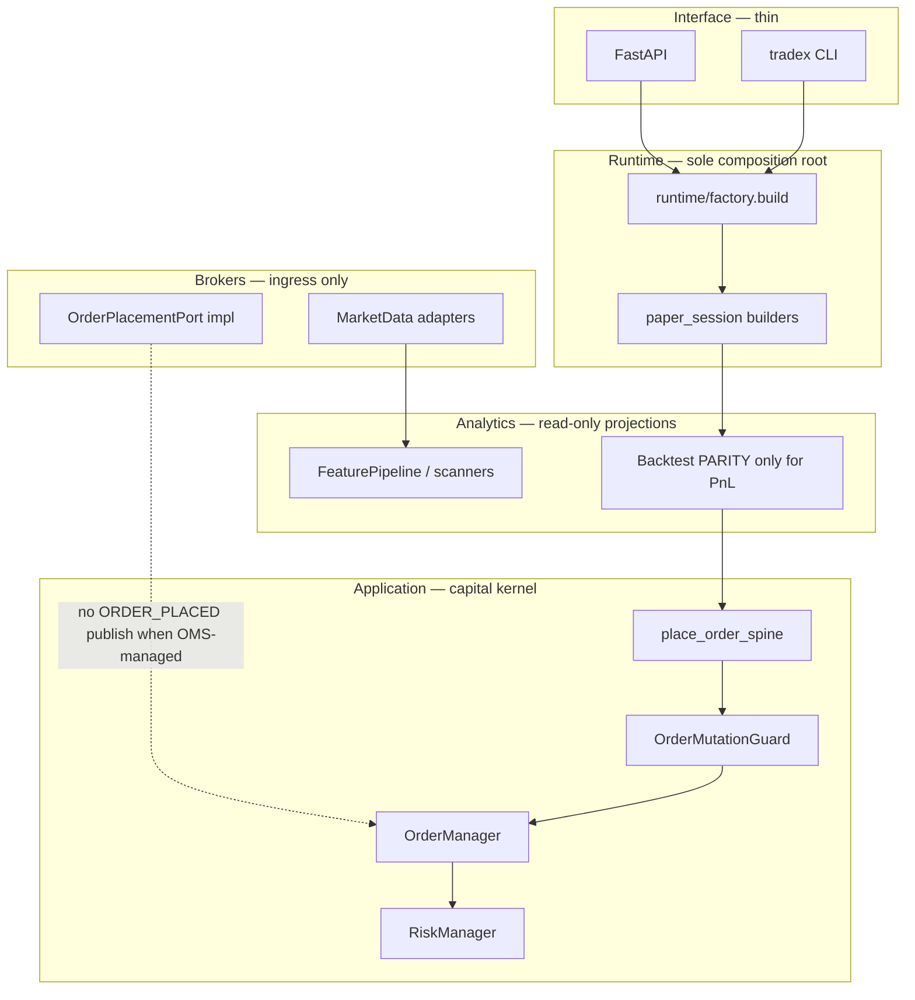

# TradeXV2 — Pre-Deployment System Review

**Date:** 2026-07-20  
**Method:** Reconcile today's two audit reports against current git + targeted source verification (graphify-first subagents) + safe dead-code elimination pass  
**Sources:** [`CODE-QUALITY-REVIEW-2026-07-20.md`](CODE-QUALITY-REVIEW-2026-07-20.md), [`COMPREHENSIVE-PLATFORM-REVIEW-2026-07-20.md`](COMPREHENSIVE-PLATFORM-REVIEW-2026-07-20.md), `context/progress-tracker.md`, commits through `d9b3aac7`  
**Scope:** Full system (`src/` ~151k LOC); paper/research deployment posture per ADR-0012

---

## 1. System Intent

TradeXV2 is an event-driven quantitative trading kernel supporting replay, backtesting, paper trading, and (future) live broker execution on a single domain model and OMS/risk spine. The immutable pipeline is Market Data → Features → Indicators → Strategies → Signals → Risk → OMS → Execution Target. Product surfaces (CLI, API, TUI, MCP) select the execution target at the composition root. **Current product boundary (ADR-0012): paper-only execution** — broker plugins supply market data; OMS owns paper capital, orders, and positions. Zero-parity requires backtest, replay, and paper to share identical OMS/Risk logic; only the execution-target adapter may differ.

---

## 2. Active Execution Paths

### Path A — Default operator analytics (CLI / API backtest)

```
Operator → tradex backtest / POST /api/v1/backtest
  → runtime/paper_session.build_backtest_engine(research_only=False)   [PARITY default at composition root]
  → BacktestEngine(ResearchMode.PARITY) → ReplayEngine + OmsBacktestAdapter
  → SignalProcessor → place_order_spine → OrderManager + RiskManager + PaperFillSource
  → PositionManager / TradeRecorder → equity curve / journal
```

**Before:** broker profile resolved; datalake or CSV data available.  
**After:** PnL-bearing output only when PARITY path used (composition-root builders enforce this).  
**Failure detection:** risk rejection events; OMS state machine illegal transitions; architecture ratchet `test_paper_oms_boundary.py`.

**Residual gap:** Direct `BacktestEngine(...)` construction still defaults to `ResearchMode.PURE_SIM` (`analytics/backtest/engine.py:106`) — bypasses OMS if caller skips composition root.

### Path B — Live orchestrator (when wired)

```
Market ticks → EventBus → TradingOrchestrator.on_candidate
  → StrategyPipeline.evaluate_single → ExecutionPlanner (kill_switch wired from orchestrator)
  → OrderPlacer → ExecutionEngine.place_order → place_order_spine → OrderManager
  → PaperFillSource (ADR-0012; no live broker submit on operator paths)
```

**Before:** `TradingContext` initialized; risk_manager present (fail-closed in production).  
**After:** order in OMS book or explicit rejection.  
**Failure detection:** `OrderMutationGuard`, `authorize_live_order`, `RiskRejectedError`.

**Residual gap:** `ORCHESTRATOR_DRY_RUN` defaults conflict — `config/schema.py` default `True`, `runtime/factory.py` treats unset env as `False` (QUANT-004 partial).

### Path C — Market data only (no capital path)

```
tradex session / API market routes → runtime.factory.build → BrokerAdapter (quotes, history, stream)
  → DataProvider / HistoricalDataCoordinator → analytics scanners / CLI inspect
```

**Before:** credentials valid; broker readiness gate passes.  
**After:** typed quotes/bars; no OMS mutation.  
**Failure detection:** gateway circuit breakers; `production_readiness` gate.

### Path D — Live tick → datalake (MD-001, resolved)

```
StreamOrchestrator TICK → LiveTickBarPipeline → LiveBarSink → parquet merge-write + catalog refresh
  (default-on; TRADEX_LIVE_BAR_SINK=0 disables)
```

### Conditionally used / legacy

| Module / path | Status |
|---|---|
| `BacktestEngine(PURE_SIM)` direct construction | Legacy bypass — **not on operator default path** but still callable |
| `FastBacktestEngine` via `analytics_datalake` CLI | Research-only; look-ahead bias documented — **still reachable without production gate** |
| `build_paper_oms_service` alias | **Deleted** — tests use `build_oms_service` |
| `DhanRetryExecutorFactory` / `make_retry_executor` | **Deleted** — `create_retry_executor` kept for Dhan chaos tests only |
| `application/research/` shim | Re-export layer — dual ownership smell, low traffic |

### Never used (deleted this pass)

| Symbol | Was in |
|---|---|
| `TradingContext.run_reconciliation()` | `application/oms/context/__init__.py` — zero callers |
| `is_healable_kind()` / `HEALABLE_KINDS` | `application/oms/recon_heal_policy.py` — zero callers |
| `_leg_greeks()` | `brokers/upstox/mappers/options_mapper.py` — zero callers |
| Unreachable `return` after `DepthStreamHandle` | `brokers/upstox/adapters/streaming_gateway.py:222` |

---

## 3. Dead / Duplicate / Legacy Code

### Executed deletions (this review)

| Item | Action | Lines removed |
|---|---|---|
| `run_reconciliation()` shim | **DELETE** | ~10 |
| `is_healable_kind()` + `HEALABLE_KINDS` | **DELETE** | ~15 |
| `_leg_greeks()` in options_mapper | **DELETE** | ~7 |
| Unreachable return in streaming_gateway | **DELETE** | 2 |
| Broken `audit.py` catalog re-export | **FIX** (re-export from `_catalog.py`) | +4 |

### DELETE list (confirmed still dead — next safe pass)

_All safe-delete items from this review are complete. Remaining items require MERGE/redesign._

### Previously deleted (this review + follow-up)

| Item | Action |
|---|---|
| DC-01 | **DELETE** — `DhanRetryExecutorFactory`, `UpstoxAdapterContext.make_retry_executor()` |
| DC-03 | **DELETE** — `build_paper_oms_service` alias; tests migrated to `build_oms_service` |
| `run_reconciliation()` shim | **DELETE** |
| `is_healable_kind()` + `HEALABLE_KINDS` | **DELETE** |
| `_leg_greeks()` | **DELETE** |
| Unreachable return in streaming_gateway | **DELETE** |

### MERGE list — status after follow-up pass (2026-07-20)

| ID | Status | Notes |
|---|---|---|
| **DP-02** | **Done** | Extended `order_command_mapper.py`; migrated square_off, oms_backtest_adapter, cli_broker_facade, execution_planner |
| **DP-08** | **Done** | `infrastructure/providers/null/stubs.py` + csv/dataframe providers delegate |
| **DP-09** | **Done** | `brokers/common/backoff.py` re-exports `infrastructure.resilience.backoff.exponential_backoff_seconds` |
| **DP-10** | **Done** | `interface/api/session_state.py`; market routers use shared module |
| **SS-03** | **Done** | Removed planner/orchestrator kill-switch pre-checks; OMS `OrderMutationGuard` only |
| **SS-04** | **Partial** | `tradex/session.py` uses `build_event_bus()`; paper/replay paths still construct buses independently |
| **QUANT-001** | **Done** | `BacktestEngine` default `ResearchMode.PARITY`; explicit `PURE_SIM` for research |
| **QUANT-004** | **Done** | `config/schema.py` `ORCHESTRATOR_DRY_RUN` default `False` (matches `runtime/factory.py`) |
| **UE-05** | **Done** | Fail-closed tick validation when `instrument_provider is None` on priced limits |
| **MD-002** | **Partial** | Order stream uses exchange timestamp from `_transform_order`; quote path was already fixed |
| **DP-01** | Open | Shared `ResilientHttpTransport` exists but unwired |
| **DP-04** | Open | Dhan still uses mixin/inline reconnect |
| **DP-05/06/07** | Open | Quality/indicator/credential duplication remains |
| **SS-02** | Open | 15+ broker `place_order` implementations |
| **OE-01/04** | Open | SQL views stack parallel to Python scanners (ownership documented in architecture.md) |
| **GC-01** | Open | EventBus still ~518 LOC hub |

### KEEP list (distinct concerns — reviews flagged but not duplicates)

| ID | Rationale |
|---|---|
| DP-11 | Per-broker segment maps — acceptable plugin boundary |
| REF-7 timezone sites | `normalize.py`, `converter.py`, `find_gaps` — distinct read/write/heuristic concerns |
| TYPE_CHECKING imports (`DomainKillSwitch`, `DomainRiskResult`) | Used in signatures; not runtime-dead |
| `SM-07` `order_placer.execution_engine` | **Resolved** — wired to spine (`order_placer.py:90`) |
| Paper vs replay model split | Different lifecycle; merge deferred to Phase 3 simulation DRY |

### P0 reconciliation (post-remediation commits)

| ID | Status | Notes |
|---|---|---|
| ARCH-001 Dhan dual ORDER_PLACED | **Resolved** (`75fa025a`, `405126ac`) | `is_oms_managed_submit()` guard + tests |
| BROKER-008 Upstox idempotency race | **Resolved** (`75fa025a`) | reserve/commit in `brokers/common/idempotency.py` |
| MD-002 exchange timestamps | **Partial** | Quotes fixed; order-stream events still wall-clock (`order_stream.py:405,435`) |
| REL-003 capital event drops | **Resolved** (`330e1aa9`, `e6215ca4`) | Never drop when `is_capital_event()` |
| SEC-001 cancel/modify auth bypass | **Resolved** (`9854558f`) | `enforce_live_order_authority(mutation_action=...)` on PUT/DELETE |
| SEC-002/003 kill-switch fail-open | **Resolved in production** (`9854558f`) | Dev/test still permissive by design |
| SEC-004/005 metrics auth | **Reverted** (`d9b3aac7`) | Metrics public again — operational exposure remains |
| SEC-009 mandatory API_KEY | **Reverted** (`d9b3aac7`) | `AUTH_MODE=none` default |
| TEST-001 collection errors | **Resolved** (`054ea0bb`) | 8653 tests, 0 collection errors per tracker |
| QUANT-001 PARITY default | **Partial** | Composition roots default PARITY; class ctor still PURE_SIM |
| MD-001 live→lake | **Resolved** | Default-on bar sink + stream wiring |
| UE-01 broken `:memory:` query | **Resolved** | Routes through read pool |
| UE-02/03 quality false signals | **Resolved** | `contract.py` audit counts; engine 100% when no gaps |
| DP-03 capital classification | **Resolved** | `domain/events/capital_events.py` canonical |

---

## 4. Shotgun Surgery Findings

| ID | Trigger | Files touched today | Root cause | Single owner |
|---|---|---|---|---|
| SS-01 | Order status / capability change | 3–4 per broker + domain mapper | No broker capability contract file | `brokers/common/contracts/` + YAML per plugin |
| SS-02 | New order field | 15+ `place_order` under `brokers/` | Parallel gateway stacks | `OrderPlacementPort` at application boundary |
| SS-03 | Kill-switch policy | **Partially fixed** — `OrderMutationGuard` on OMS lifecycle; planner/orchestrator still duplicate pre-checks | Policy scattered pre-Phase-A | `OrderMutationGuard` only; remove planner checks |
| SS-04 | Event bus wiring | bootstrap, broker_service, session, paper_session, replay | No single bus factory call site | `runtime.factory.build` owns bus once |
| SS-05 | Stream handle shape | Dhan closures, Upstox gateway, common DepthStreamHandle | No shared protocol | `domain/ports/stream_handle.py` |
| SS-06 | New broker CLI command | `cli/broker.py` 25+ hard-coded commands | Capability discovery unused | Registry-driven CLI from `get_capabilities()` |
| CODE-013 | Symbol normalization | 40+ `normalize_symbol` copies | No domain normalizer port | `domain/instruments/normalize.py` |

**Status after Ponytail Waves 1–3 + Phase A:** SS-03 materially improved; SS-04/TC-02 partially improved via `runtime.factory.build` but `_ensure_initialized` parallel path remains.

---

## 5. Simplified Target Architecture



**Closer to target since audits:**

- Single factory entry (`runtime.factory.build`) for API/CLI/SDK
- `OrderMutationGuard` centralized on OMS mutations
- `capital_events.py` + `EventPersistenceHook` split from god EventBus
- PARITY default at composition-root backtest/replay/paper builders
- Live bar sink wired (MD-001)
- Dhan/Upstox OMS-managed publish guards + Upstox idempotency protocol

**Still far from target:**

- Triple bootstrap surfaces (`BrokerService._ensure_initialized` vs `factory.build`)
- EventBus still 518 LOC / degree ~231
- Broker HTTP stacks unwired to shared transport
- Analytics SQL views stack parallel to Python pipeline (~2k LOC)
- `FastBacktestEngine` and direct `BacktestEngine(PURE_SIM)` bypass paths remain

---

## 6. Required Tests Before Deploy

### Must pass (blocking)

| Gate | Command / artifact | Status |
|---|---|---|
| Full test collection | `pytest --collect-only` | **8653 tests, 0 errors** (tracker) |
| Architecture ratchets | `pytest tests/architecture/` | import-linter + paper OMS boundary + duckdb single-connection |
| OMS money-safety | `tests/component/oms/test_phase_a_money_safety.py` | 13 tests — guard, capital events, tick validation |
| Paper OMS target | `tests/integration/runtime/test_paper_oms_target.py` | PARITY wiring |
| Broker P0 regressions | `test_order_placement_oms_guard.py`, `test_order_command_idempotency.py` | ARCH-001, BROKER-008 |
| Async capital never dropped | `test_async_event_bus_priority.py` | REL-003 |
| Live bar sink integration | `tests/integration/datalake/test_live_bar_sink.py` | MD-001 |

### Must add before live-money (not required for paper/research deploy)

| Gap | ID | Risk if missing |
|---|---|---|
| Multi-broker order failover E2E | TEST-002 | Silent route to dead broker |
| Shutdown coordinator | TEST-005 | Open orders on process exit |
| Mutation guard concurrency | TEST-004 | Re-entrant state corruption |
| Chaos subset in PR CI | TEST-003 | Fault modes ship undetected |
| Real `OmsBacktestAdapter` parity gate | QUANT-002 | False confidence in production boot |
| Scanner determinism golden tests | TEST-010 | SQL vs Python scanner diverge |

### Observability before any deploy

- AlertingEngine wired at bootstrap (REL-001 — **still open**)
- DLQ depth alerting (REL-004 — manual today)
- Explicit health probe contract (`/healthz` vs `/api/v1/health/*`)

---

## 7. Go / No-Go Deployment Decision

### Decision: **CONDITIONAL GO (paper / research only) — NO-GO for live money**

| Dimension | Pre-audit (4.2/10) | Post-reconciliation | Delta |
|---|---|---|---|
| OMS spine integrity | 5/10 | **6/10** | Phase A guard + SEC fixes landed |
| Event reliability | 3/10 | **5/10** | REL-003 fixed; SS-04 partial |
| Broker safety | 4/10 | **6/10** | ARCH-001, BROKER-008 fixed; MD-002 partial |
| Zero-parity defaults | 4/10 | **5.5/10** | PARITY at composition root; ctor bypass remains |
| Security | 3/10 | **4/10** | SEC-001/002/003 fixed; SEC-004/009 **reverted** |
| Data quality | 5/10 | **6.5/10** | UE-01/02/03, MD-001 fixed |
| Dead-code / maintainability | 5/10 | **5.5/10** | This pass + Ponytail Waves |

**Revised weighted score: ~5.0 / 10** — improved from 4.2, still below live-money threshold.

### GO — allowed deployments

1. **Local / dev analytics** — scan, inspect, backtest with PARITY composition-root builders (`build_backtest_engine`, API backtest router).
2. **Paper OMS simulation** — ADR-0012 boundary; `ExecutionTargetKind.PAPER` + `PaperFillSource`.
3. **Market-data-only sessions** — quotes, history, live stream without order mutations.
4. **Datalake ingestion + quality validation** — batch path production-ready; live bar sink default-on.

### NO-GO — blocked until Phase B/C complete

1. **Live broker order execution** — ADR-0012 explicitly paper-only; even if enabled, SEC-004/009 reverts + in-memory idempotency (REL-008) block production.
2. **PnL claims from `PURE_SIM` or `FastBacktestEngine`** — not zero-parity with OMS book.
3. **Multi-strategy live orchestration** — signal stacking (QUANT-005), sizing divergence (QUANT-010).
4. **Internet-exposed API without explicit `AUTH_MODE=api_key` + network controls** — default `AUTH_MODE=none`.

### Reasons (conservative, post-production-failure posture)

- Operator **default** paths now route through PARITY at composition root, but **direct class construction** and FastBacktest CLI still bypass OMS silently.
- OMS kernel is real and guarded in production, but **EventBus god-hub**, **triple bootstrap**, and **HTTP stack duplication** mean a single policy change still touches many files (shotgun surgery).
- **Metrics and auth defaults were deliberately reverted** — acceptable for local dev, unacceptable for exposed production.
- **Durable idempotency on restart** not implemented — duplicate order risk on process crash.
- **AlertingEngine unwired** — silent degradation in production incidents.

### Minimum bar to re-evaluate live-money GO

Complete Phase B (spine integrity: canonical mapper, OrderPlacer→spine only, require ExecutionTarget) + Phase 0 security re-apply (SEC-004/009 with operator opt-out, not opt-in) + durable idempotency + real parity gate — estimated 2–4 weeks per existing roadmaps.

---

## Appendix: Module Before/After/Failure Contract (capital path)

| Module | Must be true BEFORE | Guarantees AFTER | Failure detected |
|---|---|---|---|
| `OrderMutationGuard` | `risk_manager` wired in production | Blocks place/modify/cancel when kill-switch active or RM missing (prod) | `RiskRejectedError`; HTTP 403 |
| `place_order_spine` | Valid `OmsOrderCommand`; ExecutionTarget set | Single OMS mutation + fill application | Architecture inventory test; duplicate event assert |
| `OrderManager.place_order` | Idempotency key unused; risk passed | Order in book; ORDER_PLACED once | State machine validator; audit log |
| `RiskManager.check_order` | Instrument provider configured for limit orders | Fail-closed on lookup failure | `RiskResult(False)`; **fail-open if provider None** (UE-05 partial) |
| `PaperFillSource` | Paper target kind | Simulated fill with OMS semantics | Integration tests |
| `EventBus` / `AsyncEventBus` | Handler registered | Capital events persisted / never dropped | `dropped_count`; capital event tests |
| Dhan `OrderPlacer` | OMS-managed flag set | No duplicate ORDER_PLACED | `test_order_placement_oms_guard.py` |

---

*Reconciliation pass complete. Safe deletions applied. Large consolidations (DP-01, DP-02, GC-01, OE-01) deferred to Phase B/C per money-safety rule — require golden-dataset parity tests before execution.*
