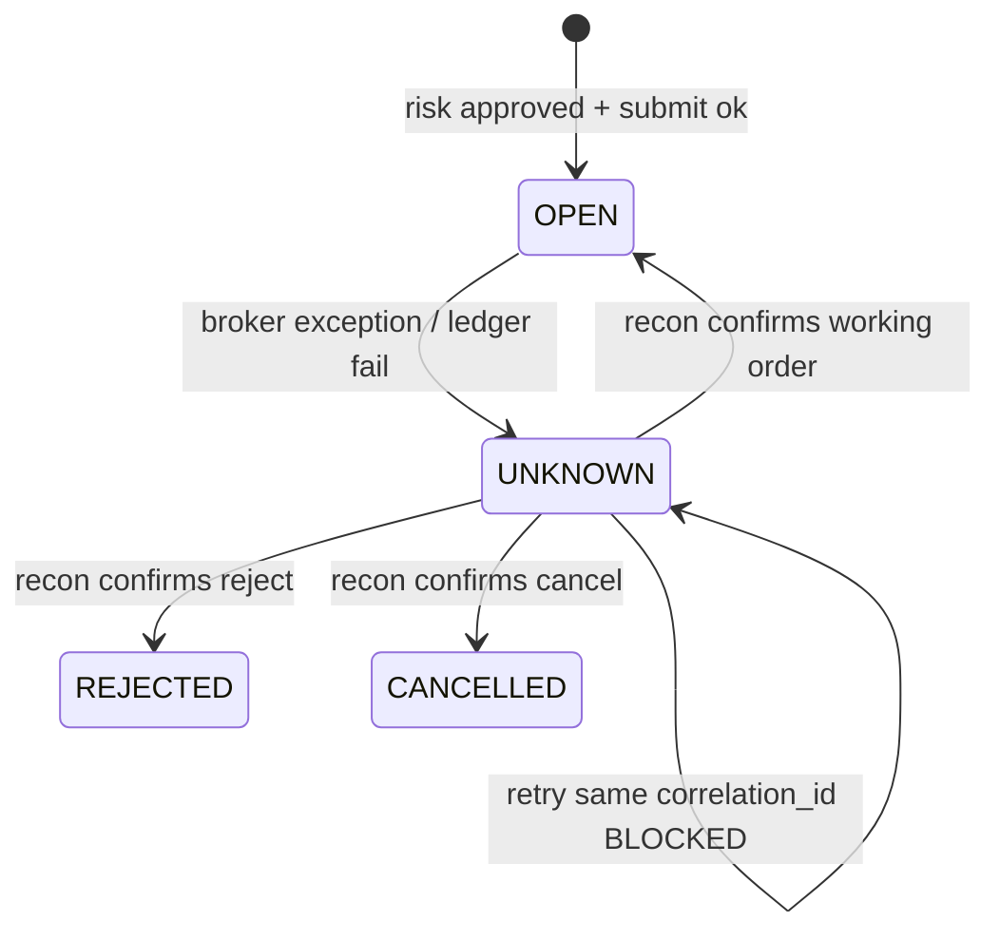
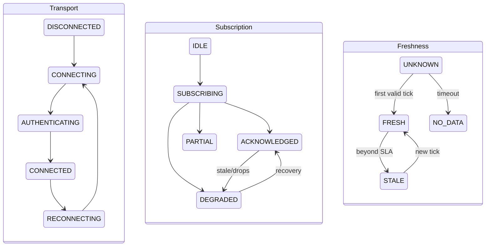
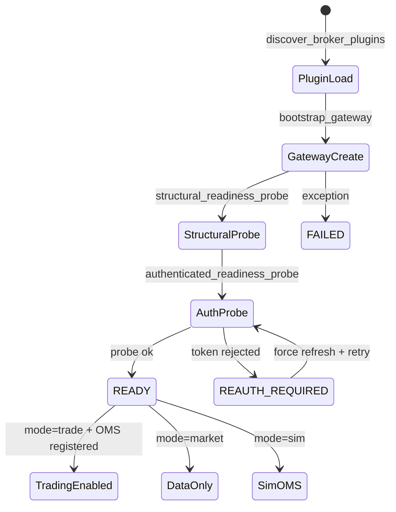

# State Machines

**Version:** 1.0 (TRANS-P2-008)  
**Status:** Phase 2 — Legal Transition Specification  
**Implementation:** `src/domain/` (transitions), `src/application/oms/` (enforcement)  
**Owner:** Domain & Contracts / Chief Architect

---

## Purpose

This document defines **legal state transitions** for runtime aggregates. Illegal transitions must raise `IllegalTransitionError` (`src/domain/state_machine.py`) or be rejected by validators (`application/oms/_internal/order_state_validator.py`).

Cross-reference: [OBJECT_MODEL.md](./OBJECT_MODEL.md), [FLOWS.md](./FLOWS.md) §3 and §7, [ERROR_TAXONOMY.md](./ERROR_TAXONOMY.md).

---

## Order

**Aggregate:** `domain.entities.Order`  
**Canonical transitions:** `src/domain/entities/order_lifecycle.py` (`ORDER_STATUS_TRANSITIONS`)  
**Enforcement:** `OrderStateValidator`, `OrderLifecycle`, `IdempotencyGuard`

### States

| State | Terminal? | Meaning |
|-------|-----------|---------|
| `OPEN` | No | Accepted by OMS; working at broker |
| `PARTIALLY_FILLED` | No | Cumulative fill &lt; quantity |
| `FILLED` | Yes | Fully filled |
| `CANCELLED` | Yes | User/system cancel |
| `PARTIALLY_CANCELLED` | Yes | Partial fill then cancel |
| `REJECTED` | Yes | Risk or broker reject |
| `EXPIRED` | Yes | Validity expired |
| `UNKNOWN` | No* | Ambiguous broker outcome; recon required |

\* `UNKNOWN` is non-terminal for **retry policy** but blocks automated retry until reconciliation resolves.

### Transition table

```
OPEN ──────────────► PARTIALLY_FILLED ──► FILLED
  │                        │
  ├──────► FILLED          ├──► CANCELLED
  ├──────► CANCELLED       ├──► PARTIALLY_CANCELLED
  ├──────► PARTIALLY_CANCELLED
  ├──────► REJECTED
  └──────► EXPIRED

PARTIALLY_FILLED ──► FILLED | CANCELLED | PARTIALLY_CANCELLED | REJECTED

UNKNOWN ──► OPEN | REJECTED | CANCELLED   (reconciliation-resolved only)
```

### Code-defined transitions

```7:37:src/domain/entities/order_lifecycle.py
ORDER_STATUS_TRANSITIONS: dict[OrderStatus, frozenset[OrderStatus]] = {
    OrderStatus.OPEN: frozenset({...}),
    OrderStatus.PARTIALLY_FILLED: frozenset({...}),
    OrderStatus.FILLED: frozenset(),
    OrderStatus.CANCELLED: frozenset(),
    OrderStatus.PARTIALLY_CANCELLED: frozenset(),
    OrderStatus.REJECTED: frozenset(),
    OrderStatus.EXPIRED: frozenset(),
    OrderStatus.UNKNOWN: frozenset({
        OrderStatus.OPEN,
        OrderStatus.REJECTED,
        OrderStatus.CANCELLED,
    }),
}
```

### Pre-OMS placement states (risk gate)

Before broker submission, the generic state machine in `domain/state_machine.py` documents an optional `PENDING_RISK` phase:

```
PENDING_RISK ──► OPEN | REJECTED
```

Broker wire statuses (`TRANSIT`, `TRIGGER PENDING`, `PENDING`) normalize to `OPEN` at the adapter boundary (`domain/status_mapper.py`, `brokers/dhan/status_mapper.py`).

### UNKNOWN rules (explicit)

| Rule | Enforcement | Semantics |
|------|-------------|-----------|
| **U-1** | Broker exception on `submit_fn` → `UNKNOWN` | `order_lifecycle.py:135-157` |
| **U-2** | Ledger `record_outcome` failure after broker accept → `UNKNOWN` | `order_lifecycle.py:167-182` |
| **U-3** | Same `correlation_id` retry while `UNKNOWN` → **blocked** | `idempotency_guard.py:51-57` |
| **U-4** | Same `correlation_id` after resolution → return existing order (idempotent) | `idempotency_guard.py:58-62` |
| **U-5** | `UNKNOWN` exit only via reconciliation or manual ops → `OPEN`, `REJECTED`, or `CANCELLED` | `ORDER_STATUS_TRANSITIONS` |
| **U-6** | All transitions emit `ORDER_UPDATED` | Event invariant |
| **U-7** | `SubmissionState.UNKNOWN` returned synchronously on place | Contract OM-1 |
| **U-8** | Placement gate may remain closed until drift-free recon after restart | `context.py` placement gate |

### UNKNOWN state diagram



### Events per transition

| Transition | Event |
|------------|-------|
| Intent recorded | `ORDER_REQUESTED` (orchestrator) |
| Broker accept | `ORDER_PLACED`, `ORDER_SUBMITTED` |
| Any status change | `ORDER_UPDATED` |
| Terminal cancel | `ORDER_CANCELLED` |
| Terminal reject | `ORDER_REJECTED` |
| Fill stream | `TRADE` → `TRADE_APPLIED` |

---

## Position

**Aggregate:** `domain.entities.Position`  
**Transitions:** `src/domain/entities/position.py` (`POSITION_STATE_TRANSITIONS`)  
**Enforcement:** `application/oms/position_manager.py`  
**Update source:** `TRADE_APPLIED` events only

### States

| State | Active exposure? | Meaning |
|-------|------------------|---------|
| `FLAT` | No | Zero quantity |
| `OPEN` | Yes | Established position |
| `REDUCING` | Yes | Partial exit in progress |
| `REVERSED` | Yes | Net side flipped |
| `CLOSED` | No | Full exit; awaiting session reset |

### Transition table

```
FLAT ──────► OPEN | REVERSED

OPEN ──────► OPEN (add) | REDUCING | CLOSED | REVERSED

REDUCING ──► FLAT | OPEN | REVERSED | CLOSED

REVERSED ──► FLAT | OPEN | REDUCING | CLOSED

CLOSED ─────► FLAT   (session reset)
```

### Code-defined transitions

```158:194:src/domain/entities/position.py
POSITION_STATE_TRANSITIONS: dict[PositionState, frozenset[PositionState]] = {
    PositionState.FLAT: frozenset({OPEN, REVERSED}),
    PositionState.OPEN: frozenset({OPEN, REDUCING, CLOSED, REVERSED}),
    ...
}
```

### Invariants

| Rule | Description |
|------|-------------|
| **P-1** | Quantity derived from sum of `TRADE_APPLIED` fills |
| **P-2** | `avg_price` weighted from fills |
| **P-3** | `realized_pnl` updated on reducing trades |
| **P-4** | Broker poll must **not** directly mutate position state |
| **P-5** | Illegal transition → `IllegalTransitionError` or logged reject |

### Events

| Transition | Event |
|------------|-------|
| First fill opens position | `POSITION_OPENED` |
| Full exit | `POSITION_CLOSED` |
| Qty/price change | `POSITION_UPDATED` |
| Portfolio refresh | `PORTFOLIO_UPDATED` |

---

## Subscription

Two complementary models exist: **domain subscription lifecycle** (operator-facing) and **stream health subscription layer** (transport-facing).

### A — Domain subscription lifecycle

**Location:** `domain/instruments`, streaming layer ([OBJECT_MODEL.md](./OBJECT_MODEL.md))  
**Invariant:** `degraded` must be observable — not silent.

| State | Meaning |
|-------|---------|
| `inactive` | Created; not streaming |
| `active` | Receiving ticks within SLA |
| `degraded` | Partial data, reconnecting, or drop policy triggered |
| `ended` | Clean shutdown |

### Transition table (domain)

```
inactive ──► active ──► degraded ⇄ active
    │           │           │
    └───────────┴───────────┴──► ended
```

| From | To | Trigger |
|------|-----|---------|
| `inactive` | `active` | `StreamOrchestrator.subscribe()` ack |
| `active` | `degraded` | Stale ticks, partial subs, drop threshold |
| `degraded` | `active` | Reconnect + fresh data within SLA |
| `*` | `ended` | `unsubscribe()` / lifecycle stop |

### Events

| Transition | Event |
|------------|-------|
| Start | `SUBSCRIPTION_STARTED` |
| End | `SUBSCRIPTION_ENDED` |
| Degrade (target) | `SubscriptionDegraded` — **not yet emitted** (AUDIT-010) |

### B — Stream health subscription layer

**Location:** `src/domain/stream_health.py`  
**Owner:** `application/streaming/orchestrator.py`

| State | `is_usable()` | Meaning |
|-------|---------------|---------|
| `IDLE` | false | Connected; nothing subscribed |
| `SUBSCRIBING` | false | Subscription in flight |
| `ACKNOWLEDGED` | true | Broker confirmed all subs |
| `PARTIAL` | true | Some subscriptions rejected |
| `DEGRADED` | false | Material fraction missing |

### Orthogonal dimensions

`StreamHealth` combines three independent dimensions:

```
StreamHealth
├── transport:  DISCONNECTED | CONNECTING | AUTHENTICATING | CONNECTED | RECONNECTING
├── subscription: IDLE | SUBSCRIBING | ACKNOWLEDGED | PARTIAL | DEGRADED
└── freshness: UNKNOWN | FRESH | STALE | NO_DATA

healthy() = transport.usable ∧ subscription.usable ∧ freshness.within_sla()
```

### Subscription composite diagram



### Failure → state mapping

| Condition | Domain state | Stream subscription | Freshness |
|-----------|--------------|---------------------|-----------|
| WS disconnect | `degraded` | `IDLE` / resubscribe | `UNKNOWN` |
| Tick drops (zero LTP) | `degraded` (target) | `ACKNOWLEDGED` | `STALE` |
| Upstox no bus publish | `active`* | `ACKNOWLEDGED` | `FRESH`* |

\* Misleading: transport healthy but bus consumers starved (AUDIT-003).

---

## BrokerSession

**Facade:** `brokers.session.BrokerSession` (not a domain aggregate — ADR-014)  
**Bootstrap types:** `domain/ports/bootstrap.py`  
**Session modes:** `tradex/session.py`

### Bootstrap status machine

| State | `ok` | `live_ready` | Meaning |
|-------|------|--------------|---------|
| `READY` | true | true* | Gateway constructed + auth probe passed |
| `DEGRADED` | varies | false | Partial function; operator decision |
| `REAUTH_REQUIRED` | false | false | Token rejected / credentials invalid |
| `FAILED` | false | false | Unrecoverable bootstrap error |

\* Requires `authenticated=True` and probe passed.

### Transition table (bootstrap)

```
[*] ──► READY          (structural + auth probe ok)
[*] ──► REAUTH_REQUIRED (token rejected)
[*] ──► FAILED         (create error, production readiness)
READY ──► DEGRADED     (post-connect degradation)
REAUTH_REQUIRED ──► READY  (token refresh success)
```

**Evidence:** `bootstrap_gateway()` — `src/infrastructure/gateway/factory.py` L125-290; `authenticated_readiness_probe()` — `src/infrastructure/connection/authenticated_readiness.py`.

### SDK session mode machine

| Mode | Orders | Data | Transition guard |
|------|--------|------|------------------|
| `sim` | In-memory OMS | Sim/historical | Default for `paper` |
| `market` | **Blocked** | Live | Default for `dhan`/`upstox` |
| `trade` | Process OMS | Live | Requires `TradingContext` registered |

```
connect(broker, mode=None)
  → _normalize_mode(broker_id, mode)
  → market: orders disabled at API boundary
  → trade: raises OMS_REQUIRED if no process context
```

### Token refresh substates (operational)

Not a formal enum but observed lifecycle:

| Broker | Mechanism | File |
|--------|-----------|------|
| Dhan | `TokenRefreshScheduler` → HTTP + WS `update_token` + `.env` broadcast | `brokers/dhan/identity/factory.py` |
| Upstox | `TotpRefreshScheduler` on lifecycle | `brokers/upstox/factory.py` |
| Order stream auth error | Proactive refresh before backoff | `brokers/dhan/websocket/order_stream.py` L250-258 |

### BrokerSession readiness diagram



### BrokerSession rules

| Rule | Description |
|------|-------------|
| **BS-1** | Public API exposes `Instrument` objects, not wire types |
| **BS-2** | `BrokerSession.status` reflects underlying `DomainSession.status` |
| **BS-3** | `segment_mapper_for` fails closed if plugin not imported (AUDIT-004) |
| **BS-4** | Production path requires `ProductionReadinessChecker.run_or_raise` when wired via `BrokerService` |
| **BS-5** | Token scheduler should register with `LifecycleManager`; `atexit` fallback only |

---

## Enforcement summary

| Aggregate | Validator / enforcer | Illegal transition |
|-----------|---------------------|-------------------|
| Order | `OrderStateValidator`, `ORDER_STATUS_TRANSITIONS` | `IllegalTransitionError` or reject update |
| Position | `PositionManager` + `POSITION_STATE_TRANSITIONS` | Error / skip |
| Subscription | `StreamOrchestrator`, health updates | `failure_reasons()` logged |
| BrokerSession | `bootstrap_gateway`, `ConnectError` | **BLOCKED** at API boundary |

---

## References

- `src/domain/state_machine.py` — generic `StateMachine` / `IllegalTransitionError`
- `src/domain/enums.py` — `OrderStatus`
- `src/domain/entities/order_lifecycle.py` — order transitions
- `src/domain/entities/position.py` — position transitions
- `src/domain/stream_health.py` — stream subscription + freshness
- `src/domain/ports/bootstrap.py` — `BootstrapStatus`
- [FLOWS.md](./FLOWS.md) — operational flows
- [ERROR_TAXONOMY.md](./ERROR_TAXONOMY.md) — UNKNOWN and degraded semantics