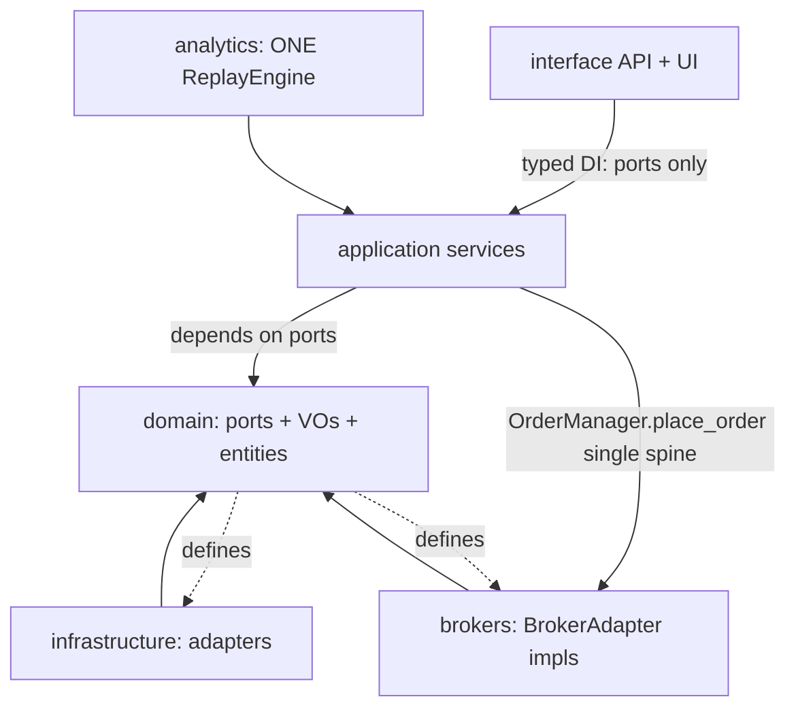

# Target-State Architecture & Migration Plan — Trade_XV2

> Code-derived target. Implements the approved audit in [`PRIORITIZED-AUDIT.md`](PRIORITIZED-AUDIT.md) against the as-built map in [`CURRENT-STATE.md`](CURRENT-STATE.md).
> Date: 2026-07-13.
>
> **Constraint:** correctness over cleverness; zero-parity mandatory; if a path needs more than two local patches, redesign the flow. No speculative features.

---

## 1. Target Architecture



### 1.1 Hard rules

1. **Single order spine, single composition root.** One `Runtime` factory. `tradex.open_session` delegates to it for all live modes. One `PlaceOrderCommand` / dispatcher builder used by every call site.
2. **Zero-parity via one engine.** `PaperTradingEngine` is a thin `ReplayEngine(mode="paper")` (or deleted). One session model base, one windowing module, one slippage application site (`OmsBacktestAdapter` only). `PaperConfig` carries `fill_model` matching `ReplayConfig` defaults.
3. **Enforced parity gate.** `skip_parity_gate` only from env (`SKIP_PARITY_GATE`); CLI/SDK **must not** hardcode `True`. Production assert if skipped.
4. **Durable order idempotency.** Correlation dedupe backed by ledger / durable store (and/or broker-side correlation), so restart cannot double-submit.
5. **Real reconciliation.** `apply_mass_status` upserts broker state into OMS **or** is renamed and a separate heal step is mandatory. `auto_repair` policy explicit and on by default for live.
6. **Correct risk.** Daily-loss = realized session PnL **or** equity delta from session open — not absolute MTM book. Risk-pending released on happy path + TTL.
7. **Honest layering.** No `application` → `infrastructure` imports; use `domain.ports` (observability, idempotency). No `interface.api` → `interface.ui` imports.
8. **One normalizer.** `datalake.core.symbols.normalize_symbol` delegates to `domain.symbols.normalize_symbol`. Suffix stripping is a **named** `normalize_symbol_for_storage` if storage truly needs it.
9. **Typed DI.** `deps.py` returns protocol types (`MarketDataPort`, `OrderManagerPort`, `RiskManagerPort`), not `Any` via string service locator.

### 1.2 Expected Behavior Contract (target)

| Dimension | Guarantee |
|---|---|
| **Inputs** | Bars/ticks, signals, order intents, env config |
| **Outputs** | Broker orders/fills, positions, equity, events, API responses |
| **Timing** | Live boot blocked unless parity gate passes (or explicit env skip in non-prod); deterministic replay |
| **State** | Local OMS converges to broker via heal; order status FSM enforced; single Trade/Position math |
| **Failure** | Auth fail → no gateway; risk reject → no submit; duplicate correlation → return existing; missed WS → heal within recon interval |

### 1.3 Package responsibilities (target)

| Layer | Owns | Must not own |
|---|---|---|
| `domain` | Ports, VOs, entities, pure domain services, one `BrokerId`, one symbol normalizer | HTTP, DB, broker SDKs |
| `application` | OMS, risk orchestration, execution use cases, portfolio services | Concrete infra classes |
| `infrastructure` | EventBus, caches, IO, gateway factory glue | Strategy/P&L math |
| `brokers` | Wire adapters, auth, broker-specific mapping | Application OMS internals |
| `analytics` | One ReplayEngine + strategies/features | Divergent fill math |
| `interface` | HTTP/CLI adapters, schemas, composition root only | Business rules, DuckDB SQL |
| `runtime` / `tradex` | One composition root; SDK is a facade | Second OMS wiring |

---

## 2. Migration Plan (phased; gate each phase on tests)

Principles: smallest correct diffs; delete before invent; fail loud over silent skip; update `context/progress-tracker.md` and run `graphify update .` after code changes.

### Phase 0 — Stop the bleeding (P0 safety + contract truth)

**Goals:** no behavior change to healthy paths; make failures explicit; import-linter truthful.

| Step | Change | Primary files |
|---|---|---|
| 0.1 | Fix Replay crash: `_publish_signal` → `_publish_sig` (or call module `publish_signal`) | `src/analytics/replay/engine.py:512,635` |
| 0.2 | Route application audit/idempotency/IO through `domain.ports`; inject adapters at composition root | `idempotency_guard.py`, historical/streaming/quota/composer/production_readiness, download_engine |
| 0.3 | Remove hardcoded `skip_parity_gate=True` defaults; derive only from env; raise in production if skipped | `compose.py`, `ui/main.py`, `tradex/session.py`, factory |

**Exit criteria:** replay end-of-run with pending signal succeeds; import-linter fails if application imports infrastructure again; CLI live path runs parity unless `SKIP_PARITY_GATE=1`.

### Phase 1 — Zero-parity (P0 analytics)

| Step | Change |
|---|---|
| 1.1 | Collapse paper onto `ReplayEngine` (mode flag or thin wrapper); delete divergent loop / duplicate session math |
| 1.2 | Remove local slippage in paper signal processor / closer; slippage **only** in `OmsBacktestAdapter` |
| 1.3 | Add `fill_model` to paper config; default = replay default (`NEXT_OPEN`) |
| 1.4 | Unify commission via `domain.trading_costs.compute_commission` on all open/close paths |
| 1.5 | Align session capital with OMS fill price (slipped once); add paper to same state-assertion path as `UnifiedReplayOrchestrator` where applicable |
| 1.6 | Document loudly: `PURE_SIM` is research-only; default research docs / CI parity job use OMS-enabled mode |

**Exit criteria:** same fixture OHLCV + strategy → paper equity within tolerance of replay (same fill_model, slippage, commission); no double-slippage path remains.

### Phase 2 — Safety correctness (P0 OMS/risk)

| Step | Change |
|---|---|
| 2.1 | Daily-loss: feed realized session PnL or equity-from-open-delta — not absolute MTM (F5) |
| 2.2 | Durable correlation / order idempotency (ledger or broker correlation) (F6) |
| 2.3 | Implement heal in `apply_mass_status` **or** rename + wire mandatory heal; live `auto_repair` on (F4) |
| 2.4 | Release risk-pending on happy path + TTL for stuck non-terminal orders (R2) |
| 2.5 | Constrain or remove `OrderPlacer.order_command_fn` escape hatch so it cannot bypass OMS |

**Exit criteria:** restart mid-submit does not double live order; recon after simulated WS gap restores local book; daily-loss test uses realized/equity-delta semantics.

### Phase 3 — Layering (P1)

| Step | Change |
|---|---|
| 3.1 | Move portfolio snapshot / active session into `application`; API routers stop importing UI (F9) |
| 3.2 | Single `normalize_symbol`; named storage helper if needed (F8) |
| 3.3 | One OMS ctor + one `build_order_dispatcher`; tradex delegates to runtime factory (F7) |
| 3.4 | Collapse dual `BrokerId` enums to one |

**Exit criteria:** no `from interface.ui` under `interface/api`; domain and datalake agree on keys for `RELIANCE-EQ`; one PlaceOrder mapping.

### Phase 4 — Structure (P2/P3)

| Step | Change |
|---|---|
| 4.1 | Make `BrokerAdapter.authenticate()` substitutable (Upstox/Dhan parity) |
| 4.2 | Delete `brokers/next/`, deprecated `create_gateway` shim, misleading `BrokerGateway` alias |
| 4.3 | Split gods behind ports: shrink `BrokerService`, `TradingContext`, `UpstoxBroker`, `DhanConnection` |
| 4.4 | Remove `asyncio.run` from composition root; long-lived loop owned by CLI/API lifespan; explicit `runtime.start()` for streams |
| 4.5 | Typed DI in `deps.py`; one `MarketDataGateway` port alias |
| 4.6 | Upgrade certification: token-refresh / reconnect / recovery / orders fail the suite when broken (drop `warn_only` for money paths) |
| 4.7 | Collapse analytics Trade/Position onto domain entities (or shared simulation types used by both modes) |

**Exit criteria:** cert fails on broken session recovery; no empty next tree; factory safe under FastAPI event loop.

---

## 3. What we will NOT do

- Rewrite brokers from scratch or invent a third broker framework.
- Add new abstractions (extra DI containers, event frameworks) without a Phase need.
- Patch paper slippage in three places instead of one shared engine (that would be local fixes hiding systemic divergence).
- Keep “it should work” reconciliation naming — rename or implement heal, not both.

---

## 4. Validation strategy (per phase)

| Phase | Minimum validation |
|---|---|
| 0 | Replay pending-signal regression; import-linter / architecture tests; boot with/without `SKIP_PARITY_GATE` |
| 1 | Integration: same data → paper vs replay equity/fills compare |
| 2 | Integration: crash/restart idempotency; recon heal after gap; daily-loss unit with fixed positions |
| 3 | Architecture tests for API↛UI and normalize_symbol consistency |
| 4 | Broker cert suite non-warn_only for session/execution; async boot smoke under FastAPI |

Prefer real components over mocks (project rule). Halt if live credentials/data are required and unavailable — do not invent fixtures that fake broker money paths.

---

## 5. Rollout order vs risk

```text
Phase 0  →  Phase 1  →  Phase 2  →  Phase 3  →  Phase 4
 crash+     parity        money         layers       cleanup
 gate+      math          safety
 lint
```

Do not start Phase 4 god-class splits until Phase 1–2 parity and safety are green — otherwise refactors move broken fill/risk math around.

---

## 6. Document ownership after implementation

| Artifact | Role |
|---|---|
| [`CURRENT-STATE.md`](CURRENT-STATE.md) | Freeze of as-built at audit time; update only when architecture materially changes |
| [`PRIORITIZED-AUDIT.md`](PRIORITIZED-AUDIT.md) | Finding ledger; mark F-IDs resolved in progress tracker as phases land |
| This file | Target + migration; tick phases in `context/progress-tracker.md` |

After **any** code change in a phase: `graphify update .` and update `context/progress-tracker.md`.
