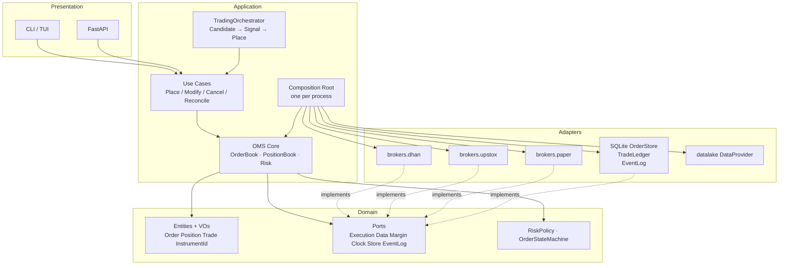
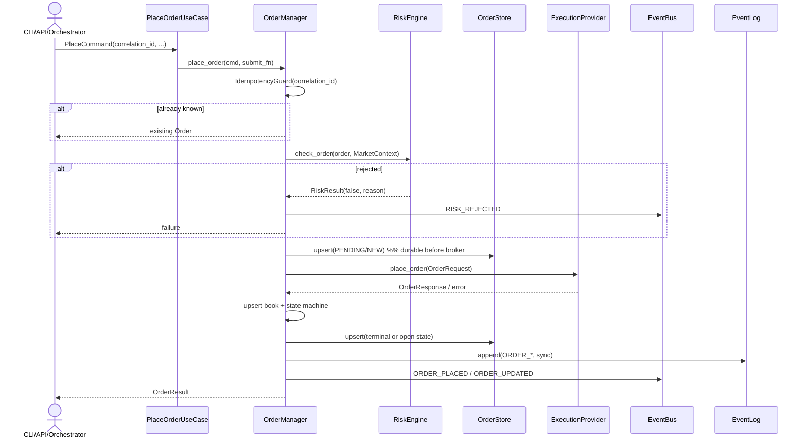
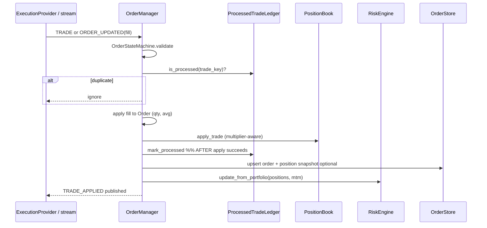
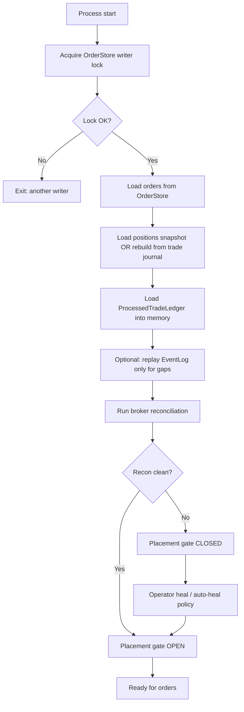
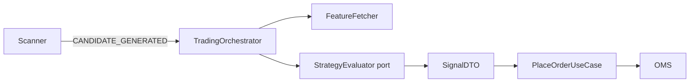
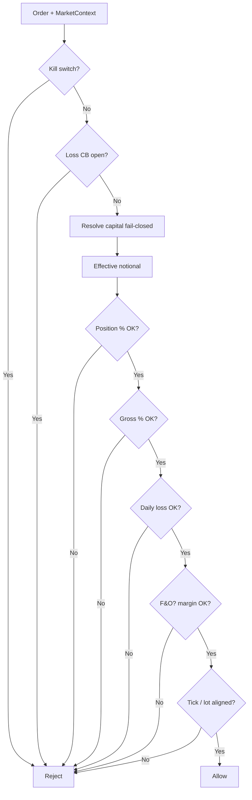
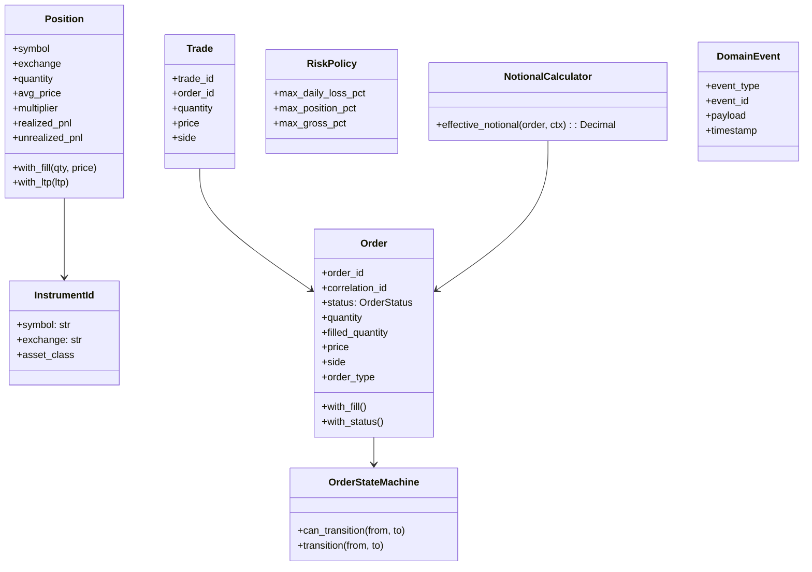
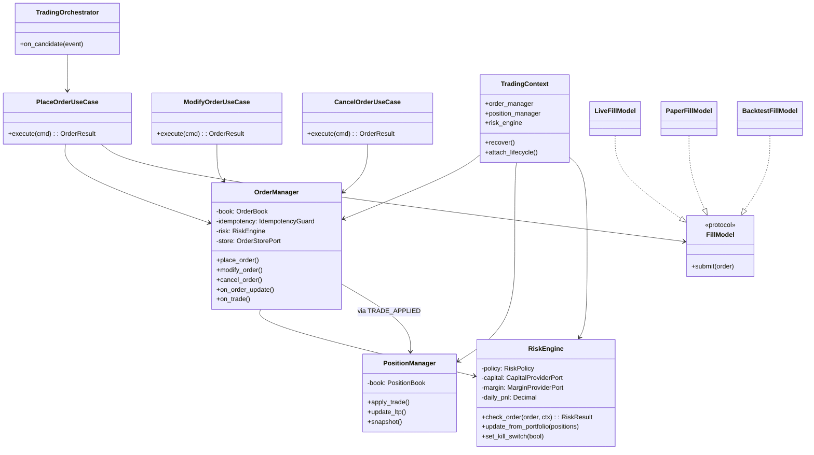
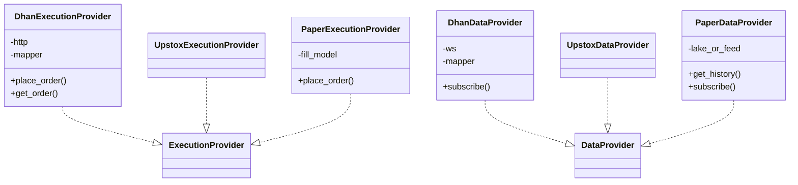

# TradeXV2 — Target System Design (Build Correctly, Incrementally)

**Status:** Proposed foundation for remediation  
**Audience:** Engineers implementing Phase 0–3  
**Date:** 2026-07-10  
**Delivery model:** **Incremental git commits on the working branch** — not PR stacks. Each commit is a small, test-backed slice that leaves the branch buildable.  
**Module depth (binding):** Every package is specified to **exit criteria** in [`MODULE_PROGRAM.md`](./MODULE_PROGRAM.md) — same accuracy as OMS/risk. Cosmetic-only work does **not** close a module.  
**Code reality (binding for commits):** [`CODE_REALITY_AND_PLAN.md`](./CODE_REALITY_AND_PLAN.md) — plan tables verified against **source files**. Overrides optimistic commit notes here when they conflict.  
**Out of scope (deferred):** Multi-tenant auth, secret vaults, MFA, API key rotation, network hardening — see [§12 Deferred: Security](#12-deferred-security-design-stub-only)

This document is the **architecture spine** (goals, flows, layers, commit rules).  
[`MODULE_PROGRAM.md`](./MODULE_PROGRAM.md) is the **exhaustive module catalog** (M01–M28).  
[`CODE_REALITY_AND_PLAN.md`](./CODE_REALITY_AND_PLAN.md) is the **execution plan from live code**.

**How we ship:** commit → run targeted tests → commit again. No PR ceremony. Optional push at phase exits.  
**How we judge progress:** module status board → `EXIT_MET` only when MODULE_PROGRAM “Done when” is true — not when files “look cleaner.”

---

## 0. Intent (one paragraph)

TradeXV2 is a **single-operator, single-process trading platform** for Indian markets that can:

1. Ingest market data (live broker + datalake)  
2. Scan / evaluate strategies  
3. Place, modify, cancel, and track orders through **one OMS**  
4. Enforce **pre-trade risk** that actually observes capital, PnL, and notional  
5. Survive process restart with **correct books** (orders + positions)  
6. Run the **same order lifecycle** in paper, live, and backtest (fills differ; rules do not)  

It is **not** (yet): multi-tenant SaaS, multi-replica trading API, HFT co-lo stack, or full event-sourcing platform.

---

## 1. Goals, non-goals, expectations

### 1.1 Goals (must achieve)

| ID | Goal | Measurable exit |
|----|------|-----------------|
| G1 | **One money path** | All place/modify/cancel (incl. extended) go through OMS + full risk |
| G2 | **Correct books** | After kill -9, restart rebuilds orders+positions from durable store (+ recon) |
| G3 | **Risk that works** | Daily loss, size, gross, margin, kill switch trip under tests with real wiring |
| G4 | **Broker parity minimum** | Dhan/Upstox/Paper satisfy the same Execution + Data contracts for core ops |
| G5 | **Mode parity** | Paper/live/backtest share state machine; only FillModel differs |
| G6 | **Scanner → signal → order** | One orchestrator path; no silent double books |
| G7 | **Test gates protect money** | Cold-start recovery + risk feed + contract matrix in CI |
| G8 | **Market data truth** | Subscribe/reconnect/validation contracts on all brokers; paper uses real/fixture data for validate profile |
| G9 | **Research integrity** | Replay/backtest use `domain.trading_costs`; lake quality gates; no naming confusion with OMS recovery |
| G10 | **Operable single-node** | One composition root; lifecycle/readyz reflect recon+OMS; dual kernels removed |

### 1.2 Non-goals (explicitly not now)

- Horizontal scale of trading process (multiple writers)  
- Distributed event bus / Kafka  
- Full event sourcing as system of record  
- Multi-strategy capital silos (Phase 3+)  
- Web SPA  
- Security hardening beyond “keep live flags off + single-operator local” (deferred)  

### 1.3 Expectation setting

| Principle | What it means in practice |
|-----------|---------------------------|
| **Commit-sized slices** | Each **commit** is one vertical slice (or half-slice) with tests; branch stays runnable |
| **No second path** | If you add a place_order entrypoint, delete or route the old one **in the same commit** (or the next commit before anything else) |
| **Fail closed** | Missing capital, margin provider, or store in live mode → refuse start / refuse order |
| **Paper is not a free pass** | Paper uses real history source when claiming “validated strategy” |
| **Single process** | Documented invariant until Phase 4; do not invent multi-instance OMS |
| **Docs follow code** | This design is updated when contracts change; no aspirational docs as truth |
| **One failing suite at a time** | Prefer: add failing test commit → implement commit → green; avoid mega-commits |
| **Module-complete, not touched** | Finishing a phase means listed modules hit **EXIT_MET** in MODULE_PROGRAM — not “we edited that folder” |
| **No cosmetic credit** | Renames, shims, comments, coverage of getters do **not** close M01–M28 |

### 1.3.1 Full module scope (nothing optional for “platform correct”)

Every row is a first-class workstream. Details: MODULE_PROGRAM.

| ID | Module | Why deep work is required |
|----|--------|---------------------------|
| M01 | domain | Types, ports, PnL/notional math, policy — foundation for all |
| M02 | application.oms | Books, risk, recovery — money |
| M03 | application.execution | Sole use-case path + FillModels |
| M04 | application.trading | Scanner→order without double fire |
| M05 | streaming | Tick lifecycle, reconnect, no silent subscribe fail |
| M06 | historical data | Federated history fail-closed |
| M07 | composition / runtime | One stack per process |
| M08 | portfolio / audit / schedule | MTM→risk, audit, daily reset |
| M09 | brokers.common | Capabilities truth, tick validation |
| M10 | brokers.dhan | Full port + get_order + modify parity |
| M11 | brokers.upstox | Subscribe fix + honest slice + resilience bar |
| M12 | brokers.paper | Validate vs toy profiles; lake/fixture |
| M13 | analytics.scanner | Deterministic candidates |
| M14 | analytics.strategy | Evaluator port + goldens |
| M15 | analytics.replay / WF | Research only; costs applied |
| M16 | features / indicators | Single pure math SSOT |
| M17 | analytics.paper dual | Delete second book |
| M18 | datalake | Quality gates for validate/backtest |
| M19 | event bus / log | Durable capital events, codecs |
| M20 | persistence / ledger | Wired SoR |
| M21 | resilience unify | One library |
| M22 | lifecycle / health | Ready semantics |
| M23 | infra auth / connection | Live creds fail-closed |
| M24 | api | Use cases only |
| M25 | cli | Doctor money-path |
| M26 | tradex | SDK façade; shrink runtime |
| M27 | config | Env unify; no risk bypass |
| M28 | tests / CI | Real paths; architecture gates |

### 1.4 Definition of “core complete” (Phase 1 exit)

A developer can:

```text
tradex connect paper | dhan | upstox
→ subscribe quote
→ place/modify/cancel with correlation_id
→ see position + PnL (with F&O multiplier)
→ kill process, restart, books match (or recon blocks until fixed)
→ risk blocks MARKET oversized and daily-loss scenarios
```

…with CI green on unit + contract + cold-start chaos.

**Phase 1 also requires** MODULE_PROGRAM EXIT_MET for: M02, M03, M04, M07, M12, M17, M20, M24–M26 (paths), M28 (CI truth).  
**Platform complete** (Phase 2 exit) adds: M05–M06, M09–M11 full matrix, M15, M18–M19, M21–M22, remaining M01/M16/M27.

---

## 2. Target architecture

### 2.1 Layer diagram



**Dependency rule:** arrows point inward. Domain never imports adapters. Application depends on ports only. Composition root is the only place that constructs adapters.

### 2.2 Bounded contexts (target ownership)

| Context | Owns | Must not own |
|---------|------|--------------|
| **domain** | Order/Position/Trade math, state machines, ports, risk *policy* | HTTP, SQLite, broker SDKs |
| **application.oms** | Order book, position book, risk *engine*, recon gate | Broker APIs |
| **application.execution** | Use cases + FillModel selection (live/paper/bt) | Risk formulas (call OMS) |
| **application.trading** | Orchestrator, strategy wiring | Direct broker place |
| **brokers.\*** | Map broker ↔ domain types; transport | OMS state |
| **infrastructure** | Bus, resilience, persistence impl, lifecycle | Domain rules |
| **analytics** | Scanner, features, strategy evaluation, research replay | Live order placement |
| **datalake** | Storage + research quality | Orders |
| **api / cli** | IO only | Business rules |

### 2.3 Systems of record (clarity)

| Data | System of record | Secondary |
|------|------------------|-----------|
| Working orders / fills book | **OMS OrderBook** (memory) hydrated from **OrderStore** | EventLog audit |
| Positions | **OMS PositionBook** rebuilt from accepted trades + recon | Broker positions on recon |
| Trade idempotency | **ProcessedTradeLedger** (durable) | — |
| Capital for risk | **CapitalProvider** (live funds API or explicit paper capital) | Never phantom in live |
| Strategy signals | Ephemeral | EventBus for observability |
| Historical bars | Datalake / broker history | — |

**Not system of record:** EventBus, JSONL EventLog (audit + rebuild *aid*), analytics replay engine.

### 2.4 Modes (one lifecycle, three fill models)

```text
                    ┌─────────────────┐
   Command ────────►│  OMS + Risk     │
                    └────────┬────────┘
                             │ submit
              ┌──────────────┼──────────────┐
              ▼              ▼              ▼
         LiveFill       PaperFill      BacktestFill
         (broker)     (sim model)    (bar/slip model)
              │              │              │
              └──────────────┼──────────────┘
                             ▼
                    OMS.on_order_update / on_trade
```

| Mode | FillModel | History source | Capital |
|------|-----------|----------------|---------|
| live | Broker WS/REST | Broker + lake | Broker funds (fail closed) |
| paper | SimulatedFill (configurable latency/partials later) | **Lake or recorded feed** (not random walk for validation) | Explicit config capital |
| backtest | Bar fill + domain.trading_costs | Lake only | Simulated equity curve |

---

## 3. Core flows

### 3.1 Place order (canonical)



**Invariants:**

1. `correlation_id` required outside tests.  
2. Risk sees **effective notional** (LTP if MARKET, lot×multiplier for F&O).  
3. Store write before broker call (crash → recon, not silent loss of intent).  
4. No second book outside OMS.

### 3.2 Fill / trade (canonical)



**Invariant change from today:** **apply → then mark** (not mark → apply).

### 3.3 Crash recovery



**Expectation:** cold start with empty process heap + only disk files must restore books. Multi-process chaos test is the gate.

### 3.4 Scanner → strategy → order



**Rules:**

- Orchestrator never calls broker directly.  
- Multi-strategy Phase 1: sequential evaluate; **net or first-wins policy** documented (default: highest confidence, one order per symbol per cycle).  
- Multi-strategy capital silos: Phase 3.

### 3.5 Risk check (effective)



`MarketContext` must include: last price (or limit price), lot_size, multiplier, available margin (if F&O).

---

## 4. Class design (target)

### 4.1 Domain core



### 4.2 Application OMS



### 4.3 Ports (minimal stable set)

Keep these **six** as the public adapter surface; deprecate extras over time:

| Port | Methods (core) |
|------|----------------|
| `ExecutionProvider` | place, modify, cancel, get_order, get_order_book, get_positions, get_holdings, get_funds |
| `DataProvider` | get_quote, get_history, subscribe, unsubscribe, get_option_chain |
| `MarginProviderPort` | calculate_margin_for_order |
| `OrderStorePort` | upsert, get, load_all, acquire_writer_lock |
| `ProcessedTradeRepositoryPort` | is_processed, mark_processed, load |
| `EventLogPort` | append(sync?), replay |

**Gateway classes** become thin facades over ExecutionProvider + DataProvider for CLI/ops only — not a second API for strategies.

### 4.4 Broker adapter shape



---

## 5. Repository organization proposal

### 5.1 Principles

1. **One package root** for domain (prefer promote `src/domain` → top-level `domain/` when ready; until then keep `pythonpath=["src","."]` but **do not add more under `src/`**).  
2. **One resilience home:** `infrastructure/resilience` — `tradex/runtime/resilience` becomes re-export shim then delete.  
3. **Brokers stay adapters only** — no OMS, no risk.  
4. **Co-locate tests** next to packages; cross-cutting in `tests/`.  
5. **Runtime data out of source** — `runtime/`, `market_data/` already; keep gitignored secrets.  

### 5.2 Target tree (incremental; do not big-bang)

```text
Trade_XV2/
  domain/                    # or src/domain until move
    entities/
    instruments/
    ports/                   # ONLY stable ports
    risk/                    # policy + notional (used by app)
    events/
  application/
    oms/                     # books, risk engine, recovery
    execution/               # use cases + fill models
    trading/                 # orchestrator only
    composer/                # composition helpers (thin)
  infrastructure/
    event_bus/
    persistence/             # order store, trade ledger
    resilience/              # THE only copy
    lifecycle/
    observability/
  brokers/
    common/                  # mappers helpers, contracts tests
    dhan/
    upstox/
    paper/                   # FillModel + lake-backed data
  analytics/                 # no live place_order
  datalake/
  api/                       # presentation
  cli/
  tradex/                    # public SDK facade ONLY (connect/session)
    session.py
    # runtime/* shrinks: move to application/infrastructure
  tests/
    contract/                # broker matrix
    chaos/                   # cold-start, disconnect
    e2e/
    quant/                   # parity
  deploy/                    # later: Dockerfile, compose (Phase 2+)
  docs/
    architecture/
      TARGET_SYSTEM_DESIGN.md   # this file
```

### 5.3 Migration rules (how to reorganize safely)

| Rule | Detail |
|------|--------|
| M1 | Move files only with import-linter + tests green **before the commit** |
| M2 | Prefer **facade re-export** for a few commits over silent path breaks |
| M3 | Delete dead duals in the **same commit** that wires the survivor (or immediate follow-up commit) |
| M4 | No new code in `tradex/runtime` except shims |
| M5 | `src/` gains no new top-level packages |
| M6 | Prefer many small commits over one “big bang move” commit |

### 5.4 What to delete / merge (ordered)

| Item | Action | Phase |
|------|--------|-------|
| Dual resilience | Merge → infrastructure; shim tradex | 1 |
| Domain RiskPolicy vs app RiskManager | One RiskEngine; domain holds pure policy/math | 0–1 |
| analytics/paper vs brokers/paper | Paper execution in brokers/paper; research sim calls OMS fill model | 1 |
| OrderManager._order_store dead field | Wire or remove — no half APIs | 0 |
| Flat gateway as strategy API | Deprecate for strategies; keep CLI | 1–2 |
| Ghost CI frontend job | Remove until SPA exists | 0 |

---

## 6. Testing strategy (protects the goals)

### 6.1 Test pyramid for money path

```text
        /  e2e cold-start + recon   \     few, slow, required for release
       /  chaos: kill -9, dup trades  \
      /  contract: Dhan|Upstox|Paper   \
     /  integration: OMS + fakes        \
    /  unit: state machine, notional,    \   many, fast
   /   PnL multiplier, risk policy        \
```

### 6.2 Mandatory suites mapped to goals

| Goal | Suite | Example cases |
|------|-------|---------------|
| G1 One path | unit + architecture | grep/import gate: no broker.place from analytics/orchestrator |
| G2 Recovery | **chaos cold-start** | place+fill → kill → new process → positions equal |
| G3 Risk | unit + e2e | MARKET size reject; daily loss after wired MTM; phantom capital refused in live |
| G4 Broker parity | **contract matrix** | get_order, modify fields, subscribe ticks |
| G5 Mode parity | parity tests | same transitions paper vs live fake broker |
| G6 Orchestrator | e2e | candidate → one order; no double fire |
| G7 CI | production_gate | must run cold-start + contract; no missing files |

### 6.3 Contract matrix (implement as parameterized tests)

```text
For each provider in {dhan_fake, upstox_fake, paper}:
  ✓ place_order returns order_id
  ✓ get_order(order_id) finds it
  ✓ modify_order(price, qty, trigger?) 
  ✓ cancel_order
  ✓ subscribe yields ≥1 tick (paper: from recorded fixture, not random)
  ✓ positions/holdings/funds shapes
```

Live network tests stay behind markers; **fakes implement full ports**.

### 6.4 Recovery test (definition of done)

```text
1. Process A: place order, apply fill, flush store+ledger
2. SIGKILL process A
3. Process B: composition root recover()
4. Assert: order status, filled_qty, position qty, avg_price, realized_pnl
5. Assert: duplicate TRADE from broker replay does not double position
6. Assert: placement gate behavior matches recon result
```

### 6.5 What not to over-test

- Broker SDK internals  
- UI pixel layout  
- Full universe scanner latency in unit tests  

### 6.6 CI expectations (corrected)

| Job | Required |
|-----|----------|
| unit + domain + OMS | Yes |
| import-linter | Yes |
| contract matrix (fakes) | Yes |
| cold-start chaos | Yes (release / production_gate) |
| live broker | Optional markers |
| frontend | **Remove until SPA exists** |
| security deep scan | Deferred track |

---

## 7. Incremental build plan (commit stream, not PRs)

### 7.0 Commit rules

| Rule | Detail |
|------|--------|
| **Size** | One logical change per commit; ideally &lt; ~400 LOC net + tests |
| **Green** | After each commit: run the **slice’s** tests (not always full suite) |
| **Message** | `phaseN/slice: imperative summary` e.g. `phase0/risk: wire daily pnl from positions` |
| **Order** | Follow the numbered commit list below; do not skip ahead into Phase 1 until Phase 0 exit |
| **Red-green** | Prefer two commits when useful: (1) failing test (2) implementation |
| **No WIP dumps** | Unrelated refactors wait for their numbered commit |
| **Branch** | Work on current feature branch with sequential commits; push optional at phase exits |

### 7.1 Phase 0 — Money-path truth — **do this first**

**Theme:** Make risk and recovery real; stop lying with dead wires.

| Commit ID | Message (suggested) | Deliverable | Verify |
|-----------|---------------------|-------------|--------|
| **C0.0** | `docs: adopt commit-based target system design` | This design as SSOT | — |
| **C0.1a** | `test(risk): fail when market notional understates size` | Failing unit tests for MARKET notional | `pytest … -k notional` red |
| **C0.1b** | `fix(risk): effective notional + F&O multiplier on PnL` | `NotionalCalculator`; Position multiplier | same tests green |
| **C0.2a** | `test(risk): reject phantom capital in live mode` | Failing tests | red |
| **C0.2b** | `fix(risk): fail-closed capital provider for live` | Composition refuses phantom | green |
| **C0.3a** | `test(risk): daily loss trips after fill mtm` | Failing e2e/unit | red |
| **C0.3b** | `fix(risk): wire portfolio mtm into risk engine` | `update_from_portfolio` callers | green |
| **C0.4a** | `test(oms): cold start restores orders from store` | Failing chaos/unit | red |
| **C0.4b** | `fix(oms): persist and hydrate OrderStore` | upsert + load on boot | green |
| **C0.5a** | `test(oms): apply trade before ledger mark` | Failing crash semantics test | red |
| **C0.5b** | `fix(oms): apply-then-mark trade ledger` | TradeRecorder order fix | green |
| **C0.6** | `fix(events): fsync capital events on append` | TRADE/ORDER sync_mode | unit green |
| **C0.7a** | `fix(dhan): gateway get_order` | Delegate + test | green |
| **C0.7b** | `fix(upstox): DataProvider.subscribe stream kwargs` | Fix + contract test | green |
| **C0.8** | `ci: drop ghost frontend job; require cold-start` | Workflow fix | CI config valid |

**Phase 0 exit (run before starting Phase 1):**

```bash
pytest application/oms/tests tests/chaos -q --tb=line -k "not integration"
# plus contract tests for get_order + upstox subscribe
```

Recovery + risk trips green.  
**Modules EXIT_MET target:** M02 (core), M20 wired, M19 capital fsync, M10/M11 P0, M01 notional, M28 CI ghosts gone.  
Full per-module commits: [`MODULE_PROGRAM.md`](./MODULE_PROGRAM.md) §5 Phase 0.

### 7.2 Phase 1 — One path (commit stream)

| Commit ID | Message (suggested) | Deliverable | Modules |
|-----------|---------------------|-------------|---------|
| **C1.1** | `refactor(execution): place/modify/cancel only via use cases` | Public API = use cases; call sites redirected | M03, M24, M25, M26 |
| **C1.2** | `fix(oms): extended orders through full risk` | Super/forever/GTT → `check_order` | M02 |
| **C1.3a** | `feat(execution): FillModel protocol` | Live/Paper/Backtest ports | M03 |
| **C1.3b** | `fix(paper): history from lake/fixture not random walk` | Paper validate profile | M12, M18 |
| **C1.3c** | `fix(paper): delete dual analytics paper book` | Single OMS paper path | M17 |
| **C1.4** | `fix(oms): cancel/fill via state machine` | PARTIALLY_CANCELLED; no overfill silent | M02 |
| **C1.5** | `refactor: single resilience package under infrastructure` | tradex shims only | M21 |
| **C1.6** | `fix(trading): one order per symbol per orchestrator cycle` | Confidence policy | M04 |
| **C1.7** | `fix(composition): one build_trading_stack for cli/api/tradex` | Single OMS identity | M07 |

**Phase 1 exit:** “Core complete” (§1.4) + MODULE_PROGRAM EXIT_MET for M03, M04, M07, M12, M17, M24–M26 paths.  
Integration contracts I1–I4, I10–I11 green — not smoke demo alone.

### 7.3 Phase 2 — Platform modules to EXIT_MET (not cosmetic hardening)

| Commit ID | Deliverable | Modules |
|-----------|-------------|---------|
| **C2.1** | Stream ownership + loud subscribe failure + gap metrics | M05 |
| **C2.2** | Historical coordinator fail taxonomy + stitch tests | M06 |
| **C2.3** | Capability truth table + boot validator | M09, M10, M11 |
| **C2.4** | Full broker contract matrix green | M10, M11, M12 |
| **C2.5** | Lake quality gate for paper_validate/backtest | M18 |
| **C2.6** | Research replay costs + naming disambiguation | M15 |
| **C2.7** | Event codecs + DLQ redrive + async money events | M19 |
| **C2.8** | Lifecycle readyz = recon gate + health requires checks | M22 |
| **C2.9** | Indicator/feature SSOT | M16, M01 |
| **C2.10** | Config env unify; ban risk bypass flags | M27 |
| **C2.11** | Doctor money-path; portfolio MTM→risk | M25, M08 |
| **C2.12** | tradex.runtime shrink to shims | M26 |
| **C2.13** | Architecture grep gates in CI | M28 |
| **C2.14** | Optional: Docker single-node | ops |

**Phase 2 exit:** G4, G8, G9, G10 — listed modules EXIT_MET, not “partially cleaned.”

### 7.4 Phase 3 — Quant depth (later commits)

| Focus | Modules |
|-------|---------|
| Multi-strategy capital partitions | M04, M14 |
| Options greeks / F&O risk beyond margin | M01, M02 |
| Tick dedup / feed quality | M05, M10, M11 |
| Walk-forward + live parity release gate | M15, M28 |
| Richer paper partial fills | M12, M03 |

### 7.5 Phase 4 — Scale (only if needed)

- Externalize OrderStore if multi-reader needed  
- Still one writer for OMS  

---

## 8. Coding standards for every commit

1. **Ports first** — new dependency = new/extended port, not concrete import.  
2. **No phantom defaults in live** — `if mode == live and capital is None: raise`.  
3. **State machine for all order status writes**.  
4. **Idempotency keys** on place and trade.  
5. **Test in the same commit or the commit immediately before** (red then green).  
6. **Delete or redirect** the old path in the same commit when replacing a path.  
7. **Import-linter green** after structural commits.  
8. **Do not expand ExtendedOrder / gateway surface** until C1.1–C1.2 done.  
9. **Commit message** matches `phaseN/...` so `git log` is the plan tracker.  
10. **Module exit bar** — do not mark a module done without MODULE_PROGRAM “Done when”; no cosmetic-only credit.

---

## 9. Clarity: current vs target (honest)

| Area | Today (code) | Target |
|------|--------------|--------|
| Order entry | Many surfaces | Use cases → OMS only |
| Risk | Gates coded; PnL feed dead | Wired engine |
| Store | Constructed, unused | SoR for orders |
| Events | Pub/sub + weak journal | Audit + recovery aid; store is SoR |
| Paper | Random / stubs | Lake/fixture + same OMS |
| Multi-strategy | Pipeline shell | Phase 3 |
| Resilience | Dual packages | One |
| Security | Basic API key | Deferred program |

---

## 10. Success metrics (engineering)

| Metric | Target after Phase 1 | After Phase 2 |
|--------|----------------------|---------------|
| Cold-start position parity | 100% chaos | maintained |
| Risk rejection on oversized MARKET | 100% unit + e2e | maintained |
| Broker contract matrix | core rows | 100% all core rows 3 adapters |
| Modules EXIT_MET (board) | M02–04, M07, M12, M17, M20, M24–26, M28 | + M05–06, M09–11, M15–16, M18–19, M21–22, M27 |
| Dual paper books | 0 | 0 |
| Dual resilience trees | 0 (or shim-only) | 0 |
| Import-linter contracts | 0 violations | 0 |
| Second place_order path | 0 outside use cases | 0 |
| paper_validate on random history | impossible | impossible |
| Research costs applied | required | required |

---

## 11. Open decisions (decide in Phase 0, write once)

| Decision | Options | Recommendation |
|----------|---------|----------------|
| Position rebuild source | trades journal vs position snapshot table | **Snapshot + trade ledger for idempotency**; recon vs broker |
| Multi-signal same symbol | first / best confidence / net | **Best confidence** Phase 1 |
| Domain package path | keep src/domain vs promote | **Keep until Phase 2.5** |
| Paper default capital | config required vs default 1L | **Required explicit config** |
| EventLog role | rebuild vs audit | **Audit + gap fill; OrderStore SoR** |

---

## 12. Deferred: Security (design stub only)

Not blocking Phase 0–1 **if** deployment stays single-operator localhost / private network and live flags default off.

**Later design must cover:**

- Principal identity (user/service) on every order  
- Admin vs trader roles (flags, kill switch, place)  
- Secret storage (file → vault)  
- Audit actor fields  
- Metrics auth / scrape network  
- Env single name (`TRADEX_ENV` only)  

Track as **SEC-*** backlog; do not interleave with money-path **commits** unless fixing a Phase 0 boot footgun (e.g. env name for fail-closed capital).

---

## 13. First week playbook (commit stream)

Work top-to-bottom. After each commit, run the **Verify** column from §7.1.

| Day | Commits | Focus |
|-----|---------|--------|
| 1 | **C0.0** | Design + MODULE_PROGRAM SSOT committed |
| 1–2 | **C0.1a → C0.1b** | Notional + multiplier (red → green) |
| 2–3 | **C0.2a → C0.2b** | Capital fail-closed |
| 3–4 | **C0.3a → C0.3b** | Daily PnL / MTM feed |
| 5–6 | **C0.4a → C0.4b** | OrderStore persist + hydrate |
| 6–7 | **C0.5a → C0.5b → C0.6** | Ledger semantics + event fsync |
| 7–8 | **C0.7a → C0.7b → C0.8** | Broker P0 + CI hygiene |
| 8 | Phase 0 exit suite | Full Phase 0 verify; then start **C1.1** |

**Do not** start multi-strategy, repo-wide moves, or SPA until Phase 0 exit is green.

### Progress tracking

```bash
git log --oneline --grep='^phase0\|^phase1\|^phase2'
```

Optional lightweight checklist: tick commit IDs in this file as you land them (edit in a docs-only commit if you want).

---

## 14. Summary

We build a **correct single-process trading core**: one OMS, real risk, durable books, three fill modes, thin brokers, analytics that only signal — **and** every supporting module (data, lake, stream, composition, CLI, research, CI) held to the **same exit bar**.

We do **not**:

- Claim event-sourcing, multi-tenant security, or multi-writer scale yet  
- Close modules with cosmetic refactors  
- Treat “touched OMS + ignore paper/lake/stream/tradex duals” as done  

**Delivery:** sequential **git commits** (red → green), not PR stacks.  
**Progress:** [`MODULE_PROGRAM.md`](./MODULE_PROGRAM.md) status board → `EXIT_MET`.  
**Phase exit:** listed modules done + integration contracts green.

---

## 15. Document map

| Doc | Role |
|-----|------|
| **[trading-os/TRADING_OS_BLUEPRINT.md](./trading-os/TRADING_OS_BLUEPRINT.md)** | **Long-horizon target:** institutional Trading OS (first principles, full runtimes, flows, state ownership). Not a code review. |
| **[CODE_REALITY_AND_PLAN.md](./CODE_REALITY_AND_PLAN.md)** | **Source-verified** defects + commit plan (precedence for implementation) |
| **This file** | Near-term goals, money-path spine, phase **commit** rules for evolving *this* repo |
| **[MODULE_PROGRAM.md](./MODULE_PROGRAM.md)** | M01–M28 depth sheets, anti-cosmetic standard, integration contracts, status board |
| **[PRODUCTION_BOARD_REVIEW_CODE_ONLY_2026-07-10.md](../reports/PRODUCTION_BOARD_REVIEW_CODE_ONLY_2026-07-10.md)** | Prior board findings (superseded for planning by CODE_REALITY where they differ) |

---

*Findings companion: `docs/reports/PRODUCTION_BOARD_REVIEW_CODE_ONLY_2026-07-10.md`.*
