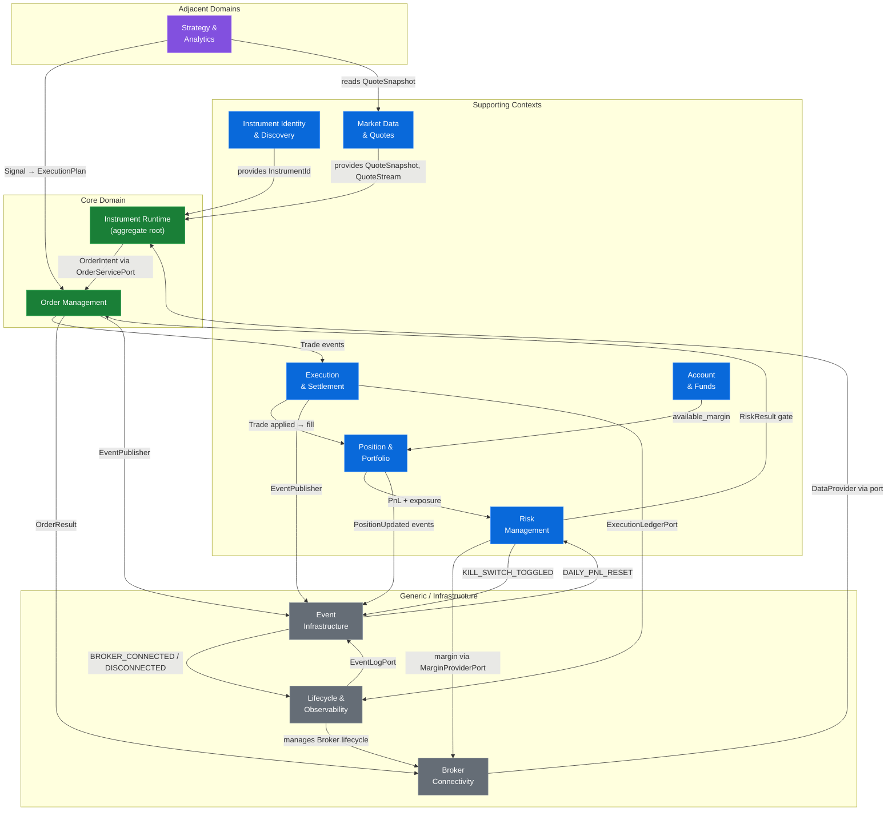

# D1.2 — Bounded Context Map

> **Phase 1 deliverable.** Maps every DDD bounded context in the TradeXV2
> domain layer, documents inter-context relationships, and identifies
> integration patterns.

---

## Context Map Diagram



---

## Integration Pattern Legend

| Pattern | Meaning |
|---|---|
| **Shared Kernel** | Two contexts share a common type set (e.g., `Money`, `InstrumentId`) |
| **Published Language** | Context A emits events consumed by Context B via the `EventPublisher` protocol |
| **Anti-Corruption Layer (ACL)** | Adapter layer translates external/broker data into canonical domain types |
| **Customer–Supplier** | Downstream context defines the contract; upstream supplies data |
| **Open Host Service** | Context exposes a well-defined `Protocol` port (e.g., `DataProvider`) |
| **Conformist** | Downstream context adopts upstream's model without transformation |

---

## Bounded Contexts

### 1. Instrument Identity & Discovery

| Aspect | Detail |
|---|---|
| **One-liner** | Canonical instrument identification, classification, and name resolution. |
| **Core Concern** | Provides `InstrumentId` — the universal key used by every other context. Classifies instruments by `AssetKind` (Equity, Future, Option, ETF, …). Handles exchange registration, display-name formatting, and parse/serialize lifecycle. |
| **Current Location** | `domain/instruments/instrument_id.py`, `domain/instruments/asset_kind.py`, `domain/instruments/display_names.py`, `domain/instruments/resolver.py`, `domain/symbols.py` |
| **Key Types** | `InstrumentId` (Value Object, frozen dataclass), `AssetKind` (Enum), `InstrumentRecord` / `Instrument` (adapter-level record), `normalize_symbol()`, `normalize_exchange()` |
| **Ports** | None directly — this is a foundational value-object context consumed by all others. |
| **Upstream Dependencies** | None (leaf context). |
| **Downstream Consumers** | Instrument Runtime, Market Data, Order Management, Execution, Position, Risk, Strategy, Broker Connectivity — essentially every context. |
| **Integration Pattern** | **Shared Kernel** — `InstrumentId` is the universal identity shared across all contexts. |

---

### 2. Instrument Runtime

| Aspect | Detail |
|---|---|
| **One-liner** | Rich, stateful instrument aggregate that owns live market state, trading methods, and streaming. |
| **Core Concern** | The `Instrument` class (and subclasses `Equity`, `Future`, `Option`, `Index`, `ETF`, `Commodity`, `Spot`, `Currency`) is the aggregate root that owns an `InstrumentState` (quote + depth + subscription status). Provides `buy()`, `sell()`, `limit()`, `market()`, `stop_loss()`, `cancel()`, `modify()`, `refresh()`, `depth()`, `option_chain()`, `future_chain()`, `history()`, `subscribe()`. Mixes in `InstrumentMarketDataMixin`, `InstrumentStreamingMixin`, `InstrumentTradingMixin`. |
| **Current Location** | `domain/instruments/instrument.py`, `domain/instruments/instrument_market_data.py`, `domain/instruments/instrument_trading.py`, `domain/instruments/instrument_streaming.py`, `domain/instruments/composition.py`, `domain/instruments/subscription.py`, `domain/instruments/event_hooks.py`, `domain/instruments/instrument_factory.py`, `domain/instruments/timeframes.py` |
| **Key Types** | `Instrument` (Aggregate Root), `Equity`, `ETF`, `Spot`, `Currency`, `Index`, `Future`, `Commodity`, `Option` (Subclasses), `InstrumentIdentity` (VO), `TradingSpec` (VO), `ExtensionManager`, `InstrumentState` (VO), `SubscriptionState` (VO) |
| **Ports** | Consumes: `DataProvider` (via `_resolve_provider()`), `OrderServicePort` (via `_resolve_order_service()`), `EventPublisher` |
| **Upstream Dependencies** | Instrument Identity (`InstrumentId`, `AssetKind`), Market Data (`QuoteSnapshot`, `MarketDepth`), Primitives (`Money`, `TickSize`), Value Objects (`InstrumentState`) |
| **Downstream Consumers** | Strategy & Analytics (holds references), Session / Universe (composition root wiring), Application OMS (via `OrderServicePort`) |
| **Integration Pattern** | **Customer–Supplier** — consumes `DataProvider` and `OrderServicePort` ports; the supplier contexts (Market Data, Order Management) define the contracts. |

---

### 3. Market Data & Quotes

| Aspect | Detail |
|---|---|
| **One-liner** | Real-time and historical market data: quotes, depth, streaming, and candles. |
| **Core Concern** | Provides `QuoteSnapshot`, `Quote`, `MarketDepth`, `QuoteStream`, `HistoricalBar`, `HistoricalSeries`, `MarketTick`. Handles tick ingestion, depth aggregation, batch quote fetching, and candle/bar construction. |
| **Current Location** | `domain/entities/market.py`, `domain/quotes/`, `domain/candles/`, `domain/value_objects/state.py` (`InstrumentState`, `SubscriptionState`), `domain/instruments/instrument_streaming.py` |
| **Key Types** | `QuoteSnapshot` (Value Object), `Quote` (Value Object), `MarketDepth` (Value Object), `MarketTick`, `DepthLevel`, `DepthKind` (Enum), `QuoteStream`, `HistoricalBar`, `HistoricalSeries` |
| **Ports** | `DataProvider` (Protocol — `get_quote()`, `get_depth()`, `get_history()`, `subscribe()`), `MarketDataPort` (Protocol — `history()`, `option_chain()`, `ltp()`) |
| **Upstream Dependencies** | Instrument Identity (`InstrumentId`), Primitives (`Money`, `Clock`) |
| **Downstream Consumers** | Instrument Runtime (embeds `InstrumentState` with quote/depth), Strategy & Analytics (reads quotes, candles, option chains), Risk (reads LTP for PnL), Portfolio (reads LTP for PnL updates) |
| **Integration Pattern** | **Open Host Service** — exposes `DataProvider` and `MarketDataPort` protocols that any consumer can use. |

---

### 4. Order Management

| Aspect | Detail |
|---|---|
| **One-liner** | Order lifecycle: intent → admission → placement → status tracking → cancellation. |
| **Core Concern** | Manages the full order lifecycle. `OrderIntent` (pre-risk desire) → `ExecutionPlan` (sizing + slicing + routing) → `OrderRequest` (wire format) → `Order` (canonical entity) → `OrderResult`. The `OrderServicePort` is the application spine that runs Risk → OMS → ExecutionProvider. |
| **Current Location** | `domain/orders/intent.py`, `domain/orders/execution_plan.py`, `domain/orders/placement.py`, `domain/orders/requests.py`, `domain/orders/sizing.py`, `domain/entities/order.py`, `domain/entities/order_lifecycle.py` |
| **Key Types** | `OrderIntent` / `TradingIntent` (Value Object), `ExecutionPlan` (Aggregate), `OrderSizing`, `SlicingPlan`, `SlicingAlgo` (Enum), `RoutingHint`, `PlanGuards`, `PlanContext`, `OrderRequest`, `ModifyOrderRequest`, `SliceOrderRequest`, `OrderPreview`, `Order` (Entity — frozen dataclass), `OrderAck`, `OrderResponse`, `OrderStatus` (Enum), `ORDER_STATUS_TRANSITIONS` |
| **Ports** | `OrderServicePort` (Protocol — `place()`, `cancel()`, `modify()`), `OrderStorePort` (Protocol — `upsert()`, `load_all()`) |
| **Upstream Dependencies** | Risk Management (`RiskResult` for pre-trade gate), Instrument Identity (`InstrumentId`), Instrument Runtime (`OrderServicePort`), Primitives (`Money`, `Quantity`) |
| **Downstream Consumers** | Execution & Settlement (receives placed orders), Event Infrastructure (emits `ORDER_PLACED`, `ORDER_UPDATED`, `ORDER_CANCELLED`, `ORDER_REJECTED`, `EXECUTION_PLAN_BUILT`, `ORDER_REQUESTED`), Position (order fills trigger position updates) |
| **Integration Pattern** | **Published Language** — emits order events that Execution and Position consume. **Customer–Supplier** — depends on `RiskManagerPort` for pre-trade checks. |

---

### 5. Execution & Settlement

| Aspect | Detail |
|---|---|
| **One-liner** | Fill collection, trade aggregation, execution ledger, and idempotency. |
| **Core Concern** | The `Execution` aggregate owns fills for a single order, computes running averages, notional, and remaining quantity. `Trade` entities represent individual fills. The execution ledger provides durable intent → outcome → fill recording for crash recovery. `ProcessedTradeRepositoryPort` ensures idempotent trade processing. |
| **Current Location** | `domain/executions/execution.py`, `domain/entities/trade.py`, `domain/execution_contracts.py`, `domain/ports/execution_ledger.py`, `domain/ports/event_log.py` (`ProcessedTradeRepositoryPort`, `DeadLetterQueuePort`), `domain/fill_reducer.py`, `domain/ledger_recovery.py` |
| **Key Types** | `Execution` (Aggregate Root), `Trade` (Entity — frozen dataclass), `LedgerFillRecord` (Value Object), `SubmissionOutcome` (Value Object), `SubmissionState` (Enum), `OrderIntent` (durable, distinct from orders.intent), `TradeIdKey` (Value Object) |
| **Ports** | `ExecutionLedgerPort` (Protocol — `record_intent()`, `record_outcome()`, `record_fill()`, `list_fills()`), `ProcessedTradeRepositoryPort` (Protocol — `is_processed()`, `mark_processed()`) |
| **Upstream Dependencies** | Order Management (`Order`, `Trade` entities, `OrderResult`), Event Infrastructure (`EventType`, `EventPublisher`), Primitives (`Money`, `Clock`) |
| **Downstream Consumers** | Position & Portfolio (fills update positions), Event Infrastructure (emits `TRADE_FILLED`, `TRADE_APPLIED`) |
| **Integration Pattern** | **Published Language** — emits `TRADE_APPLIED` events consumed by Position context. **Shared Kernel** — `Trade` entity is shared between Execution and Position. |

---

### 6. Position & Portfolio

| Aspect | Detail |
|---|---|
| **One-liner** | Position lifecycle, portfolio-level PnL, and exposure computation. |
| **Core Concern** | `Position` is the canonical entity tracking quantity, avg_price, unrealized/realized PnL per instrument. `PositionAggregate` wraps it with thread-safe lifecycle transitions. `Portfolio` is the aggregate root owning all positions, computing total PnL, gross exposure, per-symbol concentration. `PositionState` manages FLAT→OPEN→REDUCING→CLOSED→REVERSED transitions. |
| **Current Location** | `domain/entities/position.py`, `domain/aggregates/position.py`, `domain/portfolio/portfolio.py`, `domain/portfolio_projection.py`, `domain/entities/options.py` (`OptionChain`, `FutureChain`) |
| **Key Types** | `Position` (Entity — frozen dataclass), `Holding` (Entity), `PositionState` (Enum), `POSITION_STATE_TRANSITIONS`, `PositionAggregate` (Aggregate Root), `Portfolio` (Aggregate Root), `OptionChain`, `OptionStrike`, `OptionLeg`, `FutureChain`, `FutureContract`, `OptionContract` |
| **Ports** | None directly — Position and Portfolio are consumed via direct API, not protocol ports. |
| **Upstream Dependencies** | Primitives (`Money`, `Quantity`), Execution & Settlement (fills update positions), Market Data (LTP updates trigger unrealized PnL recomputation), Account (available margin) |
| **Downstream Consumers** | Risk Management (reads `Portfolio.gross_exposure`, `Portfolio.concentration()` for risk checks), Event Infrastructure (emits `POSITION_UPDATED`, `POSITION_OPENED`, `POSITION_CLOSED`, `PORTFOLIO_UPDATED`), Strategy (reads current positions) |
| **Integration Pattern** | **Shared Kernel** — `Position` entity is shared between Position context and Execution context. **Customer–Supplier** — Risk consumes Portfolio's exposure/comcentration data. |

---

### 7. Risk Management

| Aspect | Detail |
|---|---|
| **One-liner** | Pre-trade risk checks, circuit breakers, kill switch, and daily loss monitoring. |
| **Core Concern** | Composable risk policy framework: `RiskGate` chains `OrderNotionalLimit`, `ConcentrationLimit`, `GrossExposureLimit`. `DailyLossCircuitBreaker` is a stateful policy tracking cumulative intraday PnL. `KillSwitch` provides manual emergency stop. `RiskManagerPort` is the hexagonal boundary consumed by the Order context. `MarginProviderPort` delegates margin calculation to broker adapters. |
| **Current Location** | `domain/risk/policy.py`, `domain/risk/notional.py`, `domain/ports/risk_manager.py`, `domain/ports/margin_provider.py`, `domain/constants/risk.py` |
| **Key Types** | `RiskGate` (Value Object — composable policy chain), `RiskResult` (Value Object), `OrderNotionalLimit`, `ConcentrationLimit`, `GrossExposureLimit` (Value Objects), `DailyLossCircuitBreaker` (Stateful policy), `KillSwitch` (Mutable policy) |
| **Ports** | `RiskManagerPort` (Protocol — `check_order()`, `is_kill_switch_active()`, `get_status()`), `MarginProviderPort` (Protocol — `calculate_margin_for_order()`) |
| **Upstream Dependencies** | Position & Portfolio (reads `gross_exposure`, `concentration()`, PnL for circuit breaker), Account (reads `available_balance` for capital checks), Event Infrastructure (`KILL_SWITCH_TOGGLED`, `DAILY_PNL_RESET`, `DRAWDOWN_LIMIT_HIT`, `RISK_APPROVED`, `RISK_REJECTED`) |
| **Downstream Consumers** | Order Management (calls `RiskManagerPort.check_order()` before order admission), Instrument Runtime (via OMS wiring) |
| **Integration Pattern** | **Customer–Supplier** — Order Management is the customer that consumes `RiskManagerPort`. **Published Language** — emits risk events (`RISK_LIMIT_BREACHED`, `RISK_APPROVED`, `RISK_REJECTED`, `KILL_SWITCH_TOGGLED`). |

---

### 8. Account & Funds

| Aspect | Detail |
|---|---|
| **One-liner** | Account identity, balance, margin, and fund limits. |
| **Core Concern** | `Balance` (formerly `FundLimits`) is the canonical entity tracking available_balance, used_margin, total_margin, collateral. `AccountAggregate` wraps it with thread-safe updates and `has_sufficient()` query. |
| **Current Location** | `domain/entities/account.py`, `domain/aggregates/account.py` |
| **Key Types** | `Balance` / `FundLimits` (Entity — frozen dataclass), `AccountAggregate` (Aggregate Root) |
| **Ports** | None directly — consumed via direct API. |
| **Upstream Dependencies** | Primitives (`Money`), Broker Connectivity (balance fetched via `ExecutionProvider.get_funds()`) |
| **Downstream Consumers** | Risk Management (reads `available_balance` for capital-based checks), Portfolio (uses fund information), Order Management (margin check before placement) |
| **Integration Pattern** | **Conformist** — `Balance` model conforms to the broker's fund-limits response structure. |

---

### 9. Strategy & Analytics

| Aspect | Detail |
|---|---|
| **One-liner** | Market scanning, candidate generation, signal evaluation, and backtesting. |
| **Core Concern** | `Scanner` scans the universe for tradeable candidates. `StrategyEvaluator` evaluates candidates with pre-computed features and produces `SignalDTO`. `ExecutionPlan.from_signal()` converts signals into order intents. Supports backtesting via `OmsBacktestAdapterPort`. |
| **Current Location** | `domain/scanners/scanner.py`, `domain/ports/strategy_evaluator.py`, `domain/orders/execution_plan.py` (`PlanContext`, `ExecutionPlan.from_signal()`), `domain/models/trading.py` (`SignalDTO`, `CandidateDTO`), `domain/models/features.py` (`FeatureSet`), `domain/backtest/` |
| **Key Types** | `Scanner` (Abstract class), `ScannerResult`, `CandidateDTO`, `SignalDTO`, `FeatureSet`, `ExecutionPlan` (shared with Order Management) |
| **Ports** | `StrategyEvaluator` (Protocol — `evaluate_single()`), `OmsBacktestAdapterPort` (Protocol) |
| **Upstream Dependencies** | Market Data (`DataProvider`, `HistoricalBar`, `OptionChain`), Instrument Identity (`InstrumentId`) |
| **Downstream Consumers** | Order Management (receives `ExecutionPlan` → `OrderIntent`), Event Infrastructure (emits `SCAN_STARTED`, `CANDIDATE_GENERATED`, `SCAN_COMPLETED`, `SIGNAL_GENERATED`, `SIGNAL_EXECUTED`) |
| **Integration Pattern** | **Published Language** — emits scan/signal events. **Anti-Corruption Layer** — `ExecutionPlan.from_signal()` translates strategy signals into order-domain concepts. |

---

### 10. Event Infrastructure

| Aspect | Detail |
|---|---|
| **One-liner** | Domain event types, event bus, event log, and dead-letter queue. |
| **Core Concern** | Defines the canonical `DomainEvent` dataclass and the `EventType` enum (45+ event types). `EventPublisher` / `EventBusPort` protocols decouple publishers from subscribers. `EventLogPort` provides durable persistence and replay for crash recovery. `DeadLetterQueuePort` captures failed handler dispatches. |
| **Current Location** | `domain/events/types.py`, `domain/events/__init__.py`, `domain/ports/event_publisher.py`, `domain/ports/event_log.py` |
| **Key Types** | `DomainEvent` (Value Object), `EventType` (Enum — 45+ types), `EventPayload` (TypeAlias), `TypedDomainEvent`, `OrderUpdatedEvent`, `TradeFilledEvent`, `TradeAppliedEvent`, `QuoteUpdatedEvent`, `PositionClosedEvent`, `OrderRequestedEvent`, `OrderFilledEvent`, `ExecutionPlanBuiltEvent`, `TradeIdKey` |
| **Ports** | `EventPublisher` (Protocol — `publish()`, `subscribe()`), `EventBusPort` (extends with `replay_mode`, `logging_enabled`), `EventLogPort` (Protocol — `append()`, `replay()`, `flush()`), `DeadLetterQueuePort` (Protocol — `drain()`, `stats()`) |
| **Upstream Dependencies** | Primitives (`Clock` for event timestamps) |
| **Downstream Consumers** | Every context publishes to or consumes from the event bus. Order Management, Execution, Position, Risk, Lifecycle, Strategy, Instrument Runtime all emit events. |
| **Integration Pattern** | **Published Language** — the shared event vocabulary that all contexts use for asynchronous communication. |

---

### 11. Lifecycle & Observability

| Aspect | Detail |
|---|---|
| **One-liner** | Service lifecycle management, health checks, metrics, tracing, and alerting. |
| **Core Concern** | `LifecycleManagerPort` orchestrates start/stop of all managed services. `ManagedServicePort` is the contract for long-running services. Health checks produce `HealthStatus` snapshots. `MetricsRegistryPort`, `TracerPort`, `AlertingEnginePort`, `EventMetricsPort` provide observability hooks. |
| **Current Location** | `domain/ports/lifecycle.py`, `domain/ports/observability.py`, `domain/ports/metrics.py`, `domain/lifecycle_health.py`, `domain/stream_health.py` |
| **Key Types** | `ManagedServicePort` (Protocol), `LifecycleManagerPort` (Protocol), `HealthStatus`, `MetricsRegistryPort` (Protocol), `TracerPort` (Protocol), `AlertingEnginePort` (Protocol), `EventMetricsPort` (Protocol) |
| **Ports** | `ManagedServicePort`, `LifecycleManagerPort`, `MetricsRegistryPort`, `TracerPort`, `AlertingEnginePort`, `EventMetricsPort` |
| **Upstream Dependencies** | Event Infrastructure (health events, service events), Broker Connectivity (managed broker connections) |
| **Downstream Consumers** | Application layer (composition roots wire lifecycle), Broker Connectivity (services participate in lifecycle) |
| **Integration Pattern** | **Open Host Service** — `LifecycleManagerPort` is the single entry point that all managed services register with. |

---

### 12. Broker Connectivity

| Aspect | Detail |
|---|---|
| **One-liner** | Unified broker interface, provider registry, and connection lifecycle. |
| **Core Concern** | `BrokerAdapter` unifies `DataProvider` + `ExecutionProvider` + lifecycle (`authenticate()`, `close()`). `ProviderRegistry` manages multiple broker connections. Handles capability detection (`Capability` enum — 50+ capabilities), connection status (`ConnectionStatus`), and bootstrap (`BootstrapResult`). Each broker adapter (Dhan, Upstox) implements this interface internally. |
| **Current Location** | `domain/ports/broker_adapter.py`, `domain/ports/protocols.py` (`DataProvider`, `ExecutionProvider`), `domain/providers/registry.py`, `domain/capabilities/enums.py`, `domain/ports/bootstrap.py`, `domain/ports/broker_transport.py` |
| **Key Types** | `BrokerAdapter` (Protocol — composition of DataProvider + ExecutionProvider), `DataProvider` (Protocol), `ExecutionProvider` (Protocol), `OrderResult`, `SubscriptionHandle`, `ProviderRegistry`, `Capability` (Enum — 50+ values), `ConnectionStatus` (Enum), `BootstrapResult`, `BootstrapStatus`, `BrokerTransport` (Protocol) |
| **Ports** | `BrokerAdapter`, `DataProvider`, `ExecutionProvider`, `ProviderRegistry`, `BrokerTransport`, `BootstrapResult` |
| **Upstream Dependencies** | Instrument Identity (`InstrumentId`, `InstrumentRecord` for broker-native mapping), Market Data (`QuoteSnapshot`, `MarketDepth`, `OptionChain`, `FutureChain`), Order Management (`Order`, `OrderRequest`, `ModifyOrderRequest`), Position (`Position`), Account (`Balance`), Risk (`RiskManagerPort`) |
| **Downstream Consumers** | Instrument Runtime (resolves `DataProvider` for market queries), Strategy & Analytics (reads market data), Order Management (delegates execution), Lifecycle (managed connections) |
| **Integration Pattern** | **Anti-Corruption Layer** — broker adapters translate between wire protocols (Dhan/Upstox REST + WebSocket) and canonical domain types. **Open Host Service** — `DataProvider` and `ExecutionProvider` protocols are the public API. |

---

## Cross-Cutting Concerns

### Shared Value Objects (Shared Kernel)

These types are shared across multiple contexts and form the domain's foundational vocabulary:

| Type | Defined In | Used By |
|---|---|---|
| `Money` | `domain/primitives/value_objects.py` | All contexts |
| `Quantity` | `domain/primitives/value_objects.py` | Order, Execution, Position, Account |
| `Clock` | `domain/primitives/value_objects.py` | Events, Risk, Market Data |
| `InstrumentId` | `domain/instruments/instrument_id.py` | All contexts |
| `AssetKind` | `domain/instruments/asset_kind.py` | Instrument Identity, Instrument Runtime |
| `TickSize` | `domain/value_objects/money.py` | Instrument Runtime, Market Data |
| `Side` | `domain/enums.py` | Order, Execution, Position, Strategy |
| `OrderType` | `domain/enums.py` | Order, Strategy |
| `ProductType` | `domain/enums.py` | Order, Position, Strategy |

### Dependency Direction Summary

```
Strategy ──→ Order Management ──→ Risk Management
                │                       │
                ▼                       ▼
          Execution ──→ Position ──→ Account
                │                       ▲
                ▼                       │
        Event Infrastructure      Broker Connectivity
                ▲                       │
                │                       ▼
        Lifecycle & Observability  Market Data
                                        │
                                        ▼
                                  Instrument Identity
```

**Rule:** All dependency arrows point inward toward the core (Order Management, Instrument Runtime). Supporting contexts (Risk, Position, Account) depend on shared kernel types but not on each other cyclically. Generic contexts (Events, Lifecycle, Broker) are infrastructure that all contexts may depend on via ports.

---

## Migration Notes

1. **Instrument god-class decomposition:** The 819-line `Instrument` class in `instrument.py` mixes Market Data, Trading, and Streaming concerns. The mixin extraction (`InstrumentMarketDataMixin`, `InstrumentTradingMixin`, `InstrumentStreamingMixin`) is already in place — Phase 2 should complete the separation.

2. **Portfolio projection:** `domain/portfolio_projection.py` exists alongside `domain/portfolio/portfolio.py`. Consolidation into a single `Portfolio` aggregate is recommended.

3. **Dual OrderIntent:** `domain/orders/intent.py` (pre-risk, ephemeral) and `domain/execution_contracts.py` (durable ledger) both define `OrderIntent`. The naming should be disambiguated: `TradingIntent` (already aliased) vs `PersistedOrderIntent`.

4. **Service layer overlap:** `domain/services/` contains `OrderService`, `QuoteService`, `HistoryService`, `StreamingService`, `AnalyticsService`. These should be reconciled with the port-based architecture to avoid layering violations.

---

*Generated from source analysis on 2026-07-12.*
