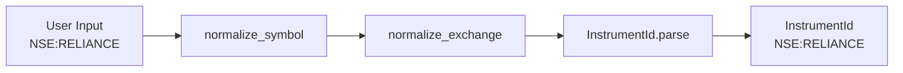
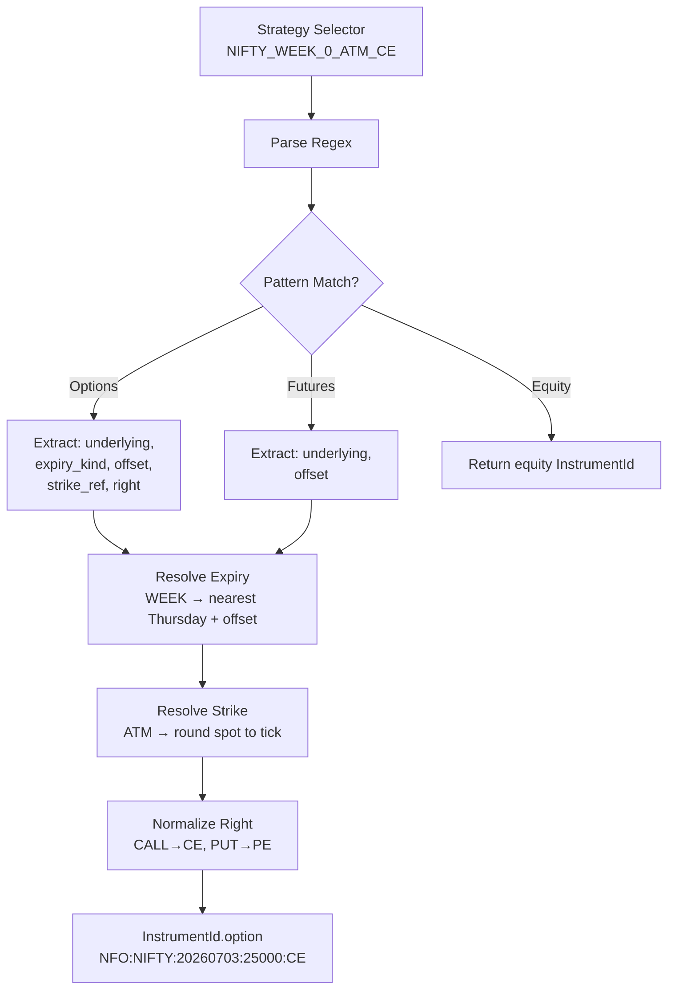
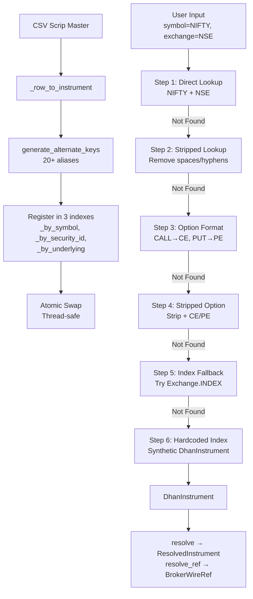
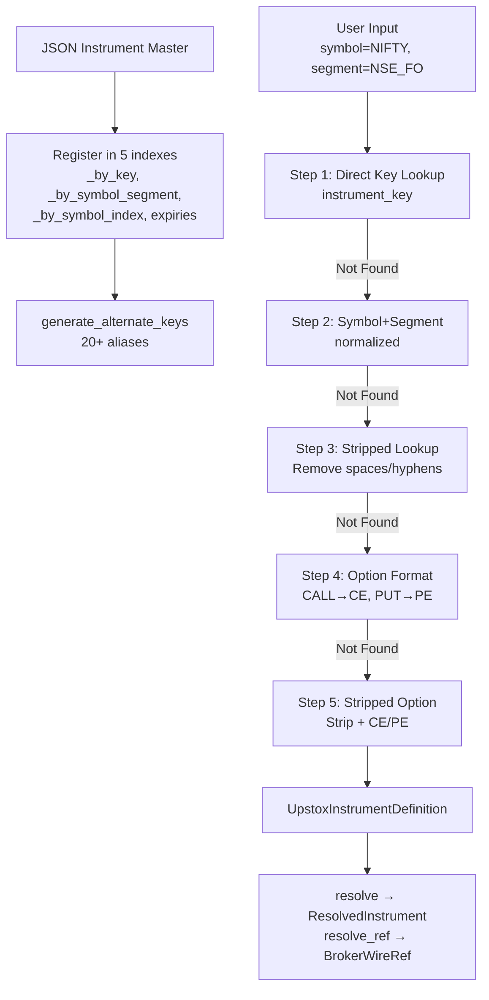
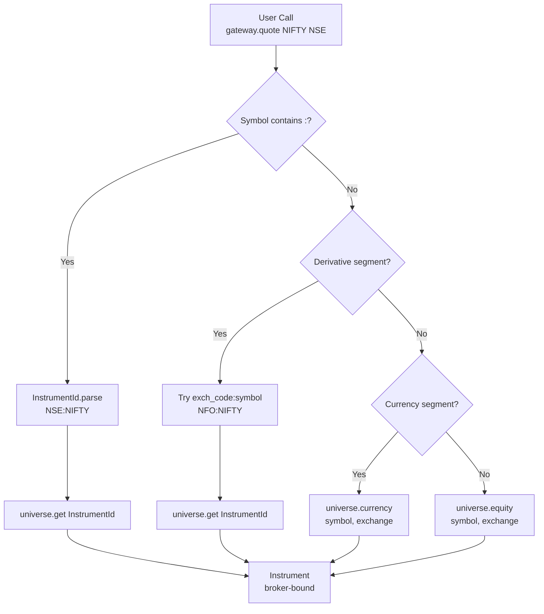
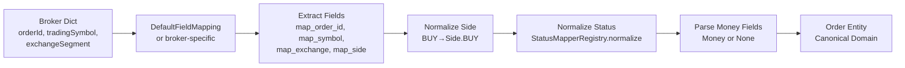
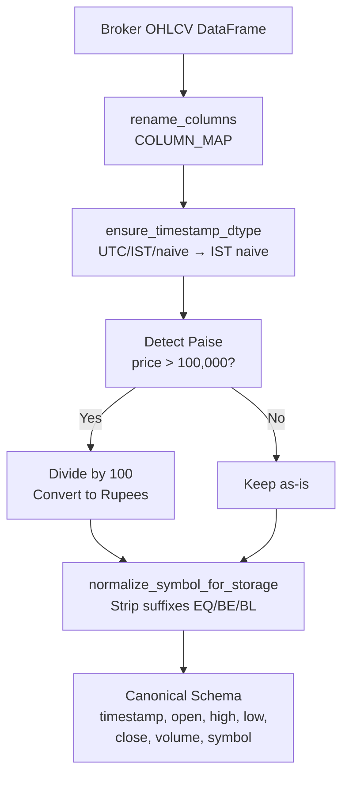
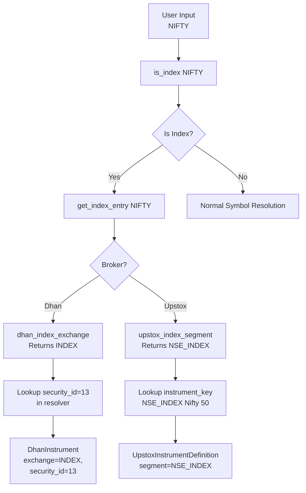

# Broker Symbol Mapping & Conversion — Architectural Reference Guide

**Version:** 1.0  
**Last Updated:** 2026-07-23  
**Scope:** Complete symbol mapping, conversion, and resolution architecture across all TradeXV2 layers

---

## Table of Contents

1. [Canonical Identity Layer (Domain)](#1-canonical-identity-layer-domain)
2. [Index Registry (Cross-Broker Single Source of Truth)](#2-index-registry-cross-broker-single-source-of-truth)
3. [Broker-Agnostic Instrument Registry (Infrastructure)](#3-broker-agnostic-instrument-registry-infrastructure)
4. [Common Broker Instrument Service Protocol](#4-common-broker-instrument-service-protocol)
5. [Dhan Provider — Full Resolution Pipeline](#5-dhan-provider--full-resolution-pipeline)
6. [Upstox Provider — Full Resolution Pipeline](#6-upstox-provider--full-resolution-pipeline)
7. [Broker Gateway — Unified Entry Point](#7-broker-gateway--unified-entry-point)
8. [Order Field Mapping & Status Normalization](#8-order-field-mapping--status-normalization)
9. [Datalake Normalization](#9-datalake-normalization)
10. [WebSocket Instrument Conversion](#10-websocket-instrument-conversion)
11. [End-to-End Flow Diagrams](#11-end-to-end-flow-diagrams)
12. [Complete Mapping Reference Tables](#12-complete-mapping-reference-tables)

---

## 1. Canonical Identity Layer (Domain)

### 1.1 InstrumentId — Universal Instrument Identity

**File:** `src/domain/instruments/instrument_id.py`

`InstrumentId` is the **single source of truth** for instrument identity across all internal modules: market data, scanner, strategy, risk, OMS, portfolio, replay, datalake, API, WebSocket, and broker adapters.

#### Canonical Format

```
EXCHANGE:UNDERLYING[:YYYYMMDD[:STRIKE[:RIGHT]]]
```

**Examples:**
- `NSE:RELIANCE` — equity
- `NSE:NIFTY` — index
- `NFO:NIFTY:20260730:FUT` — future
- `NFO:NIFTY:20260730:25000:CE` — option

#### Factory Methods

```python
InstrumentId.equity(exchange: str, symbol: str) -> InstrumentId
InstrumentId.index(exchange: str, name: str) -> InstrumentId
InstrumentId.etf(exchange: str, symbol: str) -> InstrumentId
InstrumentId.spot(exchange: str, symbol: str) -> InstrumentId
InstrumentId.currency(exchange: str, symbol: str) -> InstrumentId
InstrumentId.future(exchange: str, underlying: str, expiry: date, *, kind: str | AssetKind | None = None) -> InstrumentId
InstrumentId.commodity(exchange: str, underlying: str, expiry: date) -> InstrumentId
InstrumentId.option(exchange: str, underlying: str, expiry: date, strike: Decimal | float | int, right: str) -> InstrumentId
```

#### Parse/Serialize Round-Trip

**Serialize:** `__str__()` produces canonical string format  
**Parse:** `InstrumentId.parse(s: str) -> InstrumentId`

**Parse rules:**
- Split on `:` — minimum 2 parts required (EXCHANGE:UNDERLYING)
- Part 3: if 8 digits → expiry date (YYYYMMDD); if "FUT" → right="FUT"
- Part 4: if numeric → strike; if "FUT" → right="FUT"
- Part 5: right (CE/PE/FUT)
- If expiry present but no right → default right="FUT"

#### Asset Type Inference

```python
@property
def asset_type(self) -> str:
    if self.kind: return self.kind
    if self.right == "FUT": return AssetKind.FUTURES.value
    if self.right in ("CE", "PE"): return AssetKind.OPTIONS.value
    if self.underlying in ("NIFTY", "BANKNIFTY", "FINNIFTY", "SENSEX", "MIDCPNIFTY"):
        return AssetKind.INDEX.value
    return AssetKind.EQUITY.value
```

#### Valid Exchanges & Rights

```python
VALID_EXCHANGES: frozenset[str] = {"NSE", "BSE", "NFO", "MCX", "CDS"}
VALID_RIGHTS: frozenset[str] = {"CE", "PE", "FUT"}
```

Extra exchanges can be registered at composition root via `register_exchange(code)`.

---

### 1.2 Symbol Normalization

**File:** `src/domain/symbols.py`

**Single canonical function** for symbol normalization — replaces 128+ scattered `.upper().strip()` call sites.

```python
def normalize_symbol(symbol: str) -> str:
    """Normalize to canonical uppercase-stripped form."""
    return symbol.strip().upper()

def normalize_exchange(exchange: str) -> str:
    """Normalize exchange to canonical uppercase form."""
    return exchange.strip().upper()

def make_position_key(symbol: str, exchange: str) -> str:
    """Canonical position lookup key: SYMBOL:EXCHANGE"""
    return f"{normalize_symbol(symbol)}:{normalize_exchange(exchange)}"

def make_instrument_key(symbol: str, exchange: str) -> tuple[str, str]:
    """Canonical (symbol, exchange) tuple for instrument lookups."""
    return (normalize_symbol(symbol), normalize_exchange(exchange))
```

---

### 1.3 Market Enums

**File:** `src/domain/market_enums.py`

#### ExchangeSegment Enum

Canonical wire-format strings used in broker HTTP payloads:

```python
class ExchangeSegment(str, Enum):
    NSE = "NSE_EQ"
    BSE = "BSE_EQ"
    NSE_FNO = "NSE_FNO"
    BSE_FNO = "BSE_FNO"
    MCX = "MCXCOMM"
    NSE_CURRENCY = "NSE_CURRENCY"
    BSE_CURRENCY = "BSE_CURRENCY"
    IDX_I = "IDX_I"
```

#### Exchange Enum (Short Codes)

```python
class Exchange(str, Enum):
    NSE = "NSE"
    BSE = "BSE"
    NFO = "NFO"
    BFO = "BFO"
    MCX = "MCX"
    CDS = "CDS"
    INDEX = "INDEX"
```

#### ExchangeId Enum (Default Parameters)

```python
class ExchangeId(str, Enum):
    NSE = "NSE"
    NFO = "NFO"
    BSE = "BSE"
    MCX = "MCX"
    UNKNOWN = "UNKNOWN"
```

#### InstrumentType Enum

```python
class InstrumentType(str, Enum):
    EQUITY = "EQUITY"
    FUTURES = "FUTURES"
    FUTURE = "FUTURE"
    OPTIONS = "OPTIONS"
    OPTION = "OPTION"
    CURRENCY = "CURRENCY"
    COMMODITY = "COMMODITY"
    INDEX = "INDEX"
```

#### OptionType Enum

```python
class OptionType(str, Enum):
    CALL = "CALL"
    PUT = "PUT"
```

---

### 1.4 Exchange Segment Helpers

**File:** `src/domain/exchange_segments.py`

Single point of conversion between free-form exchange strings and canonical `ExchangeSegment` enum.

#### Alias Table (18 aliases)

```python
_ALIASES: dict[str, ExchangeSegment] = {
    "NSE": ExchangeSegment.NSE,
    "NSE_EQ": ExchangeSegment.NSE,
    "BSE": ExchangeSegment.BSE,
    "BSE_EQ": ExchangeSegment.BSE,
    "MCX": ExchangeSegment.MCX,
    "MCXCOMM": ExchangeSegment.MCX,
    "MCX_COMM": ExchangeSegment.MCX,
    "NSE_FNO": ExchangeSegment.NSE_FNO,
    "NFO": ExchangeSegment.NSE_FNO,
    "BSE_FNO": ExchangeSegment.BSE_FNO,
    "BFO": ExchangeSegment.BSE_FNO,
    "NSE_CURRENCY": ExchangeSegment.NSE_CURRENCY,
    "CDS": ExchangeSegment.NSE_CURRENCY,
    "BSE_CURRENCY": ExchangeSegment.BSE_CURRENCY,
    "BCD": ExchangeSegment.BSE_CURRENCY,
    "IDX_I": ExchangeSegment.IDX_I,
    "INDEX": ExchangeSegment.IDX_I,
}
```

#### Short Exchange Codes

```python
_EXCHANGE_SHORT: dict[ExchangeSegment, str] = {
    ExchangeSegment.NSE: "NSE",
    ExchangeSegment.BSE: "BSE",
    ExchangeSegment.NSE_FNO: "NFO",
    ExchangeSegment.BSE_FNO: "BFO",
    ExchangeSegment.MCX: "MCX",
    ExchangeSegment.NSE_CURRENCY: "CDS",
    ExchangeSegment.BSE_CURRENCY: "BCD",
    ExchangeSegment.IDX_I: "IDX",
}
```

#### Classification Helpers

```python
def is_equity_segment(segment: str | ExchangeSegment) -> bool
def is_derivative_segment(segment: str | ExchangeSegment) -> bool
def is_currency_segment(segment: str | ExchangeSegment) -> bool
def is_commodity_segment(segment: str | ExchangeSegment) -> bool
def parse_segment(value: str | ExchangeSegment, *, default: ExchangeSegment | None = None) -> ExchangeSegment | None
def wire_value(segment: str | ExchangeSegment) -> str
def canonical_exchange_short(segment: str | ExchangeSegment) -> str
```

---

### 1.5 InstrumentRecord (Broker-Adapter Data Record)

**File:** `src/domain/entities/instrument_record.py`

Broker-adapter-level instrument master data — NOT the rich domain object. Application code uses `Instrument` from `domain.instruments.instrument`.

```python
@dataclass(slots=True, frozen=True)
class InstrumentRecord:
    symbol: str
    exchange: str
    security_id: str
    instrument_type: str
    lot_size: int = 1
    tick_size: Decimal = DEFAULT_TICK_SIZE
    name: str | None = None
    option_type: str | None = None
    strike_price: Decimal | None = None
    expiry: str | None = None
    underlying: str | None = None
    canonical_symbol: str | None = None
```

---

### 1.6 Strategy DSL Resolver

**File:** `src/domain/instrument_resolver.py`

Converts high-level symbolic selectors to concrete `InstrumentId`.

#### DSL Grammar

**Options:**
```
UNDERLYING_(WEEK|MONTH)_OFFSET_STRIKE_REF_RIGHT
```

**Examples:**
- `NIFTY_WEEK_0_ATM_CE` → nearest weekly ATM call
- `BANKNIFTY_MONTH_1_ATM_PE` → next monthly ATM put
- `NIFTY_WEEK_0_OTM1_CE` → 1 strike OTM call

**Futures:**
```
UNDERLYING_FUT_(CURRENT|OFFSET)
```

**Examples:**
- `NIFTY_FUT_CURRENT` → current week future
- `NIFTY_FUT_0` → nearest future (offset 0)

**Equity/Index passthrough:**
- `RELIANCE` → `NSE:RELIANCE`

#### Strike Reference Syntax

- `ATM` — at-the-money (requires spot price)
- `OTM1`, `OTM2`, ... — N strikes out-of-the-money
- `ITM1`, `ITM2`, ... — N strikes in-the-money
- `24000`, `25000`, ... — explicit numeric strike

#### Resolution Flow

**Input:** `"NIFTY_WEEK_0_ATM_CE"`, `spot=25000`  
**Output:** `InstrumentId(NFO, NIFTY, expiry=20260703, strike=25000, right=CE)`

**Steps:**
1. Parse regex pattern
2. Resolve expiry (WEEK → nearest Thursday + offset weeks; MONTH → last Thursday of month + offset months)
3. Resolve strike (ATM → round spot to nearest tick; OTM/ITM → base +/- steps * tick)
4. Normalize right (CALL→CE, PUT→PE)
5. Construct `InstrumentId.option()`

---

## 2. Index Registry (Cross-Broker Single Source of Truth)

**File:** `src/config/indices.py`

Both Dhan and Upstox resolve indices differently from equities. This module provides a **broker-agnostic registry** that both adapters query.

### 2.1 IndexEntry Dataclass

```python
@dataclass(frozen=True)
class _IndexEntry:
    canonical_name: str           # User-facing name (e.g. "NIFTY 50")
    dhan_exchange: str = "INDEX"  # Dhan exchange value
    dhan_segment: str = "IDX_I"   # Dhan segment code
    dhan_security_id: str | None  # Dhan numeric security ID
    upstox_segment: str = ""      # Upstox segment (e.g. "NSE_INDEX")
    upstox_name: str = ""         # Upstox instrument key suffix
```

### 2.2 Index Symbol Registry (35+ indices)

**NSE Indices:**

| Symbol | Canonical Name | Dhan Security ID | Upstox Segment | Upstox Name |
|--------|----------------|------------------|----------------|-------------|
| NIFTY | NIFTY 50 | 13 | NSE_INDEX | Nifty 50 |
| NIFTY50 | NIFTY 50 | 13 | NSE_INDEX | Nifty 50 |
| BANKNIFTY | NIFTY BANK | 25 | NSE_INDEX | Nifty Bank |
| NIFTYBANK | NIFTY BANK | 25 | NSE_INDEX | Nifty Bank |
| FINNIFTY | NIFTY FINANCIAL SERVICES | 27 | NSE_INDEX | Nifty Fin Service |
| NIFTYFIN | NIFTY FINANCIAL SERVICES | 27 | NSE_INDEX | Nifty Fin Service |
| MIDCAPNIFTY | NIFTY MIDCAP 100 | — | NSE_INDEX | Nifty Midcap 100 |
| NIFTYMIDCAP | NIFTY MIDCAP 100 | — | NSE_INDEX | Nifty Midcap 100 |
| NIFTYIT | NIFTY IT | — | NSE_INDEX | Nifty IT |
| NIFTYPHARMA | NIFTY PHARMA | — | NSE_INDEX | Nifty Pharma |
| NIFTYAUTO | NIFTY AUTO | — | NSE_INDEX | Nifty Auto |
| NIFTYFMCG | NIFTY FMCG | — | NSE_INDEX | Nifty FMCG |
| NIFTYMETAL | NIFTY METAL | — | NSE_INDEX | Nifty Metal |
| NIFTYREALTY | NIFTY REALTY | — | NSE_INDEX | Nifty Realty |
| NIFTYENERGY | NIFTY ENERGY | — | NSE_INDEX | Nifty Energy |
| NIFTYMEDIA | NIFTY MEDIA | — | NSE_INDEX | Nifty Media |
| NIFTYPSB | NIFTY PSU BANK | — | NSE_INDEX | Nifty PSU Bank |
| NIFTYPVTBANK | NIFTY PRIVATE BANK | — | NSE_INDEX | Nifty Pvt Bank |
| NIFTYCONS | NIFTY CONSUMER DURABLES | — | NSE_INDEX | Nifty Consumer Durables |
| NIFTYOILGAS | NIFTY OIL AND GAS | — | NSE_INDEX | Nifty Oil and Gas |
| NIFTYCOMM | NIFTY COMMODITIES | — | NSE_INDEX | Nifty Commodities |
| NIFTYIND | NIFTY INDUSTRIALS | — | NSE_INDEX | Nifty Industrials |
| NIFTYMNC | NIFTY MNC | — | NSE_INDEX | Nifty MNC |
| NIFTYSMALL | NIFTY SMALLCAP 250 | — | NSE_INDEX | Nifty Smallcap 250 |
| NIFTYMICRO | NIFTY MICROCAP 250 | — | NSE_INDEX | Nifty Microcap 250 |
| NIFTYNEXT50 | NIFTY NEXT 50 | — | NSE_INDEX | Nifty Next 50 |
| NIFTY100 | NIFTY 100 | — | NSE_INDEX | Nifty 100 |
| NIFTY200 | NIFTY 200 | — | NSE_INDEX | Nifty 200 |
| NIFTY500 | NIFTY 500 | — | NSE_INDEX | Nifty 500 |
| VXNIFTY | NIFTY VOLATILITY | — | NSE_INDEX | India VIX |
| INDIAVIX | INDIA VIX | — | NSE_INDEX | India VIX |

**BSE Indices:**

| Symbol | Canonical Name | Dhan Security ID | Upstox Segment | Upstox Name |
|--------|----------------|------------------|----------------|-------------|
| SENSEX | SENSEX | — | BSE_INDEX | SENSEX |
| BSESENSEX | SENSEX | — | BSE_INDEX | SENSEX |
| BSE100 | BSE 100 | — | BSE_INDEX | BSE 100 |
| BSE200 | BSE 200 | — | BSE_INDEX | BSE 200 |
| BSE500 | BSE 500 | — | BSE_INDEX | BSE 500 |
| BSEMIDCAP | BSE MIDCAP | — | BSE_INDEX | BSE Midcap |
| BSESMALLCAP | BSE SMALLCAP | — | BSE_INDEX | BSE Smallcap |

**Global Indices (Upstox only):**

| Symbol | Canonical Name | Upstox Segment | Upstox Name |
|--------|----------------|----------------|-------------|
| DOW | DOW JONES | GLOBAL_INDEX | DOW JONES |
| NASDAQ | NASDAQ | GLOBAL_INDEX | NASDAQ |
| S&P500 | S&P 500 | GLOBAL_INDEX | S&P 500 |

### 2.3 F&O Exchange Routing

```python
INDEX_TO_FNO_EXCHANGE: dict[str, str] = {
    "NIFTY": "NFO",
    "BANKNIFTY": "NFO",
    "FINNIFTY": "NFO",
    "SENSEX": "BFO",
}
```

### 2.4 Public API

```python
def is_index(symbol: str) -> bool
def get_index_entry(symbol: str) -> _IndexEntry | None
def dhan_index_exchange(symbol: str) -> str | None
def upstox_index_segment(symbol: str) -> str | None
def index_upstox_key(symbol: str) -> str | None  # e.g. "NSE_INDEX|Nifty 50"
def list_indices() -> list[dict[str, str]]
```

---

## 3. Broker-Agnostic Instrument Registry (Infrastructure)

### 3.1 InstrumentRegistry

**File:** `src/infrastructure/instruments.py`

Dual-index broker-agnostic instrument registry.

#### Symbol Normalization

```python
def _normalize_instrument_symbol(symbol: str) -> str:
    """Normalize: uppercase, strip, remove exchange suffixes, reject path traversal."""
    # Suffix pattern: EQ, BE, BL, BZ, MC, NC, NZ, SM, SO, TT
    _SUFFIX_PATTERN = re.compile(r"[-_](EQ|BE|BL|BZ|MC|NC|NZ|SM|SO|TT)\s*$", re.IGNORECASE)
```

**Normalization steps:**
1. Strip whitespace, uppercase
2. Reject path-traversal characters (`/`, `\`, `..`, null byte)
3. Remove exchange suffixes (e.g. `RELIANCE-EQ` → `RELIANCE`)

#### Dual Index Design

```python
class InstrumentRegistry:
    _by_key: dict[tuple[str, str], InstrumentRecord]
    # Key: (normalized_symbol, normalized_exchange)
    
    _by_broker_identifier: dict[tuple[str, str], InstrumentRecord]
    # Key: (broker_identifier, normalized_exchange)
```

#### API

```python
def register(instrument: InstrumentRecord) -> None
def resolve(symbol: str, exchange: str) -> InstrumentRecord | None
def require(symbol: str, exchange: str) -> InstrumentRecord
def broker_identifier(symbol: str, exchange: str) -> str
def resolve_by_broker_identifier(broker_identifier: str, exchange: str) -> InstrumentRecord | None
def canonical_symbol(broker_identifier: str, exchange: str) -> str
def all() -> list[InstrumentRecord]
```

**Example:**
- Input: `("RELIANCE-EQ", "NSE")`
- Normalize: `("RELIANCE", "NSE")`
- Lookup in `_by_key`
- Output: `InstrumentRecord(symbol="RELIANCE", exchange="NSE", security_id="2885", ...)`

### 3.2 SymbolRegistry (Runtime Coordinator)

**File:** `src/brokers/runtime/symbol_registry.py`

Thin coordinator wrapping `InstrumentRegistry` for runtime use.

```python
class SymbolRegistry:
    def __init__(self, registry: InstrumentRegistry | None = None) -> None
    def lookup(self, instrument_id: InstrumentId) -> Any | None
    def register(self, instrument_id: InstrumentId, broker_symbol: Any) -> None
```

---

## 4. Common Broker Instrument Service Protocol

### 4.1 BrokerInstrumentService Protocol

**File:** `src/brokers/common/instruments/service.py`

Every broker must implement this Protocol.

```python
@runtime_checkable
class BrokerInstrumentService(Protocol):
    def load(self, source: str | None = None, *, force_refresh: bool = False) -> LoadStats
    def resolve(self, symbol: str, exchange: str) -> ResolvedInstrument
    def resolve_ref(self, symbol: str, exchange: str, *, expected_segment: str | None = None) -> BrokerWireRef
    def search(self, query: str, exchange: str | None = None) -> list[ResolvedInstrument]
```

**Contract:**
- `load()` — load/refresh instrument master into in-memory resolver
- `resolve()` — resolve to canonical record (no wire identifiers) — gateways call this
- `resolve_ref()` — resolve to opaque broker-wire reference — only broker connections/adapters call this
- `search()` — fuzzy search by symbol prefix

### 4.2 Data Carriers

**File:** `src/brokers/common/instruments/carrier.py`

#### LoadStats

```python
@dataclass(frozen=True)
class LoadStats:
    total: int = 0
    skipped: int = 0
    skip_rate: float = 0.0
    source: str = "cached"
```

#### ResolvedInstrument (Broker-Agnostic Canonical Record)

```python
@dataclass(frozen=True)
class ResolvedInstrument:
    symbol: str
    exchange: str
    instrument_type: str = "EQUITY"
    lot_size: int = 1
    tick_size: Decimal = Decimal("0.05")
    expiry: str | None = None
    strike: Decimal | None = None
    option_type: str | None = None
    underlying: str | None = None
    canonical_symbol: str | None = None
    name: str | None = None
```

**This is what gateways and domain code see.** No broker wire identifiers.

#### BrokerWireRef (Opaque Broker-Native Payload)

```python
@dataclass(frozen=True)
class BrokerWireRef:
    symbol: str
    exchange: str
    wire: dict[str, Any]  # Broker-native payload fragment
    
    def require(self, key: str) -> Any
```

**Gateways must NEVER read `wire` contents** — only the broker connection/adapter that builds the broker payload may.

**Dhan wire format:**
```python
BrokerWireRef(
    symbol="RELIANCE",
    exchange="NSE",
    wire={"exchange_segment": "NSE_EQ", "security_id": "2885"}
)
```

**Upstox wire format:**
```python
BrokerWireRef(
    symbol="RELIANCE",
    exchange="NSE",
    wire={"instrument_key": "NSE_EQ|INE002A01018"}
)
```

### 4.3 Alternate Key Generator (Zero-Parity)

**File:** `src/brokers/common/instruments/keys.py`

**Single source of truth** for symbol alias generation — Dhan and Upstox resolvers both call this, ensuring zero-parity (no drift).

```python
def generate_alternate_keys(
    symbol: str,
    inst_type: str | Any,
    expiry: str | None,
    strike: Any,
    option_type: Any,
    underlying: str | None,
    canonical_symbol: str | None,
    sm_symbol_name: str | None = None,
) -> list[str]
```

**Generates 20+ alias forms per instrument:**

**For options:**
- Primary symbol (normalized)
- Canonical symbol (normalized)
- Canonical with CALL→CE, PUT→PE
- Stripped (no spaces/hyphens/underscores)
- SM_SYMBOL_NAME (if provided)
- Spaced forms: `NIFTY 26 JUN 25 25000 CE`, `NIFTY 26 JUN 2025 25000 CE`
- Compact forms: `NIFTY26JUN2525000CE`, `NIFTY26JUN202525000CE`
- CALL/PUT forms: `NIFTY 26 JUN 25 25000 CALL`
- Dhan compact: `NIFTY25JUN2625000CE` (YY+month_char+DD)

**For futures:**
- `NIFTY JUN FUT`, `NIFTY 25 JUN FUT`, `NIFTY 2025 JUN FUT`, `NIFTY 26 JUN FUT`
- `NIFTYFUT`, `NIFTYJUNFUT`, `NIFTY25JUNFUT`, `NIFTY2025JUNFUT`, `NIFTY26JUNFUT`

**Deduplication:** All keys normalized and deduplicated before return.

---

## 5. Dhan Provider — Full Resolution Pipeline

### 5.1 DhanInstrument (Broker-Local DTO)

**File:** `src/brokers/providers/dhan/_dhan_types.py`

```python
@dataclass(frozen=True)
class DhanInstrument:
    domain_instrument: InstrumentRecord  # Composition
    exchange: Exchange
    instrument_type: InstrumentType
    option_type: OptionType | None = None
    sm_symbol_name: str | None = None
    exch_instrument_type: str | None = None
    
    # Properties delegate to domain_instrument
    @property
    def symbol(self) -> str
    @property
    def security_id(self) -> str
    @property
    def lot_size(self) -> int
    @property
    def tick_size(self) -> Decimal
    @property
    def strike_price(self) -> Decimal | None
    @property
    def expiry(self) -> str | None
    @property
    def underlying(self) -> str | None
    @property
    def canonical_symbol(self) -> str | None
    
    @property
    def is_option(self) -> bool
    @property
    def is_future(self) -> bool
    @property
    def is_equity_share(self) -> bool  # exch_instrument_type == "ES"
```

### 5.2 Segment Mapping

**File:** `src/brokers/providers/dhan/segments.py`

#### Dhan Wire Format Mapping

```python
_DHAN_WIRE: dict[ExchangeSegment, str] = {
    ExchangeSegment.NSE: "NSE_EQ",
    ExchangeSegment.BSE: "BSE_EQ",
    ExchangeSegment.NSE_FNO: "NSE_FNO",
    ExchangeSegment.BSE_FNO: "BSE_FNO",
    ExchangeSegment.MCX: "MCX_COMM",  # Dhan uses underscore
    ExchangeSegment.NSE_CURRENCY: "NSE_CURRENCY",
    ExchangeSegment.BSE_CURRENCY: "BSE_CURRENCY",
    ExchangeSegment.IDX_I: "IDX_I",
}
```

#### Exchange Short Codes

```python
_EXCHANGE_SHORT: dict[ExchangeSegment, str] = {
    ExchangeSegment.NSE: "NSE",
    ExchangeSegment.BSE: "BSE",
    ExchangeSegment.NSE_FNO: "NFO",
    ExchangeSegment.BSE_FNO: "BFO",
    ExchangeSegment.MCX: "MCX",
    ExchangeSegment.NSE_CURRENCY: "CDS",
    ExchangeSegment.BSE_CURRENCY: "BCD",
    ExchangeSegment.IDX_I: "INDEX",
}
```

#### Bidirectional Segment ↔ Exchange

```python
EXCHANGE_TO_SEGMENT: dict[str, str]  # e.g. "NSE" -> "NSE_EQ"
SEGMENT_TO_EXCHANGE: dict[str, str]  # e.g. "NSE_EQ" -> "NSE"
```

#### SDK Numeric Codes (WebSocket Binary Protocol)

```python
NUMERIC_TO_SEGMENT: dict[int, str] = {
    0: "IDX_I",
    1: "NSE_EQ",
    2: "NSE_FNO",
    3: "NSE_CURRENCY",
    4: "BSE_EQ",
    5: "MCX_COMM",
    7: "BSE_CURRENCY",
    8: "BSE_FNO",
}

SEGMENT_TO_NUMERIC: dict[str, int]  # Reverse mapping
```

#### DhanSegmentMapper

```python
class DhanSegmentMapper:
    broker_id = "dhan"
    
    def to_wire(self, segment: ExchangeSegment) -> str
    def from_wire(self, wire: str) -> ExchangeSegment
    def from_exchange(self, exchange: str) -> ExchangeSegment
```

### 5.3 SymbolResolver (O(1) Thread-Safe)

**File:** `src/brokers/providers/dhan/resolver.py`

#### Triple Index Design

```python
class SymbolResolver:
    _by_symbol: dict[tuple[str, Exchange], DhanInstrument]
    # Key: (normalized_symbol, Exchange enum)
    
    _by_security_id: dict[str, DhanInstrument]
    # Key: security_id string
    
    _by_underlying: dict[tuple[str, Exchange], list[DhanInstrument]]
    # Key: (underlying_symbol, Exchange) → list of futures/options sorted by expiry
```

#### Load Flow (CSV Scrip Master)

**Input:** Dhan CSV row with columns:
- `SEM_TRADING_SYMBOL` — trading symbol (e.g. "RELIANCE-EQ")
- `SEM_SMST_SECURITY_ID` — numeric security ID (e.g. "2885")
- `SEM_EXM_EXCH_ID` — exchange segment code (e.g. "NSE_EQ")
- `SEM_INSTRUMENT_NAME` — instrument type (e.g. "EQUITY", "OPTIDX", "FUTSTK")
- `SEM_LOT_UNITS` — lot size
- `SEM_TICK_SIZE` — tick size
- `SEM_EXPIRY_DATE` — expiry date (for options/futures)
- `SEM_OPTION_TYPE` — "CE"/"PE" (for options)
- `SEM_STRIKE_PRICE` — strike (for options)
- `SEM_CUSTOM_SYMBOL` — custom symbol override
- `SM_SYMBOL_NAME` — authoritative underlying name from Dhan
- `SEM_EXCH_INSTRUMENT_TYPE` — "ES" (Equity Share), "DEB" (Bond), etc.

**Processing:**
1. Parse row → `DhanInstrument` via `_row_to_instrument()`
2. Generate alternate keys via `generate_alternate_keys()`
3. Register all alternate keys in `_by_symbol` dict
   - Preference rules: EQUITY/FUTURE over OPTION; nearest active future over expired; equity share over bond
4. Register in `_by_security_id` dict
5. If future, register in `_by_underlying` dict
6. Atomic swap of all 3 indexes (thread-safe)

**Output:** `LoadStats(total, skipped, skip_rate)`

#### Type Mapping

```python
_NAME_TO_TYPE: dict[str, InstrumentType] = {
    "EQUITY": InstrumentType.EQUITY,
    "INDEX": InstrumentType.EQUITY,
    "OPTIDX": InstrumentType.OPTION,
    "OPTSTK": InstrumentType.OPTION,
    "OPTCUR": InstrumentType.OPTION,
    "OPTFUT": InstrumentType.OPTION,
    "OPTCOM": InstrumentType.OPTION,
    "FUTIDX": InstrumentType.FUTURE,
    "FUTSTK": InstrumentType.FUTURE,
    "FUTCUR": InstrumentType.FUTURE,
    "FUTCOM": InstrumentType.FUTURE,
}

_DHAN_OPTION_TYPE: dict[str, OptionType] = {
    "CE": OptionType.CALL,
    "CALL": OptionType.CALL,
    "PE": OptionType.PUT,
    "PUT": OptionType.PUT,
}
```

#### Resolve Flow (6-Step Progressive Fallback)

**Input:** `symbol="NIFTY"`, `exchange="NSE"`

**Steps:**

1. **Direct lookup:** `(normalize_symbol(symbol), Exchange(exchange))`
   - Try `("NIFTY", Exchange.NSE)`
   
2. **Stripped lookup:** Remove spaces, hyphens, underscores
   - Try `("NIFTY".replace(" ", "").replace("-", "").replace("_", ""), Exchange.NSE)`

3. **Option format standardization:** CALL→CE, PUT→PE
   - If symbol ends with "CALL" → replace with "CE"
   - If symbol ends with "PUT" → replace with "PE"
   - Try lookup again

4. **Stripped option format lookup:** Strip + CE/PE
   - Try lookup again

5. **Index fallback:** If symbol is a known index, try `Exchange.INDEX`
   - Check `config.indices.is_index(symbol)`
   - Try `("NIFTY", Exchange.INDEX)`
   - Also try stripped form

6. **Hardcoded index fallback:** Create synthetic `DhanInstrument` from `config.indices`
   - Get `_IndexEntry` for symbol
   - If entry has `dhan_security_id`, create synthetic instrument
   - Guard: if `expected_segment` is derivative, raise error (index ≠ derivative)
   - Return `DhanInstrument(domain_instrument=InstrumentRecord(...), exchange=Exchange.INDEX, instrument_type=InstrumentType.EQUITY)`

**Output:** `DhanInstrument` or raise `InstrumentNotFoundError`

### 5.4 DhanInstrumentService

**File:** `src/brokers/providers/dhan/instruments/service.py`

```python
class DhanInstrumentService:
    def load(self, source: str | None = None, *, force_refresh: bool = False) -> LoadStats
    def resolve(self, symbol: str, exchange: str) -> ResolvedInstrument
    def resolve_ref(self, symbol: str, exchange: str, *, expected_segment: str | None = None) -> BrokerWireRef
```

**`resolve()` flow:**
1. Call `SymbolResolver.resolve(symbol, exchange)` → `DhanInstrument`
2. Extract fields from `domain_instrument`
3. Return `ResolvedInstrument(symbol, exchange, instrument_type, lot_size, tick_size, expiry, strike, option_type, underlying, canonical_symbol, name)`

**`resolve_ref()` flow:**
1. Call `SymbolResolver.resolve(symbol, exchange, expected_segment=expected_segment)` → `DhanInstrument`
2. Build wire payload: `{"exchange_segment": exchange_segment, "security_id": security_id}`
3. Return `BrokerWireRef(symbol, exchange, wire)`

---


## 6. Upstox Provider — Full Resolution Pipeline

### 6.1 UpstoxInstrumentDefinition (Pydantic Model)

**File:** `src/brokers/providers/upstox/instruments/definition.py`

```python
class UpstoxInstrumentDefinition(BaseModel):
    instrument_key: str = ""           # Wire format: "NSE_FO|NIFTY22MAY2524000CE"
    exchange: str = ""
    exchange_segment: str = ""         # "NSE_EQ", "NSE_FO", "MCX_FUT", "NSE_INDEX"
    instrument_type: str = ""          # "EQ", "FUTIDX", "OPTIDX"
    symbol: str = ""                   # Canonical: "NIFTY22MAY2524000CE"
    trading_symbol: str = ""           # Display: "NIFTY 22 MAY 25 24000 CE"
    name: str = ""
    isin: str = ""
    lot_size: int = 0
    tick_size: float = 0.0
    expiry: str | None = None
    strike: float | None = None
    option_type: str | None = None
    underlying_key: str | None = None
    underlying_symbol: str | None = None
    freeze_qty: int | None = None
    minimum_lot: int | None = None
    short_name: str | None = None
    company_name: str | None = None
```

### 6.2 Segment Mapper (Bidirectional)

**File:** `src/brokers/providers/upstox/instruments/segment_mapper.py`

#### Upstox Wire → Canonical Segment

```python
_UPSTOX_TO_SEGMENT: dict[str, ExchangeSegment] = {
    "NSE_EQ": ExchangeSegment.NSE,
    "BSE_EQ": ExchangeSegment.BSE,
    "NSE_FO": ExchangeSegment.NSE_FNO,
    "BSE_FO": ExchangeSegment.BSE_FNO,
    "NCD_FO": ExchangeSegment.NSE_CURRENCY,
    "BCD_FO": ExchangeSegment.BSE_CURRENCY,
    "MCX_FO": ExchangeSegment.MCX,
    "MCX_COMM": ExchangeSegment.MCX,
    "NSE_COM": ExchangeSegment.MCX,
    "NSE_INDEX": ExchangeSegment.IDX_I,
    "BSE_INDEX": ExchangeSegment.IDX_I,
    "MCX_INDEX": ExchangeSegment.IDX_I,
    "GLOBAL_INDEX": ExchangeSegment.IDX_I,
    "UNKNOWN": ExchangeSegment.NSE,
}
```

#### Canonical Segment → Upstox Wire

```python
_SEGMENT_TO_UPSTOX: dict[ExchangeSegment, str] = {
    ExchangeSegment.NSE: "NSE_EQ",
    ExchangeSegment.BSE: "BSE_EQ",
    ExchangeSegment.NSE_FNO: "NSE_FO",
    ExchangeSegment.BSE_FNO: "BSE_FO",
    ExchangeSegment.NSE_CURRENCY: "NCD_FO",
    ExchangeSegment.BSE_CURRENCY: "BCD_FO",
    ExchangeSegment.MCX: "MCX_FO",
    ExchangeSegment.IDX_I: "NSE_INDEX",
}
```

### 6.3 Instrument Adapter (Field Translation)

**File:** `src/brokers/providers/upstox/instrument_adapter.py`

#### Bidirectional Segment/Exchange Mapping

```python
def _segment_to_exchange(segment: str) -> str:
    """Upstox segment → canonical exchange."""
    mapping = {
        "NSE_EQ": "NSE",
        "BSE_EQ": "BSE",
        "NSE_FO": "NFO",
        "BSE_FO": "BSE_FNO",
        "MCX_FUT": "MCX",
        "NSE_INDEX": "NSE",
    }

def _exchange_to_segment(exchange: str) -> str:
    """Canonical exchange → Upstox segment."""
    mapping = {
        "NSE": "NSE_EQ",
        "BSE": "BSE_EQ",
        "NFO": "NSE_FO",
        "MCX": "MCX_FUT",
        "BSE_FNO": "BSE_FO",
    }
```

### 6.4 UpstoxInstrumentResolver (Thread-Safe)

**File:** `src/brokers/providers/upstox/instruments/resolver.py`

#### Quintuple Index Design

```python
class UpstoxInstrumentResolver:
    _by_key: dict[str, UpstoxInstrumentDefinition]
    # Key: instrument_key (e.g. "NSE_FO|NIFTY22MAY2524000CE")
    
    _by_symbol_segment: dict[tuple[str, str], UpstoxInstrumentDefinition]
    # Key: (normalized_symbol, normalized_segment)
    
    _by_symbol_index: dict[str, list[UpstoxInstrumentDefinition]]
    # Key: underlying_symbol → list of derivatives
    
    _expiries_by_underlying: dict[str, set[str]]
    # Key: underlying_symbol → set of expiry dates (options)
    
    _future_expiries_by_underlying: dict[str, set[str]]
    # Key: underlying_symbol → set of expiry dates (futures)
```

#### Resolve Flow (4-Step Progressive Fallback)

**Input:** `instrument_key="NSE_FO|NIFTY22MAY2524000CE"` OR `symbol="NIFTY", exchange_segment="NSE_FO"`

**Steps:**

1. **Direct key lookup:** If `instrument_key` provided, try `_by_key[instrument_key]`

2. **Symbol+segment lookup:**
   - Normalize symbol and segment
   - Try `_by_symbol_segment[(normalized_symbol, normalized_segment)]`

3. **Stripped lookup:**
   - Remove spaces, hyphens, underscores from symbol
   - Try `_by_symbol_segment[(stripped_symbol, normalized_segment)]`

4. **Option format standardization:**
   - If symbol ends with "CALL" → replace with "CE"
   - If symbol ends with "PUT" → replace with "PE"
   - Try lookup again

5. **Stripped option format lookup:**
   - Strip + CE/PE
   - Try lookup again

**Output:** `UpstoxInstrumentDefinition` or `None`

### 6.5 UpstoxInstrumentService

**File:** `src/brokers/providers/upstox/instruments/service.py`

**`resolve_instrument_key()` flow:**
1. Check if symbol is index → return `index_upstox_key(symbol)` (e.g. "NSE_INDEX|Nifty 50")
2. Map exchange to Upstox segment via `UpstoxDomainMapper.segment_to_wire(exchange)`
3. Special cases:
   - If segment is "NSE" → use "NSE_EQ"
   - If segment is "BSE" → use "BSE_EQ"
   - If segment is "MCX_FO" and bare symbol → list future contracts, filter by segment, return nearest
4. Try resolver: `resolver.resolve(symbol=symbol, exchange_segment=segment)`
5. If found, return `defn.instrument_key`
6. Fallback: return `"{segment}|{symbol}"`

**`resolve()` flow:**
1. Call `resolve_instrument_key(symbol, exchange)` → wire key
2. Call `resolver.resolve(instrument_key=key)` → `UpstoxInstrumentDefinition`
3. If not found, call `resolver.require(symbol=symbol, exchange_segment=exchange)` → `UpstoxInstrumentDefinition`
4. Extract fields and return `ResolvedInstrument`

---

## 7. Broker Gateway — Unified Entry Point

### 7.1 BrokerGateway._resolve_instrument()

**File:** `src/brokers/gateway.py`

#### Resolve Flow

**Input:** `symbol="NIFTY"`, `exchange="NSE"` OR `symbol="NSE:NIFTY"`

**Steps:**

1. **Canonical InstrumentId parse:** If symbol contains `:`, parse as `InstrumentId` directly
   ```python
   if ":" in sym:
       return universe.get(InstrumentId.parse(sym))
   ```

2. **Derivative segment check:** If exchange is derivative segment, try `{exch_code}:{symbol}`
   ```python
   seg = parse_segment(exchange, default=None)
   if seg is not None and is_derivative_segment(seg):
       exch_code = canonical_exchange_short(seg)
       try:
           return universe.get(InstrumentId.parse(f"{exch_code}:{sym}"))
       except ValueError:
           pass
   ```

3. **Currency segment check:** If exchange is currency segment, use `universe.currency()`

4. **Equity fallback:** Default to `universe.equity(sym, exchange)`

**Output:** `Instrument` (broker-bound, rich domain object)

### 7.2 UI Segment Resolver

**File:** `src/interface/ui/commands/segment_resolver.py`

#### Segment Table

```python
_SEGMENTS: dict[str, dict[str, str]] = {
    "equity": {"factory": "equity", "exchange": "NSE"},
    "etf": {"factory": "etf", "exchange": "NSE"},
    "spot": {"factory": "spot", "exchange": "NSE"},
    "currency": {"factory": "currency", "exchange": "NSE"},
    "index": {"factory": "index", "exchange": "NSE"},
    "future": {"factory": "future", "exchange": "NFO"},
    "commodity": {"factory": "commodity", "exchange": "MCX"},
    "options": {"factory": "option", "exchange": "NFO"},
}
```

---

## 8. Order Field Mapping & Status Normalization

### 8.1 DefaultFieldMapping

**File:** `src/domain/field_mapping.py`

#### Field Mapping Table

| Canonical Field | Broker Field (camelCase) | Broker Field (snake_case) |
|----------------|--------------------------|---------------------------|
| order_id | orderId | order_id |
| symbol | tradingSymbol | symbol |
| exchange | exchangeSegment | exchange |
| side | transactionType | side |
| order_type | orderType | order_type |
| status | orderStatus | status |
| filled_quantity | filledQty | filled_quantity |
| average_price | averagePrice | avg_price, average_price |
| reject_reason | rejectReason | reject_reason |

### 8.2 StatusMapperRegistry

**File:** `src/domain/status_mapper.py`

**`normalize()` flow:**
1. Normalize status string: `upper().strip().replace(" ", "_")`
2. If empty → return `OrderStatus.UNKNOWN`
3. Lazy-merge all registered mappings into `_merged` dict
4. Try lookup in `_merged`
5. Try `OrderStatus(normalized)` enum constructor
6. Fallback: return `OrderStatus.UNKNOWN`

### 8.3 Order.from_broker_dict()

**File:** `src/domain/entities/order.py`

**Input:** Raw broker dict with fields like `orderId`, `tradingSymbol`, `exchangeSegment`, etc.

**Processing:**
1. Get field mapping (default or broker-specific)
2. Extract fields via mapping methods
3. Normalize exchange via optional `exchange_resolver`
4. Normalize side: "BUY" → `Side.BUY`, "SELL" → `Side.SELL`
5. Normalize order_type: try `OrderType(order_type)`, fallback to `OrderType.MARKET`
6. Normalize status via `StatusMapperRegistry.normalize(status)`
7. Parse money fields (optional_premium, avg_price) → `Money` or `None`
8. Construct `Order` entity

**Output:** `Order` (canonical domain entity)

---

## 9. Datalake Normalization

### 9.1 Column Mapping & Timestamp Normalization

**File:** `src/datalake/ingestion/normalize.py`

#### Column Mapping Table

```python
COLUMN_MAP = {
    "bar_time_ms": "timestamp",
    "open_paisa": "open",
    "high_paisa": "high",
    "low_paisa": "low",
    "close_paisa": "close",
    "Open": "open",
    "High": "high",
    "Low": "low",
    "Close": "close",
    "Volume": "volume",
    "Date": "timestamp",
    "Datetime": "timestamp",
}
```

#### Paise Detection

```python
PAISE_THRESHOLD = 100_000
# If price > 100,000 → likely in paise, divide by 100 to convert to rupees
```

### 9.2 Symbol Normalization for Storage

**File:** `src/datalake/core/symbols.py`

```python
def normalize_symbol_for_storage(symbol: str) -> str:
    """Normalize for datalake filesystem / hive partition paths.
    
    Steps:
    1. Strip whitespace, uppercase (via domain)
    2. Remove exchange suffixes (EQ, BE, BL, BZ, MC, NC, NZ, SM, SO, TT)
    3. Reject path traversal characters
    """
```

**Example:**
- Input: `"RELIANCE-EQ"`
- Normalize: `"RELIANCE"`
- Output: `"RELIANCE"` (for hive partition path)

---

## 10. WebSocket Instrument Conversion

### 10.1 Dhan WebSocket Helpers

**File:** `src/brokers/providers/dhan/websocket/_helpers.py`

#### Instrument Conversion

```python
def _to_sdk_instruments(instruments: list[tuple]) -> list[tuple]:
    """Convert human-readable instruments to SDK format.
    
    Input:
        [(exchange_str, security_id_str, mode_str), ...]
        e.g. [("MCX_COMM", "466583", "LTP")]
    
    Output:
        [(exchange_int, security_id_int, type_int), ...]
        e.g. [(5, 466583, 15)]
    """
```

**Conversion steps:**
1. Get mode map via `_mode_map()` (e.g. `{"LTP": 15, "QUOTE": 1, "FULL": 2}`)
2. Get default mode via `_sdk_subscription_ticker()`
3. For each instrument tuple:
   - If already SDK format (int exchange, int mode) → pass through
   - Else: convert exchange string to SDK int via `SEGMENT_TO_NUMERIC[exchange]`
   - Convert mode string to int via mode map
   - Keep security_id as string (SDK accepts both)

---

## 11. End-to-End Flow Diagrams

### 11.1 Canonical Identity Flow



### 11.2 Strategy DSL Resolution



### 11.3 Dhan Resolve Pipeline



### 11.4 Upstox Resolve Pipeline



### 11.5 Broker Gateway Dispatch



### 11.6 Order Field Mapping



### 11.7 Datalake Ingestion



### 11.8 Cross-Broker Index Resolution



---

## 12. Complete Mapping Reference Tables

### 12.1 ExchangeSegment Enum — All Representations

| Enum Member | Wire Value | Short Code | Dhan Wire | Upstox Wire | Dhan SDK Int |
|-------------|------------|------------|-----------|-------------|--------------|
| NSE | NSE_EQ | NSE | NSE_EQ | NSE_EQ | 1 |
| BSE | BSE_EQ | BSE | BSE_EQ | BSE_EQ | 4 |
| NSE_FNO | NSE_FNO | NFO | NSE_FNO | NSE_FO | 2 |
| BSE_FNO | BSE_FNO | BFO | BSE_FNO | BSE_FO | 8 |
| MCX | MCXCOMM | MCX | MCX_COMM | MCX_FO | 5 |
| NSE_CURRENCY | NSE_CURRENCY | CDS | NSE_CURRENCY | NCD_FO | 3 |
| BSE_CURRENCY | BSE_CURRENCY | BCD | BSE_CURRENCY | BCD_FO | 7 |
| IDX_I | IDX_I | IDX | IDX_I | NSE_INDEX | 0 |

### 12.2 Dhan Instrument Type Codes

| Dhan Name (SEM_INSTRUMENT_NAME) | InstrumentType | Description |
|--------------------------------|----------------|-------------|
| EQUITY | EQUITY | Equity shares |
| INDEX | EQUITY | Index (treated as equity for LTP) |
| OPTIDX | OPTION | Index options |
| OPTSTK | OPTION | Stock options |
| OPTCUR | OPTION | Currency options |
| OPTFUT | OPTION | Futures options |
| OPTCOM | OPTION | Commodity options |
| FUTIDX | FUTURE | Index futures |
| FUTSTK | FUTURE | Stock futures |
| FUTCUR | FUTURE | Currency futures |
| FUTCOM | FUTURE | Commodity futures |

### 12.3 Upstox Segment Strings — All Mappings

| Upstox Segment | Canonical ExchangeSegment | Short Code |
|----------------|---------------------------|------------|
| NSE_EQ | NSE | NSE |
| BSE_EQ | BSE | BSE |
| NSE_FO | NSE_FNO | NFO |
| BSE_FO | BSE_FNO | BFO |
| NCD_FO | NSE_CURRENCY | CDS |
| BCD_FO | BSE_CURRENCY | BCD |
| MCX_FO | MCX | MCX |
| MCX_COMM | MCX | MCX |
| NSE_COM | MCX | MCX |
| NSE_INDEX | IDX_I | IDX |
| BSE_INDEX | IDX_I | IDX |
| MCX_INDEX | IDX_I | IDX |
| GLOBAL_INDEX | IDX_I | IDX |

### 12.4 Index Symbol → Broker-Specific Identifiers

| Symbol | Dhan Security ID | Dhan Exchange | Upstox Instrument Key |
|--------|------------------|---------------|----------------------|
| NIFTY | 13 | INDEX | NSE_INDEX\|Nifty 50 |
| BANKNIFTY | 25 | INDEX | NSE_INDEX\|Nifty Bank |
| FINNIFTY | 27 | INDEX | NSE_INDEX\|Nifty Fin Service |
| SENSEX | — | INDEX | BSE_INDEX\|SENSEX |
| INDIAVIX | — | INDEX | NSE_INDEX\|India VIX |

### 12.5 Option Format Aliases

| Canonical | Alternate Forms |
|-----------|----------------|
| CE | CALL, C |
| PE | PUT, P |

**Resolver normalization:** All forms → CE/PE

### 12.6 InstrumentId Format Examples

| Asset Class | InstrumentId Format | Example |
|-------------|---------------------|---------|
| Equity | EXCHANGE:SYMBOL | NSE:RELIANCE |
| Index | EXCHANGE:NAME | NSE:NIFTY |
| ETF | EXCHANGE:SYMBOL | NSE:NIFTYBEES |
| Future | EXCHANGE:UNDERLYING:YYYYMMDD:FUT | NFO:NIFTY:20260730:FUT |
| Option | EXCHANGE:UNDERLYING:YYYYMMDD:STRIKE:RIGHT | NFO:NIFTY:20260730:25000:CE |
| Commodity | EXCHANGE:UNDERLYING:YYYYMMDD:FUT | MCX:GOLD:20260805:FUT |
| Currency | EXCHANGE:SYMBOL | CDS:USDINR |

---

## Appendix A: File Reference Index

### Domain Layer
- `src/domain/instruments/instrument_id.py` — InstrumentId
- `src/domain/symbols.py` — normalize_symbol, normalize_exchange
- `src/domain/market_enums.py` — ExchangeSegment, Exchange, InstrumentType, OptionType
- `src/domain/exchange_segments.py` — parse_segment, canonical_exchange_short
- `src/domain/entities/instrument_record.py` — InstrumentRecord
- `src/domain/instrument_resolver.py` — Strategy DSL resolver
- `src/domain/field_mapping.py` — DefaultFieldMapping
- `src/domain/status_mapper.py` — StatusMapperRegistry
- `src/domain/entities/order.py` — Order.from_broker_dict

### Infrastructure Layer
- `src/infrastructure/instruments.py` — InstrumentRegistry
- `src/infrastructure/mappers/order_mapper.py` — Order mapper (thin re-export)

### Broker Common
- `src/brokers/common/instruments/service.py` — BrokerInstrumentService Protocol
- `src/brokers/common/instruments/carrier.py` — ResolvedInstrument, BrokerWireRef, LoadStats
- `src/brokers/common/instruments/keys.py` — generate_alternate_keys

### Dhan Provider
- `src/brokers/providers/dhan/_dhan_types.py` — DhanInstrument
- `src/brokers/providers/dhan/resolver.py` — SymbolResolver
- `src/brokers/providers/dhan/segments.py` — DhanSegmentMapper
- `src/brokers/providers/dhan/instruments/service.py` — DhanInstrumentService
- `src/brokers/providers/dhan/websocket/_helpers.py` — WebSocket helpers

### Upstox Provider
- `src/brokers/providers/upstox/instruments/definition.py` — UpstoxInstrumentDefinition
- `src/brokers/providers/upstox/instruments/resolver.py` — UpstoxInstrumentResolver
- `src/brokers/providers/upstox/instruments/segment_mapper.py` — UpstoxSegmentMapper
- `src/brokers/providers/upstox/instruments/service.py` — UpstoxInstrumentService
- `src/brokers/providers/upstox/instrument_adapter.py` — to_instrument_id

### Gateway & UI
- `src/brokers/gateway.py` — BrokerGateway
- `src/interface/ui/commands/segment_resolver.py` — UI segment resolver
- `src/brokers/runtime/symbol_registry.py` — SymbolRegistry

### Config
- `src/config/indices.py` — Index registry

### Datalake
- `src/datalake/ingestion/normalize.py` — Column mapping, timestamp normalization
- `src/datalake/core/symbols.py` — Symbol normalization for storage

---

## Appendix B: Glossary

**Canonical Symbol:** Normalized uppercase symbol without exchange suffixes (e.g. "RELIANCE", not "RELIANCE-EQ")

**Wire Format:** Broker-specific string used in HTTP/WebSocket payloads (e.g. Dhan: "NSE_EQ", Upstox: "NSE_EQ")

**InstrumentId:** Universal canonical identifier in format `EXCHANGE:UNDERLYING[:YYYYMMDD[:STRIKE[:RIGHT]]]`

**BrokerWireRef:** Opaque broker-native payload fragment — gateways must never read it

**ResolvedInstrument:** Broker-agnostic canonical record — what gateways and domain code see

**Alternate Keys:** 20+ alias forms per instrument generated by `generate_alternate_keys()` — ensures zero-parity between Dhan and Upstox resolvers

**Zero-Parity Rule:** Dhan and Upstox resolvers must use the same `generate_alternate_keys()` function — no drift allowed

---

## Appendix C: Design Principles

1. **Single Source of Truth:** Every mapping/normalization has exactly one canonical location
2. **Broker Isolation:** Broker-specific formats hidden inside adapter packages — never leak across boundaries
3. **Zero-Parity:** Dhan and Upstox resolvers use shared `generate_alternate_keys()` — no drift
4. **Progressive Fallback:** Resolvers try multiple forms (direct → stripped → CE/PE → index fallback)
5. **Opaque Wire Refs:** Gateways see `ResolvedInstrument` (canonical); only broker connections see `BrokerWireRef` (wire payload)
6. **Thread-Safe:** All resolvers use atomic swap or thread locks for concurrent access
7. **Type-Safe:** Enums for ExchangeSegment, InstrumentType, OptionType — no magic strings

---

**End of Document**
