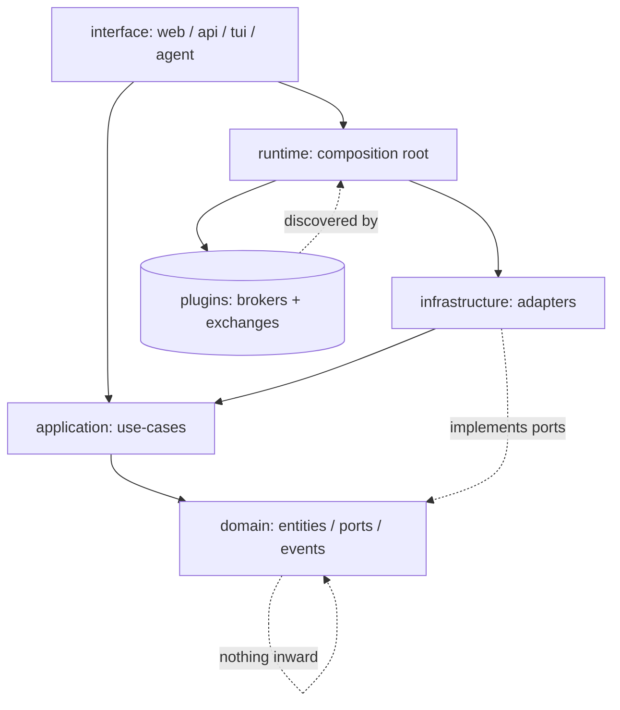
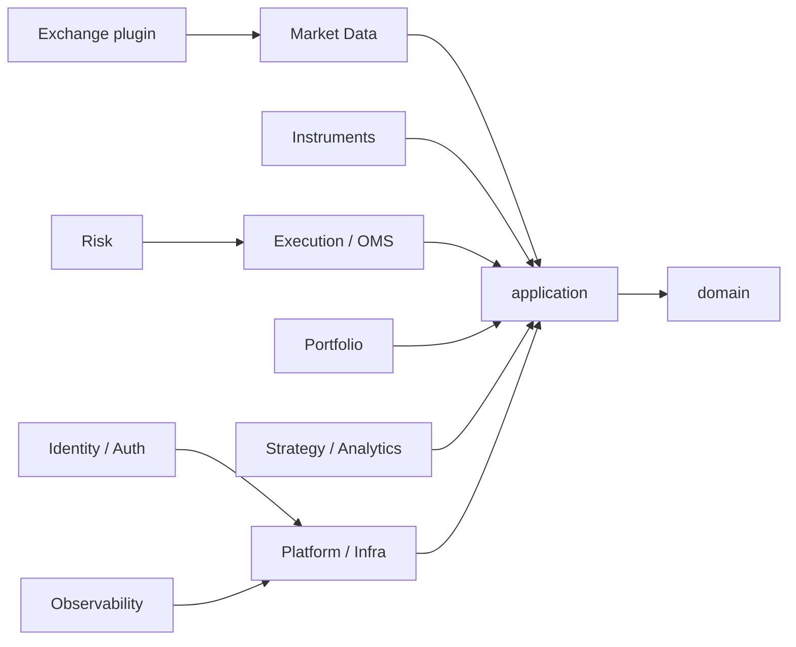
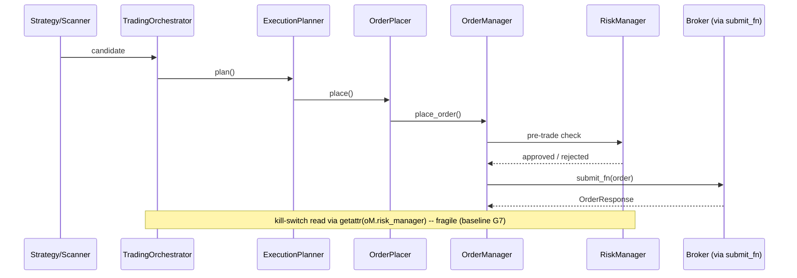
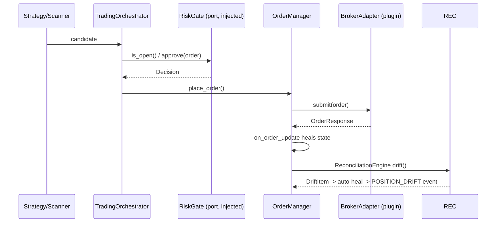
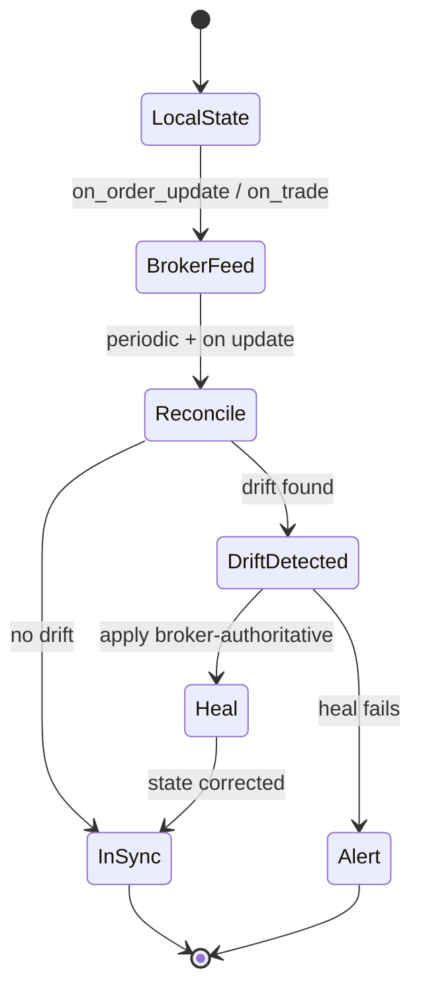
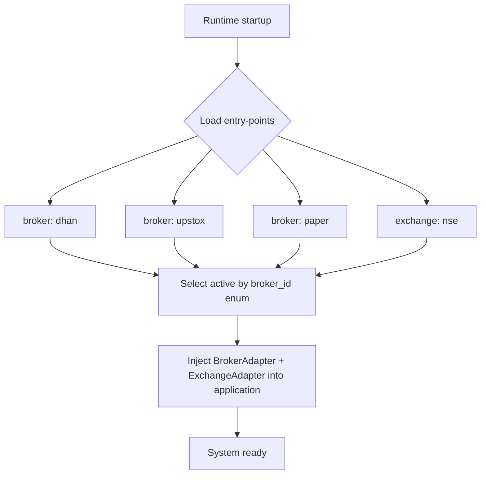

# Dependency & Flow Diagrams

Mermaid diagrams for the target architecture. See `target-layering.md` for the
contract these visualize.

## 1. Target Layer Dependency

Rule: `domain` depends on nothing inward. `runtime` is the only layer that touches
concrete plugins.

## 2. Bounded Contexts

## 3. Order Lifecycle (current → target)

Current (fragile reflection coupling at kill-switch):

Target (injected `RiskGate`, no reflection):

## 4. Reconciliation on Hot Path (target, baseline G6)

Today `Reconcile` is a separate service, not on the `BrokerFeed` path — drift is
detected but local state updates only via event handlers, so a dropped feed silently
diverges. P5-6 wires `Reconcile` directly into `BrokerFeed`.

## 5. Plugin Discovery (target, baseline G1/G2)

No string branching (`_active_name == "dhan"`); selection is by typed `broker_id`.
