# D1.4 — Domain Model Diagram

> **Phase 1 deliverable.** Mermaid class diagrams for each major aggregate
> in the TradeXV2 domain, derived from the actual source code.

---

## 1. Instrument Aggregate

The `Instrument` class is the central aggregate root, with subclass variants for each asset kind. It composes identity, trading spec, and extension management, and mixes in market data, streaming, and trading behaviors.

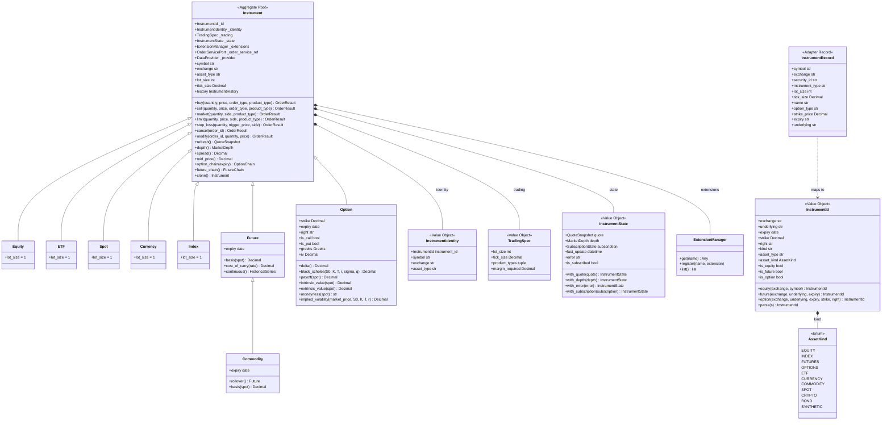

---

## 2. Order Aggregate

The order lifecycle spans intent → plan → request → order entity → result. The `ExecutionPlan` is the sizing/routing aggregate that converts signals into order intents.

```mermaid
classDiagram
    direction TB

    class OrderIntent {
        <<Value Object>>
        +symbol str
        +exchange str
        +side Side
        +quantity int
        +price Decimal
        +order_type OrderType
        +product_type ProductType
        +trigger_price Decimal
        +validity Validity
        +correlation_id str
        +tag str
    }

    class ExecutionPlan {
        <<Aggregate>>
        +source_strategy str
        +symbol str
        +exchange str
        +signal_type str
        +confidence Decimal
        +correlation_id str
        +legs list~OrderIntent~
        +sizing OrderSizing
        +slicing SlicingPlan
        +routing RoutingHint
        +guards PlanGuards
        +from_signal(signal, ctx) ExecutionPlan
        +to_intents() list~OrderIntent~
        +sliced_quantities() list~int~
        +to_dict() dict
    }

    class OrderSizing {
        <<Value Object>>
        +total_qty int
        +per_leg_allocation list~int~
        +method SizingMethod
        +equity Decimal
        +max_position_pct Decimal
        +existing_notional Decimal
        +atr Decimal
        +atr_risk_pct Decimal
    }

    class SlicingPlan {
        <<Value Object>>
        +algo SlicingAlgo
        +slice_count int
        +interval_seconds int
        +disclosed_qty int
        +twap_duration_seconds int
        +vwap_participation_rate Decimal
    }

    class SlicingAlgo {
        <<Enum>>
        NONE
        TWAP
        VWAP
        ICEBERG
    }

    class RoutingHint {
        <<Value Object>>
        +order_type OrderType
        +product_type ProductType
        +exchange_segment str
        +broker_algo str
    }

    class PlanGuards {
        <<Value Object>>
        +min_confidence Decimal
        +kill_switch_active bool
        +validity_window_seconds int
    }

    class PlanContext {
        <<Value Object>>
        +equity Decimal
        +max_position_pct Decimal
        +existing_notional Decimal
        +atr Decimal
        +default_order_type OrderType
        +default_product_type ProductType
        +default_exchange str
        +min_confidence Decimal
        +kill_switch_active bool
        +slicing SlicingPlan
    }

    class Order {
        <<Entity>>
        +order_id str
        +symbol str
        +exchange str
        +side Side
        +order_type OrderType
        +quantity Quantity
        +filled_quantity Quantity
        +price Money
        +trigger_price Money
        +status OrderStatus
        +timestamp datetime
        +product_type ProductType
        +validity Validity
        +avg_price Money
        +reject_reason str
        +correlation_id str
        +remaining_quantity int
        +is_complete bool
        +with_status(status) Order
        +with_fill(qty, avg_price) Order
        +with_price(price) Order
    }

    class OrderRequest {
        <<Value Object>>
        +symbol str
        +exchange str
        +transaction_type Side
        +quantity int
        +price Decimal
        +trigger_price Decimal
        +order_type OrderType
        +product_type ProductType
        +validity Validity
        +correlation_id str
        +slicing_algo str
        +slice_count int
        +slice_interval int
    }

    class ModifyOrderRequest {
        <<Value Object>>
        +order_id str
        +quantity int
        +price Decimal
        +trigger_price Decimal
        +order_type OrderType
    }

    class OrderResponse {
        <<Value Object>>
        +success bool
        +order_id str
        +message str
        +status OrderStatus
        +broker_order_id str
        +error_code str
        +http_status int
        +raw_payload dict
        +latency_ms float
        +ok() OrderResponse
        +fail() OrderResponse
        +to_ack() OrderAck
    }

    class OrderAck {
        <<Value Object>>
        +success bool
        +order_id str
        +message str
        +status OrderStatus
        +broker_order_id str
    }

    class OrderResult {
        +success bool
        +order Order
        +error str
        +ok(order) OrderResult
        +fail(error) OrderResult
    }

    class OrderStatus {
        <<Enum>>
        OPEN
        PLACED
        TRIGGERED
        FILLED
        PARTIALLY_FILLED
        CANCELLED
        REJECTED
        EXPIRED
    }

    ExecutionPlan *-- OrderSizing : sizing
    ExecutionPlan *-- SlicingPlan : slicing
    ExecutionPlan *-- RoutingHint : routing
    ExecutionPlan *-- PlanGuards : guards
    ExecutionPlan o-- OrderIntent : legs
    SlicingPlan *-- SlicingAlgo : algo
    OrderResponse --> OrderAck : to_ack()
    Order ..> OrderStatus : has
```

---

## 3. Position & Portfolio Aggregate

Position tracks per-instrument state with fill-based lifecycle. Portfolio aggregates all positions for portfolio-level metrics.

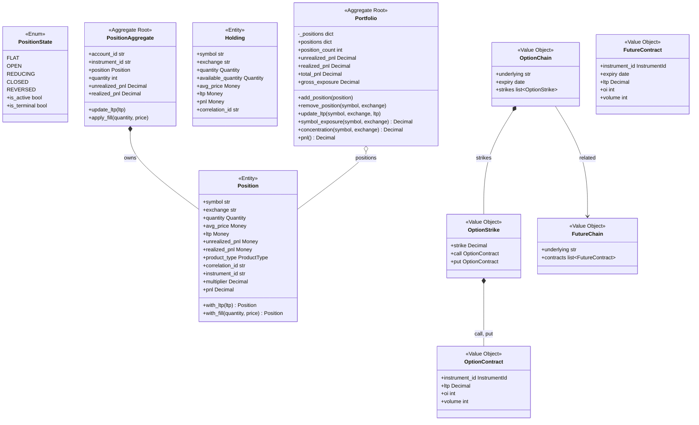

---

## 4. Execution & Trade Aggregate

The `Execution` aggregate owns fills for a single order, computing running statistics.

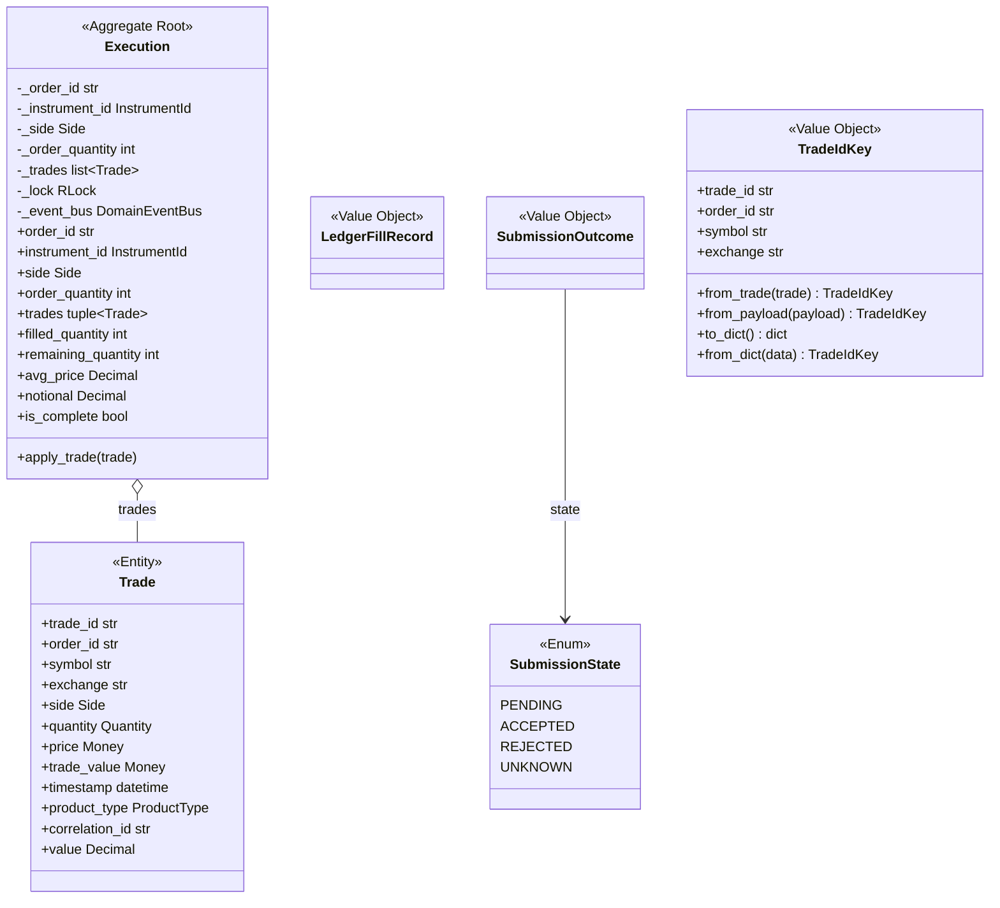

---

## 5. Value Objects — Primitives

The foundational value objects shared across all contexts.

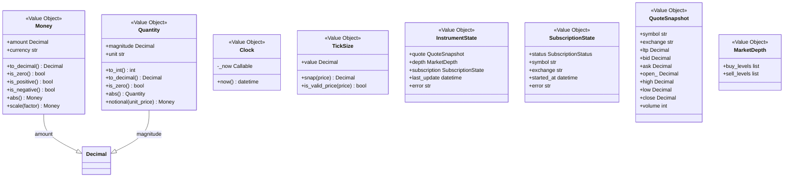

---

## 6. Risk Management — Policy Framework

Composable, testable risk policies with a single entry point.

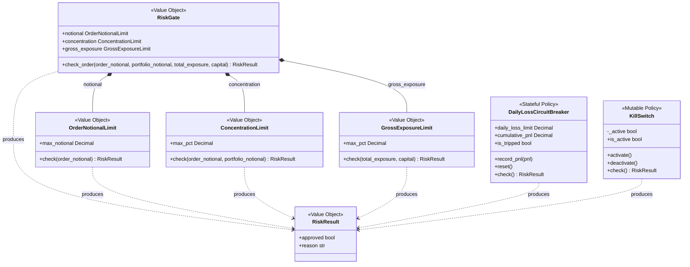

---

## 7. Account Aggregate

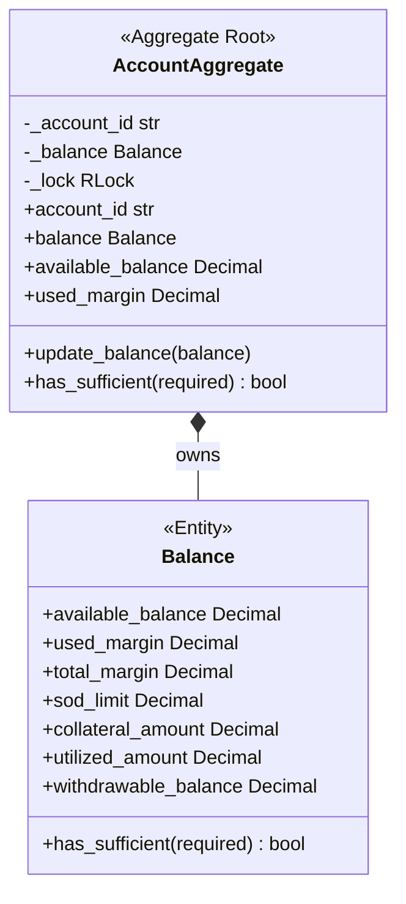

---

## 8. Event Types — Full Catalogue

Events grouped by their originating context.

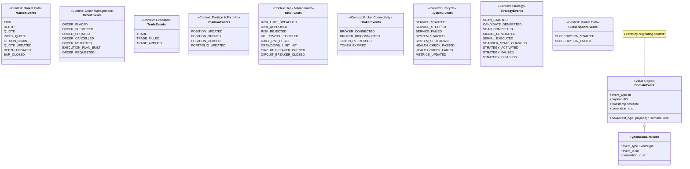

---

## 9. Ports — Dependency Inversion Boundaries

All protocols that contexts depend on, forming the hexagonal architecture boundaries.

```mermaid
classDiagram
    direction TB

    class DataProvider {
        <<Protocol>>
        +name str
        +get_quote(instrument_id) QuoteSnapshot
        +get_history(instrument_id, timeframe, lookback_days) list
        +get_history_series(instrument_id) HistoricalSeries
        +get_depth(instrument_id) MarketDepth
        +get_option_chain(underlying) OptionChain
        +get_future_chain(underlying) FutureChain
        +subscribe(instrument_id, callback) SubscriptionHandle
        +unsubscribe(subscription)
        +list_instruments(exchange) list
        +get_quotes_batch(ids) list
    }

    class ExecutionProvider {
        <<Protocol>>
        +name str
        +place_order(request) OrderResult
        +cancel_order(order_id) OrderResult
        +modify_order(request) OrderResult
        +get_order_book() list
        +get_positions() list
        +get_holdings() list
        +get_funds() Balance
    }

    class BrokerAdapter {
        <<Protocol>>
        +broker_id str
        +is_connected bool
        +authenticate() bool
        +close()
    }

    class OrderServicePort {
        <<Protocol>>
        +place(intent) OrderResult
        +cancel(order_id) OrderResult
        +modify(request) OrderResult
    }

    class RiskManagerPort {
        <<Protocol>>
        +get_status() dict
        +is_kill_switch_active() bool
        +check_order(order_request) RiskResult
    }

    class EventPublisher {
        <<Protocol>>
        +publish(event)
        +subscribe(event_type, handler)
    }

    class EventBusPort {
        <<Protocol>>
        +replay_mode bool
        +set_replay_mode(enabled)
        +logging_enabled bool
        +set_logging_enabled(enabled)
    }

    class EventLogPort {
        <<Protocol>>
        +errors int
        +append(event)
        +replay(event_types) Iterator
        +flush()
        +close()
    }

    class OrderStorePort {
        <<Protocol>>
        +upsert(order)
        +load_all() list
        +close()
    }

    class ExecutionLedgerPort {
        <<Protocol>>
        +record_intent(intent)
        +record_outcome(outcome)
        +outcome_for(intent_id) SubmissionOutcome
        +record_fill(fill)
        +list_fills() list
        +close()
    }

    class LifecycleManagerPort {
        <<Protocol>>
        +register(service)
        +unregister(name)
        +get(name) ManagedServicePort
        +start(name)
        +stop(name, timeout_seconds)
        +start_all()
        +stop_all()
        +health_snapshot() dict
    }

    class ManagedServicePort {
        <<Protocol>>
        +name str
        +start()
        +stop(timeout_seconds)
        +health() HealthStatus
    }

    class ClockPort {
        <<Protocol>>
        +now() datetime
        +timestamp() float
        +epoch_ms() int
        +exchange_now(exchange) datetime
    }

    class MarginProviderPort {
        <<Protocol>>
        +calculate_margin_for_order(order) Any
    }

    class MarketDataPort {
        <<Protocol>>
        +history(symbol, timeframe, lookback_days) HistoricalSeries
        +option_chain(underlying) OptionChain
        +future_chain(underlying) FutureChain
        +ltp(symbol) float
        +list_symbols(timeframe) list
    }

    class StrategyEvaluator {
        <<Protocol>>
        +evaluate_single(candidate, features) list
    }

    BrokerAdapter --|> DataProvider
    BrokerAdapter --|> ExecutionProvider
    EventBusPort --|> EventPublisher
    LifecycleManagerPort o-- ManagedServicePort : manages
```

---

## 10. Universe & Session

The composition root that wires everything together.

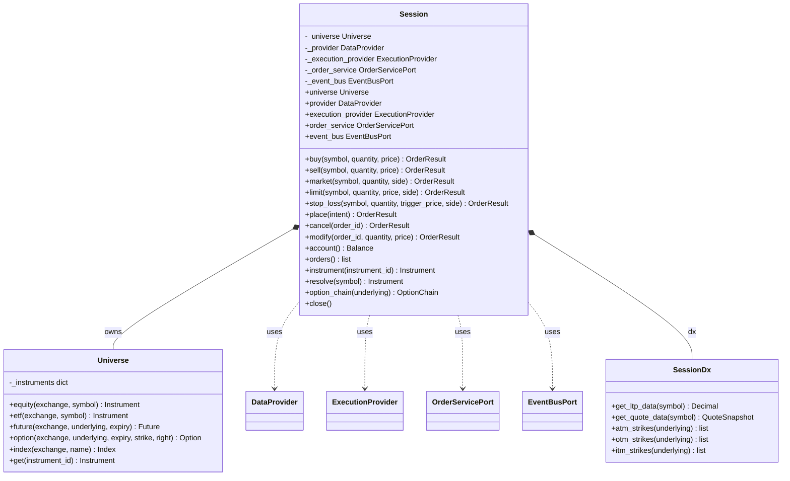

---

## Aggregate Relationship Summary

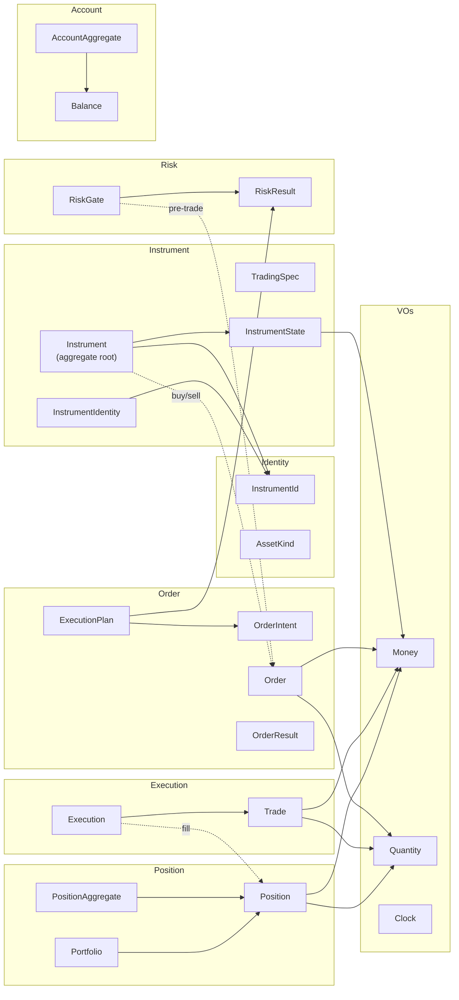

---

*Generated from source analysis on 2026-07-12.*
