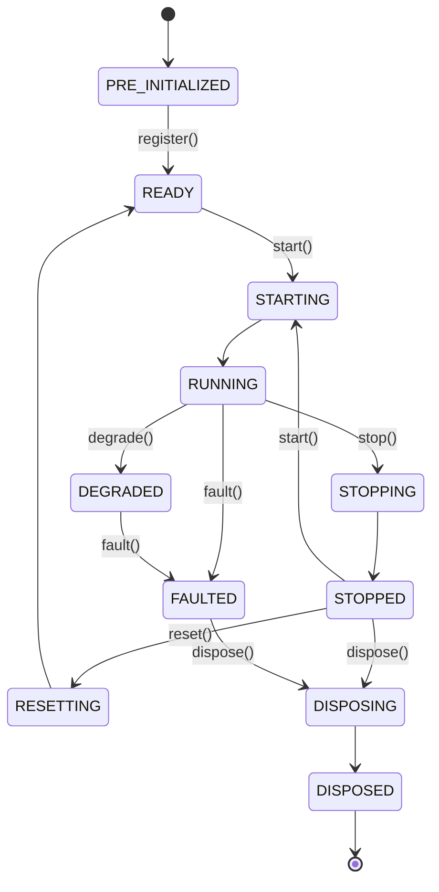

# 02 — Kernel & Components

Reference: Nautilus `NautilusKernel` (`nautilus_trader/system/kernel.py`) and architecture.md “Core components”.

---

## 1. TradeXKernel (target)

The kernel is the **only** composition of runtime engines. Backtest, sandbox, and live nodes all construct a `TradeXKernel` with different adapters.

```
TradeXKernel
├── Clock / TimeService          (LiveClock ≡ SystemClock | TestClock ≡ FakeClock)
├── MessageBus / EventBus        (single substrate)
├── TradingCache                 (orders, positions, accounts, instruments, quotes)
├── DataEngine                   (ingest → cache → publish)
├── RiskEngine                   (pre-trade + TradingState + Throttler)
├── ExecutionEngine              (lifecycle + reconcile + FillSource)
├── PortfolioEngine              (projection over Cache / PositionManager)
├── Trader / Strategy hosts       (TradingOrchestrator, StrategyPipeline)
└── Adapters (injected)
    ├── DataProvider(s)
    └── BrokerAdapter / FillSource
```

### Lifecycle (Nautilus ComponentState, adapted)



**Rule:** Engines must not accept trading commands outside `RUNNING` (except cancel-during-STOPPING if policy allows — default: kill-switch already freeze_all).

---

## 2. Component responsibilities

### 2.1 MessageBus / EventBus
- Patterns: pub/sub (topics), point-to-point (commands), req/rep (optional).
- Messages immutable after creation (Nautilus message_bus.md).
- Handler failures → DeadLetterQueue; never abort other handlers.
- **One** implementation. Async facade may wrap the same sync core.

### 2.2 TradingCache
Authoritative in-memory store (Nautilus Cache):

| Namespace | Contents | Writers |
|---|---|---|
| instruments | InstrumentId → Instrument | DataEngine / loader |
| quotes | latest QuoteSnapshot / LTP | DataEngine |
| orders | order_id → Order | ExecutionEngine |
| positions | position_key → Position | ExecutionEngine / PositionManager |
| accounts | balances / margin | Portfolio / reconcile |
| meta | correlation_id → order_id | ExecutionEngine |

**Readers:** RiskEngine, strategies, orchestrator, UI projections.  
**Rule:** quotes/trades/bars are **cache-then-publish**.

### 2.3 DataEngine
- Accepts ticks/quotes/bars/chains from `DataProvider`.
- Writes TradingCache, then publishes `TICK` / `QUOTE` / `BAR_CLOSED` / `OPTION_CHAIN`.
- Owns subscription lifecycle (`SUBSCRIPTION_STARTED` / `ENDED`).

### 2.4 RiskEngine
- Pre-trade `check_order` (see `07-risk-and-safety.md`).
- `TradingState`: ACTIVE | REDUCING | HALTED (Nautilus RiskEngine).
- Submit/modify `Throttler`.
- Kill-switch `freeze_all`.
- Updates from Portfolio (daily PnL) and LossCircuitBreaker.

### 2.5 ExecutionEngine
- Single place/cancel/modify admission path.
- Idempotency (`correlation_id`).
- Routes to FillSource after RiskEngine approval.
- Applies fills → updates Cache + publishes `TRADE_APPLIED`.
- Runs **hot-path reconciliation** on broker mass-status.

### 2.6 PortfolioEngine
- Reads Cache positions; computes unrealized/realized PnL.
- Feeds RiskEngine `update_daily_pnl`.
- Publishes `PORTFOLIO_UPDATED`.

### 2.7 Trading / Strategy host
- Nautilus: `Strategy` + `Actor` on MessageBus.
- TradeXV2: `TradingOrchestrator` + `StrategyPipeline` consume `CANDIDATE_GENERATED` / `BAR_CLOSED` / quotes; emit intents via `OrderServicePort` (never call BrokerAdapter directly).

---

## 3. Threading model (Nautilus-aligned)

| Concern | Policy |
|---|---|
| Kernel core (bus dispatch, risk, execution, cache) | **Single-threaded event loop** (deterministic ordering) |
| Broker WS / REST I/O | Background threads / asyncio; results marshalled onto kernel loop |
| Persistence (ledger, DuckDB) | Async / pooled; never block risk hot path without timeout |
| One kernel per process | Like Nautilus “one node per process” |

---

## 4. Mapping to current folders (evolutionary)

| Target component | Primary current home | Action |
|---|---|---|
| TradeXKernel | `src/runtime/` | Formalize; kill string broker branches (G1 largely DONE) |
| EventBus | `infrastructure/event_bus/` + `domain/events/` | Collapse to one (I10) |
| TradingCache | OrderManager + PositionManager dicts | Extract shared Cache façade |
| DataEngine | `application/streaming/` + datalake adapters | Unify behind DataProvider |
| RiskEngine | `application/oms/_internal/risk_manager.py` | Add TradingState + Throttler |
| ExecutionEngine | `application/execution/*` + OrderManager | Merge live + SimulatedOMSAdapter |
| PortfolioEngine | `application/portfolio/` + PositionManager | Keep projection pure |

---

## 5. Expected Behavior Contract — Kernel boot

| | |
|---|---|
| **Inputs** | `AppConfig`, `BrokerId`, Environment, Clock |
| **Outputs** | Running kernel with all engines in RUNNING; `SYSTEM_STARTED` |
| **Timing** | Boot fails fast if parity gate / invariant checks fail (non-skippable in live) |
| **State** | PRE_INITIALIZED → READY → STARTING → RUNNING |
| **Failure modes** | Missing broker plugin → halt. Parity gate fail in live → halt. `SKIP_PARITY_GATE` forbidden in live Environment |
