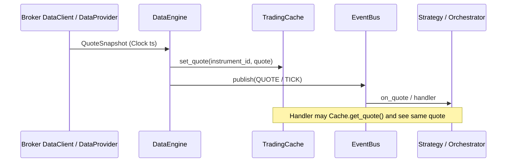
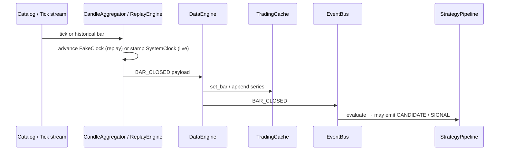

# 05 — Data Flow (End-to-End)

Reference: Nautilus architecture.md “Data flow: life of a quote tick” and `docs/concepts/cache.md`.

---

## 1. Life of a quote (target)



**Invariant (Nautilus):** cache-then-publish for quotes, trades, bars.  
Order book depth may publish without full cache snapshot if a separate book updater owns state — document which path is used.

---

## 2. Life of a bar (replay / live aggregation)



---

## 3. Option chain / index quote

Same pattern: normalize via instrument resolver → Cache → publish `OPTION_CHAIN` / `INDEX_QUOTE`.  
Greeks computed in domain `options/greeks.py` as pure functions over Cache snapshots — not inside broker adapters.

---

## 4. Historical / datalake path

```
Datalake (DuckDB/Parquet) → DataProvider (catalog) → Research / BacktestNode
                                                      ↘ DataEngine (if seeding live cache)
```

**Exchange-agnostic rule (ADR-005 / G3):** NSE/IST calendar and conventions come from `ExchangeAdapter` / `TradingCalendar` plugin — not hardcoded in `datalake/core`.

---

## 5. Subscription lifecycle

| Step | Event / action |
|---|---|
| Subscribe | DataEngine → DataProvider.subscribe → `SUBSCRIPTION_STARTED` |
| Healthy stream | TICK/QUOTE/DEPTH flow |
| Reconnect | Streaming reconnect controller; gap → GapReconciler / historical backfill |
| Unsubscribe | `SUBSCRIPTION_ENDED`; Cache retains last quote until TTL / session end |

---

## 6. Expected Behavior Contract — quote path

| | |
|---|---|
| **Inputs** | Venue WS/REST payload mapped to QuoteSnapshot |
| **Outputs** | Cache updated; QUOTE/TICK published once per accepted update |
| **Timing** | Timestamp = venue time if present else Clock.now(); never silent `datetime.now()` in mapper without Clock |
| **State** | Cache.quote is last-writer-wins per InstrumentId |
| **Failure modes** | Parse failure → log + drop (no corrupt Cache). Duplicate seq → ignore. Disconnect → BROKER_DISCONNECTED + reconnect policy |

---

## 7. As-built gaps (data)

| Gap | Spec impact |
|---|---|
| Multiple buses | Subscribers may miss quotes (I10) |
| Mapper `datetime.now()` fallbacks | Breaks I2 / replay parity |
| Datalake NSE/IST bake-in (G3) | Blocks exchange-agnostic claim |
