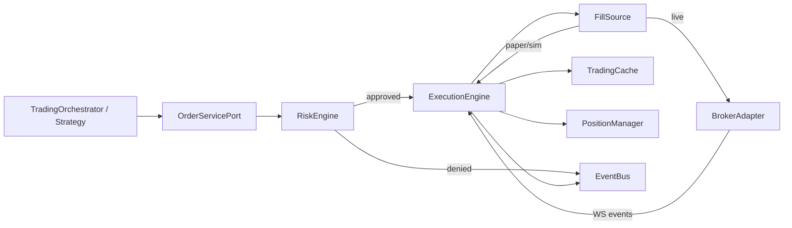
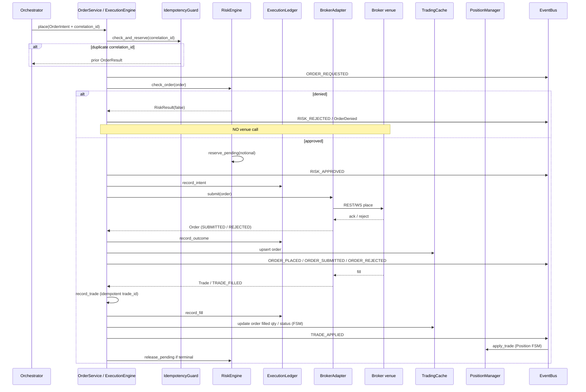
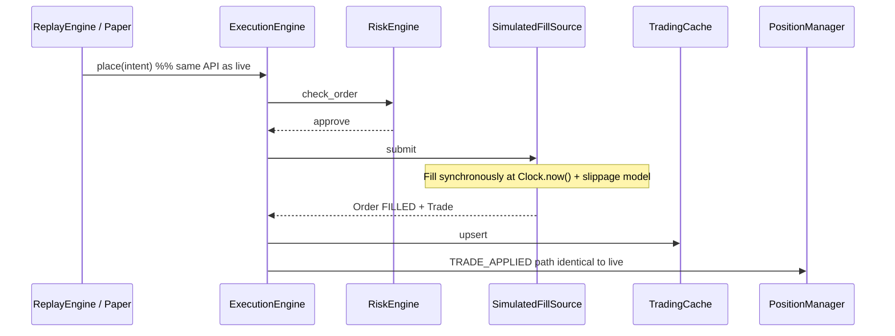

# 06 — Execution Flow (End-to-End)

Reference: Nautilus `docs/concepts/execution.md`, architecture.md “Execution flow: life of an order”, `docs/concepts/live.md` (denial vs rejection).

---

## 1. Component chain (target)



**Nautilus rule mirrored:** Strategy never talks to venue clients directly.  
**TradeXV2 rule:** Orchestrator never imports brokers; only `OrderServicePort`.

---

## 2. Life of a place-order (live)



### Denial vs rejection (Nautilus live.md)

| Outcome | When | Event |
|---|---|---|
| **Denied locally** | Risk / validation / kill-switch before venue | `RISK_REJECTED` / OrderDenied — **no** ORDER_SUBMITTED |
| **Rejected by venue** | Venue proves non-acceptance | `ORDER_REJECTED` |
| **Unresolved** | Ambiguous network failure | Ledger outcome UNKNOWN; reconcile later — do **not** invent REJECTED |

---

## 3. Life of a fill (apply path)

1. Broker WS → adapter maps to `Trade` (timestamp via **Clock**, venue time preferred).
2. `ExecutionEngine.record_trade` — idempotent on `trade_id`.
3. Order status transition via FSM (`OPEN`→`PARTIALLY_FILLED`→`FILLED`).
4. Publish `TRADE_APPLIED`.
5. `PositionManager` projects position; publish `POSITION_*`.
6. Portfolio updates unrealized/realized; RiskEngine `update_daily_pnl`.

---

## 4. Cancel / modify

```
OrderService.cancel/modify
  → RiskEngine (kill-switch freeze_all blocks; REDUCING may allow reduce-only)
  → ExecutionEngine
  → BrokerAdapter.cancel/modify
  → events back → Cache FSM update
```

Local validation failures: warn / OrderModifyRejected-equivalent — do not invent venue rejects.

---

## 5. Replay / paper (same engine)



**Zero-Parity (I1):** `SimulatedFillSource` and live `BrokerAdapter` are the **only** swapped pieces. Risk, idempotency, FSM, position projection, ledger (optional in pure research) share code.

**Forbidden:** separate `SimulatedOMSAdapter.place_order` that bypasses RiskEngine or uses a second order book.

---

## 6. Expected Behavior Contract — place_order

| | |
|---|---|
| **Inputs** | `OrderIntent` with mandatory `correlation_id`, symbol, side, qty, type, product |
| **Outputs** | `OrderResult`; events per spine; ledger rows |
| **Timing** | Intent recorded **before** venue I/O; Clock stamps all local events |
| **State** | correlation_id reserved until terminal or release; pending notional reserved on approve |
| **Failure modes** | Duplicate correlation → return prior result. Risk deny → no I/O. Venue ambiguous → UNKNOWN + reconcile. Illegal status → IllegalTransitionError (fail-fast) |

---

## 7. As-built gaps (execution)

| Gap | Spec impact |
|---|---|
| Live inlined in ExecutionService; replay via SimulatedOMSAdapter | Breaks I1 |
| `datetime.now()` in paper/mapper fills | Breaks I2 |
| Order.with_status bypasses FSM | Breaks I7 |
| Detached reconciliation | Breaks I6 (phantom positions) |
