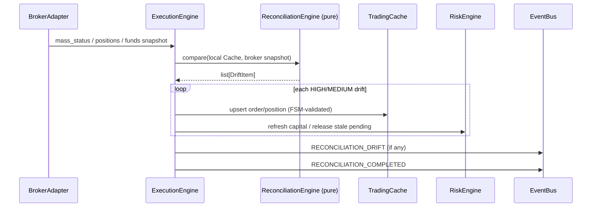

# 09 — Reconciliation & Cache

Reference: Nautilus Cache (`docs/concepts/cache.md`), ExecutionEngine `reconcile_execution_state` / `reconcile_execution_mass_status` (`execution/engine.pyx`).

---

## 1. TradingCache as source of truth (in-process)

| Key | Value | Authoritative writer |
|---|---|---|
| instrument_id | Instrument | DataEngine / loader |
| quote | QuoteSnapshot | DataEngine |
| order_id | Order | ExecutionEngine |
| correlation_id | order_id | ExecutionEngine |
| position_key | Position | ExecutionEngine / PositionManager |
| account | balances / margin | Portfolio + reconcile |

**Broker is authoritative externally.** Cache is the in-process projection. Drift must heal into Cache on the execution hot path (I6).

---

## 2. Hot-path reconciliation (target)

Triggers:
- On broker connect / reconnect  
- On periodic mass-status **delivered into** ExecutionEngine (timer may *fetch*, but apply is in-engine)  
- On unresolved submission (UNKNOWN outcome)

### Drift severity (ADR-005 vocabulary)
- **HIGH** — missing local order that broker has open; missing broker order that local thinks open; qty mismatch  
- **MEDIUM** — price/avg drift beyond tolerance  
- **LOW** — cosmetic / status lag within grace  

---

## 3. Pure compare engine

`domain/reconciliation_engine.py` stays pure:

- `compare_orders(local, broker) → list[DriftItem]`  
- `compare_positions(...)`  
- `compare_funds(...)`  

No I/O, no bus, no broker imports. Application applies results.

---

## 4. Idempotency interaction

- `correlation_id` reserved in IdempotencyGuard before venue.  
- `trade_id` deduped in TradeRecorder / PositionManager LRU.  
- Reconcile must not double-apply fills: if trade_id known, skip; if order state differs, FSM transition only when legal.

---

## 5. Expected Behavior Contract — reconcile

| | |
|---|---|
| **Inputs** | Broker-normalized Order/Position/funds lists + Cache snapshot |
| **Outputs** | Cache healed; DriftItems published; risk capital aligned |
| **Timing** | Completes before accepting new risk after reconnect (or TradingState DEGRADED until done) |
| **State** | Cache == broker for open orders/positions within tolerance after SUCCESS |
| **Failure modes** | Compare exception → fail-fast / HALTED. Partial apply → DEGRADED + alarm. Never leave HIGH drift silent |

---

## 6. As-built gaps

| Gap | Spec impact |
|---|---|
| Detached `reconciliation_service` + per-broker timers (G6) | Phantom positions between ticks |
| Multiple idempotency systems | Double/lost orders |
| PositionManager `upsert_position` from broker dicts without always going through FSM | Soften into FSM-validated path |
