# D1.7 — Extension Model

> How broker plugins, extensions, and capabilities are registered, discovered,
> and enforced in Trade_XV2.
> Source files: `src/infrastructure/broker_plugin.py`, `src/infrastructure/adapter_factory.py`,
> `src/domain/extensions/`, `src/brokers/*/`, `src/brokers/common/capabilities_validator.py`,
> `src/brokers/certification/suite.py`
> Last updated: 2026-07-12

---

## Table of Contents

1. [Architecture Overview](#1-architecture-overview)
2. [Plugin Registration API](#2-plugin-registration-api)
3. [Required Interfaces for a New Broker Plugin](#3-required-interfaces-for-a-new-broker-plugin)
4. [Optional Interfaces](#4-optional-interfaces)
5. [Capability Declaration Mechanism](#5-capability-declaration-mechanism)
6. [Certification Requirements](#6-certification-requirements)
7. [Third-Party Plugin Author Guide](#7-third-party-plugin-author-guide)
8. [Proposed Improvements](#8-proposed-improvements)

---

## 1. Architecture Overview

The extension model follows the **self-registration** pattern (ADR-007): broker
packages register themselves at import time, keeping broker-specific construction
logic out of the runtime path, out of domain objects, and out of `brokers.common`.

```mermaid
graph TD
    subgraph "Import Time (self-registration)"
        DHAN["brokers.dhan.__init__"]
        UPSTOX["brokers.upstox.__init__"]
        PAPER["brokers.paper.__init__"]
    end

    subgraph "Registries"
        AF["adapter_factory\n(data/adapters/extensions)"]
        BP["broker_plugin\n(BrokerPlugin metadata)"]
        SR["segment_registry\n(exchange mapping)"]
        ER["ExtensionRegistry\n(runtime capabilities)"]
    end

    subgraph "Resolution (runtime)"
        TS["tradex.connect(broker_id)"]
        CS["create_data_adapter()"]
        CE["create_execution_provider()"]
        CA["create_broker_adapter()"]
        BF["BrokerFacade → BoundBrokerFacade"]
    end

    DHAN -->|"register_data_adapter"| AF
    DHAN -->|"register_execution_provider"| AF
    DHAN -->|"register_broker_extensions"| AF
    DHAN -->|"register_broker_plugin"| BP
    DHAN -->|"register_segment_mapper"| SR

    UPSTOX -->|"register_data_adapter"| AF
    UPSTOX -->|"register_execution_provider"| AF
    UPSTOX -->|"register_broker_extensions"| AF
    UPSTOX -->|"register_broker_plugin"| BP
    UPSTOX -->|"register_segment_mapper"| SR

    PAPER -->|"register_data_adapter"| AF
    PAPER -->|"register_execution_provider"| AF
    PAPER -->|"register_broker_plugin"| BP
    PAPER -->|"register_segment_mapper"| SR

    TS -->|"get_broker_plugin()"| BP
    CS -->|"resolve class"| AF
    CE -->|"resolve class"| AF
    CA -->|"resolve class"| AF
    BF -->|"query extensions"| ER
```



---

## 2. Plugin Registration API

### 2.1 Broker Plugin Metadata (`infrastructure.broker_plugin`)

```python
@dataclass(frozen=True)
class BrokerPlugin:
    broker_id: str                                          # Unique ID ("dhan", "upstox", "paper")
    env_file: str | None = None                             # Env file name (".env.local")
    default_mode: str = "market"                            # Default: "sim" | "market" | "trade"
    supported_modes: frozenset[str] = {"market", "trade"}   # All supported modes
    is_live: bool = True                                    # False for paper/datalake
    data_provider_factory: Callable | None = None           # Optional factory
    execution_provider_factory: Callable | None = None      # Optional factory
    capabilities_module: str | None = None                  # e.g. "brokers.dhan.config.capabilities"
    capabilities_fn: str | None = None                      # e.g. "dhan_capabilities"
```

**Registration functions:**

| Function | Purpose |
|---|---|
| `register_broker_plugin(plugin)` | Register plugin metadata (called by broker `__init__.py`) |
| `get_broker_plugin(broker_id) → BrokerPlugin \| None` | Resolve metadata at runtime |
| `list_broker_plugins() → list[BrokerPlugin]` | List all registered brokers |
| `ensure_core_plugins()` | Idempotent fallback defaults for paper/dhan/upstox/datalake |

### 2.2 Adapter Factory (`infrastructure.adapter_factory`)

| Function | Purpose | Registry |
|---|---|---|
| `register_data_adapter(broker_id, cls)` | Register `DataProvider` class | `_DATA_ADAPTERS` |
| `register_execution_provider(broker_id, cls)` | Register `ExecutionProvider` class | `_EXECUTION_PROVIDERS` |
| `register_broker_adapter(broker_id, cls)` | Register unified `BrokerAdapter` class | `_BROKER_ADAPTERS` |
| `register_broker_extensions(broker_id, classes)` | Register `Extension` classes | `_BROKER_EXTENSION_CLASSES` |

**Resolution functions:**

| Function | Returns |
|---|---|
| `create_data_adapter(gateway, broker_id=)` | `DataProvider` instance (or raw gateway fallback) |
| `create_execution_provider(gateway, broker_id=)` | `ExecutionProvider` instance (or `None`) |
| `create_broker_adapter(gateway, broker_id=)` | `BrokerAdapter` instance (or `None`) |
| `get_broker_extension_classes(broker_id)` | `list[type]` of extension classes |

### 2.3 Segment Mapper (`domain.market.segment_registry`)

```python
register_segment_mapper(broker_id, mapper_class)
```

Maps broker-specific exchange/segment identifiers to canonical domain segments.

### 2.4 Extension Registry (`domain.extensions.registry`)

```python
class ExtensionRegistry:
    register(extension)          # Register at startup
    unregister(name) → bool      # Remove by name
    get(name) → Extension | None # Lookup by name
    has(name) → bool             # Existence check
    available_for(instrument_id) → list[Extension]  # Filter by instrument
    capabilities_for(instrument_id) → list[Capability]
    list_by_broker(broker) → list[Extension]
```

Thread-safe (`threading.Lock`). Populated at startup after extensions are instantiated with their transport dependencies.

---

## 3. Required Interfaces for a New Broker Plugin

A first-class broker plugin must provide these interfaces (from `BrokerPluginInterface`):

### 3.1 Data Provider

```python
class DataProvider(ABC):
    """Market data access port."""
    
    def quote(instrument_id) → Quote
    def ltp(instrument_id) → Decimal
    def depth(instrument_id, levels=5) → MarketDepth
    def history(instrument_id, timeframe, days) → Series
    def subscribe(instrument_id, callback, depth=False) → Subscription
    def unsubscribe(subscription) → None
```

### 3.2 Execution Provider / Order Transport

```python
class ExecutionProvider(ABC):
    """Order execution port."""
    
    def place_order(request) → OrderResult
    def cancel_order(order_id) → CancelResult
    def modify_order(order_id, **kwargs) → ModifyResult
    def orders() → list[Order]
    def positions() → list[Position]
    def holdings() → list[Holding]
    def funds() → FundLimits
```

### 3.3 Gateway (Unified)

The gateway wraps transport-specific HTTP/WS clients:

```python
class BrokerGateway(ABC):
    """Low-level transport."""
    
    def capabilities() → BrokerCapabilities
    def connect() → None
    def disconnect() → None
```

### 3.4 Registration in `__init__.py`

Every broker's `__init__.py` must self-register:

```python
# 1. Data adapter
register_data_adapter("my_broker", MyDataProvider)

# 2. Execution provider
register_execution_provider("my_broker", MyExecutionProvider)

# 3. Broker plugin metadata
register_broker_plugin(BrokerPlugin(
    broker_id="my_broker",
    env_file=".env.my_broker",
    default_mode="market",
    supported_modes=frozenset({"market", "trade"}),
    is_live=True,
    capabilities_module="brokers.my_broker.config.capabilities",
    capabilities_fn="my_broker_capabilities",
))

# 4. Segment mapper
register_segment_mapper("my_broker", MySegmentMapper)
```

---

## 4. Optional Interfaces

### 4.1 Broker Extensions

Extensions add broker-specific features beyond the standard DataProvider/ExecutionProvider:

```python
class Extension(ABC):
    """Base class for broker-specific extensions."""
    
    @property
    def name: str          # Unique ID ("depth200", "forever_orders")
    
    @property
    def broker: str        # Owning broker ("dhan")
    
    @property
    def version: str       # Semantic version ("1.0")
    
    @property
    def capabilities: tuple[Capability, ...]  # Provided capabilities
    
    def is_available_for(instrument_id) → bool  # Instrument compatibility
```

**Currently registered extensions:**

| Extension | Broker | Capabilities |
|---|---|---|
| `DhanDepth20Extension` | dhan | `depth_20` |
| `DhanDepth200Extension` | dhan | `depth_200` |
| `DhanSuperOrderExtension` | dhan | `super_order` |
| `DhanForeverOrderExtension` | dhan | `forever_order` |
| `UpstoxDepth30Extension` | upstox | `depth_30` |
| `UpstoxNewsExtension` | upstox | `news` |

### 4.2 Broker Facade

`BrokerFacade` (session-level) → `BoundBrokerFacade` (instrument-bound) provides a
dynamic `__getattr__` proxy so domain code can call:

```python
instrument.broker.depth200()      # Dhan 200-level depth
instrument.broker.depth30()       # Upstox 30-level depth
instrument.broker.news()          # Upstox news
instrument.broker.super_order()   # Dhan bracket order
instrument.broker.forever_order() # Dhan GTT order
```

Capability aliases are normalized via `_CAPABILITY_ALIASES` dict in `domain/extensions/facade.py`.

### 4.3 Unified BrokerAdapter

A newer pattern — `register_broker_adapter()` registers a single class that combines
data + execution + extensions. `DhanBrokerAdapter` is the current example.
Falls back to separate data/execution adapters when unified adapter is not registered.

---

## 5. Capability Declaration Mechanism

### 5.1 Broker-Level Capabilities

Declared in `BrokerPlugin.capabilities_module` / `capabilities_fn`:

- Dhan: `brokers.dhan.config.capabilities.dhan_capabilities`
- Upstox: `brokers.upstox.capabilities.snapshot.upstox_capabilities`
- Paper: None (no capabilities module)

The resilience layer (`infrastructure.resilience.rate_limiter`) resolves the loader
from these strings — no hard-coded broker names.

### 5.2 Capability Manifest (Coverage SSOT)

`domain/capability_manifest/catalog.py` (905 LOC) — a declarative tuple of
`surface()` objects mapping every capability to:

- Gateway method name
- ABC required flag
- Dhan implementation path
- Upstox implementation path
- CLI command mapping
- REST endpoint mapping

This is the **coverage matrix** — it tracks what exists, not what's running.

### 5.3 Runtime Capability Validation

`brokers/common/capabilities_validator.py`:

```python
# Maps capability flags → required gateway methods
_CAPABILITY_METHOD_MAP = {
    "supports_modify_order": ("modify_order",),
    "supports_order_cancellation": ("cancel_order",),
    "supports_positions": ("positions",),
    "supports_holdings": ("holdings",),
    "supports_stream_order": ("stream_order",),
    "supports_depth": ("depth", "stream_depth"),
}
```

Two enforcement levels:
- `validate_gateway_capabilities()` → returns mismatch list (pure check)
- `enforce_gateway_capabilities()` → raises `CapabilityMismatchError` (startup abort)

This closes the gap between advertised capabilities and actual method presence.

---

## 6. Certification Requirements

`brokers/certification/suite.py` — `BrokerCertifier` runs a comprehensive matrix
driven by a `BrokerSession`. Every broker must pass this identical suite.

### Certification Areas

| Area | Checks | Market Hours? |
|---|---|---|
| **Authentication** | `AUTHENTICATION` | No |
| **Token Lifecycle** | `TOKEN_REFRESH`, `TOKEN_EXPIRY`, `RECONNECT` | No (warn_only) |
| **Instrument Mapping** | `SYMBOL_LOOKUP`, `INSTRUMENT_LOOKUP`, `CANONICAL_MAPPING`, `SECURITY_ID_MAPPING`, `REVERSE_MAPPING` | No |
| **Market Data** | `QUOTE`, `LTP`, `OHLC`, `DEPTH`, `LIVE_STREAM` | DEPTH + STREAM: yes |
| **Historical Data** | `TF_1M`, `TF_5M`, `TF_15M`, `TF_DAILY` | No |
| **Orders** | `ORDER_MARKET`, `ORDER_LIMIT`, `ORDER_CANCEL`, `ORDER_MODIFY` | No (warn_only) |
| **Portfolio** | `HOLDINGS`, `POSITIONS`, `FUNDS` | No (warn_only) |
| **Performance** | `QUOTE_LATENCY`, `SUBSCRIPTION_LATENCY` | SUBSCRIPTION: yes |
| **Recovery** | `DISCONNECT`, `SESSION_RECOVERY`, `RATE_BURST`, `RATE_SUSTAINED`, `CAPABILITY_MATRIX` | No (warn_only) |

### Certification Enforcement

- `BrokerCertifier.certify()` → `CertificationReport`
- CLI: `broker certify <broker_id>`
- MCP: `broker.verify`
- Live-session checks are gated by `BrokerPlugin.is_live` — paper/datalake skip token/reconnect checks

---

## 7. Third-Party Plugin Author Guide

### Quick Start

1. **Create package:** `src/brokers/mybroker/`
2. **Implement DataProvider:** subclass or duck-type the data provider protocol
3. **Implement ExecutionProvider:** subclass or duck-type the execution provider protocol (optional for read-only)
4. **Implement extensions:** subclass `Extension` for any broker-specific features
5. **Self-register in `__init__.py`:**

```python
from infrastructure.adapter_factory import (
    register_data_adapter,
    register_execution_provider,
    register_broker_extensions,
)
from infrastructure.broker_plugin import BrokerPlugin, register_broker_plugin
from domain.market.segment_registry import register_segment_mapper

# Data
register_data_adapter("mybroker", MyBrokerDataProvider)

# Execution (optional)
register_execution_provider("mybroker", MyBrokerExecutionProvider)

# Extensions (optional)
if MY_EXTENSIONS:
    register_broker_extensions("mybroker", MY_EXTENSIONS)

# Metadata
register_broker_plugin(BrokerPlugin(
    broker_id="mybroker",
    env_file=".env.mybroker",
    default_mode="market",
    supported_modes=frozenset({"market", "trade"}),
    is_live=True,
    capabilities_module="brokers.mybroker.config.capabilities",
    capabilities_fn="mybroker_capabilities",
))

# Segment mapping
register_segment_mapper("mybroker", MyBrokerSegmentMapper)
```

6. **Implement capabilities function:**

```python
# brokers/mybroker/config/capabilities.py
def mybroker_capabilities():
    return BrokerCapabilities(
        supports_modify_order=True,
        supports_order_cancellation=True,
        supports_positions=True,
        supports_holdings=False,
        supports_stream_order=True,
        supports_depth=True,
    )
```

7. **Pass certification:**

```bash
python -m brokers.cli certify mybroker
```

### Checklist

| Step | Required? | Where |
|---|---|---|
| Implement DataProvider | ✅ Yes | `brokers/mybroker/data_provider.py` |
| Implement ExecutionProvider | ✅ Yes (for trading) | `brokers/mybroker/execution_provider.py` |
| Self-register adapters | ✅ Yes | `brokers/mybroker/__init__.py` |
| Register BrokerPlugin | ✅ Yes | `brokers/mybroker/__init__.py` |
| Register segment mapper | ✅ Yes | `brokers/mybroker/__init__.py` |
| Implement capabilities | ✅ Yes | `brokers/mybroker/config/capabilities.py` |
| Add extensions | Optional | `brokers/mybroker/extensions/` |
| Pass certification suite | ✅ Yes | `brokers/certification/suite.py` |
| Do NOT edit `application.oms` | ❌ Forbidden | ADR-007 contract |

---

## 8. Proposed Improvements

### 8.1 Static Registry Module (P0)

**Problem:** `ensure_core_plugins()` duplicates plugin metadata to avoid import
graph violations. The two copies can drift.

**Solution:** Create `infrastructure/broker_registry.py` — a static, importable
module containing only metadata (no business logic). Both `ensure_core_plugins()`
and broker packages import from here.

```python
# infrastructure/broker_registry.py
PAPER_PLUGIN = BrokerPlugin(broker_id="paper", ...)
DHAN_PLUGIN = BrokerPlugin(broker_id="dhan", ...)
UPSTOX_PLUGIN = BrokerPlugin(broker_id="upstox", ...)
DATALAKE_PLUGIN = BrokerPlugin(broker_id="datalake", ...)
```

### 8.2 Entry-Point Discovery (P1)

**Problem:** Broker packages must be explicitly imported for self-registration.

**Solution:** Use Python entry points (`tradex.brokers` group):

```toml
# pyproject.toml
[project.entry-points."tradex.brokers"]
dhan = "brokers.dhan"
upstox = "brokers.upstox"
paper = "brokers.paper"
```

`ensure_core_plugins()` → `discover_brokers()` using `importlib.metadata.entry_points()`.

### 8.3 Capability Contract Enforcement at Startup (P2)

**Problem:** `enforce_gateway_capabilities()` only checks method presence, not
behavior. A method that always raises `NotImplementedError` passes.

**Solution:** Add smoke-test phase to certification:
- Call each capability's backing method with minimal valid input
- Require no `NotImplementedError` for declared capabilities
- Promote `warn_only` checks to hard failures for `is_live=True` brokers

### 8.4 Extension Versioning and Compatibility (P2)

**Problem:** Extension `version` field exists but is never checked against broker
version or framework version.

**Solution:** Add `requires_framework: str = ">=2.0"` to `Extension` base class.
Broker facade checks compatibility before exposing extension.

### 8.5 Typed Capability Declaration (P3)

**Problem:** Capabilities are declared as `BrokerCapabilities` dataclass with
boolean flags. Adding a new capability requires modifying the dataclass.

**Solution:** Use `Capability` enum (already exists in `domain.capabilities`):
```python
class Capability(Enum):
    HISTORICAL_DATA = "historical_data"
    MARKET_DATA = "market_data"
    DEPTH = "depth"
    OPTIONS_CHAIN = "options_chain"
    # ... etc
```
Brokers declare `frozenset[Capability]` instead of individual booleans.
