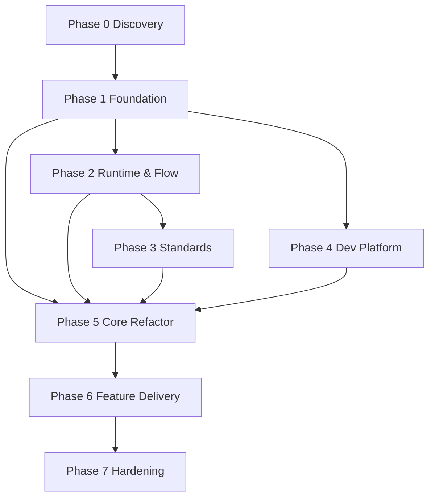

# TradeXV2 → Trading OS: Transformation Roadmap

> Top-down, milestone-based execution plan. Built on `baseline.md` (current state)
> and `target-layering.md` (target contract). The system must remain deployable,
> testable, and releasable after **every** phase.
>
> Planning principles applied: architecture before implementation; business
> capabilities before technical modules; stable contracts before implementations;
> evolutionary refactoring over rewrites; deliver value every milestone; reduce
> technical debt continuously; avoid speculative abstractions.

## Executive Summary

TradeXV2 already has strong bones: a typed domain model, an in-memory event bus with
dead-letter capture, an architecture-test harness (56 tests + import-linter), and 8
CI workflows with real quality gates. It is **not** a rewrite candidate. The blockers
to the "broker-agnostic / exchange-agnostic / plugin-based" target are localized and
well understood (see `baseline.md` §7). This roadmap removes them incrementally, freezes
contracts first, and only then delivers features.

The program is 8 phases (0–7). Phases 0–4 are foundation (no risky behavior change);
Phase 5 removes the 8 gaps; Phases 6–7 deliver capabilities and hardening on top.

## Dependency Graph (phases)

## Continuous Improvement Loop (runs from Phase 1)

For every iteration: review the current implementation → validate assumptions → design
the smallest safe improvement → implement incrementally → remove duplication where it
helps → improve tests → verify via SDK/CLI/MCP → update docs → enforce architecture
rules → keep the app deployable → reassess the backlog → next iteration.

---

## Phase 0 — Discovery & Baseline

**Objective.** Freeze a shared, code-accurate picture of the system and seed a
severity-ranked debt/risk backlog. (Deliverable already produced: `baseline.md`.)

**Why.** Without a shared baseline, later phases argue from memory. The baseline is
pinned to file:line evidence so every claim is auditable.

**Scope.** Whole repository.

**Deliverables.** Current-state architecture doc (`baseline.md`, done); repo/ownership
map; dependency map (reuse import-linter graph); tech-debt inventory (the 8 gaps);
risk register (see `roadmap` §Risk Register); baseline CI metrics.

**Tasks.**
| ID | Description | Dep | Output | Complexity | Risk | Acceptance |
|---|---|---|---|---|---|---|
| P0-1 | Publish `baseline.md` | — | doc | S | drift | baseline approved |
| P0-2 | Codify 8 gaps as backlog items w/ severity | P0-1 | `backlog.md` | S | misprioritization | each gap has owner+exit |
| P0-3 | Capture baseline CI metrics (coverage, LoC, contract counts) | — | metrics file | S | n/a | numbers recorded |
| P0-4 | Confirm plugin entry-points exist (`tradex.brokers`) | — | note | S | missing EP | EP verified in pyproject |

**Risks.** Analysis drift → every claim cites file:line. Mitigation: baseline is
evidence-pinned.

**Exit.** Baseline approved; metrics baselined; backlog seeded; plugin entry-points confirmed.

---

## Phase 1 — Architecture Foundation

**Objective.** Agree the target contract **before** touching behavior.

**Why.** Stable contracts let multiple engineers/agents work in parallel without
colliding. The current `BrokerAdapter` port already exists; we freeze it and add the
missing ports (Exchange, TradingCalendar, RiskGate).

**Scope.** Contracts, package structure, dependency rules, event model, plugin spec,
SDK contract. **No business logic changes.**

**Deliverables.** Architecture handbook (`target-layering.md`, done); bounded-context
map; ubiquitous-language glossary; validated domain model; package structure;
import-linter dependency rules (target layering); event-model spec; plugin-spec
(broker + exchange); public SDK contract; ADRs (ADR-001 shadow copies, ADR-002 layer
rule, ADR-003 single config source, ADR-004 single event bus, ADR-005 exchange-agnostic).

**Tasks.**
| ID | Description | Dep | Output | Complexity | Risk | Acceptance |
|---|---|---|---|---|---|---|
| P1-1 | ADR-003 single config source | — | ADR | S | over-abstraction | ADR approved |
| P1-2 | ADR-004 single event-bus stack | — | ADR | S | scope creep | ADR approved |
| P1-3 | Define `ExchangeAdapter` + `TradingCalendar` ports | — | ports | M | speculative API | reviewed, minimal |
| P1-4 | Freeze `BrokerAdapter` + plugin discovery spec | — | spec | S | churn | contract frozen |
| P1-5 | Write import-linter contracts for target layering | P1-4 | lint cfg | M | false positives | CI enforces layering |

**Risks.** Over-abstraction → reject any port without a concrete consumer in Phases 2–5.

**Exit.** Architecture approved; contracts frozen; CI enforces target layering (new
contracts fail on current violations, tracked as known-debt exceptions).

---

## Phase 2 — Runtime & Flow Design

**Objective.** Make runtime behavior explicit — no "it should work".

**Why.** Several gaps (reconciliation off hot path, kill-switch via `getattr`) are
*implicit* behavior. Diagrams + Expected Behavior Contracts force them explicit.

**Scope.** All cross-cutting flows.

**Deliverables.** Sequence/activity diagrams + state machines for: startup, broker
connect, auth/TOTP, instrument lifecycle, historical-data, quote/subscribe, order
lifecycle, position/portfolio lifecycle, replay, shutdown, recovery, error-handling.
Plus an Expected Behavior Contract (inputs / outputs / timing / state transitions /
failure modes) per flow. Diagrams in `diagrams/`.

**Tasks.**
| ID | Description | Dep | Output | Complexity | Risk | Acceptance |
|---|---|---|---|---|---|---|
| P2-1..11 | One diagram + EBC per flow above | P1 | diagrams | M each | invalid diagram | reviewed vs real code |
| P2-12 | Reconciliation state machine (drift → heal on hot path) | P2-1..11 | diagram | M | gaps | drift path explicit |

**Risks.** Diagrams not validated → each reviewed against actual code paths in
`src/runtime`, `src/application/oms`, `src/brokers`.

**Exit.** All flows diagrammed + reviewed; gaps logged to backlog.

---

## Phase 3 — Engineering Standards

**Objective.** Make architectural violations impossible to merge.

**Why.** The gap root causes (string branching, direct broker imports) are social as
much as technical. Ownership + gates prevent regressions.

**Scope.** Standards, ownership, CI gates.

**Deliverables.** `STANDARDS.md` / `CONTRIBUTING.md`; folder + module ownership matrix;
naming/logging/error-handling/testing/doc standards; architecture tests; hardened CI
quality gates.

**Tasks.**
| ID | Description | Dep | Output | Complexity | Risk | Acceptance |
|---|---|---|---|---|---|---|
| P3-1 | Ownership map (per bounded context) | — | doc | S | gaps | every module owned |
| P3-2 | Codify log/error standards | — | std | S | n/a | std approved |
| P3-3 | Promote arch tests to merge gates | P1-5 | CI | M | fatigue | gates red on violation |
| P3-4 | Flaky-test quarantine process | — | process | S | n/a | documented |

**Risks.** Gate fatigue → tune thresholds gradually; start with warnings.

**Exit.** CI green with all gates; every module has an owner.

---

## Phase 4 — Developer Platform

**Objective.** No engineer or AI agent writes ad-hoc scripts to validate functionality.

**Why.** The repo root has `pytest_runner*.py`, `run_*.sh`, `verify_decomposition.py`
with hardcoded paths — a developer-platform gap. Centralizing validation in the SDK/CLI/MCP
removes this.

**Scope.** SDK, CLI, MCP, diagnostics, cert, golden data.

**Deliverables.** `tradex` SDK surface; consolidated CLI (merge `broker`+`tradex`); single
MCP facade (merge `brokers.mcp`+`agent.mcp`); health/diagnostics; startup validation;
broker-certification suite; golden datasets; sample apps/notebooks.

**Tasks.**
| ID | Description | Dep | Output | Complexity | Risk | Acceptance |
|---|---|---|---|---|---|---|
| P4-1 | SDK surface (public `tradex` API) | P1 | SDK | M | leak | stable surface |
| P4-2 | CLI consolidation | P4-1 | CLI | M | breakage | `tradex` covers both |
| P4-3 | MCP merge (broker+agent) | P4-1 | MCP | M | agent break | schemas stable |
| P4-4 | Broker-cert suite (`broker_certify`) | P4-1 | suite | M | n/a | runs vs sandbox |
| P4-5 | Golden datasets | — | data | M | drift | versioned |
| P4-6 | Delete `pytest_runner*.py`/`run_*.sh` | P4-2 | cleanup | S | script loss | scripts gone |

**Risks.** Breaking agent integrations → keep MCP tool schemas stable across the merge.

**Exit.** All validation doable via SDK/CLI/MCP; ad-hoc scripts removed.

---

## Phase 5 — Core Platform Refactoring (incremental, priority-ordered)

**Objective.** Remove the 8 gaps (baseline §7) with the smallest safe diffs.

**Why.** These gaps are the only things blocking broker/exchange-agnosticism and
silent-failure safety. Each is a targeted refactor, not a rewrite.

**Deliverables.** Cleaned layers; plugin registry; single config/bus/idempotency;
exchange-agnostic datalake; reconciliation on hot path.

**Tasks (ordered — each independently releasable).**
| ID | Description | Dep | Sev | Complexity | Risk | Acceptance |
|---|---|---|---|---|---|---|
| P5-1 | Delete shadow `brokers/dhan/*`; harden `_bootstrap.py`; add import-resolution test | — | 🔴 | S | path regress | import → `src/`; CI green |
| P5-2 | Excise NSE/IST from datalake → `ExchangeAdapter`+`TradingCalendar` plugins; raise `ExchangeNotConfigured` | P1-3 | 🔴 | L | behavior change | no NSE literal in datalake |
| P5-3 | Remove string broker branching in `runtime/` → protocol dispatch + plugin registry | P1-4 | 🔴 | M | regress | no `_active_name` branch; lint clean |
| P5-4 | Single config source (deprecate `infrastructure.config` → `AppConfig`) | P1-1 | ⚠️ | M | drift | one config path |
| P5-5 | Collapse dual event bus + triple idempotency into one stack each | P1-2 | ⚠️ | M | regress | one bus, one idempotency |
| P5-6 | Reconciliation on hot path (wire `ReconciliationEngine` into update handling; emit `POSITION_DRIFT`) | P2-12 | ⚠️ | M | false heal | drift heals automatically |
| P5-7 | Replace `getattr` kill-switch with injected `RiskGate` port | P2 | ⚠️ | S | behavior | no `getattr` reach-through |
| P5-8 | Dedupe `LiveStrategyEngine` vs `TradingOrchestrator` (one spine) | P2 | ⚠️ | M | break | single evaluate→place path |

**Risks.** Shadow-file regression; path-order fragility; config drift during cutover.
Mitigation: each task ships behind its own test; P5-1's import-resolution test guards
the path-order landmine.

**Exit.** import-linter proves: (a) no broker string branching outside `runtime/`;
(b) no direct broker imports outside `runtime/`; (c) datalake has zero NSE/IST literals;
(d) contracts green; (e) CI green.

---

## Phase 6 — Feature Delivery (each independently releasable)

**Objective.** Ship complete business capabilities on the now-clean foundation.

**Capabilities.** Market Access, Trading, Options, Portfolio, Analytics, Replay,
Strategy Engine, AI Agents. Each capability = SDK+CLI+MCP surface + integration tests
(vs real broker sandbox + golden datasets) + replay/backtest parity (zero-parity rule:
backtest & live share execution logic) + releasable behind flags.

**Tasks.** Per capability: P6-<cap>-1 define contract; -2 implement; -3 integration test;
-4 parity test; -5 release behind flag.

**Risks.** Parity drift → shared execution path enforced by an architecture test.

**Exit.** Each capability releasable + tested; parity verified.

---

## Phase 7 — Production Hardening

**Objective.** Operational excellence for real money.

**Deliverables.** Perf/load suites (extend `load-test.yml`, `production_gate.yml`);
chaos/recovery drills; metrics/tracing/alerting; security review (bandit/supply-chain);
runbooks; continuous-improvement loop.

**Tasks.** P7-1 load/perf; P7-2 chaos+recovery; P7-3 observability; P7-4 security;
P7-5 runbooks.

**Risks.** Untested recovery → chaos drills mandatory before go-live.

**Exit.** Production validation complete; runbooks published; improvement loop running.

---

## Risk Register

| Risk | Sev | Phase | Mitigation |
|---|---|---|---|
| Shadow `brokers/` silently shadows `src/` | 🔴 | P5-1 | delete + import-resolution test |
| `runtime/` concrete-broker coupling | 🔴 | P5-3 | protocol dispatch + plugin registry |
| NSE/IST hardcodes block exchange-agnostic | 🔴 | P5-2 | `ExchangeAdapter`/`TradingCalendar` |
| Config drift (two systems) | ⚠️ | P5-4 | single source |
| Reconciliation off hot path → silent drift | ⚠️ | P5-6 | wire into update path |
| Reflection kill-switch fragility | ⚠️ | P5-7 | `RiskGate` port |
| Ad-hoc scripts / no dev platform | ⚠️ | P4 | developer platform |
| Event-bus/idempotency duplication | ⚠️ | P5-5 | collapse |

## Success Criteria

- Every milestone delivers measurable value; system stays deployable + CI-green after each phase.
- Parallel ownership possible via frozen contracts + ownership matrix.
- Evolution, not rewrite (domain/application largely preserved).
- Each phase has inputs/outputs/deps/risks/acceptance/exit criteria (above).
- Roadmap executable by a senior engineer or AI agent with minimal ambiguity.

## Next Action

Foundations (Phases 0–1 contracts) are the gate for all code work. Until ADRs are
approved and import-linter target contracts land, no Phase 5 refactors begin. Start
with ADR-001 (shadow-copy deletion) — it is the smallest, highest-risk item and can
ship immediately behind a test.
