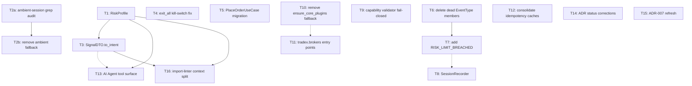

# Trading OS Blueprint v2 — Implementation Dependency Graph & Multi-Agent Plan

**Source of work items:** `TRADING_OS_BLUEPRINT_V2*.md` (Parts 1–6), all
findings independently verified against source before being listed here.
**Format:** deliberately mirrors this repo's own existing
`docs/architecture/DEPENDENCY_GRAPH_AND_PARALLELISM.md` (same legend, same
wave/gate/lock-map structure) — reusing a pattern that already works in
this codebase rather than inventing a new one.
**Two decisions already made** (recorded here so no agent re-litigates
them): `exit_all` will be exempted from the kill switch (T4); the ambient
session fallback will be removed pending a call-site audit (T2a → T2b).

---

## 1. Legend (same as the existing repo doc)

| Symbol | Meaning |
|--------|---------|
| **→** | Hard dependency (B cannot start until A is done and green) |
| **⇢** | Soft dependency (B is easier after A; can start with stubs) |
| **∥** | Parallelizable (disjoint files + contracts) |
| **SEQ** | Must be one agent / one line of commits |
| **PAR** | Multi-agent safe if file ownership is respected |

**Conflict rule:** agents may run in parallel only if their owned file sets
do not intersect. Where two work items touch the same file, they are
listed as SEQ even if conceptually independent.

---

## 2. Work items (T1–T16), each with owner files and blueprint citation

| ID | Work | Owned files (exclusive) | Blueprint source |
|----|------|--------------------------|-------------------|
| **T1** | `RiskProfile` — public read-only object projecting `RiskConfig` + `_daily_pnl` | New: `domain/portfolio/risk_profile.py`. Edit: `domain/portfolio/account_view.py` (add `.risk_profile` property) | Part 2 §3.1 |
| **T2a** | Grep audit: every real caller of `get_ambient_session()` | None (read-only investigation, produces a report) | Part 2 §3.2 |
| **T2b** | Remove ambient-session fallback from `_resolve_order_service()` | `domain/instruments/instrument.py` | Part 2 §3.2, gated on T2a's findings |
| **T3** | `SignalDTO.to_intent(risk_profile, account)` | `domain/models/trading.py`, `domain/orders/sizing.py` | Part 2 §3.3 |
| **T4** | `exit_all` exempted from kill switch (decision made: exits always allowed) | `application/oms/extended_order_service.py` (single method body) | Part 5 §3.1 |
| **T5** | Migrate CLI/API/Orchestrator to `PlaceOrderUseCase`, or delete it | `application/execution/place_order_use_case.py`, `interface/ui/services/broker_service.py`, `interface/ui/commands/{oms,order_composition,order_placement}.py`, `application/trading/trading_orchestrator.py` | Part 5 §2.1 |
| **T6** | Delete 4 dead `EventType` enum members | `domain/events/types.py` | Part 3 §2 |
| **T7** | Add `RISK_LIMIT_BREACHED`, wire to continuous MTM feed | `domain/events/types.py` (same file as T6 — SEQ), `application/oms/_internal/risk_manager.py` | Part 3 §2.1 |
| **T8** | `SessionRecorder` new component | New: `infrastructure/observability/session_recorder.py` | Part 3 §4.3 |
| **T9** | Capability validator fail-closed (abort/strip on mismatch) | `brokers/common/capabilities_validator.py`, `brokers/dhan/factory.py`, `brokers/upstox/factory.py` | Part 4 §3.1 |
| **T10** | Remove `ensure_core_plugins()` hardcoded fallback | `infrastructure/broker_plugin.py` | Part 4 §2.1 |
| **T11** | Populate `tradex.brokers` entry points for out-of-tree discovery | `pyproject.toml`, composition-root boot code | Part 4 §3.2 |
| **T12** | Consolidate the two broker-level idempotency caches (fixes the confirmed race condition) | New: `brokers/common/idempotency.py`. Edit: `brokers/dhan/execution/order_placement.py`, `brokers/upstox/orders/idempotency.py` | Part 4 §3.3 |
| **T13** | AI Agent tool surface + guardrails | New package: `interface/agent/` (tools.py, guardrails.py) | Part 5 §7 |
| **T14** | Correct ADR-003/004/006 status lines | `docs/adr/ADR-003-capability-model.md`, `ADR-004-event-driven-domain.md`, `ADR-006-deletion-strategy.md` | Part 6 §4 |
| **T15** | Refresh ADR-007 marker list | `docs/adr/ADR-007-test-pyramid-live-gating.md` | Part 6 §3 |
| **T16** | Extend import-linter contracts for Risk/Trading and Strategy/Analytics splits | `pyproject.toml` (`[[tool.importlinter.contracts]]`) | Part 6 §7 item 1 |

**Not included below** (available as a fully independent, zero-conflict
track if wanted): the earlier `domain/` sub-package consolidation plan
(`domain/composition`/`derivatives` facade cleanup, `domain/utils` merge,
`domain/execution` vs `domain/executions`, the 13 single-file
sub-packages) — touches only `src/domain/*/__init__.py`-level files
untouched by anything in this list, so it can run as a completely separate
Wave with its own agent at any time without coordination overhead.

---

## 3. Dependency graph (DAG)

**Everything not shown with an incoming arrow has zero hard dependencies**
and can start immediately: T2a, T1, T4, T5, T6, T9, T10, T12, T14, T15.

---

## 4. Parallel waves

### Wave 0 — start immediately, fully parallel, zero shared files (7 agents max)

| Agent | Task | Owns exclusively |
|---|---|---|
| **A-RISK** | T1 (RiskProfile) | `domain/portfolio/risk_profile.py` (new), `domain/portfolio/account_view.py` |
| **A-AMBIENT** | T2a (grep audit — read-only) | none |
| **A-EXITALL** | T4 (exit_all fix) | `application/oms/extended_order_service.py` |
| **A-EVENTS** | T6 → T7 (SEQ within this agent — same file) | `domain/events/types.py`, `application/oms/_internal/risk_manager.py` |
| **A-CAPS** | T9 (capability validator fail-closed) | `brokers/common/capabilities_validator.py`, `brokers/dhan/factory.py`, `brokers/upstox/factory.py` |
| **A-IDEMPOTENCY** | T12 (consolidate idempotency caches) | `brokers/common/idempotency.py` (new), `brokers/dhan/execution/order_placement.py`, `brokers/upstox/orders/idempotency.py` |
| **A-DOCS** | T14 + T15 (ADR corrections) | `docs/adr/*.md` only |

**Why these seven are genuinely safe in parallel:** zero file overlap,
verified above by the owned-files column — this is not an assumption, it's
the same check the existing repo's proven multi-agent doc runs before
declaring anything parallel-safe.

### Wave 1 — starts after specific Wave 0 items land

| Agent | Task | Depends on | Owns |
|---|---|---|---|
| **A-PLUGIN** | T10 → T11 | none hard, but T11 is much cleaner after T10 lands (soft dep) | `infrastructure/broker_plugin.py`, then `pyproject.toml` entry-points + composition-root boot |
| **A-SIZING** | T3 | **T1 done** (needs `RiskProfile`'s real shape) | `domain/models/trading.py`, `domain/orders/sizing.py` |
| **A-AMBIENT2** | T2b | **T2a done** (needs the grep results to know if this is safe) | `domain/instruments/instrument.py` |
| **A-SESSIONREC** | T8 | T6/T7 soft-done (cleaner event catalog to hook into) | `infrastructure/observability/session_recorder.py` (new) |

### Wave 2 — the higher-risk, multi-file consolidation (needs single-agent or strict sub-wave discipline)

| Agent | Task | Notes |
|---|---|---|
| **A-SPINE** | T5, sub-waved internally exactly like this repo's existing C1.1a→C1.1b/c/d/e pattern: first confirm `PlaceOrderUseCase.execute()`'s contract, then **one client at a time** (CLI, then Orchestrator) | Touches 4 files across 2 packages — do not parallelize sub-steps across different agents without the same discipline the existing repo already uses for this exact class of change |

### Wave 3 — final, depends on Wave 0/1 landing

| Agent | Task | Depends on |
|---|---|---|
| **A-AGENT** | T13 (AI agent tool surface) | **T1 done** (hard — `get_risk_status` wraps `RiskProfile`); T3 soft |
| **A-CONTRACTS** | T16 (import-linter context split) | **T1 and T3 done** (hard — needs real module paths to write correct contracts, not speculative ones) |

---

## 5. File ownership lock map (avoid multi-agent thrash)

| Hot file | Allowed agent(s) only |
|---|---|
| `domain/events/types.py` | A-EVENTS (T6, T7) — never parallel with anything else touching this file |
| `application/oms/_internal/risk_manager.py` | A-EVENTS (T7's publish call only) |
| `domain/instruments/instrument.py` | A-AMBIENT2 (T2b) — do not touch until T2a's audit is read |
| `application/oms/extended_order_service.py` | A-EXITALL (T4) only |
| `brokers/common/capabilities_validator.py`, `brokers/dhan/factory.py`, `brokers/upstox/factory.py` | A-CAPS (T9) only |
| `infrastructure/broker_plugin.py` | A-PLUGIN (T10) only |
| `brokers/dhan/execution/order_placement.py`, `brokers/upstox/orders/idempotency.py` | A-IDEMPOTENCY (T12) only |
| `application/execution/place_order_use_case.py`, `interface/ui/services/broker_service.py`, `interface/ui/commands/*`, `application/trading/trading_orchestrator.py` | A-SPINE (T5) only — never parallel with itself across sub-steps either |
| `docs/adr/*.md` | A-DOCS (T14, T15) only |
| `pyproject.toml` | A-PLUGIN (T11, entry-points section) then A-CONTRACTS (T16, import-linter section) — **SEQ between these two**, different sections of the same file, but touching the same file means one at a time |

---

## 6. Testing gates (no parallel bypass — mirrors the existing repo's G0/G1/G2 pattern)

| Gate | Required before |
|---|---|
| **G-W0** | All Wave 0 agents' own unit tests green + `pytest tests/unit/ tests/architecture/ -q` still passes with no new failures (baseline: 486 passed / 5 skipped, verified this session) |
| **G-RISK** | T1's `RiskProfile` has a real unit test (`headroom_pct()` computed correctly against a fixture `RiskConfig` + `_daily_pnl`) before A-SIZING or A-AGENT start consuming it |
| **G-W1** | Wave 1 agents' tests green + G-W0 still holds |
| **G-SPINE** | A-SPINE's first sub-step (confirm `PlaceOrderUseCase.execute()` contract with a test proving it matches `OrderManager.place_order`'s behavior) passes **before** any client is rewired — this is the same "spine before clients" discipline the existing repo's C1.1a gate already enforces |
| **G-FINAL** | Full `pytest tests/unit/ tests/architecture/ -q` + import-linter clean + no new `DeprecationWarning`s introduced (ironic given T14, but worth stating: T14 corrects *labels*, it must not itself introduce new shims) |

---

## 7. How to actually run this with the tools available in this session

This session has two real primitives for a multi-agent team, not a
metaphor:

1. **`TaskCreate`/`TaskList`/`TaskUpdate`** — a shared task queue. Each row
   in §2's table becomes one `Task`, with `addBlockedBy` encoding the
   arrows in §3's graph exactly. Any agent (or you, working directly) can
   run `TaskList`, see what's unblocked, claim it, and mark it complete —
   which unblocks its dependents automatically.
2. **The `Agent` tool** — spawns a real subagent that can read/edit files
   and run tests, scoped to exactly the file set in §5's lock map, given
   as an explicit instruction (not left to the agent to infer).

**What I have not done yet, on purpose:** actually spawned any agents or
created the Task entries. Wave 0's seven items are safe to start
immediately by any measure in this document, but I want your confirmation
on scope before real code changes start landing across a live trading
codebase — see the question below.

---

*This graph will be kept in sync as work items land — mark them complete
in the table above (or in the live Task queue) rather than letting this
document drift the way the seven original ADRs did (Part 6 §4).*
