# Trading OS — Production Architecture Blueprint

**Document type:** Target architecture (first principles)  
**Status:** Design SSOT for long-horizon evolution  
**Audience:** Platform architects and implementers  
**Date:** 2026-07-10  

**What this is not:** A review of the current TradeXV2 tree. Existing code is **reference only**.  

**What this is:** The architecture a battle-tested institutional **Trading Operating System** converges to after years of production: correctness first, operational simplicity, broker/exchange agnosticism, OO domain surface, selective eventing, plugins, observability, determinism, replay, incremental evolution.

**Related (implementation path, not this blueprint):**  
`TARGET_SYSTEM_DESIGN.md`, `MODULE_PROGRAM.md`, code-only findings report.

---

## 0. Architecture board stance

We design as if operating:

- Continuous electronic markets  
- Multiple brokers and venues  
- Human + automated strategies  
- Paper, research, and live capital in one OS  
- Years of extension without rewrite  

**Priority order (non-negotiable):**

1. **Correctness** of money and books  
2. **Reliability** and recovery  
3. **Operational simplicity** (one writer, clear owners)  
4. **Delivery velocity** (thin slices, stable ports)  
5. Architectural purity (only when it serves 1–4)

---

# Part I — Philosophy

## 1. Trading OS metaphor

Users interact with a **market operating system**, not with HTTP clients or SQLite.

```text
User / Strategy / CLI / API / Agent
        │
        ▼
   Domain Object API          ← only public surface
   (Instrument, Order, Portfolio, Session, …)
        │
        ▼
   Runtime Kernel             ← lifecycle, composition, clocks
        │
        ├─ Market Data Runtime
        ├─ Trading Runtime (OMS + Risk)
        ├─ Strategy Runtime
        ├─ Analytics Runtime
        ├─ Replay Runtime
        └─ Broker Runtime (plugins)
        │
        ▼
   Infrastructure (hidden)    ← bus, store, metrics, secrets
```

**Infrastructure is never the product API.**  
`session.equity("RELIANCE").buy(10)` is product.  
`DhanHttpClient.post("/orders")` is not.

## 2. Core principles

| Principle | Meaning | Trade-off accepted |
|-----------|---------|-------------------|
| **Domain objects first** | Identity and behavior live on types | More OO design work; fewer dict APIs |
| **Single writer for money state** | One OMS process owns books | No multi-writer scale-out initially |
| **Ports at boundaries** | Brokers/storage implement protocols | Extra adapter layer |
| **Events for fan-out, not for truth** | Books are SoR; events notify | Not pure event-sourcing |
| **Determinism by construction** | Clock, RNG, data pins for research | Live has external nondeterminism isolated |
| **Fail closed on capital** | Missing risk/capital/store → no trade | Less “convenience” in misconfig |
| **Capability discovery** | Features advertised and validated | Boot-time honesty required |
| **Plugin isolation** | New broker = new package, no core edit | Discipline on ports |
| **Boring persistence** | SQLite/Postgres + WAL before Kafka | Lower distributed complexity |
| **Selective eventing** | Sync call path for place-order | Avoid bus-for-everything |

### Alternatives considered and rejected

| Alternative | Why not (for this OS) |
|-------------|------------------------|
| **Full event-sourcing as SoR** | Excellent audit story; harder day-1 correctness, upcasting, and ops. Use **append-only audit + snapshot SoR**. |
| **Microservices from day 1** | Boundary clarity costs ops and consistency. Start **modular monolith**, extract only under proven load. |
| **Actor model everywhere** | Great isolation; harder debugging for a small team. Use **explicit owners + locks/queues** at hot boundaries. |
| **Shared mutable caches as truth** | Fast; causes split-brain quotes/positions. **One owner per state kind**. |
| **Broker SDK as public API** | Fast integration; locks product to vendor. **Always map to domain**. |

## 3. Domain object catalog (public mental model)

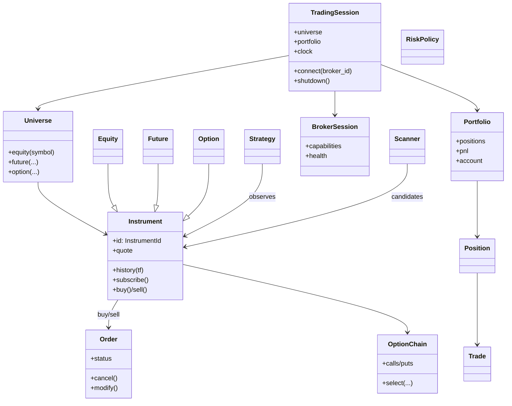

Rich objects **delegate** to runtimes; they do not embed broker HTTP.

---

# Part II — Runtime architecture

## 4. Overall system

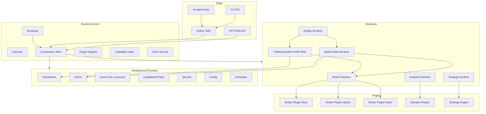

## 5. Runtime Kernel

### 5.1 Responsibilities

| Concern | Kernel owns |
|---------|-------------|
| Process lifecycle | start → ready → drain → stop |
| Composition | construct graph once; inject ports |
| Plugin load | entry points / manifest |
| Config | validated profile (dev/paper/live) |
| Clock | injectable `Clock` (live wall / replay virtual) |
| Mode | `live` \| `paper` \| `research` |
| Single OMS registration | process-wide handle |

### 5.2 Dependency rules (hard)

```text
domain          → (nothing outside domain)
application/*   → domain, ports only
runtimes        → domain + application services + ports
plugins/brokers → domain ports + infrastructure primitives
infrastructure  → domain ports (implements), no application rules
presentation    → application use cases / session façade only
```

**Forbidden:**  
domain → brokers; analytics → place_order; brokers → OMS books; plugins → each other.

### 5.3 Extension points

| Extension | Mechanism |
|-----------|-----------|
| Broker | `tradex.brokers` entry point → `BrokerPlugin` |
| Indicator | `tradex.indicators` → pure function registry |
| Strategy | `tradex.strategies` → `Strategy` protocol |
| Scanner | `tradex.scanners` |
| Fill model | `FillModel` for paper/research |
| Clock | `Clock` implementation |

### 5.4 Why a kernel (trade-off)

**Alt:** ad-hoc `main.py` wiring per app.  
**Reject:** diverging CLI/API/SDK stacks → split books.  
**Choose:** one composition function `build_kernel(config) -> KernelHandle`.

---

## 6. Platform bootstrap (startup)

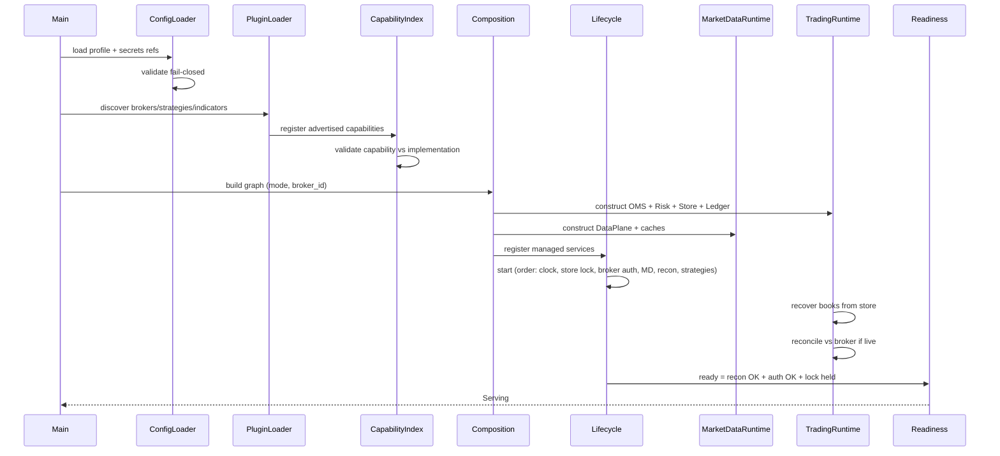

**Startup invariants**

1. Live mode without capital provider / order store / trade ledger → **abort**.  
2. Capability lie (e.g. native slice advertised, client-side only) → **abort** or strip capability.  
3. Second process taking writer lock → **abort**.  
4. Strategies start only after `Ready` (or explicit research mode).

---

## 7. Broker Runtime

### 7.1 Model

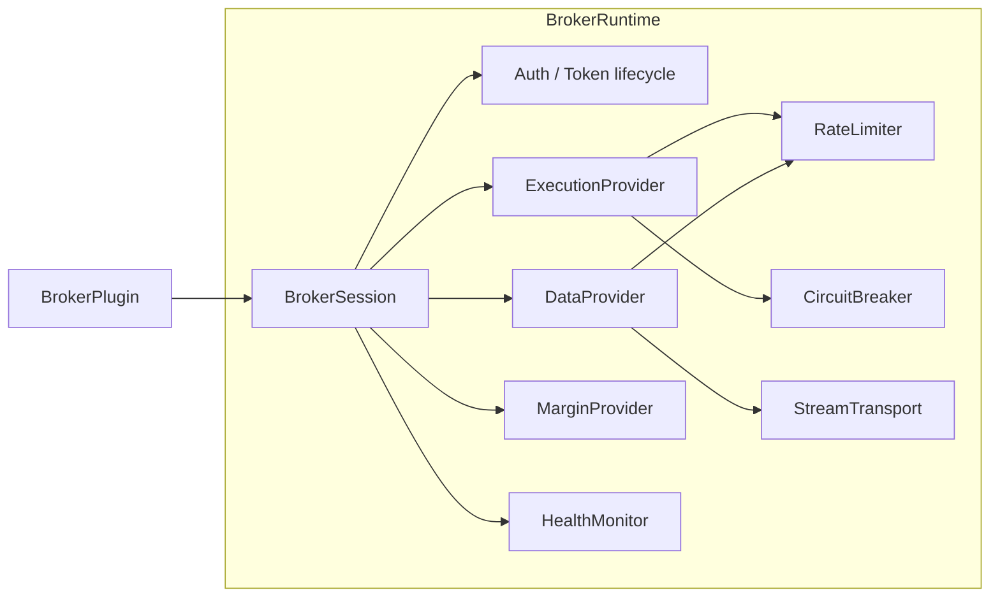

### 7.2 Contracts (minimal stable ports)

```text
ExecutionProvider:
  place, modify, cancel, get_order, get_open_orders,
  get_positions, get_holdings, get_funds, cancel_all?

DataProvider:
  get_quote, get_quotes, get_history, get_depth?,
  subscribe, unsubscribe, get_option_chain?

MarginProvider:
  estimate(order) -> MarginEstimate

BrokerPlugin:
  id, build_session(ctx) -> BrokerSession
  capabilities() -> CapabilitySet
```

### 7.3 Lifecycle

| Phase | Behavior |
|-------|----------|
| Authenticate | TOTP/OAuth/token file; refresh scheduler |
| Connect streams | WS with backoff + jitter; admission lock optional |
| Ready | auth valid + (optional) heartbeat |
| Degraded | CB open on reads vs writes **split** (don't block orders on history 429s) |
| Reconnect | resubscribe full interest set; emit `STREAM_RESYNC` |
| Shutdown | cancel inflight politely; flush; revoke optional |

### 7.4 Decisions

| Decision | Choice | Why |
|----------|--------|-----|
| Gateway god object | **No** — thin façade over EP/DP | Parity & testing |
| Rate limit location | Broker runtime + shared token bucket | Protect vendor limits |
| Error model | Typed hierarchy under `BrokerError` | Routing retry vs fatal |
| Paper | First-class plugin | Same ports as live |

---

## 8. Market Data Runtime

### 8.1 Responsibilities

- Normalize vendor ticks → domain `Quote` / `MarketDepth` / bars  
- Own **subscription registry** and **last-quote cache** (single owner)  
- Historical path: cache → lake → broker → normalize → optional persist  
- Fan-out to strategies/UI via in-process hub  
- Aggregation: tick → bar (optional service)  
- Recovery: resub on reconnect; gap **metrics** (not fake ticks)  

### 8.2 Architecture

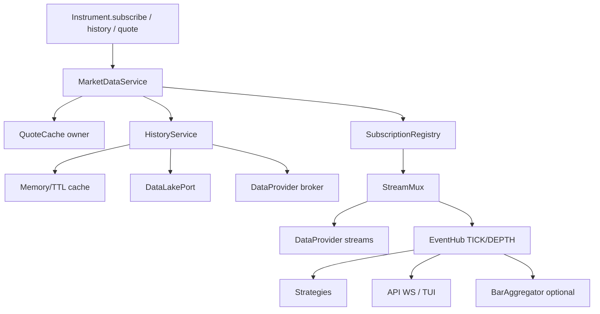

### 8.3 State ownership

| State | Owner |
|-------|-------|
| Last quote per InstrumentId | `QuoteCache` (MD runtime) |
| Active subscriptions | `SubscriptionRegistry` |
| Historical series (request-scoped) | returned immutable `HistoricalSeries` |
| Persistent bars | DataLake (research SoR) |
| Stream connection | Broker StreamTransport |

### 8.4 Communication

| Path | Pattern | Why |
|------|---------|-----|
| `instrument.quote` | **Direct call** → cache | Low latency, simple |
| `history()` | **Direct call** async/sync | Request/response |
| `subscribe()` | **Callback + EventHub** | Fan-out |
| Persist bars | **Direct** to lake | Not via bus |

**Avoid:** putting every tick through durable log (cost/latency). Optional sample journal for recon only.

---

## 9. Trading Runtime (OMS + Risk + Portfolio)

### 9.1 Single money path

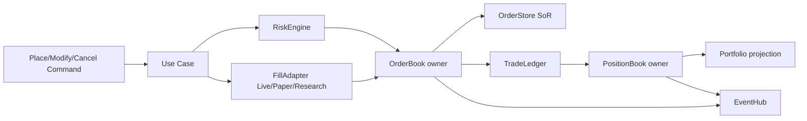

### 9.2 Systems of record

| Data | SoR | Notify |
|------|-----|--------|
| Orders | OrderStore + in-memory OrderBook | ORDER_* events |
| Positions | PositionBook (+ optional snapshot table) | POSITION_* |
| Trade idempotency | TradeLedger durable | — |
| Risk daily PnL | RiskEngine state fed by portfolio MTM | RISK_* |
| Account balances | Broker fetch + cache with TTL; risk uses CapitalProvider | — |

### 9.3 Order lifecycle (canonical)

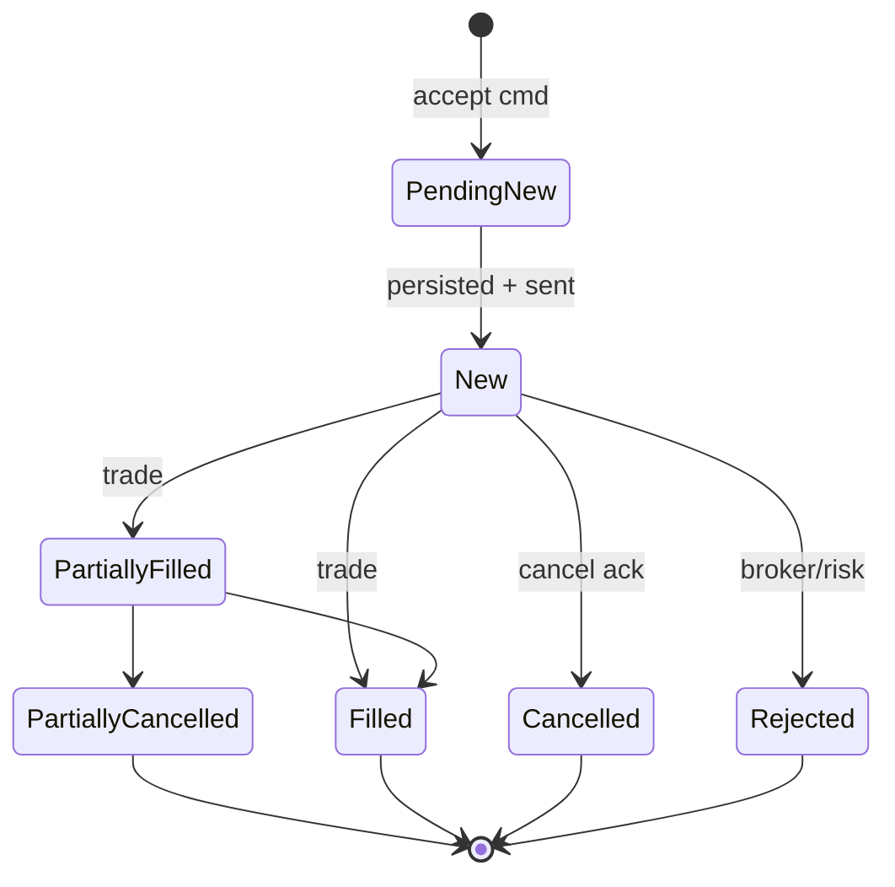

**Rules**

- All transitions via state machine.  
- `correlation_id` required.  
- Persist intent **before** broker ack (crash → recon).  
- Trades: **apply books → then mark ledger**.  
- Effective notional: limit price or ref LTP; F&O × multiplier × lot.  

### 9.4 RiskEngine (pre-trade + continuous)

Checks (ordered): kill switch → loss circuit → capital → notional limits → gross → daily loss → margin (F&O) → lot/tick → optional rate limit.

**Continuous:** portfolio MTM updates daily PnL (wired, not optional).

### 9.5 Reconciliation & recovery

```text
Boot → load OrderStore → load Position snapshot/rebuild
     → load TradeLedger
     → fetch broker orders/positions
     → diff → heal policy (manual | auto safe-only)
     → open placement gate
```

### 9.6 Why not ES for OMS

Institutional shops often use **journal + snapshot** (exchange-style) rather than pure ES for matching engines' cousins. We journal capital events for audit; **books remain authoritative** after recover+recon. Simpler ops, fewer dual-write bugs than naive ES.

---

## 10. Strategy Runtime

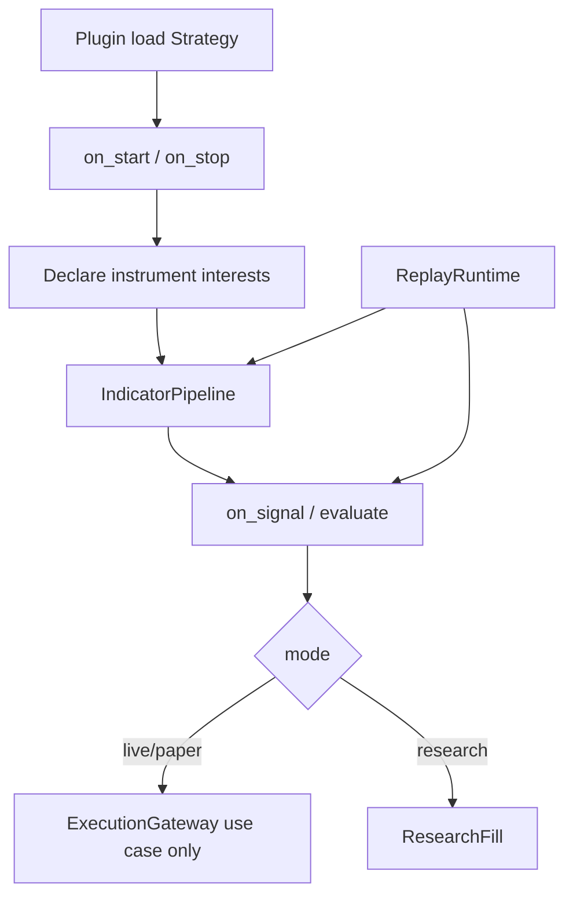

**Rules**

- Strategy never imports brokers.  
- Execution only via `ExecutionPort` / use case.  
- One order policy per symbol per decision cycle (configurable).  
- Replay uses virtual clock + historical bars; same evaluate code path.

---

## 11. Analytics Runtime

| Subsystem | Role | Coupling |
|-----------|------|----------|
| Indicators | Pure functions on series | domain or analytics.pure |
| Scanner | Universe → candidates | emits Candidate events or returns list |
| Option analytics | Chain, greeks, surfaces | on OptionChain object |
| Portfolio analytics | PnL attribution, risk metrics | reads Portfolio snapshots |
| Reports | Offline | lake |

**Scanner → Strategy → Trading** is a pipeline; analytics **does not** own orders.

---

## 12. Replay Runtime (three distinct modes)

Naming must not collapse concepts:

| Mode | Name | Purpose |
|------|------|---------|
| R1 | **ResearchReplay** | Bars through strategy → sim fills → equity curve |
| R2 | **SessionRecording** | Optional journal of ticks/orders for later analysis |
| R3 | **CrashRecovery** | OMS store + ledger + recon (not bar replay) |

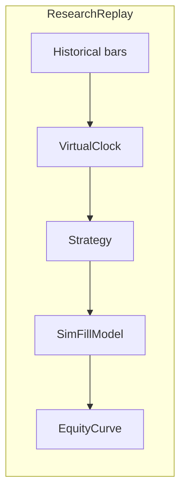

**Determinism knobs:** data version pin, cost model version, clock, seed for any stochastic fill.

---

## 13. Infrastructure Runtime

| Service | Role |
|---------|------|
| Persistence | OrderStore, TradeLedger, optional EventJournal |
| Cache | Quote TTL, history TTL |
| EventHub | In-process pub/sub (sync dispatch default) |
| Logging | Structured JSON; correlation_id |
| Metrics | orders, rejects, lag, recon drift, WS age |
| Tracing | Optional OTEL spans on place/history |
| Secrets | Provider interface (env/file now; vault later) |
| Config | Typed profile |
| Clock | LiveClock / VirtualClock |
| Scheduler | PnL reset, token refresh, recon interval |
| Tasks | Bounded executor for blocking IO |

**Threading model (default modular monolith):**

```text
Main / asyncio loop (API) 
  ├─ Broker WS reader threads/tasks → normalize → EventHub
  ├─ OMS lock (RLock) for books
  ├─ Lifecycle threads: recon, token, scheduler
  └─ Strategy evaluate: same thread as event OR dedicated worker queue
```

**Decision:** default **sync EventHub on publisher thread** for simplicity; strategy work that is heavy goes to **queue + worker** to protect WS thread.  
**Avoid:** unbounded thread-per-tick.

---

# Part III — Application flows (detailed)

## 14. Instrument construction

```python
stock = session.universe.equity("RELIANCE")
```

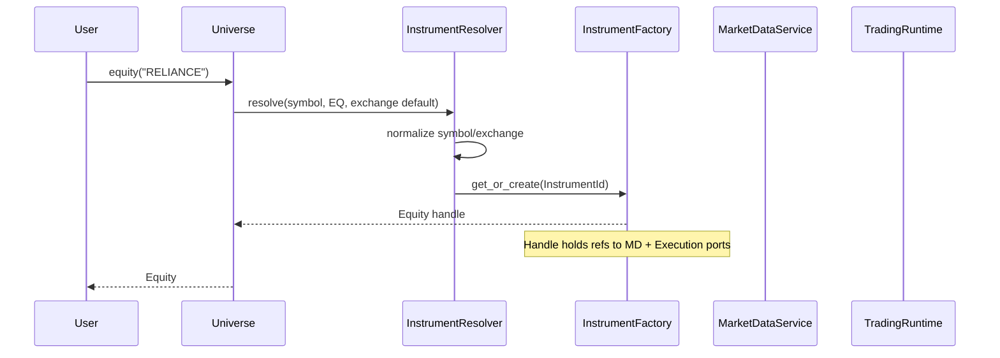

No network yet. Resolver may use instrument master (static CSV/DB).

## 15. Historical data

```python
bars = stock.history("5m", lookback_days=30)
```

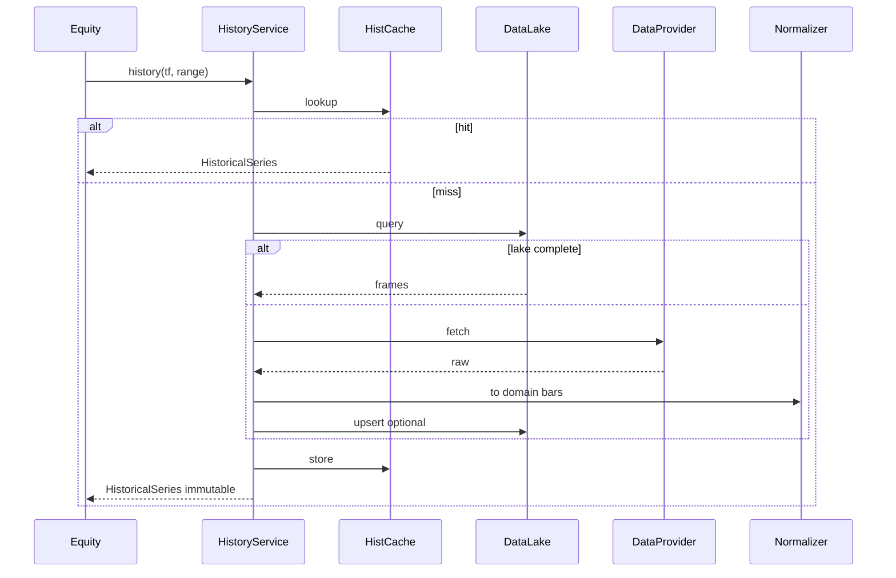

## 16. Live subscription

```python
stock.subscribe(on_tick=...)
```

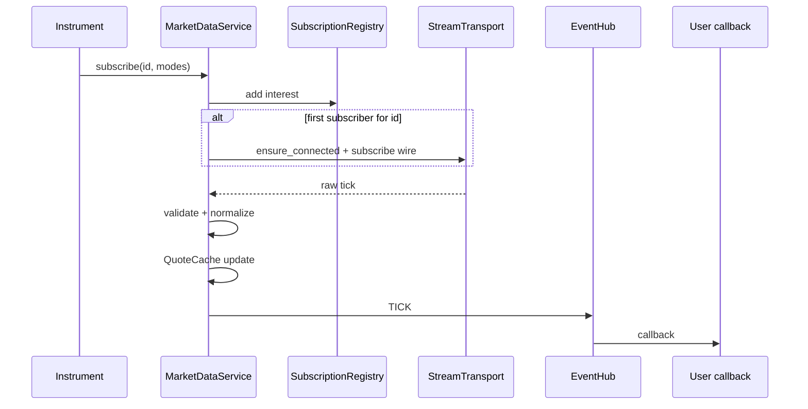

**Recovery:** on reconnect, registry replays interest set; emits resync; does not invent ticks for gaps.

## 17. Quote

```python
q = stock.quote
```

Direct: `QuoteCache.get(id)` → if missing, optional `DataProvider.get_quote` → cache → return.  
No event required.

## 18. Option chain

```python
chain = stock.option_chain(expiry=...)
```

`DataProvider.get_option_chain` → normalize → `OptionChain` aggregate of `Option` instruments → cache short TTL → return.  
Greeks: from vendor or compute service; owner = chain snapshot (immutable).

## 19. Order flow

```python
order = stock.buy(qty=50, order_type=MARKET)
```

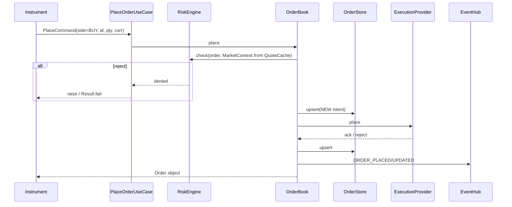

## 20. Position & portfolio updates

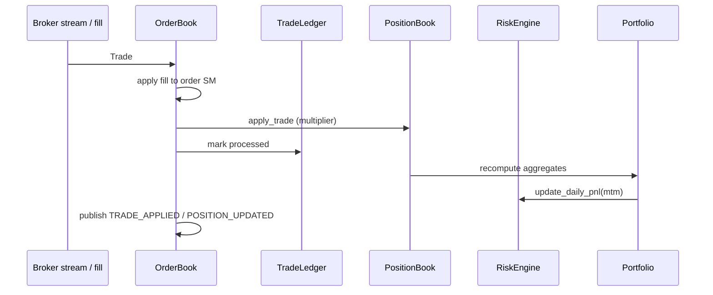

## 21. Market depth

`stock.depth()` / `subscribe_depth`: same as quotes with `DepthCache` owner; higher bandwidth; drop policy explicit (coalesce to latest).

## 22. Broker reconnect

```text
detect stale/heartbeat fail
  → mark health DEGRADED
  → backoff reconnect
  → auth refresh if needed
  → resubscribe SubscriptionRegistry snapshot
  → STREAM_RESYNC event
  → optional REST snapshot refresh for quotes
  → health OK
```

Orders: in-flight tracked by OMS; recon job diffs broker order status.

## 23. Session recovery (crash)

```text
acquire writer lock
load orders, positions, ledger
rebuild memory books
if live: reconcile broker
open/close placement gate
ready
```

## 24. Paper trading flow

Paper = **BrokerPlugin** with `SimFillModel` + **DataProvider** from lake/fixture (validate) or synthetic (toy).  
Orders still go through OMS + Risk. Capital from config.  
**Same SM as live.**

## 25. Backtesting / research flow

```text
VirtualClock + bar source
Strategy.on_bar
SimFillModel (costs from domain.trading_costs)
Portfolio analytics
No live broker
Optional: write results to lake research tables
```

## 26. AI agent flow

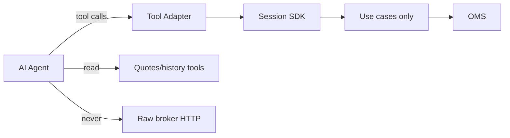

**Tools:** `get_quote`, `get_history`, `place_order`, `cancel`, `positions`, `risk_status`.  
**Guardrails:** same RiskEngine; dry_run mode; allowlist symbols; rate limit tools.  
Agents are **untrusted clients** of the OS, not privileged kernels.

---

# Part IV — Communication patterns

| Pattern | Use when | Avoid when |
|---------|----------|------------|
| **Direct call** | Commands (place), queries (quote, history), risk check | Fan-out to many consumers |
| **In-process EventHub** | Tick fan-out, UI notify, decoupled analytics | Money SoR, cross-process |
| **Callback** | Subscribe ergonomics on Instrument | Business logic forests |
| **Queue + worker** | Heavy strategy compute off WS thread | Ultra-simple scripts (optional) |
| **Durable journal** | Audit capital events | Every tick |
| **DB** | Orders, ledger, lake | Session-only quotes |

**Default:** hybrid **call for command/query + events for notification**.  
This matches IB-style request APIs + market data subscriptions more than pure actor/Kafka trading cores.

---

# Part V — Package structure (target)

```text
trading_os/
  domain/                 # pure: entities, VOs, ports, policies, state machines
    instruments/
    trading/              # order, trade, position, portfolio
    market/               # quote, depth, bar, series
    risk/
    ports/                # Execution, Data, Margin, Store, Clock, ...
  application/
    bootstrap/            # build_kernel
    marketdata/           # HistoryService, QuoteCache, Subscriptions
    trading/              # use cases, OMS, risk engine, recon
    strategy/             # loader, pipeline host
    analytics/            # scanners orchestration (not pure math)
    replay/               # ResearchReplay
  infrastructure/
    persistence/
    messaging/            # EventHub
    resilience/
    observability/
    config/
    secrets/
    time/
  plugins/
    brokers/
      dhan/
      upstox/
      paper/
    indicators/
    strategies/
  adapters/
    lake/                 # DataLakePort impl
  presentation/
    api/
    cli/
    agent_tools/
  tests/
    unit/
    contract/
    integration/
    chaos/
    replay/
    certification/
```

### Per-package template

| Field | Required |
|-------|----------|
| Purpose | one sentence |
| Ownership | state + types |
| Dependencies | allowlist |
| Public API | `__all__` / façades |
| Internal | `_internal/` |
| Extension | entry points |

---

# Part VI — State ownership matrix

| State | Single owner | Writers | Readers |
|-------|--------------|---------|---------|
| Quote (last) | QuoteCache | MD runtime | All |
| Depth (last) | DepthCache | MD runtime | All |
| HistoricalSeries | immutable return / lake | HistoryService, lake ingest | All |
| Subscriptions | SubscriptionRegistry | MD runtime | Broker streams |
| Order | OrderBook + OrderStore | OMS only | Recon, UI |
| Trade processed | TradeLedger | OMS only | Recovery |
| Position | PositionBook | OMS only | Portfolio, risk |
| Portfolio aggregates | PortfolioService | derived from positions | UI, risk feed |
| Risk daily PnL / kill | RiskEngine | RiskEngine | Use cases |
| Account cash | CapitalProvider (broker TTL cache) | provider | Risk |
| OptionChain snapshot | ChainCache | MD | User |
| Indicators | Strategy-local or IndicatorCache per series key | strategy runtime | strategy |
| Config | Config snapshot immutable after boot | bootstrap | All |
| Clock | Clock service | kernel / replay | All |
| Broker health | HealthMonitor | broker runtime | Readyz |

**No duplicated mutable books.** Paper and live share OMS code paths.

---

# Part VII — Testing architecture

| Layer | Scope | Gate |
|-------|-------|------|
| **Unit** | State machines, notional, pure indicators, risk policy | Every commit |
| **Contract** | Each BrokerPlugin vs EP/DP matrix | Every broker change |
| **Integration** | Kernel boot, place→fill→position with fake broker | Phase exits |
| **Replay** | ResearchReplay determinism golden | Strategy change |
| **Recovery / chaos** | Kill -9, dup trade, WS drop, clock skew PnL reset | Release |
| **Performance** | Quote path, place path latency budgets | Nightly |
| **Load** | Subscription fan-out N symbols | Nightly |
| **Certification** | Mode matrix paper_validate/live sandbox | Pre-prod |
| **Cross-broker** | Same scenario two plugins | Release |
| **Architecture** | import-linter + grep no analytics.place | CI |

**Certification scenarios (examples)**

1. MARKET buy equity → fill → position multiplier 1  
2. F&O order margin fail-closed  
3. Kill switch blocks  
4. Restart restores books  
5. Reconnect resubscribes  
6. Scanner→strategy→one order  

---

# Part VIII — Operational architecture

| Area | Design |
|------|--------|
| Logging | JSON; `correlation_id`, `instrument_id`, `order_id` |
| Metrics | `oms_orders_total`, `risk_rejects`, `ws_last_msg_age`, `recon_drift`, `place_latency` |
| Health | live/ready; ready ⇒ lock + auth + recon gate |
| Diagnostics | `doctor` CLI: ports, capabilities, store, capital |
| Alerting | rules on reject rate, ws stale, recon fail, DLQ depth |
| Recovery | documented runbook: gate, recon, kill switch |
| Feature flags | non-risk only; **no flag bypasses RiskEngine** |
| Capabilities | boot validate |
| Versioning | plugin + data schema versions in provenance |
| Config | typed profiles |
| Secrets | interface; env/file interim |
| Deployment | **single active trading node** first; HA = standby cold |

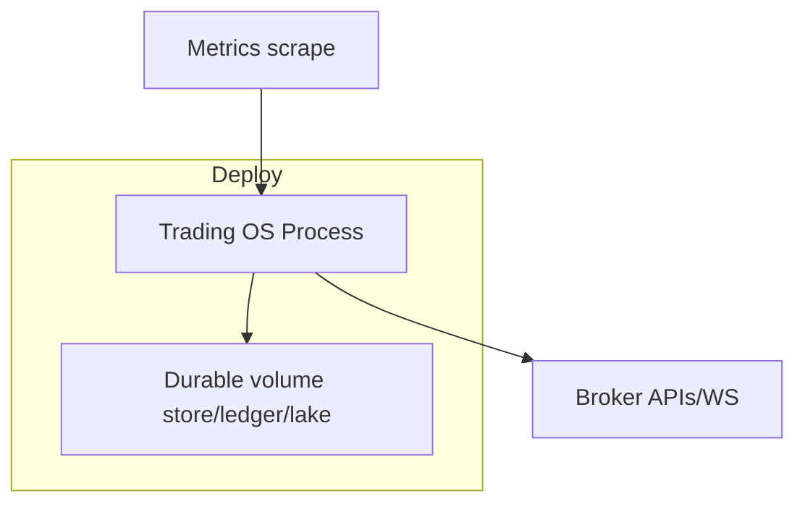

---

# Part IX — Extension model (no core edits)

| Add | Steps |
|-----|-------|
| **Broker** | Implement plugin + EP/DP/MP; register entry point; capability manifest; contract tests |
| **Exchange segment** | InstrumentId + session calendar in domain; mapper in plugin |
| **Instrument type** | Subclass + resolver rules + serializer |
| **Strategy** | Implement protocol; entry point; goldens |
| **Indicator** | Pure function registry |
| **Scanner** | Plugin returning candidates |
| **Analytics engine** | Consume series/portfolio ports; publish reports |
| **Execution algo** | e.g. TWAP as application service using Place use case repeatedly; not broker-specific core |

---

# Part X — Diagram pack (index)

All mermaid sources above cover:

| Diagram | Section |
|---------|---------|
| Overall system | §4 |
| Object model | §3 |
| Startup | §6 |
| Broker runtime | §7 |
| Market data | §8 |
| OMS path | §9 |
| Strategy | §10 |
| Research replay | §12 |
| Threading | §13 |
| Instrument / history / sub / order / position | §14–20 |
| Agent | §26 |
| Deploy | Part VIII |

Additional compact views:

### Dependency graph (packages)

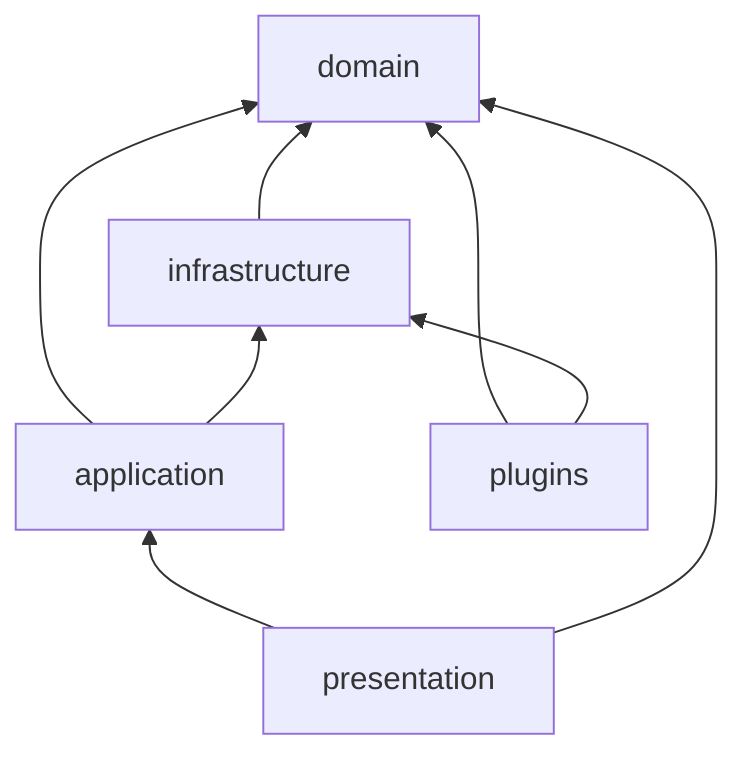

### Event flow (notification only)

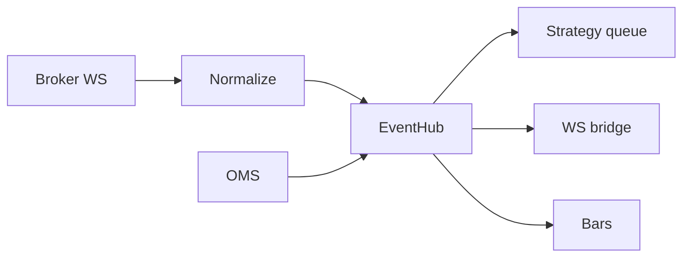

### Broker plugin architecture

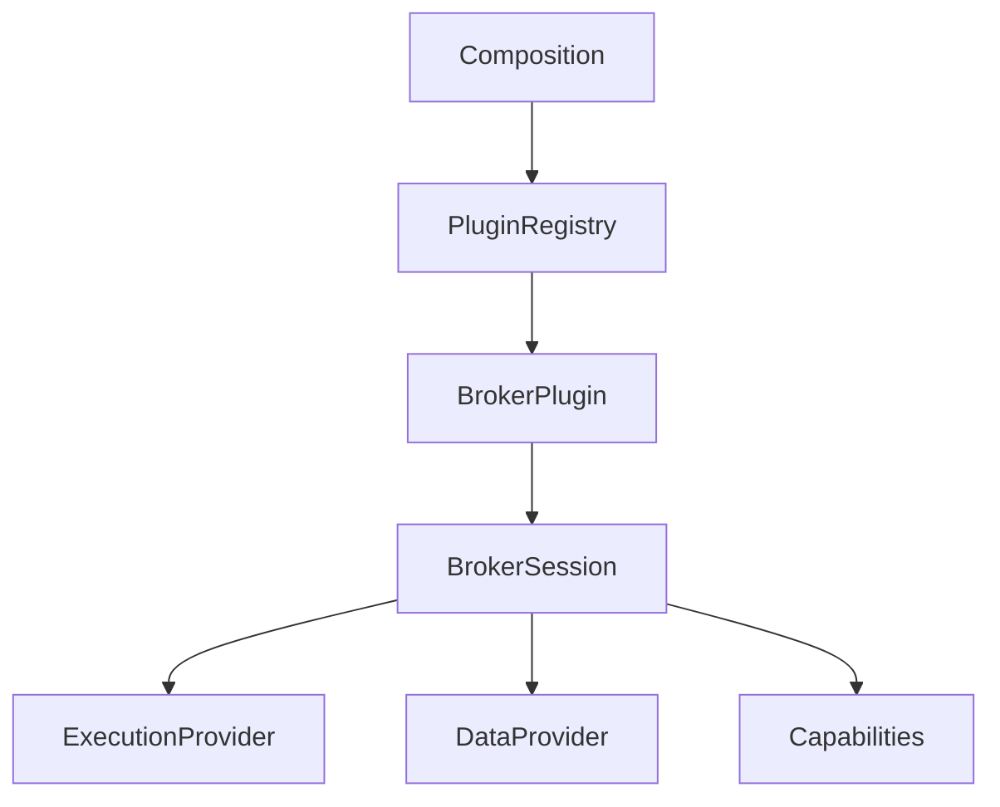

---

# Part XI — Mapping findings → this blueprint

Institutional design that **absorbs** production lessons without being a code review:

| Finding class | Blueprint response |
|---------------|-------------------|
| Multiple place paths | Single use case + OMS only |
| Dead durable store | OrderStore is SoR, wired |
| Risk PnL unwired | Portfolio → RiskEngine continuous |
| MARKET notional hole | MarketContext + NotionalCalculator |
| Phantom capital | Fail-closed CapitalProvider in live |
| Dual paper engines | One Paper plugin |
| Dual resilience | One infrastructure.resilience |
| Pseudo ES recovery | CrashRecovery ≠ ResearchReplay |
| Subscribe silent fail | Broker runtime must error + health |
| Capability lies | Boot validator |
| God gateways | EP/DP split |
| Event bus as SoR | Books + store SoR; hub notify |
| Multi-strategy shell | Strategy runtime + explicit policy |
| AI unchecked | Agent tools = untrusted clients |

---

# Part XII — Incremental evolution (years without rewrite)

**Phase A — Kernel + money path**  
Bootstrap, domain objects, OMS, risk, store, one paper + one live plugin, history+quote.

**Phase B — Market data depth**  
Subscriptions, reconnect, lake quality, option chain.

**Phase C — Strategy + research**  
Strategy plugins, ResearchReplay, scanners, costs.

**Phase D — Hardening**  
Chaos cert, metrics SLOs, doctor, second live broker parity.

**Phase E — Selective distribution**  
Only if needed: move lake/API read replicas; **never** multi-writer OMS without new design.

Each phase ships behind stable ports → **no big-bang rewrite**.

---

# Part XIII — Decision log (summary)

| Decision | Choice | Primary reason |
|----------|--------|----------------|
| Monolith vs services | Modular monolith | Consistency + velocity |
| ES vs snapshot+journal | Snapshot books + audit journal | Ops simplicity |
| Events everywhere | No — notify only | Debuggability |
| Public API | Domain objects / Session | UX like IB + ORM richness |
| Broker integration | Plugins + ports | Agnosticism |
| Paper | Plugin | Parity |
| SoR orders | Store+memory OMS | Recovery |
| Risk | In-process pre-trade + MTM feed | Safety |
| Scale model | Vertical + single writer | Correctness |
| Agent access | Tool façade | Same controls |

---

# Part XIV — Expected outcome

This blueprint yields a Trading OS that:

- Feels like **IB-style sessions + rich instruments**  
- Extends like **plugin platforms** (Kubernetes-ish entry points, not YAML sprawl)  
- Stays **correct** under crash/reconnect like exchange-adjacent systems  
- Evolves **incrementally** (ports stable, modules replaceable)  
- Remains **understandable**: one owner per state, one money path, three replay concepts named honestly  

**Implementation** should track this document as target; use `MODULE_PROGRAM.md` / commit streams to migrate the present codebase **toward** these runtimes without pretending it is already there.

---

*End of Trading OS Blueprint.*
