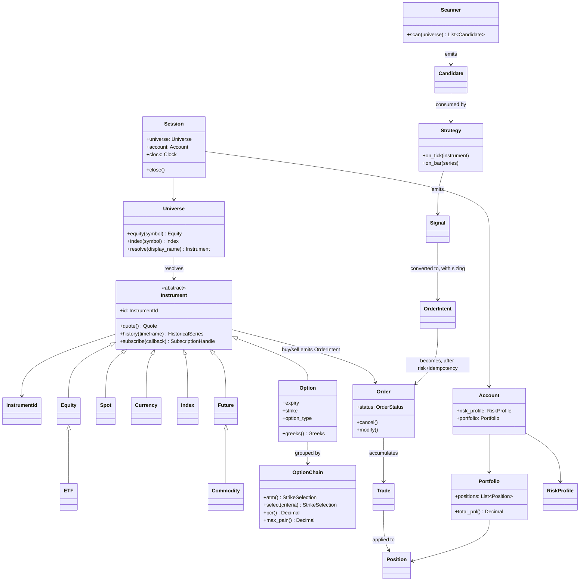
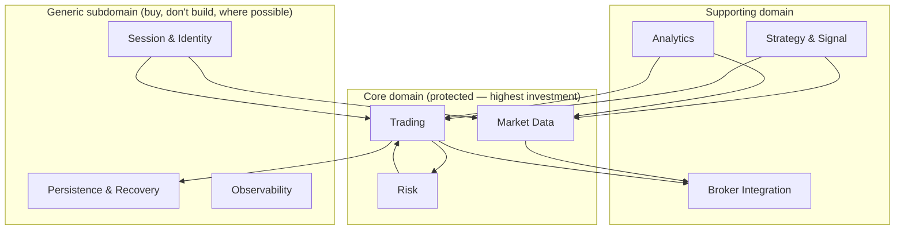
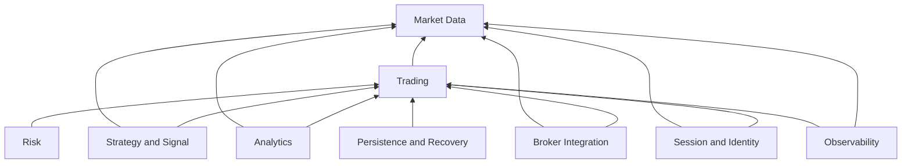

# Trading OS — Blueprint v2 (Supersedes TRADING_OS_BLUEPRINT.md)

**Status:** DRAFT — Part 1 of N. Written independently from first principles; not a
revision of the prior blueprint. Intended to fully supersede
`TRADING_OS_BLUEPRINT.md` once all parts are complete and approved — the prior
file is left in place until then so nothing is lost mid-review.
**Scope of this part:** Ubiquitous language, domain model, bounded context map,
dependency graph, communication contracts. **No folder structure appears in
this document** — package layout is a downstream consequence of the contracts
below, decided in a later part, and it may change without touching anything
in this part.
**Method:** Every noun below is either (a) a concept the business requires
regardless of implementation, derived from the required capability list —
discretionary trading, systematic trading, quantitative research, portfolio
management, paper trading, replay, backtesting, live execution, multi-broker
and multi-exchange operation, AI-agent participation, scanning, market /
portfolio / options / futures analytics, risk management, execution
management, event replay, historical data, and streaming data — or (b) a
concept already load-bearing in the existing implementation (checked against
source, not assumed). Where (b) is used, the source location is cited so the
claim is falsifiable.

---

## 1. Mandate

Build the operating system a systematic desk actually runs on, not a
reference architecture for a trading system. The test for every decision in
this document is: **does an engineer or an AI agent extending this platform
in three years make fewer mistakes because this decision exists, or more?**
Decisions that only exist to look complete on paper are cut.

Two failure modes are equally unacceptable and both must be actively guarded
against:

1. **Under-design** — money-handling code with ambiguous ownership, silent
   dual paths, or contracts that exist only as convention. (This already
   happened once in this codebase: `IdempotencyCache.get()` in
   `src/brokers/dhan/execution/order_placement.py` deletes a cache entry
   under a lock after reading it without one — a real, confirmed race
   condition in money-adjacent code, found in this session's review. That
   class of bug is a contract-ownership failure, not a coding-style failure,
   and no amount of "add more tests" fixes it — the fix is an OS-level rule:
   **exactly one component owns each piece of mutable state, and it is
   named in Part 6.**)
2. **Over-design** — abstractions justified by "some broker might need this
   someday." Every port in this document is justified by a capability in
   the mandate list above, or it is not in this document.

---

## 2. Ubiquitous Language

This is the vocabulary every conversation, log line, metric name, exception
class, and variable name in the platform must use consistently. A word not
in this glossary should not appear as a domain type name. Ambiguity here
propagates into code as silently as a missing test.

| Term | Definition | Explicitly NOT |
|---|---|---|
| **Instrument** | A tradeable thing with an identity, a market-data surface, and (where applicable) an order-entry surface. The unit of domain modeling. | Not a DTO. Not a broker's symbol string. Not a row in a CSV. |
| **InstrumentId** | The immutable, broker-agnostic identity of an Instrument (asset class + underlying + exchange + expiry/strike where relevant). | Not a broker's `security_id` or `instrument_key` — those are transport-layer concerns, translated at the broker boundary and never leaked past it. |
| **Session** | The lifetime-scoped handle a caller holds after connecting: owns a Universe, an optional order-entry capability, and a clock. One Session per logical "desk seat" — not one per broker connection (a Session may span brokers for data while trading through one). | Not a broker's login/auth token. Not a singleton — multiple Sessions may coexist in one process (e.g. one live, one research). |
| **Universe** | The catalog of Instruments a Session can resolve by name/kind, backed by an instrument master. | Not a cache of live quotes — that's the Market Data context's job. |
| **Quote** | A point-in-time market data snapshot (ltp/bid/ask/volume/ohlc) for one Instrument, with an explicit `as_of` timestamp and provenance (which source, how stale). | Not "the current price" as an ambient fact — every Quote is a value stamped with when and from where it was observed, because "is this stale" is a question every consumer must be able to ask. |
| **HistoricalSeries** | An immutable, timeframe-stamped sequence of bars for one Instrument over a date range. | Not a mutable growing buffer — a fresh request returns a fresh immutable value; live-extending views are a distinct, explicitly named concept (see **LiveSeries**, deferred — Part 3). |
| **MarketDepth** | A leveled order-book snapshot (bids/asks by level) for one Instrument, broker-capability-dependent (5/20/30/200 levels — capability, not a hardcoded broker special case). | Not the same type as Quote — depth has an explicit level count and is asymmetric across brokers; forcing it into Quote's shape hides that asymmetry. |
| **Order** | A single instruction to transact, with a lifecycle (see State Machine, Part 3) owned by exactly one component (**OrderBook**, Part 6). | Not a broker's raw order JSON — that is mapped at the broker boundary. Not something a Strategy or Scanner constructs directly — it comes from an **OrderIntent** passed through the **Trading context**. |
| **OrderIntent** | The caller's request to trade (side, quantity, instrument, order type, price/trigger, correlation_id) before risk and idempotency are applied. | Not an Order — an OrderIntent may be rejected and never become an Order. This distinction exists because "the strategy tried to place an order but risk blocked it" and "the order was placed" are different facts an audit must be able to tell apart. |
| **Trade** (a.k.a. Fill) | A single execution event against an Order — quantity, price, timestamp, broker trade id. | Not the same as Order — one Order may accumulate many Trades (partial fills). |
| **Position** | The net holding in one Instrument for one Account, derived exclusively from applied Trades (never set directly). | Not a cache of the broker's position endpoint — that is **reconciliation input**, a check against the derived Position, not the source of it. |
| **Portfolio** | The aggregate view across all Positions for one Account: exposure, PnL (realized + unrealized), margin usage. | Not a god-object that also does order placement — Portfolio is a read/aggregation concept only. |
| **Account** | The broker-side entity holding capital, positions, and orders — one per (broker, client_id) pair. | Not the same as Session — a Session may reference one or more Accounts across brokers for data-only, but a Trading context binds to exactly one Account (or a documented multi-account/multi-strategy allocator, Phase 3 — see Part 12). |
| **RiskProfile** | The set of pre-trade and continuous risk rules bound to an Account (max daily loss, max position size, max gross exposure, kill switch state). | Not a global — every RiskProfile is scoped to one Account so multi-strategy or multi-account operation never shares risk state by accident. |
| **Broker** | An external venue-access provider (Dhan, Upstox, Paper, future additions), reduced at the domain boundary to whatever capability ports it implements. | Not a god-object gateway — see **Broker Runtime** boundary rules, Part 4. Not something a Strategy or Instrument talks to directly. |
| **BrokerCapability** | A named, individually-queryable feature a Broker may or may not support (e.g. `depth_20`, `native_slice_order`, `gtt_orders`). Advertised and validated at boot — a Broker cannot claim a capability it doesn't actually implement (this is an existing, correct rule already enforced by `brokers/common/capabilities_validator.py` — kept). | Not a version number or a broker-name `if` check scattered through calling code. |
| **Session Calendar** | The set of trading hours / holidays for one Exchange, used to answer "is the market open" and to gate stale-data alerts. | Not hardcoded per broker — one Exchange has one calendar regardless of which Broker is used to trade it. |
| **Strategy** | A named, pluggable decision unit: given Instrument state (and optionally Indicator/Scanner output), emits zero or more OrderIntents. | Not allowed to call a Broker or an ExecutionProvider directly — every Strategy path to an order goes through the same Trading context as a human clicking "buy." |
| **Scanner** | A pluggable unit that evaluates the Universe (or a subset) and emits **Candidates** — instruments plus a reason, not orders. | Not a Strategy — a Scanner never places an order; it feeds Strategies. |
| **Signal** | The output of a Strategy evaluation: an opinion (direction/confidence/optional sizing hint) about an Instrument, prior to becoming an OrderIntent. | Not the same as OrderIntent — sizing/risk conversion is a separate, named step (Part 3, §Order Flow) so it is testable independently of strategy logic. |
| **Indicator** | A pure function (or stateless pipeline of pure functions) over a HistoricalSeries or live tick stream, producing derived series (e.g. moving average, RSI). | Not permitted to hold broker state, call network I/O, or depend on anything but its numeric input — this is what makes Indicators independently unit-testable and shareable between live, paper, and Replay without change. |
| **OptionChain** | An aggregate of Option instruments for one underlying + expiry, with derived views (ATM, moneyness buckets, PCR, max pain) and Greeks. | Not a dict of strike→price — it is an object with behavior, matching the object-first mandate. |
| **Greeks** | The computed sensitivities (delta, gamma, theta, vega, rho) for an Option, either vendor-supplied or computed by the platform's own pricing model — the source is always stamped so a consumer can tell which. | Not assumed accurate/interchangeable across the two sources without the stamp. |
| **Replay** | An umbrella word this platform explicitly **refuses to use unqualified**, because it currently means three different things people confuse in conversation and in code. Every use must be one of: **ResearchReplay**, **SessionRecording**, or **CrashRecovery** (defined below). This naming discipline is adopted deliberately from real prior confusion in this codebase's own docs (`docs/architecture/TARGET_SYSTEM_DESIGN.md` §12 makes the same distinction independently) — the convergence is a signal this rule is correct, not an accident to remove. |
| **ResearchReplay** | Running a Strategy over HistoricalSeries with a virtual clock and a simulated fill model, to produce a deterministic equity curve for research. | Not connected to any live broker. Not the same code path as CrashRecovery. |
| **SessionRecording** | An optional durable capture of ticks/orders during a live session, for later offline analysis — pure observability, never read back into a live decision path. | Not a source of truth for anything; deleting a recording changes no live behavior. |
| **CrashRecovery** | The boot-time process of rebuilding OrderBook and PositionBook from durable storage plus broker reconciliation after a process restart. | Not "replaying" market data at all — no bars are read; this is store-rehydration, and calling it "replay" is exactly the naming collision this glossary forbids. |
| **Reconciliation** | The scheduled or boot-time comparison of the platform's derived Position/Order state against the Broker's reported state, producing a diff and a heal decision. | Not a silent auto-correct by default — heal policy is explicit and auditable (Part 3). |
| **Correlation ID** | A caller-supplied (or platform-generated) idempotency key attached to every OrderIntent, required outside of tests, used to make retried "place order" calls safe. | Not optional in any live/paper code path — already an enforced invariant in the existing OMS (`application/oms/idempotency_guard.py`) and correctly kept. |
| **Provenance** | The stamped record of where a piece of data came from and how confident the platform is in it (source id, fetched-at, confidence level) — already a real, correct concept in this codebase (`domain.provenance.DataProvenance`) and adopted unchanged because every Quote/HistoricalSeries/Greeks value needs exactly this. | Not a log line — it travels with the value itself so a consumer three layers away can still ask "how sure are we of this." |
| **Fill Model** | The pluggable strategy that decides how an OrderIntent becomes Trades in a given mode (LiveFillModel = real broker, PaperFillModel = simulated matching, BacktestFillModel = bar-based with cost model). | Not a per-broker special case — same protocol, three implementations, so the Order lifecycle state machine literally cannot tell which one is running underneath it. |
| **Trading Cost Model** | The explicit, versioned model for slippage/commission/statutory charges applied in PaperFillModel and BacktestFillModel, so research PnL is not silently optimistic. | Not embedded ad hoc inside a backtest script — it is a named domain concept with a version, because "which cost model produced this equity curve" must be answerable months later. |
| **AI Agent** | An automated caller that interacts with the platform exclusively through the same Session/Instrument/OrderIntent surface a human or Strategy uses, subject to the same RiskProfile, with no privileged bypass. | Not a kernel-level actor. Not exempt from Correlation ID, risk checks, or audit. |

---

## 3. Domain Model — object relationships

**Correction (verified after Part 1 was first drafted):** the claim below
originally said the OrderIntent/Order split was a new contribution of this
blueprint. That was checked against source after writing and found **wrong**
— left here, struck through, rather than silently fixed, because a blueprint
that hides its own factual corrections is worse than one that shows its
work. ~~What is new here is making OrderIntent a first-class type distinct
from Order (today the codebase conflates the pre-risk request and the
post-risk entity), and making Signal distinct from OrderIntent.~~

**What is actually true:** the `Instrument` hierarchy (`Equity`, `ETF`,
`Spot`, `Currency`, `Index`, `Future`, `Commodity`, `Option`) is real,
already implemented at `src/domain/instruments/instrument.py`, and is
**correct as a hierarchy** — kept unchanged. **`OrderIntent`
(`src/domain/orders/intent.py`) already exists exactly as this document
would have proposed it** — a frozen, side-effect-free dataclass with no
broker fields, already flowing through `OrderServicePort.place(intent:
OrderIntent)`. **`SignalDTO` (`src/domain/models/trading.py`) already exists
too**, already distinct from `OrderIntent`, already carrying a `confidence`
field for exactly the strategy-opinion-vs-risk-sized-order separation this
document would have asked for. Nothing in §3's type distinctions is new;
all three were already correctly designed. The genuine open question — not
yet answered by existing code, and picked up in Part 2 — is whether **every
caller** (CLI, API, Strategy runtime, AI agent tool) is actually required to
construct an `OrderIntent` and go through `OrderServicePort`, or whether any
path still bypasses it. That is a wiring/enforcement question, not a
missing-type question.

---

## 4. Bounded Context Map

Nine contexts. Each has exactly one reason to change. A context is a
*conceptual* boundary — Part 12 will map contexts to packages, and the
mapping is not required to be 1:1 (a context can span several packages; a
package must not span several contexts).

| Context | Single reason to change | Owns (concepts, not files) | Classification (Evans) |
|---|---|---|---|
| **Session & Identity** | The rules for what a caller is allowed to connect as change (new mode, new auth pattern). | Session, Universe resolution rules, connect-mode semantics (sim/market/trade). | Generic — every trading platform needs this, low differentiation value. |
| **Market Data** | The rules for how a Quote/HistoricalSeries/Depth is normalized, cached, or fanned out change. | Quote, MarketDepth, HistoricalSeries, SubscriptionRegistry, OptionChain assembly. | **Core** — data quality and latency is a genuine competitive differentiator for a systematic desk. |
| **Trading** | The rules for how an OrderIntent becomes an Order, how Trades apply to Positions, or the Order state machine change. | OrderIntent, Order, Trade, Position, Portfolio, the state machine, idempotency. | **Core** — this is the money path; correctness here is the whole point of the platform. |
| **Risk** | A pre-trade check, a continuous monitor, or a kill-switch rule changes. | RiskProfile, pre-trade checks, daily PnL monitor, margin estimation. | **Core** — deliberately separated from Trading even though tightly coupled, because risk rules change on a different cadence (compliance/desk-driven) than order mechanics (engineering-driven); Evans' rule that a bounded context boundary should track "who changes this and why," not just "what calls what." |
| **Broker Integration** | A broker adds/removes an API, changes auth, or a new broker is onboarded. | BrokerCapability, the plugin contract, per-broker auth/session/rate-limit/reconnect logic. | Supporting — necessary, not differentiating; isolated precisely so it *can* be generic-feeling infrastructure work without touching Core. |
| **Strategy & Signal** | A new strategy type, a new indicator, or the signal→sizing conversion rule changes. | Strategy, Scanner, Signal, Indicator, Candidate. | Supporting — the platform's job is to make building these fast and safe, not to itself be a strategy. |
| **Analytics** | A new portfolio/options/futures analytic or reporting view is added. | Option/Future math (Greeks, payoff, basis), portfolio PnL attribution, ResearchReplay, cost models. | Supporting — read-heavy, no write path into Trading. |
| **Persistence & Recovery** | The durability guarantee, the recovery procedure, or the reconciliation heal policy changes. | OrderStore, TradeLedger, CrashRecovery procedure, Reconciliation. | Generic — SQLite/Postgres-shaped problem; buy-don't-build where a library exists (e.g. use a real WAL-backed store, don't write one). |
| **Observability** | A new metric, log shape, or alert rule is needed. | Structured logging, metrics, health/readiness, audit trail. | Generic. |

**What is explicitly excluded from being its own context, and why:**
"AI Agent" is *not* a bounded context — it is a **client** of Session &
Identity, Trading, and Market Data, exactly like a human CLI user or a
Strategy. Giving it its own context would imply it has different domain
rules, which the mandate explicitly forbids ("agents are untrusted clients
of the OS, not privileged kernels" — this framing already existed
independently in the prior blueprint and is correct; kept because it is
right, not because it is prior art).

---

## 5. Dependency Graph — allowed import directions (binding, before any folder exists)

This is the part of the document that does not change when packages get
renamed. Every rule below is enforceable today by import-linter-style
tooling regardless of what the physical package layout ends up being in
Part 12.

Read the arrows as "depends on" (arrow points from dependent to depended-on),
drawn bottom-to-top so **Market Data and Trading are the stable core at the
bottom** — everything else may depend on them; they depend on nothing above
this line.

### 5.1 The rules, stated as forbidden edges (the actual contract)

| # | Rule | Rationale |
|---|---|---|
| D1 | **Market Data and Trading never import Broker Integration.** | This is the single most important rule in the document. A Broker is a plugin; Core must be able to run against a fake broker in tests with zero code path difference from production. Violating this is exactly how a codebase ends up with `if broker_name == "dhan"` inside domain logic. |
| D2 | **Trading never imports Analytics or Strategy & Signal.** | Trading must be usable (and testable) with zero strategies loaded. A scanner bug must never be able to affect order state. |
| D3 | **Strategy & Signal never imports Broker Integration.** | A Strategy that could call a broker directly reintroduces the "second order path" defect class already found and fixed once in this codebase's history (see the existing `docs/architecture/TARGET_SYSTEM_DESIGN.md` G1 goal — "one money path" — this rule is the enforcement mechanism for that goal, not a restatement of it). |
| D4 | **Analytics never writes to Trading.** Analytics may *read* Portfolio/Position snapshots and *read* Market Data, but has no path to construct or submit an OrderIntent. | Keeps "research code accidentally placed a live order" structurally impossible, not just policy. |
| D5 | **Risk depends on Trading's types (Order, Position) but Trading does not depend on Risk's internals** — Trading depends only on a `RiskCheckPort` (a protocol), which Risk implements. | This is the one place the natural coupling is inverted deliberately: Risk needs to know the shape of an Order to evaluate it, but Trading must be constructible with any risk policy (including a permissive one, for tests) without knowing Risk exists as a concrete package. Classic Dependency Inversion, applied because these two contexts change on genuinely different schedules (§4 table). |
| D6 | **Broker Integration depends on Market Data's and Trading's port definitions, never on their implementations.** | This is what makes "add a broker" a plugin operation instead of a core-editing operation — the mandate's explicit requirement. |
| D7 | **No context imports Observability's implementation, only its port** (a logger/metrics protocol). Observability may import from everything (it's allowed to know what it's observing). | Prevents "add a log line" from ever becoming a circular-import problem, while keeping Observability genuinely cross-cutting. |
| D8 | **Persistence & Recovery depends on Trading's types (it stores Orders/Positions), Trading depends only on `OrderStorePort`/`TradeLedgerPort`.** | Same inversion pattern as D5, for the same reason — swapping SQLite for Postgres must never touch Trading. |

### 5.2 Why this graph, and what was rejected

| Alternative considered | Rejected because |
|---|---|
| Strict layered architecture (Domain → Application → Infrastructure → Presentation, one direction only, contexts not distinguished) | Collapses Risk and Trading into one undifferentiated "application" layer, losing the different-change-cadence signal from §4 that is the actual reason to separate them. A pure layer diagram answers "what depends on what" but not "who owns the decision to change this," which is the question that actually predicts merge conflicts and code review friction. |
| Fully hexagonal, every context symmetric with its own ports/adapters | Correct in spirit, but treating Observability and Session & Identity as full peers of Trading and Market Data overstates their differentiation — they're Generic subdomains (§4); giving them the same ceremony as Core wastes engineering effort on the wrong things. |
| No enforced graph, "just use good judgment" | This is the actual current failure mode: the `IdempotencyCache` bug cited in §1 exists inside a broker package precisely because there was no rule forcing money-adjacent state ownership to live in exactly one place. Rules that aren't machine-checked don't survive deadline pressure. |

**Verification mechanism (binding, not aspirational):** these nine contexts
and eight rules must be expressible as import-linter (or equivalent)
contracts and run in CI on every commit, the same discipline this codebase
already correctly applies today (`pyproject.toml`
`[[tool.importlinter.contracts]]`, verified present and passing during this
session's review) — kept and extended to the two new contexts (Risk as
distinct from Trading; Strategy & Signal as distinct from Analytics) that
the current import-linter configuration does not yet separate.

---

## 6. Communication Contracts

For each pair of contexts that talk to each other, the contract states:
**pattern**, **cardinality**, **failure semantics**, and **why not the
alternative**. This section exists so that "should X be an event or a
function call" is never re-litigated ad hoc per pull request.

| From → To | Pattern | Cardinality | Failure semantics | Why not the alternative |
|---|---|---|---|---|
| Session & Identity → Market Data | Direct call (`universe.equity(...)`) | 1:1 request/response | Raises typed error (`InstrumentNotFoundError`); never returns a silently-empty object. | An event here would mean instrument resolution is async and eventually-consistent, which is false — it's a synchronous catalog lookup. Using events for genuinely synchronous operations is the "bus for everything" anti-pattern this document explicitly rejects. |
| Instrument (Market Data) → Broker Integration, via port | Direct call for quote/history (request/response); **callback + fan-out** for subscribe | Quote/history: 1:1. Subscribe: 1 subscription → N downstream callback consumers via an in-process hub. | Quote/history failure raises to caller. Subscribe failure (stream drop) must be **loud** — surfaced as a health-state transition, not swallowed (this reverses a confirmed defect: `src/brokers/upstox/data_provider.py`'s pre-fix behavior silently returned an empty handle when no stream method existed, found and fixed earlier this session). | Polling instead of subscribe callback would be simpler but cannot meet the streaming-data requirement in the mandate at any reasonable latency; a callback is the minimum mechanism that satisfies "streaming" without over-engineering to a full message bus. |
| Trading → Risk, via `RiskCheckPort` | **Direct synchronous call**, in the critical path of every OrderIntent | 1:1, blocking | A Risk check timeout or exception must **fail closed** (reject the order), never fail open. | This must never be an event — "check risk, then maybe place the order later when the risk-check event comes back" is a race condition by construction in a money path. Direct call is the only correct answer here; this line item exists specifically to foreclose it from being revisited as an "eventify everything" refactor later. |
| Trading → Persistence & Recovery, via `OrderStorePort` | **Direct synchronous call**, and specifically **before** the Broker Integration call in the Order flow (write-ahead) | 1:1 per state transition | Store write failure aborts the order attempt before it reaches the broker — never place-then-persist. | Write-ahead ordering is the entire mechanism that makes CrashRecovery possible; this is not a style preference, it is the invariant recovery depends on. |
| Trading → Observability | **Fire-and-forget event**, non-blocking | 1:N (many subscribers: metrics, audit log, UI) | A dropped observability event must never affect order processing — the hub is best-effort by design for this edge specifically (contrast with the OrderStore edge above, which is never best-effort). | This is the one edge where an event bus is the right tool: fan-out, no response needed, and losing an event costs visibility, not money. Distinguishing "which edges tolerate best-effort" is exactly why this table exists instead of a single blanket "use events" or "use calls" rule. |
| Strategy & Signal → Trading | Direct call, but **only** through the same `OrderIntent` entrypoint a human/CLI/API caller uses | 1:1 per intent | Same risk/idempotency path as any other caller — no privileged fast path. | A separate "strategy order path" is precisely the second-money-path defect class this whole document exists to prevent (§5.1 D3). |
| Analytics → Market Data / Trading (read-only) | Direct call, read-only projections (Portfolio snapshot, HistoricalSeries) | 1:1 request/response | Returns immutable snapshots; Analytics never holds a live mutable reference into Trading's or Market Data's owned state. | Sharing mutable state here (e.g. Analytics holding a reference to the live PositionBook) would violate the single-owner-per-state rule (Part 6 of the eventual Part-6 state-ownership table) and make Trading's invariants unverifiable in isolation. |
| Broker Integration → Trading (inbound: fills, order updates) | **Callback into Trading's ingestion port**, Trading immediately applies write-ahead then fans out via Observability's event edge | Broker: 1 event → Trading: 1 state transition | Duplicate delivery must be idempotent (`TradeLedger` dedup by trade key) — brokers *will* redeliver, this is treated as guaranteed, not exceptional. | This is inbound, not outbound, so it is a genuinely async, at-least-once delivery problem (unlike the outbound Risk-check edge) — modeling it as anything other than "idempotent callback" would be pretending broker WS delivery is more reliable than it is. |
| AI Agent → Session & Identity / Trading / Market Data | Same direct-call surface as any Session client; no separate "agent API" | 1:1, same as human/CLI | Same risk/idempotency/audit path, no exceptions. | A bespoke agent protocol would be a second surface to keep in sync with the human one forever — the mandate's "agents are untrusted clients, not privileged kernels" is enforced structurally by *not building a second door*. |

---

## 7. What Part 1 deliberately leaves open

Named here so nothing is silently decided by omission:

- **Package/folder layout** — Part 12, downstream of everything above.
- **The exact Order state machine transitions** — Part 3 (flows), needs the
  contracts above as a prerequisite, not the other way around.
- **Multi-strategy / multi-account capital allocation** — genuinely deferred
  (not punted by neglect): the mandate lists "portfolio management" but does
  not require day-one multi-strategy capital partitioning, and inventing that
  contract before a second strategy exists to stress-test it would be
  exactly the speculative abstraction this document's own working rules
  forbid. Revisited in Part 12's phased evolution once §4/§5/§6 have shipped
  and been used.
- **Concrete port method signatures** (`ExecutionProvider`, `DataProvider`,
  etc.) — Part 4, informed by but not copied from the already-reasonable
  existing definitions at `src/domain/ports/protocols.py`.

---

*End of Part 1. Part 2 (Object Hierarchy & Public SDK Design) continues from
§3's class diagram outward to the actual callable API surface
(`reliance.buy()`), and must not restate anything decided above.*
