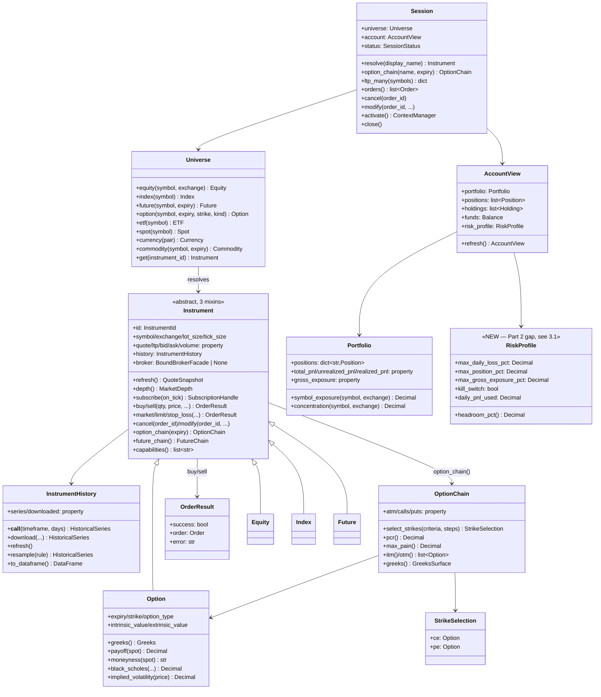

# Trading OS — Blueprint v2, Part 2: Object Hierarchy & Public SDK Design

**Continues from:** `TRADING_OS_BLUEPRINT_V2.md` (Part 1 — ubiquitous
language, bounded contexts, dependency graph, communication contracts).
**Does not restate Part 1.** Builds §3's class diagram outward to the actual
callable method surface.

**Method, stated up front because it changes this part's tone:** every
object surface described below was checked against real source before being
written down. Where the SDK already exists and is good, this part says so
and cites the file — that is not padding, it's the same discipline Part 1
applied to itself when it corrected its own OrderIntent/Signal claim after
verification. Where a gap is real, it is stated narrowly, against the
specific missing piece, not as a rebuild.

---

## 1. What already exists and is kept unchanged (verified)

The product-facing SDK mental model already matches the mandate's
`reliance.buy()` / `chain.atm.greeks.delta` bar, end to end, for the golden
path:

```python
import tradex

session = tradex.connect("dhan", mode="trade")
stock = session.universe.equity("RELIANCE")

stock.quote                        # QuoteSnapshot — no network call, cache read
stock.refresh()                    # forces a live fetch
stock.history("5m", days=5)        # HistoricalSeries
stock.subscribe(on_tick=...)       # SubscriptionHandle
stock.buy(10, price=2500)          # OrderResult, via OrderServicePort

chain = stock.option_chain(expiry=0)
chain.atm.greeks.delta
chain.pcr()

acc = session.account.refresh()
acc.portfolio.total_pnl
```

Verified real, not aspirational, against:

| Surface | Source |
|---|---|
| `Instrument.quote/ltp/bid/ask/refresh/depth/spread/mid_price` | `src/domain/instruments/instrument_market_data.py` |
| `Instrument.subscribe/unsubscribe/on_tick/on_quote/on_depth/on_disconnect/on_reconnect` | `src/domain/instruments/instrument_streaming.py` |
| `Instrument.buy/sell/market/limit/stop_loss/cancel/modify` | `src/domain/instruments/instrument_trading.py` |
| `Instrument.option_chain()/future_chain()` | `src/domain/instruments/instrument.py` |
| `Instrument.broker` (capability-scoped extensions, e.g. `depth20()`) | same file, `broker` property |
| `Portfolio.total_pnl/unrealized_pnl/realized_pnl/gross_exposure/concentration` | `src/domain/portfolio/portfolio.py` |
| `AccountView.portfolio/positions/holdings/funds/refresh()` | `src/domain/portfolio/account_view.py` |
| `DataProvider`/`ExecutionProvider` as the sole ports Instrument depends on | `src/domain/ports/protocols.py` |
| `OrderServicePort.place(OrderIntent) / cancel / modify` | `src/domain/ports/order_service.py` |

**This is a well-designed object surface already.** It correctly:
- Never exposes a broker gateway to product code (`Instrument` holds a
  `DataProvider`/`ExecutionProvider`, never a `DhanHttpClient`).
- Returns rich objects, not dicts, at every layer (`QuoteSnapshot`,
  `HistoricalSeries`, `OptionChain`, `Portfolio` — all typed, all with
  behavior, matching the "make illegal states unrepresentable" and
  "small objects collaborating" principles from the mandate).
- Already decomposes `Instrument` into three mixins
  (`InstrumentStreamingMixin`, `InstrumentMarketDataMixin`,
  `InstrumentTradingMixin`) rather than one 800-line god class. **This is a
  correction to this session's own earlier repository review**, which
  flagged `instrument.py`'s 823-line count as a "god-module candidate" by
  raw line count alone — that flag was wrong. The file is long because it's
  three cleanly separated concerns composed via mixins plus the shared
  `Equity`/`Future`/`Option` subclass definitions, not because one class does
  too much. Line count is not a reliable smell detector on its own; this is
  the concrete example showing why — worth remembering for every future
  pass through this codebase.

---

## 2. Object hierarchy — full method surface (target, mostly-already-real)



---

## 3. Verified gaps — the actual work Part 2 contributes

Three, and only three, after checking. Naming a fourth would be inventing
work; these three are real because each is grounded in a specific file that
already has the concept partially built and stops short.

### 3.1 `RiskProfile` — promote from internal config to public, read-only SDK object

**What exists today:** `application/oms/_internal/risk_manager.py` defines
`RiskConfig` — `max_daily_loss_pct`, `max_position_pct`,
`max_gross_exposure_pct`, `kill_switch`, `margin_safety_multiplier` — with
exactly the shape a public `RiskProfile` needs. It is `frozen`, replaced
atomically on `set_kill_switch()`. **It already has the right shape and the
right immutability discipline.** It is simply not reachable from the public
SDK surface — there is no `session.account.risk_profile` today, so a
strategy author (human or AI agent) has no discoverable way to ask "how much
daily-loss headroom is left before my next order gets rejected" without
reaching into `_internal`.

**The gap, precisely:** add a read-only `RiskProfile` view (not a new risk
engine, not new rules) that projects the existing `RiskConfig` plus the
existing `RiskManager._daily_pnl` running total into a public object with
one new derived method, `headroom_pct()`, computed as
`1 - (daily_pnl_used / (capital * max_daily_loss_pct))`. Expose it at
`session.account.risk_profile`. This is additive and read-only — it changes
no risk *decision*, only *visibility* into a decision that was already being
made silently.

**Why this is worth doing and not scope creep:** the mandate requires the
platform to support AI agents as first-class callers, held to the same
`RiskProfile`. An agent (or a human) that cannot introspect its own risk
headroom before attempting an order will learn the limit only by hitting
rejections — workable, but strictly worse than an OS that lets a caller ask
first. This is the direct, narrow SDK consequence of Part 1's AI-agent
communication contract (§6: "same risk/idempotency/audit path, no
exceptions") — if agents share the risk path, they need the same
introspection a human operator already gets by reading logs.

### 3.2 The ambient-session order-service fallback is a real, self-flagged inconsistency — resolve it, don't leave it

**What exists today, verbatim from `src/domain/instruments/instrument.py`
`_resolve_order_service()`:**

```python
if osvc is not None:
    logger.warning(
        "orders_via_ambient_session symbol=%s — prefer session.universe.* stamps",
        self.symbol,
    )
    return osvc
```

The code already contains its own review comment: this path works, but the
author who wrote it already knew it was the wrong path and left a runtime
warning saying so, rather than either removing it or promoting it. That is
an unresolved decision sitting in production code, not a design gap this
document is inventing.

**The actual decision to make (not "add more logging"):** pick one.

| Option | Consequence |
|---|---|
| **(a) Remove the ambient fallback entirely** — `Instrument.buy()` raises `NotConfiguredError` unless explicitly stamped via `session.universe.equity(...)`, never falling back to `get_ambient_session()`. | Matches the "no silent fallback path" principle stated in this document's own §1 under-design warning. Breaking change for any caller currently relying on ambient resolution — needs a grep of real call sites before landing, not assumed safe. |
| **(b) Keep it, but make it a first-class, intentional API** — `session.activate()` (already exists, per `docs/OBJECT_MODEL.md` §Session & Universe) is the documented, supported way to get ambient behavior; remove the warning because the path is then sanctioned, not tolerated. | Requires auditing that `session.activate()` is the *only* way ambient state gets set — if `get_ambient_session()` can be populated by anything other than the documented context manager, (b) doesn't actually close the gap, it just stops logging about it. |

This document takes no position between (a) and (b) here — that decision
needs the actual call-site grep against the current tree, which is
implementation work for a later phase (Part 12), not an architecture
decision this part can make blind. What Part 2 does assert: **a warning
that has been sitting in the code telling future readers "prefer the other
path" is not a resolved design** — one of (a)/(b) must be chosen and the
warning removed, one way or the other, before this is considered done.

### 3.3 Signal → OrderIntent sizing is real pure math, not yet a named, discoverable step

**What exists today:** `domain/orders/sizing.py`'s
`compute_order_quantity(equity, price, max_position_pct) -> int` is exactly
right as *math* — pure function, no side effects, easily unit-testable. It
is called ad hoc from analytics engines and the trading orchestrator. There
is no method on `SignalDTO` (`domain/models/trading.py`) that turns "I have
a signal with 0.9 confidence" into "here is the OrderIntent to submit,"
which means every Strategy author currently hand-wires the call to
`compute_order_quantity` themselves, with the risk that one strategy
computes sizing against `max_position_pct` and another against a different
or stale risk parameter.

**The gap, precisely:** add `SignalDTO.to_intent(risk_profile: RiskProfile,
account: AccountView) -> OrderIntent` as the single, discoverable
conversion step. Internally it calls `compute_order_quantity` — the pure
math does not change — but it becomes impossible to construct a
sized-but-uncapped `OrderIntent` from a `Signal` by accident, because the
only path from one to the other passes through the current `RiskProfile`
(§3.1) by construction, not by convention. This is the sizing-analog of why
Part 1 kept `OrderIntent` and `Order` as separate types: the value of the
distinction is exactly that it makes the wrong order of operations
impossible to express, not just discouraged in a docstring.

---

## 4. API design checklist — applied to the surface above, not asserted in the abstract

| Check (from the mandate) | Verdict | Evidence |
|---|---|---|
| Expressive, reads naturally | **Pass** | `chain.atm.greeks.delta` already works, verified in §1. |
| No procedural/service-oriented leakage into product code | **Pass, with one caveat** | `Instrument` never touches a gateway — but `_resolve_order_service()`'s ambient fallback (§3.2) is exactly a small procedural leak: a global lookup standing in for an explicit dependency. Named, not hidden. |
| Discoverable — a caller can find what's possible without reading source | **Partial** | `instrument.capabilities()` exists and is genuinely good (lists broker extensions by name). `session.account.risk_profile` does not exist yet (§3.1) — an agent or new engineer cannot discover their risk headroom the same way they can discover broker capabilities. Asymmetry worth closing. |
| Illegal states unrepresentable | **Pass for Order lifecycle, gap for Signal→Intent** | `OrderIntent` is frozen and validates `quantity > 0` at construction (`__post_init__`, verified in `domain/orders/intent.py`) — good. Nothing today stops a hand-rolled `OrderIntent` from ignoring `max_position_pct` entirely, because construction and risk-sizing are two unconnected call sites (§3.3). |
| Composition over inheritance where it matters | **Pass** | `Instrument`'s three mixins over one monolith; `Equity`/`Index`/`Future`/`Option` inheritance is the *correct* use of inheritance here (they are genuinely is-a Instrument relationships, not behavior reuse dressed as inheritance). |

---

*End of Part 2. Part 3 (Event Model & Lifecycle Contracts — the Order state
machine, position/portfolio update flow, and the ResearchReplay /
SessionRecording / CrashRecovery three-way split named in Part 1) continues
next, informed by `OrderIntent`'s real construction path confirmed here and
the `RiskProfile`/sizing gaps identified in §3.*
