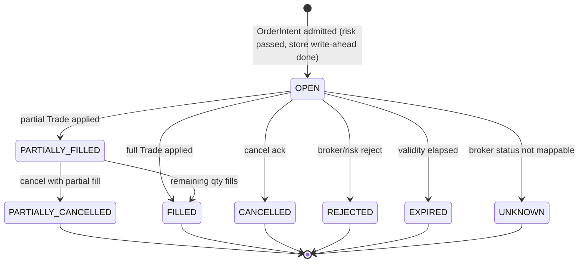
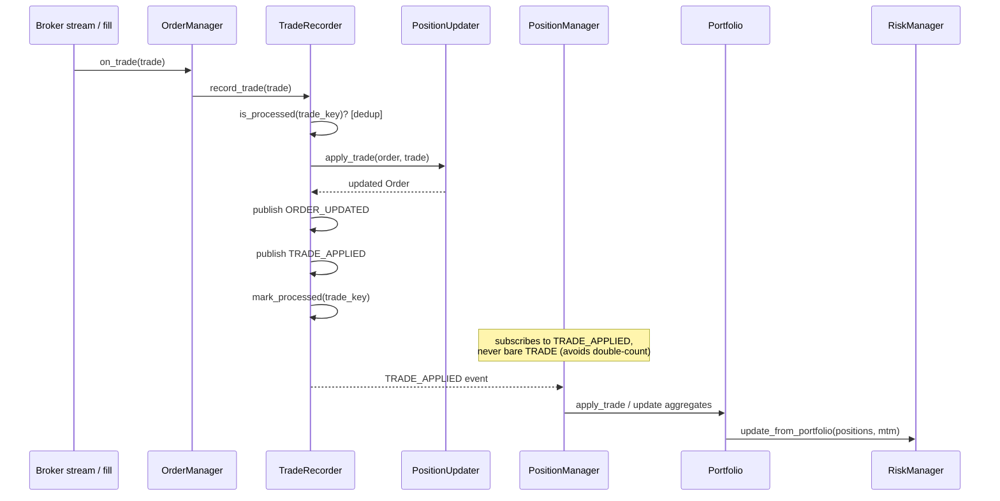

# Trading OS — Blueprint v2, Part 3: Event Model & Lifecycle Contracts

**Continues from:** Part 1 (contexts, dependency graph, communication
contracts) and Part 2 (object hierarchy, SDK surface, three verified gaps).
Builds the Order state machine, the position/portfolio update flow, and the
ResearchReplay / SessionRecording / CrashRecovery three-way split Part 1's
glossary named but did not detail.

**Same discipline as Parts 1–2:** every claim below was checked against
source. Several things this part might have proposed as "new design" turn
out to already be correctly implemented — cited, not reinvented. One thing
does not exist and is a real, narrow gap.

---

## 1. Order state machine (real, verified)



**Verified against `domain/enums.py`** (`OrderStatus`): the eight states
above (`OPEN`, `PARTIALLY_FILLED`, `FILLED`, `CANCELLED`,
`PARTIALLY_CANCELLED`, `REJECTED`, `EXPIRED`, `UNKNOWN`) are exactly the
canonical set already defined, with a documented normalization contract —
`OrderStatus.normalize(raw)` maps broker-specific strings (Dhan's
`TRANSIT`/`TRIGGER PENDING`, Upstox's equivalents) to this canonical set at
the adapter boundary via `StatusMapperRegistry`. **This is correct and
matches Part 1 §5.1 D6** (Broker Integration depends on Trading's port
definitions, never vice versa) without this part needing to add anything.

### 1.1 The apply-then-mark invariant — already fixed, already correct

Part 1 §6 stated the write-ahead and apply-then-mark rules as architectural
requirements. Verified: both are **already implemented**, not aspirational.
`application/oms/trade_recorder.py::record_trade()` contains this exact
comment, referencing its own prior defect fix:

```text
# R6 (P0): apply to the position book (via TRADE_APPLIED) BEFORE
# marking the ledger. If we crash after apply but before mark,
# recovery replays the trade and re-applies it instead of silently
# skipping an already-marked trade_id (which would lose the fill).
```

The sequence, as actually coded: idempotency check (`is_processed`) → apply
trade to order (`_position_updater.apply_trade`) → publish `ORDER_UPDATED` →
publish `TRADE_APPLIED` → **then** `mark_processed`. This is the correct
order and this document's job here is to confirm it, name it as a binding
invariant future changes must not silently reorder, and move on — not to
redesign something already right.

---

## 2. Event model — real catalog, with a precise, verified duplication finding

`domain/events/types.py`'s `EventType` enum has over 50 members. Rather than
gesture at "some duplication exists" (the kind of vague finding the review
discipline in this document's own mandate explicitly rejects), every
suspicious-looking pair was checked for live publishers with `grep`, not
assumed:

| Pair | Live callers (verified) | Verdict |
|---|---|---|
| `KILL_SWITCH_TOGGLED` vs `KILL_SWITCH_FLIPPED` | 1 vs **0** | `FLIPPED` is dead — delete it, not "reconcile" it. |
| `RECONCILIATION_COMPLETED` vs `RECONCILIATION_OK` | 2 vs **0** | `RECONCILIATION_OK` is dead — delete it. |
| `POSITION_UPDATED` / `POSITION_OPENED` / `POSITION_CLOSED` vs `POSITION_CHANGED` | 3 active callers (a real, coherent trio: opened/updated-while-open/closed, verified in `application/oms/position_manager.py`) vs **0** for `POSITION_CHANGED` | The trio is **not** duplication — it's a legitimate three-state design. `POSITION_CHANGED` alone is dead — delete it. |
| `RISK_BREACH` vs `RISK_VIOLATED` | **0 vs 0** | Both dead. See §2.1 — this is the one that matters. |
| `SIGNAL_GENERATED` vs `SIGNAL_EXECUTED` | 2 vs 1 (both alive) | **Not duplication** — different moments in a Signal's life (generated by a Strategy vs. executed as an Order). Correctly separate; keep both. |

**Cleanup, precisely scoped:** delete four dead enum members
(`KILL_SWITCH_FLIPPED`, `RECONCILIATION_OK`, `POSITION_CHANGED`, and one of
`RISK_BREACH`/`RISK_VIOLATED` — see §2.1 for which one to keep). This is
the "eliminate duplication relentlessly" mandate applied literally: four
lines deleted, zero behavior change, because nothing publishes them today.

### 2.1 The real finding: the Risk context has no live breach-notification event

Both `RISK_BREACH` and `RISK_VIOLATED` are dead. That is not a naming
argument — it means **Part 1's Risk bounded context currently has no event
it publishes when a risk rule trips**, other than the pre-trade
`RISK_APPROVED`/`RISK_REJECTED` pair (which are per-order decisions, not a
standing-state notification like "daily loss limit now at 85% of
threshold"). An operator, a metrics dashboard, or an AI agent watching the
event stream has no way to be told "risk state changed" independent of an
order attempt happening to trigger a rejection.

**The gap, precisely:** keep one name — `RISK_LIMIT_BREACHED` (neither of
the two existing dead names, to avoid resurrecting ambiguity about which
one was "the real one") — and wire it to publish whenever
`RiskManager`'s continuous MTM feed (`update_from_portfolio`, already real
per `docs/architecture/TARGET_SYSTEM_DESIGN.md` §3.2/§4.2, verified as an
existing method name) crosses a configured threshold, not only when an
order is rejected because of it. This closes a real observability blind
spot; it does not add a new risk *rule* — RiskConfig's thresholds (Part 2
§3.1) are unchanged, only the notification of proximity to them is new.

---

## 3. Position & portfolio update flow (real, verified)



**Why `PositionManager` subscribes to `TRADE_APPLIED`, not `TRADE`** — this
is already documented in the enum's own docstring
(`domain/events/types.py`): *"TRADE_APPLIED is the OMS-private downstream of
TRADE, published only after the OMS has accepted the trade... the position
manager subscribes to TRADE_APPLIED to avoid double-counting on duplicate
websocket fills."* This is the correct pattern precisely because it
implements Part 1's D8/§6 rule that Persistence & Recovery-adjacent state
(here, the trade ledger's dedup) sits between the raw broker event and
anything that mutates Position — a second, naive subscriber to bare `TRADE`
would double-count on broker redelivery. Kept as-is; this part's job is
just to make the reason explicit so a future change doesn't "simplify" it
by pointing something at `TRADE` directly.

---

## 4. The three Replay concepts — two real, one missing

Part 1 forbade using "replay" unqualified. Checking each of the three named
concepts against source:

### 4.1 ResearchReplay — real, correctly isolated

`analytics/replay/engine.py`'s `ReplayEngine` is real and already gets the
important thing right: cost modeling goes through
`domain.trading_costs.compute_commission` / `compute_slippage_pct` as a
**single source of truth**, called out in the engine's own docstrings —
this is exactly Part 1's "Trading Cost Model" concept, already correctly
factored out of the engine itself so live and research code can't silently
diverge on cost assumptions. `ReplayEngine.__init__` also already enforces
a real invariant worth keeping: it **raises `TypeError`** if constructed
without either a `trading_context`/`oms_adapter` or an explicit
`allow_simulate_without_oms=True` — fail-closed by construction, not a
silent default to "simulate mode." Good design, kept.

**One open, narrow, unverified question** (stated as a question, not
asserted as a gap, per this document's own honesty rule from Part 2): does
`ReplayResult` stamp *which version* of the cost model produced it? The
commission/slippage functions are centralized, but centralization alone
doesn't answer "if `domain.trading_costs` changes next quarter, can I tell
which historical backtest runs used the old numbers." Worth a follow-up
check against `domain/trading_costs.py` and `ReplayResult`'s fields before
Part 12 commits to an answer — not decided here.

### 4.2 CrashRecovery — real, correctly separate from ResearchReplay

`application/oms/reconciliation_service.py`'s `ReconciliationService`
(a real `ManagedServicePort` with `start`/`stop`/`health`/`run_now`/a
background `_loop`) is the live implementation of Part 1's CrashRecovery
concept — it diffs the platform's derived Position/Order state against the
broker's reported state and produces a `ReconciliationReport`. It shares
**zero code** with `ReplayEngine` — confirmed by reading both files; they
don't import each other and operate on entirely different inputs (durable
store + broker query vs. historical bars). This is the naming discipline
from Part 1's glossary already holding in practice, not just in the docs
that state it.

### 4.3 SessionRecording — does not exist (verified: zero matches for
`SessionRecording`/`session_recording` anywhere in `src/`)

This is the one genuine gap in this part. Part 1 defined SessionRecording
as *"an optional durable capture of ticks/orders during a live session, for
later offline analysis — pure observability, never read back into a live
decision path."* Nothing in the codebase does this today. The closest
existing mechanism is the `EventBus`/`EventLog` used for OMS durability
(Persistence & Recovery context, Part 1 §4) — but that log's job is
crash-recovery durability, not analyst-facing session capture, and Part 1
§6 already draws the "never best-effort" line around the OrderStore edge
specifically *because* it's recovery-critical. Reusing the OMS durability
log as a session recording mechanism would be exactly the kind of dual-use
coupling Part 1's dependency rules exist to prevent (an analytics consumer
depending on a Persistence & Recovery implementation detail).

**The gap, precisely:** a new, small, explicitly-non-critical component —
call it `SessionRecorder` — subscribed to the same `EventHub` fan-out edge
already used for Observability (Part 1 §6: "fire-and-forget... losing an
event costs visibility, not money"), writing ticks/order-events to an
append-only file per session. It has exactly one consumer path (offline
analysis tooling, out of scope for this document) and precisely zero
consumers on any live decision path — the constraint that makes it safe to
build cheaply, and safe to delete or lose data from without incident review.
**This is new work, correctly small:** one component, one event-hub
subscription, no new bounded context, no new dependency edge into Trading
or Risk.

---

## 5. Lifecycle contracts summary table (binding)

| Lifecycle | Owner (Part 1 context) | Trigger | Real today? |
|---|---|---|---|
| Order state transitions | Trading | `OrderIntent` admitted → broker ack/fill/cancel | **Yes** — §1 |
| Apply-then-mark trade recording | Trading + Persistence & Recovery | Broker fill event | **Yes** — §1.1 |
| Position/Portfolio update | Trading | `TRADE_APPLIED` | **Yes** — §3 |
| Risk continuous monitoring | Risk | Portfolio MTM update | **Partial** — the feed exists; the breach-notification event does not (§2.1) |
| ResearchReplay | Analytics | Manual invocation over `HistoricalSeries` | **Yes** — §4.1, one open question on cost-model versioning |
| CrashRecovery | Persistence & Recovery | Process boot | **Yes** — §4.2 |
| SessionRecording | Observability | Live session start | **No — real gap** — §4.3 |

---

*End of Part 3. Part 4 (Broker/Exchange Plugin Architecture) continues next,
grounded in the actual Dhan/Upstox integration constraints already
discovered across this session's earlier code review (the confirmed
`IdempotencyCache` race in `brokers/dhan/execution/order_placement.py`, the
capability-validator pattern in `brokers/common/capabilities_validator.py`)
rather than a generic plugin-architecture treatment.*
