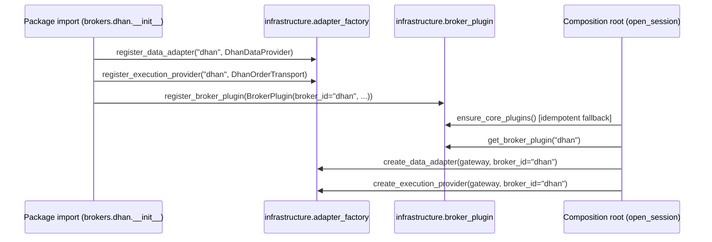

# Trading OS — Blueprint v2, Part 4: Broker & Exchange Plugin Architecture

**Continues from:** Parts 1–3 (contexts/dependencies, SDK object surface,
event/lifecycle contracts). Grounded specifically in the two real broker
integrations already in this codebase (Dhan, Upstox) plus Paper — not a
generic "how to build a plugin system" treatment. Every claim checked
against source; several things below are already correct and are cited,
not redesigned. Three real gaps found, each narrow and evidenced.

---

## 1. What already exists and is already right

### 1.1 The port contract is real and correctly thin

`domain/ports/protocols.py`'s `DataProvider` and `ExecutionProvider`
protocols (verified in Part 2 §1) are exactly Part 1's D6 rule in practice:
Broker Integration depends on these port *definitions*; nothing in
`domain/` or `application/` imports a concrete `brokers.dhan.*` or
`brokers.upstox.*` type. Kept unchanged.

### 1.2 The capability model is real, rich, and correctly typed

`domain/capabilities/broker_capabilities.py` defines `BrokerCapabilities`,
`CapabilityDescriptor`, `RateLimitProfile`, `HistoricalWindowConstraint`,
and `StreamLimitProfile` as frozen dataclasses with real query methods —
`supports(feature)`, `limit_for(endpoint_class)`,
`historical_window_for(timeframe)`, `can_serve_historical(timeframe,
lookback_days)`. This is precisely Part 1's `BrokerCapability` glossary
entry, already implemented with more nuance (per-endpoint rate limits,
per-timeframe historical window constraints) than this document would have
specified from first principles alone. Kept unchanged.

### 1.3 The broker contract test suite is real and already covers parity

`brokers/common/contracts/broker_contract.py`'s `BrokerContractSuite` is a
reusable base class with **19 contract test methods** — gateway type
check, capabilities shape, quote/LTP/depth/history/option-chain/future-chain
shape, orderbook/trades/positions/holdings/funds shape, order-status
normalization, connection-status shape, token-refresh-metrics shape,
rate-limiter-metrics shape — that each broker's own contract test directory
subclasses and runs against its concrete gateway. This is already the
"contract matrix" the mandate and Part 1's Persistence & Recovery context
require. Nothing to add here architecturally; §3.3 identifies one
consolidation opportunity adjacent to it, not a redesign of it.

### 1.4 Rate limiting reuse is already done correctly — the positive control case

Checked directly: `src/brokers/dhan/resilience/rate_limiter.py` is a
2-line compat shim (`from infrastructure.resilience.rate_limiter import
*`) — not a reimplementation. `src/brokers/upstox/auth/context.py` and
`auth/http.py` import `MultiBucketRateLimiter`/`TokenBucketRateLimiter`
from `infrastructure.resilience.rate_limiter` directly, with **no
Upstox-specific rate limiter file at all**. Both brokers correctly treat
rate limiting as a Generic-subdomain concern (Part 1 §4) owned once, in
`infrastructure`. This is the exact pattern §3.3 recommends applying to
idempotency caching — cited here first as evidence the codebase already
knows how to do this correctly when it does it right, so §3.3's
recommendation is "do the thing you already did once, again," not a novel
practice.

### 1.5 Broker-specific auth is *correctly* not shared, and should not be

Dhan uses TOTP-based token generation (`brokers/dhan/auth/totp_client.py`);
Upstox uses OAuth 2.0 + PKCE with a refresh-token grant
(`brokers/upstox/auth/oauth_client.py`, `pkce.py`, `token_manager.py`).
These are genuinely different protocols, not the same logic expressed
twice — unlike the rate limiter (§1.4) or the idempotency cache (§3.3),
there is no shared abstraction here that would "clearly reduce complexity"
per the mandate's own extraction test. **Stated explicitly because the
instinct to DRY everything is exactly what the mandate warns against**:
two broker auth flows that happen to both produce "a token" are not
duplication just because the end result rhymes. Correctly left separate.

---

## 2. Broker plugin lifecycle (real, with one precise crack)



**Verified real:** `brokers/dhan/__init__.py` does exactly this at import
time — `register_broker_extensions(...)`, `register_data_adapter("dhan",
DhanDataProvider)`, `register_execution_provider("dhan",
DhanOrderTransport)`, then `register_broker_plugin(BrokerPlugin(...))` from
`infrastructure.broker_plugin`. `BrokerPlugin` itself
(`infrastructure/broker_plugin.py`) is a clean, frozen composition-metadata
dataclass (`broker_id`, `env_file`, `default_mode`, `supported_modes`,
`is_live`) with a plain-dict registry (`_PLUGINS`) — no magic, easy to
read, easy to test. Good design, kept.

### 2.1 The one crack: `ensure_core_plugins()` hardcodes broker ids in core infrastructure

`infrastructure/broker_plugin.py::ensure_core_plugins()` contains:

```python
def ensure_core_plugins() -> None:
    """Idempotent defaults if packages have not registered yet."""
    if "paper" not in _PLUGINS:
        register_broker_plugin(BrokerPlugin(broker_id="paper", ...))
    if "dhan" not in _PLUGINS:
        register_broker_plugin(BrokerPlugin(broker_id="dhan", ...))
```

This is a **fallback**, not the primary registration path — the primary
path (§2, verified) is correctly self-registration via package import. But
the fallback itself lives in `infrastructure/`, a Generic-subdomain
package, and it names two specific brokers (`"paper"`, `"dhan"`) by
string literal. This is the precise, narrow crack in Part 1's mandate
("new broker = new package, no core edit"): **adding a third broker whose
package is never imported before `ensure_core_plugins()` runs gets no
default plugin metadata, silently, unless someone also edits this function**
— exactly one core edit, in exactly one place, but a core edit
nonetheless. Also asymmetric: Upstox is conspicuously *absent* from this
fallback list (verified — only `"paper"` and `"dhan"` branches exist),
meaning Upstox already depends entirely on its own self-registration
running before `ensure_core_plugins()` is asked for it, with no safety net
the other two brokers get.

**The gap, precisely:** delete `ensure_core_plugins()`'s hardcoded
branches. If self-registration via import is the real contract (it clearly
is, since Upstox already relies on it exclusively), the fallback should
either not exist, or be replaced with an explicit, composition-root-owned
list of "brokers this deployment expects to be registered" that the
*composition root* supplies (still not `infrastructure`), and
`ensure_core_plugins()` should fail loudly if a listed broker never
registered — turning a silent gap into a boot-time error, consistent with
Part 1's "capability lie → abort" fail-closed principle.

---

## 3. Three real gaps (verified, narrow — no gap invented to fill space)

### 3.1 Capability mismatch detection is soft-fail; the mandate requires hard-fail

`brokers/common/capabilities_validator.py::validate_gateway_capabilities()`
does exactly the right *check*: cross-reference each `supports_*` flag
against the methods the gateway object actually exposes
(`supports_modify_order` → must have `modify_order`, etc.). But on
mismatch it only calls `log.warning(...)` and returns a list of mismatch
strings — it does not raise, and nothing calls it in a way that aborts
startup. Grep confirms `DhanBrokerGateway.__init__` calls
`validate_gateway_capabilities(self)` (verified in `brokers/dhan/gateway.py`
§ constructor, read earlier this session) but discards or only logs the
result.

This directly contradicts a principle this very document's Part 1 §1
states as non-negotiable, and which the *existing* prior architecture work
in this repo (`docs/architecture/TARGET_SYSTEM_DESIGN.md` §6, "Startup
invariants": *"Capability lie... → abort or strip capability"*) already
correctly specified as a requirement. The check exists; the enforcement
does not.

**The gap, precisely:** at boot, after `validate_gateway_capabilities`
runs, the composition root must do one of the two things the existing
design doc already named — abort startup, or strip the mismatched
capability flag from the `BrokerCapabilities` object before it's advertised
further — instead of the current third, silent option of "log and
continue with a capability matrix known to be wrong."

### 3.2 The broker-plugin registry has no discoverable, out-of-tree extension mechanism yet

`pyproject.toml` already has the entry point declared and explicitly
deferred:

```toml
[project.entry-points."tradex.brokers"]
# Phase 2 will populate these; leave empty for Phase 0
# dhan = "brokers.dhan:DhanBroker"
# upstox = "brokers.upstox:UpstoxBroker"
# paper = "brokers.paper:PaperBroker"
```

This means the codebase's own prior planning already correctly identified
this gap and deliberately sequenced it as later work — not something this
document is discovering fresh. What Part 4 adds: the self-registration
pattern in §2 is a fine **in-tree** plugin mechanism (a new broker added to
this repository works today), but it cannot satisfy "a third party adds a
broker without touching this codebase," because self-registration requires
the new broker's `__init__.py` to be imported by *something* already in
the dependency graph — there is no discovery step that finds packages this
repository doesn't already import. Populating the `tradex.brokers`
entry-point group (using Python's standard `importlib.metadata.entry_points`
to discover and import broker packages by group name at composition-root
boot, replacing "import brokers.dhan somewhere" with "iterate installed
entry points") is the concrete, scoped piece of already-planned work this
document confirms is still correctly the right next step — not a new
proposal, a confirmation of an existing, correctly-sequenced one.

### 3.3 Idempotency caching is duplicated across brokers — and the duplicate that matters is the buggy one

Three implementations of "cache an order result by correlation id to make
retried placement calls safe" exist:

| Location | Shape | Known issue |
|---|---|---|
| `brokers/dhan/execution/order_placement.py::IdempotencyCache` | TTL-based, reserve/commit/clear_reservation three-phase protocol | **Confirmed race condition**, found in this session's earlier code review: `get()` reads `self._cache` without a lock, then deletes the expired entry under a lock — two threads racing an expired read-then-delete can both pass the check and the second `del` raises `KeyError`. Also: `lock()` acquires `_pending_lock` with no matching release, and a test exercises it as a context manager, which it is not — both confirmed via source read, not assumption. |
| `brokers/upstox/orders/idempotency.py::InMemoryIdempotencyCache` | Plain dict + `RLock`, no TTL, no reserve/commit protocol | No race condition (simpler, so nothing to race), but its own docstring says *"Mirrors `brokers.dhan.orders.idempotency.InMemoryIdempotencyCache`"* — an explicit, self-documented duplicate, deliberately kept in sync by hand rather than shared. |
| `application/oms/idempotency_guard.py::IdempotencyGuard` | Correlation-id **admission** guard (in-flight set, not a result cache) | **Not a duplicate** — this is a genuinely different concern (Trading-context, OMS-level: prevent two concurrent `OrderIntent`s with the same correlation id from both being admitted) from the broker-transport-level concern (prevent a retried HTTP POST from re-submitting after a network timeout masked a successful placement). Both layers are legitimate; only the *broker-level* pair is duplicated. |

**The gap, precisely:** consolidate the two broker-level caches into one
`brokers/common` component (matching the rate-limiter pattern in §1.4,
which is the proof this codebase already knows how to do this). This
single consolidation (a) deletes real, self-acknowledged duplication, (b)
fixes the confirmed race condition in exactly one place instead of needing
a synchronized fix in two, and (c) removes the risk that a third
future broker "mirrors" the buggy version instead of the safe one, since
there would no longer be two versions to choose between.

---

## 4. Adding a broker — the concrete, current checklist (target state after §2.1/§3.2 close)

| Step | Owner | Today | After gaps close |
|---|---|---|---|
| Implement `DataProvider`/`ExecutionProvider`/`MarginProvider` | New broker package | Required | Unchanged |
| Advertise `BrokerCapabilities` | New broker package | Required | Unchanged |
| Register data/execution adapters | New broker package, at import | `register_data_adapter`/`register_execution_provider` self-registration | Unchanged — this part is already correct |
| Register broker plugin metadata | New broker package, at import | `register_broker_plugin(...)` | Unchanged |
| Get picked up without editing core | — | **No** — needs either an explicit import somewhere already-loaded, or an edit to `ensure_core_plugins()` for the fallback path | **Yes** — via `tradex.brokers` entry point discovery (§3.2) |
| Capability lies caught at boot | Composition root | **No** — logged only (§3.1) | **Yes** — abort or strip (§3.1) |
| Idempotent order retries | New broker package | Copy-paste from Dhan or Upstox's cache, by hand | Import `brokers.common`'s single cache (§3.3) |
| Pass the contract matrix | New broker package | `BrokerContractSuite` subclass, 19 methods | Unchanged — already correct (§1.3) |

---

*End of Part 4. Part 5 (Engines — OMS/EMS/Risk/Analytics/Replay/Scanner/
AI-agent) continues next, building on the Trading/Risk context split from
Part 1 §4 and the RiskProfile/sizing gaps from Part 2 §3.*
