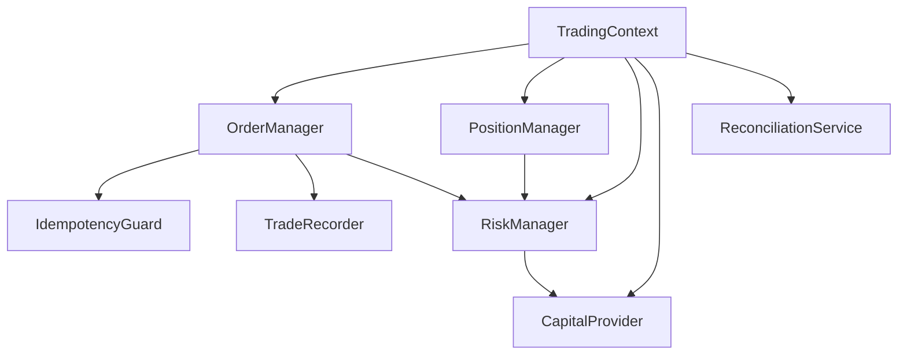

# Trading OS — Blueprint v2, Part 5: Engines (OMS / EMS / Risk / Strategy / Scanner / AI Agent)

**Continues from:** Parts 1–4. Builds on the Trading/Risk context split
(Part 1 §4), the RiskProfile and sizing gaps (Part 2 §3), the Order
lifecycle and event model (Part 3), and the broker plugin boundary
(Part 4). Six engines below; four are real and mostly correct (cited, not
redesigned), one has a precise and significant finding about an unused
canonical class, and one — the AI Agent framework — does not exist at all
and needs genuine new design.

---

## 1. OMS / Trading engine — real, composition view

Part 3 already verified the Order state machine, apply-then-mark, and
event flow at the mechanism level. What Part 5 adds is the composition:
who wires these mechanisms together for one process.



Verified real: `application/oms/context.py` (`TradingContext`) is the
composition point; `order_manager.py`, `position_manager.py`,
`risk_manager.py` (re-exporting `application/oms/_internal/risk_manager.py`
per Part 2 §3.1), `capital_provider.py`, `reconciliation_service.py`,
`idempotency_guard.py`, and `trade_recorder.py` are each a real, separately
testable file with a single responsibility — this is already a
well-decomposed engine, not a god class. Nothing to redesign here; Parts 2
and 3 already covered the pieces this section would otherwise repeat.

---

## 2. EMS (Execution Management) — real components, one significant orphan

`application/execution/` contains `place_order_use_case.py`,
`submission_pipeline.py`, `execution_mode_adapter.py`, `simulated_fill.py`,
`gateway_submit.py`, `cancel_order_use_case.py`, `position_sizing.py`,
`factory.py` — a reasonable EMS decomposition on paper. Checking each
against actual callers surfaces one real, significant finding.

### 2.1 `PlaceOrderUseCase` exists, is correctly designed, and is called by nothing

```python
class PlaceOrderUseCase:
    def __init__(self, ...): ...
    def execute(self, request: OrderRequest) -> OrderResult: ...
```

Grepped for every reference to `PlaceOrderUseCase` across the entire `src/`
tree: it appears only in its own file and in `application/execution/
__init__.py` (a re-export). **No CLI command, no API router, no
orchestrator constructs or calls it.**

Meanwhile, every real order-entry surface — checked directly —
independently reaches `OrderManager.place_order()`:

| Caller | Path |
|---|---|
| `interface/ui/services/broker_service.py::place_order` | → `self._facade.place_order(...)` → (traced) `OrderManager.place_order` |
| `application/trading/trading_orchestrator.py::_place_order` | → `self._execution_service.place_order(command)` or `self._order_manager.place_order(...)` directly |
| `interface/ui/commands/{oms,order_composition,order_placement}.py` | Each independently calls into the CLI broker facade |

**The important nuance, stated precisely so this finding isn't
overstated:** every path traced above **does** reach `OrderManager`, which
**does** run the real risk check and idempotency guard (verified in Parts
1/3). This is **not** a second money path bypassing risk — that specific,
worse failure mode does not exist here. What is real: the codebase built a
canonical `PlaceOrderUseCase` specifically so that CLI, API, and
Orchestrator would call *one* class instead of each independently wrapping
`OrderManager`, and then never migrated any of them to use it. This
matches the already-existing, already-correctly-diagnosed plan item in
this repo's own `docs/architecture/TARGET_SYSTEM_DESIGN.md` (§7.2, "C1.1:
`refactor(execution): place/modify/cancel only via use cases`") — this
document's contribution is confirming, by direct trace, that the target
class for that refactor already exists and is simply unconsumed, which
narrows the remaining work from "design and build a use case" to "delete
three duplicate call-wrapping patterns and point them at the one that
already exists."

**Why this still matters even though nothing is unsafe today:** three
independent wrappers around `OrderManager.place_order` means three places
that must be kept in sync if `OrderManager`'s calling contract ever changes
(e.g., if a new required parameter is added). This is Shotgun Surgery
by definition — the exact code smell the mandate asks to be named with its
concrete cost, not just its label: the cost here is that Part 4's
future broker-onboarding checklist and any future OMS signature change
both have to update three call sites instead of one, and nothing in the
type system currently prevents a fourth caller from writing yet another
independent wrapper instead of finding and using `PlaceOrderUseCase`.

---

## 3. Risk Engine — real, mostly correct, one genuine open question found by reading the code closely

`RiskConfig`/`RiskManager` (Part 2 §3.1) enforce kill switch, daily-loss,
margin, concentration, and notional limits. Checking whether **extended**
order types (super orders, forever orders, GTT, cover orders, slice
orders) get the same treatment as normal orders — a question this
document would not have known to ask without reading
`extended_order_service.py` directly — the answer is **yes, mostly**:

```python
def _check_risk(self, payload: dict[str, Any]) -> ExtendedOrderResult | None:
    """Run the FULL pre-trade risk path on an order built from `payload`.

    Normal (non-extended) orders go through RiskManager.check_order which
    enforces kill switch, daily-loss circuit breaker, margin, concentration,
    and notional limits. Extended orders previously only ran the kill-switch
    check (R7). This method routes them through the same gate.
    """
```

Six of the seven extended-order methods (`place_super_order`,
`place_forever_order`, `place_trigger`, `place_gtt`, `place_cover_order`,
`place_slice_order`) call both `_check_kill_switch()` and
`_check_risk(payload)`. **This is already fixed** — the docstring's own
"(R7)" reference confirms a prior defect (extended orders skipping full
risk) was already found and corrected. Good; nothing to redesign.

### 3.1 The genuine open question: should `exit_all` be gated by the kill switch at all?

`exit_all()` — the one exception — calls only `_check_kill_switch()`, **not**
`_check_risk()`. Checked why: `_check_risk` enforces max-position /
max-gross-exposure / notional limits, which are checks against **increasing**
risk. `exit_all` **decreases** risk by construction (it closes positions),
so exempting it from notional limits is correct — blocking a
position-closing action because "the position being closed is too large"
would be actively harmful.

But `exit_all` is **still** blocked when the kill switch is active — and
this is the one place in this whole engine review where reading the code
raises a question the code itself doesn't answer. A kill switch's usual
purpose is to stop a malfunctioning strategy from **taking more risk**.
`exit_all` is the operator's emergency escape hatch for **removing** risk.
Gating the escape hatch behind the same switch that's meant to stop
runaway risk-taking means: the one moment an operator is most likely to
need `exit_all` (something has gone wrong badly enough that the kill
switch got flipped) is exactly the moment `exit_all` refuses to run.

**This document does not resolve this by itself** — it is a genuine
trading-desk policy question (some desks may deliberately want a kill
switch to freeze *everything*, including exits, until a human reviews
state, precisely to prevent a compromised or buggy process from "closing
positions" in a way that's actually harmful, e.g. panic-selling at the
worst price). What this document asserts: **this is currently an implicit
decision** (kill switch happens to block exit_all because both call
`_check_kill_switch()`, not because anyone decided exits should be frozen
too) **and it should become an explicit one** — either
`KillSwitchState` gains a second flag (`freeze_new_orders_only` vs.
`freeze_all_including_exits`), or the desk's operating policy explicitly
documents that kill switch means "hard stop, including exits" and
`exit_all`'s current behavior is correct as-is. Either answer is
defensible; leaving it undecided-but-coded-one-way is not.

---

## 4. Strategy Engine — real, already well-designed

`analytics/strategy/` already has `protocols.py` (the pluggable interface),
`registry.py` (named strategy lookup), `pipeline.py` (composition of
multiple strategies), `evaluator_bridge.py`, and `models.py` (where
`SignalDTO` lives, per Part 2 §3.3). `application/trading/
multi_strategy_runtime.py::MultiStrategyRuntime` wraps a `StrategyPipeline`
with `list_strategies()`/`create_pipeline(names)`. This is already the
protocol + registry + pipeline plugin shape the mandate asks for — nothing
to add architecturally; Part 2 §3.3's `SignalDTO.to_intent()` proposal is
the one concrete piece of new work that touches this engine, already
specified there.

## 5. Scanner Engine — real, already well-designed

`analytics/scanner/` has `runner.py`, `scanner_queries.py`, `models.py`,
`scanners.py`, `scorer.py` — a clean separation of "how to query the
universe," "what a candidate looks like," "the actual scan implementations,"
and "how to rank/score candidates." Matches Part 1's Scanner glossary entry
(emits Candidates, never orders) structurally. No redesign proposed.

## 6. Analytics (Options/Futures/Portfolio math) and Replay Engine

Already covered: Option/Future domain math (`black_scholes`,
`implied_volatility`, `payoff`, `basis`) in Part 2 §1; ResearchReplay,
CrashRecovery, and the missing SessionRecording in Part 3 §4. Not repeated
here.

---

## 7. AI Agent Framework — does not exist; the one engine needing real design

Grepped for `agent_tools`, `AgentTool`, any class matching `*Agent*`, and
any path containing `agent` under `src/`, excluding tests: **zero results.**
This is a clean, verified gap, not an oversight in searching — the mandate
lists AI agents as a required capability (alongside discretionary,
systematic, research, and scanner-driven trading), and nothing in this
codebase today lets an agent participate.

Part 1 §6 already specified the *contract* this framework must honor:
*"same direct-call surface as any Session client; no separate agent API...
same risk/idempotency/audit path, no exceptions"* — an AI agent is not a
new bounded context, it is a new **client** of Session & Identity, Trading,
and Market Data. What follows is the concrete tool surface that contract
implies, built from objects already real in Parts 2–3, not new domain
concepts.

### 7.1 Tool surface (thin wrappers over the existing SDK, nothing new underneath)

| Tool | Wraps (already real) | Notes |
|---|---|---|
| `get_quote(symbol, exchange)` | `Instrument.quote` / `.refresh()` | Read-only |
| `get_history(symbol, exchange, timeframe, days)` | `Instrument.history(...)` | Read-only |
| `get_option_chain(symbol, expiry)` | `Instrument.option_chain(...)` | Read-only |
| `get_positions()` / `get_portfolio()` | `AccountView.positions` / `.portfolio` | Read-only |
| `get_risk_status()` | `session.account.risk_profile` — **the exact object proposed in Part 2 §3.1**, not yet built | An agent asking "how much room do I have" is the strongest concrete justification for actually closing that gap, not a hypothetical one |
| `place_order(symbol, exchange, side, qty, order_type, price)` | Constructs an `OrderIntent`, then `session.buy`/`sell` → `OrderServicePort.place(intent)` | **Never** a raw `ExecutionProvider` call — same rule as every other client |
| `cancel_order(order_id)` / `modify_order(...)` | `Instrument.cancel/modify` or `session.cancel/modify` | Same OMS path |

**Deliberately excluded from the tool surface, stated explicitly:** no
`get_raw_broker_client()`, no `execute_arbitrary_code()`, no direct
`ExecutionProvider` handle. An agent that needs a capability not on this
list needs the capability added to the SDK (Part 2) first, available to
every client — not a special back door added just for agents.

### 7.2 Guardrails specific to an untrusted-caller client (new, because nothing like this exists for the CLI/API clients today)

Human CLI/API callers are implicitly trusted (a person is at the keyboard,
choosing to run a command). An agent executing autonomously is not the
same trust level, and the mandate says so explicitly ("agents are
untrusted clients of the OS"). Three controls, each new:

| Control | Mechanism | Why it's not just "the same as RiskManager" |
|---|---|---|
| **Rate limiting on tool calls themselves** | A `MultiBucketRateLimiter` instance (Part 4 §1.4 — reuse the existing infra component, do not build a new one) scoped per agent session, independent of the broker's own rate limits | A runaway agent loop calling `place_order` 500 times/second would pass every individual `RiskManager.check_order` check (each order might be small and compliant) while still being a real operational hazard the per-order risk engine was never designed to catch. |
| **Symbol/action allowlist, opt-in per agent session** | A simple frozenset check before an intent is constructed at all | Defense in depth — even if every other control fails, an agent scoped to `{"NIFTY", "RELIANCE"}` cannot touch anything else, checkable without touching `RiskManager`'s existing logic at all. |
| **Dry-run mode** | `place_order(..., dry_run=True)` returns the `OrderIntent` and the `RiskProfile.headroom_pct()` result *without* calling `OrderServicePort.place()` | Lets an agent (or a human testing an agent) verify what *would* happen before committing capital — genuinely new, because no existing client needs this (a human using the CLI already sees the confirmation before pressing enter; an autonomous loop has no equivalent pause point unless one is built). |

### 7.3 What this section deliberately does not specify

Tool-calling protocol wire format (MCP, OpenAI function-calling schema, or
otherwise) is an integration detail, not an architecture decision — any of
them can wrap the tool surface in §7.1 without changing anything in
`domain`/`application`. Multi-agent coordination (more than one agent
sharing one `RiskProfile`, or agents negotiating with each other) is
explicitly out of scope until a single agent's guardrails (§7.2) have
shipped and been used — adding coordination rules for a problem that
doesn't exist yet would be exactly the speculative abstraction the mandate
forbids.

---

*End of Part 5. Part 6 (cross-cutting: observability, security, config,
concurrency, testing strategy, ADRs, migration roadmap, quality gates)
continues next and closes out the blueprint's remaining sections from the
original request list.*
