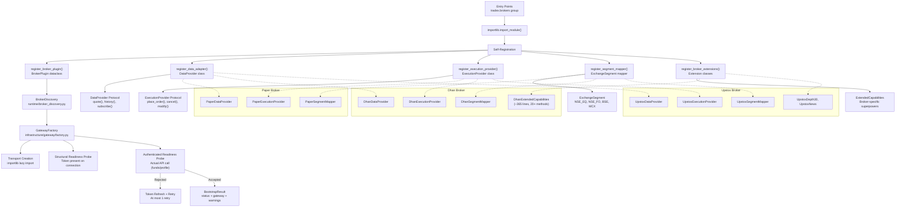
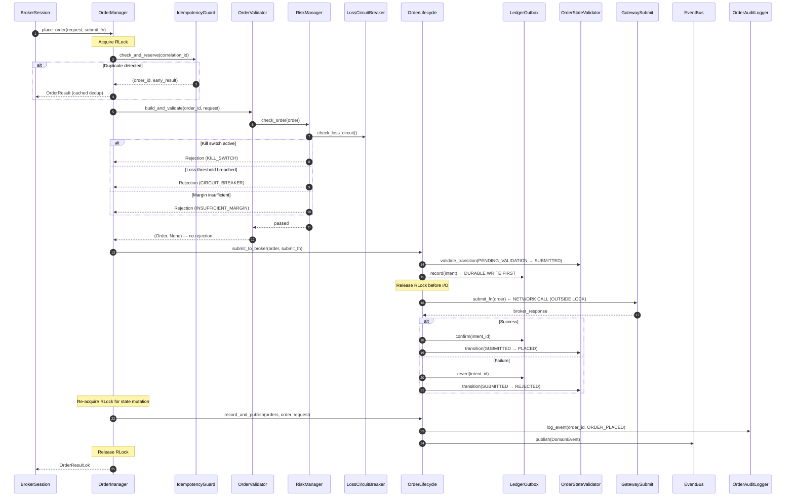
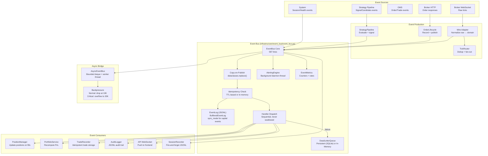
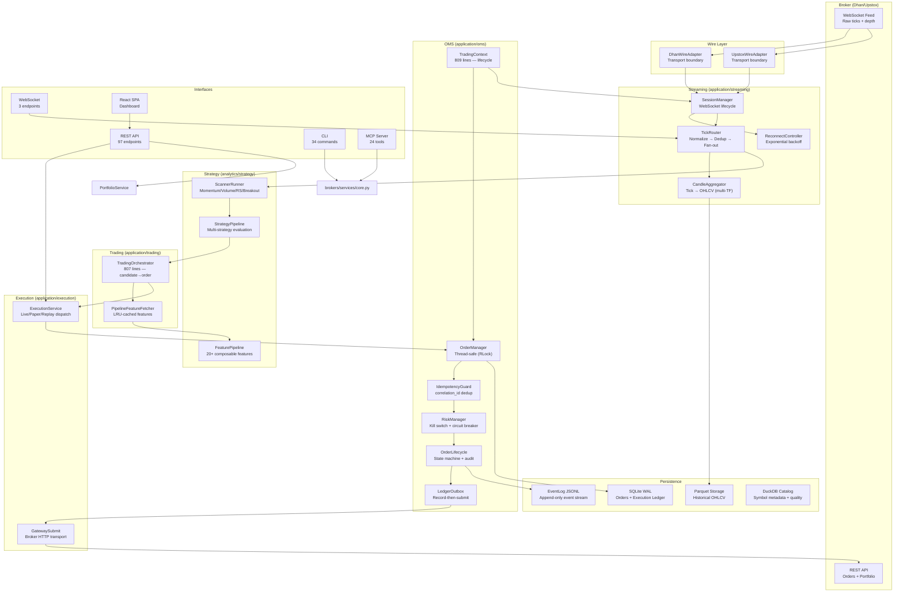
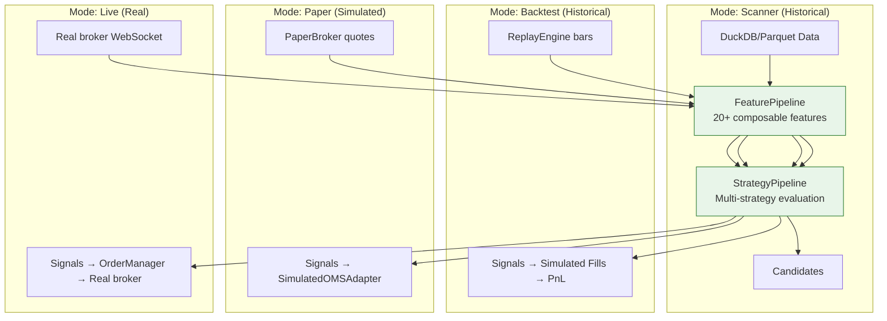
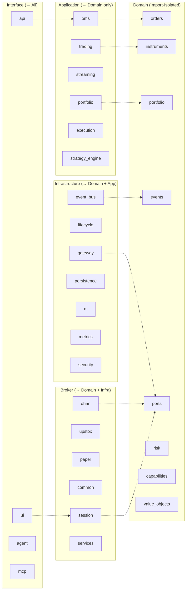

# D0.4 — As-Is Architecture Diagrams

> Generated from code-only analysis. All diagrams verified against actual imports and call paths.

---

## 1. Layer Dependency Graph

```mermaid
graph TD
    subgraph "Interface Layer"
        API["interface/api<br/>FastAPI REST + WebSocket"]
        CLI["interface/ui<br/>Interactive CLI"]
        AGENT["interface/agent<br/>AI Agent Framework"]
        MCP_B["brokers/mcp<br/>FastMCP Server"]
        WEB["web/<br/>React SPA"]
    end

    subgraph "Application Layer"
        OMS["application/oms<br/>Order Manager + Risk + Trade Recorder"]
        TRADING["application/trading<br/>Trading Orchestrator"]
        STREAMING["application/streaming<br/>Tick Router + Candle Aggregator"]
        PORTFOLIO["application/portfolio<br/>Portfolio Service"]
        EXECUTION["application/execution<br/>Execution Service"]
        STRAT["application/strategy_engine<br/>Live Strategy Engine"]
        SERVICES["application/services<br/>Canonical Instrument Registry"]
    end

    subgraph "Broker Layer"
        SESSION["brokers/session<br/>BrokerSession (public API)"]
        SERVICES_CORE["brokers/services<br/>Single Service Core"]
        RUNTIME_B["brokers/runtime<br/>RuntimeBundle"]
        CERT["brokers/certification<br/>Broker Certifier"]
        DIAG["brokers/diagnostics<br/>Doctor/Health/Benchmark"]
        DHAN["brokers/dhan<br/>Dhan Adapter"]
        UPSTOX["brokers/upstox<br/>Upstox Adapter"]
        PAPER["brokers/paper<br/>Paper Simulator"]
        COMMON["brokers/common<br/>ACL, Idempotency, Validation"]
    end

    subgraph "Analytics Layer"
        BACKTEST["analytics/backtest<br/>BacktestEngine"]
        REPLAY["analytics/replay<br/>ReplayEngine"]
        PIPELINE["analytics/pipeline<br/>FeaturePipeline"]
        STRATEGY["analytics/strategy<br/>StrategyPipeline"]
        SCANNER["analytics/scanner<br/>ScannerRunner"]
        OPTIONS["analytics/options<br/>Options Analytics"]
    end

    subgraph "Infrastructure Layer"
        EVENTBUS["infrastructure/event_bus<br/>EventBus + DLQ"]
        LIFECYCLE["infrastructure/lifecycle<br/>LifecycleManager"]
        GATEWAY["infrastructure/gateway<br/>Gateway Factory"]
        PERSIST["infrastructure/persistence<br/>SQLite Stores"]
        DI["infrastructure/di<br/>DI Container"]
        METRICS["infrastructure/metrics<br/>MetricsRegistry"]
        SECURE["infrastructure/security<br/>Secrets + SSL"]
    end

    subgraph "Domain Layer"
        INSTRUMENTS["domain/instruments<br/>Instrument Aggregate"]
        EVENTS["domain/events<br/>Domain Events"]
        ORDERS["domain/orders<br/>Order Aggregate"]
        PORT["domain/ports<br/>Protocol Interfaces"]
        PORTFOLIO_D["domain/portfolio<br/>Position + PnL"]
        RISK_D["domain/risk<br/>Kill Switch + Circuit Breaker"]
        CAPABILITIES["domain/capabilities<br/>Capability System"]
        UNIVERSE["domain/universe<br/>Instrument Universe"]
    end

    subgraph "Data Layer"
        DATALAKE["datalake<br/>Parquet + DuckDB"]
        CONFIG["config<br/>AppConfig + FeatureFlags"]
    end

    %% Interface → Application/Broker
    API --> OMS
    API --> STREAMING
    API --> PORTFOLIO
    API --> DATALAKE
    CLI --> SESSION
    CLI --> SERVICES_CORE
    AGENT --> SERVICES_CORE
    MCP_B --> SERVICES_CORE
    WEB --> API

    %% Application → Domain
    OMS --> ORDERS
    OMS --> EVENTS
    OMS --> PORT
    TRADING --> STRATEGY
    TRADING --> PIPELINE
    TRADING --> OMS
    STREAMING --> INSTRUMENTS
    PORTFOLIO --> PORTFOLIO_D
    EXECUTION --> OMS
    STRAT --> TRADING
    SERVICES --> INSTRUMENTS

    %% Broker → Domain + Infrastructure
    SESSION --> RUNTIME_B
    RUNTIME_B --> GATEWAY
    SERVICES_CORE --> SESSION
    CERT --> SESSION
    DIAG --> SESSION
    DHAN --> COMMON
    DHAN --> GATEWAY
    UPSTOX --> COMMON
    UPSTOX --> GATEWAY
    PAPER --> COMMON
    PAPER --> GATEWAY

    %% Infrastructure → Domain
    EVENTBUS --> EVENTS
    LIFECYCLE --> PORT
    GATEWAY --> PORT
    PERSIST --> PORT
    DI --> PORT
    METRICS --> PORT

    %% Analytics → Domain
    BACKTEST --> REPLAY
    REPLAY --> STRATEGY
    REPLAY --> PIPELINE
    PIPELINE --> INSTRUMENTS
    STRATEGY --> PORT
    SCANNER --> PIPELINE

    %% Data → Domain
    DATALAKE --> PORT

    %% Style
    style DOMAIN fill:#e8f5e9,stroke:#2e7d32
    style INFRA fill:#e3f2fd,stroke:#1565c0
    style APP fill:#fff3e0,stroke:#ef6c00
    style BROKER fill:#fce4ec,stroke:#c62828
    style INTERFACE fill:#f3e5f5,stroke:#7b1fa2
    style ANALYTICS fill:#e0f2f1,stroke:#00695c
    style DATA fill:#fff8e1,stroke:#f9a825
```

---

## 2. Broker Plugin Architecture

---

## 3. OMS Order Lifecycle

---

## 4. Event Flow Architecture

---

## 5. End-to-End Live Trading Data Flow

---

## 6. Strategy Parity Model

> The same `FeaturePipeline` + `StrategyPipeline` runs in every mode.

**Key Insight**: Signal generation is identical across all modes. Only execution differs:
- Scanner: signals → candidates (no execution)
- Backtest: signals → simulated fills (ReplayEngine)
- Paper: signals → SimulatedOMSAdapter (fake broker)
- Live: signals → OrderManager → real broker

---

## 7. Component Ownership Map

---

## Appendix: Import-Linter Contract Results

All 15 import-linter contracts **PASS**:

| Contract | Source | Forbidden | Status |
|----------|--------|-----------|--------|
| Domain isolation | `domain` | application, brokers, analytics, interface, config, infrastructure, datalake, plugins, tradex, runtime | ✅ PASS |
| Application boundary | `application` | brokers, interface, datalake | ✅ PASS |
| Broker generic | `brokers.common` | brokers.dhan, brokers.upstox | ✅ PASS |
| CLI/UI isolation | datalake, analytics | cli | ✅ PASS |
| No broker branching | generic code | broker-specific if/else | ✅ PASS |
| Wire boundary | `brokers/*/wire.py` | — | ✅ PASS |
| 9 additional contracts | Various | Various | ✅ PASS |

**27 stale `ignore_imports` warnings** — safe to clean up in Phase 3.
