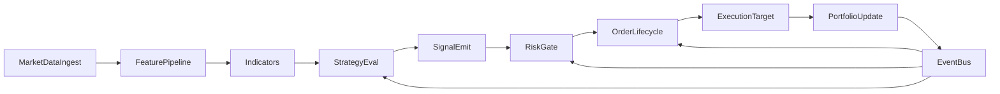
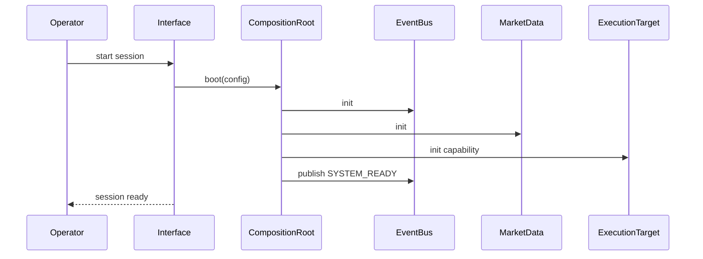
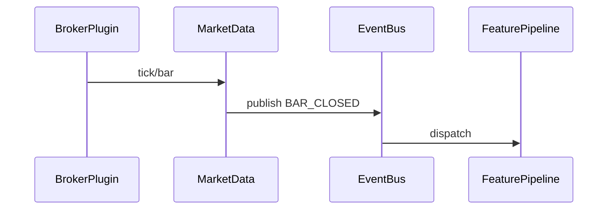
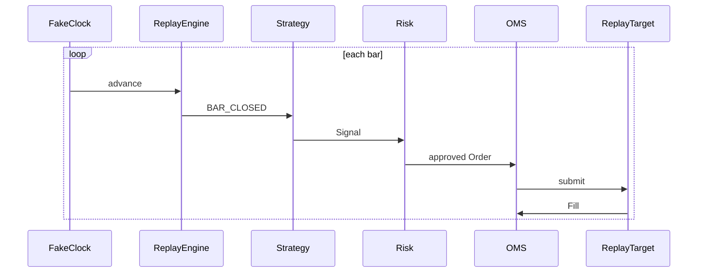
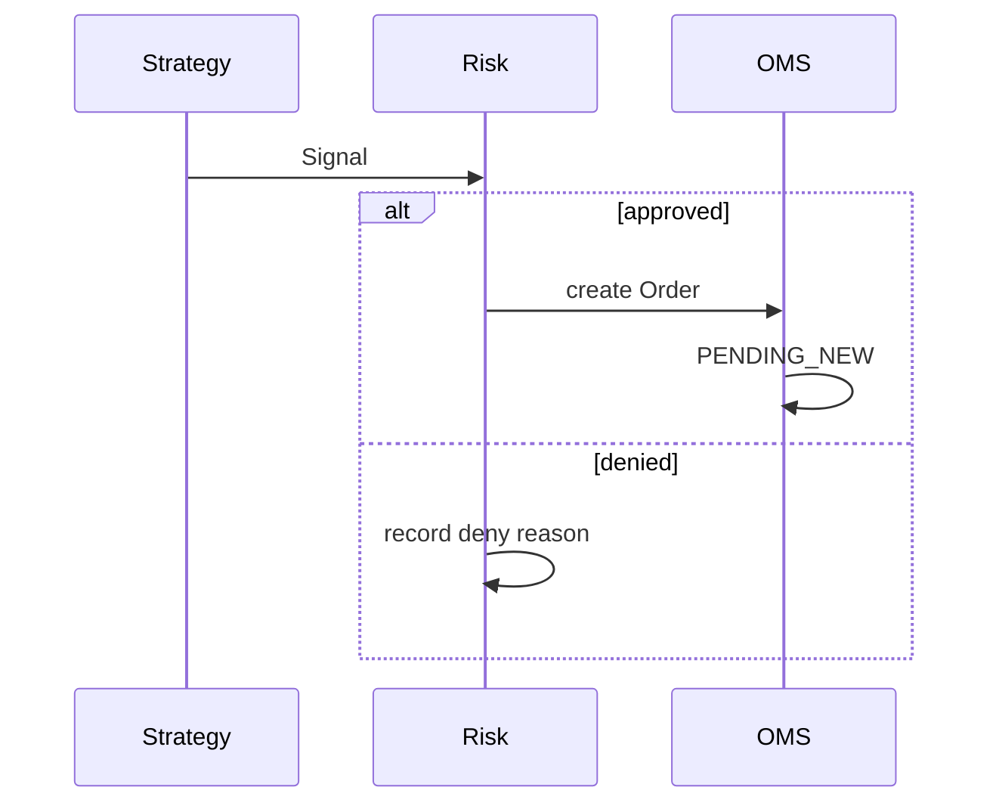
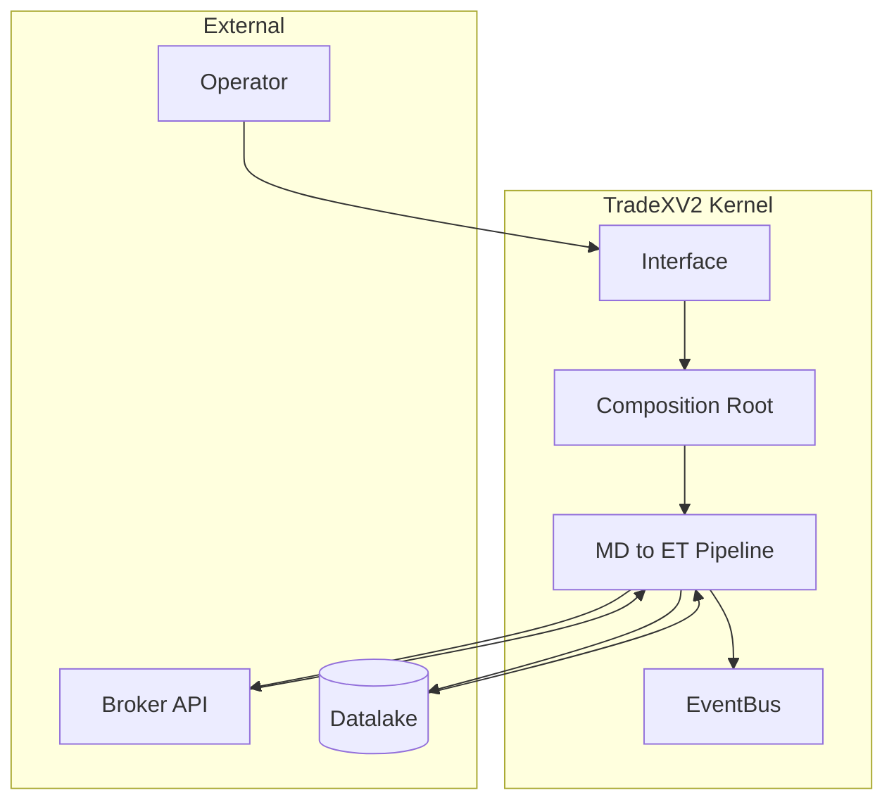

# 02 — System Blueprint

**Status:** Canonical  
**Runtime ownership:** See `02a-runtime-execution-model.md`  
**Terms:** See `00b-glossary.md`

Behavior-first specification. No class names unless needed for clarity.

---

## Global Pipeline

Every flow below is a slice of this pipeline plus bootstrap/shutdown.

---

## Flow 1 — Application Bootstrap

**Trigger:** Operator runs `tradex` / API startup / TUI launch.

| | |
|---|---|
| **Inputs** | Config profile, broker_id, execution_target capability, universe (optional) |
| **Outputs** | Kernel in `Ready` state; EventBus live; components wired |
| **Events** | `SYSTEM_BOOTING`, `SYSTEM_READY`, `SYSTEM_BOOT_FAILED` |
| **State** | `OFF → BOOTING → READY \| FAILED` |

**Failure:** Config invalid → `BOOT_FAILED`, fail-closed, no partial trading.  
**Recovery:** Fix config; restart. No auto-retry on invalid config.

---

## Flow 2 — Broker Connection

**Trigger:** Bootstrap with broker_id set (market data and/or Live target).

| | |
|---|---|
| **Inputs** | Credentials from profile, BrokerId |
| **Outputs** | Authenticated broker session; market data subscriptions available |
| **Events** | `BROKER_CONNECTING`, `BROKER_CONNECTED`, `BROKER_AUTH_FAILED` |
| **State** | `DISCONNECTED → CONNECTING → CONNECTED \| AUTH_FAILED` |

**Failure:** Auth fail → no gateway; session stays non-trading.  
**Recovery:** Refresh credentials; manual reconnect.

---

## Flow 3 — Market Data Ingestion

**Trigger:** Subscription request or historical load command.

| | |
|---|---|
| **Inputs** | Instrument list, timeframe, live vs historical flag |
| **Outputs** | Ticks/bars on EventBus; datalake writes (historical) |
| **Events** | `TICK_RECEIVED`, `BAR_CLOSED`, `SUBSCRIPTION_ACTIVE`, `DATA_STALE` |
| **State** | Per-instrument: `UNSUBSCRIBED → SUBSCRIBED → STALE` |

**Failure:** Stale feed → `DATA_STALE`; strategies may skip bar, not crash.  
**Recovery:** Reconnect broker WS; resubscribe.

---

## Flow 4 — Historical Loading

**Trigger:** `tradex` history command or backtest prefetch.

| | |
|---|---|
| **Inputs** | Symbol, date range, timeframe |
| **Outputs** | Parquet/DuckDB records; quality report |
| **Events** | `HISTORY_LOAD_STARTED`, `HISTORY_LOAD_COMPLETED`, `QUALITY_CHECK_FAILED` |
| **State** | `IDLE → LOADING → LOADED \| FAILED` |

**Failure:** Quality check fail → data not promoted to hot path.  
**Recovery:** Re-ingest after fix.

---

## Flow 5 — Replay

**Trigger:** `tradex analytics replay` with catalog + FakeClock.

| | |
|---|---|
| **Inputs** | Historical catalog, strategy config, clock seed |
| **Outputs** | Deterministic event stream; trade journal |
| **Events** | Same as live path (bars, signals, orders, fills) |
| **Execution Target** | Replay |

**Failure:** Illegal order transition → halt replay, surface error.  
**Recovery:** Fix strategy or data; re-run (must be deterministic).

---

## Flow 6 — Scanner Execution

**Trigger:** `tradex scanner <type>`.

| | |
|---|---|
| **Inputs** | Universe, scanner params, latest bars |
| **Outputs** | Ranked candidate list with scores |
| **Events** | `SCAN_STARTED`, `SCAN_RESULT`, `SCAN_COMPLETED` |
| **State** | Stateless per run |

**Failure:** Missing data for symbol → skip symbol, log warning.  
**Recovery:** N/A (batch command).

---

## Flow 7 — Strategy Execution

**Trigger:** Bar close event (replay/live) or backtest loop iteration.

| | |
|---|---|
| **Inputs** | Indicators, position state, bar |
| **Outputs** | Zero or more Signals |
| **Events** | `SIGNAL_GENERATED` |
| **State** | Strategy instance state (if any) internal |

**Failure:** Indicator NaN → no Signal emitted for that bar.  
**Recovery:** Continue next bar.

---

## Flow 8 — Signal → Risk → Order

**Trigger:** `SIGNAL_GENERATED` event.

| | |
|---|---|
| **Inputs** | Signal, portfolio snapshot, risk limits |
| **Outputs** | Order (if allowed) or deny record |
| **Events** | `RISK_APPROVED`, `RISK_DENIED`, `ORDER_CREATED` |
| **State** | Signal consumed; Order enters OMS FSM |

**Failure:** Risk provider fault → **deny** (fail-closed, P4).  
**Recovery:** Fix provider; next signal re-evaluated.

---

## Flow 9 — Order Lifecycle

**Trigger:** Order created in OMS.

| | |
|---|---|
| **Inputs** | Order, active Execution Target |
| **Outputs** | Fills, terminal order state |
| **Events** | `ORDER_SUBMITTED`, `ORDER_ACKED`, `ORDER_REJECTED`, `FILL_RECEIVED`, `ORDER_FILLED`, `ORDER_CANCELLED` |
| **State** | OMS FSM: `PENDING_NEW → SUBMITTED → PARTIALLY_FILLED → FILLED` (+ cancel/reject terminals) |

**Failure:** Target reject → `ORDER_REJECTED`, no phantom fill.  
**Recovery:** Operator/strategy may retry with **new** correlation_id.

---

## Flow 10 — Portfolio Update

**Trigger:** `FILL_RECEIVED`.

| | |
|---|---|
| **Inputs** | Fill, current Position |
| **Outputs** | Updated Position, Portfolio PnL |
| **Events** | `POSITION_UPDATED`, `PNL_UPDATED` |
| **State** | Position quantity and avg price updated |

**Failure:** Reconcile drift (Live) → heal before next risk check (P10).  
**Recovery:** Mass-status reconcile.

---

## Flow 11 — Shutdown

**Trigger:** SIGINT, `tradex exit`, API shutdown hook.

| | |
|---|---|
| **Inputs** | Shutdown coordinator signal |
| **Outputs** | Flushed state, closed connections |
| **Events** | `SYSTEM_SHUTTING_DOWN`, `SYSTEM_STOPPED` |
| **State** | `READY → SHUTTING_DOWN → STOPPED` |

**Failure:** Open orders on shutdown → cancel or warn per policy; never silent abandon on Live.  
**Recovery:** N/A.

---

## Event Catalogue (kernel spine)

| Event | Publisher | Consumers | Payload essentials |
|---|---|---|---|
| `BAR_CLOSED` | Market Data | Feature, Strategy | instrument, OHLCV, ts |
| `SIGNAL_GENERATED` | Strategy | Risk | direction, instrument, qty_hint, strategy_id |
| `RISK_APPROVED` | Risk | OMS | signal_id, order draft |
| `RISK_DENIED` | Risk | Observability | signal_id, reason_code |
| `ORDER_CREATED` | OMS | Execution Target | correlation_id, order fields |
| `ORDER_SUBMITTED` | OMS | Observability | correlation_id, target |
| `FILL_RECEIVED` | Execution Target | OMS, Portfolio | fill qty, price, ts |
| `POSITION_UPDATED` | Portfolio | Risk, Strategy | instrument, net_qty |
| `SYSTEM_READY` | Runtime | Interface | capability, broker_id |

Full typing in `03-domain-model.md` and `04-component-contracts.md`.

---

## DFD — Level 0

---

## Execution Target Parity Rule

Flows 5–10 are **identical** regardless of Execution Target. Only Flow 9's submit/ack transport differs:

| Target | Submit behavior | Fill source |
|---|---|---|
| Replay | In-process sim | Historical book / model |
| Backtest | Batch sim | Same model as Replay |
| Paper | In-process sim | Live quotes + fill model |
| Live | Broker REST/WS | Broker venue |

Violating this table is a P1 (zero-parity) violation.
