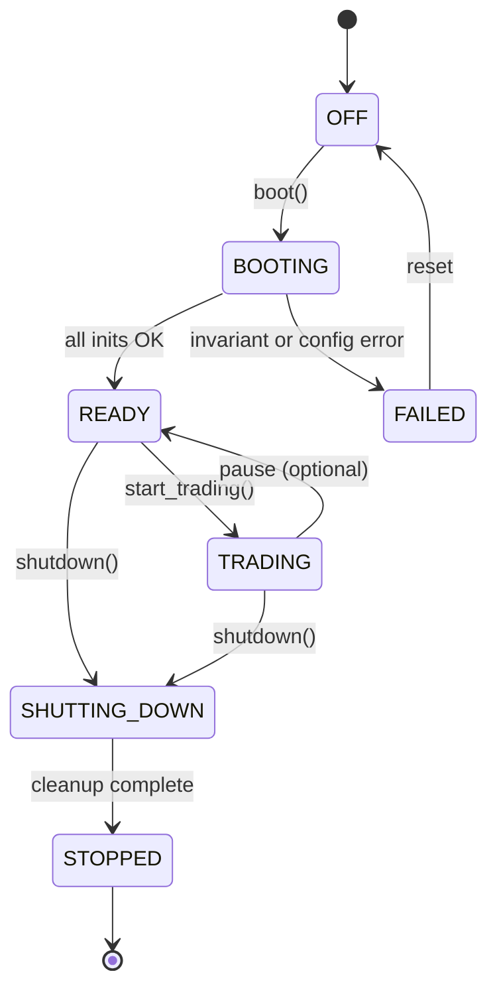

# 02a — Runtime Execution Model

**Status:** Canonical  
**Flows:** See `02-system-blueprint.md`  
**Principles:** P1, P2, P8, P11 in `01-architecture-constitution.md`

This document is the heart of the platform. No context may invent a private boot, threading, or sync story.

---

## 1. Application Lifecycle

```text
Boot
  ↓
Initialize Infrastructure (logging, metrics, resilience defaults)
  ↓
Load Configuration (AppConfig + profile; validate fail-closed)
  ↓
Initialize Event Bus (single implementation; register DLQ handler)
  ↓
Initialize Clock (SystemClock live / FakeClock replay)
  ↓
Initialize Market Data (provider + subscriptions)
  ↓
Warm Indicators (register series; optional prefetch)
  ↓
Warm Strategies (register instances; bind to indicator feeds)
  ↓
Initialize OMS + Risk (inject ports; wire Execution Target)
  ↓
Connect Broker (if market data or Live target requires it)
  ↓
Run Parity Gate (if Live or explicit QA-testability-3)
  ↓
Ready
  ↓
Trading (event loop processing)
  ↓
Shutdown (coordinated; cancel policy for open orders)
```

### State machine



### Boot failure policy

- **Fail-closed:** any P0 init failure → `FAILED`, no partial trading.
- **No lazy broker auth:** Live target requires authenticated session before `Ready`.
- **Idempotent boot:** second `boot()` on `READY` is no-op or explicit error (not double-wiring).

---

## 2. Thread Ownership

TradeXV2 is **single-process, asyncio-primary** with bounded thread offload for blocking I/O.

| Owner | Runs on | May mutate | Must NOT mutate |
|---|---|---|---|
| **Main / asyncio loop** | Event loop thread | Event dispatch, strategy eval, OMS state transitions, risk checks | Blocking broker HTTP > 100ms without offload |
| **Market data task** | asyncio Task on main loop | Subscription state, tick/bar normalization | OMS order dict directly (publish events only) |
| **Replay driver task** | asyncio Task | FakeClock advance, catalog read schedule | Broker connections |
| **Blocking I/O pool** | `run_in_executor` / thread pool | None (returns results to loop) | Any shared mutable kernel state without lock |
| **Persistence worker** | asyncio Task or executor | Datalake writes, audit append | OMS hot path state |
| **Scheduler** | asyncio Task | Timers (reconcile safety net, daily PnL check) | Order submission without going through OMS |

### Rules

1. **OMS state is single-writer:** only OMS module mutates order FSM on the main loop.
2. **Risk checks are synchronous on the loop** before submit (QA-latency-2).
3. **No second event loop** per process.
4. **Broker WS callbacks** enqueue to asyncio loop; never call OMS from WS thread directly.

---

## 3. Synchronization Model

| Pattern | Use | Example |
|---|---|---|
| **asyncio await** | Default integration | place_order await Execution Target |
| **EventBus pub/sub** | Cross-context notification | BAR_CLOSED → Strategy |
| **Single-writer queues** | WS → loop handoff | `asyncio.Queue` for inbound ticks |
| **No actor mailboxes** | — | Not used; keep asyncio + bus |
| **Locks** | Rare; last resort | File cache, idempotency store only |

### Lock ownership

- **IdempotencyGuard:** owns lock for correlation_id dedupe scope.
- **DuckDB pool:** connection pool mutex internal to datalake; not visible to OMS.
- **Forbidden:** OMS holding locks across await points.

### Ordering guarantees

- Events from single instrument on single publisher are **FIFO**.
- Cross-instrument ordering: **not guaranteed** (strategies must not depend on it).
- Replay: **total order** defined by FakeClock sequence (deterministic).

---

## 4. Failure Domains

| Domain | What fails | What stops | What survives |
|---|---|---|---|
| **Config load** | Invalid AppConfig | Entire boot | Nothing |
| **Broker auth** | Bad credentials | Trading; market data may be limited | Local config |
| **Single order submit** | Target reject | That order only | Other orders, session |
| **Risk provider** | Lookup exception | Signal → deny | Session continues |
| **EventBus handler** | Subscriber exception | DLQ + log; bus continues | Other subscribers |
| **Reconcile drift (Live)** | Phantom position | Next place blocked until heal | Session |
| **Invariant violation** | Illegal FSM transition | Trading halt (fail-fast) | Durable audit log |
| **Process crash** | SIGKILL | Everything in memory | Durable orders/fills if persisted |

### Restart policy

| Component | Auto-restart | Manual |
|---|---|---|
| Broker WS | Yes (backoff) | Re-auth if token expired |
| Market data task | Yes | — |
| OMS | No (process restart) | Full boot + reconcile |
| Strategy | No | Fix code; restart session |

---

## 5. Composition Root

**Single owner:** `src/runtime/factory.py` (and `tradex/session.py` as SDK facade delegating to it).

### Assembly order (matches lifecycle)

```python
# Pseudocode — illustrative only
def build_kernel(config: AppConfig) -> TradingKernel:
    clock = resolve_clock(config.execution_target)
    bus = EventBusImpl()
    idempotency = IdempotencyGuard(store=resolve_store(config))
    market_data = MarketDataProvider(broker=resolve_broker(config), bus=bus)
    risk = RiskManager(clock=clock, portfolio=cache, ...)
    execution_target = resolve_execution_target(config)  # Replay|Backtest|Paper|Live
    oms = OrderManager(risk=risk, target=execution_target, bus=bus, idempotency=idempotency, clock=clock)
    strategies = wire_strategies(config, bus, indicators=...)
    return TradingKernel(clock=clock, bus=bus, oms=oms, market_data=market_data, ...)
```

### Capability selection

| Config key | Effect |
|---|---|
| `execution_target=replay` | FakeClock + ReplayTarget; no broker submit |
| `execution_target=backtest` | Batch driver + BacktestTarget |
| `execution_target=paper` | SystemClock + PaperTarget + live MD |
| `execution_target=live` | SystemClock + LiveTarget + broker submit + reconcile |

**Rule:** `resolve_execution_target` is the **only** branch on execution mode in the codebase.

### Dependency injection

- Interface/API receives kernel via factory; **no** service locator with string keys in hot path.
- `deps.py` getters return **protocol types** (`OrderManagerPort`, `RiskManagerPort`), not `Any`.

---

## 6. Trading Loop (Ready → Trading)

```mermaid
sequenceDiagram
  participant Loop as AsyncioLoop
  participant BUS as EventBus
  participant H as Handlers

  loop until shutdown
    Loop->>BUS: dispatch next event
    BUS->>H: BAR_CLOSED / FILL / ...
    H->>H: strategy / risk / oms (single-writer)
  end
```

- **Cooperative multitasking:** long strategy eval must yield or run in executor with timeout.
- **Shutdown:** set flag; drain queue; cancel open orders per policy; close broker.

---

## 7. Conformance Checks

Architecture tests MUST verify:

1. Only `runtime/` imports concrete broker modules.
2. Only `resolve_execution_target` branches on execution mode (grep ratchet).
3. No `datetime.now()` in order/fill/event builders (P8).
4. OMS not imported from broker plugins.

Violations → Phase G gap; fix in Phase H.
