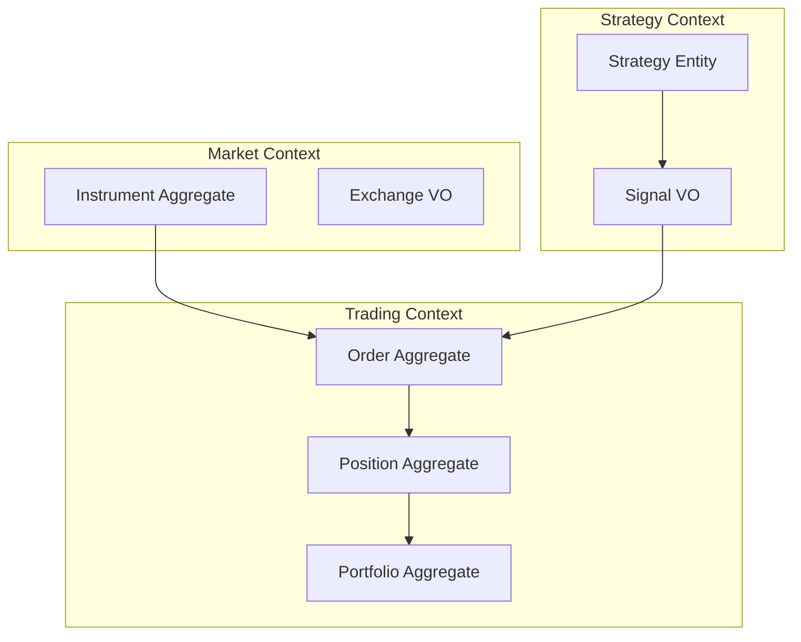

# 03 — Domain Model

**Status:** Canonical  
**Terms:** `00b-glossary.md` (mandatory)  
**Contracts:** `04-component-contracts.md`

---

## Aggregate Map



---

## Value Objects

| Name | Fields (conceptual) | Invariants |
|---|---|---|
| **Price** | amount: Decimal, currency | tick-aligned; non-negative for limits |
| **Quantity** | value: int, lot_size | positive; multiple of lot |
| **Symbol** | raw: str | normalized via domain rules |
| **BrokerId** | enum | registered plugin only |
| **CorrelationId** | uuid str | unique per order intent |
| **Timestamp** | instant from Clock | never wall-clock in sim paths |
| **Signal** | instrument, side, qty_hint, confidence, strategy_id, ts | immutable after create |
| **Money** | amount + currency | same currency ops only |

---

## Entities

### Instrument (aggregate root — market metadata)

- **Identity:** internal instrument_id (canonical); maps from Symbol + Exchange + segment
- **Lifecycle:** registered → active → delisted
- **Invariants:** tick_size > 0; lot_size ≥ 1; exchange calendar resolvable
- **Events:** `INSTRUMENT_REGISTERED`, `INSTRUMENT_DELISTED`

### Order (aggregate root — trading)

- **Identity:** correlation_id (platform); order_id (broker, after ack)
- **Lifecycle FSM:**

```text
PENDING_NEW → SUBMITTED → PARTIALLY_FILLED → FILLED
              ↓              ↓
           REJECTED      CANCELLED
              ↓
           EXPIRED (optional TIF)
```

- **Invariants:** illegal transitions raise `IllegalTransitionError` (P9); terminal states immutable
- **Events:** `ORDER_CREATED`, `ORDER_SUBMITTED`, `ORDER_ACKED`, `ORDER_REJECTED`, `ORDER_CANCELLED`, `ORDER_FILLED`

### Position (aggregate root — per instrument/account)

- **Identity:** (account_id, instrument_id)
- **Lifecycle:** flat → open → flat
- **Invariants:** net_qty = sum(fills); avg_price weighted correctly
- **Events:** `POSITION_OPENED`, `POSITION_UPDATED`, `POSITION_CLOSED`

### Portfolio (aggregate root — account view)

- **Identity:** account_id
- **Lifecycle:** session-scoped snapshot + rolling PnL
- **Invariants:** total PnL = realized + unrealized; consistent with positions
- **Events:** `PNL_UPDATED`, `PORTFOLIO_SNAPSHOT`

### Strategy (entity)

- **Identity:** strategy_id
- **Lifecycle:** registered → active → stopped
- **Invariants:** stateless or explicit internal state documented; no direct OMS access
- **Events:** `SIGNAL_GENERATED` (via Signal VO)

---

## Domain Events (catalog)

| Event | Aggregate | Key payload |
|---|---|---|
| `BAR_CLOSED` | — (market data) | instrument_id, ohlcv, ts |
| `TICK_RECEIVED` | — | instrument_id, price, qty, ts |
| `SIGNAL_GENERATED` | Strategy | Signal VO |
| `RISK_APPROVED` | Risk | signal_id, order_draft |
| `RISK_DENIED` | Risk | signal_id, reason_code |
| `ORDER_CREATED` | Order | correlation_id, fields |
| `FILL_RECEIVED` | Order | fill_id, qty, price, ts |
| `POSITION_UPDATED` | Position | net_qty, avg_price |
| `PNL_UPDATED` | Portfolio | daily_realized, unrealized |
| `RECONCILE_REQUESTED` | OMS | trigger, scope |
| `RECONCILE_COMPLETED` | OMS | drift_count, healed |

Events are **immutable** dataclasses or frozen models. Published only via EventBus port.

---

## Relationships

| From | To | Cardinality | Rule |
|---|---|---|---|
| Order | Instrument | n:1 | every order references instrument_id |
| Fill | Order | n:1 | fills never exist without parent order |
| Position | Instrument | 1:1 per account | at most one position row per pair |
| Signal | Strategy | n:1 | attribution required |
| Portfolio | Position | 1:n | portfolio is derived aggregate |

---

## Risk Domain (domain service, not aggregate)

- **Input:** Signal + Portfolio snapshot + limits config
- **Output:** Allow (with sized Order draft) or Deny (reason_code)
- **Invariants:** fail-closed on provider fault (P4); deny is final for that signal

---

## OMS Domain Service

- **Owns:** Order FSM transitions, idempotency check, submit to ExecutionTarget
- **Does not own:** Fill price logic (target), broker wire format (broker plugin)

---

## Ubiquitous Language Enforcement

Code modules MUST use glossary terms in type names and docs:

- `Signal`, not `Alert` or `TradeIntent`
- `ExecutionTarget`, not `ExecutionMode` or `SimAdapter`
- `Fill`, not `Trade` (when meaning execution result)
- `Runtime Session`, not `Session` alone in runtime code

---

## Persistence Boundary

This document excludes storage schema. Persistence adapters map aggregates to:

- **Orders/Fills:** memory + optional durable ledger (Live)
- **Market data:** DuckDB datalake
- **Config:** AppConfig files

Aggregate invariants hold in memory regardless of persistence backend.
