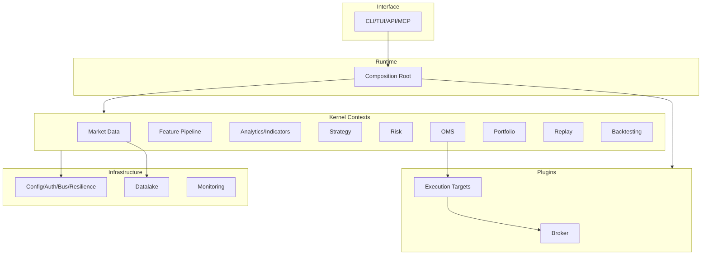

# 05 — Bounded Contexts

**Status:** Canonical  
**Contracts:** `04-component-contracts.md` (contexts implement contracts)  
**Domain:** `03-domain-model.md`

Contexts are organized around **stable contracts**, not folder accidents.

---

## Context Map

---

## Broker

| | |
|---|---|
| **Responsibilities** | Wire protocol, auth, broker-specific symbol mapping, WS/REST transport |
| **Implements** | `BrokerSession`, parts of `BrokerAdapter` |
| **Consumes** | Domain ports only (no OMS internals) |
| **Publishes** | Raw feed events (internal), connection status |
| **Consumes events** | — |
| **Persistence** | Token cache, credential refs (infra) |
| **Extension** | `tradex.brokers` entry-point |
| **Dependencies** | infrastructure/auth, domain ports |

---

## Market Data

| | |
|---|---|
| **Responsibilities** | Subscriptions, tick/bar normalization, stale detection, history facade |
| **Implements** | `MarketDataProvider` |
| **Consumes** | `BrokerSession` (live), `HistoricalProvider` (batch) |
| **Publishes** | `TICK_RECEIVED`, `BAR_CLOSED`, `DATA_STALE` |
| **Consumes events** | `SYSTEM_READY` (start subscriptions) |
| **Persistence** | Delegates historical writes to Datalake |
| **Extension** | New feed types via provider adapter |
| **Dependencies** | Broker plugin, EventBus, Datalake |

---

## Feature Pipeline

| | |
|---|---|
| **Responsibilities** | Transform raw bars/ticks → feature vectors for indicators/strategies |
| **Implements** | Internal pipeline ports |
| **Consumes** | `BAR_CLOSED`, `TICK_RECEIVED` |
| **Publishes** | Feature-ready series (internal or `FEATURE_COMPUTED`) |
| **Persistence** | Optional feature store in datalake |
| **Dependencies** | Market Data, Analytics |

---

## Analytics / Indicators

| | |
|---|---|
| **Responsibilities** | Indicator computation, scanner queries, pattern detection |
| **Implements** | `Indicator` |
| **Consumes** | Feature pipeline, datalake reads |
| **Publishes** | Indicator update events (internal) |
| **Persistence** | DuckDB via datalake adapters only |
| **Extension** | New indicators register in pipeline |
| **Dependencies** | Datalake, domain |

---

## Strategy

| | |
|---|---|
| **Responsibilities** | Strategy eval, signal generation |
| **Implements** | `Strategy` |
| **Consumes** | Indicators, `StrategyContext` (portfolio read) |
| **Publishes** | `SIGNAL_GENERATED` |
| **Persistence** | Strategy config only |
| **Extension** | Strategy plugins / registered classes |
| **Dependencies** | EventBus, Portfolio (read), Clock |

---

## Risk

| | |
|---|---|
| **Responsibilities** | Pre-trade gate, kill-switch, trading state, limit enforcement |
| **Implements** | `RiskManager` |
| **Consumes** | Signals, Orders (check), Portfolio snapshot |
| **Publishes** | `RISK_APPROVED`, `RISK_DENIED` |
| **Persistence** | Limits config; daily PnL counters in memory + optional durable |
| **Dependencies** | Portfolio, Instrument lookup, Clock |

---

## OMS

| | |
|---|---|
| **Responsibilities** | Order FSM, idempotency, submit to ExecutionTarget, reconcile trigger |
| **Implements** | `OMS` / `OrderManagerPort` |
| **Consumes** | Risk approvals, fills from target |
| **Publishes** | Order lifecycle events, `RECONCILE_*` |
| **Consumes events** | `FILL_RECEIVED`, `ORDER_ACK` (from target) |
| **Persistence** | In-memory + durable ledger (Live) |
| **Dependencies** | ExecutionTarget, RiskManager, EventBus, IdempotencyGuard, Clock |

---

## Portfolio

| | |
|---|---|
| **Responsibilities** | Positions, PnL, portfolio snapshots |
| **Implements** | `PortfolioService` |
| **Consumes** | Fills |
| **Publishes** | `POSITION_UPDATED`, `PNL_UPDATED` |
| **Persistence** | Session state; reconcile from broker (Live) |
| **Dependencies** | Clock, domain aggregates |

---

## Replay

| | |
|---|---|
| **Responsibilities** | Deterministic catalog playback, FakeClock driver |
| **Implements** | `ReplayTarget`, replay session driver |
| **Consumes** | HistoricalProvider catalog, full kernel |
| **Publishes** | Synthetic `BAR_CLOSED` stream |
| **Dependencies** | OMS, Strategy, Risk (same as live) |

---

## Backtesting

| | |
|---|---|
| **Responsibilities** | Batch strategy evaluation, equity metrics |
| **Implements** | `BacktestTarget`, backtest runner |
| **Consumes** | HistoricalProvider, Strategy |
| **Publishes** | Batch progress, final report |
| **Dependencies** | OMS, Risk, Portfolio |

---

## Execution Targets (cross-cutting)

| | |
|---|---|
| **Responsibilities** | Paper + Live + Replay + Backtest target impls |
| **Implements** | `ExecutionTarget` |
| **Consumes** | Orders from OMS |
| **Publishes** | Fills, submit acks/rejects |
| **Extension** | New target = new impl + factory registration |
| **Dependencies** | Broker (Live only), Clock, fill model config |

---

## Infrastructure

| | |
|---|---|
| **Responsibilities** | EventBus, idempotency store, auth, resilience, observability |
| **Implements** | EventBus, IdempotencyGuard, tracing |
| **Dependencies** | domain ports only |
| **Must NOT** | Business rules, strategy logic |

---

## Configuration

| | |
|---|---|
| **Responsibilities** | AppConfig schema, profiles, env resolution |
| **Implements** | Config loader |
| **Persistence** | `.env.*`, pydantic schema |
| **Dependencies** | stdlib, pydantic |

---

## Monitoring

| | |
|---|---|
| **Responsibilities** | Health checks, metrics, structured logging |
| **Implements** | `/health`, metrics exporters |
| **Consumes** | Kernel state, broker connectivity |
| **Dependencies** | Infrastructure |

---

## Datalake (supporting context)

| | |
|---|---|
| **Responsibilities** | Ingestion, quality, DuckDB storage, research queries |
| **Implements** | `HistoricalProvider` (partial) |
| **Dependencies** | Exchange plugin for calendar |
| **Must NOT** | Order placement, OMS imports |

---

## Interface (delivery context)

| | |
|---|---|
| **Responsibilities** | CLI, API, TUI, MCP — translate user intent to use cases |
| **Consumes** | Runtime-wired kernel ports |
| **Must NOT** | Broker imports, business rules, duplicate OMS wiring |

---

## Runtime (composition context)

| | |
|---|---|
| **Responsibilities** | Single composition root, capability selection, lifecycle |
| **Implements** | `build_kernel()`, execution target resolution |
| **Must NOT** | Domain business rules |

---

## Anti-patterns (context violations)

| Violation | Severity |
|---|---|
| Broker context calling OMS directly | P0 |
| Strategy calling `place_order` bypassing Risk | P0 |
| Second EventBus in analytics | P1 |
| Datalake importing application OMS | P0 |
| Interface importing `brokers.dhan` | P1 |
