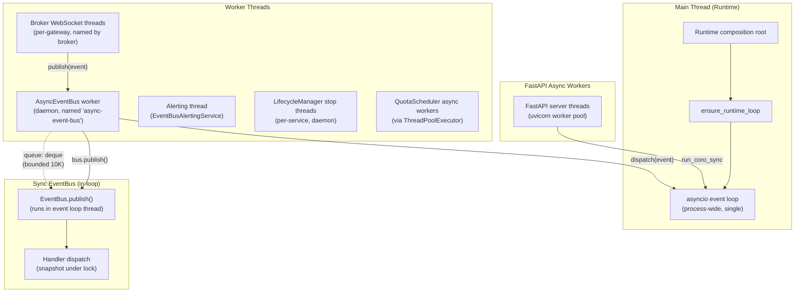
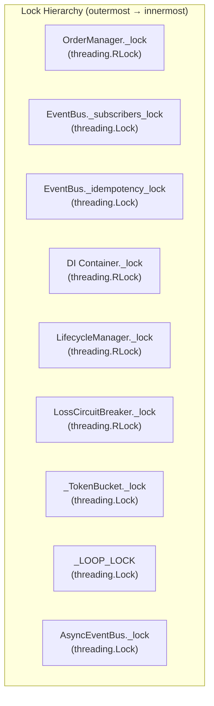

# D2.4 — Concurrency Model

Documents threading architecture, lock hierarchy, async/sync bridges,
ContextVar usage, backpressure mechanisms, and known race conditions.

---

## 1. Threading Model



### Thread Inventory

| Thread | Owner | Lifecycle | Purpose |
|--------|-------|-----------|---------|
| **Main/Runtime thread** | `Runtime` | `run_forever` | Owns the process-wide asyncio event loop |
| **async-event-bus** | `AsyncEventBus` | `start()`/`stop()` | Drains bounded queue, dispatches to sync `EventBus` |
| **EventBus alerting** | `EventBusAlertingService` | `start_alerting()`/`stop_alerting()` | Periodic alert evaluation (10s interval) |
| **Lifecycle stop threads** | `LifecycleManager._stop_one` | Per-stop-call, daemon | Enforces timeout on `service.stop()` |
| **Broker WS threads** | Dhan gateway / `BrokerStreamHandle` | Per-session | Reads WebSocket frames, calls `on_raw_frame` |
| **QuotaScheduler workers** | `ThreadPoolExecutor` | Per `acquire_async` call | Runs async rate-limit acquisition |
| **uvicorn worker threads** | FastAPI/uvicorn | Server lifetime | Handles HTTP requests, runs async handlers |

---

## 2. Lock Hierarchy



### Lock Inventory

| Lock | Type | Scope | Nesting Rule |
|------|------|-------|-------------|
| `OrderManager._lock` | RLock | Protects `_orders`, `_orders_by_correlation`, `_handler_depth` | Never call I/O (broker, event bus publish) under this lock |
| `EventBus._subscribers_lock` | Lock | Protects `_subscribers` dict during snapshot | Acquired only to snapshot handler list; dispatch happens outside |
| `EventBus._idempotency_lock` | Lock | Protects `_processed_event_ids` set and `_processed_events` deque | Standalone; no nesting |
| `Container._lock` | RLock | Protects `_factories`, `_scopes`, `_singletons`, `_resolving` | Factory called OUTSIDE lock to allow nested resolves |
| `LifecycleManager._lock` | RLock | Protects `_services`, `_started`, `_start_failed`, `_stop_order` | No I/O under lock; health checks run outside |
| `LossCircuitBreaker._lock` | RLock | Protects `_state`, `_samples`, `_opened_at`, `_trip_count` | All public methods acquire; no external I/O |
| `_TokenBucket._lock` | Lock | Protects `_tokens`, `_last_refill` | Standalone; try_acquire is fast |
| `_LOOP_LOCK` | Lock | Protects `_RUNTIME_LOOP` global reference | Must not hold while calling loop methods |
| `AsyncEventBus._lock` | Lock | Protects `_queue` (deque) | publish() and _drain_batch() only |

### Nesting Rules

1. **`OrderManager._lock` → NO nested locks.** The lock protects in-memory state only. Broker I/O, risk checks, event publishing, and idempotency service calls all happen OUTSIDE the lock (see `place_order` design: "runs risk check and broker I/O outside the lock").
2. **`Container._lock` → RLock (reentrant).** Factories are called OUTSIDE the lock to prevent deadlock during nested resolves. The `_resolving` set tracks circular dependencies.
3. **`EventBus._subscribers_lock` → snapshot only.** Handlers are copied into a list under lock, then dispatched outside the lock (copy-on-publish pattern).
4. **No cross-lock nesting.** Each lock protects an isolated data structure. There is no code path that holds two of these locks simultaneously.

---

## 3. Async/Sync Bridge Points

**Source:** `src/runtime/event_loop.py`

### `run_coro_sync` Fallback Chain

```
run_coro_sync(coro, timeout=None)
│
├─ 1. Check for running loop (asyncio.get_running_loop)
│   └─ If found: run_coroutine_threadsafe(coro, running).result(timeout)
│
├─ 2. Check for established runtime loop (_RUNTIME_LOOP)
│   ├─ If loop is running: run_coroutine_threadsafe(coro, loop).result(timeout)
│   └─ If loop is stopped: loop.run_until_complete(coro)
│
└─ 3. Fallback: create ephemeral loop
    ├─ asyncio.new_event_loop()
    ├─ set_event_loop(ephemeral)
    ├─ ephemeral.run_until_complete(coro)
    └─ finally: ephemeral.close(); set_event_loop(None)
```

### Key Properties

| Property | Constraint |
|----------|-----------|
| `asyncio.new_event_loop()` | **MUST NOT** appear outside `event_loop.py` |
| Single runtime loop | Created ONCE via `ensure_runtime_loop()` from composition root |
| `new_dedicated_loop()` | For long-lived servers only (metrics HTTP, depth feed) |
| `assert_single_loop_boundary()` | Debug guard: detects tasks on non-runtime loops |

### Bridge Call Sites

| Caller Thread | Bridge Method | Target |
|---------------|--------------|--------|
| FastAPI handler (async) | Direct `await` | Runtime event loop |
| Broker WS thread (sync) | `run_coro_sync` → `run_coroutine_threadsafe` | Runtime event loop |
| `QuotaScheduler.acquire_async` | `asyncio.wait_for` | Runtime event loop |
| `TickRouter.deliver_tick` | Direct `await` (already async) | Runtime event loop |
| `LifecycleManager._stop_one` | Thread + `join(timeout)` | Service's own stop method |

---

## 4. ContextVar Usage

| ContextVar | Module | Scope | Purpose |
|------------|--------|-------|---------|
| `_correlation_var` | `domain.correlation` | Request/correlation scope | End-to-end tracing; injected into every `DomainEvent.now()` |
| `_current_scope` | `infrastructure.di_scopes` | Request scope | Per-request DI instance cache; `scope='request'` services |
| `_ambient` | `domain.ports.session_context` | Session scope | Notebook/multi-session provider resolution |
| `_oms_managed_submit` | `domain.ports.execution_context` | Execution scope | Flag: True when OMS is managing order submission |
| `_clock_var` | `domain.ports.time_service` | Test/replay scope | Virtual clock override for deterministic testing |

### ContextVar Propagation Rules

1. **Correlation ID** propagates automatically via `DomainEvent.now()`. The `_prepare_event` method reads `_correlation_var` and injects it into every published event.
2. **Request-scoped DI** instances are created once per `request_scope()` context manager. Outside the scope, resolving a request-scoped service raises `NoActiveRequestScope`.
3. **ContextVars do NOT propagate to `ThreadPoolExecutor` workers** unless `contextvars.copy_context().run(...)` is used. This is documented in `session_context.py` and is a known gotcha.
4. **`with_correlation()` context manager** (in `infrastructure.correlation`) saves/restores the previous value, making it safe for nested usage.

---

## 5. Backpressure Mechanisms

### AsyncEventBus Queue

**Source:** `src/infrastructure/event_bus/async_event_bus.py`

| Parameter | Default | Behavior |
|-----------|---------|----------|
| `max_queue_size` | 10,000 | Normal events dropped when queue full |
| Critical event overflow | 2× max_queue_size | `TRADE_APPLIED`, `TRADE_FILLED`, `ORDER_PLACED` allowed up to 2× |
| `_batch_size` | 64 | Events drained in batches of 64 per wake-up |
| Worker poll interval | 50ms | `_stop_event.wait(timeout=0.05)` between drains |
| Dropped counter | `_dropped_count` | Observable via `get_stats()` |

**Decision flow:**

```
publish(event):
  is_critical = event.type in {TRADE_APPLIED, TRADE_FILLED, ORDER_PLACED}
  queue_full = len(queue) >= max_queue_size

  if queue_full AND NOT is_critical:
      DROP (increment _dropped_count)
  elif queue_full AND is_critical AND len(queue) >= 2× max_queue_size:
      DROP critical (log ERROR, increment _dropped_count)
  else:
      queue.append(event)
```

### EventBus Subscription Management

| Mechanism | Purpose |
|-----------|---------|
| Copy-on-publish | `_subscribers_lock` held only to snapshot handler list; dispatch outside lock |
| Lock-free sequence counter | `itertools.count(1)` is atomic under CPython GIL |
| Bounded idempotency cache | `deque(maxlen=10000)` with paired `set` for O(1) lookup |
| Dead letter queue | Failed events preserved for replay; prevents silent data loss |

### QuotaScheduler Token Bucket

| Parameter | Purpose |
|-----------|---------|
| `sustained_rate` | Tokens per second refill rate |
| `burst_capacity` | Maximum tokens that can accumulate |
| `reserved_headroom` (20%) | Tokens reserved for `EXECUTION_CRITICAL` priority only |
| Non-critical priority | Can only consume `capacity - reserved_tokens` |
| `acquire_async` | Async wrapper using `asyncio.wait_for` with timeout |

---

## 6. Race Conditions and Mitigations

### Known Risks

| Race Condition | Location | Mitigation |
|---------------|----------|------------|
| **Event handler re-entry** | `OrderManager.on_order_update` / `on_trade` | `_ReentrancyGuard` checks `_handler_depth` atomically under `RLock`; returns early if re-entered |
| **Torn reads on order state** | `OrderManager.get_order` | Read under `self._lock`; `Order` is frozen dataclass (immutable after creation) |
| **Idempotency race** | `IdempotencyGuard.check_and_reserve` | Atomic check-and-set under `OrderManager._lock`; reservation released on all error paths via `finally`/`_release_pending` |
| **EventBus handler failure during dispatch** | `EventBus.publish` | Handlers are snapshot into a list under lock; failures are caught per-handler, logged, and dead-lettered; never propagate |
| **AsyncEventBus concurrent publish** | `AsyncEventBus.publish` from multiple broker threads | `_lock` (threading.Lock) guards `queue.append()` and `queue.popleft()` |
| **Container circular dependency** | `Container._resolve_singleton` | `_resolving` set tracked under lock; factory called outside lock; `CircularDependencyError` raised on cycle |
| **LossCircuitBreaker concurrent `record_loss` + `allow_trading`** | Both acquire `RLock` | RLock ensures mutual exclusion; `_maybe_transition_cooldown` called on every `allow_trading` check |
| **ContextVar not propagating to thread pools** | `ThreadPoolExecutor` workers | Documented in `session_context.py`; mitigated by `contextvars.copy_context().run(...)` where needed |
| **Late ticks after candle close** | `CandleAggregator.update` | Late ticks (`ts_epoch < bucket_start_epoch`) silently discarded; only forward ticks advance the bucket |

### Design Invariants

1. **No I/O under `OrderManager._lock`.** The `place_order` method explicitly performs broker I/O (`submit_fn`), risk checks, and event publishing OUTSIDE the lock. Lock is held only for state mutations (idempotency check + order book update).
2. **Copy-on-publish for EventBus handlers.** Handler list is snapshotted under `_subscribers_lock`, then iteration happens outside the lock. A handler that unsubscribes during dispatch is safely skipped.
3. **Single runtime event loop.** `asyncio.new_event_loop()` is forbidden outside `event_loop.py`. All async work routes through one loop, preventing scattered loop ownership.
4. **Frozen dataclasses for domain entities.** `Order`, `Trade`, `MarketTick`, `DomainEvent` are all frozen, making them safe to share across threads without copying.
5. **RLock for reentrant paths.** `OrderManager._lock` and `Container._lock` use RLock because the same thread may need to re-acquire (e.g., nested DI resolves, or order update during trade recording).
