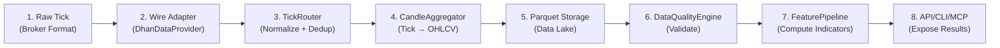

# D2.5 — Data Lineage

Traces data from raw broker tick through normalization, aggregation,
storage, quality validation, and feature computation to API/CLI/MCP exposure.

---

## End-to-End Data Flow



---

## Stage 1: Raw Tick (Broker-Specific Format)

**Source:** Dhan WebSocket frame (`brokers/dhan/`)

**Format:** Python `dict` from JSON WebSocket frame.

```python
# Dhan WebSocket frame (raw)
{
    "type": "mn",
    "symbol": "RELIANCE",
    "exchange": "NSE_EQ",
    "trading_symbol": "RELIANCE",
    "ltp": 2500.50,          # Last traded price (float, may be in paise)
    "last_price": 2500.50,
    "open": 2480.00,
    "high": 2510.00,
    "low": 2475.00,
    "close": 2490.00,
    "volume": 1234567,
    "bid": 2500.00,
    "ask": 2501.00,
    "timestamp": 1690000000,      # Unix timestamp (seconds or milliseconds)
    "exchange_timestamp": 1690000000,
    "sequence": 42,
}
```

**Characteristics:**
- Field names vary by broker (`ltp` vs `last_price`, `symbol` vs `trading_symbol`)
- Prices may be in paise (integer) or rupees (float) depending on endpoint
- Timestamps may be seconds, milliseconds, or ISO strings
- Exchange codes differ (`NSE_EQ` vs `NSE`, `NFO` vs `NFO`)

---

## Stage 2: Wire Adapter Normalization

**Source:** `src/brokers/dhan/data/data_provider.py` — `DhanDataProvider`

**Input:** Raw broker `dict` or gateway response object
**Output:** `QuoteSnapshot` (domain value object)

```python
@dataclass(slots=True, frozen=True)
class QuoteSnapshot:
    instrument: InstrumentRef      # InstrumentRef(symbol="RELIANCE", exchange="NSE")
    ltp: Decimal                   # Always Decimal, always rupees
    event_time: datetime           # Always UTC, timezone-aware
    provenance: DataProvenance     # Source tracking (broker_id, fetched_at, confidence)
    open: Decimal = Decimal("0")
    high: Decimal = Decimal("0")
    low: Decimal = Decimal("0")
    close: Decimal = Decimal("0")
    volume: int = 0
    change_pct: Decimal = Decimal("0")
    bid: Decimal | None = None
    ask: Decimal | None = None
```

**Normalization steps:**
1. Resolve field name aliases (`ltp`/`last_price` → `ltp`)
2. Convert all prices to `Decimal` in rupees
3. Create `InstrumentRef` from symbol + exchange
4. Attach `DataProvenance` with `SourceIdentity(broker_id)`, `fetched_at=now`, `confidence=AUTHORITATIVE`
5. Set `event_time` to UTC timezone-aware datetime

---

## Stage 3: TickRouter (Normalize + Dedup + Fan-Out)

**Source:** `src/application/streaming/tick_router.py` — `TickRouter`

**Input:** Raw broker `dict` frame from WebSocket
**Output:** `MarketTick` (domain entity) delivered to consumers

### Normalization (`_normalize_tick`)

```python
@dataclass(slots=True, frozen=True)
class MarketTick:
    instrument: InstrumentRef     # InstrumentRef(symbol="RELIANCE", exchange="NSE")
    ltp: Decimal                  # Always Decimal, always rupees
    event_time: datetime          # Exchange time if available, else arrival time (UTC)
    provenance: DataProvenance    # DataProvenance.now(broker_id, "stream")
    volume: int = 0
    bid: Decimal | None = None
    ask: Decimal | None = None
    sequence: int | None = None
    open: Decimal | None = None
    high: Decimal | None = None
    low: Decimal | None = None
    broker_id: str = ""           # e.g. "dhan"
    session_id: str = ""          # Stream session identifier
```

**Normalization steps:**
1. Extract `symbol` from `frame["symbol"]` or `frame["trading_symbol"]`
2. Resolve `exchange` defaulting to `"NSE"`
3. Parse `event_time` via `_parse_exchange_time()` — handles datetime, int (seconds/ms), ISO string, with fallback to arrival time
4. Convert prices to `Decimal`, volume to `int`
5. Attach `DataProvenance.now(broker_id, "stream")` — provenance timestamp is set to current time

### Deduplication

| Parameter | Value |
|-----------|-------|
| `_STREAM_DEDUP_WINDOW_S` | 2.0 seconds |
| `_STREAM_DEDUP_MAX_ENTRIES` | 4096 |
| `_STREAM_DEDUP_COARSE_BUCKET_S` | 1.0 second |

**Dedup key:** `(instrument_key, event_time, sequence)` — primary key
**Fallback key (Dhan-specific):** `(instrument_key, ltp, bucket)` where `bucket = int(now // 1.0)`

A tick is dropped (`dedup_drop() → True`) if either key was seen within the 2-second window.

### Fan-Out

```
deliver_tick(session_id, tick):
  1. For each subscription matching session_id:
     → consumer.on_market_tick(tick)  [1s timeout via asyncio.wait_for]
  2. CandleAggregator.update(tick)    [if configured]
  3. session.record_message(now)
  4. session.update_freshness(FRESH, at=now)
  5. If freshness changed: notify_health_change(session_id, health)
```

---

## Stage 4: CandleAggregator (Tick → OHLCV)

**Source:** `src/application/streaming/candle_aggregator.py` — `CandleAggregator`

**Input:** `MarketTick` (from TickRouter)
**Output:** `HistoricalBar` via `on_candle` callback

### Internal Bucket State

```python
# Per (symbol_key, timeframe) bucket:
{
    "symbol": "RELIANCE",
    "exchange": "NSE",
    "open_epoch": 1690000000,       # Bucket start (aligned to timeframe boundary)
    "open_time": datetime(UTC),     # Bucket start as datetime
    "open": 2500.50,                # First tick price in bucket
    "high": 2510.00,                # Highest price in bucket
    "low": 2475.00,                 # Lowest price in bucket
    "close": 2500.50,               # Latest tick price in bucket
    "volume": 1234567,              # Cumulative volume in bucket
    "tick_count": 42,               # Number of ticks merged
}
```

### Alignment Logic

```python
ts_epoch = tick.event_time.timestamp()
bucket_start_epoch = int(ts_epoch // duration_seconds) * duration_seconds
```

- **Boundary crossed** (new tick in next bucket): close current bucket → emit `HistoricalBar` → start new bucket
- **Late tick** (before current bucket): silently discarded
- **Same bucket**: merge (update high/low/close/volume)

### Output Format (`HistoricalBar`)

```python
@dataclass(frozen=True)
class HistoricalBar:
    instrument: InstrumentRef     # InstrumentRef(symbol="RELIANCE", exchange="NSE")
    timeframe: str                # "1m", "5m", "15m", "1h", etc.
    event_time: datetime          # Bar open time (UTC, timezone-aware)
    open: Decimal
    high: Decimal
    low: Decimal
    close: Decimal
    volume: int
    provenance: DataProvenance
    open_interest: int = 0
    bar_index: int = 0
    is_partial: bool = False      # True for last incomplete bar in live
    label_convention: BarLabelConvention = BarLabelConvention.LEFT
    close_time: datetime | None = None
    tick_count: int = 0
    extras: tuple[tuple[str, Any], ...] = ()
```

### Supported Timeframes

| Timeframe | Duration (s) | Example Use |
|-----------|-------------|-------------|
| `1m` | 60 | Live scalping |
| `5m` | 300 | Intraday momentum |
| `15m` | 900 | Intraday swing |
| `1h` | 3600 | Position swing |
| `1d` | 86400 | Daily OHLCV |
| `1w` | 604800 | Weekly |

Also supports: `2m`, `10m`, `30m`, `2h`, `4h`, `6h`, `12h` and arbitrary `<n><unit>` (s/m/h/d/w).

---

## Stage 5: Parquet Storage (Data Lake)

**Source:** `src/datalake/ingestion/` — `normalize.py`, `updater.py`, `loader.py`

### Canonical Schema

**Source:** `src/datalake/core/schema.py`

```python
CANONICAL_COLUMNS = [
    "timestamp",       # Naive datetime in IST (Asia/Kolkata)
    "symbol",          # NSE symbol, uppercased, stripped
    "exchange",        # "NSE", "BSE", "NFO"
    "open",            # Price in rupees
    "high",
    "low",
    "close",
    "volume",          # Number of shares
    "oi",              # Open interest (0 for equities)
    "event_time",      # When the event occurred (same as timestamp for candles)
]

TEMPORAL_COLUMNS = [
    "event_time",
    "published_at",    # When this version became available
    "ingested_at",     # When the system ingested it
    "is_correction",   # True if this overwrites a previous version
]
```

### Normalization Pipeline (`normalize_to_canonical`)

```python
def normalize_to_canonical(df, symbol, exchange, timestamp_col="timestamp"):
    df = rename_columns(df)              # Broker → canonical names
    df = ensure_timestamp_dtype(df)      # UTC timezone-aware
    df = convert_paise_to_rupees(df)     # Auto-detect paise vs rupees
    df = ensure_canonical_columns(df, symbol, exchange)
    df = add_temporal_metadata(df)       # published_at, ingested_at, is_correction
    df = df[CANONICAL_COLUMNS + temporal] # Filter to schema
    df = df.dropna(subset=["timestamp"])  # Drop null timestamps
    return df
```

**Column mapping (broker → canonical):**
```python
COLUMN_MAP = {
    "bar_time_ms": "timestamp",
    "open_paisa": "open", "high_paisa": "high",
    "low_paisa": "low", "close_paisa": "close",
    "Open": "open", "High": "high", "Low": "low", "Close": "close",
    "Volume": "volume", "Date": "timestamp", "Datetime": "timestamp",
}
```

### Parquet File Layout

```
market_data/
└── equities/
    └── candles/
        └── timeframe=1m/
            └── symbol=RELIANCE/
                └── data.parquet    # Snappy compression, partitioned
```

**Write path:** `atomic_parquet_write(path, pa.Table.from_pandas(df), compression="snappy")`
**Read path:** `pd.read_parquet(path)` — pandas DataFrame
**Incremental updates:** `IncrementalUpdater` appends new days, deduplicates on `timestamp`, atomic write.

---

## Stage 6: DataQualityEngine (Validate)

**Source:** `src/datalake/quality/engine.py` — `DataQualityEngine`

**Input:** Parquet file for a symbol
**Output:** `QualityReport` dataclass

### Checks Performed

| Check | Implementation | Status Impact |
|-------|---------------|---------------|
| File existence | `parquet_path.exists()` | `MISSING` if absent |
| Empty file | `df.empty` | `EMPTY` if true |
| Read failure | `pd.read_parquet` exception | `ERROR` |
| Duplicate timestamps | `df.duplicated(subset=["timestamp"]).sum()` | `WARNING` if > 0 |
| Intraday gaps | Compare consecutive timestamps against expected delta | `WARNING` + `missing_candles` count |
| Daily gaps | Compare against NSE trading calendar | `WARNING` + `gap_days` count |
| High < Low | `(df["high"] < df["low"]).sum()` | `WARNING` |
| Close > High | `(df["close"] > df["high"]).sum()` | `WARNING` |
| Close < Low | `(df["close"] < df["low"]).sum()` | `WARNING` |
| Zero-range candles | `open == high == low == close` | Flagged as "possible stale data" |
| Zero volume | `df["volume"] == 0` | Flagged |
| Completeness | `gap_days / expected_trading_days * 100` | Percentage in report |

### QualityReport Output

```python
@dataclass
class QualityReport:
    symbol: str
    timeframe: str
    total_rows: int
    missing_candles: int
    duplicate_candles: int
    gap_days: int
    min_date: date | None
    max_date: date | None
    completeness_pct: float
    status: str              # "OK" | "WARNING" | "MISSING" | "EMPTY" | "ERROR"
    issues: list[str]        # Human-readable issue descriptions
```

---

## Stage 7: FeaturePipeline (Compute Indicators)

**Source:** `src/analytics/pipeline/pipeline.py` — `FeaturePipeline`

**Input:** DataFrame with OHLCV columns
**Output:** DataFrame with additional feature columns

### Pipeline Pattern

```python
pipeline = (
    FeaturePipeline()
    .add(ATR(14))
    .add(VWAP())
    .add(RSI(14))
    .add(RelativeVolume(20))
    .add(Trend())
)
features = pipeline.run(df)  # Returns new DataFrame with feature columns
```

### Execution Model

```python
def run(self, df: pd.DataFrame) -> pd.DataFrame:
    result = df.copy()
    for feature in self.features:
        try:
            result = feature.compute(result)     # Each Feature adds columns
        except Exception as exc:
            if self.fail_closed:
                raise FeaturePipelineError(name, exc)
            logger.warning("Feature %s failed: %s", name, exc)
    return result
```

**Key design decisions:**
- **No caching layer** (intentionally removed) — MD5-hash cache caused look-ahead bias in backtesting
- **Sequential execution** — each Feature receives the enriched DataFrame from the previous
- **`fail_closed` mode** — when True, any feature failure raises `FeaturePipelineError` (safe default)
- **Column convention** — features add columns with their prefix (e.g., `rsi_14`, `atr_14`, `vwap`)

---

## Stage 8: API/CLI/MCP Exposure

### REST API (FastAPI)

| Endpoint | Data Source | Format |
|----------|------------|--------|
| `GET /orders` | `OrderManager.get_all_orders()` | JSON array of order dicts |
| `GET /healthz` | `LifecycleManager.health_snapshot()` | JSON service health map |
| `GET /circuit-breaker/{name}` | `LossCircuitBreaker.snapshot()` | JSON state + metrics |
| `GET /quote/{symbol}` | `DhanDataProvider.get_quote()` | `QuoteSnapshot` as JSON |
| `GET /history/{symbol}` | `DhanDataProvider.get_history()` | `HistoricalSeries` as JSON |

### CLI

| Command | Data Source |
|---------|------------|
| `tradex scan` | `Scanner.scan()` → `ScanResult` → formatted table |
| `tradex replay` | `ReplayEngine.run()` → `ReplayResult.summary` |
| `tradex quality` | `DataQualityEngine.check()` → `QualityReport.summary()` |

### MCP (Model Context Protocol)

| Tool | Data Source |
|------|------------|
| `place_order` | `OrderManager.place_order()` |
| `get_positions` | `PortfolioProjector.get_positions()` |
| `scan_universe` | `BaseScanner.scan()` |
| `check_quality` | `DataQualityEngine.check_universe()` |

---

## Data Format Summary Table

| Stage | Type | Key Fields | Location |
|-------|------|------------|----------|
| 1. Raw Tick | `dict` | `symbol`, `ltp`, `volume`, `timestamp` | WebSocket frame |
| 2. Wire Adapter | `QuoteSnapshot` | `instrument`, `ltp: Decimal`, `provenance` | `DhanDataProvider` |
| 3. TickRouter | `MarketTick` | `instrument`, `ltp: Decimal`, `event_time: UTC`, `volume`, `provenance` | `TickRouter.deliver_tick` |
| 4. CandleAggregator | `HistoricalBar` | `instrument`, `timeframe`, `OHLCV: Decimal`, `tick_count` | `on_candle` callback |
| 5. Parquet | DataFrame | `timestamp: IST`, `symbol`, `open/high/low/close: float`, `volume: int` | `market_data/equities/candles/` |
| 6. Quality | `QualityReport` | `status`, `issues[]`, `completeness_pct` | `DataQualityEngine.check` |
| 7. Features | DataFrame | Original OHLCV + `{feature}_{param}` columns | `FeaturePipeline.run` |
| 8. API/CLI/MCP | JSON / Table | Varies by endpoint | FastAPI / CLI / MCP |
