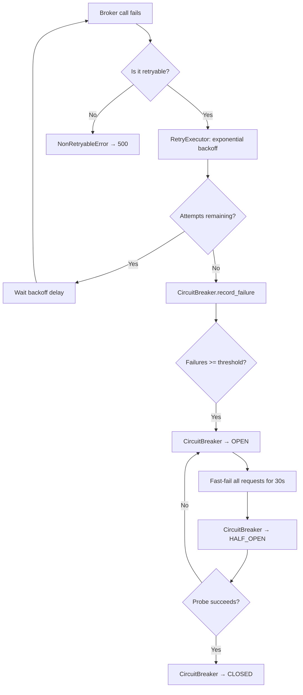
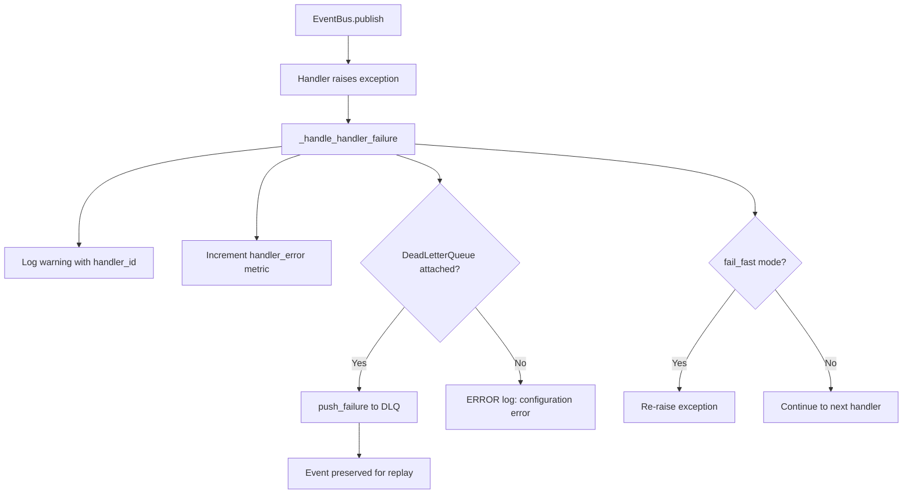
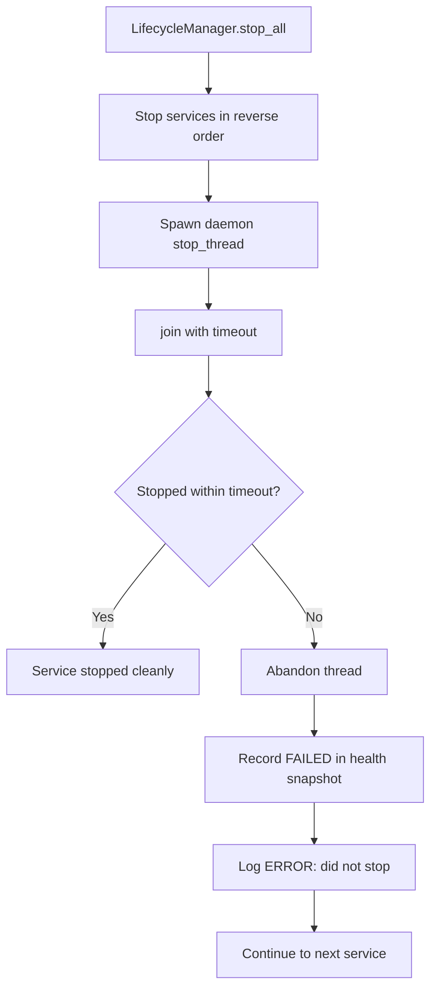

# D2.3 — Error Handling Matrix

Centralized mapping of every error type to its originating flow, recovery
action, alert level, and HTTP status code.

## Exception Hierarchy

```
TradeXV2Error (domain.exceptions)
├── BrokerError (domain.errors)
│   ├── RetryableError (alias: TradeXV2RecoverableError)
│   │   └── NetworkError
│   ├── NonRetryableError
│   ├── RateLimitError
│   ├── CircuitBreakerOpenError
│   ├── AuthenticationError
│   ├── InstrumentNotFoundError
│   ├── OrderError
│   ├── NotSupportedError
│   │   └── ExitAllError
│   └── BrokerDegradedError
├── ValidationError (domain.exceptions)
├── DataError (domain.exceptions)
├── ConfigError (domain.exceptions)
├── OrderBlockedError (application.oms.errors)
└── IllegalTransitionError (domain.state_machine)
```

---

## HTTP Status Mapping (from `global_exception_handler.py`)

| Exception | HTTP Status | Error Type String |
|-----------|-------------|-------------------|
| `AuthenticationError` | 401 | `broker_auth_error` |
| `RateLimitError` | 429 | `rate_limit_exceeded` |
| `OrderError` | 400 | `order_execution_error` |
| `CircuitBreakerOpenError` | 503 | `service_unavailable` |
| `BrokerDegradedError` | 503 | `service_unavailable` |
| `InstrumentNotFoundError` | 404 | `instrument_not_found` |
| `ValidationError` | 422 | `validation_error` |
| `NotSupportedError` | 501 | `not_supported` |
| `DataError` | 500 | `data_error` |
| `ConfigError` | 500 | `config_error` |
| `RetryableError` | 503 | `recoverable_error` |
| `NonRetryableError` | 500 | `fatal_error` |
| `BrokerError` | 502 | `broker_error` |
| `TradeXV2Error` (default) | 500 | `tradexv2_error` |
| `Exception` (unknown) | 500 | `internal_server_error` |

---

## Error Category Matrix

### 1. Network Errors

| Error Type | Source Flow | Recovery Action | Alert Level | HTTP | Retryable? |
|------------|-------------|-----------------|-------------|------|------------|
| `NetworkError` (connection reset) | Broker gateway HTTP/WS | RetryExecutor: exponential backoff (1s→8s, 3 attempts) | WARN | 503 | Yes |
| `NetworkError` (DNS failure) | Broker gateway HTTP/WS | RetryExecutor → CircuitBreaker trips after threshold | ERROR | 503 | Yes (3 attempts) |
| `NetworkError` (timeout) | Broker gateway HTTP/WS | RetryExecutor with category-specific backoff | WARN | 503 | Yes |
| `CircuitBreakerOpenError` | Broker gateway (circuit open) | Fast-fail; wait for `open_duration_ms` (30s) → HALF_OPEN probe | ERROR | 503 | No |
| `BrokerDegradedError` | StreamOrchestrator (all brokers down) | Cross-broker failover via `BrokerRouter` | CRITICAL | 503 | No |
| Broker WS transport loss | `ReconnectController.reconnect_loop` | Exponential backoff (1s→60s), max 5 attempts, then failover | WARN→ERROR | N/A | Automatic |

**Circuit Breaker Configs (Dhan-specific from `brokers/dhan/resilience/`):**

| Category | Failure Threshold | Recovery Timeout | Success Threshold |
|----------|------------------|------------------|-------------------|
| `orders` | 3 | 30s | 3 consecutive successes |
| `market_data` | 5 | 30s | 3 consecutive successes |
| `portfolio` | 5 | 30s | 3 consecutive successes |
| `admin` | 5 | 30s | 3 consecutive successes |

**Retry Policies (Dhan-specific):**

| Category | Max Attempts | Base Delay | Max Delay | Multiplier |
|----------|-------------|------------|-----------|------------|
| `orders` | 3 | 1000ms | 8000ms | 2.0 |
| `market_data` | 2 | 500ms | 4000ms | 2.0 |
| `portfolio` | 3 | 1000ms | 8000ms | 2.0 |
| `admin` | 3 | 1000ms | 8000ms | 2.0 |

### 2. Authentication Errors

| Error Type | Source Flow | Recovery Action | Alert Level | HTTP | Retryable? |
|------------|-------------|-----------------|-------------|------|------------|
| `AuthenticationError` (401) | Broker gateway REST | Trigger token refresh via `TokenRefreshScheduler` → re-auth | ERROR | 401 | No (requires re-auth) |
| `AuthenticationError` (TOTP) | Dhan login flow | Operator must re-enter TOTP; system pauses trading | CRITICAL | 401 | No |
| `AuthenticationError` (token expired) | Broker gateway REST call | LifecycleManager replaces session; `BrokerNotReadyError` raised | ERROR | 401 | No (requires refresh) |
| `BrokerNotReadyError` | Bootstrap / connect | Block all operations until gateway health == READY | ERROR | 503 | No |

### 3. Order Errors

| Error Type | Source Flow | Recovery Action | Alert Level | HTTP | Retryable? |
|------------|-------------|-----------------|-------------|------|------------|
| `OrderError` (rejected by broker) | `OrderManager.place_order` → broker | Log rejection; release idempotency + risk reservations | WARN | 400 | No |
| `OrderError` (insufficient margin) | `RiskManager.check_order` | Reject before submission; emit `RISK_REJECTED` event | WARN | 400 | No |
| `OrderBlockedError` (kill switch) | `OmsOrderValidator.placement_gate` | Block operation; emit `ORDER_BLOCKED` with reason | INFO | 403 | No |
| `IllegalTransitionError` | `OrderStateValidator.validate_transition` | Enforce mode: raise. Audit mode: log + accept | WARN | 400 | No |
| `OrderError` (modify pending) | `OrderManager.modify_order` | Wait for CANCEL_PENDING → PLACED before re-modifying | INFO | 400 | No |

### 4. Data Errors

| Error Type | Source Flow | Recovery Action | Alert Level | HTTP | Retryable? |
|------------|-------------|-----------------|-------------|------|------------|
| `DataError` (malformed tick) | `TickRouter._normalize_tick` | Drop tick; log warning; update freshness | WARN | 500 | N/A |
| `DataError` (missing fields) | `TickRouter._normalize_tick` | Default missing fields to 0/None; continue processing | DEBUG | N/A | N/A |
| Stale data detection | `ReconnectController._check_freshness` | Set `FreshnessState.STALE`; notify consumers; trigger failover if persistent | WARN | N/A | Automatic |
| `DataError` (Parquet read failure) | `DataQualityEngine.check` | Report status=ERROR in `QualityReport`; skip symbol | WARN | N/A | No |
| `MergeConflictError` | Historical data merge | Log conflict; use higher-confidence source | WARN | N/A | No |
| Zero-range candle | `DataQualityEngine._check_intraday_gaps` | Flag in `QualityReport.issues`; possible stale data indicator | INFO | N/A | N/A |

### 5. System Errors

| Error Type | Source Flow | Recovery Action | Alert Level | HTTP | Retryable? |
|------------|-------------|-----------------|-------------|------|------------|
| Event bus handler failure | `EventBus.publish` → handler exception | Log + count + push to `DeadLetterQueue`; never swallow | ERROR | N/A | No (event dead-lettered) |
| Event bus DLQ overflow | `DeadLetterQueue.push_failure` | Log ERROR with "configuration error" message; event lost | CRITICAL | N/A | No |
| `ConfigError` | DI container / bootstrap | Fail fast at startup; return 500 if at runtime | ERROR | 500 | No |
| `QuotaExhaustedError` | `QuotaScheduler.acquire` | Wait for token refill or raise with `retry_after_seconds` | WARN | 429 | Yes (wait-based) |
| `CircularDependencyError` | `Container._resolve_singleton` | Fail fast; log cycle path | CRITICAL | 500 | No |
| `ServiceNotFoundError` | `Container.resolve` | Raise immediately; registration required before use | ERROR | 500 | No |
| SQLite lock contention | Event log persistence | Retry via exponential backoff (SQLite WAL mode) | WARN | 503 | Yes |

### 6. Concurrency Errors

| Error Type | Source Flow | Recovery Action | Alert Level | HTTP | Retryable? |
|------------|-------------|-----------------|-------------|------|------------|
| `threading.RLock` contention | `OrderManager._lock` | Not raised; RLock is reentrant. Hold time bounded by design (no I/O under lock) | N/A | N/A | N/A |
| Reentrant handler call | `OrderManager._ReentrancyGuard` | `guard.reentered == True` → silently return; prevents recursive event dispatch | DEBUG | N/A | N/A |
| AsyncEventBus queue full (normal) | `AsyncEventBus.publish` | Drop event; increment `_dropped_count` counter; log WARNING | WARN | N/A | No |
| AsyncEventBus queue full (critical) | `AsyncEventBus.publish` | Allow overflow up to 2× `max_queue_size`; drop only if 2× exceeded | ERROR | N/A | No |
| EventBus idempotency duplicate | `EventBus._is_duplicate_event` | Silently skip; increment `duplicate_skipped` counter | DEBUG | N/A | N/A |
| `EventBus._subscribers_lock` contention | `EventBus.publish` dispatch | Lock-free read path (copy-on-publish pattern); lock only for snapshot | N/A | N/A | N/A |

---

## Error Flow Diagrams

### Network Error Recovery Chain



### Event Bus Handler Failure Chain



### Lifecycle Stop Timeout Enforcement



---

## Alert Level Definitions

| Level | Meaning | Action Required |
|-------|---------|----------------|
| `DEBUG` | Expected behavior (dedup, reentrant skip) | None |
| `INFO` | Normal lifecycle events (cooldown cleared, service started) | None |
| `WARN` | Recoverable issue (rate limit, stale data, handler failure) | Monitor |
| `ERROR` | Requires attention (circuit open, auth failure, DLQ missing) | Investigate |
| `CRITICAL` | System integrity risk (all brokers down, TOTP failure, DLQ overflow) | Immediate action |

---

## Metrics Counters (from `global_exception_handler.py`)

| Metric | Type | Description |
|--------|------|-------------|
| `exceptions_total` | Counter | Total exceptions caught by global handler |
| `exceptions_by_status` | Counter | Exceptions binned by HTTP status code |
| `EventBus.events_published` | Counter | Per event_type, per status (published/duplicate_skipped) |
| `EventBus.handler_error:{type}` | Counter | Handler failures by exception type |
| `EventBus.dead_letter` | Counter | Events pushed to DLQ |
