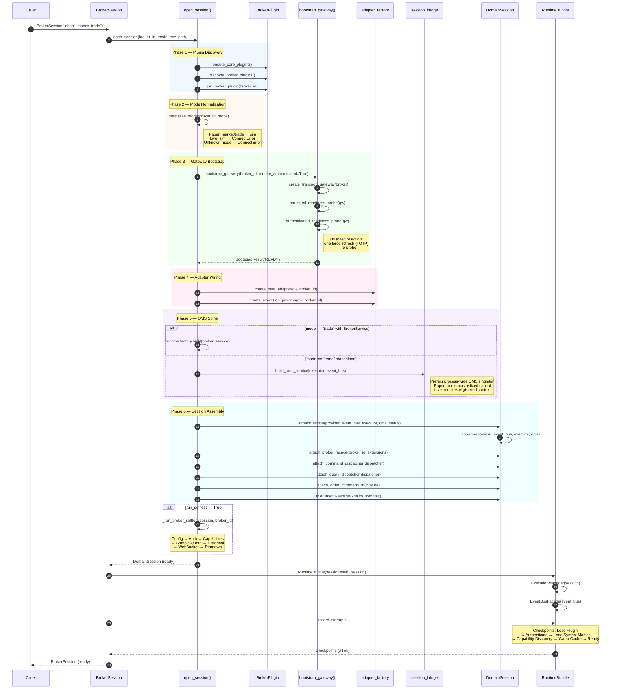
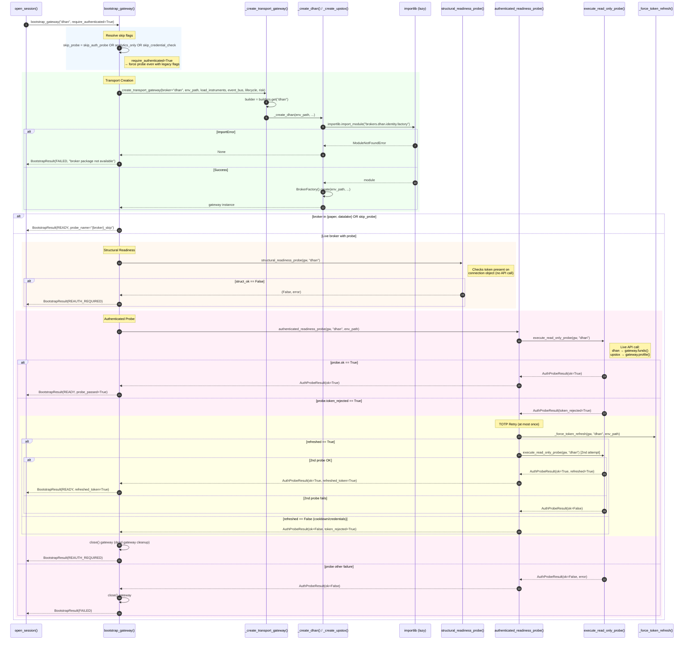
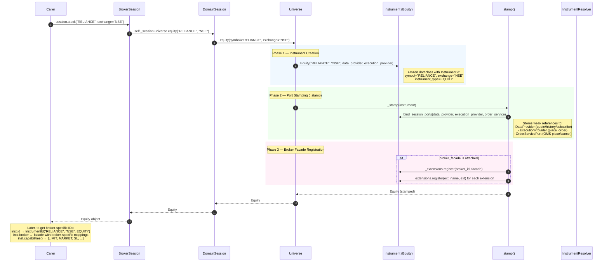
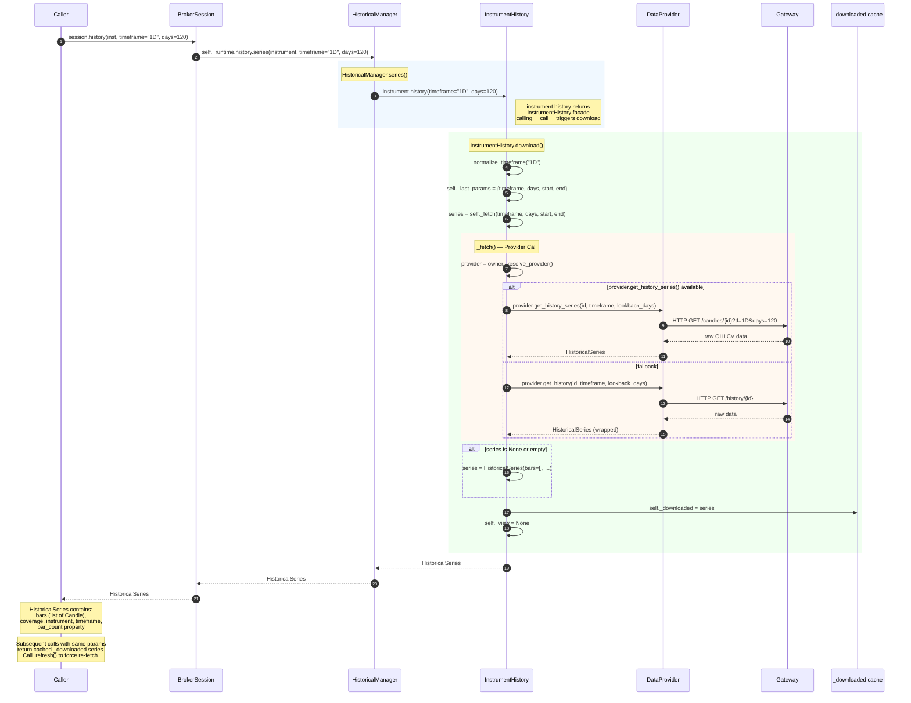
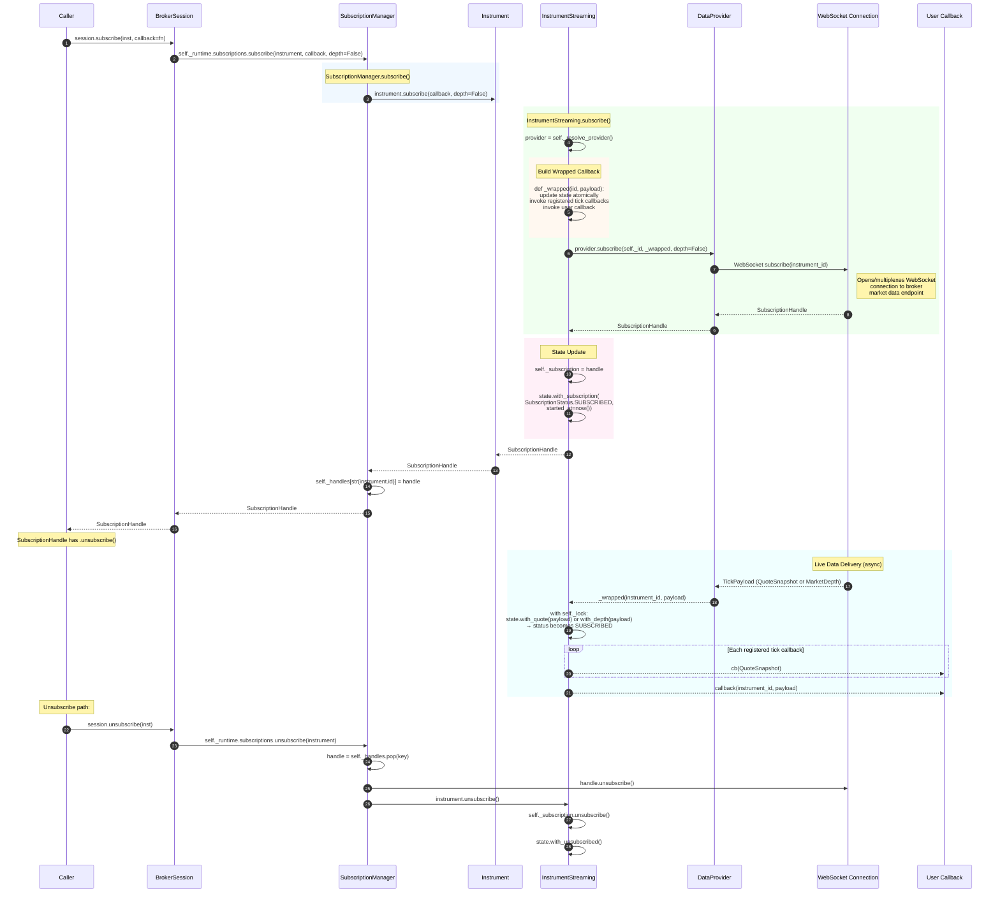
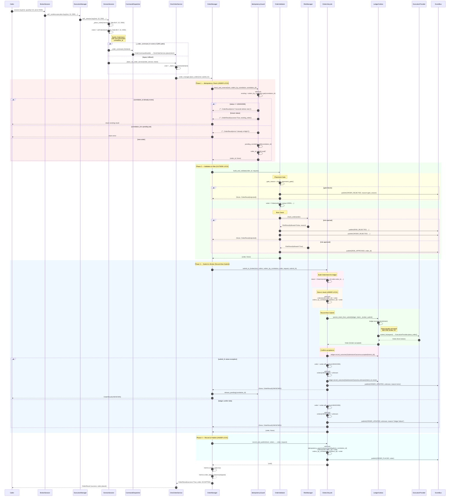
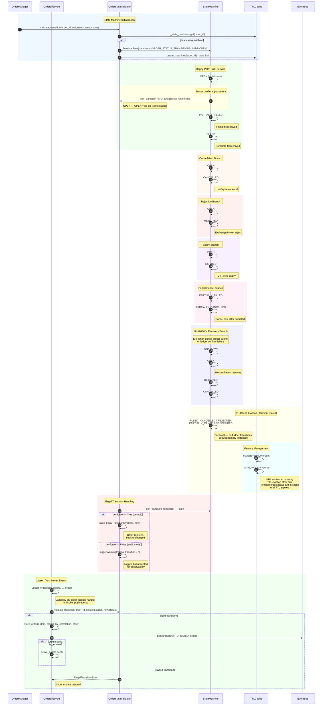

# Runtime Flow Diagrams — Part 1

> Sequence diagrams derived from actual source code in `src/`. Each diagram
> uses autonumbering and shows the real call chain with error branches.

---

## 1. System Startup Flow

The full initialization chain from `BrokerSession(broker)` through
`open_session()` to a ready-to-trade `DomainSession`.



---

## 2. Broker Connection Flow

Detailed gateway bootstrap from `bootstrap_gateway()` through transport creation,
structural check, auth probe, and TOTP retry.



---

## 3. Instrument Resolution Flow

How `BrokerSession.stock("RELIANCE")` resolves a canonical symbol to a
fully-stamped domain `Instrument` with data, execution, and OMS ports.



---

## 4. Quote Flow

How `BrokerSession.quote(instrument)` pulls a live quote through the
`QuoteManager` → `Instrument.refresh()` → `DataProvider.get_quote()` path.

```mermaid
sequenceDiagram
    autonumber
    participant Caller
    participant BS as BrokerSession
    participant QM as QuoteManager
    participant Inst as Instrument
    participant MDP as InstrumentMarketData
    participant Provider as DataProvider
    participant Gateway as Gateway (Dhan/Upstox)

    Caller->>BS: session.quote(inst)
    BS->>QM: self._runtime.quotes.quote(instrument)

    rect rgb(240, 248, 255)
        Note over QM: QuoteManager.quote()
        QM->>Inst: instrument.refresh()
    end

    rect rgb(240, 255, 240)
        Note over Inst: InstrumentMarketData.refresh()
        Inst->>MDP: self.refresh() [mixin method]
        MDP->>MDP: provider = self._resolve_provider()
        Note right of MDP: Resolves DataProvider via<br/>weak reference to session provider
        MDP->>Provider: provider.get_quote(self._id)
        Provider->>Gateway: HTTP GET /quote/{instrument_id}
        Gateway-->>Provider: raw quote response
        Provider-->>MDP: QuoteSnapshot
    end

    rect rgb(255, 248, 240)
        Note over MDP: State Update (thread-safe)
        MDP->>MDP: with self._lock:<br/>self._state = self._state.with_quote(quote)
        Note right of MDP: InstrumentState is immutable;<br/>new copy with updated quote
    end

    MDP-->>Inst: QuoteSnapshot
    Inst-->>QM: QuoteSnapshot
    QM-->>BS: QuoteSnapshot
    BS-->>Caller: QuoteSnapshot

    Note over Caller: QuoteSnapshot contains:<br/>ltp, bid, ask, high, low, open,<br/>close, volume, oi, timestamp
```

---

## 5. History Flow

How `BrokerSession.history(instrument)` retrieves historical OHLCV data
through the `HistoricalManager` → `InstrumentHistory` → `DataProvider` path.



---

## 6. Subscription Flow

The async subscription lifecycle from `BrokerSession.subscribe()` through
WebSocket connection to live tick delivery via callback.



---

## 7. Order Placement Flow (The Critical Path)

The full OMS order lifecycle from `BrokerSession.buy()` through risk checks,
idempotency guard, record-then-submit, ledger outbox, to event publication.
This is the most critical flow in the system.



---

## 8. Order Lifecycle State Machine

The canonical order state transitions enforced by `OrderStateValidator`
using `ORDER_STATUS_TRANSITIONS` from `domain/entities/order_lifecycle.py`.
Terminal states are evicted from the `TTLCache` (maxsize=10000, ttl=24h).



### Transition Table Reference

| Source State | Allowed Targets |
|---|---|
| `OPEN` | PARTIALLY_FILLED, FILLED, CANCELLED, PARTIALLY_CANCELLED, REJECTED, EXPIRED |
| `PARTIALLY_FILLED` | FILLED, CANCELLED, PARTIALLY_CANCELLED, REJECTED |
| `FILLED` | *(terminal)* |
| `CANCELLED` | *(terminal)* |
| `PARTIALLY_CANCELLED` | *(terminal)* |
| `REJECTED` | *(terminal)* |
| `EXPIRED` | *(terminal)* |
| `UNKNOWN` | OPEN, REJECTED, CANCELLED *(reconciliation only)* |
