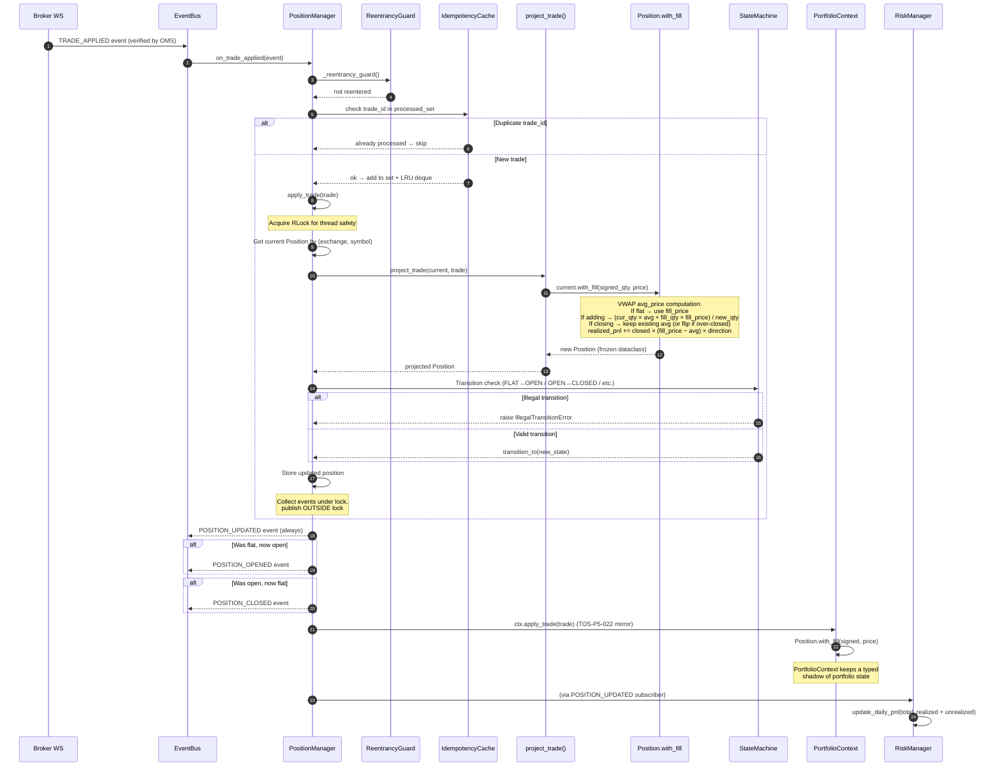
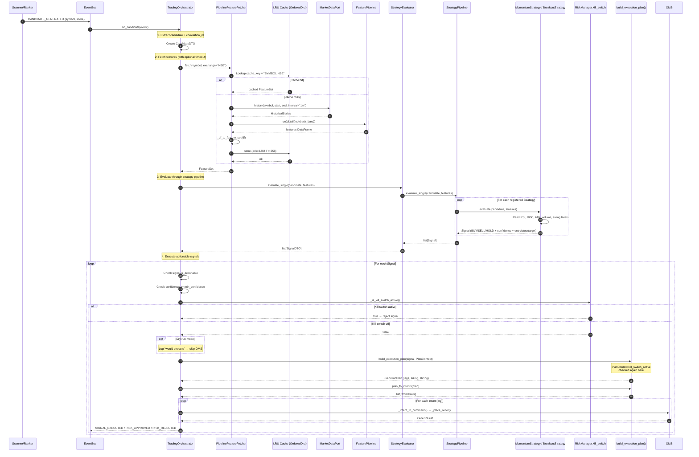
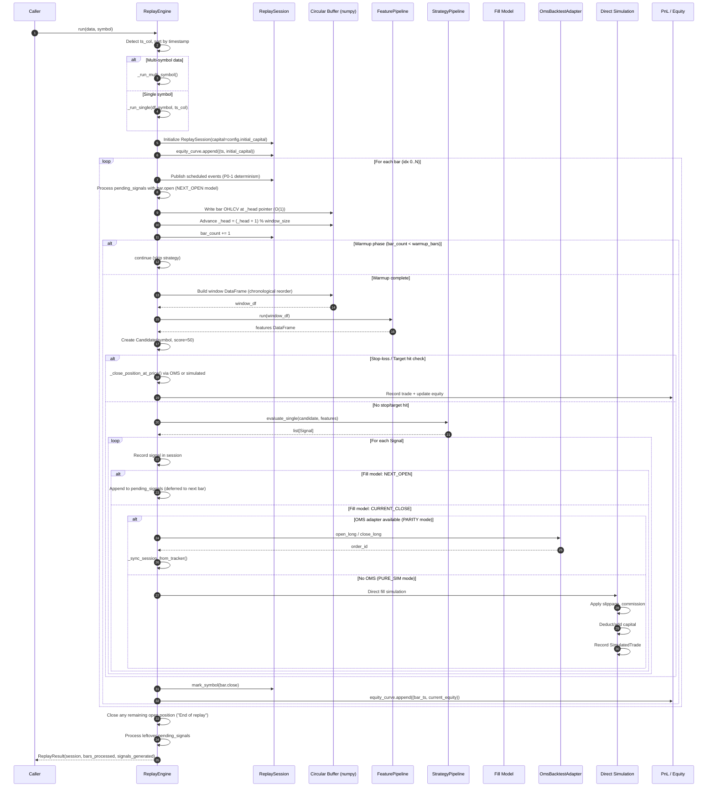
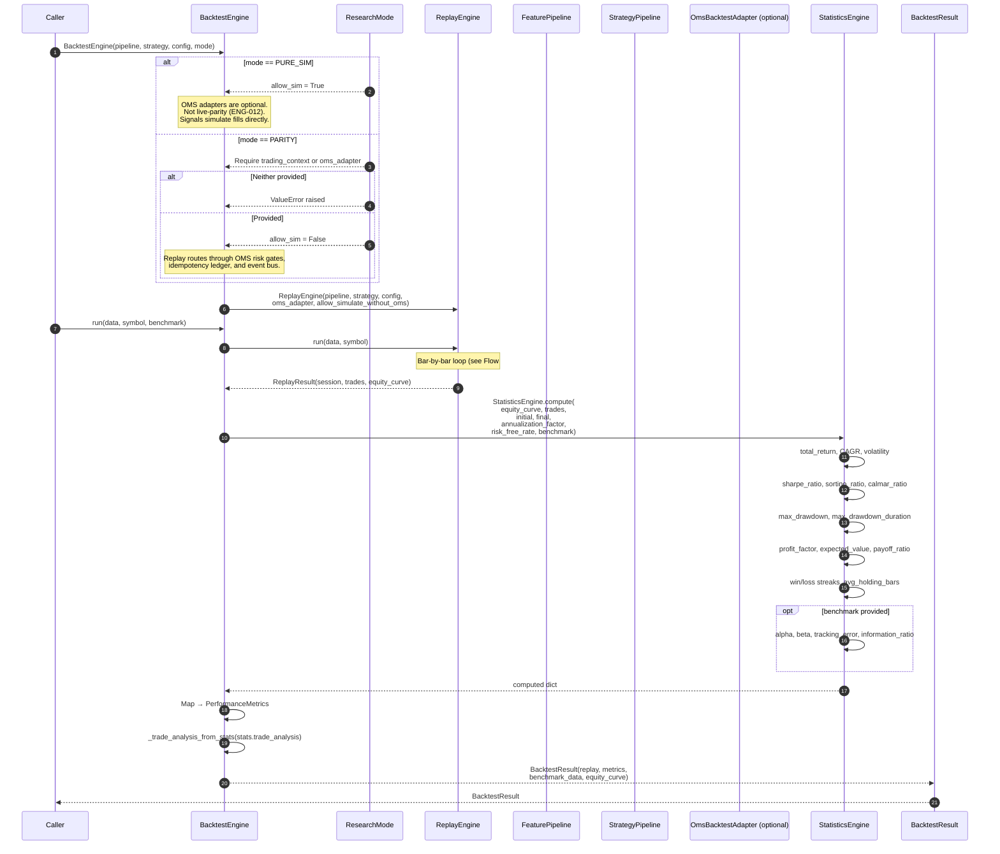
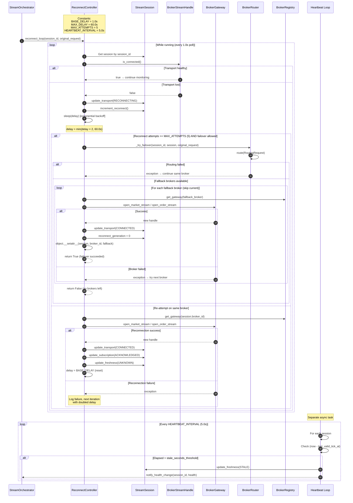
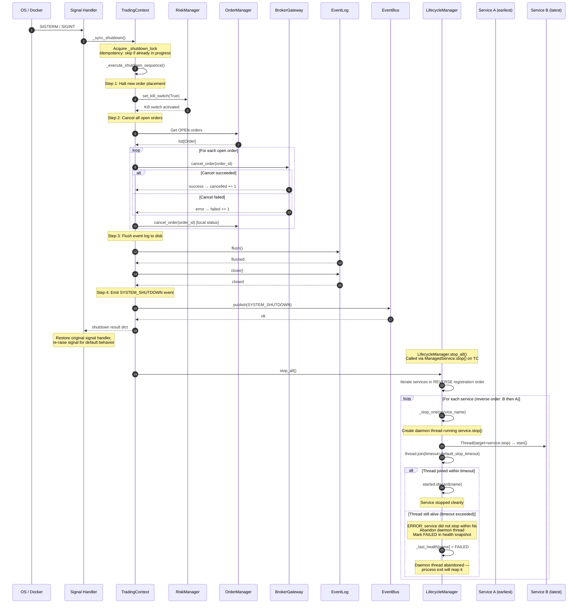
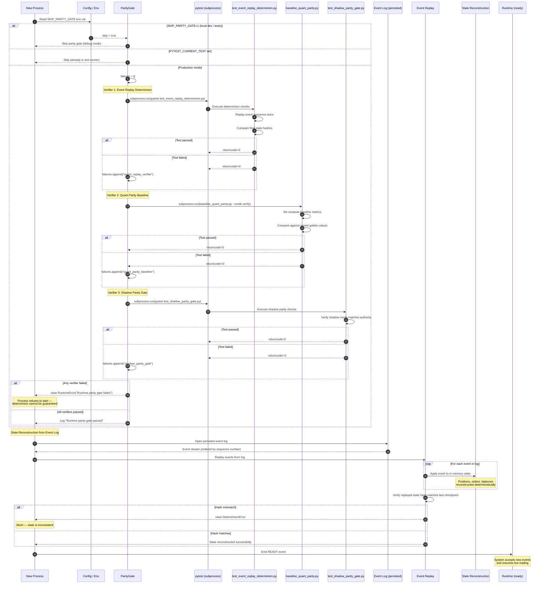

# Runtime Flow Diagrams — Part 2

> Sequences 9–15 covering position updates, strategy pipeline, replay/backtest,
> WebSocket reconnection, graceful shutdown, and recovery.

---

## 9. Position Update Flow

Traces the full path from a broker FILL event through the EventBus to the
`PositionManager`, the VWAP average-price computation inside `Position.with_fill`,
and the downstream `PortfolioContext` mirror.

---

## 10. Strategy Pipeline Flow

Traces from candidate generation through feature fetching (LRU-cached),
strategy evaluation, kill-switch gating, and intent building. Kill-switch
checks appear at both the `StrategyPipeline` level (via `PlanContext`) and
the `TradingOrchestrator` execution gate.

---

## 11. Replay Flow

Traces the bar-by-bar loop in `ReplayEngine`, including warmup gating, the
circular-buffer window, feature computation, strategy evaluation, and the
two fill paths: OMS-integrated (`_process_signal_via_oms`) vs simulated
(`_process_signal_simulated`). Shows the NEXT_OPEN fill model delay.

---

## 12. Backtest Flow

Traces `BacktestEngine` orchestration wrapping `ReplayEngine` with rich
performance analytics via `StatisticsEngine`. Shows the `ResearchMode`
distinction (`PURE_SIM` vs `PARITY`) and how it configures the underlying
replay engine.

---

## 13. WebSocket Reconnection Flow

Traces the `ReconnectController` reconnect loop from transport-loss detection
through exponential backoff, reconnection attempts, and cross-broker failover.
Shows backoff parameters and the heartbeat staleness monitor.

---

## 14. Graceful Shutdown Flow

Traces the full shutdown sequence from OS signal receipt through
`TradingContext._execute_shutdown_sequence`, then `LifecycleManager.stop_all()`
with its reverse-order, timeout-enforced daemon-thread pattern.

---

## 15. Recovery Flow

Traces the process-restart recovery path: `ParityGate` verification of
determinism guarantees, state reconstruction from the persisted event log,
and event replay to reach a consistent ready state.

