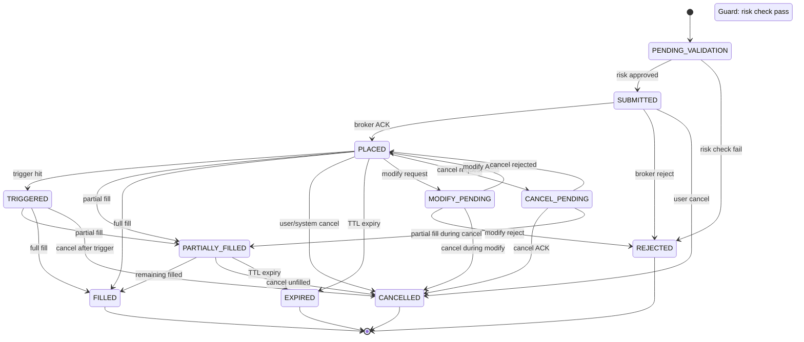
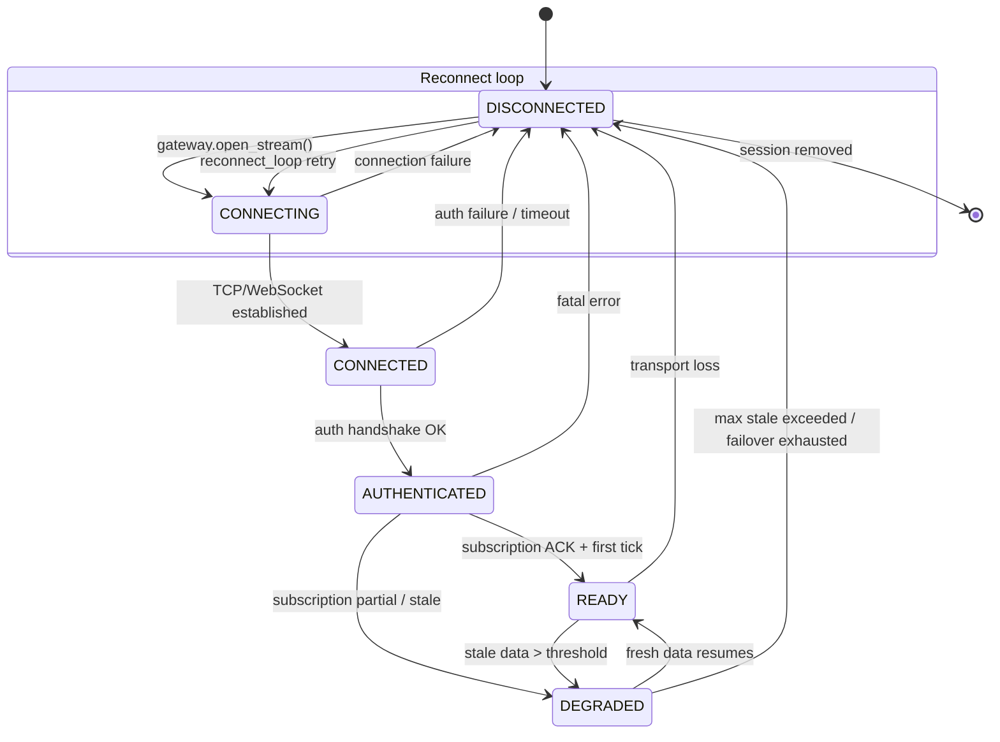
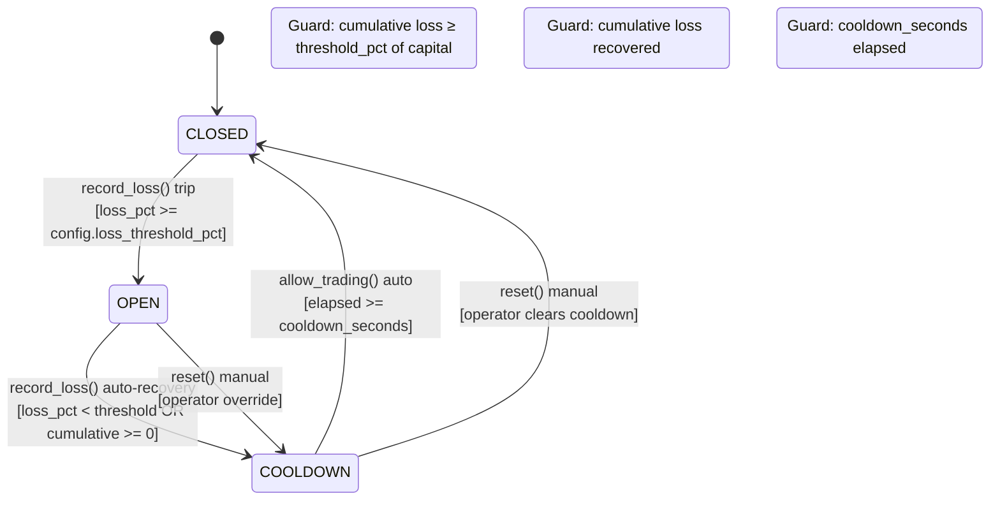
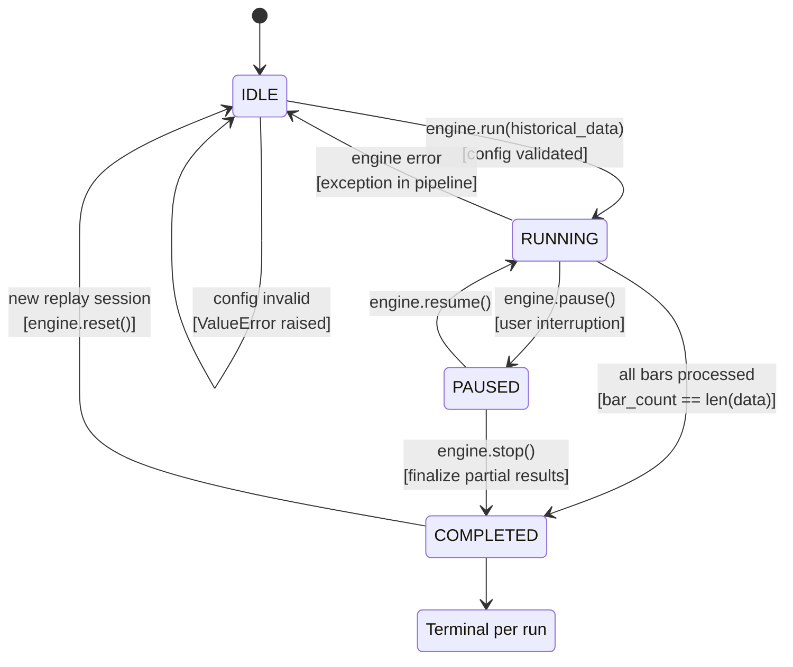
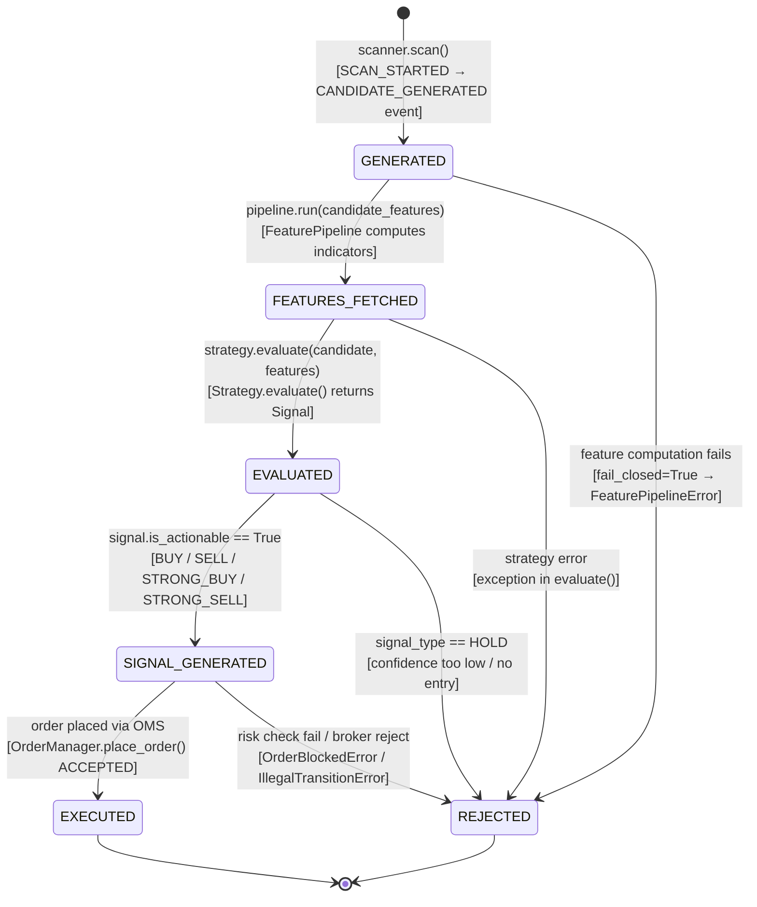

# D2.2 — State Machines

Formal state machine definitions for the six core FSMs in TradeXV2.

All state machines are built on the generic `StateMachine[T]` base class
(`src/domain/state_machine.py`), which enforces transitions via an
explicit transition table and raises `IllegalTransitionError` on invalid
transitions. Terminal states map to empty `frozenset`.

---

## 1. Order State Machine

**Source:** `src/application/oms/_internal/order_state_validator.py`
**Transition table:** `domain.types.ORDER_STATUS_TRANSITIONS`
**Thread safety:** `OrderStateValidator` wraps per-order `StateMachine` instances
in a `TTLCache` (max 10 000, 24 h TTL). External `RLock` provided by `OrderManager`.



**Entry/Exit Actions:**
| Action | Trigger | Implementation |
|--------|---------|---------------|
| Audit log | Every transition | `OrderAuditLogger` records old→new with timestamp |
| Idempotency release | Terminal state | `IdempotencyGuard.release_pending()` frees correlation slot |
| Risk pending release | Terminal state | `RiskManager.release_pending(correlation_id)` |
| Metrics increment | Place | `oms_orders_total` counter incremented |
| Metrics latency | Place | `oms_order_placement_latency_seconds` histogram observed |

---

## 2. Session State Machine (Connection Lifecycle)

**Source:** `src/domain/session_status.py` — `SessionStatus` dataclass (snapshot)
**State transitions driven by:** `src/application/streaming/reconnect_controller.py`,
`StreamOrchestrator`, and broker gateway callbacks.
**States derived from:** `TransportState`, `SubscriptionState`, `FreshnessState`
composites in `domain.stream_health`.



**Entry/Exit Actions:**
| Action | Trigger | Implementation |
|--------|---------|---------------|
| Log state change | Every transition | `log_state_change(session_id, old, new, reason)` |
| Health notification | DEGRADED↔READY | `notify_health_change(session_id, health)` |
| Reconnect counter | CONNECTING entry | `session.increment_reconnect()` |
| Broker failover | reconnect ≥ 5 AND allow_failover | `Router.route()` picks fallback broker |
| Freshness reset | Reconnect OK | `session.update_freshness(FreshnessState.UNKNOWN)` |

---

## 3. Loss Circuit Breaker

**Source:** `src/application/oms/_internal/loss_circuit_breaker.py`
**Thread safety:** `threading.RLock` on all public methods.



**Entry/Exit Actions:**
| Action | Trigger | Implementation |
|--------|---------|---------------|
| Record opened_at | OPEN entry | `_opened_at = time.time()` |
| Increment trip count | OPEN entry | `_trip_count += 1` |
| Record cooldown start | COOLDOWN entry | `_cooldown_started_at = time.time()` |
| Purge old samples | Every `record_loss()` | `_purge_old_samples()` removes entries older than rolling window |
| Snapshot | `snapshot()` call | Returns serializable state dict for `/healthz` |

**Constants:** `RISK_LOSS_CB_COOLDOWN_SECONDS` (default 1800 = 30 min),
`RISK_LOSS_CB_WINDOW_SECONDS` (rolling window),
`RISK_LOSS_CIRCUIT_BREAKER_PERCENT` (trip threshold %).

---

## 4. WebSocket Reconnection (TransportState)

**Source:** `src/application/streaming/reconnect_controller.py`
**TransportState enum:** `src/domain/stream_health.py`

```mermaid
stateDiagram-v2
    [*] --> CONNECTED: stream opened

    CONNECTED --> RECONNECTING: handle.is_connected() == False<br/>[transport_loss]

    state "Exponential backoff 1s → 60s" as backoff {
        RECONNECTING --> RECONNECTING: attempt fail<br/>[delay = min(delay*2, 60s)]
    }

    RECONNECTING --> CONNECTED: reconnect OK<br/>[gw.open_stream() success]
    RECONNECTING --> RECONNECTING: reconnect fail<br/>[attempts < 5]

    state "Failover decision" as failover {
        RECONNECTING --> RECONNECTING: failover to fallback broker<br/>[reconnect_gen >= 5 AND allow_failover]
    }

    state "FAILED (terminal for this session)" as FAILED
    RECONNECTING --> FAILED: all fallback brokers exhausted
```

**Entry/Exit Actions:**
| Action | Trigger | Implementation |
|--------|---------|---------------|
| Log reconnect | Every state change | `_log_state_change(session_id, old, new, reason)` |
| Reset backoff | Reconnect OK | `delay = _RECONNECT_BASE_DELAY_S` (1.0 s) |
| Update handle | Reconnect OK | `self._handles[session_id] = handle` under `_lock` |
| Update broker_id | Failover OK | `object.__setattr__(session, "broker_id", fallback_broker)` |
| Subscription ACK | Reconnect OK | `session.update_subscription(SubscriptionState.ACKNOWLEDGED)` |
| Staleness detect | Heartbeat loop | `_check_freshness()` every 5 s, sets `FreshnessState.STALE` |

**Constants:** `_HEARTBEAT_INTERVAL_S=5.0`, `_RECONNECT_BASE_DELAY_S=1.0`,
`_RECONNECT_MAX_DELAY_S=60.0`, `_MAX_RECONNECT_ATTEMPTS=5`.

---

## 5. Replay Session

**Source:** `src/analytics/replay/models.py` — `ReplaySession`
**States derived from:** `ReplayEngine.run()` lifecycle in `src/analytics/replay/engine.py`.
The `ReplaySession` dataclass tracks state implicitly through `bar_count`,
`signals`, `trades`, and `equity_curve`. The formal FSM below documents the
engine-level state transitions.



**Entry/Exit Actions:**
| Action | Trigger | Implementation |
|--------|---------|---------------|
| Set initial capital | RUNNING entry | `session.capital = config.initial_capital` |
| Record equity point | Every bar | `session.equity_curve.append((ts, current_equity))` |
| Warmup skip | RUNNING (bar < warmup_bars) | Skip signal generation, only update MTM |
| Track bar count | Every bar | `session.bar_count += 1` |
| Compute final stats | COMPLETED | `ReplayResult` built from `ReplaySession` |

---

## 6. Strategy Candidate Lifecycle

**Source:** `src/analytics/scanner/models.py` — `Candidate`, `ScannerState`
`src/analytics/strategy/pipeline.py` — `StrategyPipeline.evaluate()`
`src/analytics/strategy/models.py` — `Signal`, `StrategyResult`

The candidate lifecycle tracks a stock through the scan→signal→execution pipeline.
States are implicit in the event flow (`CANDIDATE_GENERATED` → `SIGNAL_GENERATED` →
`ORDER_PLACED`).



**Entry/Exit Actions:**
| Action | Trigger | Implementation |
|--------|---------|---------------|
| Emit CANDIDATE_GENERATED | GENERATED entry | `event_bus.publish(EventType.CANDIDATE_GENERATED, ...)` |
| Emit SIGNAL_GENERATED | SIGNAL_GENERATED entry | `event_bus.publish(EventType.SIGNAL_GENERATED, ...)` |
| Record reasons | Every transition | `Candidate.reasons` / `Signal.reasons` accumulate explanations |
| Score capture | FEATURES_FETCHED | `Candidate.score` frozen at scan time |
| Confidence guard | EVALUATED → SIGNAL_GENERATED | `signal.confidence >= min_confidence_threshold` |

---

## Generic State Machine Base

**Source:** `src/domain/state_machine.py`

```python
class StateMachine(Generic[T]):
    """NOT thread-safe. Callers must provide external synchronization."""
    _transitions: dict[T, frozenset[T]]
    _state: T

    def can_transition_to(new_state) -> bool  # check without mutation
    def transition_to(new_state) -> None      # raises IllegalTransitionError
    def reset(new_state) -> None              # bypasses validation
```

**Usage pattern:** Every state machine in the codebase is backed by a `StateMachine[T]`
instance stored in a `dict` keyed by entity ID. External locks (typically `threading.RLock`
in the owning manager) protect concurrent access.
