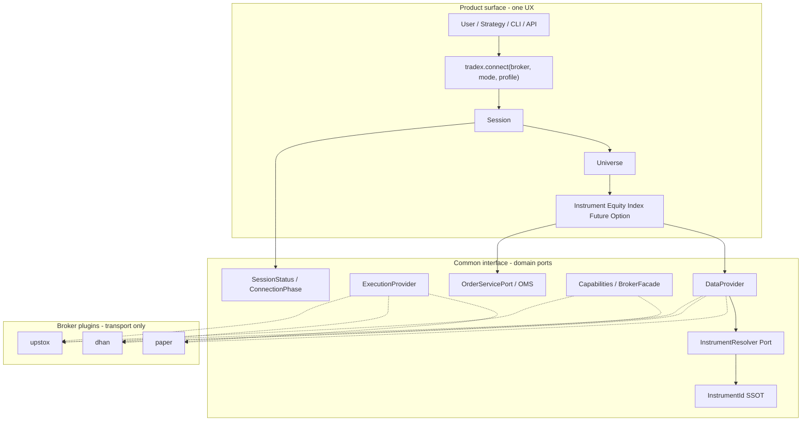
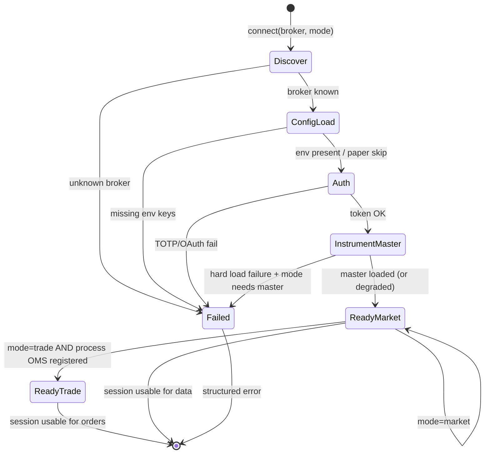
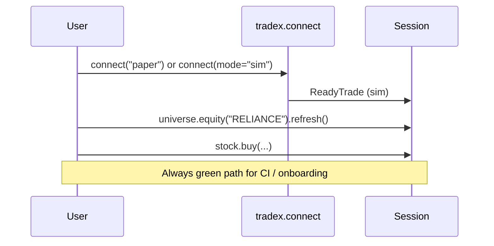
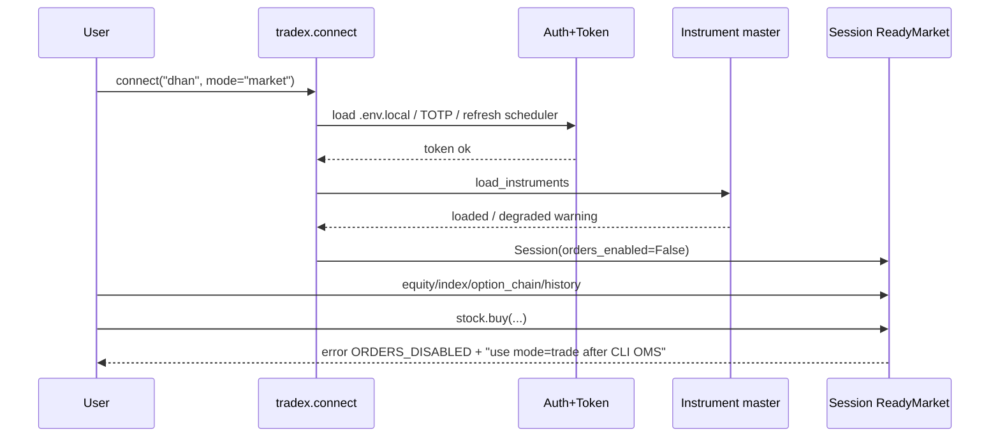
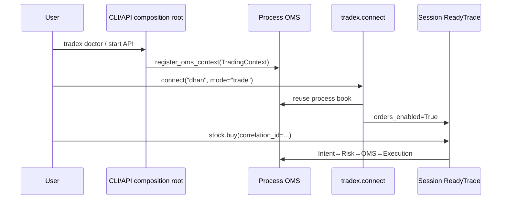
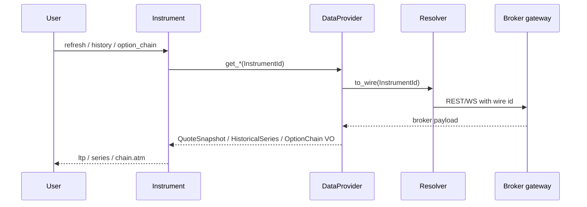

# Broker UX Standardization Design

| Field | Value |
|-------|--------|
| **Title** | Broker flows, common interface, instrument naming — design first |
| **Date** | 2026-07-09 |
| **Status** | Draft (design only — no implementation in this doc) |
| **Audience** | SDK / CLI / API product + broker adapter owners |
| **Related** | `docs/OBJECT_MODEL.md`, `reports/OBJECT_MODEL_COMPLETION_DESIGN.md`, `reports/SAFE_TO_TRADE_GATE.md`, ADR-003, **TradeHull DX ref:** [`TRADEHULL_DX_REFERENCE_DESIGN.md`](./TRADEHULL_DX_REFERENCE_DESIGN.md) |

---

## 1. Problem (current UX pain)

| Pain | Today |
|------|--------|
| **Uneven connect** | `tradex.connect("paper")` returns a full Session; `tradex.connect("dhan")` fails after auth with ENG-001 OMS message |
| **Two mental models** | Product API (`Session` / `Instrument`) vs transport (`BrokerFactory` / gateway) mixed in docs and ops |
| **Naming leakage** | Canonical `NSE:RELIANCE` vs Dhan `security_id` / segments vs Upstox `NSE_EQ\|…` instrument keys — users and logs mix them |
| **Hard to trace** | Success/fail surfaces differ (exception strings, readiness, doctor); no single connection state machine |
| **Hard to test E2E** | Paper e2e easy; live needs credentials + process OMS; no shared scenario table per broker |

**Goal:** One **standardized flow** at the **common interface**, with **broker-specific plugs** that only differ where exchanges/auth force it — easy to use, easy to trace, easy to test end-to-end.

---

## 2. UX principles (developer experience)

1. **One happy path** — `tradex.connect(broker, mode=…)` works the same shape for paper / dhan / upstox.  
2. **Progressive disclosure** — market data first; trading only when readiness is green.  
3. **Fail loud, fail early** — missing env, bad token, missing OMS for live trades: structured errors, not silent empty.  
4. **Never invent capital** — live trading never gets phantom capital (ENG-001).  
5. **Canonical names at the edge** — users only see `InstrumentId` / display names; broker wire IDs stay inside adapters.  
6. **Trace by default** — every connect and order has a correlation / session id.  
7. **Test the contract, not the brand** — same scenario suite; brokers plug fakes or live gates.

---

## 3. Target architecture (common + per-broker)



| Layer | Owns | User-visible? |
|-------|------|----------------|
| **Product** | `connect`, Session, Instrument verbs | Yes |
| **Common ports** | DataProvider, ExecutionProvider, OMS, InstrumentId, SessionStatus | Types only |
| **Broker plugin** | Auth, wire symbols, HTTP/WS, env file | No (except doctor/diagnostics) |

---

## 4. Connection modes (standardize “what connect means”)

Today paper ≈ full stack; dhan dies at live OMS. **Split intent into modes:**

| Mode | Intent | Auth | Data | Orders | OMS |
|------|--------|------|------|--------|-----|
| **`sim`** | Learn / unit / CI | None | Paper | Paper | In-memory OK |
| **`market`** | Research / quotes / chains | Required for live brokers | Live | **Disabled** | Not required |
| **`trade`** | Live trading | Required | Live | Live | **Process OMS required** |
| **`readonly_lake`** | Historical only | Optional | Datalake | N/A | N/A |

### API shape (target)

```python
session = tradex.connect("dhan", mode="market")   # auth + data; buy() raises clear error
session = tradex.connect("dhan", mode="trade")    # requires process OMS or fails with next-step
session = tradex.connect("paper", mode="sim")     # default paper
session = tradex.connect("upstox", mode="market", env_path=".env.upstox")
```

### Mode × broker matrix

| Broker | sim | market | trade |
|--------|-----|--------|-------|
| paper | ✅ default | N/A (alias sim) | N/A |
| dhan | ❌ | ✅ `.env.local` + token mgr | ✅ only with process OMS |
| upstox | ❌ | ✅ `.env.upstox` | ✅ only with process OMS |
| datalake | ❌ | readonly history | ❌ |

**UX rule:** `connect` always returns a Session **or** a structured `ConnectError` with:

- `phase` (see state machine)
- `broker_id`
- `mode`
- `code` (e.g. `MISSING_ENV`, `AUTH_FAILED`, `OMS_REQUIRED`, `INSTRUMENTS_FAILED`)
- `remediation` (human string + optional CLI command)

Never a raw multi-line ENG-001 dump without next step.

---

## 5. Connection state machine (common)



### SessionStatus (common surface)

Expose on Session (product):

```python
session.status.phase          # Discover|ConfigLoad|Auth|InstrumentMaster|ReadyMarket|ReadyTrade|Failed
session.status.broker_id
session.status.mode
session.status.authenticated  # bool
session.status.instruments_loaded
session.status.orders_enabled   # True only in ReadyTrade
session.status.trace_id         # connect correlation id
session.status.diagnostics      # list[{check, ok, detail}]
session.describe()              # stable dict for CLI/API/logs
```

**Trace flow:** every `connect` allocates `trace_id`; attach to logs during auth, instrument load, first quote.

---

## 6. Common interface design

### 6.1 Ports (keep / clarify)

| Port | Responsibility | Must not |
|------|----------------|----------|
| **DataProvider** | quote, history, depth, option_chain, future_chain, subscribe | Know OMS |
| **ExecutionProvider** | place/modify/cancel transport | Skip risk |
| **OrderServicePort** | Intent → Risk → OMS → Execution | Import brokers |
| **InstrumentResolver** *(formalize)* | `InstrumentId` ↔ broker wire key | Leak into domain entities |
| **Capabilities** | depth20/30, super orders, etc. | `if broker ==` |

### 6.2 BrokerPlugin contract (common)

Each broker package implements a small **plugin facade** (registration already partial via `adapter_factory`):

```python
class BrokerPlugin(Protocol):
    broker_id: str                    # "dhan" | "upstox" | "paper"
    env_file: str | None              # ".env.local" | ".env.upstox" | None
    supported_modes: set[Mode]        # {sim} | {market, trade} | ...

    def load_settings(env_path) -> BrokerSettings: ...
    def authenticate(settings, lifecycle) -> AuthHandle: ...  # token schedule internal
    def create_gateway(auth, settings, lifecycle) -> Gateway: ...
    def create_data_provider(gateway) -> DataProvider: ...
    def create_execution_provider(gateway) -> ExecutionProvider: ...
    def create_resolver(gateway) -> InstrumentResolver: ...
    def capabilities() -> BrokerCapabilities: ...
    def doctor_checks(gateway) -> list[DoctorCheck]: ...
```

`tradex.connect` becomes:

1. Resolve plugin by `broker_id`  
2. Run state machine phases via plugin hooks  
3. Wrap into Session + status  

No `if broker == "dhan"` in product code beyond plugin registry lookup.

### 6.3 Individual broker designs

#### Paper (`sim`)

| Concern | Design |
|---------|--------|
| Auth | No-op; phase Auth = skipped |
| Instruments | Synthetic / empty master; any `InstrumentId` accepted with fake LTP |
| Naming | Accepts canonical ids only |
| Orders | In-memory OMS always |
| Trace | `trace_id` still issued for parity with live |
| E2E | Default CI broker |

#### Dhan (`market` / `trade`)

| Concern | Design |
|---------|--------|
| Env | `.env.local` — `DHAN_CLIENT_ID`, `DHAN_ACCESS_TOKEN` and/or TOTP (`DHAN_PIN`, `DHAN_TOTP_SECRET`) |
| Auth | Internal `AuthManager` + `TokenRefreshScheduler` + 401 refresh; update token file/state |
| Instruments | CSV/master load → `SymbolResolver` (`security_id`) |
| Wire naming | `security_id` + Dhan segment; **never** user-facing |
| Resolver | `InstrumentId` → DhanInstrument via exchange+symbol; index fallbacks |
| Market | REST quote/depth/history; WS for subscribe |
| Options/Futures | Gateway `option_chain` / `future_chain` → domain VO → OptionChain |
| Trade mode | Requires `register_oms_context`; capital from broker funds API |
| Doctor | env present, token valid, instrument load %, sample LTP |
| Degraded | High skip rate in resolver → status warning, not hard fail unless `strict=True` |

#### Upstox (`market` / `trade`)

| Concern | Design |
|---------|--------|
| Env | `.env.upstox` — OAuth/TOTP fields as today |
| Auth | Token + TOTP scheduler as implemented |
| Instruments | Upstox instrument master / `instrument_key` |
| Wire naming | `NSE_EQ|…`, `NSE_FO|…` hidden in `instrument_adapter` |
| Resolver | Canonical ↔ `instrument_key` / segment map |
| Market | REST + multiplexed WS |
| Options | Chain + optional greeks stream as capability |
| Trade mode | Same process OMS requirement as Dhan |
| Doctor | env, token, sandbox vs live flag, sample quote |

---

## 7. Instrument naming standard

### 7.1 Single source of truth (already partially done)

**Canonical form** (`InstrumentId.__str__`):

```text
{EXCHANGE}:{UNDERLYING}
{EXCHANGE}:{UNDERLYING}:{YYYYMMDD}:FUT
{EXCHANGE}:{UNDERLYING}:{YYYYMMDD}:{STRIKE}:{CE|PE}
```

Examples:

| Kind | Canonical string |
|------|------------------|
| Equity | `NSE:RELIANCE` |
| Index | `NSE:NIFTY` |
| Future | `NFO:NIFTY:20260730:FUT` |
| Option | `NFO:NIFTY:20260730:25000:CE` |
| Commodity fut | `MCX:GOLD:20260805:FUT` |

**Rules:**

1. Exchange set: core `NSE | BSE | NFO | MCX` (+ registered extras later).  
2. Symbol: uppercase, broker suffixes stripped at adapter boundary (`RELIANCE-EQ` → `RELIANCE`).  
3. Expiry: **ISO calendar date**, serialized **YYYYMMDD** only.  
4. Strike: `Decimal` normalized via `str` (no float).  
5. Right: only `CE | PE | FUT` (or empty for cash).  
6. **Display name** (UI): human string separate from id, e.g. `NIFTY 30 Jul 2026 25000 CE`.  
7. **Wire id** (broker): only inside adapter / resolver; logs may show `wire_id` as secondary field.

### 7.2 Naming layers

```text
User input     →  "reliance" / "NIFTY 25000 CE" (fuzzy, optional later)
Canonical id   →  InstrumentId  (always)
Display name   →  for UI/CLI tables
Wire identity  →  security_id / instrument_key  (adapter private)
```

### 7.3 Standardize user factories

| User intent | Factory | Notes |
|-------------|---------|--------|
| Stock | `universe.equity(symbol, exchange="NSE")` | Not `Equity("NIFTY")` for indices |
| Index | `universe.index(name, exchange="NSE")` | NIFTY, BANKNIFTY, … |
| Future | `universe.future(und, expiry=, exchange="NFO")` | |
| Option | `universe.option(und, strike, right, expiry=, exchange="NFO")` | |
| From string | `InstrumentId.parse("NFO:NIFTY:…")` then `universe.get(id)` | Strict parse |

**UX anti-patterns to ban in docs/tests:**

- Using equity factory for NIFTY index  
- Passing Dhan security_id into domain  
- Mixing `NSE_EQ` segment strings in product code  

### 7.4 Broker mapping table (documentation + doctor)

| Canonical | Dhan wire | Upstox wire |
|-----------|-----------|-------------|
| `NSE:RELIANCE` | security_id via resolver (NSE_EQ) | `NSE_EQ\|INE…` or symbol key |
| `NSE:NIFTY` | index map / IDX | index instrument_key |
| `NFO:NIFTY:…:FUT` | FUTIDX + expiry | `NSE_FO\|…` |
| `NFO:NIFTY:…:CE` | OPTIDX + strike | `NSE_FO\|…CE` |

Doctor command should print both sides for one sample symbol (canonical + wire) for debugging.

---

## 8. Standardized user flows

### Flow A — First run (paper)



### Flow B — Live market data (Dhan / Upstox)



### Flow C — Live trade



### Flow D — Instrument detail (common for all kinds)



---

## 9. Observability & traceability

| Event | Fields |
|-------|--------|
| `connect.start` | trace_id, broker, mode |
| `connect.auth_ok` | trace_id, auth_method (token\|totp\|oauth) |
| `connect.instruments` | trace_id, count, skip_rate, degraded |
| `connect.ready` | trace_id, phase, orders_enabled |
| `connect.failed` | trace_id, phase, code, remediation |
| `quote` / `order` | trace_id, instrument_id (canonical), correlation_id |

CLI:

```bash
tradex doctor dhan          # phases + sample quote
tradex session status       # session.describe()
tradex instruments resolve NSE:RELIANCE --broker dhan  # canonical ↔ wire
```

---

## 10. End-to-end test design

### 10.1 Contract levels

| Level | Where | Brokers |
|-------|--------|---------|
| **L0 Unit** | Fakes DataProvider / OMS | all |
| **L1 Plugin contract** | Fake HTTP / recorded fixtures | dhan, upstox |
| **L2 Paper E2E** | `connect("paper")` full object model | paper |
| **L3 Live market** | `mode=market`, credentials gate | dhan, upstox |
| **L4 Live trade** | sandbox + process OMS + kill-switch | gated |

### 10.2 Shared scenario table (same names for every broker)

| Scenario id | Steps | Assert |
|-------------|--------|--------|
| `S-CONNECT-OK` | connect(mode=market\|sim) | status.phase Ready* |
| `S-EQUITY-QUOTE` | equity.refresh | ltp > 0 (live) or not None (paper) |
| `S-INDEX-CHAIN` | index.option_chain | strikes non-empty (live hours) |
| `S-FUTURE-ID` | future factory + refresh | id ends with FUT |
| `S-OPTION-ID` | option factory | id has CE/PE |
| `S-HISTORY` | history(days=5) | series type; bar_count ≥ 0 |
| `S-NAME-ROUNDTRIP` | parse str(InstrumentId) | equality |
| `S-RESOLVE-WIRE` | doctor resolve | wire_id non-empty |
| `S-ORDER-SIM` | paper buy | OMS audit entry |
| `S-ORDER-LIVE-BLOCKED` | market mode buy | ORDERS_DISABLED |
| `S-ORDER-LIVE-OMS` | trade mode + OMS buy | risk+idempotency |

Implement as **parametrized pytest** over `broker_id` + `mode` with markers:

- `@pytest.mark.paper`
- `@pytest.mark.live_market` (needs env)
- `@pytest.mark.live_trade` (sandbox + explicit flag)

### 10.3 Trace assertions

Every L2+ test captures `session.status.trace_id` and asserts logs/metrics contain it for connect → first quote (optional log capture fixture).

---

## 11. UX copy standards (errors)

| Code | User-facing message pattern |
|------|-----------------------------|
| `MISSING_ENV` | `Dhan needs {path}. Required keys: CLIENT_ID + (ACCESS_TOKEN or TOTP). See docs/OBJECT_MODEL.md#auth` |
| `AUTH_FAILED` | `Could not obtain access token. Check TOTP/PIN or regenerate token.` |
| `OMS_REQUIRED` | `mode=trade needs process OMS. Start CLI/API first, or use mode=market for data only.` |
| `ORDERS_DISABLED` | `Session is market-data only. Reconnect with mode=trade when ready to trade.` |
| `INSTRUMENT_NOT_FOUND` | `Unknown {canonical_id}. Loaded master has N symbols. Try tradex instruments search …` |
| `WRONG_KIND` | `NIFTY is an index — use universe.index("NIFTY"), not equity.` |

---

## 12. Phased delivery plan

| Phase | Deliverable | Outcome |
|-------|-------------|---------|
| **UX-0** | This design accepted | Shared vocabulary: mode, phase, canonical id |
| **UX-1** | `mode=` on `connect` + `Session.status` + structured `ConnectError` | Dhan `mode=market` works like paper for **reads** |
| **UX-2** | Formal `BrokerPlugin` registry (dhan/upstox/paper) | No broker ifs in `session.py` |
| **UX-3** | `InstrumentResolver` port + `instruments resolve` CLI | Naming round-trip & doctor |
| **UX-4** | Shared E2E scenario pack L0–L2 always; L3 gated | Traceable CI |
| **UX-5** | `mode=trade` auto-attach process OMS when present | Full parity with paper when CLI/API up |
| **UX-6** | Display names + fuzzy search (optional) | Power-user DX |

**Dependency:** Safe-to-trade gate remains for money paths; UX-1 must not weaken ENG-001/011.

---

## 13. Key decisions

| # | Decision | Rationale |
|---|----------|-----------|
| K1 | Explicit **mode** on connect | Fixes paper/dhan UX asymmetry without unsafe live OMS |
| K2 | **Session.status** state machine | Traceable, testable phases |
| K3 | **Canonical InstrumentId only** in product | Stops name leakage |
| K4 | **BrokerPlugin** common contract | Individual brokers vary only inside plugin |
| K5 | Shared **scenario ids** for E2E | Same tests, many brokers |
| K6 | Wire ids never in Instrument public API | Adapters own mapping |

---

## 14. Out of scope (this design)

- Merging Dhan/Upstox package trees  
- Changing broker REST payloads  
- Full multi-account UX  
- PR-5 AssetKind expansion (references this naming section when resumed)  

---

## 15. Acceptance criteria (when implemented)

1. `tradex.connect("dhan", mode="market")` returns Session; `equity.refresh()` works with `.env.local` auth.  
2. `tradex.connect("dhan", mode="trade")` either attaches process OMS or fails with `OMS_REQUIRED` + remediation.  
3. `tradex.connect("paper")` unchanged happy path.  
4. All public instrument factories produce canonical `str(InstrumentId)` matching §7.  
5. Parametrized L2 scenarios green in CI for paper; L3 optional with secrets.  
6. Doctor prints phase, auth ok, sample canonical↔wire for one equity.

---

## 16. References

- Canonical id: `src/domain/instruments/instrument_id.py`  
- Connect: `tradex/session.py`, `tradex/runtime/gateway_factory.py`  
- Dhan resolve: `brokers/dhan/resolver.py`, factory auth  
- Upstox map: `brokers/upstox/instrument_adapter.py`  
- Object model: `docs/OBJECT_MODEL.md`  
- Capabilities ADR: `docs/adr/ADR-003-capability-model.md`  
