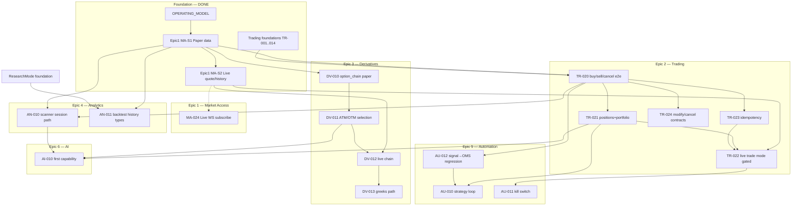

# Trading OS — Delivery Dependency Graph

**Updated:** 2026-07-09  
**Constitution:** [`docs/OPERATING_MODEL.md`](../docs/OPERATING_MODEL.md)  
**Backlog:** [`ENGINEERING_BACKLOG.md`](./ENGINEERING_BACKLOG.md)

Work is capability-first. Edges mean **hard dependency** (must ship / be green first).  
Dashed mental edges: soft preference only.

---

## Graph (Mermaid)



---

## Wave plan (parallelizable)

| Wave | Parallel streams | IDs | Gate to next wave |
|------|------------------|-----|-------------------|
| **W0** | Constitution + Epic1 MVP | OM, MA-S1/S2 | **DONE** |
| **W1** | Trading paper + Derivatives paper + Analytics smoke | TR-020/021/023, DV-010/011, AN-010 smoke | e2e green |
| **W2** | Live trade gated + live chain + MA-024 | TR-022/024, DV-012, MA-024 | gated live green |
| **W3** | Automation + backtest alignment | AU-010/011/012, AN-011 | sim strategy green |
| **W4** | AI only after 1–3 stable | AI-010 | product definition |

### W1 dependency matrix (this execution)

```
          TR-020  TR-021  TR-023  DV-010  DV-011  AN-010  MA-024
TR-020      —       →       →       ·       ·       ·       ·
TR-021      ←       —       ·       ·       ·       ·       ·
TR-023      ←       ·       —       ·       ·       ·       ·
DV-010      ·       ·       ·       —       →       ·       ·
DV-011      ·       ·       ·       ←       —       ·       ·
AN-010      soft    ·       ·       ·       ·       —       ·
MA-024      ·       ·       ·       ·       ·       ·       —  (isolated; live only)
```

`→` = supplies dependency · `←` = depends on · soft = preferred but not blocking

---

## Agent team assignment (W1)

| Agent | Role | Owns | Must not |
|-------|------|------|----------|
| **T1 Trading** | OMS/Execution | TR-020, TR-021, TR-023 tests + any paper position gap | Live orders, broker rewrites |
| **T2 Derivatives** | Options product | DV-010, DV-011 e2e + docs | Greeks engine rewrite |
| **T3 Analytics** | Research path | AN-010 smoke: scanner or documented entry via session | Merge dual scanners |
| **T4 Market data** | Live stream stretch | **Done:** MA-024 deferred (wiring+WS fragile); Epic 1 closed for delivery | Architecture freeze breaks |
| **T5 Integration** | Dependency graph + backlog status | This file, ENGINEERING_BACKLOG updates, cross-link | New epics without value |

---

## Explicit non-goals (all waves)

- Standalone refactor epics  
- Full Dhan/Upstox rewrites  
- AI platform before Epics 1–3  
- HA multi-writer OMS without product requirement  

---

## Exit criteria for W1

- [x] `tests/e2e/test_trading_object_model.py` — TR-020/021/023 (11 tests)  
- [x] `tests/e2e/test_derivatives_object_model.py` — DV-010/011 (4 tests); paper chain spot fix  
- [x] Analytics: `tests/e2e/test_analytics_session_smoke.py` + scanner README session entry  
- [x] Backlog statuses updated; Epic 1 marked done with MA-024 deferred  
- [x] Combined W1 suite: **38 passed** (no Category A regressions on paper money path)  

### W1 multi-agent execution log (2026-07-09)

| Agent | Epic | Result |
|-------|------|--------|
| T1 Trading | TR-020/021/023 | 11 e2e green |
| T2 Derivatives | DV-010/011 | 4 e2e green; paper `option_chain` spot fix |
| T3 Analytics | AN-010 | 2 e2e green; session→scanner |
| T4 Market data | Epic1 close | MA-024 deferred; `list_capabilities` Boy Scout |
| T5 Integration | Graph + suite | Backlog + 38-test gate |

### W2 exit (2026-07-09) — **DONE**

- [x] MA-024: Dhan `subscribe` → correct `stream(mode=, on_tick=)` + QuoteSnapshot normalize  
- [x] TR-022: trade mode OMS_REQUIRED / process OMS enables orders (`test_trading_w2.py`)  
- [x] TR-024: paper modify/cancel + OrderServicePort surface  
- [x] DV-012: gated live chain ATM + universe.index path  

### Sandbox order placement (product gate)

Not “no orders ever” — **sandbox** is the write-path environment:

| Item | Detail |
|------|--------|
| Env | `DHAN_ENVIRONMENT=SANDBOX` via `.env.dhan.sandbox` (materialized from `DHAN_SANDBOX_*`) |
| Flag | `DHAN_ALLOW_LIVE_ORDERS=1` |
| Tests | `tests/e2e/test_sandbox_product_orders.py` (`-m sandbox`) |
| Fix | `DhanBrokerGateway.place_order` → `BrokerOrderPayload` (was broken TypeError) |
| LIVE money | Still desk-gated; default allow-orders off |

### W3 exit (2026-07-09) — **DONE**

- [x] AU-012 SignalDTO → session OMS (`tests/e2e/test_automation_w3.py`)
- [x] AU-010 strategy loop over session history → orders
- [x] AU-011 kill switch blocks then clears on paper OMS
- [x] AN-011 backtest pure_sim on `Instrument.history` DataFrame + PARITY requires OMS

### Post-W3 (2026-07-09) — **partial**

- [x] DV-013 paper greeks / PCR / max-pain (`test_derivatives_greeks.py`)
- [x] Sandbox smoke CLI: `scripts/sandbox_order_smoke.py` (token still DH-906 until user refreshes sandbox token)
- [x] Dhan `list_capabilities` for session kernel

### Still operator-owned

```
Sandbox    refresh DHAN_SANDBOX_ACCESS_TOKEN (sandbox-issued, not LIVE) → green place/cancel
Epic 6     AI only after 1–5 stable in production use
```
