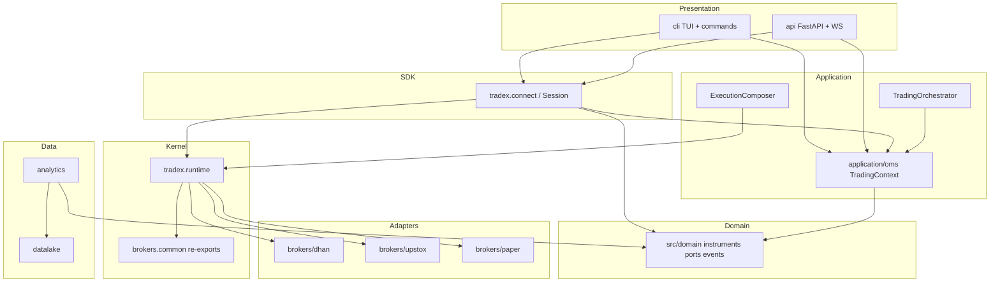
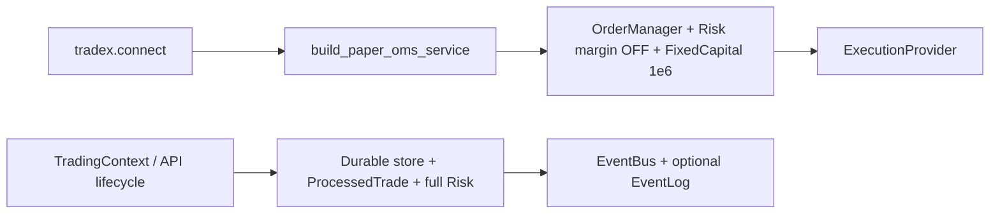
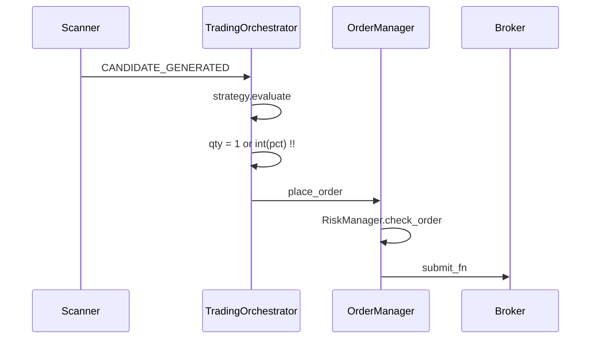
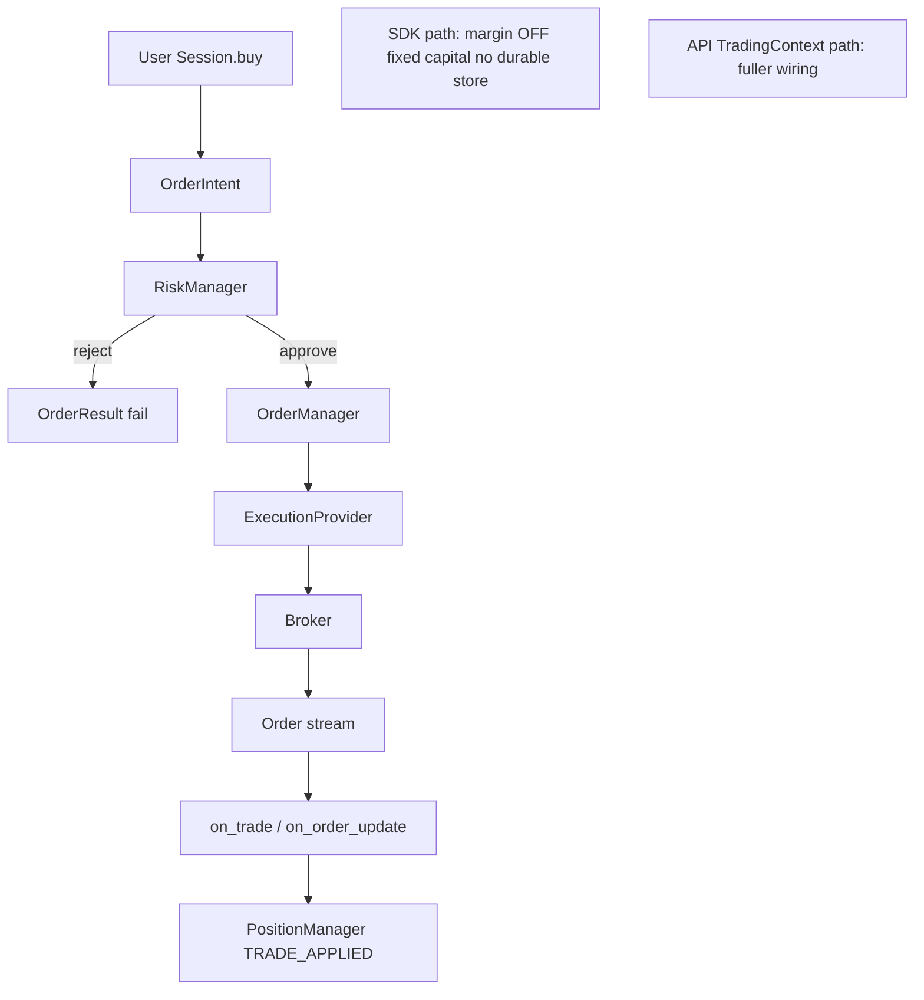

# Full Independent System Review — Trade_XV2

| Field | Value |
|-------|--------|
| **Date** | 2026-07-09 |
| **Branch** | `refactor/brokers-consolidation` (mid-refactor working tree) |
| **Corpus** | ~1,726 Python files · ~263k LOC (excl. venv) |
| **Method** | Static + structural analysis; graphify; parallel specialist agents; file-cited evidence only |
| **Stance** | Independent of `ARCHITECTURE_REVIEW_BOARD_2026-07-09.md` — re-derived; may confirm or refute prior claims |
| **Assumption** | Platform will trade **real money** |

**Corpus sinks (LOC):** `brokers` 67.1k · `tests` 45.7k · `analytics` 23.1k · `cli` 22.2k · `src/domain` 18.0k · `datalake` 17.4k · `application` 14.2k · `infrastructure` 13.8k · `tradex` 13.6k · `api` 7.5k.

**Presentation layer:** Python TUI (`cli/views/tui_app.py`, `cli/widgets/*`) + FastAPI REST/WS (`api/`, `api/ws/`). **No JS/TS SPA.**

---

## 1. Executive Summary

Trade_XV2 is a serious multi-broker quant monorepo with **genuine institutional pieces** (OMS state machine, trade idempotency design, kill switch, circuit breakers, event bus with DLQ hooks, paper/live adapters, datalake). It is **not production-safe for unsupervised real-money trading** on the default SDK path.

### Headline judgment

| Lens | Verdict |
|------|---------|
| Architecture intent | Strong hexagonal vocabulary; mid-migration dual homes |
| Live order safety | Split brain: full `TradingContext` vs lightweight `tradex.connect` OMS |
| Research vs live parity | **Broken by defaults** (sizing, OMS optional in backtest, double slippage, no open MTM in replay equity) |
| Broker adapters | Dhan relatively mature; **Upstox modify path critically broken**; paper too optimistic |
| Event recovery | Documented recovery **not wired** on primary CLI path |
| Security | API **defaults to auth none**; metrics public; WS key-in-query |
| Architecture CI | Partially fixed domain isolation; other fitness tests still false-green |

### Top 5 real-money blockers (do not ship live without)

1. **`tradex.connect` live uses paper-grade OMS** — margin checks off, fixed ₹1M capital, no durable order store (`tradex/session.py`, `application/oms/session_bridge.py`).
2. **Upstox `modify_order` gateway/adapter contract break** — successful broker modifies reported as failures (`brokers/upstox/orders/order_command_adapter.py`, `gateway.py`).
3. **Crash-replay can apply positions for OMS-rejected trades** (`application/oms/context.py` ~457–469).
4. **Live signal sizing defaults to qty=1 / misreads % as shares** (`application/trading/trading_orchestrator.py` `_calculate_quantity`).
5. **API auth mode default `none`** (`api/config.py`) — trading routers protected only if ops override.

### What is already good

- Canonical domain `Order` entity; OMS `OrderManager` risk gate design; lock released around broker I/O.
- Event bus handler isolation + DLQ hooks (when attached).
- Dhan place idempotency lock + correlation id; cancel body validation (single order).
- Domain isolation test now scans `src/domain` (recent purity fix).
- Kill-switch atomicity tests and risk manager locking.

### Overall production readiness (weighted)

**3.9 / 10** — research & paper OK with caveats; **live money requires P0 remediation list below.**

---

## 2. Architecture Assessment

### 2.1 Current architecture map

### 2.2 Bounded contexts (reality)

| Package | Intended BC | Reality |
|---------|-------------|---------|
| `src/domain` | Pure model + ports | Mostly clean; process-global default provider |
| `application/oms` | Order/position/risk use-cases | Real OMS; dual lightweight vs full context |
| `tradex.runtime` | Platform kernel | True home of former `brokers.common` logic |
| `brokers.*` | Adapters | Real adapters + large shim surface |
| `analytics` | Research | Event-capable scanners; optional OMS |
| `datalake` | Persistence | Storage + residual scanner SQL engine |
| `cli` / `api` | Presentation | CLI still god-service composition root |

### 2.3 Dependency direction vs import-linter

| Contract claim | Truthful? |
|----------------|-----------|
| Domain ↛ outer layers | **Mostly yes** (strongest) |
| Application ↛ concrete dhan/upstox | Yes for prod modules |
| Application ↛ infrastructure | Mostly for prod OMS (ports); tests couple heavily |
| Tradex ↛ dhan/upstox | **False** — composition root imports brokers |
| CLI ↛ brokers | **False** — facade ignore allows `brokers.**` |
| Application ↛ tradex.runtime | Untracked (composer depends on runtime) |

**Silent wrong:** import-linter “Application infrastructure separation” ignores composer→runtime chains that are not even in `forbidden_modules = infrastructure`.

### 2.4 Dual composition roots (critical architectural smell)

Operators using the public SDK believe they have an “institutional spine”; they do not match the API/`TradingContext` path.

### 2.5 Architecture findings (ranked)

| Sev | Finding | Evidence |
|-----|---------|----------|
| **C** | Live `tradex.connect` uses paper OMS defaults | `tradex/session.py:106-110`, `session_bridge.py:157-182` |
| **C** | Dual order spines unequal safety | `universe.py` OMS optional; `context.py` full wiring |
| **C** | Unmapped status → `OrderStatus.OPEN` | `session_bridge.py:81-105` |
| **H** | Import-linter contracts misleading | `pyproject.toml` + tradex broker imports |
| **H** | Dual home shims `brokers.common` ↔ `tradex.runtime` | dozens of star re-exports |
| **H** | Gateway factory fail-soft (`None` + generic execution fallback) | `gateway_factory.py`, `adapter_factory.py` |
| **H** | Phantom capital defaults | `PHANTOM_CAPITAL_INR`, session_bridge FixedCapital |
| **M** | Dual `OptionChain`, dual/triple Session names | domain packages + tradex.Session alias |
| **M** | Extensions not attached in `tradex.connect` | registry exists; connect does not wire |
| **M** | Residual `brokers.common.oms` naming | margin adapter only, name confuses |
| **L** | Global `set_default_provider` process-wide | `provider_registry.py` |

---

## 3. Quantitative System Assessment

### 3.1 Signal → order path

| Layer | Hits OMS? |
|-------|-----------|
| `analytics/strategy` pure evaluate | No |
| `analytics/scanner` candidates | Events only |
| `datalake/scanner` SQL rules | No |
| `TradingOrchestrator` | **Yes** |
| Default `BacktestEngine` | **No** (pure simulate) |
| `PaperTradingEngine` | Yes (requires context) |

### 3.2 Quant findings

| Sev | Finding | Evidence |
|-----|---------|----------|
| **C** | Live sizing qty=1 / `int(position_size_pct)` | `trading_orchestrator.py:397-402` vs `domain/execution/sizing.py` |
| **C** | OMS-routed replay double-applies slippage | `analytics/replay/engine.py` + `oms_backtest_adapter.py` |
| **H** | Default backtest/walk-forward skip OMS risk | `BacktestEngine` `allow_simulate_without_oms=True` |
| **H** | Replay equity = cost basis, not open MTM | `replay/models.py` `current_equity` |
| **H** | Dual scanners; only analytics emits live candidates | `analytics/scanner` vs `datalake/scanner` |
| **H** | FastBacktest look-ahead bias documented | `analytics/backtest/fast_backtest.py` |
| **M** | Paper/sim fills always 100%; no partials | `paper_orders.py`, simulated_fill |
| **M** | Default fill model CURRENT_CLOSE same-bar | `replay/models.py` |
| **M** | PnL float capital vs Decimal exits; API float cast | replay + portfolio_service |
| **M** | MARKET notional ≈ qty when price=0 in risk | `risk_manager.py:296-300` |
| **M** | Walk-forward ignores train window (no fit) | `walk_forward/engine.py` |

### 3.3 Parity matrix

| Concern | Live OMS | Paper broker | Replay default | Backtest default |
|---------|----------|--------------|----------------|------------------|
| Risk gates | Yes | If OMS wired | Optional | Off |
| Sizing | Broken default | Depends path | `compute_order_quantity` | Same as replay |
| Partials | Modeled | Instant full | Full | Full |
| Open MTM | Domain Position | Bar close | **No** | **No** |
| Slippage | Broker | N/A | Can double on OMS path | Config |

---

## 4. Code Smells & Anti-Patterns

| Sev | Smell | Location |
|-----|-------|----------|
| **C** | God class `BrokerService` ~1006 LOC | `cli/services/broker_service.py` |
| **C** | God `TradingContext` wiring+ops+signals | `application/oms/context.py` |
| **H** | God data `capability_manifest.py` 1279 LOC | `src/domain/capability_manifest.py` |
| **H** | Dead monolith `brokers/dhan/websocket.py` vs package | import uses package only |
| **H** | Triple order commands Intent / OmsOrderCommand / OrderRequest | domain + OMS |
| **H** | `ViewManager` shadowed methods (half extract) | `analytics/views/manager.py` |
| **H** | CLI cycle broker_service ↔ oms_setup ↔ capital_provider | TYPE_CHECKING cycle |
| **H** | Deprecated aggregates still imported | analytics + domain __init__ |
| **M** | Dual homes shims mid-migration | `brokers.common` → `tradex.runtime` |
| **M** | Dhan `OrdersAdapter` kwargs slice API | `orders.py` |
| **M** | String side/type at ports | `broker_gateway.py`, CLI |
| **M** | StreamOrchestrator / HistoricalCoordinator fat | tradex.runtime |
| **M** | Replay dual fill pipelines | OMS vs pure simulate |

**Largest files (maintainability heat):** capability_manifest 1279 · dhan websocket package feeds ~1k · broker_service 1006 · upstox gateway 967 · stream_orchestrator 872 · replay engine 864 · OMS context 755 · order_manager 722.

---

## 5. Testing Gaps

### 5.1 Pyramid snapshot (test module counts under `tests/`)

| Layer | ~Modules | Notes |
|-------|----------|-------|
| unit | 8 | Thin relative to monorepo size |
| integration | 27 | Broker-heavy |
| e2e | 16 | Good coverage of flows; mock-heavy |
| chaos | 12 | Valuable but synthetic |
| property | 4 | Undersized |
| architecture | 13 | Mixed truthfulness |
| performance | 3 | Misses OMS/WS hot paths |

Plus extensive package-local tests under `brokers/*/tests`, `application/oms/tests`, `src/domain/tests`.

### 5.2 False-green / weak guards

| Issue | Evidence |
|-------|----------|
| Fitness `test_no_direct_logging` exempts application/domain/analytics | `test_architecture_fitness.py` |
| Security pickle suite **skips** on findings | `tests/test_security_findings.py` |
| Domain isolation **was** silent no-op; **fixed** to `src/domain` | `test_domain_isolation.py` |
| import-linter tradex/CLI contracts not matching reality | `pyproject.toml` |
| Benchmarks not on place_order / WS / bus | `tests/performance`, `.benchmarks` |

### 5.3 Critical untested / under-tested behaviors

- Upstox modify adapter returns `OrderResponse` but gateway expects dict **[gap]**.
- Crash-replay position application after OMS reject **[gap]**.
- Multi-thread reentrancy guard under concurrent feeds **[gap]**.
- Live sizing with `position_size_pct` **[gap]**.
- EventLog attached to bus on CLI path **[gap]**.

---

## 6. Reliability & Failure Modes

### 6.1 Strengths

- EventBus: handler isolation, optional DLQ, sequence numbers, replay_mode.
- OMS: correlation_id idempotency, pending set, risk lock, kill switch RLock.
- Dhan: split CBs, multi-bucket rate limits, order stream fill delta cache.
- Reconciliation service exists; kill-switch integration tests.

### 6.2 Failure modes (real money)

| Sev | Mode | Evidence |
|-----|------|----------|
| **C** | Replay applies positions for rejected trades | `context.py` always calls `on_trade_applied` after `on_trade` |
| **C** | Trade ledger mark-before-commit window | `order_manager.record_trade` order of operations |
| **H** | CLI EventLog not on EventBus → recovery hollow | `oms_setup.py` vs bus ctor |
| **H** | Reentrancy depth process-global → dropped concurrent events | `reentrancy_guard.py` |
| **H** | Bus marks event_id before success → DLQ redrive broken | `event_bus.py` |
| **H** | AsyncEventBus wrong critical set / drops TRADE | `async_event_bus.py` |
| **H** | Upstox WS stops after 5 reconnects | `v3_auto_reconnect.py` |
| **H** | Empty health registry → HEALTHY | `infrastructure/health.py` |
| **H** | Daemon recon threads + SQLite SPOF | reconciliation_service, SqliteOrderStore |
| **H** | `subscribe_all` deadlock | `event_bus.py` non-reentrant lock |
| **M** | BufferedEventLog can lose last N events | event_log buffer |
| **M** | Capital fallback softens risk | capital_provider |
| **M** | Dhan cancel_all blind success | `orders.py` |

### 6.3 End-to-end order flow (intended vs actual SDK)

---

## 7. Security Assessment

| Sev | Finding | Evidence |
|-----|---------|----------|
| **C** | App default `auth_mode=none` | `api/config.py:59`, overrides auth.py env default |
| **C** | WS accept-then-close; API key in query | `api/auth.py` reject_ws_if_unauthorized |
| **H** | Ephemeral random API_KEY if unset | `api/auth.py` |
| **H** | Public `/metrics` recon surface | PUBLIC_PATHS + health router |
| **H** | Risk capital placeholder if fail-open armed | broker_service dual-gate + capital_provider |
| **M** | Secrets env/file only; no vault | secrets_manager modules |
| **M** | OMS audit memory-bounded (100/order) | order_audit_logger |
| **M** | Dual audit paths underused for REST identity | application/audit.py vs OMS |
| **L** | Pickle avoided in Upstox loader (positive) | instruments/loader.py comments |

**Positive:** Order schemas validate bounds; trading routers declare `require_auth` when mode actually enabled; kill-switch tests exist.

---

## 8. Performance Assessment

| Area | Assessment | Tag |
|------|------------|-----|
| OMS lock scope | Releases lock during broker I/O — correct | Good design |
| Event bus | Sync fan-out; slow handler blocks others | **[RUNTIME-VERIFY]** under tick load |
| WS scaling | Per-broker feeds; no shared backpressure story | **[RUNTIME-VERIFY]** |
| Memory | Bounded caches (trade ids, DLQ, last_tick Dhan); Upstox last_tick unbounded | Medium risk |
| Benchmarks | DuckDB/parquet + synthetic PnL; **not** place_order/WS | Gap |
| Hot files | market_feed ~1k, stream_orchestrator 872, historical_coordinator 703 | Complexity cost |

No p50/p99 numbers asserted — none stored as production SLOs in-repo.

---

## 9. Refactoring Roadmap (actionable, ordered)

### Phase 0 — Stop the bleeding (1–3 days) **P0**

| ID | Action | Owner area |
|----|--------|------------|
| P0.1 | Split `build_oms_service`: paper vs live; live requires capital+margin+durable store or refuse | tradex + application |
| P0.2 | Fix Upstox modify adapter↔gateway contract + error parsing | brokers/upstox |
| P0.3 | Fail closed on unmapped order status (no OPEN invent) | session_bridge + status_mapper |
| P0.4 | Set API `auth_mode` default to `api_key` and fail boot if key missing in prod | api |
| P0.5 | Fix EventBus `subscribe_all` reentrancy / attach EventLog to bus on CLI | infrastructure + cli |
| P0.6 | Replay: apply positions only if trade accepted | application/oms/context |

### Phase 1 — Parity & correctness (1–2 weeks)

| ID | Action |
|----|--------|
| P1.1 | Live sizing via `compute_order_quantity` + capital/LTP |
| P1.2 | Slippage once on replay OMS path; MTM open equity in replay |
| P1.3 | Default research path through OMS or label pure-sim non-parity |
| P1.4 | Upstox unbounded reconnect + place idempotency lock + require correlation_id |
| P1.5 | Dhan `_wrap` use `message`; fix `cancel_all` honesty |
| P1.6 | Thread-local reentrancy depth; bus idempotency mark-after-success |
| P1.7 | Collapse scanner dual engines; document live event path only |

### Phase 2 — Architecture truth (2–6 weeks)

| ID | Action |
|----|--------|
| P2.1 | Single composition root; delete/ban `use_oms=False` for live |
| P2.2 | Expire `brokers.common` shims; one import path |
| P2.3 | Rewrite import-linter to match reality (composition roots allowlisted) |
| P2.4 | Split BrokerService / TradingContext |
| P2.5 | Split capability_manifest; delete dead dhan websocket monolith |
| P2.6 | One public order command type; remove aliases after codemod |
| P2.7 | Finish ViewManager extract; remove shadow methods |

### Phase 3 — Hardening (1–3 months)

| ID | Action |
|----|--------|
| P3.1 | Partial-fill sim models; next-open default fill option |
| P3.2 | HA-ready order store / multi-process single-writer enforcement |
| P3.3 | WS latency/OMS p99 CI gates **[RUNTIME-VERIFY]** |
| P3.4 | Secrets vault / key rotation for multi-tenant API |
| P3.5 | Property tests for order FSM + risk invariants |
| P3.6 | Paper resting book for cancel/modify parity |

---

## 10. Production Readiness Scorecard

Scores 1–10. Weight reflects real-money impact.

| Axis | Score | Weight | Weighted | Rationale |
|------|------:|-------:|---------:|-----------|
| Domain model purity | 6.5 | 0.08 | 0.52 | Ports + Instrument solid; aggregates debt; dual types |
| Dependency / layering truth | 4.0 | 0.08 | 0.32 | Contracts lie; dual homes |
| OMS / order correctness | 4.5 | 0.15 | 0.68 | Good core, dual spines, status coercion |
| Risk management | 5.0 | 0.12 | 0.60 | Solid gates when wired; phantom capital; MARKET notional |
| Broker adapters | 4.0 | 0.12 | 0.48 | Dhan OK; Upstox modify critical; paper optimistic |
| Market data integrity | 5.5 | 0.08 | 0.44 | Dedup/validate present; backfill-as-tick risk |
| Event / recovery | 3.5 | 0.10 | 0.35 | Design good; wiring and replay bugs |
| Research/live parity | 3.0 | 0.10 | 0.30 | Defaults diverge hard |
| Testing honesty | 4.5 | 0.07 | 0.32 | Volume high; false-green still |
| Security | 3.0 | 0.10 | 0.30 | Auth default none; public metrics |
| **Overall** | | **1.00** | **4.31** | **Not ready for unsupervised live** |

Rounded narrative score: **~4.3 / 10**.

---

## 11. Prioritized Action Plan

### 11.1 Top 20 Risks (real money)

1. Live SDK OMS with margin disabled + fake capital  
2. Upstox modify false failures / false adapter success  
3. Double place after Dhan HTTP retry + incomplete broker idempotency  
4. Crash-replay double/skip positions  
5. API open by default (`auth_mode=none`)  
6. Live strategies trading qty=1 or wrong %  
7. Event recovery not attached on CLI  
8. Concurrent event drops via reentrancy guard  
9. Upstox feed dies after 5 reconnects  
10. Unmapped order status forced OPEN  
11. Double slippage in OMS backtests → wrong research  
12. Backtests skip risk → live rejects surprises  
13. Kill-switch cancel_all reports success blindly (Dhan)  
14. Capital fallback distorts risk  
15. Empty health = HEALTHY  
16. WS API key in query logs  
17. Public metrics recon  
18. Paper instant fill false confidence  
19. Multi-process SQLite split-brain  
20. AsyncEventBus drops non-“critical” money events  

### 11.2 Top 20 Improvements

1. Unified production composition root  
2. Fix Upstox modify end-to-end  
3. Fail-closed status mapping  
4. Wire EventLog to EventBus everywhere  
5. Fix live position sizing  
6. Replay position apply only on accepted trades  
7. Mark-after-success bus/trade ledger semantics  
8. Secure API defaults + boot fail if no key  
9. Upstox infinite reconnect + place locks  
10. Single slippage application  
11. Replay open MTM equity  
12. Delete dead websocket monolith  
13. Truthful import-linter  
14. Split BrokerService  
15. One OrderIntent public API  
16. Expire common shims  
17. Scanner single path + event docs  
18. Partial-fill simulation  
19. Performance CI on hot paths  
20. Paper resting-order mode  

### 11.3 Quick wins (1–2 days)

- Auth default + fail-closed missing API_KEY in prod profiles  
- `subscribe_all` lock fix  
- session_bridge fail-closed status  
- Disable/warn live connect when margin off  
- Delete `brokers/dhan/websocket.py` if import graph confirms unused  
- Fix Dhan transport `_wrap` message field  

### 11.4 Medium (1–4 weeks)

- Full live OMS factory = TradingContext parity  
- Upstox order lifecycle suite green on real contracts  
- Sizing + slippage + MTM fixes  
- Event recovery e2e test green  
- Fitness tests stop skipping  

### 11.5 Long-term (1–6 months)

- Shim deletion + BC map enforcement  
- HA order store  
- Full parity certification gate (research ≡ paper ≡ live adapters)  
- Secrets/ops hardening  
- Continuous WS/OMS latency SLOs  

---

## Appendix A — Four lenses (per major area)

| Area | Silent wrong | Real-time break | Unsafe assumption | Implicit vs explicit |
|------|--------------|-----------------|-------------------|----------------------|
| Architecture | import-linter green while tradex imports brokers | dual roots under load | “connect = institutional” | shims hide migration |
| Quant | backtest without risk | qty=1 live | fill at close | two scanners |
| Events | recovery docs vs wiring | reentrancy drops | single-writer process | bus optional log |
| Brokers | modify “fails” after success | WS max retries | correlation always set | paper always filled |
| Security | auth none default | WS flood after accept | env files enough | metrics “public health” |
| TUI | fake WS metrics | UI thread blocked | green = connected | random latency |

---

## Appendix B — Mapping 13 review areas → document sections

| # | Area | Primary section(s) |
|---|------|-------------------|
| 1 | Architecture/DDD | §2 |
| 2 | Quant readiness | §3 |
| 3 | Event-driven | §6 |
| 4 | Code quality | §4 |
| 5 | Presentation/TUI | §7–8, A |
| 6 | Broker integration | §6–7, §3 |
| 7 | Market data | §3, §6 |
| 8 | Testing | §5 |
| 9 | Reliability/SRE | §6 |
| 10 | Security | §7 |
| 11 | Performance | §8 |
| 12 | Repo org | §2, §4 |
| 13 | Scorecard + plan | §10–11 |

---

## Appendix C — Method & independence note

- **Orientation:** LOC map, largest files, graphify neighborhoods for OMS/events, import-linter run, presentation layout.  
- **Evidence agents:** Architecture, Quant, Events, Smells, Broker+MD, Quality/SRE/Sec/Perf/TUI (6 parallel explore agents).  
- **Independence:** Prior board report not used as ground truth. Domain purity fixes (isolation path, pandas) observed as *current tree state*, not assumed from board narrative.  
- **Not claimed:** Measured live latencies, live exchange behavior, broker-side correlationId guarantees beyond code paths **[RUNTIME-VERIFY]**.

---

## Appendix D — Completeness checklist (11 deliverables)

| # | Deliverable | Present |
|---|-------------|---------|
| 1 | Executive Summary | §1 |
| 2 | Architecture Assessment | §2 |
| 3 | Quantitative System Assessment | §3 |
| 4 | Code Smells & Anti-Patterns | §4 |
| 5 | Testing Gaps | §5 |
| 6 | Reliability & Failure Modes | §6 |
| 7 | Security Assessment | §7 |
| 8 | Performance Assessment | §8 |
| 9 | Refactoring Roadmap | §9 |
| 10 | Production Readiness Scorecard | §10 |
| 11 | Prioritized Action Plan | §11 |

**Four lenses** applied in §1, §3, §6, Appendix A.

---

*End of full independent system review.*
